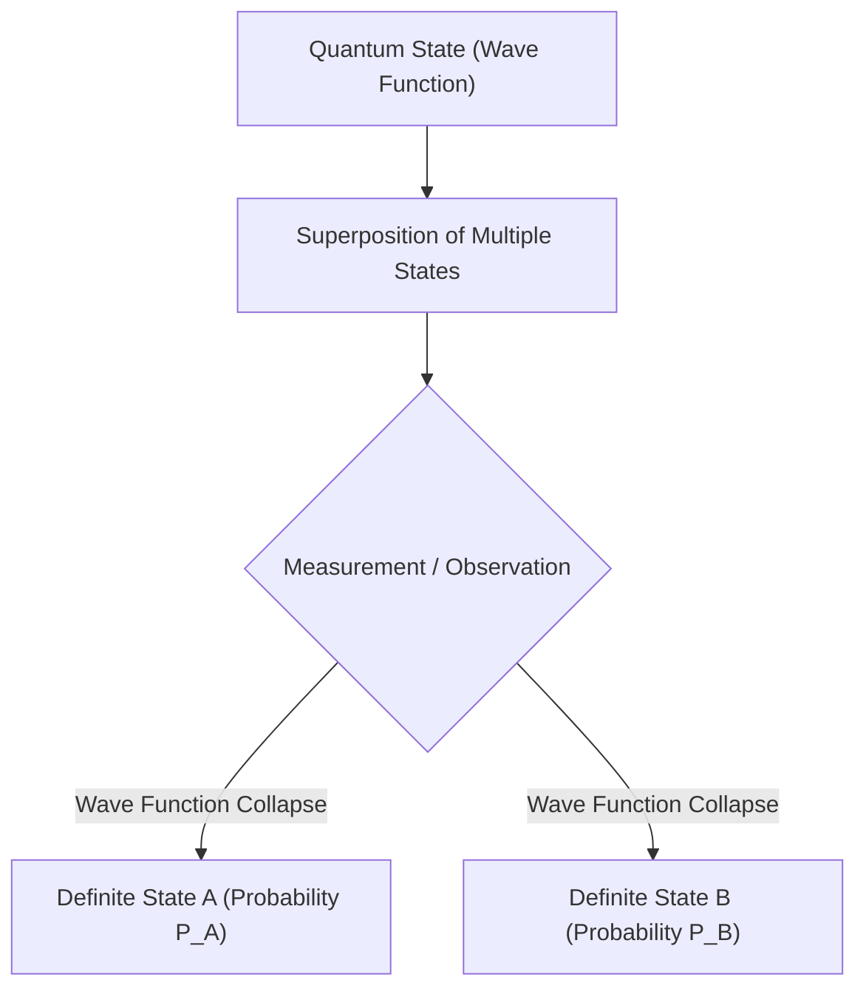

## 1. はじめに：常識を打ち破るミクロの世界

私たちが日常生活で経験する現象の多くは、ニュートン力学をはじめとする「古典物理学」によって非常に正確に説明することができます。リンゴが木から落ちる軌道、惑星の公転、ビリヤードの球の衝突など、これらの運動はすべて決定論的であり、初期条件さえわかれば未来のすべてを予測することが可能です。

しかし、20世紀初頭に物理学者たちが原子や電子といった極微の世界（ミクロの世界）の探求を始めると、古典物理学の枠組みでは決して説明できない奇妙な現象が次々と発見されました。光は波なのか粒子なのか？電子はどこに存在するのか？これらの根源的な問いに対する答えとして生み出されたのが、「量子力学（Quantum Mechanics）」です。

量子力学は、現代物理学の最も成功した理論の一つであり、半導体、レーザー、MRI、そして昨今話題の量子コンピューターに至るまで、現代のテクノロジー社会の根幹を支えています。本記事では、この量子力学の奇妙で魅力的な基礎概念について、「二重スリット実験」と「シュレーディンガーの猫」という有名な2つの思考実験・物理実験を交えながら、詳細かつ包括的に解説していきます。

## 2. 光と電子の正体：波と粒子の二重性

量子力学における最も革新的な概念の一つが、「波と粒子の二重性（Wave-particle duality）」です。古典物理学では、物質は「粒子」であり、光や音は「波」であると明確に区別されていました。しかし、量子力学の世界では、すべての物質や光が、波としての性質と粒子としての性質の両方を併せ持っているとされます。

この概念の端緒を開いたのは、1905年のアルベルト・アインシュタインによる「光量子仮説」です。彼は、光が連続的な波ではなく、「光子（フォトン）」というエネルギーの塊（粒子）として振る舞うと考え、光電効果を見事に説明しました。その後、1924年にルイ・ド・ブロイは「光が粒子の性質を持つのなら、逆に電子のような粒子も波の性質を持つのではないか」という「物質波」の仮説を提唱し、後に実験によってその正しさが証明されました。

## 3. 量子力学の核心：「二重スリット実験」

この「波と粒子の二重性」を最も強烈に、そして直感に反する形で示すのが「二重スリット実験（Double-slit experiment）」です。リチャード・ファインマンが「量子力学のすべてのミステリーがここにある」と評したこの実験は、量子力学の奇妙さを理解する上で避けて通れません。

### 実験の概要

実験のセットアップは非常にシンプルです。
1. 電子銃（電子を一つずつ発射する装置）を用意します。
2. その先に、細いスリット（隙間）が2つ並んだ壁を置きます。
3. さらにその後ろに、電子が到達した場所を記録するスクリーン（検出器）を置きます。

### もし電子が単なる粒子なら？

電子がビリヤードの球のような単なる「粒子」であれば、2つのスリットのいずれかを通り抜け、スクリーン上にはスリットの形に対応した「2本の線」の跡ができるはずです。

### もし電子が単なる波なら？

水面に広がる波を2つのスリットに通したと想像してください。それぞれのスリットから新しい波面が広がり、2つの波が重なり合って干渉します。山と山が重なると強め合い、山と谷が重なると打ち消し合うため、スクリーン上には縞模様（干渉縞）が現れます。

### 驚愕の実験結果

実際に電子を一つずつ、非常に長い時間をかけて発射し続けると、スクリーン上にはどういうわけか**「干渉縞」**が現れます。電子を「一つずつ」発射しているにもかかわらず、です。
これは、1つの電子が「波」のように空間に広がり、**右のスリットと左のスリットの両方を同時に通り抜け**、自分自身と干渉し合っているとしか考えられません。

### 「観測」が現実を変える

さらに奇妙なことが起こります。物理学者たちは、「電子が本当に両方のスリットを通っているのか確かめよう」と考え、スリットのそばに観測器（センサー）を置き、電子が右と左のどちらを通ったかを「観測」しました。
すると、電子がどちらを通ったかが分かった途端、スクリーン上の干渉縞は消滅し、ただの「2本の線」になってしまったのです。
つまり、「人間（あるいは測定器）が観測する」という行為そのものが、電子の振る舞いを波から粒子へと変えてしまったのです。これを「観測問題（Measurement problem）」と呼びます。

## 4. 状態の重ね合わせと確率解釈

二重スリット実験が示す「同時に複数の経路を通る」という性質を、量子力学では「状態の重ね合わせ（Superposition）」と呼びます。

量子力学において、電子などの粒子は、特定の場所に「存在する」のではなく、様々な場所に存在する可能性が「波のように広がって重ね合わさっている」と考えます。これを記述するのが**「波動関数（Wave function）」**です。
1926年にマックス・ボルンは、この波動関数の振幅の2乗が、その場所で粒子が発見される「確率」を表しているという「確率解釈（コペンハーゲン解釈）」を提唱しました。

つまり、観測する前の電子は「右のスリットを通る状態」と「左のスリットを通る状態」が重なり合って存在していますが、観測という行為を行った瞬間に波動関数が「収縮（崩壊）」し、どちらか一方の状態に決定されるというのです。古典物理学のような決定論は完全に崩れ去り、宇宙の根本的なルールが「サイコロの目」のような確率に支配されていることが示されました。この考えに対し、アインシュタインは「神はサイコロを振らない」と言って最後まで抵抗したことは有名です。

## 5. シュレーディンガー方程式と世界の記述

このような量子系の状態が時間とともにどのように変化していくかを記述する、量子力学における最重要の方程式が「シュレーディンガー方程式（Schrödinger equation）」です。エルヴィン・シュレーディンガーによって1926年に導出されました。

$$ i\hbar \frac{\partial}{\partial t} \Psi(\mathbf{r},t) = \hat{H} \Psi(\mathbf{r},t) $$

ここで、$\Psi$（プサイ）は波動関数、$\hat{H}$ はハミルトニアン（系の全エネルギーを表す演算子）、$\hbar$ はディラック定数（プランク定数を $2\pi$ で割ったもの）を表します。ニュートン力学における運動方程式に相当するものであり、この方程式を解くことで、原子内の電子の軌道やエネルギー準位などを正確に計算することができます。現代の化学や物質科学の大部分は、実のところこのシュレーディンガー方程式の応用であると言っても過言ではありません。

## 6. パラドックスの極み：「シュレーディンガーの猫」

コペンハーゲン解釈（観測するまで状態は重なり合っており、観測した瞬間に状態が決定する）は、ミクロの世界を説明する上では見事に機能しました。しかし、シュレーディンガー自身も、この「観測による波動関数の収縮」という概念には強い違和感を覚えていました。

ミクロの奇妙な性質が、もしマクロ（日常的）な世界に持ち込まれたらどうなるのか？その矛盾を指摘するためにシュレーディンガーが考案した思考実験が、世にも有名な**「シュレーディンガーの猫（Schrödinger's Cat）」**です。

### 思考実験のセットアップ

1. 中身が見えない鋼鉄の箱を用意し、その中に生きた1匹の「猫」を入れます。
2. 箱の中には、放射性物質を組み込んだ特殊な装置が置かれています。
3. この放射性物質は、1時間の間に50%の確率で原子核崩壊を起こします。
4. もし崩壊が起きれば、放射線検知器がそれを感知し、ハンマーが振り下ろされて青酸ガスの入った瓶が割れ、猫は死んでしまいます。
5. 崩壊が起きなければ、ガスは発生せず、猫は生きたままです。

### 観測するまでの猫の状態は？

原子核の崩壊は完全に量子力学的な現象であり、「崩壊した状態」と「崩壊していない状態」が50%ずつの確率で「重ね合わせ」になっています。
コペンハーゲン解釈によれば、箱を開けて中を「観測」するまでの間、放射性物質は「崩壊している」かつ「崩壊していない」状態にあります。

システム全体が連動しているため、論理的に導き出される結論は非常に奇妙なものになります。
箱を開けるまで、**「生きている猫」と「死んでいる猫」の状態が、重ね合わせになって箱の中に同時に存在している**というのです。そして、観測者である私たちが箱を開けて中を見た瞬間に、波動関数が収縮し、「生きている」か「死んでいる」かのどちらかの現実に確定します。

### この思考実験が意味するもの

シュレーディンガーは、「ほら、コペンハーゲン解釈をそのまま当てはめると、生きている猫と死んでいる猫が重なり合っているなんていう、馬鹿げた結論になるだろう」と主張し、量子力学の不完全性を指摘しようとしました。
猫は自らが生きているか死んでいるかを「観測」できないのでしょうか？一体何をもって「観測」と定義するのか？人間のような意識を持った存在が必要なのか、それとも測定器が作動した時点で観測とみなすのか。

この「マクロな世界とミクロの世界の境界線はどこにあるのか」という問題は、現在でも物理学者や哲学者の間で議論が続いています。
このパラドックスに対する一つの解答として、ヒュー・エヴェレット3世が提唱した「多世界解釈（Many-worlds interpretation）」があります。これは、観測の瞬間に波動関数が収縮するのではなく、「猫が生きている世界」と「猫が死んでいる世界」に宇宙自体が枝分かれ（分岐）するという、さらにSFチックで壮大な解釈です。

## 7. 量子もつれ（エンタングルメント）の不可思議

量子力学が示すもう一つの驚異が「量子もつれ（Quantum entanglement）」です。
2つの粒子が互いに強く結びつき、1つの量子系として振る舞う状態を指します。もつれ状態にある2つの粒子を、たとえ宇宙の両端（何万光年も離れた場所）に引き離したとしても、一方の粒子の状態（例えばスピンの向き）を観測して決定した瞬間、もう一方の粒子の状態も**時間差ゼロで**瞬時に決定されます。

アインシュタインは、光よりも速く情報が伝わるようなこの現象を「不気味な遠隔作用」と呼んで激しく批判し、量子力学には未発見の「隠れた変数」が存在するはずだと主張しました。しかし、後のジョン・ベルによる「ベルの不等式」の提唱と精密な実験（2022年ノーベル物理学賞受賞）により、隠れた変数は存在せず、量子力学が予言する「非局所性（Non-locality）」が自然界の真理であることが証明されました。宇宙は私たちが直感的に理解できる以上に、深く結びついているのです。

## 8. 現代テクノロジーへの応用と未来

かつては純粋な理論的・哲学的な探求の対象であった量子力学の奇妙な性質は、今や「第二次量子革命」と呼ばれる新しいテクノロジーの波を生み出しています。

*   **量子コンピューター**: 0と1の重ね合わせ状態（量子ビット＝キュービット）を利用し、従来のスーパーコンピューターでも何万年もかかるような複雑な計算（素因数分解、新薬の分子シミュレーション、最適化問題など）を短時間で解き明かす可能性を秘めています。
*   **量子暗号通信**: 量子もつれや観測による状態の変化（盗聴者が観測すると状態が変わってしまう性質）を利用した、原理的に絶対に破られない究極のセキュリティ通信技術です。
*   **量子センサー**: 量子の極めて敏感な性質を利用し、微弱な磁場や重力場をかつてない精度で測定する技術であり、医療や地質探査への応用が進んでいます。

## 9. おわりに：深淵なる量子世界への招待

量子力学は、人間の直感や常識を根底から覆す理論です。「一つのものが同時に二箇所に存在する」「観測が現実を決定する」「遠く離れた物質が瞬時につながっている」など、まるで魔法のような現象がミクロの世界では日常的に起きています。

リチャード・ファインマンが「量子力学を本当に理解している人は誰もいないと言ってよいだろう」と語ったように、私たちはまだこの深淵なる理論のすべてを理解しきれてはいません。しかし、方程式を解き、実験を繰り返すことで、人類は確かにその真理の一部を手にし、それを応用して世界をより良く変えようとしています。

「二重スリット実験」の不思議さや、「シュレーディンガーの猫」の奇妙な運命について考えるとき、私たちは宇宙の根本的な謎に触れているのです。この奇妙で美しい量子力学の世界は、これからも私たちに無限の驚きと新しい技術をもたらしてくれることでしょう。
