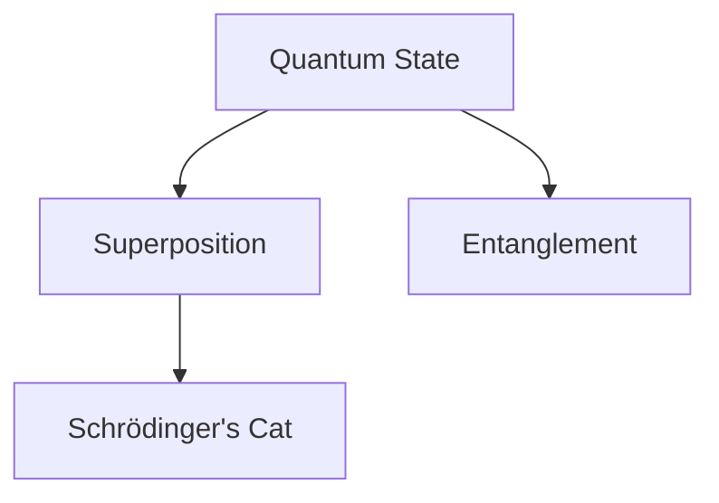

## はじめに
量子力学は、ミクロな世界の物理現象を記述する理論です。

```mermaid
graph TD
    A["Quantum State"] --> B["Superposition"]
    A --> C["Entanglement"]
    B --> D["Schrödinger's Cat"]
```

## シュレーディンガー方程式
量子系の状態の時間発展は、以下のシュレーディンガー方程式で記述されます。
$$ i\hbar rac{\partial}{\partial t} \Psi(\mathbf{r},t) = \hat{H} \Psi(\mathbf{r},t) $$

