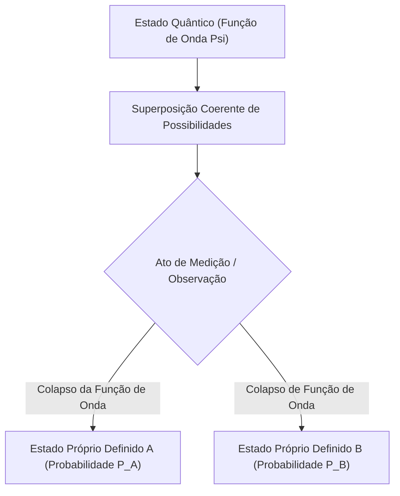

# Física: Fundamentos da Mecânica Quântica - O Gato de Schrödinger e o Experimento da Fenda Dupla

## 1. Introdução: O Admirável Mundo Microscópico que Desafia a Razão

A vasta maioria dos acontecimentos físicos do nosso cotidiano é perfeitamente explicada pela física clássica, sobretudo pela mecânica newtoniana. A parábola descrita por um projétil, a órbita regular dos planetas em torno do Sol ou o choque entre bolas de bilhar são processos deterministas: se conhecermos as condições iniciais de um sistema, o seu estado futuro pode ser previsto com absoluta exatidão.

Contudo, no início do século XX, quando os cientistas começaram a investigar as menores partículas da matéria — átomos, elétrons e fótons —, as certezas clássicas ruíram. A luz seria uma onda contínua ou um feixe de partículas discretas? Onde reside exatamente um elétron antes de ser detectado? Para desvendar estas questões capitais, a física deu à luz a **Mecânica Quântica (Quantum Mechanics)**.

A mecânica quântica é uma das teorias mais bem comprovadas de toda a ciência. Ela alicerça os microprocessadores dos nossos celulares, os lasers de fibra óptica, a ressonância magnética nos hospitais e os computadores quânticos. Neste artigo, investigaremos os seus pilares por meio de dois experimentos célebres: o **Experimento da Fenda Dupla** e o paradoxo do **Gato de Schrödinger**.

## 2. A Natureza da Matéria: Dualidade Onda-Partícula

Um dos conceitos mais desconcertantes da física é a **Dualidade Onda-Partícula (Wave-particle duality)**. A física clássica impunha uma distinção rígida: a matéria era composta por "partículas" com massa localizada no espaço, ao passo que a luz e o som eram "ondas" contínuas. A mecânica quântica destruiu essa fronteira, demonstrando que toda entidade física manifesta simultaneamente facetas corpusculares e ondulatórias dependendo do aparato de medição.

Em 1905, Albert Einstein formulou a **Hipótese dos Quanta de Luz**, postulando que a radiação viaja em pacotes discretos de energia chamados **fótons** ($E = h\nu$, onde $h$ é a constante de Planck e $\nu$ a frequência), elucidando o efeito fotoelétrico. Em 1924, o francês Louis de Broglie ampliou a simetria: se a luz atua como partícula, partículas com massa (como elétrons) também precisam possuir um comprimento de onda associado:

$$ \lambda = \frac{h}{p} $$

Onde $p = mv$ é o momento linear. Experimentos posteriores de difração conduzidos por Davisson e Germer demonstraram que elétrons produzem difração e interferência idênticas às dos raios X, confirmando as ondas de matéria.

## 3. O Núcleo do Mistério Quântico: O Experimento da Fenda Dupla

O experimento da fenda dupla revela a dualidade onda-partícula em sua forma mais contundente. O físico laureado com o Nobel [Richard Feynman](/p/biography-richard-feynman/) afirmou que este ensaio abriga «o único mistério fundamental da mecânica quântica».

### O Dispositivo Experimental
1. Um canhão eletrônico dispara elétrons contra uma barreira.
2. A barreira possui duas fendas verticais paralelas e microscópicas (Fenda A e Fenda B).
3. Atrás da barreira repousa uma tela fosforescente sensível que registra a colisão de cada elétron como um ponto luminoso isolado.

### Se os elétrons fossem partículas clássicas
Caso fossem meras esferas de bilhar microscópicas, cada elétron passaria exclusivamente pela Fenda A ou pela Fenda B. Com o decorrer do tempo, a tela revelaria apenas duas linhas verticais correspondentes às duas fendas.

### Se os elétrons fossem ondas clássicas
Se fossem ondas aquáticas contínuas, ao atravessar as fendas surgiriam duas frentes de onda que interfeririam entre si: cristas com cristas se somariam (interferência construtiva) e cristas com vales se cancelariam (interferência destrutiva). A tela formaria um **padrão de interferência** com múltiplas listras claras e escuras.

### O Chocante Resultado Experimental
Quando os cientistas diminuíram a cadência do canhão para disparar os elétrons **um por um**, garantindo que apenas um elétron viajasse por vez, cada partícula atingiu a tela como um ponto único e indivisível (comportamento corpuscular).

Contudo, ao longo de milhares de disparos sucessivos, os pontos acumulados desenharam na tela um inequívoco **padrão de interferência**!
Isso prova que cada elétron viaja como uma onda de probabilidade que **atravessa as duas fendas ao mesmo tempo**, interfere consigo mesmo e se manifesta na tela conforme a distribuição ondulatória resultante.

### O Ato de Medir Altera a Realidade
Atônitos, os pesquisadores posicionaram sensores ao lado das fendas para descobrir por qual delas o elétron realmente passava.

No momento exato em que os detectores registraram a passagem da partícula, o **padrão de interferência desapareceu por completo**, convertendo-se em duas listras paralelas clássicas!
A partícula pareceu "saber" que estava sendo observada. O simples ato da medição desfez a coerência ondulatória, colapsando o elétron em um corpúsculo clássico. Essa charada científica é conhecida como o **Problema da Medição (Measurement Problem)**.

## 4. Superposição de Estados e Interpretação Probabilística

A faculdade de uma partícula quântica ocupar múltiplos estados simultaneamente é chamada de **Superposição Quântica (Superposition)**.

Na mecânica quântica, uma partícula não observada não se encontra em um local espacial definido; ela existe como uma superposição de todas as configurações possíveis, descrita por uma entidade matemática complexa: a **Função de Onda ($\Psi$)**. Em 1926, Max Born postulou a **Interpretação Probabilística (Escola de Copenhague)**: o quadrado do módulo da função de onda exprime a **densidade de probabilidade** de encontrar a partícula em uma coordenada durante a medição:

$$ P(\mathbf{r}) = |\Psi(\mathbf{r}, t)|^2 $$

Antes da medição, o elétron reside em uma superposição coerente:

$$ |\psi\rangle = \frac{1}{\sqrt{2}} |\text{Fenda A}\rangle + \frac{1}{\sqrt{2}} |\text{Fenda B}\rangle $$

No instante em que a medição ocorre, dá-se o **Colapso da Função de Onda (Wave function collapse)**, e a nuvem contínua de probabilidades se reduz instantaneamente a um único autovalor físico. Inconformado com esse caráter probabilístico, Einstein proferiu a icônica frase: *«Deus não joga dados com o universo»*. Todavia, décadas de testes rigorosos confirmaram que a probabilidade é o mecanismo intrínseco do cosmos microscópico.

## 5. A Equação de Schrödinger: O Guia do Universo Quântico

Para descrever a evolução espaço-temporal contínua da função de onda, o austríaco Erwin Schrödinger deduziu em 1926 a equação primordial da mecânica quântica:

$$ i\hbar \frac{\partial}{\partial t} \Psi(\mathbf{r},t) = \hat{H} \Psi(\mathbf{r},t) $$

Em que:
- $i$ é a unidade imaginária,
- $\hbar = \frac{h}{2\pi}$ é a constante reduzida de Planck,
- $\Psi(\mathbf{r},t)$ é a função de onda,
- $\hat{H}$ é o operador Hamiltoniano (que expressa a energia total do sistema).

Semelhante à segunda lei de Newton ($F = ma$) na mecânica clássica ou às equações de Maxwell no eletromagnetismo, a equação de Schrödinger permite prever com exatidão os orbitais atômicos, os níveis de energia quânticos e as ligações químicas moleculares. Toda a física de semicondutores e a química quântica descendem dessa equação diferencial.

## 6. O Cume dos Paradoxos: "O Gato de Schrödinger"

Embora a interpretação de Copenhague operasse com perfeição para átomos, o próprio Erwin Schrödinger sentia repulsa pela ideia de um colapso induzido pela observação. O que ocorreria se a superposição microscópica fosse atrelada a um objeto do mundo real?

Com o propósito de evidenciar essa aparente inconsistência, propôs em 1935 o seu célebre experimento mental: **O Gato de Schrödinger (Schrödinger's Cat)**.

### A Estrutura do Experimento Mental
1. Um gato vivo é colocado no interior de uma câmara de aço totalmente blindada e opaca.
2. Dentro da câmara instala-se um dispositivo contendo um átomo radioativo, um contador Geiger, um martelo conectado a um relé e um frasco com cianeto volátil.
3. No decorrer de uma hora, o átomo radioativo tem exatamente 50% de probabilidade quântica de decair e 50% de probabilidade de não decair.
4. Se houver decaimento, o contador Geiger dispara o martelo, parte o frasco e o veneno mata o gato.
5. Se não houver decaimento, o veneno permanece lacrado e o gato segue com vida.

### O Estado do Gato Antes da Abertura da Caixa
O decaimento atômico é um processo estritamente quântico. Pela interpretação de Copenhague, até que um observador abra a caixa, o átomo permanece em uma superposição de «decaído» e «não decaído».

Como a vida do gato está conectada ao mecanismo, a dedução lógica conduz a um desfecho bizarro: antes de abrir a caixa, **o gato está suspenso em uma superposição simultânea de vivo e morto**:

$$ |\Psi_{\text{sistema}}\rangle = \frac{1}{\sqrt{2}} |\text{Gato Vivo}\rangle + \frac{1}{\sqrt{2}} |\text{Gato Morto}\rangle $$

Somente quando um ser consciente abre o compartimento é que a função de onda colapsa subitamente em uma das duas realidades macroscópicas!

### Decoerência Quântica e Muitos Mundos
Schrödinger criou essa analogia para realçar o absurdo de estender diretamente postulados microscópicos a corpos macroscópicos.

A física moderna responde a essa questão por meio da **Decoerência Quântica (Quantum Decoherence)**: sistemas macroscópicos como um gato ou um detector contêm sextilhões de partículas que colidem ininterruptamente com moléculas de ar e radiação térmica. Em uma fração infinitesimal de tempo ($10^{-20}\text{ s}$), as fases da superposição se dispersam no ambiente circundante, fazendo com que o sistema exiba um estado clássico definido muito antes de qualquer pessoa olhar dentro da caixa.

Outra vertente paradigmática é a **Interpretação dos Muitos Mundos (Many-worlds interpretation)** proposta por Hugh Everett em 1957: a função de onda jamais colapsa; ao medir, o próprio cosmos se ramifica em duas realidades paralelas — uma onde o gato vive e outra onde o gato perece.

## 7. Entrelaçamento Quântico: A "Ação Fantasmagórica à Distância"

Outra propriedade estarrecedora é o **Entrelaçamento Quântico (Quantum entanglement)**. Quando duas partículas são geradas em um estado entrelaçado, fundem-se em um sistema físico indivisível:

$$ |\Phi^+\rangle = \frac{1}{\sqrt{2}} \left( |\uparrow\uparrow\rangle + |\downarrow\downarrow\rangle \right) $$

Mesmo que essas partículas sejam transportadas a galáxias opostas, medir o estado de uma delas determina instantaneamente (**sem qualquer atraso temporal**) o estado da outra partícula.

Einstein rejeitou essa aparente transmissão instantânea, apelidando-a de *"ação fantasmagórica à distância"*, sustentando que a mecânica quântica estava incompleta e que existiam variáveis ocultas locais. Em 1964, John Bell formulou seu teorema, e testes com fótons entrelaçados (laureados com o Prêmio Nobel de Física em 2022) comprovaram que não há variáveis ocultas: a natureza é comprovadamente **não local**.

## 8. A Segunda Revolução Quântica e o Futuro

Princípios outrora vistos como elucubrações filosóficas constituem o motor da **Segunda Revolução Quântica**:

- **Computação Quântica (Quantum Computing)**: Operando com **qubits**, a superposição e o entrelaçamento realizam processamento paralelo em espaços multidimensionais, resolvendo em segundos problemas intratáveis para supercomputadores clássicos (fatoração de Shor, simulações farmacêuticas e rotas logísticas).
- **Criptografia Quântica (QKD)**: Protegida pelo teorema da não clonagem, qualquer escuta clandestina colapsa os estados quânticos dos fótons, denunciando instantaneamente a espionagem.
- **Sensores Quânticos**: Centros de vacância de nitrogênio (NV) em diamantes mapeiam campos magnéticos e gravitacionais com sensibilidade atômica, viabilizando navegação autônoma de submarinos sem sinal de GPS e mapeamento neural não invasivo.

## 9. Conclusão: Um Convite às Fronteiras da Física

A mecânica quântica desconstrói a nossa intuição cotidiana: entes coexistem em múltiplos estados, o ato de medição consolida a realidade material, e partículas distantes permanecem enlaçadas através do vácuo cósmico. 

Como bem alertou [Richard Feynman](/p/biography-richard-feynman/): *«Acho que posso dizer com segurança que ninguém compreende a mecânica quântica»*. No entanto, ao decifrar suas equações e desvendar seus paradoxos, a humanidade descortina as engrenagens mais profundas da criação.
