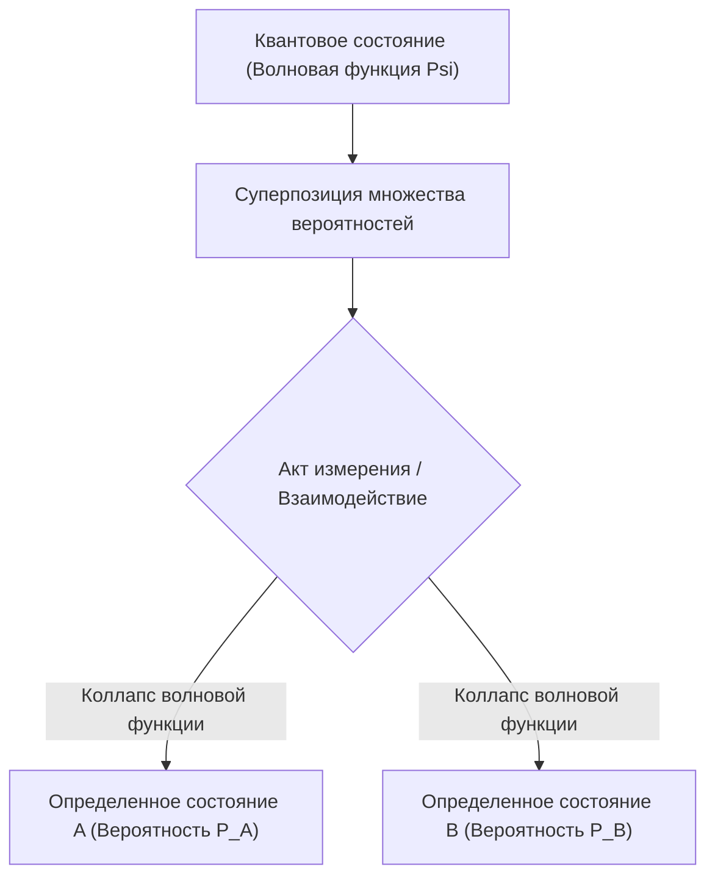

# Физика: основы квантовой механики - кот Шрёдингера и эксперимент с двумя щелями

## 1. Введение: парадоксальный микромир, разрушающий интуицию

Подавляющее большинство физических явлений, с которыми мы сталкиваемся в повседневной жизни, с поразительной точностью объясняются законами классической физики и механики Ньютона. Траектория брошенного камня, движение планет по эллиптическим орбитам вокруг Солнца и столкновение шаров на бильярдном столе строго детерминированы: если известны начальные координаты и скорости, будущее состояние системы можно предсказать с абсолютной уверенностью.

Однако в начале XX века, когда физики проникли в сокровенные глубины микромира — атомов, электронов и квантов света, классическая физическая картина мира рухнула. Является ли свет непрерывной волной или потоком дискретных частиц? Где именно находится электрон до момента измерения? Ответом на эти фундаментальные вопросы стала **Квантовая механика (Quantum Mechanics)**.

Квантовая механика — одна из наиболее строго проверенных и практически плодотворных теорий в истории науки. На ее уравнениях базируются кремниевые микропроцессоры в смартфонах, лазеры в волоконно-оптических сетях связи, аппараты МРТ в клиниках и зарождающиеся квантовые суперкомпьютеры. В этой статье мы подробно разберем фундаментальные принципы квантовой физики через два легендарных феномена: **эксперимент с двумя щелями (опыт Юнга)** и мысленный эксперимент с **котом Шрёдингера**.

## 2. Природа материи и света: корпускулярно-волновой дуализм

Одним из самых революционных понятий квантовой физики стал **Корпускулярно-волновой дуализм (Wave-particle duality)**. Классическая физика проводила непреодолимую границу: материя состоит из локализованных «частиц», обладающих массой, а свет и звук — это непрерывные «волны», распространяющиеся в пространстве. Квантовая механика стерла эту грань, доказав, что любой объект во Вселенной обладает как волновыми, так и корпускулярными свойствами в зависимости от условий наблюдения.

В 1905 году Альберт Эйнштейн выдвинул **гипотезу световых квантов**, показав, что свет распространяется и поглощается дискретными порциями — **фотонами** ($E = h\nu$, где $h$ — постоянная Планка, $\nu$ — частота), блестяще объяснив фотоэффект. В 1924 году французский физик Луи де Бройль развил эту идею до всеобщей симметрии: если световая волна ведет себя как частица, то материальные частицы (например, электроны) также обязаны обладать волновыми свойствами:

$$ \lambda = \frac{h}{p} $$

Где $p = mv$ — импульс частицы. Последующие эксперименты Дэвиссона и Джермера по рассеянию электронов на кристаллах наглядно продемонстрировали, что пучки электронов дифрагируют и интерферируют в точности как рентгеновские лучи.

## 3. Сердце квантовой тайны: эксперимент с двумя щелями

Опыт с двумя щелями демонстрирует корпускулярно-волновой дуализм в его самом невероятном виде. Знаменитый физик [Ричард Фейнман](/p/biography-richard-feynman/) подчеркивал, что этот эксперимент содержит в себе «единственную истинную тайну квантовой механики».

### Схема эксперимента
1. Электронная пушка испускает электроны по направлению к барьеру.
2. В барьере прорезаны две очень узкие параллельные щели (Щель A и Щель B).
3. Позади барьера расположен люминесцентный экран-детектор, фиксирующий попадание каждого электрона в виде светящейся точки.

### Если бы электроны были обычными классическими частицами
Будь электроны миниатюрными бильярдными шарами, каждый из них проходил бы строго либо через щель A, либо через щель B. На экране со временем сформировались бы две вертикальные полосы, соответствующие прорезям.

### Если бы электроны были классическими волнами
Если бы через две щели проходила волна на воде, из каждой щели исходили бы две круговые волны. Накладываясь друг на друга, они создавали бы интерференцию: гребень с гребнем давали бы усиление, а гребень с впадиной — гашение. На экране возникло бы характерное полосатое **интерференционное распределение**.

### Поразительный результат реального эксперимента
Когда физики снизили интенсивность излучения электронной пушки настолько, что электроны вылетали строго **по одному**, гарантируя нахождение лишь одной частицы в установке, каждый электрон оставлял на экране точечный след неделимой частицы.

Однако по мере накопления тысяч отдельных попаданий точки распределились не в две полосы, а сложились в отчетливую **интерференционную картину**!
Это означает: даже летя в абсолютном одиночестве, каждый электрон распространяется как волна вероятности, **проходит одновременно через обе щели сразу**, интерферирует сам с собой и ударяется о детектор в строгом соответствии с интерференционным распределением.

### Акт наблюдения меняет реальность
Стремясь разрешить эту загадку, экспериментаторы установили возле щелей детекторы, чтобы точно зафиксировать, в какую именно щель пролетает электрон.

Как только прибор регистрировал траекторию частицы, **интерференционная картина мгновенно исчезала**, превращаясь в две банальные классические полосы!
Микрочастица словно «знает», что за ней наблюдают. Сам процесс физического измерения разрушает волновую когерентность и принудительно схлопывает электрон в классическую частицу. Эта фундаментальная проблема квантовой физики получила название **проблемы измерения (Measurement Problem)**.

## 4. Квантовая суперпозиция и вероятностная интерпретация

Способность квантовой системы находиться одновременно в нескольких состояниях или проходить взаимоисключающими путями называется **квантовой суперпозицией (Superposition)**.

В квантовой механике частица до измерения не обладает определенными координатами в пространстве; она пребывает в линейной суперпозиции всех потенциальных исходов, описываемой математической **волновой функцией ($\Psi$)**. В 1926 году Макс Борн сформулировал **вероятностную интерпретацию (Копенгагенская школа)**: квадрат модуля волновой функции определяет **плотность вероятности** обнаружения частицы в данной точке пространства при проведении измерения:

$$ P(\mathbf{r}) = |\Psi(\mathbf{r}, t)|^2 $$

До измерения электрон пребывает в когерентной суперпозиции:

$$ |\psi\rangle = \frac{1}{\sqrt{2}} |\text{Щель A}\rangle + \frac{1}{\sqrt{2}} |\text{Щель B}\rangle $$

В момент измерения происходит мгновенный **коллапс волновой функции (редукция состояния)**: бесконечный веер вероятностей схлопывается к единственному собственному значению. Не приемля фундаментальный индетерминизм мироздания, Эйнштейн возражал: *«Бог не играет в кости со Вселенной»*. Однако десятилетия прецизионных экспериментов доказали, что квантовая природа фундаментально вероятностна.

## 5. Уравнение Шрёдингера: фундаментальный закон квантовой динамики

Чтобы математически описать, как волновая функция непрерывно и детерминированно эволюционирует во времени и пространстве, австрийский физик Эрвин Шрёдингер в 1926 году вывел ключевое уравнение квантовой механики:

$$ i\hbar \frac{\partial}{\partial t} \Psi(\mathbf{r},t) = \hat{H} \Psi(\mathbf{r},t) $$

Где:
- $i$ — мнимая единица,
- $\hbar = \frac{h}{2\pi}$ — редуцированная постоянная Планка (постоянная Дирака),
- $\Psi(\mathbf{r},t)$ — пространственно-временная волновая функция,
- $\hat{H}$ — гамильтониан (оператор полной энергии системы).

Подобно второму закону Ньютона в механике или уравнениям Максвелла в электродинамике, уравнение Шрёдингера лежит в фундаменте квантовой теории. Находя его решения, физики и химики рассчитывают геометрию электронных орбиталей, энергетические спектры и природу межатомных связей.

## 6. Вершина парадоксов: «Кот Шрёдингера»

Хотя копенгагенская интерпретация безупречно описывала расчеты в микромире, сам Эрвин Шрёдингер категорически отвергал идею коллапса волновой функции, вызываемого наблюдением. Что произойдет, если квантовую суперпозицию микрочастиц механически связать с макроскопическим объектом?

Чтобы обнажить логические противоречия этой теории, в 1935 году он предложил свой знаменитый мысленный эксперимент: **Кот Шрёдингера (Schrödinger's Cat)**.

### Условия мысленного эксперимента
1. Живой кот помещен в непроницаемый стальной бункер.
2. Внутри бункера размещен механизм: радиоактивный атом, счетчик Гейгера, реле с молоточком и стеклянная ампула с цианистым калием.
3. В течение одного часа радиоактивный атом имеет квантовую вероятность 50% распасться и 50% остаться целым.
4. В случае распада счетчик Гейгера активирует молоточек, ампула разбивается, яд заполняет бункер и кот погибает.
5. Если распада нет, ампула цела и кот остается жив.

### Каково состояние кота до открытия камеры?
Распад ядра — квантовое событие. До того как внешний наблюдатель откроет камеру, атом находится в суперпозиции «распался» и «не распался».

Поскольку жизнь кота напрямую связана с квантовым атомом, последовательное применение копенгагенской логики приводит к поразительному выводу: до момента вскрытия камеры **кот находится в суперпозиции состояний: он одновременно и жив, и мертв**:

$$ |\Psi_{\text{системы}}\rangle = \frac{1}{\sqrt{2}} |\text{Живой кот}\rangle + \frac{1}{\sqrt{2}} |\text{Мертвый кот}\rangle $$

Лишь тогда, когда сознательный наблюдатель поднимает крышку, волновая функция схлопывается в одну из двух макроскопических реальностей.

### Квантовая декогеренция и многомировая интерпретация
Шрёдингер придумал этот образ, чтобы показать абсурдность механического переноса законов микромира на макроскопические тела.

Современная физика разрешает этот парадокс с помощью концепции **квантовой декогеренции (Quantum Decoherence)**: макрообъекты (кот, датчики, стены бункера) состоят из триллионов атомов, которые непрерывно взаимодействуют с фотонами и молекулами воздуха. За ничтожные доли секунды ($10^{-20}\text{ с}$) квантовая когерентность рассеивается в окружающей среде, и система макроскопически переходит в классическое состояние задолго до того, как человек заглянет в коробку.

Другой глубокой интерпретацией является **Многомировая интерпретация Хью Эверетта (1957)**: волновая функция никогда не коллапсирует. В момент каждого квантового события Вселенная расщепляется на параллельные ветви: в одной кот остается жить, в другой — погибает.

## 7. Квантовая запутанность: «жуткое дальнодействие»

Еще одним поразительным феноменом микромира является **квантовая запутанность (Quantum entanglement)**. Когда две частицы рождаются в общем квантовом состоянии, они образуют неразрывную целостную систему:

$$ |\Phi^+\rangle = \frac{1}{\sqrt{2}} \left( |\uparrow\uparrow\rangle + |\downarrow\downarrow\rangle \right) $$

Даже если разнести эти частицы на противоположные края Вселенной, измерение состояния спина первой частицы мгновенно (**без малейшей временной задержки**) предопределяет квантовое состояние второй частицы.

Эйнштейн скептически называл это явление *«жутким дальнодействием»* (spooky action at a distance), полагая, что квантовая механика неполна и скрывает в себе неизвестные локальные переменные. Однако теорема Джона Белла и последовавшие прецизионные опыты (Нобелевская премия по физике 2022 года) доказали: скрытых параметров нет, а квантовая природа фундаментально **нелокальна**.

## 8. Вторая квантовая революция и технологии будущего

Квантовые парадоксы, некогда бывшие предметом сугубо философских дискуссий, сегодня движут **Вторую квантовую революцию**:

- **Квантовые вычисления (Quantum Computing)**: Кубиты (**qubits**), работающие на принципах суперпозиции и запутанности, экспоненциально ускоряют решение задач разложения на множители (алгоритм Шора), молекулярного моделирования лекарств и логистической оптимизации.
- **Квантовое распределение ключей (QKD)**: Квантовая криптография на базе теоремы о запрете клонирования гарантирует абсолютную физическую защиту: любая попытка перехвата ключа разрушает квантовое состояние фотона, мгновенно разоблачая шпиона.
- **Квантовая сенсорика**: Азотно-вакансионные (NV) центры в алмазах измеряют магнитные и гравитационные поля с атомным разрешением, открывая путь к подводной навигации без GPS и сверхточным нейроинтерфейсам.

## 9. Заключение: вглядываясь в квантовую бездну

Квантовая механика беспощадно разрушает привычные шаблоны мышления: объекты существуют сразу везде, наблюдение рождает физическую реальность, а частицы связаны сквозь пространство. 

Как проницательно заметил [Ричард Фейнман](/p/biography-richard-feynman/): *«Думаю, я могу смело сказать, что квантовой механики никто не понимает»*. Но именно постигая эту великую тайну, человечество открывает фундаментальные законы Вселенной.
