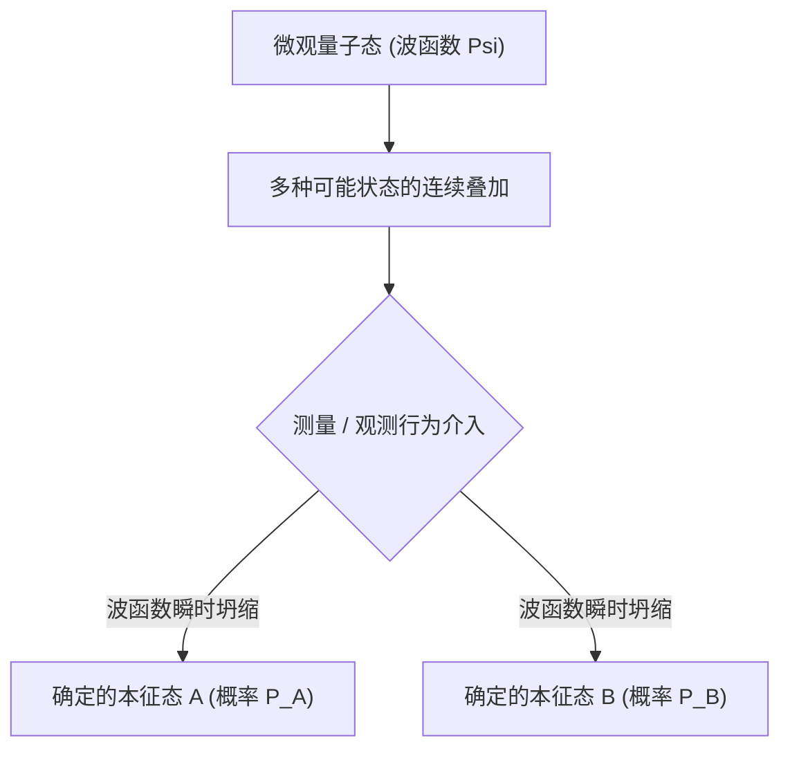

# 物理学：量子力学基础 - 薛定谔的猫与双缝干涉实验

## 1. 引言：颠覆直觉的微观量子世界

我们在日常生活中所经历的大多数宏观物理现象，都可以用牛顿力学为代表的“经典物理学”给出极其精准的解释。高空抛物线的轨迹、行星环绕恒星公转的轨道、台球桌上的碰撞，都是完全确定性的：只要已知系统的初始条件，未来任意时刻的演化结果在理论上都是可以精确预测的。

然而，20世纪初，当物理学家将探索的触角深入到原子、电子和光子等极微观领域时，经典物理学的宏伟殿堂开始土崩瓦解。光究竟是连续的波还是离散的粒子？电子在被探测到之前到底位于何方？为了回答这些关乎宇宙微观本质的终极之问， **量子力学（Quantum Mechanics）** 应运而生。

量子力学是人类科学史上验证最严苛、应用最成功的理论之一。从智能手机中的半导体芯片、光纤通信中的激光器，到核磁共振成像（MRI）乃至量子计算机，现代文明的科技大厦皆深植于量子理论。本文将通过 **双缝干涉实验** 与 **薛定谔的猫** 这两个举世闻名的物理实验与思想实验，全面剖析量子力学的精妙本质。

## 2. 光与电子的微观真容：波粒二象性

量子物理学中最具颠覆性的核心概念当属 **波粒二象性（Wave-particle duality）** 。在经典物理体系中，物质由具有质量的“实体粒子”构成，而光与声则是弥漫在空间中的“连续波动”，二者界限森严。但在微观量子领域，所有的物质与能量都兼具粒子与波动的双重属性。

这一划时代的认知始于1905年阿尔伯特·爱因斯坦提出的 **光量子假说** 。他指出，光并不是连续波，而是由携带能量量子 $h\nu$（$h$ 为普朗克常数，$\nu$ 为光波频率）的“光子”粒子流构成，这一洞见完美解释了光电效应。1924年，法国物理学家路易·德布罗意在此基础上做出了惊人的推广：既然光波具有粒子性，那么像电子这样的实物粒子也必然具有波动性。他提出了著名的物质波公式：

$$ \lambda = \frac{h}{p} $$

其中 $p$ 为动量。随后戴维森与革末的电子散射实验证实了电子束同样具有衍射与干涉现象，波粒二象性自此成为不可动摇的物理定律。

## 3. 量子物理的核心实验：双缝干涉实验

若要最纯粹、最直观地感受量子力学那违背人类常识的怪诞特质，莫过于 **双缝干涉实验（Double-slit experiment）** 。物理学泰斗 [理查德·费曼](/p/biography-richard-feynman/) 曾断言：“量子力学的所有奥秘，都包含在这个实验之中。”

### 实验基本构造
1. 准备一台能单颗发射电子的电子枪。
2. 在发射路径的前方放置一块开有两条极窄狭缝（狭缝A与狭缝B）的挡板。
3. 在挡板后方放置一块能灵敏记录电子撞击位置的荧光屏（探测器）。

### 假定电子是经典粒子
如果电子如同微型的台球，那么每一颗电子必然只能穿过狭缝A或狭缝B。随着发射数量的累积，荧光屏上最终应当只呈现对应于两条狭缝的“两条平行的直条纹”。

### 假定电子是经典波动
如果是水波穿过双缝，水波会从两个狭缝处分别衍生出新的次级波阵面，两列波相互叠加干涉：波峰与波峰叠加形成强振幅，波峰与波谷叠加相互抵消，最终在屏幕上形成明暗相间的“多重干涉条纹”。

### 令人震撼的实验结果
当物理学家将电子枪的发射速率调至极低，确保整个装置内 **每次只有唯一一颗电子飞行** 时，令人匪夷所思的现象发生了：每一颗电子在荧光屏上都是以极其精确的点状粒子形态着陆。

然而，当成千上万颗彼此独立的电子逐一发射完毕后，屏幕上所有落点汇聚而成的图像，竟然呈现出了教科书般完美的 **明暗干涉条纹** ！
这证明：即使只有一颗电子在真空中飞行，它也是以“几率波”的形态 **同时穿过了左缝和右缝** ，并与自己发生干涉，最后按照干涉图样所决定的几率落在屏幕上。

### “观测”彻底改变了物理现实
面对这颗仿佛拥有“分身术”的电子，物理学家在两条狭缝边安装了高精度的微观探测器，试图直接“窥探”电子到底是从左边还是右边穿过。

然而，奇迹再次发生了：一旦探测器开启并确凿测出电子穿过了哪一条狭缝，屏幕上的干涉条纹 **立刻消失无踪** ，瞬间退化成了两条经典的粒子直条纹！
微观粒子似乎知道自己“正在被人类观测”。仅仅是“测量/观测”这一行为本身，就抹除了电子的波动相干性，将其强行塌缩成了经典粒子。这在物理学中被称为 **测量难题（Measurement Problem）** 。

## 4. 状态叠加与几率诠释

电子在未被观测时同时通过双缝的状态，在量子力学中被称为 **量子叠加态（Superposition）** 。

量子体系中的粒子在未发生相互作用时，并不具备确定的时空位置，而是以各种可能状态的线性叠加形式存在，由复数数学工具 **波函数（$\Psi$）** 来完整刻画。1926年，马克斯·玻恩提出了著名的 **几率诠释（哥本哈根诠释）** ：波函数幅度的绝对值平方，代表了在该处发现该粒子的几率密度：

$$ P(\mathbf{r}) = |\Psi(\mathbf{r}, t)|^2 $$

在观测之前，电子的状态由双缝态的相干叠加所描述：

$$ |\psi\rangle = \frac{1}{\sqrt{2}} |\text{狭缝A}\rangle + \frac{1}{\sqrt{2}} |\text{狭缝B}\rangle $$

一旦人类或探测器进行测量，波函数便瞬间发生 **波函数坍缩（Wave function collapse）** ，所有的几率云在一瞬间崩塌为一个确定的本征值。爱因斯坦对此深恶痛绝，留下名言：“上帝不掷骰子！”然而百余年来的所有精密实验均证实：微观宇宙的底层运行法则就是纯粹的几率。

## 5. 薛定谔方程：刻画量子世界演化的基石

为了精准预测波函数随时间是如何平滑演化的，奥地利物理学家埃尔温·薛定谔在1926年推导出了量子力学最高法则——**薛定谔方程（Schrödinger equation）** ：

$$ i\hbar \frac{\partial}{\partial t} \Psi(\mathbf{r},t) = \hat{H} \Psi(\mathbf{r},t) $$

其中：
- $i$ 为虚数单位，
- $\hbar = \frac{h}{2\pi}$ 为约化普朗克常数，
- $\Psi(\mathbf{r},t)$ 为随时间空间演化的复数波函数，
- $\hat{H}$ 为哈密顿算符（代表系统的总能量）。

正如牛顿第二定律之于经典力学、麦克斯韦方程组之于电磁学，薛定谔方程在量子物理中处于至高无上的地位。通过求解该偏微分方程，科学家可以计算出原子内部电子云的轨线分布、能级结构及化学键本质。可以说，现代固体物理、量子化学乃至半导体工业，都是建立在薛定谔方程的基础之上。

## 6. 悖论的顶峰：“薛定谔的猫”

尽管哥本哈根诠释在计算微观实验时无懈可击，但其提出者薛定谔本人却对“测量导致瞬时坍缩”的哲学假设感到极度荒谬与不安。如果微观的叠加态可以不受限制地放大到我们生活的宏观世界，会发生什么？

为了讽刺并揭示这一理论的不完备性，薛定谔在1935年提出了思想实验： **薛定谔的猫（Schrödinger's Cat）** 。

### 思想实验设计
1. 将一只活猫关在一个绝对封闭、坚固且不透光的钢制密室中。
2. 密室内放置一套装置：含有一个微量放射性原子、一个盖革计数器、一个联动锤子以及装有剧毒氰化物的玻璃瓶。
3. 在一小时内，该放射性原子有精确的 50% 几率发生衰变，也有 50% 几率不衰变。
4. 如果发生衰变，计数器感应并释放锤子击碎药瓶，毒气释放导致猫死亡；如果不衰变，则药瓶完好，猫存活。

### 开箱观测前，猫的状态究竟如何？
原子的衰变属于标准的微观量子跃迁。按照哥本哈根学派的教条，在外部观测者打开箱子之前，原子处于“已衰变”与“未衰变”的几率叠加态。

由于整个装置与猫的生命状态在物理上严格联动，其逻辑推演必然得出惊悚的结论：在开箱之前， **这只猫处于一种“既死又活、非死非活”的生死叠加态** ：

$$ |\Psi_{\text{系统}}\rangle = \frac{1}{\sqrt{2}} |\text{活猫}\rangle + \frac{1}{\sqrt{2}} |\text{死猫}\rangle $$

只有当外部人类推开箱门的一刹那，观测行为才强制波函数发生坍缩，宏观现实才在“死”或“活”之间定格！

### 悖论的哲学启示与退相干理论
薛定谔提出此悖论的本意，是指出将微观几率不加辨别地套用到宏观世界是荒谬的。宏观世界的边界究竟在哪里？什么才算作一次“观测”？难道猫自己不能观测自己的生死吗？

现代物理学通过 **量子退相干（Quantum Decoherence）** 理论给出了主流解释：宏观物体（如猫和仪器）由 $10^{26}$ 数量级的粒子构成，它们与周围环境中的光子、空气分子在 $10^{-20}$ 秒内发生不可逆的纠缠与热碰撞，使得量子相干性在极短时间内散失到广袤的环境中，从而在宏观尺度上展现出确定的经典物理特征。

另一极具科幻魅力的解释则是休·埃弗雷特三世在1957年提出的 **多世界诠释（Many-worlds interpretation）** ：波函数从不坍缩，每次测量实质上是宇宙发生了一次分裂，衍生出一个“猫活着的世界”和一个“猫死去的世界”，两个平行宇宙彼此绝缘、同时存在。

## 7. 量子纠缠：跨越时空的“幽灵般的超距作用”

量子力学另一令人叹为观止的神奇现象是 **量子纠缠（Quantum entanglement）** 。当两个粒子在特定条件下相互作用后，它们将熔铸为一个不可分割的统一量子态：

$$ |\Phi^+\rangle = \frac{1}{\sqrt{2}} \left( |\uparrow\uparrow\rangle + |\downarrow\downarrow\rangle \right) $$

即使将这两个处于纠缠态的粒子分别放置在相距数万光年的宇宙两端，只要我们对其中一个粒子的自旋进行测量，另一个粒子的自旋状态也会在 **完全零时延（超越光速）** 的瞬间确定下来！

爱因斯坦对此极度抗拒，将其嘲讽为“幽灵般的超距作用（Spooky action at a distance）”，并坚信量子力学是不完备的，底层必然存在人类未知的“隐变量”。然而，1964年约翰·贝尔提出了著名的 **贝尔不等式** 。阿斯佩、克劳泽与塞林格等物理学家通过严密的光子纠缠实验（荣获2022年诺贝尔物理学奖），彻底打破了贝尔不等式，确凿证明了隐变量并不存在——**非局域性（Non-locality）** 就是大自然不可撼动的终极真理。

## 8. 第二次量子革命：重塑人类未来的硬核科技

曾经只停留在理论思辨与哲学争论层面的量子力学奇特性质，如今正掀起一场被称为“第二次量子革命”的工业与科技风暴：

- **量子计算（Quantum Computing）** ：利用量子叠加与纠缠构成的量子比特（Qubit），可在高维希尔伯特空间中进行全并行矩阵搜索，在密码破译（Shor算法）、新药分子研发与物流运筹优化上展现出超越经典超级计算机数亿倍的“量子霸权”。
- **量子通信与量子密钥分发（QKD）** ：利用不可克隆定理与单光子偏振测量态的塌缩特性，一旦有黑客在中途监听，密钥状态便立即扰动销毁，实现理论上绝对无法被窃听的无条件物理安全。
- **量子精密测量与传感** ：利用金刚石NV色心和原子自旋干涉，制造灵敏度达到皮特斯拉级别的超高精度磁力计与重力仪，可用于无GPS环境下的潜艇惯性导航与无创脑神经成像。

## 9. 结语：深邃量子之美

量子力学从根本上打破了人类对客观世界的朴素直觉：“一个物体可以同时身处多处”、“测量行为定义了物理实体”、“遥隔星系的粒子瞬间心有灵犀”。正如 [理查德·费曼](/p/biography-richard-feynman/) 那句发人深省的警句：“我想我可以有把握地说，没有人真正理解量子力学。”

然而，正是在这种对常识的颠覆中，人类依靠严密的数学形式体系与精确的物理实验，一点一滴地揭开了宇宙深处最壮丽的法则。当我们再次仰望繁星并思考双缝干涉与薛定谔那只神秘的猫时，我们正在与微观宇宙最深沉的心跳发生共鸣。
