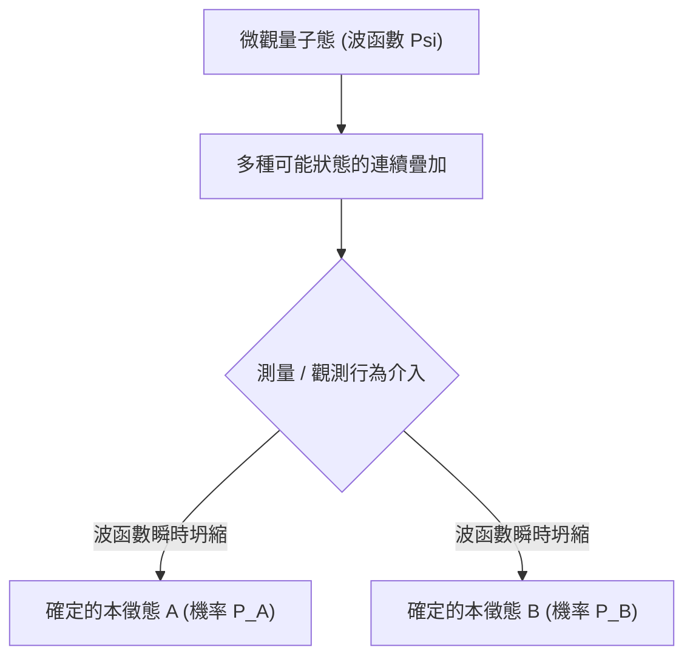

# 物理學：量子力學基礎 - 薛丁格的貓與雙狹縫干涉實驗

## 1. 引言：顛覆直覺的微觀量子世界

我們在日常生活中所經歷的大多數巨觀物理現象，都可以用牛頓力學為代表的「古典物理學」給出極其精準的解釋。高空拋物線的軌跡、行星環繞恆星公轉的軌道、撞球桌上的碰撞，都是完全決定性的：只要已知系統的初始條件，未來任意時刻的演化結果在理論上都是可以精確預測的。

然而，20世紀初，當物理學家將探索的觸角深入到原子、電子和光子等極微觀領域時，古典物理學的宏偉殿堂開始土崩瓦解。光究竟是連續的波還是離散的粒子？電子在被探測到之前到底位於何方？為了回答這些關乎宇宙微觀本質的終極之問， **量子力學（Quantum Mechanics）** 應運而生。

量子力學是人類科學史上驗證最嚴苛、應用最成功的理論之一。從智慧型手機中的半導體晶片、光纖通訊中的雷射，到磁振造影（MRI）乃至量子電腦，現代文明的科技大廈皆深植於量子理論。本文將透過 **雙狹縫干涉實驗** 與 **薛丁格的貓** 這兩個舉世聞名的物理實驗與思想實驗，全面剖析量子力學的精妙本質。

## 2. 光與電子的微觀真容：波粒二象性

量子物理學中最具顛覆性的核心概念當屬 **波粒二象性（Wave-particle duality）** 。在古典物理體系中，物質由具有質量的「實體粒子」構成，而光與聲則是彌漫在空間中的「連續波動」，二者界限森嚴。但在微觀量子領域，所有的物質與能量都兼具粒子與波動的雙重屬性。

這一劃時代的認知始於1905年阿爾伯特·愛因斯坦提出的 **光量子假說** 。他指出，光並不是連續波，而是由攜帶能量量子 $h\nu$（$h$ 為普朗克常數，$\nu$ 為光波頻率）的「光子」粒子流構成，這一洞見完美解釋了光電效應。1924年，法國物理學家路易·德布羅意在此基礎上做出了驚人的推廣：既然光波具有粒子性，那麼像電子這樣的實物粒子也必然具有波動性。他提出了著名的物質波公式：

$$ \lambda = \frac{h}{p} $$

其中 $p$ 為動量。隨後戴維森與革末的電子散射實驗證實了電子束同樣具有繞射與干涉現象，波粒二象性自此成為不可動搖的物理定律。

## 3. 量子物理的核心實驗：雙狹縫干涉實驗

若要最純粹、最直觀地感受量子力學那違背人類常識的怪誕特質，莫過於 **雙狹縫干涉實驗（Double-slit experiment）** 。物理學泰斗 [理查·費曼](/p/biography-richard-feynman/) 曾斷言：「量子力學的所有奧秘，都包含在這個實驗之中。」

### 實驗基本構造
1. 準備一台能單顆發射電子的電子槍。
2. 在發射路徑的前方放置一塊開有兩條極窄狹縫（狹縫A與狹縫B）的擋板。
3. 在擋板後方放置一塊能靈敏記錄電子撞擊位置的螢光幕（探測器）。

### 假定電子是古典粒子
如果電子如同微型的撞球，那麼每一顆電子必然只能穿過狹縫A或狹縫B。隨著發射數量的累積，螢光幕上最終應當只呈現對應於兩條狹縫的「兩條平行的直條紋」。

### 假定電子是古典波動
如果是水波穿過雙狹縫，水波會從兩個狹縫處分別衍生出新的次級波前，兩列波相互疊加干涉：波峰與波峰疊加形成強振幅，波峰與波谷疊加相互抵消，最終在螢幕上形成明暗相間的「多重干涉條紋」。

### 令人震撼的實驗結果
當物理學家將電子槍的發射速率調至極低，確保整個裝置內 **每次只有唯一一顆電子飛行** 時，令人匪夷所思的現象發生了：每一顆電子在螢光幕上都是以極其精確的點狀粒子形態著陸。

然而，當成千上萬顆彼此獨立的電子逐一發射完畢後，螢幕上所有落點匯聚而成的圖像，竟然呈現出了教科書般完美的 **明暗干涉條紋** ！
這證明：即使只有一顆電子在真空中飛行，它也是以「機率波」的形態 **同時穿過了左縫和右縫** ，並與自己發生干涉，最後按照干涉圖樣所決定的機率落在螢幕上。

### 「觀測」徹底改變了物理現實
面對這顆彷彿擁有「分身術」的電子，物理學家在兩條狹縫邊安裝了高精度的微觀探測器，試圖直接「窺探」電子到底是由左邊還是右邊穿過。

然而，奇蹟再次發生了：一旦探測器開啟並確鑿測出電子穿過了哪一條狹縫，螢幕上的干涉條紋 **立刻消失無蹤** ，瞬間退化成了兩條古典的粒子直條紋！
微觀粒子似乎知道自己「正在被人類觀測」。僅僅是「測量/觀測」這一行為本身，就抹除了電子的波動同調性，將其強行塌縮成了古典粒子。這在物理學中被稱為 **測量難題（Measurement Problem）** 。

## 4. 狀態疊加與機率詮釋

電子在未被觀測時同時通過雙狹縫的狀態，在量子力學中被稱為 **量子疊加態（Superposition）** 。

量子體系中的粒子在未發生交互作用時，並不具備確定的時空位置，而是以各種可能狀態的線性疊加形式存在，由複數數學工具 **波函數（$\Psi$）** 來完整刻畫。1926年，馬克斯·玻恩提出了著名的 **機率詮釋（哥本哈根詮釋）** ：波函數幅度的絕對值平方，代表了在該處發現該粒子的機率密度：

$$ P(\mathbf{r}) = |\Psi(\mathbf{r}, t)|^2 $$

在觀測之前，電子的狀態由雙狹縫態的同調疊加所描述：

$$ |\psi\rangle = \frac{1}{\sqrt{2}} |\text{狹縫A}\rangle + \frac{1}{\sqrt{2}} |\text{狹縫B}\rangle $$

一旦人類或探測器進行測量，波函數便瞬間發生 **波函數坍縮（Wave function collapse）** ，所有的機率雲在一瞬間崩塌為一個確定的本徵值。愛因斯坦對此深惡痛絕，留下名言：「上帝不擲骰子！」然而百餘年來的所有精密實驗均證實：微觀宇宙的底層運作法則就是純粹的機率。

## 5. 薛丁格方程式：刻畫量子世界演化的基石

為了精準預測波函數隨時間是如何平滑演化的，奧地利物理學家埃爾溫·薛丁格在1926年推導出了量子力學最高法則——**薛丁格方程式（Schrödinger equation）** ：

$$ i\hbar \frac{\partial}{\partial t} \Psi(\mathbf{r},t) = \hat{H} \Psi(\mathbf{r},t) $$

其中：
- $i$ 為虛數單位，
- $\hbar = \frac{h}{2\pi}$ 為約化普朗克常數，
- $\Psi(\mathbf{r},t)$ 為隨時間空間演化的複數波函數，
- $\hat{H}$ 為哈密頓算符（代表系統的總能量）。

正如牛頓第二定律之於古典力學、馬克士威方程組之於電磁學，薛丁格方程式在量子物理中處於至高無上的地位。透過求解該偏微分方程式，科學家可以計算出原子內部電子雲的軌線分布、能階結構及化學鍵本質。可以說，現代固態物理、量子化學乃至半導體工業，都是建立在薛丁格方程式的基礎之上。

## 6. 悖論的頂峰：「薛丁格的貓」

儘管哥本哈根詮釋在計算微觀實驗時無懈可擊，但其提出者薛丁格本人卻對「測量導致瞬時坍縮」的哲學假設感到極度荒謬與不安。如果微觀的疊加態可以不受限制地放大到我們生活的巨觀世界，會發生什麼？

為了諷刺並揭示這一理論的不完備性，薛丁格在1935年提出了思想實驗： **薛丁格的貓（Schrödinger's Cat）** 。

### 思想實驗設計
1. 將一隻活貓關在一個絕對封閉、堅固且不透光的鋼製密室中。
2. 密室內放置一套裝置：含有一個微量放射性原子、一個蓋革計數器、一個連動錘子以及裝有劇毒氰化物的玻璃瓶。
3. 在一小時內，該放射性原子有精確的 50% 機率發生衰變，也有 50% 機率不衰變。
4. 如果發生衰變，計數器感應並釋放錘子擊碎藥瓶，毒氣釋放導致貓死亡；如果不衰變，則藥瓶完好，貓存活。

### 開箱觀測前，貓的狀態究竟如何？
原子的衰變屬於標準的微觀量子躍遷。按照哥本哈根學派的教條，在外部觀測者打開箱子之前，原子處於「已衰變」與「未衰變」的機率疊加態。

由於整個裝置與貓的生命狀態在物理上嚴格連動，其邏輯推演必然得出驚悚的結論：在開箱之前， **這隻貓處於一種「既死又活、非死非活」的生死疊加態** ：

$$ |\Psi_{\text{系統}}\rangle = \frac{1}{\sqrt{2}} |\text{活貓}\rangle + \frac{1}{\sqrt{2}} |\text{死貓}\rangle $$

只有當外部人類推開箱門的一剎那，觀測行為才強制波函數發生坍縮，巨觀現實才在「死」或「活」之間定格！

### 悖論的哲學啟示與退相干理論
薛丁格提出此悖論的本意，是指出將微觀機率不加辨別地套用到巨觀世界是荒謬的。巨觀世界的邊界究竟在哪裡？什麼才算作一次「觀測」？難道貓自己不能觀測自己的生死嗎？

現代物理學透過 **量子退相干（Quantum Decoherence）** 理論給出了主流解釋：巨觀物體（如貓和儀器）由 $10^{26}$ 數量級的粒子構成，它們與周圍環境中的光子、空氣分子在 $10^{-20}$ 秒內發生不可逆的糾纏與熱碰撞，使得量子同調性在極短時間內散失到廣袤的環境中，從而在巨觀尺度上展現出確定的古典物理特徵。

另一極具科幻魅力的解釋則是休·艾弗雷特三世在1957年提出的 **多世界詮釋（Many-worlds interpretation）** ：波函數從不坍縮，每次測量實質上是宇宙發生了一次分裂，衍生出一個「貓活著的世界」和一個「貓死去的世界」，兩個平行宇宙彼此絕緣、同時存在。

## 7. 量子糾纏：跨越時空的「幽靈般的超距作用」

量子力學另一令人嘆為觀止的神奇現象是 **量子糾纏（Quantum entanglement）** 。當兩個粒子在特定條件下相互作用後，它們將熔鑄為一個不可分割的統一量子態：

$$ |\Phi^+\rangle = \frac{1}{\sqrt{2}} \left( |\uparrow\uparrow\rangle + |\downarrow\downarrow\rangle \right) $$

即使將這兩個處於糾纏態的粒子分別放置在相距數萬光年的宇宙兩端，只要我們對其中一個粒子的自旋進行測量，另一個粒子的自旋狀態也會在 **完全零時延（超越光速）** 的瞬間確定下來！

愛因斯坦對此極度抗拒，將其嘲諷為「幽靈般的超距作用（Spooky action at a distance）」，並堅信量子力學是不完備的，底層必然存在人類未知的「隱變數」。然而，1964年約翰·貝爾提出了著名的 **貝爾不等式** 。阿斯佩、克勞澤與塞林格等物理學家透過嚴密的光子糾纏實驗（榮獲2022年諾貝爾物理學獎），徹底打破了貝爾不等式，確鑿證明了隱變數並不存在——**非定域性（Non-locality）** 就是大自然不可撼動的終極真理。

## 8. 第二次量子革命：重塑人類未來的硬核科技

曾經只停留在理論思辨與哲學爭論層面的量子力學奇特性質，如今正掀起一場被稱為「第二次量子革命」的工業與科技風暴：

- **量子計算（Quantum Computing）** ：利用量子疊加與糾纏構成的量子位元（Qubit），可在高維希爾伯特空間中進行全平行矩陣搜尋，在密碼破譯（Shor演算法）、新藥分子研發與物流運籌最佳化上展現出超越傳統超級電腦數億倍的「量子霸權」。
- **量子通訊與量子金鑰分發（QKD）** ：利用不可複製定理與單光子偏振測量態的塌縮特性，一旦有駭客在中途監聽，金鑰狀態便立即擾動銷毀，實現理論上絕對無法被竊聽的無條件物理安全。
- **量子精密測量與感測** ：利用金剛石NV色心和原子自旋干涉，製造靈敏度達到皮特斯拉級別的超高精度磁力計與重力儀，可用於無GPS環境下的潛艇慣性導航與非侵入式腦神經成像。

## 9. 結語：深邃量子之美

量子力學從根本上打破了人類對客觀世界的樸素直覺：「一個物體可以同時身處多處」、「測量行為定義了物理實體」、「遙隔星系的粒子瞬間心有靈犀」。正如 [理查·費曼](/p/biography-richard-feynman/) 那句發人深省的警語：「我想我可以有把握地說，沒有人真正理解量子力學。」

然而，正是在這種對常識的顛覆中，人類依靠嚴密的數學形式體系與精確的物理實驗，一點一滴地揭開了宇宙深處最壯麗的法則。當我們再次仰望繁星並思考雙狹縫干涉與薛丁格那隻神秘的貓時，我們正在與微觀宇宙最深沉的心跳發生共鳴。
