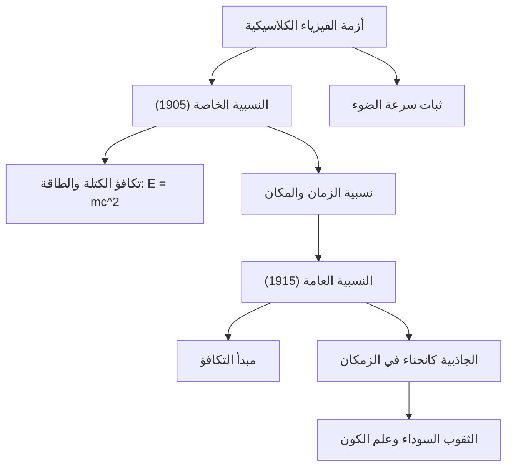

# الفيزياء: مدخل إلى نظرية النسبية - كيف غيّر أينشتاين مفاهيم الزمان والمكان

## مقدمة

أحدثت نظرية النسبية، التي صاغها ألبرت أينشتاين في مطلع القرن العشرين، ثورة فكرية عارمة نسفت مفاهيم البشرية المتوارثة عبر آلاف السنين حول طبيعة الزمان والمكان والجاذبية. فحتى ذلك الحين، كانت الميكانيكا الكلاسيكية التي أرسى دعائمها إسحاق نيوتن تفترض أن الزمان مقياس مطلق يتدفق بانتظام متطابق في أرجاء الكون كافة، وأن المكان مجرد مسرح ثلاثي الأبعاد صلب وثابت لا يتغير.

ومن خلال **النظرية النسبية الخاصة (1905)** و**النظرية النسبية العامة (1915)**، برهن أينشتاين على أن المكان والزمان ليسا كيانين منفصلين، بل يشكلان نسيجاً ديناميكياً رباعي الأبعاد يُعرف بـ **الزمكان (Spacetime)**. يتمدد هذا النسيج وينكمش وينحني تفاعلاً مع السرعة النسبية وتوزيع الكتلة والطاقة.

يستعرض هذا المقال بأسلوب علمي رصين نشأة النسبية، ومبادئها الأساسية، وصياغتها الرياضية، وبراهينها التجريبية وتطبيقاتها الحيوية في حياتنا اليومية.

## 1. مأزق الفيزياء الكلاسيكية ولغز سرعة الضوء

في أواخر القرن التاسع عشر، بدت الفيزياء وكأنها اقتربت من الاكتمال؛ إذ فسرت ميكانيكا نيوتن مدارات الكواكب وحركة الآلات، بينما وحدت معادلات ماكسويل الكهرباء والمغناطيسية وبرهنت على أن الضوء موجة كهرومغناطيسية. إلا أن تناقضاً جوهرياً ظهر بين النظريتين:

- **ميكانيكا نيوتن**: السرعات نسبية وقابلة للجمع المباشر. فإذا تحركت بسرعة 5 كم/ساعة داخل قطار يسير بسرعة 100 كم/ساعة، فإن الراصد على الرصيف يقيس سرعتك بـ 105 كم/ساعة.
- **كهروديناميكا ماكسويل**: سرعة انتشار الموجات الكهرومغناطيسية في الفراغ هي ثابت كوني مطلق: $c \approx 300,000\text{ كم/ثانية}$، ولا تتغير إطلاقاً سواء كان مصدر الضوء أو الراصد متحركاً أو ثابتاً.

إذا كانت سرعة الضوء ثابتة للجميع، فإن قانون جمع السرعات عند نيوتن ينهار. افترض الفيزيائيون آنذاك وجود وسط كوني خفي أطلقوا عليه "الأثير المضيء". لكن **تجربة مايكلسون ومورلي (1887)** أثبتت بدقة قاطعة عدم وجود أي أثر للأثير. وصلت الفيزياء الكلاسيكية إلى طريق مسدود.

وفي سن السادسة والعشرين، وبينما كان يعمل موظفاً في مكتب براءات الاختراع في برن، حسم أينشتاين هذا اللغز بجرأة فكرية نادرة.

## 2. النسبية الخاصة (1905): إعادة تعريف الحركة والزمان

نشر أينشتاين بحثه حول النسبية الخاصة عام 1905. وسميت "خاصة" لأنها تقتصر على الأطر المرجعية القصورية التي تتحرك بحركة مستقيمة منتظمة دون تسارع أو جاذبية. وقامت النظرية على فرضيتين بسيطتين:

### فرضيتا النسبية الخاصة
1. **مبدأ النسبية**: تأخذ قوانين الفيزياء نفس الصيغة الرياضية في جميع الأطر المرجعية القصورية. لا وجود لإطار سكون مطلق.
2. **ثبات سرعة الضوء**: سرعة الضوء في الفراغ ($c$) ثابتة لجميع الراصدين في الأطر القصورية، بصرف النظر عن سرعة مصدر الضوء أو الراصد.

قاد هاتان الفرضيتان إلى نتائج مذهلة صدمت التفكير التقليدي:

### نسبية التزامن وتشوه الزمكان
الحدثان اللذان يقعان في آن واحد بالنسبة لمراقب ساكن، لا يقعان في الوقت نفسه بالنسبة لمراقب متحرك: **التزامن نسبي**.

ولكي تبقى سرعة الضوء ثابتة للجميع، يجب أن يتغير الزمان والمكان فيزيائياً:
- **تمدد الزمن الحركي**: تدق ساعات الأجسام المتحركة بسرعة بمعدل أبطأ بالنسبة لمراقب ساكن:
  $$ \Delta t' = \frac{\Delta t}{\sqrt{1 - \frac{v^2}{c^2}}} $$
- **تقلص الأطوال (لورنتز)**: يتقلص الطول الفيزيائي للجسم المتحرك في اتجاه حركته كما يراه الراصد الساكن:
  $$ L' = L \sqrt{1 - \frac{v^2}{c^2}} $$

### تكافؤ الكتلة والطاقة ($E = mc^2$)
أعظم ثمار النسبية الخاصة هي المعادلة الأشهر في تاريخ العلم:

$$ E = mc^2 $$

حيث تمثل $E$ الطاقة، و $m$ الكتلة، و $c$ سرعة الضوء. وبما أن $c^2 \approx 9 \times 10^{16}\text{ م}^2/\text{ث}^2$ هو معامل تضخيم هائل، فإن جزءاً ضئيلاً من الكتلة يختزن طاقة مرعبة. كشفت هذه المعادلة سر توهج النجوم عبر الاندماج النووي، وأرست دعائم [الطاقة النووية](/p/how-nuclear-power-works/).

## 3. النسبية العامة (1915): الجاذبية انحناء هندسي

عانت النسبية الخاصة من قصورين: اقتصارها على الحركة المنتظمة وتناقضها مع جاذبية نيوتن اللحظية التي تنتهك الحد الأقصى لسرعة نقل التأثير (سرعة الضوء).

وبعد عقد كامل من المعاناة الرياضية، أنجز أينشتاين عام 1915 **النظرية النسبية العامة**.

### مبدأ التكافؤ
وصف أينشتاين فكرته الأولى بأنها «أسعد فكرة راودتني في حياتي»: **مبدأ التكافؤ (Equivalence Principle)**.

تخيل راصداً داخل مصعد مغلق تماماً. إذا سقط المصعد سقوطاً حراً في مجال جاذبية، سيطفو الشخص في حالة انعدام وزن ولن يشعر بأي ثقل. وعلى النقيض، إذا سُحب المصعد في الفضاء بصاروخ بتسارع $9.8\text{ م/ث}^2$ بعيداً عن أي كواكب، فسيُدفع الشخص نحو الأرضية بقوة مطابقة لجاذبية الأرض. استنتج أينشتاين أن **كتلة القصور وكتلة الجاذبية متطابقتان تماماً**، وأن الجاذبية محلياً لا يمكن تمييزها عن التسارع.

### الجاذبية هي انحناء نسيج الزمكان
أعلنت النسبية العامة أن الجاذبية ليست قوة سحب خفية، بل هي **انحناء وتشوه في نسيج الزمكان رباعي الأبعاد تسببه الكتلة والطاقة**. وتتحرك الأجرام عبر أقصر وأسهل مسارات طبيعية (الجيوديسيا) داخل تلك الهندسة المنحنية.

التشبيه الشائع هو وضع كرة بولينغ ثقيلة على قماش مطاطي مشدود: تُحدث الكرة هبوطاً وتقوساً مخروطياً. وإذا دحرجت كرة صغيرة بالقرب منها، فستدور حول كرة البولينغ بفعل انحناء القماش وليس بقوة جذب غير مرئية. وبالمثل، تدور الأرض حول الشمس لأنها تتبع انحناء الزمكان الذي تحدثه كتلة الشمس الضخمة.

### معادلات أينشتاين للمجال
تحدد **معادلات أينشتاين للمجال** العلاقة الرياضية الدقيقة بين انحناء الزمكان وتوزيع المادة والطاقة:

$$ R_{\mu\nu} - \frac{1}{2}g_{\mu\nu}R + \Lambda g_{\mu\nu} = \frac{8\pi G}{c^4} T_{\mu\nu} $$

حيث يمثل الطرف الأيسر هندسة وانحناء الزمكان، بينما يمثل الطرف الأيمن كثافة المادة والطاقة والضغط. لخص الفيزيائي جون ويلر هذه المعادلة قائلاً: *«الزمكان يخبر المادة كيف تتحرك، والمادة تخبر الزمكان كيف ينحني»*.

## 4. الإثباتات التجريبية وتطبيقات نظام GPS

أكدت أرصاد القرن الماضي دقة نبوءات النسبية العامة بصورة مبهرة:

1. **حضيض مدار عطارد**: فسرت النسبية بدقة انحرافاً قدره 43 ثانية قوسية في القرن لم تتمكن ميكانيكا نيوتن من تفسيره.
2. **انحناء الضوء (1919)**: أكدت بعثة آرثر إدينغتون أثناء كسوف الشمس انحناء ضوء النجوم قرب الشمس بمقدار 1.75 ثانية قوسية كما تنبأ أينشتاين، ليصبح أشهر عالم في العالم.
3. **موجات الجاذبية (2015)**: رصد مرصد LIGO موجات الجاذبية الناتجة عن اصطدام ثقبين أسودين، محققاً نبوءة أينشتاين بعد مائة عام (نوبل 2017).

### نظام تحديد المواقع (GPS)
تدخل النسبية في عمل **GPS** كل يوم:
- **النسبية الخاصة**: سرعة القمر المدارية تجعل ساعته **تتأخر 7 ميكروثانية يومياً**.
- **النسبية العامة**: ضعف الجاذبية في الفضاء يجعل ساعته **تتقدم 45 ميكروثانية يومياً**.
- **المحصلة الصافية**: تتقدم ساعات الأقمار بـ **+38 ميكروثانية يومياً**.

بدون تعديل هذا الفارق، سينحرف موقع GPS بمقدار **11.4 كيلومتر يومياً**، مما يعطل خرائط الهواتف نهائياً.

## 5. الحلم النهائي: نحو الجاذبية الكمية

بنت النسبية العامة صرح علم الكون الحديث، لكنها تقف اليوم أمام تحدٍ هائل: الجمع بين الزمكان المتصل للنسبية العامة وعالم الجسيمات المنفصل لـ **ميكانيكا الكم**. في مراكز الثقوب السوداء ولحظة الانفجار العظيم، تتصادم النظريتان رياضياتياً. ويظل ابتكار نظرية موحدة لـ **الجاذبية الكمية** الهدف الأسمى لفيزياء القرن الحادي والعشرين.

## خاتمة

تظل نظرية النسبية لألبرت أينشتاين تاجاً للفكر الإنساني؛ فقد أثبتت أن الزمان والمكان ليسا خشبة مسرح جامدة، بل هما طرفان فاعلان يرقصان في سيمفونية كونية بديعة مع المادة والنور.
