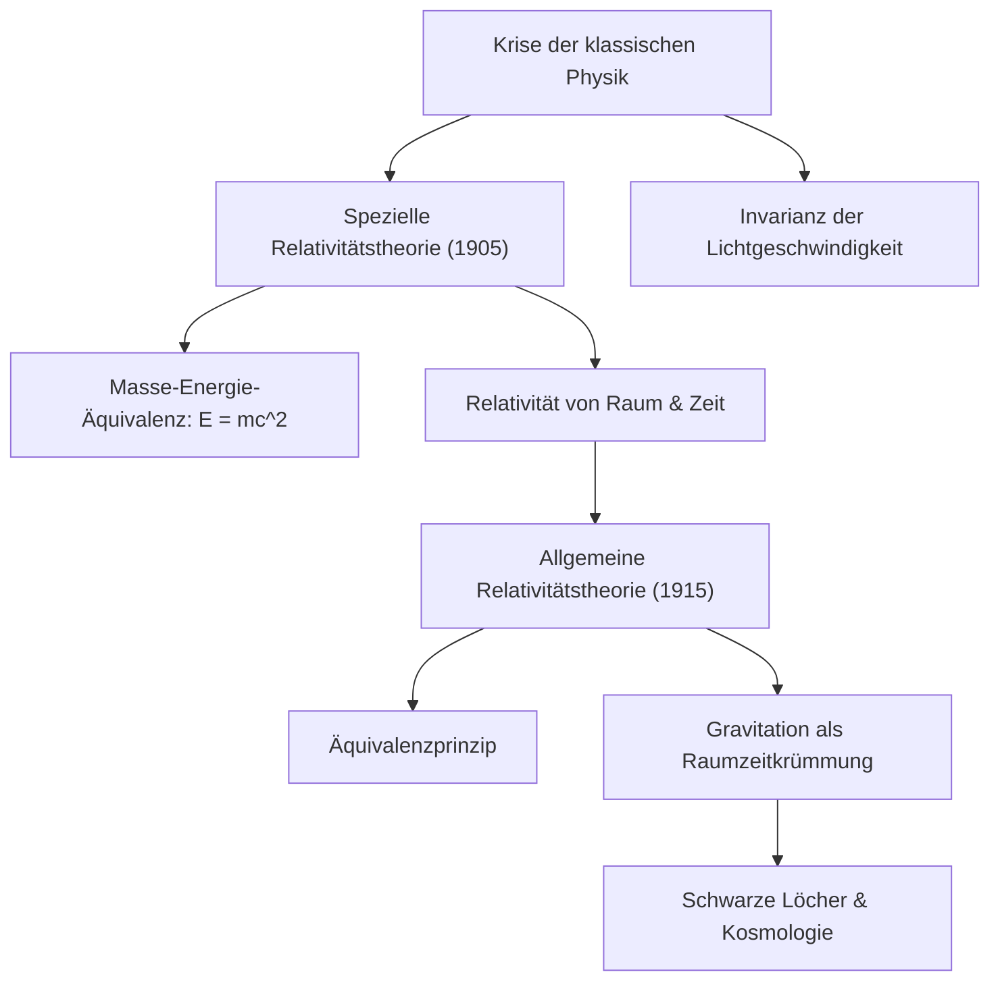

# Physik: Einführung in die Relativitätstheorie - Wie Einstein Raum und Zeit revolutionierte

## Einleitung

Die von Albert Einstein im frühen 20. Jahrhundert entwickelte Relativitätstheorie erschütterte das jahrhundertealte Weltbild der Menschheit über Raum, Zeit und Gravitation in seinen Grundfesten. Bis dahin galt die von Isaac Newton begründete klassische Mechanik: Zeit wurde als absolute, universell gleichförmig tickende Dimension verstanden, während der Raum als starre, unveränderliche dreidimensionale Kulisse aufgefasst wurde.

Mit der **Speziellen Relativitätstheorie (1905)** und der **Allgemeinen Relativitätstheorie (1915)** bewies Einstein, dass Raum und Zeit keine isolierten Absolutheiten sind. Sie bilden ein dynamisches, vierdimensionales Kontinuum – die **Raumzeit (Spacetime)** –, das sich in Abhängigkeit von relativen Geschwindigkeiten und Gravitationsfeldern dehnt, staucht und krümmt.

Dieser Beitrag bietet eine fundierte Einführung in die Entstehung der Relativitätstheorie, ihre mathematischen Prinzipien, empirischen Bestätigungen und ihre praktische Bedeutung in unserem Alltag.

## 1. Die Krise der klassischen Physik und das Rätsel des Lichts

Gegen Ende des 19. Jahrhunderts wähnte sich die Physik kurz vor ihrer Vollendung. Die Newtonsche Mechanik erklärte Planetenbahnen und Maschinenbewegungen, während die Maxwellschen Gleichungen Elektrizität und Magnetismus vereinten und Licht als elektromagnetische Welle identifizierten. Doch zwischen diesen beiden Theorien klaffte ein unauflösbarer Widerspruch:

- **Newtonsche Mechanik**: Geschwindigkeiten addieren sich linear. Geht man in einem 100 km/h schnellen Zug mit 5 km/h nach vorne, misst ein Beobachter auf dem Bahnsteig 105 km/h.
- **Maxwellsche Elektrodynamik**: Die Ausbreitungsgeschwindigkeit elektromagnetischer Wellen im Vakuum ist eine universelle Naturkonstante: $c \approx 300.000\text{ km/s}$, völlig unabhängig von der Bewegung der Lichtquelle oder des Beobachters.

Gilt für Licht stets dieselbe Geschwindigkeit, verliert das klassische Geschwindigkeitsadditionstheorem seine Gültigkeit. Physiker postulierten damals ein unsichtbares Trägermedium namens „Lichtäther“. Doch das berühmte **Michelson-Morley-Experiment von 1887** bewies, dass kein Ätherwind existiert. Die Physik befand sich in einer Sackgasse.

Der 26-jährige Albert Einstein, damals Prüfer am Schweizer Patentamt in Bern, überwand diese Krise durch einen revolutionären Gedankenansatz.

## 2. Die Spezielle Relativitätstheorie (1905): Eine neue Kinematik

1905 veröffentlichte Einstein seine Arbeit zur Speziellen Relativitätstheorie. Sie heißt „speziell“, weil sie sich auf unbeschleunigte Inertialsysteme beschränkt. Einstein postulierte zwei Grundsätze:

### Die beiden Postulate der Speziellen Relativitätstheorie
1. **Relativitätsprinzip**: Die Naturgesetze nehmen in allen Inertialsystemen dieselbe mathematische Gestalt an. Es gibt keinen absoluten Ruhezustand.
2. **Invarianz der Lichtgeschwindigkeit**: Die Lichtgeschwindigkeit im Vakuum ($c$) ist in allen Inertialsystemen konstant, unabhängig vom Bewegungszustand der Quelle oder des Empfängers.

Aus diesen beiden Postulaten folgen revolutionäre physikalische Phänomene:

### Relativität der Gleichzeitigkeit und die Dehnung der Raumzeit
Ereignisse, die für einen ruhenden Beobachter gleichzeitig stattfinden, sind es für einen bewegten Beobachter nicht: **Gleichzeitigkeit ist relativ**.

Damit die Lichtgeschwindigkeit für alle Beobachter konstant bleibt, müssen sich Raum- und Zeitmessungen dynamisch anpassen:
- **Kinematische Zeitdilatation**: Eine relativ zu einem Beobachter bewegte Uhr geht langsamer:
  $$ \Delta t' = \frac{\Delta t}{\sqrt{1 - \frac{v^2}{c^2}}} $$
- **Lorentz-Kontraktion**: Die räumliche Abmessung eines Objekts verkürzt sich in Bewegungsrichtung aus Sicht eines ruhenden Beobachters:
  $$ L' = L \sqrt{1 - \frac{v^2}{c^2}} $$

### Die Äquivalenz von Masse und Energie ($E = mc^2$)
Die berühmteste Formel der Wissenschaftsgeschichte entspringt direkt der Speziellen Relativitätstheorie:

$$ E = mc^2 $$

Hierbei steht $E$ für Energie, $m$ für Masse und $c$ für die Lichtgeschwindigkeit. Weil $c^2 \approx 9 \times 10^{16}\text{ m}^2/\text{s}^2$ ein unvorstellbar großer Faktor ist, verbirgt sich selbst in winzigster Materie eine ungeheure Energiemenge. Diese Formel entschlüsselte die Kernfusion unserer Sonne und begründete die zivile [Kernkraft](/p/how-nuclear-power-works/).

## 3. Die Allgemeine Relativitätstheorie (1915): Gravitation als Geometrie

Trotz ihres Triumphes wies die Spezielle Relativitätstheorie zwei Schwächen auf: Sie ignorierte Beschleunigungen und widersprach Newtons Gravitationsgesetz. Newtons Annahme einer augenblicklichen Fernwirkung verletzte die universelle Grenzgeschwindigkeit des Lichts.

Nach zehn Jahren intensiver mathematischer Arbeit vollendete Einstein 1915 die **Allgemeine Relativitätstheorie**.

### Das Äquivalenzprinzip
Einstein bezeichnete die Ausgangsidee als den „glücklichsten Gedanken meines Lebens“: **das Äquivalenzprinzip**.

Befindet sich ein Beobachter in einem geschlossenen Aufzug im freien Fall im Erdschwerefeld, schwebt er schwerelos; er spürt keine Gravitation. Wird die Kabine im schwerelosen Weltall mit $9,8\text{ m/s}^2$ beschleunigt, wird er auf den Boden gepresst – ein Effekt, der von der Schwerkraft auf der Erde physikalisch nicht zu unterscheiden ist. Einstein folgerte: **Schwere Masse und träge Masse sind identisch**, Gravitation und Beschleunigung lokal ununterscheidbar.

### Gravitation ist die Krümmung der Raumzeit
Gravitation ist keine unsichtbare Anziehungskraft, sondern **die geometrische Krümmung der vierdimensionalen Raumzeit durch Masse und Energie**. Körper bewegen sich kräftefrei auf den geradestmöglichen Bahnen (Geodäten) durch diese gekrümmte Geometrie.

Veranschaulicht wird dies oft durch eine schwere Kugel auf einem gespannten Gummituch: Die Kugel erzeugt eine Vertiefung. Eine kleine Murmel rollt daraufhin kreisförmig um die Kugel – nicht wegen einer Fernkraft, sondern weil das Tuch gekrümmt ist. Auf dieselbe Weise umkreist die Erde die Sonne auf einer Geodäte in der durch die Sonnenmasse gekrümmten Raumzeit.

### Die Einsteinschen Feldgleichungen
Die exakte mathematische Beziehung zwischen Raumzeitgeometrie und Materieverteilung formulieren die **Einsteinschen Feldgleichungen**:

$$ R_{\mu\nu} - \frac{1}{2}g_{\mu\nu}R + \Lambda g_{\mu\nu} = \frac{8\pi G}{c^4} T_{\mu\nu} $$

Hierbei ist:
- $R_{\mu\nu}$ der Ricci-Krümmungstensor,
- $g_{\mu\nu}$ der metrische Tensor,
- $R$ der Krümmungsskalar,
- $\Lambda$ die kosmologische Konstante (Dunkle Energie),
- $G$ die Newtonsche Gravitationskonstante,
- $T_{\mu\nu}$ der Energie-Impuls-Tensor.

Der Physiker John Archibald Wheeler fasste diese Gleichung treffend zusammen: *„Die Raumzeit sagt der Materie, wie sie sich bewegen soll; die Materie sagt der Raumzeit, wie sie sich krümmen soll.“*

## 4. Experimentelle Nachweise und Alltagsbezug im GPS

Anfänglich als abstrakte Theorie beargwöhnt, wurde die Allgemeine Relativitätstheorie in über einem Jahrhundert empirisch glänzend bestätigt.

### Historische Meilensteine
1. **Periheldrehung des Merkur**: Eine von Newton unerklärte Bahnverschiebung von 43 Bogensekunden pro Jahrhundert wurde von Einsteins Theorie exakt vorhergesagt.
2. **Lichtablenkung im Schwerefeld (1919)**: Arthur Eddingtons Sonnenfinsternis-Expedition wies nach, dass das Licht ferner Sterne durch das Gravitationsfeld der Sonne um 1,75 Bogensekunden gebeugt wurde – Einstein wurde über Nacht weltberühmt.
3. **Gravitationswellen (2015)**: Von Einstein 1916 vorhergesagte Wellen der Raumzeit wurden durch die LIGO-Detektoren bei der Verschmelzung zweier Schwarzer Löcher direkt gemessen (Physik-Nobelpreis 2017).

### Unser Alltag und Satellitennavigation (GPS)
Die Relativitätstheorie ist unverzichtbar für das **GPS**:
- **Spezielle Relativität**: Die Orbitalgeschwindigkeit ($\sim 3,9\text{ km/s}$) lässt die Atomuhren im Satelliten **täglich um 7 Mikrosekunden nachgehen**.
- **Allgemeine Relativität**: Das schwächere Schwerefeld in 20.200 km Höhe lässt die Uhren **täglich um 45 Mikrosekunden vorgehen**.
- **Nettoeffekt**: Die Uhren an Bord eilen um **+38 Mikrosekunden pro Tag** voraus.

Ohne relativistische Kompensation würde sich die Positionsbestimmung täglich um **11,4 Kilometer** verfälschen; Smartphone-Karten wären unbrauchbar.

## 5. Die offene Frage: Der Weg zur Quantengravitation

Die Allgemeine Relativitätstheorie begründete die moderne Kosmologie: Urknall, kosmische Expansion und Schwarze Löcher. Dennoch steht die Physik vor einem ungelösten Rätsel.

Die Allgemeine Relativitätstheorie beschreibt eine kontinuierliche, deterministische Raumzeit auf makroskopischer Ebene. Die **Quantenmechanik** beschreibt hingegen die diskrete, probabilistische Welt der kleinsten Teilchen. An Raumzeit-Singularitäten (im Zentrum Schwarzer Löcher oder beim Urknall) führen beide Theorien zu mathematischen Unendlichkeiten. Die Vereinigung beider Säulen in einer **Theorie der Quantengravitation** (Stringtheorie, Schleifenquantengravitation) ist die größte ungelöste Aufgabe der Gegenwart.

## Fazit

Einsteins Relativitätstheorie ist einer der erhabensten Höhepunkte menschlicher Geistesgeschichte. Sie lehrte uns, dass Raum und Zeit dynamische Teilnehmer im kosmischen Gefüge sind – ein ewiger Tanz aus Geometrie, Energie und Licht.
