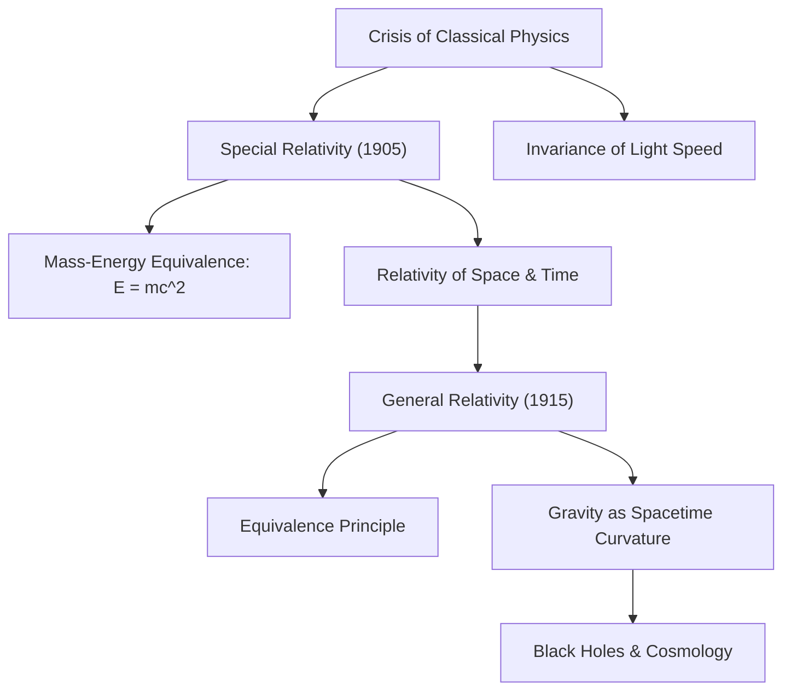

# Physics: Introduction to the Theory of Relativity - How Einstein Revolutionized Space and Time

## Introduction

Albert Einstein's Theory of Relativity, formulated in the early decades of the 20th century, fundamentally overturned humanity's long-held assumptions regarding time, space, and gravity. For centuries, classical Newtonian mechanics treated time as an absolute, immutable backdrop ticking uniformly throughout the entire cosmos, while space was regarded as a rigid, static, three-dimensional stage. 

Through his **Special Theory of Relativity (1905)** and **General Theory of Relativity (1915)**, Einstein proved that space and time are not independent absolutes. Instead, they form a unified, dynamic four-dimensional fabric—**spacetime**—that flexes, dilates, contracts, and curves in response to relative velocity and mass-energy.

This article provides a rigorous yet accessible journey through the genesis of relativity, its mathematical foundations, experimental proofs, everyday applications, and its profound legacy in modern cosmology.

## 1. The Crisis of Classical Physics and the Mystery of Light

By the late 19th century, physics seemed near completion, anchored by two towering triumphs: **Newtonian Mechanics**, which accurately governed planetary motions and mechanical machinery, and **Maxwell's Electrodynamics**, which unified electricity, magnetism, and demonstrated that light is an electromagnetic wave.

However, an irreconcilable mathematical contradiction lurked between them:
- Under Galilean-Newtonian relativity, velocities add linearly: if you walk at 5 km/h inside a train moving at 100 km/h, an observer on the platform measures your speed as 105 km/h.
- Yet Maxwell's wave equations yielded a constant propagation velocity for electromagnetic waves in a vacuum: $c \approx 300,000\text{ km/s}$, regardless of the motion of the emitter or the observer.

Physicists postulated that light must travel through an invisible, all-pervading cosmic medium called the "luminiferous ether." However, the landmark **Michelson-Morley experiment of 1887** failed to detect any trace of this ether wind. Classical physics had hit a profound dead end. 

The twenty-six-year-old Albert Einstein, working as a patent clerk in Bern, Switzerland, resolved this paradox with radical intellectual courage.

## 2. Special Relativity (1905): Redefining Motion

In 1905 (Einstein's *Annus Mirabilis*), he published his paper on Special Relativity. The theory is called "special" because it is restricted to the specific case of observers in uniform, unaccelerated motion (inertial reference frames). Einstein established the theory on just two foundational postulates:

### The Two Postulates of Special Relativity
1. **The Principle of Relativity**: The laws of physics take identical mathematical forms in all inertial reference frames. There is no preferred or absolute state of rest.
2. **The Invariance of the Speed of Light**: The speed of light in vacuum ($c$) is universally constant for all inertial observers, regardless of the relative velocity of the light source or the detector.

Accepting these two postulates leads to revolutionary physical consequences that contradict human everyday intuition.

### Relativity of Simultaneity and Spacetime Dilation
Because the speed of light must remain constant for all observers, **simultaneity is relative**. Two spatial events that appear simultaneous to an observer at rest occur at different times for an observer in relative motion.

Furthermore, to reconcile constant light speed with relative motion, measurements of time and space must physically adjust:
- **Kinematic Time Dilation**: Clocks moving relative to an observer tick slower than clocks at rest relative to that observer:
  $$ \Delta t' = \frac{\Delta t}{\sqrt{1 - \frac{v^2}{c^2}}} $$
- **Lorentz Contraction**: The physical length of an object moving at relativistic velocity contracts along the direction of motion as seen by a stationary observer:
  $$ L' = L \sqrt{1 - \frac{v^2}{c^2}} $$

### Mass-Energy Equivalence ($E = mc^2$)
Perhaps the most famous mathematical equation in human history emerged as a corollary of special relativity:

$$ E = mc^2 $$

Here, $E$ denotes total energy, $m$ is relativistic mass, and $c$ is the speed of light. Because $c^2 \approx 9 \times 10^{16}\text{ m}^2/\text{s}^2$ is an astronomically large multiplier, an infinitesimal quantity of mass harbors an immense reservoir of energy. This equation unraveled the mystery of stellar nucleosynthesis—explaining why our Sun can burn for billions of years—and unlocked both the peaceful promise of [nuclear power](/p/how-nuclear-power-works/) and the devastating power of atomic weaponry.

## 3. General Relativity (1915): Gravity as Spacetime Geometry

Despite its triumph, special relativity suffered from two major limitations: it applied only to uniform motion, and it contradicted Newton's law of universal gravitation. Newton assumed that gravitational force acts instantaneously across arbitrary distances—violating special relativity's decree that no signal or causal influence can propagate faster than light.

After a decade of intense mathematical labor, Einstein completed his masterwork in 1915: the **General Theory of Relativity**.

### The Equivalence Principle
The foundational intuition behind general relativity was what Einstein described as "the happiest thought of my life": **The Equivalence Principle**. 

Imagine an observer inside an enclosed elevator. If the elevator is in free fall inside a gravitational field, the occupant floats weightlessly, feeling zero gravity. Conversely, if the elevator is accelerating upward in deep space at $9.8\text{ m/s}^2$ far from any mass, the occupant feels pinned to the floor by an apparent gravity indistinguishable from Earth's gravity. Einstein concluded that **gravitational mass and inertial mass are physically identical**, and gravity is indistinguishable from uniform acceleration.

### Gravity is the Curvature of Spacetime
General relativity abolishes Newton's notion of gravity as an invisible pulling force. Instead, **mass and energy warp the geometric fabric of four-dimensional spacetime**, and objects simply follow the straightest possible paths (geodesics) through this curved geometry.

A classic pedagogical analogy is a heavy bowling ball placed upon a stretched rubber sheet: the ball depresses the surface, creating a funnel-shaped indentation. If you roll a small marble nearby, it orbits the bowling ball not because an invisible force pulls it, but because the sheet itself is curved. Similarly, Earth orbits the Sun by following the natural curvature induced by the Sun's massive presence in spacetime.

### The Einstein Field Equations
The rigorous mathematical formulation connecting spacetime geometry to the distribution of matter and energy is given by the **Einstein Field Equations**:

$$ R_{\mu\nu} - \frac{1}{2}g_{\mu\nu}R + \Lambda g_{\mu\nu} = \frac{8\pi G}{c^4} T_{\mu\nu} $$

Where:
- $R_{\mu\nu}$ is the Ricci curvature tensor,
- $g_{\mu\nu}$ is the metric tensor defining spacetime distances,
- $R$ is the scalar curvature,
- $\Lambda$ is the cosmological constant (associated with dark energy),
- $G$ is Newton's gravitational constant,
- $T_{\mu\nu}$ is the stress-energy-momentum tensor representing all matter, radiation, and pressure.

Physicist John Archibald Wheeler famously summarized this ten-component tensor equation in an unforgettable sentence: *"Spacetime tells matter how to move; matter tells spacetime how to curve."*

## 4. Empirical Confirmations and Practical Everyday Applications

Initially regarded by many contemporaries as abstract mathematical metaphysics, general relativity has been validated by an extraordinary century of experimental tests.

### Landmark Empirical Confirmations
1. **Perihelion Precession of Mercury**: Classical Newtonian mechanics could not account for an anomalous advance of 43 arcseconds per century in Mercury's orbit. General relativity explained this discrepancy perfectly without adjustable parameters.
2. **Gravitational Deflection of Light (1919)**: Sir Arthur Eddington's solar eclipse expedition observed that starlight grazing the Sun was deflected by exactly the angle predicted by spacetime curvature ($1.75$ arcseconds), catapulting Einstein to global celebrity.
3. **Gravitational Waves (2015)**: Predicted by Einstein in 1916 as ripples in spacetime propagating at light speed, gravitational waves were directly detected a century later by LIGO from the collision of two stellar-mass black holes, earning the 2017 Nobel Prize in Physics.

### Everyday Reliance: The Global Positioning System (GPS)
Far from being an ivory-tower theory, relativity is essential to modern satellite navigation:
- **Special Relativity**: High orbital speeds ($v \approx 3.9\text{ km/s}$) cause satellite atomic clocks to run **slower** by roughly $7\ \mu\text{s/day}$.
- **General Relativity**: Weaker gravity at an altitude of 20,200 km causes satellite clocks to run **faster** by roughly $45\ \mu\text{s/day}$.
- **Net Relativistic Effect**: Clocks in orbit advance by $+38\ \mu\text{s/day}$.

Uncorrected, this 38-microsecond drift would induce a positioning error of **11.4 kilometers every single day**. Modern smartphone navigation functions only because GPS satellites deliberately tune their clock frequencies to offset Einsteinian relativistic effects.

## 5. The Frontier: Reconciling Relativity with Quantum Mechanics

General relativity forms the foundation of modern cosmology, successfully predicting the Big Bang, cosmic expansion, and supermassive black holes. Yet, physics faces an unresolved grand crisis.

General relativity describes a smooth, continuous, deterministic spacetime on cosmic scales. Conversely, **quantum mechanics** describes a probabilistic, discrete, non-local realm on subatomic scales. When applied simultaneously to singularities—such as the center of a black hole or the cosmic beginning of the Big Bang—the mathematical equations yield nonsensical infinities. 

Unifying these two master theories into a single coherent framework of **Quantum Gravity** (via String Theory, Loop Quantum Gravity, or Holographic Duality) remains the Holy Grail of 21st-century theoretical physics.

## Conclusion

The Theory of Relativity stands as one of the supreme triumphs of human intellect. Single-handedly, Albert Einstein dismantled millennia of intuitive dogmas regarding space and time, revealing a universe far more interconnected, flexible, and sublime than anyone had imagined. 

Whenever we gaze up into the night sky or navigate city streets with our smartphones, we participate in the profound cosmic reality unveiled by Einstein: a universe where space and time dance to the rhythm of matter and light.
