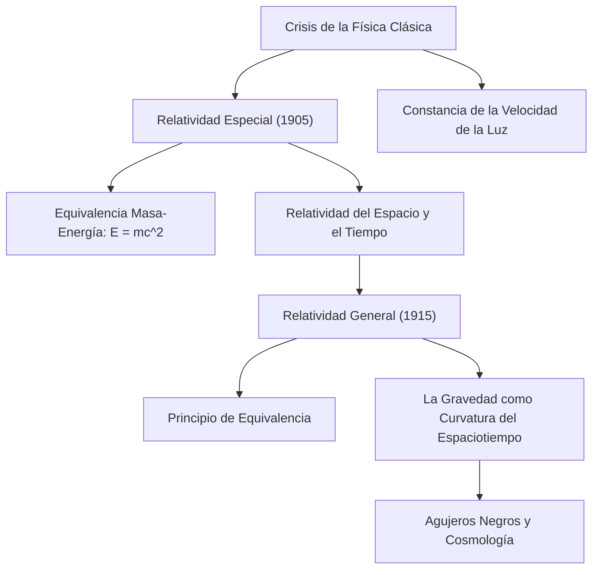

# Física: Introducción a la Teoría de la Relatividad - Cómo Einstein Transformó el Espacio y el Tiempo

## Introducción

La Teoría de la Relatividad, desarrollada por Albert Einstein a principios del siglo XX, transformó de raíz las concepciones milenarias de la humanidad acerca del tiempo, el espacio y la gravedad. Hasta entonces, la física clásica edificada por Isaac Newton consideraba el tiempo como un flujo absoluto e inmutable que avanzaba al mismo ritmo en todo el cosmos, y el espacio como un escenario tridimensional rígido e inerte.

A través de la **Teoría de la Relatividad Especial (1905)** y la **Teoría de la Relatividad General (1915)**, Einstein demostró que el espacio y el tiempo forman un tejido dinámico de cuatro dimensiones: el **espaciotiempo (Spacetime)**. Esta estructura se estira, se contrae y se curva de forma continua bajo el efecto de la velocidad relativa y la concentración de masa y energía.

En este artículo exploramos el contexto histórico que propició este cambio de paradigma, sus postulados esenciales, sus ecuaciones maestras, las comprobaciones experimentales y sus aplicaciones cotidianas.

## 1. El Callejón sin Salida de la Física Clásica y el Enigma de la Luz

A finales del siglo XIX, la física parecía una disciplina consolidada. La mecánica de Newton explicaba la órbita de los planetas y el movimiento de las máquinas, mientras que las ecuaciones de Maxwell unificaban la electricidad y el magnetismo, demostrando que la luz es una onda electromagnética. Sin embargo, existía un conflicto insalvable entre ambas:

- **Mecánica Newtoniana**: La velocidad es relativa y aditiva. Si caminamos a 5 km/h dentro de un tren que viaja a 100 km/h, un observador en el andén medirá una velocidad de 105 km/h.
- **Electromagnetismo de Maxwell**: La velocidad de propagación de las ondas electromagnéticas en el vacío es una constante universal: $c \approx 300.000\text{ km/s}$, con independencia del movimiento del emisor o del receptor.

Si la velocidad de la luz es idéntica para todos los observadores, la ley clásica de adición de velocidades colapsa. Para salvar esta discrepancia, los físicos propusieron la existencia del «éter lumínico», un medio elástico invisible que supuestamente llenaba el universo. Sin embargo, el célebre **experimento de Michelson-Morley (1887)** demostró con gran precisión que dicho éter no existía.

A los 26 años, mientras trabajaba como examinador en la oficina de patentes de Berna, Einstein resolvió este enigma con una audacia conceptual sin precedentes.

## 2. La Relatividad Especial (1905): Redefiniendo el Movimiento

En 1905, Einstein publicó su teoría de la relatividad especial. Se denomina «especial» porque restringe su análisis a sistemas de referencia inerciales, es decir, observadores que se desplazan a velocidad constante sin aceleración ni campos gravitatorios. La teoría parte de dos postulados:

### Los Dos Postulados Fundamentales
1. **Principio de Relatividad**: Las leyes de la física adoptan la misma forma matemática en todos los sistemas de referencia inerciales. No existe el reposo absoluto.
2. **Invarianza de la Velocidad de la Luz**: La velocidad de la luz en el vacío ($c$) es idéntica para todos los observadores inerciales, independientemente del movimiento relativo de la fuente emisora o del detector.

De estos dos axiomas se derivan consecuencias físicas que desafían el sentido común ordinario.

### La Relatividad de la Simultaneidad y la Deformación del Tiempo y el Espacio
Dos sucesos que un observador percibe como simultáneos no lo son para otro observador que se desplace a distinta velocidad. No existe un «ahora» absoluto en el universo: **la simultaneidad es relativa**.

Para que la velocidad de la luz se mantenga inalterable, las escalas de tiempo y espacio deben acomodarse dinámicamente:
- **Dilatación Temporal Cinemática**: El reloj de un objeto que se mueve a gran velocidad respecto a un observador en reposo avanza más despacio:
  $$ \Delta t' = \frac{\Delta t}{\sqrt{1 - \frac{v^2}{c^2}}} $$
- **Contracción de Lorentz**: Para el observador estacionario, la longitud de un cuerpo en movimiento se acorta a lo largo de la dirección de desplazamiento:
  $$ L' = L \sqrt{1 - \frac{v^2}{c^2}} $$

### Equivalencia Masa-Energía ($E = mc^2$)
El corolario más trascendental de la relatividad especial es la identidad fundamental entre masa y energía:

$$ E = mc^2 $$

Donde $E$ es la energía, $m$ la masa y $c$ la velocidad de la luz. Como el término $c^2 \approx 9 \times 10^{16}\text{ m}^2/\text{s}^2$ es un factor astronómico, una masa ínfima encierra una cantidad colosal de energía. Este principio reveló el secreto del brillo de las estrellas mediante fusión nuclear y sentó las bases de la [energía nuclear](/p/how-nuclear-power-works/).

## 3. La Relatividad General (1915): La Gravedad como Geometría

La relatividad especial contenía dos limitaciones intrínsecas: se ceñía a movimientos uniformes y colisionaba con la ley de gravitación universal de Newton. La noción de una fuerza gravitatoria que actúa instantáneamente a distancia violaba el límite de la velocidad de la luz impuesto por la relatividad.

Tras una década de profunda investigación matemática, Einstein presentó en 1915 la **Teoría de la Relatividad General**.

### El Principio de Equivalencia
Einstein describió el punto de partida como «el pensamiento más afortunado de mi vida»: **el Principio de Equivalencia**.

Imaginemos a un observador dentro de un ascensor cerrado. Si el ascensor cae libremente en un campo gravitatorio, el ocupante flota ingrávido y no percibe gravedad alguna. Por el contrario, si el ascensor se encuentra en el espacio exterior sin gravedad pero es acelerado hacia arriba a $9,8\text{ m/s}^2$, el ocupante es presionado contra el suelo, experimentando una fuerza indistinguible de la gravedad terrestre. Einstein concluyó que **la masa inercial y la masa gravitatoria son equivalentes**, y que la gravedad es localmente indistinguible de una aceleración.

### La Gravedad es la Curvatura del Espaciotiempo
La relatividad general redefine la gravedad: no es una fuerza invisible de atracción mutua entre masas, sino **la manifestación de la curvatura del espaciotiempo tetradimensional provocada por la presencia de masa y energía**. Los cuerpos simplemente siguen trayectorias naturales de mínima distancia (geodésicas) en esa geometría curva.

La analogía clásica es una pesada bola de boliche colocada sobre una lámina de goma tensada: la bola deforma la superficie creando un hundimiento cónico. Si se lanza una pequeña canica, esta orbitará alrededor de la bola no por una fuerza de atracción misteriosa, sino guiada por la pendiente de la tela deformada. De igual modo, la Tierra orbita alrededor del Sol siguiendo la curvatura que la colosal masa solar induce en el espaciotiempo.

### Las Ecuaciones de Campo de Einstein
La formulación matemática rigurosa que conecta la geometría del espaciotiempo con la distribución de materia y energía viene dada por las **Ecuaciones de Campo de Einstein**:

$$ R_{\mu\nu} - \frac{1}{2}g_{\mu\nu}R + \Lambda g_{\mu\nu} = \frac{8\pi G}{c^4} T_{\mu\nu} $$

Donde:
- $R_{\mu\nu}$ es el tensor de curvatura de Ricci,
- $g_{\mu\nu}$ es el tensor métrico que describe las distancias en el espaciotiempo,
- $R$ es la curvatura escalar,
- $\Lambda$ es la constante cosmológica (asociada a la energía oscura),
- $G$ es la constante de gravitación universal de Newton,
- $T_{\mu\nu}$ es el tensor de energía-momento que agrupa masa, radiación y presión.

El físico John Archibald Wheeler sintetizó esta ecuación en una frase legendaria: *«La materia le dice al espaciotiempo cómo curvarse; el espaciotiempo le dice a la materia cómo moverse»*.

## 4. Pruebas Experimentales y su Aplicación en el GPS

Considerada inicialmente por muchos físicos de su época como un ejercicio abstracto y especulativo, la relatividad general ha superado más de un siglo de exhaustivas verificaciones observacionales.

### Verificaciones Históricas
1. **La Precesión del Perihelio de Mercurio**: La mecánica newtoniana no lograba justificar una anomalía de 43 segundos de arco por siglo en la órbita de Mercurio; la relatividad general la calculó con absoluta exactitud.
2. **La Desviación Gravitatoria de la Luz (1919)**: La expedición de Arthur Eddington durante un eclipse solar total constató que la luz de las estrellas que rozaban el borde solar se curvaba 1,75 segundos de arco, confirmando la predicción de Einstein y consagrándolo mundialmente.
3. **Ondas Gravitacionales (2015)**: Previstas por Einstein en 1916 como ondulaciones del espaciotiempo generadas por masas aceleradas, fueron detectadas por el observatorio LIGO tras la colisión de dos agujeros negros distantes, logrando el Premio Nobel de Física de 2017.

### Nuestra Vida Diaria y el Sistema GPS
La relatividad no es un ejercicio teórico lejano; es esencial para el funcionamiento del **GPS**:
- **Efecto de la Relatividad Especial**: Por volar a unos 3,9 km/s, los relojes de los satélites **se retrasan 7 microsegundos al día**.
- **Efecto de la Relatividad General**: Por orbitar a 20.200 km donde la gravedad es más débil, los relojes **se adelantan 45 microsegundos al día**.
- **Efecto Neto**: Los relojes orbitales marchan **+38 microsegundos al día más rápidos** que los terrestres.

Sin la corrección relativista implementada en los satélites, el error de posición se acumularía a razón de **11,4 kilómetros cada día**, haciendo que cualquier navegador móvil quedase inutilizado en cuestión de horas.

## 5. El Gran Desafío: Hacia una Teoría de la Gravedad Cuántica

La relatividad general cimentó la cosmología moderna: la hipótesis del Big Bang, la expansión del cosmos y la física de los agujeros negros. Sin embargo, la física contemporánea se enfrenta a una fisura fundamental.

La relatividad general describe un espaciotiempo continuo, geométrico y determinista a escalas cósmicas. Por su parte, la **mecánica cuántica** describe un micromundo discreto, probabilístico e indeterminado. En el centro de los agujeros negros o en el instante inicial del Big Bang (singularidades), ambas teorías entran en contradicción matemática insalvable. El desarrollo de una teoría unificada de **Gravedad Cuántica** (como la teoría de cuerdas o la gravedad cuántica de bucles) representa la meta cumbre de la física del siglo XXI.

## Conclusión

La Teoría de la Relatividad constituye una de las mayores cumbres intelectuales de la historia humana. De manera individual, Albert Einstein derribó certezas milenarias y nos reveló que el espacio y el tiempo son actores dinámicos entrelazados con la materia y la luz, protagonizando la gran danza cósmica del universo.
