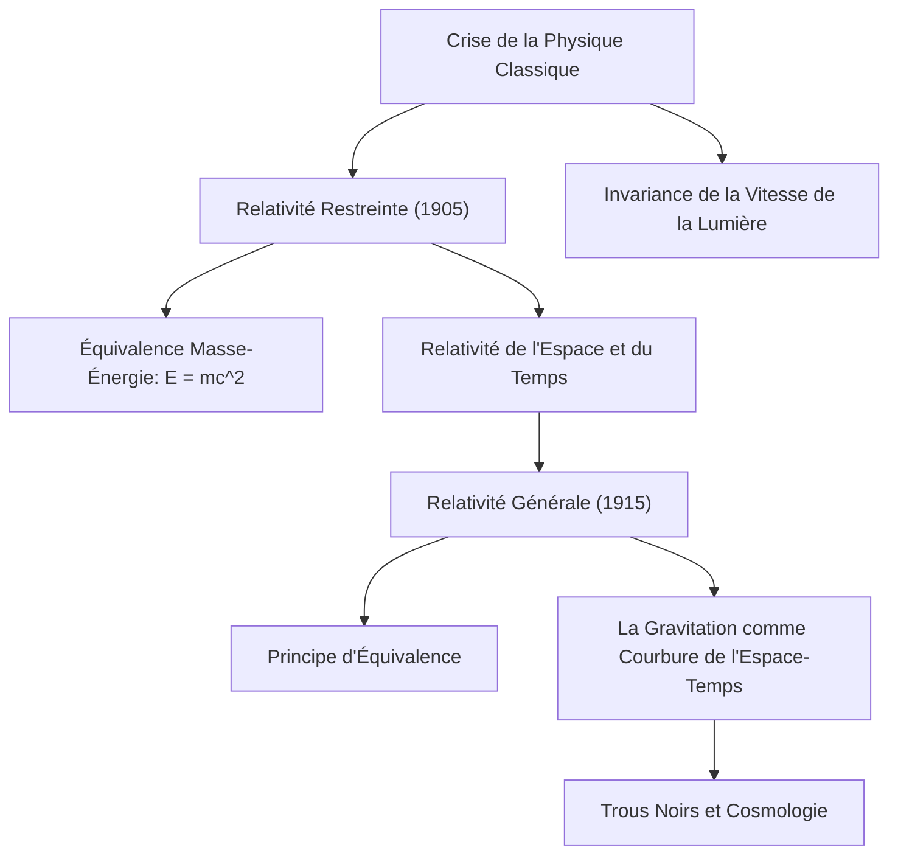

# Physique : Introduction à la Théorie de la Relativité - Comment Einstein a Révolutionné l'Espace et le Temps

## Introduction

La théorie de la relativité, échafaudée par Albert Einstein au début du XXe siècle, a bouleversé les conceptions millénaires de l'humanité sur la nature du temps, de l'espace et de la gravitation. Jusqu'alors, la mécanique classique d'Isaac Newton considérait le temps comme une grandeur absolue, uniforme et immuable s'écoulant à l'identique dans tout le cosmos, tandis que l'espace était conçu comme un réceptacle tridimensionnel rigide et figé.

Par la **Relativité Restreinte (1905)** et la **Relativité Générale (1915)**, Einstein a démontré que le temps et l'espace sont indissociables et forment un continuum dynamique à quatre dimensions : **l'espace-temps (Spacetime)**. Cette structure n'est ni rigide ni passive : elle s'étire, se contracte et se courbe sous l'effet de la vitesse relative et de la répartition de la masse et de l'énergie.

Cet article retrace la genèse de cette révolution scientifique, ses postulats fondamentaux, ses équations directrices, ses confirmations expérimentales et ses applications pratiques dans notre vie quotidienne.

## 1. L'Impasse de la Physique Classique et le Mystère de la Lumière

À la fin du XIXe siècle, l'édifice de la physique semblait presque achevé. La mécanique newtonienne décrivait avec une précision millimétrique les orbites célestes et les rouages industriels, tandis que les équations de Maxwell unifiaient l'électricité, le magnétisme et établissaient la nature ondulatoire de la lumière. Pourtant, une contradiction fatale séparait ces deux géants :

- **Mécanique Newtonienne** : Toute vitesse est relative et obéit à la loi d'addition galiléenne. Si vous marchez à 5 km/h dans un train roulant à 100 km/h, un observateur resté sur le quai mesure votre vitesse à 105 km/h.
- **Électrodynamique de Maxwell** : La vitesse de propagation des ondes électromagnétiques dans le vide est une constante absolue : $c \approx 300\ 000\text{ km/s}$, indépendante de la vitesse de la source lumineuse ou de l'observateur.

Si la vitesse de la lumière est identique pour tous, la loi d'addition des vitesses de Newton est mise en échec. Les physiciens de l'époque postulèrent alors l'existence d'un milieu matériel invisible remplissant tout l'espace : « l'éther luminifère ». Cependant, **l'expérience de Michelson-Morley (1887)** démontra rigoureusement qu'aucun vent d'éther n'existait. La physique classique était dans une impasse totale.

C'est alors qu'un jeune employé de 26 ans à l'Office des brevets de Berne, Albert Einstein, trancha le nœud gordien avec une audace intellectuelle sans précédent.

## 2. La Relativité Restreinte (1905) : La Refonte du Mouvement

En 1905, Einstein publia sa théorie de la relativité restreinte. L'adjectif « restreinte » indique qu'elle s'applique uniquement aux référentiels inertiels, c'est-à-dire en mouvement rectiligne uniforme, exempts de toute accélération et de gravitation. Einstein fonda sa théorie sur deux postulats limpides :

### Les Deux Postulats Fondamentaux
1. **Principe de Relativité** : Les lois de la physique s'expriment sous la même forme mathématique dans tous les référentiels inertiels. Aucun repère n'est privilégié ni au repos absolu.
2. **Invariance de la Vitesse de la Lumière** : La célérité de la lumière dans le vide ($c$) est rigoureusement identique pour tous les observateurs inertiels, quel que soit l'état de mouvement de la source émettrice ou du récepteur.

Ces deux principes simples engendrent des conséquences vertigineuses qui heurtent le sens commun :

### Relativité de la Simultanéité et Déformation Spatiotemporelle
Deux événements perçus comme simultanés par un observateur immobile ne le sont plus pour un observateur en mouvement. **La simultanéité n'a plus de caractère absolu**.

Pour maintenir la vitesse de la lumière constante pour tous, ce sont les mesures de l'espace et du temps qui doivent s'ajuster dynamiquement :
- **Dilatation Temporelle Cinématique** : L'horloge d'un objet en mouvement rapide bat plus lentement que celle d'un observateur au repos :
  $$ \Delta t' = \frac{\Delta t}{\sqrt{1 - \frac{v^2}{c^2}}} $$
- **Contraction des Longueurs (Lorentz)** : La dimension spatiale d'un corps se déplaçant à vitesse relativiste apparaît contractée dans le sens du mouvement pour un observateur fixe :
  $$ L' = L \sqrt{1 - \frac{v^2}{c^2}} $$

### L'Équivalence Masse-Énergie ($E = mc^2$)
Le fruit le plus spectaculaire de la relativité restreinte est l'équation la plus célèbre de l'histoire des sciences :

$$ E = mc^2 $$

Où $E$ est l'énergie totale, $m$ la masse et $c$ la vitesse de la lumière. Le facteur multiplicateur $c^2 \approx 9 \times 10^{16}\text{ m}^2/\text{s}^2$ étant gigantesque, une quantité infime de matière recèle une énergie phénoménale. Cette relation a percé le secret des réactions thermonucléaires qui font briller le Soleil et posé les jalons de [l'énergie nucléaire](/p/how-nuclear-power-works/).

## 3. La Relativité Générale (1915) : La Gravitation comme Géométrie

Bien que triomphale, la relativité restreinte souffrait de deux limites : elle excluait l'accélération et contredisait la loi de gravitation de Newton. La force gravitationnelle newtonienne agissant de manière instantanée à distance violait le principe selon lequel aucune information ne peut voyager plus vite que la lumière.

Après dix années d'efforts mathématiques prodigieux, Einstein acheva en 1915 son chef-d'œuvre : la **Théorie de la Relativité Générale**.

### Le Principe d'Équivalence
Le point de départ fut ce qu'Einstein nomma « la pensée la plus heureuse de ma vie » : **le Principe d'Équivalence**.

Considérons une personne enfermée dans une cabine d'ascenseur sans fenêtre. Si la cabine est en chute libre dans un champ de gravité, l'occupant flotte en apesanteur : il ne ressent aucune pesanteur. À l'inverse, si la cabine est propulsée dans l'espace lointain avec une accélération constante de $9,8\text{ m/s}^2$, l'occupant est plaqué au plancher et éprouve une sensation indistinguable de la gravité terrestre. Einstein en déduisit que **la masse inertielle et la masse gravitationnelle sont rigoureusement équivalentes**, et que la gravitation est localement indistinguable d'une accélération.

### La Gravitation est la Courbure de l'Espace-Temps
La relativité générale balaie l'idée d'une force invisible s'exerçant à travers le vide. **La masse et l'énergie courbent la trame de l'espace-temps à quatre dimensions**, et les corps ne font que suivre les lignes les plus droites possibles (les géodésiques) dans cette géométrie déformée.

L'analogie usuelle est celle d'une boule de bowling lourde posée sur une toile élastique tendue : la toile s'affaisse et forme un creux. Une petite bille roulant à proximité sera déviée et se mettra à tourner autour de la boule, non par une force magnétique cachée, mais parce que la toile est courbée sous ses pas. De la même façon, la Terre est en orbite autour du Soleil parce qu'elle suit la courbure naturelle imprimée à l'espace-temps par la masse colossale de notre étoile.

### Les Équations du Champ d'Einstein
L'expression tensorielle régissant ce couplage entre géométrie et matière est donnée par les **Équations d'Einstein** :

$$ R_{\mu\nu} - \frac{1}{2}g_{\mu\nu}R + \Lambda g_{\mu\nu} = \frac{8\pi G}{c^4} T_{\mu\nu} $$

Où :
- $R_{\mu\nu}$ est le tenseur de courbure de Ricci,
- $g_{\mu\nu}$ est le tenseur métrique qui décrit la structure de l'espace-temps,
- $R$ est la courbure scalaire,
- $\Lambda$ est la constante cosmologique (associée à l'énergie noire),
- $G$ est la constante de gravitation universelle,
- $T_{\mu\nu}$ est le tenseur énergie-impulsion représentant la densité de matière et de rayonnement.

Le physicien John Archibald Wheeler résuma cette équation magistrale d'une phrase mémorable : *« L'espace-temps dicte à la matière comment bouger ; la matière dicte à l'espace-temps comment se courber. »*

## 4. Confirmations Expérimentales et Applications Pratiques

Considérée à ses débuts comme une pure spéculation mathématique, la relativité générale a été confirmée par un siècle entier d'expériences d'une précision éclatante.

### Les Vérifications Historiques
1. **L'Avance du Périhélie de Mercure** : Newton laissait inexpliquée une dérive anormale de 43 secondes d'arc par siècle de l'orbite de Mercure ; la relativité générale la résolut à la virgule près.
2. **La Déviation de la Lumière (1919)** : Lors d'une éclipse totale de Soleil, l'expédition menée par Sir Arthur Eddington constata que la trajectoire des rayons lumineux provenant d'étoiles lointaines était infléchie de 1,75 seconde d'arc par la masse du Soleil, propulsant Einstein au rang d'icône mondiale.
3. **Les Ondes Gravitationnelles (2015)** : Prédites par Einstein en 1916 comme des rides dans le tissu spatiotemporel, elles furent détectées directement par les interféromètres de LIGO un siècle plus tard lors de la fusion de deux trous noirs (prix Nobel de physique 2017).

### Notre Quotidien et la Navigation par Satellite (GPS)
La relativité s'immisce dans notre vie quotidienne à travers le fonctionnement du **GPS** :
- **Relativité Restreinte** : La vitesse orbitale rapide ($\sim 3,9\text{ km/s}$) fait **retarder** les horloges atomiques satellitaires de $7\ \mu\text{s/jour}$.
- **Relativité Générale** : L'altitude de 20 200 km où la gravité est plus faible fait **avancer** les horloges de $45\ \mu\text{s/jour}$.
- **Effet Relativiste Net** : Les horloges orbitales prennent une avance quotidienne de **+38 microsecondes**.

Sans la prise en compte scrupuleuse des équations d'Einstein, les calculs de positionnement dériveraient de **11,4 kilomètres par jour**, rendant tout guidage sur smartphone complètement inutilisable.

## 5. Le Défi Suprême : Vers la Gravitation Quantique

La relativité générale a inauguré la cosmologie moderne : le modèle du Big Bang, l'expansion de l'Univers et l'astrophysique des trous noirs. Pourtant, un gouffre théorique subsiste.

La relativité générale décrit un espace-temps lisse, continu et déterministe, tandis que la **mécanique quantique** décrit un monde discontinu, probabiliste et non local. Au cœur des trous noirs ou à l'instant zéro du Big Bang (les singularités), ces deux théories monumentales entrent en collision mathématique et produisent des infinis inconcevables. Bâtir une théorie unifiée de **Gravitation Quantique** (théorie des cordes, gravité quantique à boucles) demeure le Graal des physiciens du XXIe siècle.

## Conclusion

La Théorie de la Relativité d'Albert Einstein demeure l'un des monuments les plus sublimes de la pensée scientifique. En démontrant que le temps et l'espace sont des grandeurs dynamiques et malléables, elle a offert à l'humanité un regard infiniment plus profond sur l'architecture harmonieuse de l'Univers.
