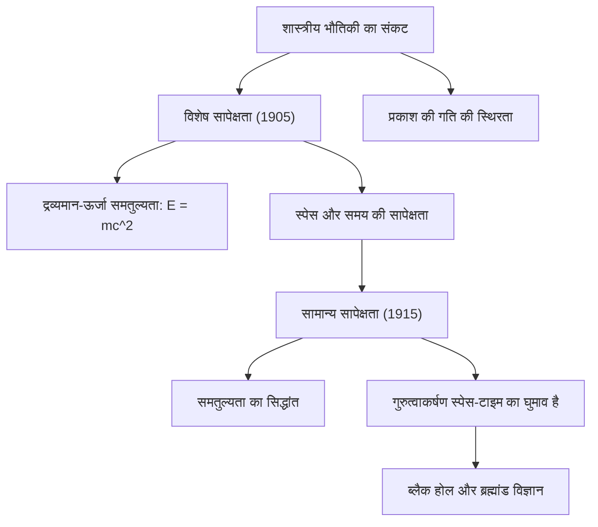

# भौतिकी: सापेक्षता का सिद्धांत - आइंस्टीन ने समय और अंतरिक्ष को कैसे बदला

## प्रस्तावना

20वीं सदी के प्रारंभ में अल्बर्ट आइंस्टीन द्वारा प्रस्तुत **सापेक्षता के सिद्धांत (Theory of Relativity)** ने समय, अंतरिक्ष और गुरुत्वाकर्षण के संबंध में मानव जाति की सदियों पुरानी समझ को पूरी तरह से बदल दिया। इससे पहले, आइजैक न्यूटन द्वारा स्थापित शास्त्रीय यांत्रिकी में समय को एक निरपेक्ष और एकसमान रूप से बहने वाली अदृश्य धारा माना जाता था, और अंतरिक्ष को एक स्थिर एवं अपरिवर्तनीय त्रि-आयामी मंच समझा जाता था।

अपने **विशेष सापेक्षता सिद्धांत (1905)** और **सामान्य सापेक्षता सिद्धांत (1915)** के माध्यम से, आइंस्टीन ने सिद्ध किया कि समय और अंतरिक्ष अलग-अलग नहीं हैं, बल्कि वे एक संयुक्त चार-आयामी ताने-बाने का निर्माण करते हैं जिसे **स्पेस-टाइम (Spacetime)** कहा जाता है। गति और गुरुत्वाकर्षण के प्रभाव से यह स्पेस-टाइम खिंचता, सिकुड़ता और मुड़ता है।

इस लेख में, हम सापेक्षता के सिद्धांतों, उनके गणितीय आधारों, प्रयोगात्मक प्रमाणों और दैनिक जीवन में उनके व्यावहारिक उपयोग का विश्लेषण करेंगे।

## 1. शास्त्रीय भौतिकी का संकट और प्रकाश का रहस्य

19वीं सदी के अंत तक भौतिकी लगभग पूर्ण प्रतीत होती थी। न्यूटन के नियम ग्रहों की गति और मशीनों को समझाते थे, जबकि मैक्सवेल के समीकरणों ने बिजली, चुंबकत्व और प्रकाश तरंगों का एकीकरण किया था। परंतु दोनों सिद्धांतों के बीच एक गंभीर विरोधाभास था:

- **न्यूटन की यांत्रिकी**: सभी गति सापेक्ष होती है और गति को साधारण तरीके से जोड़ा जा सकता है। यदि कोई 100 किमी/घंटा की ट्रेन में 5 किमी/घंटा से आगे चलता है, तो बाहर खड़े व्यक्ति के लिए उसकी गति 105 किमी/घंटा होगी।
- **मैक्सवेल का विद्युत चुम्बकत्व**: निर्वात में प्रकाश की गति एक अपरिवर्तनीय स्थिरांक है: $c \approx 300,000\text{ km/s}$, जो स्रोत या प्रेक्षक की गति पर निर्भर नहीं करती।

यदि प्रकाश की गति सभी के लिए समान है, तो न्यूटन का नियम गलत सिद्ध होता है। वैज्ञानिकों ने सोचा कि अंतरिक्ष में 'ईथर' नामक एक अदृश्य माध्यम भरा है। परंतु 1887 के **माइकलसन-मॉर्ले प्रयोग** ने सिद्ध किया कि ईथर का कोई अस्तित्व नहीं है। शास्त्रीय भौतिकी संकट में पड़ गई।

इस पहेली को 26 वर्षीय अल्बर्ट आइंस्टीन ने बर्न के पेटेंट कार्यालय में काम करते हुए अपने अद्भुत विचारों से हल किया।

## 2. विशेष सापेक्षता सिद्धांत (1905): गति की नई परिभाषा

1905 में आइंस्टीन ने विशेष सापेक्षता सिद्धांत प्रकाशित किया। इसे "विशेष" इसलिए कहा जाता है क्योंकि यह केवल एकसमान गति वाले संदर्भ तंत्रों (Inertial Frames) पर लागू होता है। यह सिद्धांत दो मूल प्रमेयों पर आधारित है:

### विशेष सापेक्षता के दो मूल नियम
1. **सापेक्षता का सिद्धांत**: एकसमान गति वाले सभी संदर्भ तंत्रों में भौतिकी के नियम समान रूप से लागू होते हैं। कोई पूर्ण स्थिर अवस्था नहीं होती।
2. **प्रकाश की गति की स्थिरता**: निर्वात में प्रकाश की गति ($c$) सभी प्रेक्षकों के लिए हमेशा समान रहती है, चाहे प्रकाश स्रोत या प्रेक्षक किसी भी गति से चल रहे हों।

इन दो नियमों को स्वीकार करने पर सामान्य समझ के विपरीत अद्भुत निष्कर्ष सामने आते हैं:

### समकालिकता की सापेक्षता और समय-स्थान का खिंचाव
एक स्थिर व्यक्ति के लिए जो दो घटनाएं एक साथ होती हैं, वे गतिमान व्यक्ति के लिए अलग-अलग समय पर हो सकती हैं: **समकालिकता सापेक्ष है**।

प्रकाश की गति को स्थिर रखने के लिए समय और स्थान को स्वयं बदलना पड़ता है:
- **समय विस्तार (Time Dilation)**: तेजी से गतिमान वस्तु की घड़ी स्थिर प्रेक्षक की तुलना में धीमी चलती है:
  $$ \Delta t' = \frac{\Delta t}{\sqrt{1 - \frac{v^2}{c^2}}} $$
- **लंबाई संकुचन (Lorentz Contraction)**: गति की दिशा में गतिमान वस्तु की लंबाई छोटी दिखाई देती है:
  $$ L' = L \sqrt{1 - \frac{v^2}{c^2}} $$

### द्रव्यमान-ऊर्जा समतुल्यता ($E = mc^2$)
विशेष सापेक्षता का सबसे प्रसिद्ध सूत्र द्रव्यमान और ऊर्जा की एकता को प्रकट करता है:

$$ E = mc^2 $$

यहाँ $E$ ऊर्जा, $m$ द्रव्यमान और $c$ प्रकाश की गति है। चूंकि $c^2 \approx 9 \times 10^{16}\text{ m}^2/\text{s}^2$ एक अत्यधिक विशाल संख्या है, इसलिए थोड़े से द्रव्यमान से भी भारी मात्रा में ऊर्जा उत्पन्न की जा सकती है। इसी सिद्धांत ने सूर्य में होने वाले संलयन को समझाया और [परमाणु ऊर्जा](/p/how-nuclear-power-works/) की नींव रखी।

## 3. सामान्य सापेक्षता सिद्धांत (1915): गुरुत्वाकर्षण ज्यामिति है

विशेष सापेक्षता में एक कमी थी: यह त्वरित गति और गुरुत्वाकर्षण को शामिल नहीं करती थी। न्यूटन का मानना था कि गुरुत्वाकर्षण तुरंत दूर तक काम करता है, जो प्रकाश की गति की सीमा के विपरीत था।

दस वर्षों के कठिन शोध के बाद आइंस्टीन ने 1915 में **सामान्य सापेक्षता सिद्धांत** पूरा किया।

### समतुल्यता का सिद्धांत (Equivalence Principle)
आइंस्टीन ने इसे "अपने जीवन का सबसे सुखद विचार" कहा।

एक बंद लिफ्ट की कल्पना करें। यदि लिफ्ट गुरुत्वाकर्षण में स्वतंत्र रूप से गिरती है, तो अंदर का व्यक्ति भारहीनता महसूस करता है। इसके विपरीत, यदि अंतरिक्ष में लिफ्ट को $9.8\text{ m/s}^2$ से त्वरित किया जाए, तो व्यक्ति फर्श की ओर दबेगा, जिसे पृथ्वी के गुरुत्वाकर्षण से अलग नहीं किया जा सकता। आइंस्टीन ने निष्कर्ष निकाला कि **जड़त्वीय द्रव्यमान और गुरुत्वाकर्षण द्रव्यमान समान हैं**, और गुरुत्वाकर्षण वास्तव में त्वरण के समान है।

### गुरुत्वाकर्षण स्पेस-टाइम का घुमाव है
सामान्य सापेक्षता के अनुसार, गुरुत्वाकर्षण कोई अदृश्य खींचने वाला बल नहीं है, बल्कि **द्रव्यमान और ऊर्जा द्वारा चार-आयामी स्पेस-टाइम में उत्पन्न होने वाला घुमाव (Curvature)** है।

रबर की तनी हुई चादर पर भारी गेंद रखने से उसमें गड्ढा बन जाता है। उसके पास कंचा घुमाने पर वह गड्ढे के कारण गेंद के चक्कर काटने लगता है। इसी प्रकार, सूर्य अपने आसपास के स्पेस-टाइम को मोड़ देता है, और पृथ्वी उस मुड़े हुए स्पेस-टाइम में अपने सबसे सीधे रास्ते (Geodesic) पर चक्कर लगाती है।

### आइंस्टीन के फील्ड समीकरण
स्पेस-टाइम के घुमाव और द्रव्यमान के वितरण का सटीक गणितीय संबंध **आइंस्टीन समीकरणों** द्वारा दिया जाता है:

$$ R_{\mu\nu} - \frac{1}{2}g_{\mu\nu}R + \Lambda g_{\mu\nu} = \frac{8\pi G}{c^4} T_{\mu\nu} $$

जहाँ बायाँ भाग स्पेस-टाइम की ज्यामिति और दायाँ भाग द्रव्यमान-ऊर्जा को दर्शाता है। भौतिक विज्ञानी जॉन व्हीलर ने इसे संक्षेप में कहा: *«स्पेस-टाइम द्रव्यमान को बताता है कि कैसे चलना है; द्रव्यमान स्पेस-टाइम को बताता है कि कैसे मुड़ना है।»*

## 4. प्रयोगात्मक प्रमाण और GPS में उपयोग

सापेक्षता सिद्धांत के सभी पूर्वानुमान प्रयोगों द्वारा शत-प्रतिशत सही साबित हुए हैं:

1. **बुध ग्रह की कक्षा में विचलन**: न्यूटन के नियमों से परे बुध की कक्षा के 43 आर्कसेकंड के झुकाव को सामान्य सापेक्षता ने सटीक रूप से समझाया।
2. **प्रकाश का मुड़ना (1919)**: सूर्य ग्रहण के दौरान आर्थर एडिंगटन ने सूर्य के गुरुत्वाकर्षण से तारों के प्रकाश को 1.75 आर्कसेकंड मुड़ते देखा, जिससे आइंस्टीन विश्वविख्यात हो गए।
3. **गुरुत्वाकर्षण तरंगें (2015)**: 1916 में आइंस्टीन द्वारा अनुमानित स्पेस-टाइम की तरंगों को 2015 में LIGO वेधशाला द्वारा ब्लैक होल की टक्कर से सीधे खोजा गया।

### दैनिक जीवन और GPS
सापेक्षता के बिना स्मार्टफोन का **GPS** काम नहीं कर सकता:
- **विशेष सापेक्षता**: तीव्र गति के कारण उपग्रह की घड़ी **प्रतिदिन 7 माइक्रोसेकंड धीमी** चलती है।
- **सामान्य सापेक्षता**: 20,200 किमी ऊंचाई पर कमजोर गुरुत्वाकर्षण के कारण घड़ी **प्रतिदिन 45 माइक्रोसेकंड तेज** चलती है।
- **शुद्ध प्रभाव**: उपग्रह की घड़ी प्रतिदिन **+38 माइक्रोसेकंड तेज** चलती है।

यदि इसे सुधारा न जाए, तो GPS में प्रतिदिन **11.4 किलोमीटर** की त्रुटि आएगी और नेविगेशन पूरी तरह विफल हो जाएगा।

## 5. क्वांटम गुरुत्वाकर्षण की खोज

सापेक्षता ने बिग बैंग और ब्लैक होल की व्याख्या की, परंतु एक बड़ी चुनौती अभी बाकी है। 

सापेक्षता निरंतर स्पेस-टाइम की बात करती है, जबकि **क्वांटम यांत्रिकी** अनिश्चित सूक्ष्म दुनिया की व्याख्या करती है। ब्लैक होल के केंद्र या बिग बैंग की शुरुआत में दोनों सिद्धांत एक-दूसरे के विपरीत हो जाते हैं। इन दोनों को मिलाकर एक **क्वांटम गुरुत्वाकर्षण सिद्धांत** (जैसे स्ट्रिंग थ्योरी) बनाना भौतिकी का सबसे बड़ा लक्ष्य है।

## निष्कर्ष

अल्बर्ट आइंस्टीन की सापेक्षता का सिद्धांत मानव बुद्धि की सर्वोच्च उपलब्धियों में से एक है। इसने हमें सिखाया कि समय और अंतरिक्ष कोई निर्जीव मंच नहीं हैं, बल्कि वे ब्रह्मांड के पदार्थ और ऊर्जा के साथ मिलकर इस भव्य ब्रह्मांडीय रचना को रचते हैं।
