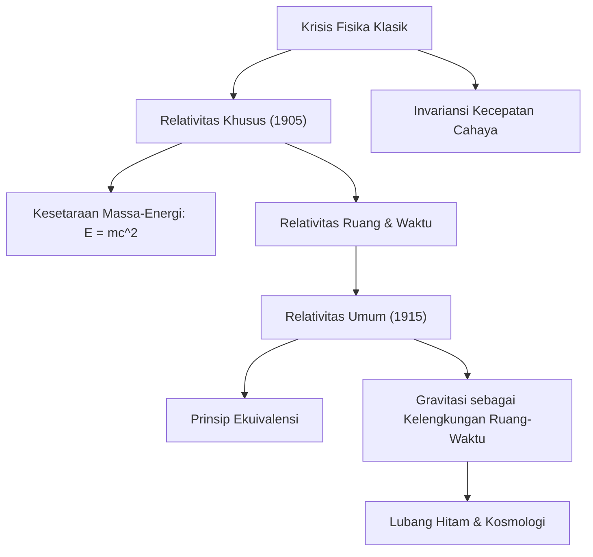

# Fisika: Pengantar Teori Relativitas - Cara Einstein Merevolusi Konsep Ruang dan Waktu

## Pendahuluan

Teori Relativitas yang dirumuskan oleh Albert Einstein pada awal abad ke-20 mengubah secara mendasar pemahaman manusia mengenai hakikat waktu, ruang, dan gravitasi. Sebelumnya, mekanika klasik yang dibangun oleh Isaac Newton menganggap waktu sebagai entitas mutlak yang berdetik seragam di seluruh alam semesta, sementara ruang dipandang sebagai wadah tiga dimensi yang kaku dan statis.

Melalui **Teori Relativitas Khusus (1905)** dan **Teori Relativitas Umum (1915)**, Einstein membuktikan bahwa ruang dan waktu tidak terpisahkan, melainkan menyatu dalam satu jalinan empat dimensi dinamis: **ruang-waktu (Spacetime)**. Struktur ruang-waktu ini dapat merenggang, menyusut, dan melengkung akibat pengaruh kecepatan gerak dan distribusi massa-energi.

Artikel ini menyajikan ulasan terpadu mengenai asal-usul relativitas, prinsip dasar, persamaan matematis, pembuktian eksperimental, hingga peran vitalnya dalam sistem navigasi modern.

## 1. Kebuntuan Fisika Klasik dan Misteri Cahaya

Menjelang akhir abad ke-19, fisika tampak hampir selesai. Mekanika Newton berhasil memprediksi orbit planet dan dinamika mesin industri, sementara persamaan Maxwell menyatukan listrik dan magnet serta membuktikan bahwa cahaya adalah gelombang elektromagnetik. Namun, timbul pertentangan konseptual yang tajam di antara keduanya:

- **Mekanika Newton**: Semua kecepatan bersifat relatif dan aditif. Jika Anda berjalan 5 km/jam di dalam kereta yang melaju 100 km/jam, pengamat di stasiun mencatat kecepatan Anda 105 km/jam.
- **Elektrodinamika Maxwell**: Kecepatan rambat gelombang elektromagnetik dalam ruang hampa adalah konstanta universal: $c \approx 300.000\text{ km/detik}$, tanpa dipengaruhi oleh kecepatan sumber cahaya ataupun pengamat.

Jika kecepatan cahaya bernilai sama bagi semua pengamat, aturan penjumlahan kecepatan Newton tidak lagi berlaku. Fisikawan masa itu menduga alam semesta dipenuhi medium tak kasat mata bernama "eter bercahaya". Akan tetapi, **eksperimen Michelson-Morley (1887)** membuktikan dengan akurat bahwa eter tersebut tidak pernah ada. Fisika klasik menemui jalan buntu.

Kebuntuan ini dipecahkan oleh Albert Einstein pada usia 26 tahun saat bekerja sebagai pemeriksa paten di Bern, Swiss, melalui keberanian berpikir yang radikal.

## 2. Relativitas Khusus (1905): Menata Ulang Gerak dan Waktu

Pada tahun 1905, Einstein menerbitkan risalah Relativitas Khusus. Istilah "khusus" merujuk pada cakupannya yang terbatas pada kerangka inersial—pengamat yang bergerak lurus beraturan tanpa percepatan dan medan gravitasi. Teori ini berpijak pada dua postulat:

### Dua Postulat Relativitas Khusus
1. **Prinsip Relativitas**: Hukum-hukum fisika memiliki bentuk matematis yang identik dalam semua kerangka acuan inersial. Tidak ada keadaan diam mutlak.
2. **Invariansi Kecepatan Cahaya**: Kecepatan cahaya dalam ruang hampa ($c$) bernilai sama bagi semua pengamat inersial, tidak peduli seberapa cepat sumber cahaya atau pengamat bergerak.

Penerimaan kedua postulat ini melahirkan konsekuensi fisika yang merombak akal sehat:

### Relativitas Simultanitas dan Distorsi Ruang-Waktu
Dua kejadian yang tampak terjadi bersamaan bagi seorang pengamat diam, ternyata terjadi pada waktu berbeda bagi pengamat yang bergerak. **Keserentakan waktu bersifat relatif**.

Agar kecepatan cahaya tetap sama bagi semua pihak, pengukuran ruang dan waktu harus menyesuaikan secara dinamis:
- **Dilatasi Waktu Kinematis**: Jam pada benda yang bergerak cepat berdetik lebih lambat dibandingkan jam milik pengamat diam:
  $$ \Delta t' = \frac{\Delta t}{\sqrt{1 - \frac{v^2}{c^2}}} $$
- **Kontraksi Panjang Lorentz**: Panjang fisik benda yang bergerak mendekati kecepatan cahaya menyusut pada arah geraknya jika diukur oleh pengamat diam:
  $$ L' = L \sqrt{1 - \frac{v^2}{c^2}} $$

### Kesetaraan Massa dan Energi ($E = mc^2$)
Rumusan paling bersejarah dari relativitas khusus adalah kesetaraan massa dan energi:

$$ E = mc^2 $$

Di mana $E$ adalah energi, $m$ adalah massa, dan $c$ adalah kecepatan cahaya. Karena $c^2 \approx 9 \times 10^{16}\text{ m}^2/\text{s}^2$ adalah pengali yang teramat besar, sejumlah kecil massa menyimpan energi yang luar biasa dahsyat. Persamaan ini membuka rahasia fusi nuklir bintang dan melahirkan [teknologi tenaga nuklir](/p/how-nuclear-power-works/).

## 3. Relativitas Umum (1915): Gravitasi sebagai Geometri

Relativitas khusus memiliki keterbatasan: teori tersebut tidak berlaku untuk gerak dipercepat dan bertentangan dengan gravitasi Newton yang mengasumsikan tarikan instan jarak jauh.

Setelah pergulatan matematika selama sepuluh tahun, Einstein merampungkan mahakaryanya pada tahun 1915: **Teori Relativitas Umum**.

### Prinsip Ekuivalensi
Landasan awal relativitas umum berakar dari apa yang disebut Einstein sebagai "pikiran paling membahagiakan dalam hidupku": **Prinsip Ekuivalensi**.

Bayangkan seseorang berada di dalam lift tertutup. Jika lift jatuh bebas dalam medan gravitasi bumi, orang di dalamnya melayang tanpa bobot. Sebaliknya, jika lift ditarik roket di ruang angkasa hampa dengan percepatan $9,8\text{ m/s}^2$, orang tersebut akan tertekan ke lantai lift dan merasakan sensasi berat yang identik dengan gravitasi di bumi. Einstein menyimpulkan bahwa **massa inersial setara dengan massa gravitasi**, dan tarikan gravitasi secara lokal tidak dapat dibedakan dari percepatan.

### Gravitasi adalah Kelengkungan Ruang-Waktu
Relativitas umum merombak hakikat gravitasi: gravitasi bukanlah gaya tarik gaib antar-massa, melainkan **manifestasi kelengkungan jalinan ruang-waktu empat dimensi akibat keberadaan massa dan energi**. Benda-benda bergerak mengikuti lintasan terpendek dan paling alami (geodesik) di dalam geometri yang melengkung tersebut.

Ibarat bola boling berat yang diletakkan di atas kasur karet elastis: bola akan menekan permukaan dan membentuk cekungan. Jika kelereng digelindingkan di dekatnya, kelereng akan berputar mengitari bola boling mengikuti lengkungan kasur karet. Demikian pula, Bumi mengorbit Matahari dengan menyusuri kelengkungan ruang-waktu alami yang diciptakan oleh massa raksasa Matahari.

### Persamaan Medan Einstein
Hubungan matematis kuantitatif antara kelengkungan ruang-waktu dan kepadatan materi dinyatakan dalam **Persamaan Medan Einstein**:

$$ R_{\mu\nu} - \frac{1}{2}g_{\mu\nu}R + \Lambda g_{\mu\nu} = \frac{8\pi G}{c^4} T_{\mu\nu} $$

Di mana:
- $R_{\mu\nu}$ adalah tensor kelengkungan Ricci,
- $g_{\mu\nu}$ adalah tensor metrik ruang-waktu,
- $R$ adalah kelengkungan skalar,
- $\Lambda$ adalah konstanta kosmologis,
- $G$ adalah konstanta gravitasi Newton,
- $T_{\mu\nu}$ adalah tensor tegangan-energi materi dan radiasi.

Fisikawan John Archibald Wheeler merangkum makna persamaan ini dengan elok: *«Ruang-waktu memberi tahu materi cara bergerak; materi memberi tahu ruang-waktu cara melengkung.»*

## 4. Pembuktian Empiris dan Penerapan dalam Navigasi GPS

Sempat diragukan sebagai teori matematika abstrak, relativitas umum kini terbukti sahih melalui rangkaian pengamatan eksperimental selama lebih dari satu abad.

### Bukti Sejarah Pengamatan
1. **Presesi Perihelion Merkurius**: Penyimpangan orbit Merkurius sebesar 43 detik busur per abad yang gagal dipecahkan Newton berhasil dijelaskan secara presisi oleh teori Einstein.
2. **Pembelokan Cahaya Bintang (1919)**: Ekspedisi gerhana matahari Arthur Eddington membuktikan bahwa cahaya bintang di dekat tepi Matahari dibelokkan sebesar 1,75 detik busur akibat gravitasi Matahari.
3. **Gelombang Gravitasi (2015)**: Riak ruang-waktu yang diramalkan Einstein pada 1916 terdeteksi secara langsung oleh observatorium LIGO dari peristiwa tabrakan dua lubang hitam, meraih Hadiah Nobel Fisika 2017.

### Penerapan dalam Kehidupan: Navigasi Satelit GPS
Relativitas adalah kunci kerja **GPS**:
- **Relativitas Khusus**: Kecepatan orbit satelit ($\sim 3,9\text{ km/s}$) membuat jam atom satelit **melambat 7 mikrodetik setiap hari**.
- **Relativitas Umum**: Gravitasi yang lebih lemah di ketinggian 20.200 km membuat jam **bertambah cepat 45 mikrodetik setiap hari**.
- **Efek Bersih**: Jam satelit berjalan lebih cepat **+38 mikrodetik per hari** dibanding jam di bumi.

Tanpa penyesuaian relativitas Einstein, kesalahan posisi pada navigasi ponsel akan menumpuk sebesar **11,4 kilometer setiap hari**, merusak fungsi navigasi kendaraan dalam sekejap.

## 5. Tantangan Terbesar: Menuju Teori Gravitasi Kuantum

Relativitas umum melandasi kosmologi modern: teori Dentuman Besar (Big Bang), ekspansi semesta, dan fisika lubang hitam. Namun terdapat paradoks besar yang belum terjawab.

Relativitas umum menggambarkan ruang-waktu sebagai kanvas kontinu dan deterministik, sedangkan **mekanika kuantum** menggambarkan dunia mikroskopis yang diskret dan probabilistik. Di titik singularitas (pusat lubang hitam dan awal Big Bang), perpaduan kedua teori ini menghasilkan nilai tak terhingga. Menyatukan keduanya ke dalam **Gravitasi Kuantum** (seperti teori dawai atau gravitasi kuantum loop) merupakan impian terbesar para ilmuwan abad ke-21.

## Penutup

Teori Relativitas Albert Einstein merupakan salah satu pencapaian intelektual paling gemilang dalam sejarah manusia. Dengan mengubah ruang dan waktu dari sekadar panggung pasif menjadi entitas dinamis yang berinteraksi dengan materi dan cahaya, relativitas menyingkap tatanan kosmik yang megah dan mengagumkan.
