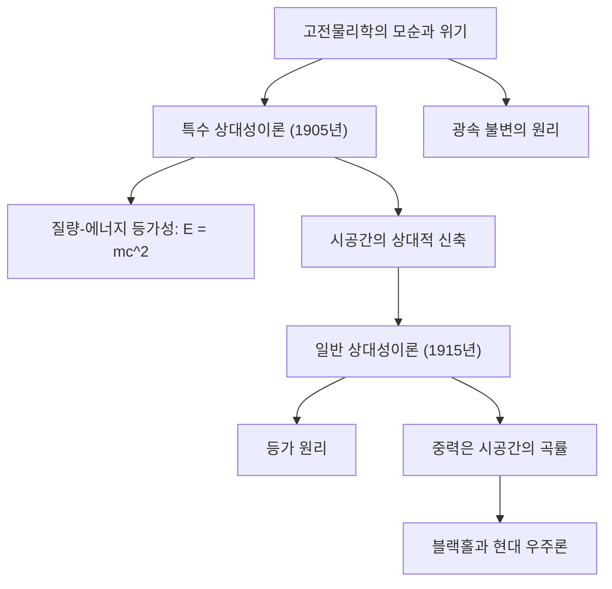

# 물리학: 상대성이론 입문 - 아인슈타인이 바꾼 시간과 공간의 혁명

## 서론

20세기 초 알베르트 아인슈타인이 발표한 **특수 상대성이론(1905년)** 과 **일반 상대성이론(1915년)** 은 인류가 오랜 세월 당연하게 여겨온 '시간'과 '공간'에 대한 상식을 송두리째 뒤흔들며 현대 물리학의 가장 거대한 주춧돌이 되었습니다.

아이작 뉴턴에 의해 정립된 고전역학에서는 시간이 우주 어디에서나 동일한 빠르기로 흐르는 절대적인 척도이며, 공간 역시 불변하는 3차원의 정적인 무대라고 여겼습니다. 그러나 아인슈타인은 시간과 공간이 독립된 실체가 아니라 서로 긴밀히 얽혀 있는 4차원의 동적인 연속체인 **시공간(Spacetime)** 임을 증명했습니다. 시공간은 관측자의 운동 속도와 주변의 질량 및 에너지에 따라 늘어나고 줄어들며 역동적으로 휘어집니다.

본 글에서는 상대성이론의 탄생 배경, 핵심적인 물리 법칙과 수학적 구조, 역사적인 관측 검증, 그리고 현대 일상생활에 미치는 영향까지 체계적으로 해설합니다.

## 1. 고전물리학의 위기와 '빛'의 수수께끼

19세기 말, 물리학은 완성 단계에 도달한 것처럼 보였습니다. 뉴턴 역학은 행성의 궤도와 기계 운동을 빈틈없이 설명했고, 맥스웰 방정식은 전자기 현상을 통합하며 빛이 전자기파라는 사실을 밝혔습니다. 그러나 두 이론 사이에는 결코 양립할 수 없는 치명적인 모순이 숨어 있었습니다:

- **갈릴레이-뉴턴의 상대성 원리**: 모든 속도는 관측자에 따라 더하거나 뺄 수 있습니다(상대 속도). 시속 100km로 달리는 기차 안에서 시속 5km로 걷는다면, 플랫폼의 관측자가 본 속도는 시속 105km가 됩니다.
- **맥스웰 전자기학의 결론**: 진공 중 빛의 전파 속도는 항상 일정한 상수 $c \approx 300,000\text{ km/s}$ 로 주어집니다. 이 속도는 광원의 운동 상태나 관측자의 속도와 무관합니다.

모든 관측자에게 빛의 속도가 일정하다면 고전역학의 속도 덧셈 법칙이 무너집니다. 당시 물리학자들은 빛을 전달하는 절대 정지 매질인 '에테르(Aether)'가 우주에 가득 차 있을 것이라 믿었습니다. 그러나 1887년 **마이컬슨-몰리 실험** 은 에테르의 존재를 완전히 부정했습니다.

이 거대한 모순의 벽을 허문 사람이 바로 당시 스위스 베른 특허청의 26세 말단 심사관이었던 아인슈타인이었습니다.

## 2. 특수 상대성이론 (1905년): 시공간의 상대성

1905년 아인슈타인은 '특수 상대성이론' 논문을 발표했습니다. '특수'라는 명칭은 가속 운동이 없는 등속 직선 운동(관성계)만을 다루었기 때문입니다. 이 이론은 단 두 가지의 대담한 공리로부터 출발합니다:

### 특수 상대성이론의 두 가지 기본 가설
1. **상대성 원리**: 서로 등속 직선 운동을 하는 모든 관성계에서 물리 법칙은 동일한 형태로 성립한다. 절대 정지 기준계는 존재하지 않는다.
2. **광속 불변의 원리**: 진공 중 빛의 속도 $c$ 는 광원이나 관측자의 운동 상태와 관계없이 모든 관성계에서 항상 일정하다.

이 두 공리를 받아들이면 우리의 일상적 직관을 파괴하는 놀라운 결론들이 필연적으로 도출됩니다.

### 동시성의 상대성과 시공간의 신축
우리가 '동시에 일어났다'고 느끼는 두 사건은 서로 다른 속도로 움직이는 관측자에게는 동시가 아닙니다. 이를 **동시성의 상대성** 이라고 부릅니다.

빛의 속도를 누구에게나 일정하게 유지하기 위해, 운동하는 물체의 시간과 공간 자체가 물리적으로 변화해야 합니다:
- **시간 팽창 (Time Dilation)**: 정지한 관측자에 대해 빠르게 움직이는 물체 내부의 시계는 더 느리게 갑니다:
  $$ \Delta t' = \frac{\Delta t}{\sqrt{1 - \frac{v^2}{c^2}}} $$
- **길이 수축 (Lorentz Contraction)**: 정지한 관측자가 볼 때 빠르게 움직이는 물체의 운동 방향 길이는 압축되어 짧아집니다:
  $$ L' = L \sqrt{1 - \frac{v^2}{c^2}} $$

### 질량과 에너지의 등가성 ($E = mc^2$)
특수 상대성이론이 인류에게 안겨준 가장 위대한 공식은 질량과 에너지가 본질적으로 하나라는 사실입니다:

$$ E = mc^2 $$

여기서 $E$ 는 에너지, $m$ 은 질량, $c$ 는 빛의 속도입니다. 빛의 속도의 제곱($c^2 \approx 9 \times 10^{16}\text{ m}^2/\text{s}^2$)이라는 상상하기 어려울 만큼 거대한 수가 곱해져 있기 때문에, 극미량의 질량이라도 에너지로 온전히 변환되면 상상을 초월하는 막대한 힘을 발휘합니다. 이 공식은 태양이 수십억 년 동안 꺼지지 않고 에너지를 뿜어내는 수소 핵융합의 원리를 밝혔으며, [원자력 발전](/p/how-nuclear-power-works/)과 원자폭탄의 기본 토대가 되었습니다.

## 3. 일반 상대성이론 (1915년): 중력은 시공간의 기하학적 곡률

특수 상대성이론은 획기적이었지만 등속 운동에만 국한되었고, 뉴턴의 만유인력 법칙과 정면으로 충돌했습니다. 뉴턴의 중력이 원거리에서 순식간에 전달된다는 생각은 빛보다 빠르게 정보가 이동할 수 없다는 상대성이론의 한계 속도 원칙을 위배했기 때문입니다.

아인슈타인은 10년간의 치열한 사투 끝에 1915년 가속 운동과 중력을 아우르는 **일반 상대성이론** 을 완성했습니다.

### 등가 원리 (Equivalence Principle)
아인슈타인이 "내 생애 가장 행복했던 생각"이라 회고한 출발점은 바로 **등가 원리** 였습니다.

완전히 밀폐된 엘리베이터에 갇힌 사람을 상상해 보십시오. 만약 엘리베이터가 지구 중력장에서 자유 낙하한다면 내부의 관찰자는 무중력 상태를 경험합니다. 반대로 우주 깊은 곳에서 엘리베이터가 $9.8\text{ m/s}^2$ 로 가속된다면, 관찰자는 바닥으로 끌어당겨지며 지구 표면에 서 있는 것과 똑같은 무게를 느낍니다. 아인슈타인은 **관성 질량과 중력 질량이 물리적으로 완전히 동일** 하며, 국소적으로 중력과 가속도는 구별할 수 없다고 결론지었습니다.

### 중력은 '시공간의 휘어짐'이다
등가 원리는 중력의 본질에 대한 혁명적 진실을 드러냈습니다. 중력은 뉴턴이 생각한 것처럼 물체들이 서로 끌어당기는 보이지 않는 힘이 아니라, **질량을 가진 물체가 주변 4차원 시공간을 기하학적으로 휘어지게 만드는 현상** 입니다.

팽팽하게 당겨진 고무판 위에 무거운 쇠구슬을 올려놓으면 표면이 움푹 패여 곡면이 형성됩니다. 그 곁에 작은 구슬을 굴리면 구슬은 곡면을 따라 쇠구슬 주위를 원을 그리며 돕니다. 태양이 지구를 끌어당기는 것이 아니라, 태양의 거대한 질량이 시공간을 휘어놓았고, 지구는 휘어진 시공간 속에서 가장 자연스러운 최단 경로(측지선)를 따라 달리고 있는 것입니다.

### 아인슈타인 장 방정식 (Einstein Field Equations)
시공간의 곡률과 물질-에너지 분포 사이의 엄밀한 관계를 나타내는 수학 방정식이 바로 **아인슈타인 방정식** 입니다:

$$ R_{\mu\nu} - \frac{1}{2}g_{\mu\nu}R + \Lambda g_{\mu\nu} = \frac{8\pi G}{c^4} T_{\mu\nu} $$

여기서 좌변은 시공간의 기하학적 곡률을 나타내고, 우변은 물질과 에너지의 분포를 나타냅니다. 미국의 물리학자 존 휠러는 이 복잡한 텐서 방정식을 다음과 같은 명언으로 요약했습니다: **"물질은 시공간에 어떻게 휠 것인가를 명령하고, 시공간은 물질에 어떻게 움직일 것인가를 명령한다."**

## 4. 상대성이론의 경험적 검증과 현대적 응용

발표 당시에는 공상과학처럼 여겨졌던 상대성이론은 100여 년에 걸친 정밀 관측을 통해 그 정확성이 완벽하게 입증되었습니다.

### 역사적인 관측 검증
1. **수성의 근일점 이동**: 뉴턴 역학으로 설명할 수 없었던 100년당 43초의 궤도 오차를 일반 상대성이론이 단 한 치의 오차도 없이 계산해 냈습니다.
2. **빛의 굴절과 중력 렌즈 (1919년)**: 아서 에딩턴 경이 개기일식을 관측하여 태양의 중력에 의해 뒤편 별빛이 정확히 1.75초 휘어지는 것을 확인함으로써 아인슈타인은 일약 세계적인 명성을 얻었습니다.
3. **중력파의 직접 검출 (2015년)**: 아인슈타인이 1916년에 예견했던 시공간의 잔물결인 중력파가 100년 만인 2015년 라이고(LIGO) 관측소에 의해 블랙홀 충돌로부터 직접 검출되어 2017년 노벨 물리학상을 수상했습니다.

### 우리의 일상과 GPS 내비게이션
상대성이론은 우주 연구뿐만 아니라 스마트폰의 **GPS(위성 항법 시스템)** 에도 필수적입니다:
- **특수 상대성이론 효과**: 초속 3.9km로 고속 비행하는 위성의 시계는 지상보다 매일 **약 7마이크로초 느려집니다**.
- **일반 상대성이론 효과**: 고도 20,200km 상공의 약한 중력으로 인해 위성의 시계는 지상보다 매일 **약 45마이크로초 빨라집니다**.
- **순 상대론적 오차**: 매일 **+38마이크로초** 씩 위성 시계가 앞서갑니다.

만약 이 상대성이론 효과를 소프트웨어와 하드웨어로 보정하지 않는다면, GPS 위치 오차는 매일 **11.4km** 씩 눈덩이처럼 누적되어 내비게이션은 하루 만에 쓸모없게 됩니다.

## 5. 현대 물리학의 궁극적 꿈: 양자 중력 이론

상대성이론은 우주 대폭발(빅뱅)과 블랙홀의 존재 등 현대 우주론의 기틀을 다졌습니다. 그러나 21세기 물리학에는 여전히 풀리지 않은 궁극의 숙제가 남아 있습니다.

미시 세계의 확률을 다루는 **양자역학** 과 거시 세계의 시공간 곡률을 다루는 **일반 상대성이론** 이 블랙홀 중심점이나 우주 탄생의 특이점(Singularity)에서 수학적 모순을 일으키기 때문입니다. 이 두 위대한 기둥을 하나로 융합하는 **양자 중력 이론(초끈이론, 루프 양자 중력 등)** 의 완성은 물리학자들의 영원한 꿈입니다.

## 맺음말

알베르트 아인슈타인이 완성한 상대성이론은 인간의 사유가 도달할 수 있는 가장 숭고한 지적 성취 중 하나입니다. 절대적이라고 믿었던 시간과 공간이 실은 유연하고 역동적인 시공간의 무대임을 깨달았을 때, 인류는 비로소 우주라는 거대한 교향곡의 악보를 올바르게 읽어낼 수 있게 되었습니다.
