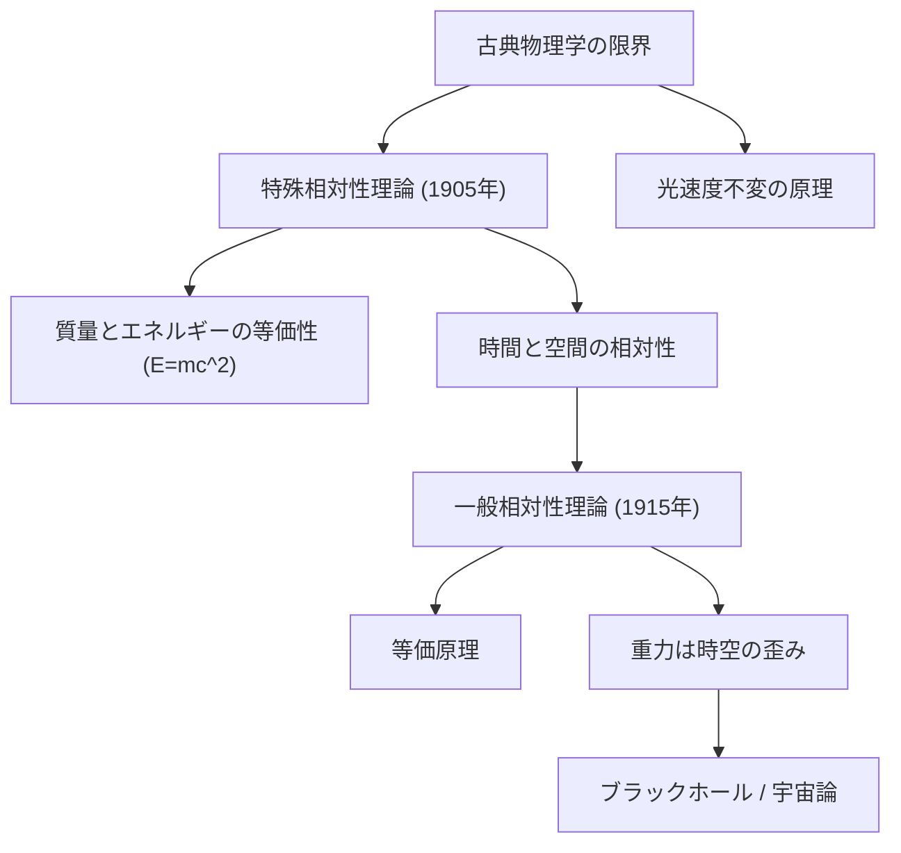

## はじめに
アルバート・アインシュタインが20世紀初頭に提唱した「相対性理論」は、人類が長年抱いてきた「時間」と「空間」に対する常識を根本から覆し、現代物理学の最も重要な柱の一つとなりました。それまでアイザック・ニュートンによって確立された古典力学では、時間は宇宙のどこでも同じように刻まれる絶対的なもの、空間も決して変化することのない固定された枠組みと考えられていました。しかし、アインシュタインは「特殊相対性理論」と「一般相対性理論」を通じて、時間と空間が観測者の運動状態や重力によって伸び縮みする、非常にダイナミックなものであることを証明したのです。

本記事では、この驚くべき相対性理論がどのようにして生まれ、どのようなことを主張しているのか、そして私たちの現実世界においてどのように実証され、応用されているのかを詳細に解説していきます。

## 1. 古典物理学の行き詰まりと「光」の謎
19世紀末、物理学は「力学」と「電磁気学」という二つの大きな成功を収めていました。ニュートン力学は物体の運動を見事に説明し、マクスウェル方程式は光が電磁波の一種であることを予言しました。しかし、この二つの理論には決定的な矛盾がありました。ニュートン力学においては、すべての速度は観測者の立場によって足し引きできる（相対速度）とされていましたが、マクスウェル方程式が導き出した光の速度は「いかなる観測者から見ても一定」であることを示唆していたのです。

マイケルソン・モーリーの実験などにより、宇宙空間を満たしていると考えられていた仮想の媒質「エーテル」が検出されないことが判明すると、物理学者たちは大きな壁にぶつかりました。この矛盾を解決したのが、当時特許局の職員であったアインシュタインです。

## 2. 特殊相対性理論 (1905年)
1905年、アインシュタインは「特殊相対性理論」を発表しました。「特殊」とは、加速度運動を含まない「等速直線運動」をする観測者に限定しているという意味です。この理論は、二つの非常にシンプルで大胆な仮定（原理）から出発しています。

### 相対性原理と光速度不変の原理
1. **相対性原理**: 互いに等速直線運動をしているすべての観測者にとって、物理法則は全く同じ形で成り立つ。絶対的な静止系は存在しない。
2. **光速度不変の原理**: 真空中の光の速さ（約30万km/秒）は、光源や観測者の運動状態に関わらず、すべての観測者にとって常に一定である。

この二つの原理を受け入れると、日常の直感とは反する数々の驚くべき結論が導き出されます。

### 同時の相対性と「時間・空間の伸縮」
私たちが「同時に起きた」と感じる二つの出来事は、別の速度で動いている観測者から見ると同時ではありません。これを**同時の相対性**と呼びます。

さらに、光の速度を一定に保つためには、動いている物体の**時間の進み方が遅くなり**、運動している方向の**長さ（空間）が縮んで**見えなければなりません。例えば、光の速さに近い速度で飛ぶ宇宙船に乗っている宇宙飛行士の時計は、地球にいる私たちの時計よりもゆっくり進みます（時間の遅れ、タイム・ディレーション）。また、地球から見ると、宇宙船そのものの長さが進行方向に沿って短く圧縮されているように見えます（ローレンツ収縮）。

### 質量とエネルギーの等価性 ($E=mc^2$)
特殊相対性理論がもたらしたもう一つの偉大な結論が、質量とエネルギーが本質的に同じものであるという事実です。物理学史上最も有名な方程式と言われる以下の式で表されます。

$$ E = mc^2 $$

ここで、$E$はエネルギー、$m$は質量、$c$は光の速度です。光の速度の2乗という非常に大きな値が掛けられているため、ほんのわずかな質量であっても、それが完全にエネルギーに変換されれば莫大な量になることを示しています。この原理は、太陽がなぜあれほど莫大なエネルギーを放出し続けるのか（核融合反応）を説明し、原子力発電や核兵器の基本原理ともなりました。

## 3. 一般相対性理論 (1915年)
特殊相対性理論は画期的でしたが、「等速直線運動」という限定的な状況下でのみ成立するものでした。また、ニュートンが提唱した「万有引力」の法則とは相容れない部分がありました。重力が瞬時に伝わるというニュートンの考えは、光よりも速く伝わるものはないとする特殊相対性理論と矛盾していたのです。アインシュタインは10年間の苦闘の末、1915年に加速度運動や重力を含むより普遍的な理論、「一般相対性理論」を完成させました。

### 等価原理
一般相対性理論の出発点となったのは「等価原理」というアイデアです。アインシュタインは「自由落下しているエレベーターの中にいる人は、重力を感じない」という思考実験（彼自身はこれを生涯最高の思いつきと呼びました）から、「重力」と「加速度」は物理的に区別できないと結論づけました。

### 重力は「時空の歪み」である
等価原理を数学的に拡張した結果、アインシュタインは驚くべき真理に辿り着きました。重力とは、ニュートンが考えたような「物体同士が引き合う目に見えない力」ではなく、質量を持つ物体が周囲の「時間と空間（時空）」を歪ませることで生じる幾何学的な効果だというのです。

重いボウリングの球をトランポリンの上に置くと、表面が沈み込んで歪みます。その近くに小さなビー玉を転がすと、歪みに沿って球の方へ吸い寄せられるように転がっていきます。これと同じように、太陽のような巨大な質量が周囲の時空を歪ませ、その歪みに沿って地球が公転している、というのが一般相対性理論が示す重力の正体です。

### アインシュタイン方程式
この重力と時空の曲率の関係を記述する厳密な数学的表現が「アインシュタイン方程式（重力場の方程式）」です。テンソルと呼ばれる複雑な数学を用いて、以下のように表されます。

$$ R_{\mu\nu} - \frac{1}{2}g_{\mu\nu}R + \Lambda g_{\mu\nu} = \frac{8\pi G}{c^4} T_{\mu\nu} $$

この方程式の左辺は「時空の曲がり具合（幾何学）」を、右辺は「物質とエネルギーの分布」を表しています。物理学者ジョン・アーチボルド・ウィーラーは、この式の意味を「物質は時空にどう曲がるかを教え、時空は物質にどう動くかを教える」という見事な言葉で表現しています。なお、$\Lambda$（宇宙項）は後に宇宙の加速膨張を説明するダークエネルギーに関連して極めて重要な意味を持つことになります。

## 4. 相対性理論の証拠と実生活への応用
発表当初、あまりに奇想天外な理論であったため多くの物理学者から疑念の目を向けられましたが、その後の様々な観測や実験により、相対性理論の正しさは疑いようのないものとなりました。

### 理論を裏付けた観測事実
1. **水星の近日点移動**: 水星の軌道が少しずつずれていく現象は、ニュートン力学では完全に説明できませんでしたが、一般相対性理論の計算は見事に観測値と一致しました。
2. **光の湾曲（重力レンズ効果）**: 1919年、アーサー・エディントン率いる観測隊が皆既日食を観測し、太陽の重力によって背後にある恒星からの光が曲げられていることを確認しました。これによりアインシュタインは世界的なスーパースターとなりました。
3. **重力波**: 質量を持つ物体が動いた際に生じる時空の歪みの波が光速で伝わる現象です。アインシュタインが1916年に予言していましたが、その100年後の2015年にLIGO（レーザー干渉計重力波観測所）によって初めて直接観測され、ノーベル物理学賞を受賞しました。

### 私たちの生活とGPS
相対性理論は遠い宇宙の話だけでなく、私たちの日常生活にも不可欠です。最も身近な例がスマートフォンのカーナビ等で使われる**GPS（全地球測位システム）**です。
GPS衛星は秒速約4kmという高速で移動しているため、特殊相対性理論により地上の時計よりも毎日約7マイクロ秒遅れます。一方で、地上から高度約2万kmの宇宙空間にあり重力が弱いため、一般相対性理論により地上の時計よりも毎日約45マイクロ秒早く進みます。結果として、GPS衛星の時計は地球上より毎日約38マイクロ秒早く進むことになります。もしこの相対論的効果を計算に入れて補正しなければ、GPSの位置情報は1日に約11kmもずれてしまい、ナビゲーションシステムは全く使い物にならなくなってしまいます。

## 5. 現代物理学への影響と究極の夢
アインシュタインの相対性理論は、宇宙の起源（ビッグバン理論）やブラックホールの存在など、現代宇宙論の礎を築きました。しかし、現代物理学にはまだ大きな課題が残されています。
それは、ミクロの世界を記述する「量子力学」と、マクロの世界（重力）を記述する「一般相対性理論」が、極限状態（ブラックホールの中心や宇宙の始まりなど）において矛盾を引き起こしてしまうという問題です。この二つの理論を統合する「量子重力理論（超弦理論など）」の完成は、21世紀の物理学における最大の目標とされています。

## おわりに
アルバート・アインシュタインが一人で築き上げた相対性理論は、人間の想像力と理性がどこまで深く自然界の真理に迫れるかを示す、人類史における最高の知的達成の一つです。「時間」と「空間」という、私たちが絶対だと信じて疑わなかった基盤そのものが、実は柔軟で相互に結びついたダイナミックな舞台であることを教えてくれました。
私たちが夜空の星を見上げるとき、そこに届く光の軌跡には時空の歪みが刻まれており、アインシュタインの描いた宇宙の壮大なシナリオが今この瞬間も繰り広げられているのです。
