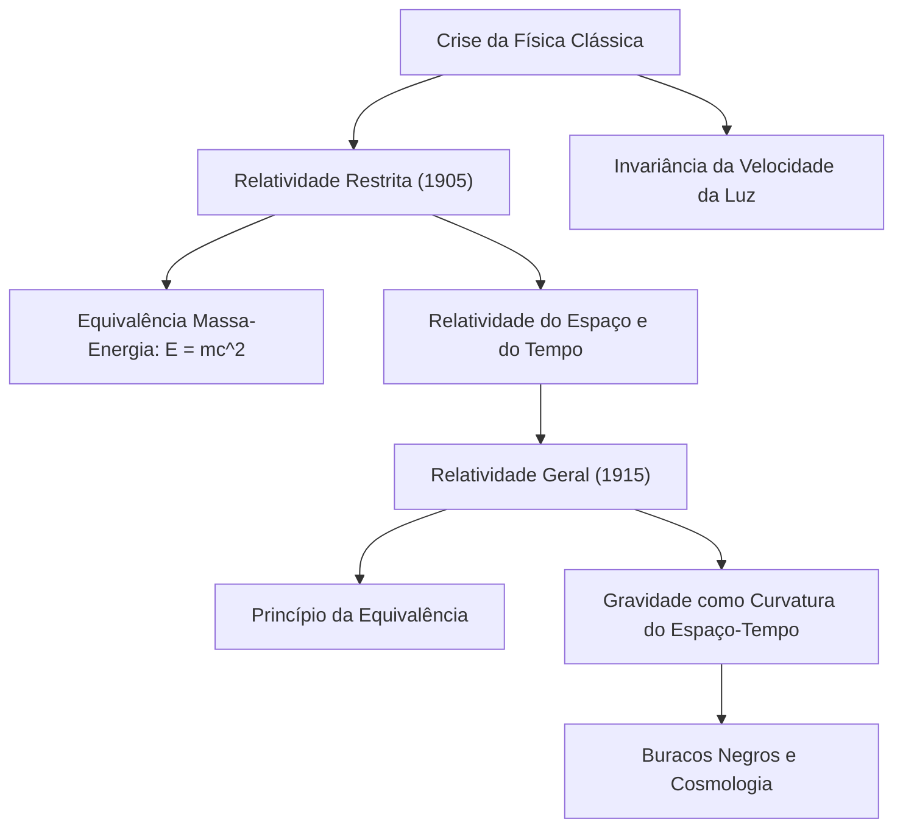

# Física: Introdução à Teoria da Relatividade - Como Einstein Revolucionou o Espaço e o Tempo

## Introdução

A Teoria da Relatividade, formulada por Albert Einstein nas primeiras décadas do século XX, desfez paradigmas milenares sobre a essência do tempo, do espaço e da gravidade. Até então, a física clássica estabelecida por Isaac Newton considerava o tempo como um fluxo absoluto, regular e imutável que transcorria de maneira idêntica por todo o universo, ao passo que o espaço era concebido como um cenário tridimensional rígido e impassível.

Por meio da **Teoria da Relatividade Restrita (1905)** e da **Teoria da Relatividade Geral (1915)**, Einstein demonstrou que tempo e espaço não são realidades independentes. Eles fundem-se em um tecido quadridimensional dinâmico: o **espaço-tempo (Spacetime)**. Essa trama deforma-se, estica-se e curva-se continuamente em resposta à velocidade relativa e à concentração de matéria e energia.

Neste artigo, apresentamos uma visão panorâmica e consistente sobre a gênese da relatividade, suas bases matemáticas, confirmações observacionais e aplicações práticas no cotidiano.

## 1. O Impasse da Física Clássica e o Enigma da Luz

No final do século XIX, a física vivia uma época dourada. A mecânica de Newton regia com precisão as órbitas dos planetas e a engenharia mecânica, enquanto o eletromagnetismo de Maxwell unificava a eletricidade e o magnetismo, demonstrando que a luz é uma onda eletromagnética. No entanto, existia uma contradição insuperável entre essas duas ciências:

- **Mecânica Newtoniana**: Todas as velocidades são relativas e aditivas. Se você caminhar a 5 km/h no interior de um trem a 100 km/h, uma pessoa na estação medirá sua velocidade como 105 km/h.
- **Eletromagnetismo de Maxwell**: A velocidade de propagação das ondas no vácuo é uma constante universal: $c \approx 300.000\text{ km/s}$, sem qualquer dependência do estado de movimento da fonte ou do observador.

Se a velocidade da luz é rigorosamente a mesma para todos, a adição clássica de velocidades falha por completo. Para tentar salvar o edifício newtoniano, supôs-se a existência do «éter luminífero», um meio invisível que preencheria todo o cosmos. Todavia, o **experimento de Michelson-Morley (1887)** provou cabalmente que tal éter não existia. A física clássica havia chegado a um beco sem saída.

Aos 26 anos, trabalhando no escritório de patentes em Berna, Einstein superou esse impasse com admirável coragem conceitual.

## 2. Relatividade Restrita (1905): Redefinindo o Movimento

Em 1905, Einstein publicou o trabalho seminal que fundou a relatividade restrita. Ela é denominada «restrita» porque se circunscreve a referenciais inerciais em movimento uniforme, sem campos gravitacionais. A teoria repousa sobre dois postulados:

### Os Dois Postulados Fundamentais
1. **Princípio da Relatividade**: As leis da física têm a mesma forma matemática em todos os sistemas de referência inerciais. Não existe um estado de repouso absoluto.
2. **Invariância da Velocidade da Luz**: A velocidade da luz no vácuo ($c$) é constante para todos os observadores inerciais, independentemente da velocidade da fonte luminosa ou do receptor.

A aceitação desses dois princípios gera conclusões que subvertem a intuição comum:

### Relatividade da Simultaneidade e Deformação do Espaço-Tempo
Dois eventos que parecem simultâneos para um observador em repouso ocorrem em instantes diferentes para um observador em movimento. **A simultaneidade é relativa**.

Para que a velocidade da luz permaneça inalterada, as réguas e os relógios devem se ajustar:
- **Dilatação Temporal Cinemática**: Relógios em movimento rápido desaceleram quando comparados aos relógios de observadores estacionários:
  $$ \Delta t' = \frac{\Delta t}{\sqrt{1 - \frac{v^2}{c^2}}} $$
- **Contração de Lorentz**: O comprimento espacial de um corpo contrai-se na direção do deslocamento para um observador em repouso:
  $$ L' = L \sqrt{1 - \frac{v^2}{c^2}} $$

### Equivalência Massa-Energia ($E = mc^2$)
O fruto mais célebre da relatividade restrita é a equação que simboliza a era atômica:

$$ E = mc^2 $$

Em que $E$ é a energia, $m$ a massa e $c$ a velocidade da luz. Como $c^2 \approx 9 \times 10^{16}\text{ m}^2/\text{s}^2$ é um multiplicador colossal, frações de grama de matéria armazenam quantidades astronômicas de energia. Essa relação elucidou a fusão termonuclear estelar e abriu caminho para a [energia nuclear](/p/how-nuclear-power-works/).

## 3. Relatividade Geral (1915): A Gravidade como Geometria

Apesar de seu brilhantismo, a relatividade restrita excluía as acelerações e entrava em conflito frontal com a gravitação newtoniana, que pressupunha atração instantânea à distância — violando a velocidade limite da luz.

Após dez anos de árduos estudos matemáticos, Einstein concluiu em 1915 a **Teoria da Relatividade Geral**.

### O Princípio da Equivalência
Einstein considerou a intuição que originou essa teoria como «o pensamento mais feliz da minha vida»: **o Princípio da Equivalência**.

Pense em um observador dentro de um elevador hermético. Em queda livre em um campo gravitacional, o indivíduo flutua em gravidade zero. Se o elevador estiver no espaço profundo acelerado por um foguete a $9,8\text{ m/s}^2$, o ocupante será empurrado contra o chão, sentindo um peso indistinguível da gravidade na Terra. Einstein deduziu que **massa inercial e massa gravitacional são rigorosamente idênticas**, sendo a gravidade indistinguível de uma aceleração uniforme.

### Gravidade é a Curvatura do Espaço-Tempo
A relatividade geral estabelece que a gravidade não é uma força invisível puxando os corpos, mas sim **a curvatura do tecido quadridimensional do espaço-tempo provocada pela presença de matéria e energia**. Os corpos deslocam-se seguindo as trajetórias naturais mais curtas (geodésicas) nessa geometria encurvada.

A analogia usual é uma pesada bola de boliche posta sobre uma lona elástica esticada: a superfície cede e afunda. Se rolarmos uma bolinha de gude pelas proximidades, ela orbitará a bola de boliche impelida pela curvatura do tecido, e não por forças invisíveis. Do mesmo modo, a Terra orbita o Sol seguindo a curvatura que a imensa massa solar impõe ao espaço-tempo circundante.

### As Equações de Campo de Einstein
A conexão matemática entre a geometria do espaço-tempo e a densidade de matéria é dada pelas **Equações de Campo de Einstein**:

$$ R_{\mu\nu} - \frac{1}{2}g_{\mu\nu}R + \Lambda g_{\mu\nu} = \frac{8\pi G}{c^4} T_{\mu\nu} $$

Onde:
- $R_{\mu\nu}$ é o tensor de curvatura de Ricci,
- $g_{\mu\nu}$ é o tensor métrico do espaço-tempo,
- $R$ é a curvatura escalar,
- $\Lambda$ é a constante cosmológica,
- $G$ é a constante gravitacional de Newton,
- $T_{\mu\nu}$ é o tensor de energia-momento.

O físico John Archibald Wheeler sintetizou essa formulação com maestria: *«O espaço-tempo diz à matéria como se mover; a matéria diz ao espaço-tempo como se curvar.»*

## 4. Comprovações Empíricas e Aplicações no GPS

Inicialmente recebida com ceticismo, a relatividade geral acumula mais de um século de confirmações observacionais retumbantes.

### Marcos Históricos de Validação
1. **Precessão do Periélio de Mercúrio**: Um desvio inexplicável de 43 segundos de arco por século foi solucionado com exatidão pela relatividade geral.
2. **Deflexão da Luz (1919)**: A expedição de Arthur Eddington comprovou em um eclipse solar que a luz de estrelas de fundo era desviada em 1,75 segundo de arco ao passar rente ao Sol.
3. **Ondas Gravitacionais (2015)**: Previstas por Einstein em 1916 como ondulações no espaço-tempo, foram detectadas pelos interferômetros do LIGO após a colisão de buracos negros, rendendo o Prêmio Nobel de Física em 2017.

### O Cotidiano e o Sistema de Posicionamento Global (GPS)
A relatividade é componente operacional do **GPS**:
- **Relatividade Restrita**: A velocidade orbital ($\sim 3,9\text{ km/s}$) faz os relógios atômicos dos satélites **atrasarem 7 microssegundos por dia**.
- **Relatividade Geral**: A altitude de 20.200 km com gravidade mais fraca faz os relógios **adiantarem 45 microssegundos por dia**.
- **Efeito Líquido**: Os relógios orbitais avançam **+38 microssegundos por dia** em relação à Terra.

Sem a correção das equações relativísticas, os erros de localização acumulariam **11,4 quilômetros a cada 24 horas**, inutilizando os navegadores de carros e celulares.

## 5. O Horizonte Aberto: A Busca pela Gravidade Quântica

A relatividade geral viabilizou o estudo do Big Bang, da expansão cósmica e dos buracos negros. No entanto, existe um impasse central na física teórica.

A relatividade geral concebe um espaço-tempo contínuo e determinista em macroescala, ao passo que a **mecânica quântica** opera sobre um universo descontínuo e probabilístico. Nas singularidades (como no centro dos buracos negros ou no instante inicial do universo), as duas teorias colidem matematicamente. O desenvolvimento de uma **Gravidade Quântica** unificada (como a teoria das cordas ou a gravidade quântica em loop) permanece o grande sonho da física contemporânea.

## Conclusão

A Teoria da Relatividade ergue-se como uma das maiores obras intelectuais de todos os tempos. Ao transformar o tempo e o espaço de palcos inertes em participantes ativos e dinâmicos do cosmos, Albert Einstein presenteou a humanidade com uma compreensão mais nobre e profunda do universo em que vivemos.
