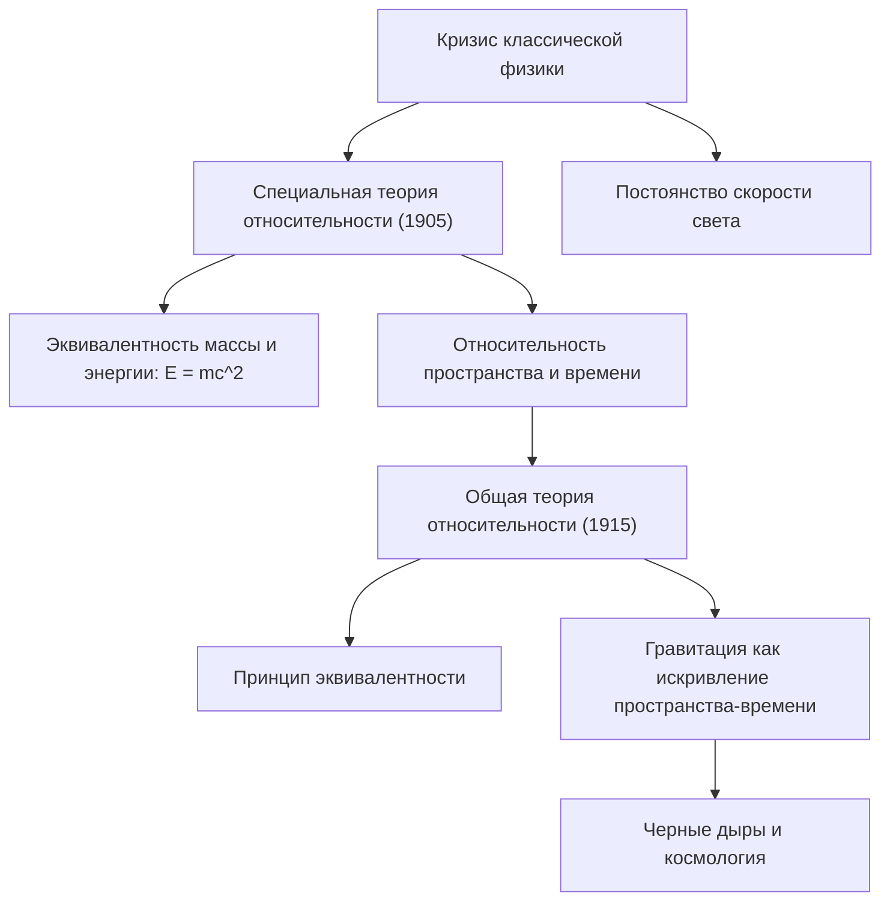

# Физика: введение в теорию относительности - как Эйнштейн перевернул представления о пространстве и времени

## Введение

Теория относительности, сформулированная Альбертом Эйнштейном в начале XX века, в корне разрушила многовековые представления человечества о сущности пространства, времени и тяготения. Вплоть до этого момента классическая механика Исаака Ньютона рассматривала время как некую абсолютную, равномерную и безучастную шкалу, текущую одинаково для всех уголков Вселенной, а пространство — как жесткую, неизменную трехмерную сцену.

В рамках **Специальной теории относительности (1905)** и **Общей теории относительности (1915)** Эйнштейн математически и физически доказал, что пространство и время неотделимы друг от друга. Они образуют единую динамическую четырехмерную ткань — **пространство-время (Spacetime)**. Эта ткань сжимается, растягивается и искривляется под воздействием скорости движения и распределения массы-энергии.

В этой статье мы последовательно рассмотрим предпосылки возникновения теории относительности, ее фундаментальные постулаты, математический аппарат, опытную проверку и практическое применение в повседневной жизни.

## 1. Тупик классической физики и тайна света

К концу XIX века физика казалась практически завершенным сводом законов. Механика Ньютона с безупречной точностью рассчитывала движение планет, а уравнения Максвелла объединили электричество с магнетизмом и показали, что свет представляет собой электромагнитную волну. Однако между этими двумя столпами науки таилось непреодолимое противоречие:

- **Механика Ньютона**: Все скорости относительны и складываются линейно. Если человек идет по поезду со скоростью 5 км/ч, а поезд движется со скоростью 100 км/ч, скорость относительно платформы составляет 105 км/ч.
- **Электродинамика Максвелла**: Скорость распространения электромагнитных волн в вакууме является фундаментальной константой: $c \approx 300\ 000\text{ км/с}$, независящей от движения источника или наблюдателя.

Если скорость света всегда одинакова для любого наблюдателя, классический закон сложения скоростей полностью теряет силу. Физики выдвинули гипотезу об особой всепроникающей среде — «светоносном эфире». Однако знаменитый **опыт Майкельсона-Морли (1887)** убедительно показал: никакого эфирного ветра не существует. Классическая физика зашла в глубокий тупик.

Выход из этого кризиса нашел 26-летний сотрудник патентного бюро в Берне Альберт Эйнштейн, проявив беспрецедентную интеллектуальную смелость.

## 2. Специальная теория относительности (1905): геометрия движения

В 1905 году Эйнштейн опубликовал свою специальную теорию относительности (СТО). Слово «специальная» указывает на то, что теория ограничивается рассмотрением инерциальных систем отсчета, движущихся прямолинейно и равномерно без ускорения и гравитации. СТО базируется всего на двух постулатах:

### Два фундаментальных постулата СТО
1. **Принцип относительности**: Законы физики имеют одинаковую математическую форму во всех инерциальных системах отсчета. Абсолютного покоя не существует.
2. **Принцип постоянства скорости света**: Скорость света в вакууме ($c$) неизменна во всех инерциальных системах и не зависит от скорости источника или приемника света.

Принятие этих постулатов влечет за собой выводы, полностью противоречащие обыденному опыту.

### Относительность одновременности и деформация пространства-времени
Два события, одновременные для одного наблюдателя, происходят в разное время для другого наблюдателя, движущегося с иной скоростью. **Одновременность относительна**.

Чтобы скорость света оставалась константой для каждого наблюдателя, пространственные и временные координаты должны динамически меняться:
- **Кинематическое замедление времени**: Часы на быстродвижущемся объекте с точки зрения неподвижного наблюдателя идут медленнее:
  $$ \Delta t' = \frac{\Delta t}{\sqrt{1 - \frac{v^2}{c^2}}} $$
- **Лоренцево сокращение длины**: Продольный размер движущегося тела с точки зрения неподвижного наблюдателя сжимается в направлении движения:
  $$ L' = L \sqrt{1 - \frac{v^2}{c^2}} $$

### Эквивалентность массы и энергии ($E = mc^2$)
Наиболее известное следствие СТО связывает массу и энергию формулой:

$$ E = mc^2 $$

Где $E$ — энергия, $m$ — масса, $c$ — скорость света. Множитель $c^2 \approx 9 \times 10^{16}\text{ м}^2/\text{с}^2$ колоссален, поэтому в малейшей доле массы скрыта исполинская энергия. Это уравнение объяснило механизм термоядерных реакций на Солнце и легло в основу [ядерной энергетики](/p/how-nuclear-power-works/).

## 3. Общая теория относительности (1915): гравитация как геометрия

СТО обладала двумя ограничениями: она не учитывала ускорения и конфликтовала с законом всемирного тяготения Ньютона. Мгновенное распространение гравитации противоречило тому, что ничто во Вселенной не может двигаться быстрее света.

После десяти лет напряженных математических поисков Эйнштейн создал в 1915 году **Общую теорию относительности (ОТО)**.

### Принцип эквивалентности
Отправной точкой стал «самый счастливый образ мыслей» Эйнштейна — **принцип эквивалентности**.

Представьте человека в замкнутом лифте. Если лифт свободно падает в поле тяготения, человек парит в невесомости и не ощущает веса. Напротив, если лифт ускоряется в открытом космосе ракетой с ускорением $9,8\text{ м/с}^2$, человек прижимается к полу так же, как на поверхности Земли. Эйнштейн заключил: **инертная и гравитационная массы тождественно равны**, а гравитация локально неотличима от ускорения.

### Гравитация — это искривление пространства-времени
ОТО утверждает: гравитация — это не невидимая сила притяжения между телами, а **искривление четырехмерного пространства-времени под действием массы и энергии**. Материальные тела просто движутся по кратчайшим путям (геодезическим линиям) в этом искривленном пространстве.

Классическая аналогия: тяжелый шар на натянутом резиновом полотне продавливает ткань, создавая воронку. Если пустить маленький шарик, он будет обращаться вокруг тяжелого шара по изогнутой поверхности. Точно так же Земля вращается вокруг Солнца по естественной геодезической траектории в пространстве-времени, искривленном огромной массой Солнца.

### Уравнения гравитационного поля Эйнштейна
Точная связь между кривизной пространства-времени и распределением материи описывается **уравнениями Эйнштейна**:

$$ R_{\mu\nu} - \frac{1}{2}g_{\mu\nu}R + \Lambda g_{\mu\nu} = \frac{8\pi G}{c^4} T_{\mu\nu} $$

Где:
- $R_{\mu\nu}$ — тензор Риччи,
- $g_{\mu\nu}$ — метрический тензор,
- $R$ — скалярная кривизна,
- $\Lambda$ — космологическая постоянная,
- $G$ — гравитационная постоянная Ньютона,
- $T_{\mu\nu}$ — тензор энергии-импульса материи и излучения.

Физик Джон Уилер выразил это уравнение емкой формулой: *«Пространство-время указывает материи, как двигаться; материя указывает пространству-времени, как искривляться»*.

## 4. Опытные подтверждения и роль в работе GPS

Поначалу ОТО казалась абстрактным построением, но за столетие она блестяще подтвердилась всеми доступными экспериментами.

### Ключевые подтверждения
1. **Смещение перигелия Меркурия**: Ньютоновская механика не могла объяснить аномалию в 43 угловые секунды за столетие; ОТО предсказала ее с абсолютной точностью.
2. **Искривление световых лучей (1919)**: Экспедиция Артура Эддингтона во время солнечного затмения подтвердила отклонение света звезд у края солнечного диска на 1,75 угловой секунды.
3. **Гравитационные волны (2015)**: Предсказанные Эйнштейном в 1916 году возмущения пространства-времени были напрямую зафиксированы детектором LIGO при слиянии черных дыр (Нобелевская премия 2017 года).

### Наша повседневная жизнь и GPS
ОТО непосредственно обеспечивает функционирование **спутниковой навигации (GPS)**:
- **СТО**: Из-за орбитальной скорости ($\sim 3,9\text{ км/с}$) атомные часы спутника **отстают на 7 микросекунд в сутки**.
- **ОТО**: Из-за более слабой гравитации на высоте 20 200 км часы **спешат на 45 микросекунд в сутки**.
- **Суммарный эффект**: Часы спутников идут быстрее наземных на **+38 микросекунд в сутки**.

Без поправки на эти 38 микросекунд позиционная погрешность навигатора росла бы со скоростью **11,4 км в сутки**, делая работу GPS невозможной.

## 5. Главный вызов: объединение с квантовой механикой

Общая теория относительности лежит в основе современной космологии: концепции Большого взрыва, расширения Вселенной и физики черных дыр. Однако в современной фундаментальной науке существует глубокий кризис.

ОТО описывает гладкое, непрерывное пространство-время, в то время как **квантовая механика** оперирует дискретными вероятностями микрочастиц. В сингулярностях (в центре черных дыр и в момент Большого взрыва) эти теории дают математическую бесконечность. Создание непротиворечивой **квантовой гравитации** (теория струн, петлевая квантовая гравитация) остается величайшей нерешенной задачей XXI века.

## Заключение

Теория относительности Альберта Эйнштейна — один из величайших триумфов человеческого разума. Доказав динамическую природу пространства и времени, она позволила человечеству осознать гармонию Вселенной как величественный космический танец материи, энергии и геометрии.
