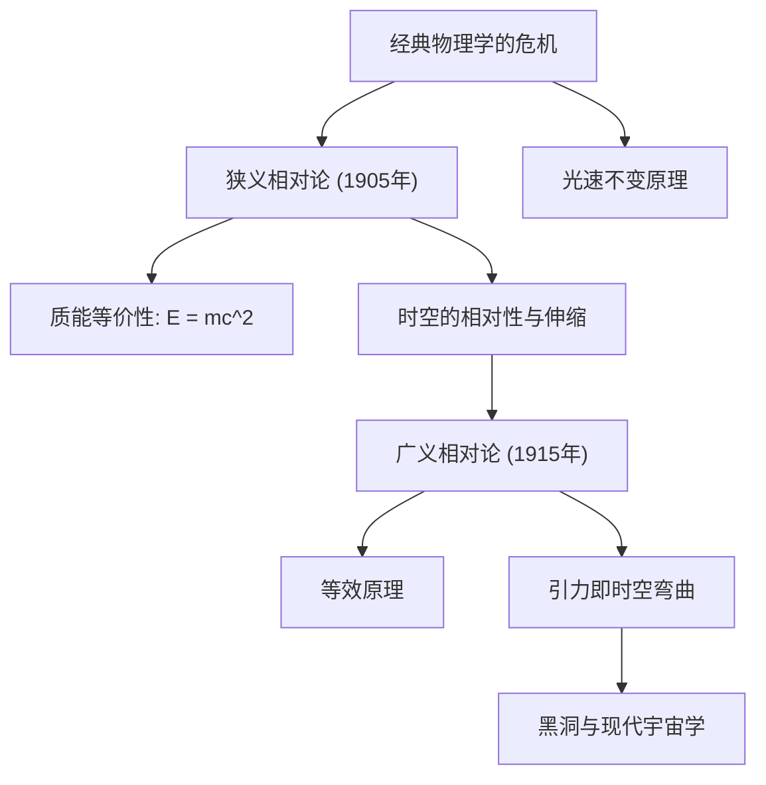

# 物理学：相对论入门 - 爱因斯坦如何重塑时间与空间概念

## 引言

20世纪初，阿尔伯特·爱因斯坦相继提出了 **狭义相对论（1905年）** 与 **广义相对论（1915年）** ，从根本上颠覆了人类数千年以来对“时间”与“空间”的传统直觉认知，成为现代物理学最雄伟的两大支柱之一。

在此之前，由艾萨克·牛顿奠定的经典力学体系假定：时间是独立于任何观测者、在全宇宙各个角落匀速流逝的“绝对尺度”；而空间则是一个刚性的、三维不变的静态背景舞台。然而，爱因斯坦用颠覆性的物理洞见证明：时间与空间绝非孤立存在，它们紧密交织为一个动态的四维整体——**时空（Spacetime）** 。时空的结构不仅会随着运动速度的变化而伸缩，更会在物质和能量的作用下发生弯曲与扭曲。

本文将系统梳理相对论的诞生背景、核心数学与物理内涵、关键实验验证及其在现代生活中的深远影响。

## 1. 经典物理学的僵局与“光速”之谜

19世纪末，经典物理学达到了前所未有的辉煌顶峰。牛顿力学精准解释了天体运转与机械工程，而麦克斯韦电磁方程组则完美统一了电学、磁学，并预言光是一种电磁波。然而，这两大物理巨塔之间却存在着无法调和的致命矛盾：

- **伽利略与牛顿的相对性原理** ：所有速度都是可以线性叠加的（相对速度）。如果你在时速100公里的火车上以时速5公里向前走，站台上的观测者测得你的速度就是105公里/小时。
- **麦克斯韦方程组的推论** ：真空中电磁波的传播速度是一个常数：$c \approx 300,000\text{ km/s}$。这一速度完全独立于光源的运动状态，也与观测者的相对运动无关。

如果光速在任何惯性系中都是常数，那么经典力学的速度叠加法则便彻底失效！当时的物理学家假设宇宙中充满了一种看不见、摸不着的绝对静止介质——“以太（Luminiferous Aether）”。然而，著名的 **1887年迈克尔逊-莫雷实验** 以极高精度证明：宇宙中根本不存在所谓的“以太风”。经典物理学走入了绝境。

当时年仅26岁、在瑞士伯尔尼专利局担任三级审查员的爱因斯坦，以惊人的思想勇气打破了僵局。

## 2. 狭义相对论（1905年）：运动时空的重塑

1905年，爱因斯坦发表了被后世称为狭义相对论的划时代论文。之所以被称为“狭义”，是因为该理论仅适用于不受引力作用、做匀速直线运动的惯性参考系。爱因斯坦将整个理论奠定在两条极其简洁且大刀阔斧的公理之上：

### 狭义相对论的两大基本假设
1. **相对性原理** ：物理学定律在所有相互做匀速直线运动的惯性参考系中具有完全相同的形式。不存在绝对静止的参考系。
2. **光速不变原理** ：在一切惯性参考系中，真空中光的传播速度 $c$ 都是相同的，与光源或观测者的运动状态毫无关联。

一旦承认这两条基本原理，一系列颠覆日常常识的惊人物理推论便不可避免地被推导出来。

### 同时的相对性与“时空伸缩”
我们所认为的“同时发生”，在以不同速度运动的观测者眼中并不存在绝对的时间重合。这就是 **同时的相对性** 。

为了确保光速对任何观测者都是恒定的，运动物体的“时间流逝”和“空间长度”必须发生物理改变：
- **运动学时间膨胀（钟慢效应）** ：相对于静止观测者，高速运动物体内部的钟表走得更慢：
  $$ \Delta t' = \frac{\Delta t}{\sqrt{1 - \frac{v^2}{c^2}}} $$
- **洛伦兹长度收缩（尺缩效应）** ：在静止观测者看来，高速运动物体沿其运动方向的物理空间长度会发生收缩：
  $$ L' = L \sqrt{1 - \frac{v^2}{c^2}} $$

### 质能等价性方程（$E = mc^2$）
狭义相对论最著名的丰碑是揭示了质量与能量在本质上的统一点。它被凝练为物理学史上最震撼的方程：

$$ E = mc^2 $$

其中 $E$ 代表能量，$m$ 代表质量，$c$ 为光速。由于光速的平方是一个极其巨大的常数（约 $9 \times 10^{16}\text{ m}^2/\text{s}^2$），这意味着微不足道的微量质量一旦完全转化为能量，将释放出摧枯拉朽的恐怖能量。这一公式彻底解开了太阳为何能持续燃烧数十亿年之谜（热核聚变），同时也奠定了现代[核能发电](/p/how-nuclear-power-works/)与核武器的物理基础。

## 3. 广义相对论（1915年）：引力是时空的几何弯曲

狭义相对论虽然取得了空前成功，但它存在两个严重的内在局限：它无法处理加速度运动，更与牛顿的万有引力定律直接冲突。牛顿认为引力是瞬时超距作用的，这违背了狭义相对论“光速是一切因果相互作用速度上限”的基本铁律。

历经长达十年的艰苦数学探索，爱因斯坦于1915年完成了人类理性的最高杰作——**广义相对论** 。

### 等效原理
广义相对论的逻辑起点被爱因斯坦称为“一生中最幸福的思想”： **等效原理（Equivalence Principle）** 。

想象一个处在完全封闭电梯中的人。如果电梯在引力场中做自由落体运动，里面的人将处于失重状态，感受不到任何引力；反之，如果电梯处于完全没有引力的外太空深处，但被火箭以 $9.8\text{ m/s}^2$ 的加速度向上推拉，电梯里的人将被紧紧压在底板上，所体验到的加速度物理效应与站在地球表面毫无二致。爱因斯坦由此断定： **惯性质能与引力质量完全等价** ，引力在局域范围内与加速度完全无法区分。

### 引力即“时空的弯曲”
等效原理引领爱因斯坦得到了一个震撼整个文明的结论：引力根本不是牛顿所描述的那种穿梭在虚空中的无形吸引力，而是 **质量与能量造成其周围四维时空发生的几何形变与弯曲** ！

著名的物理直观图景是：将一个沉重的保龄球放在紧绷的弹性橡胶床面上，橡胶表面会凹陷下去形成漏斗状弯曲。此时若在旁边轻轻推滚一颗小玻璃珠，玻璃珠并不会沿着直线匀速运动，而是顺着凹陷的曲面环绕保龄球旋转。在真实宇宙中，太阳并不是用某种看不见的力“抓”着地球，而是太阳巨大的质量使它周围的时空发生了弯曲，地球只是在弯曲的时空中沿着最自然的测地线（最短路径）做惯性运动而已！

### 爱因斯坦引力场方程
刻画时空几何弯曲与物质能量分布之间严密定量关系的数学表达，即著名的 **爱因斯坦场方程** ：

$$ R_{\mu\nu} - \frac{1}{2}g_{\mu\nu}R + \Lambda g_{\mu\nu} = \frac{8\pi G}{c^4} T_{\mu\nu} $$

其中：
- $R_{\mu\nu}$ 为里奇曲率张量，
- $g_{\mu\nu}$ 为描述时空度规的度规张量，
- $R$ 为标量曲率，
- $\Lambda$ 为宇宙学常数（与暗能量密切相关），
- $G$ 为牛顿引力常数，
- $T_{\mu\nu}$ 为包含一切物质、辐射与压强的能量-动量张量。

美国著名物理学家约翰·惠勒曾用极为生动传神的一句话概括了该方程的内涵： **“物质告诉时空如何弯曲，时空告诉物质如何运动。”**

## 4. 相对论的实证检验与日常生活中的应用

广义相对论在发表初期曾因其过于超前和惊世骇俗的数学结构而遭遇诸多质疑。然而，一个多世纪以来的天文观测和精密物理实验，无一例外地证明了它的绝对精确性。

### 历史性观测证实
1. **水星近日点反常进动** ：牛顿力学无法完全解释水星轨道每百年多出43角秒的微小偏移，而广义相对论的理论计算与实际观测值完全吻合，分秒不差。
2. **光线引力偏折（1919年日全食）** ：亚瑟·爱丁顿爵士率领的观测队在日全食期间拍摄到了太阳边缘恒星光线的弯曲，偏折角完美符合爱因斯坦时空弯曲预言的1.75角秒，使爱因斯坦一跃成为全球家喻户晓的科学巨人。
3. **引力波的直接探测（2015年）** ：作为爱因斯坦在1916年预言的时空涟漪，LIGO引力波天文台在整整百年后的2015年首次直接捕获了双黑洞合并产生的引力波信号，斩获2017年诺贝尔物理学奖。

### 现实生活与卫星导航（GPS）
相对论绝非仅仅存在于黑洞与深空的抽象理论，它与我们每天的出行息息相关：
- **狭义相对论效应** ：GPS卫星以秒速约3.9公里的高速环绕地球，运动学钟慢导致卫星原子钟每天 **慢走约7微秒** 。
- **广义相对论效应** ：卫星位于地表两万公里高空，受到的地球引力显著弱于地表，引力频移导致卫星原子钟每天 **快走约45微秒** 。
- **净叠加效应** ：卫星原子钟每天将比地面快走 **+38微秒** 。

若不对这38微秒进行相对论调校与修正，GPS导航的定位误差每天将累积 **11.4公里** ，短短几天车载地图就会彻底瘫痪。我们手机中的高精定位之所以能够运转，完全归功于爱因斯坦相对论方程的保驾护航。

## 5. 对现代物理学的影响与终极梦想

爱因斯坦的广义相对论为现代宇宙学奠定了基石，催生了宇宙大爆炸理论、宇宙膨胀模型以及黑洞物理学。然而，在当代物理学的前沿，依然伫立着一座难以逾越的终极高山。

那就是：描述微观粒子几率世界的 **量子力学** ，与描述宏观引力时空几何的 **广义相对论** ，在奇点（如黑洞中心或宇宙大爆炸奇点）的极端物理条件下存在数学上的不可调和性。将这两套人类历史上最伟大的理论融合为终极的 **量子引力理论（如弦理论、圈量子引力论）** ，是21世纪理论物理学家不懈追求的最高梦想。

## 结语

相对论不仅彻底重塑了人类对宇宙时空的科学认知，更展现了纯粹的人类理性在探索自然终极奥秘时所能达到的崇高境界。从牛顿的绝对空间，到爱因斯坦动态演化的弯曲时空，我们认识到：时空不再是冰冷孤立的舞台，而是与宇宙中所有的恒星、光线和我们自身交织律动的壮丽交响诗。
