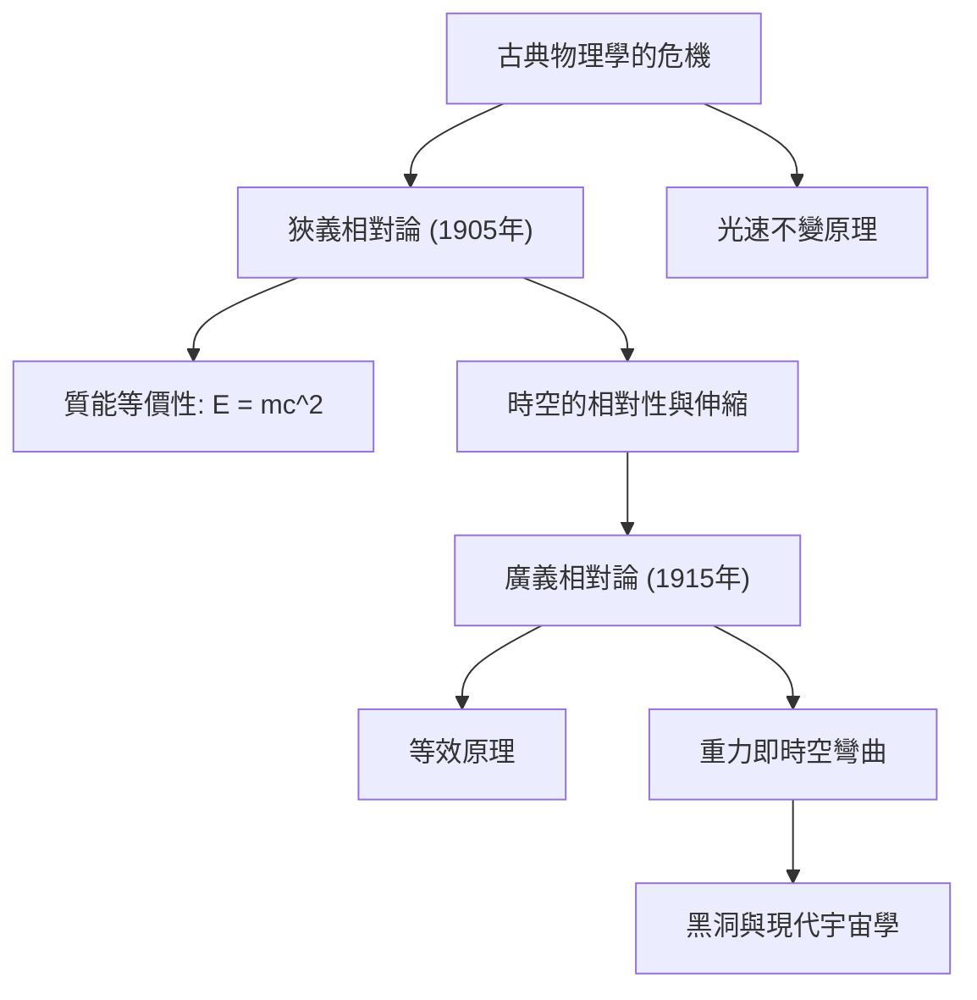

# 物理學：相對論入門 - 愛因斯坦如何重塑時間與空間概念

## 引言

20世紀初，阿爾伯特·愛因斯坦相繼提出了 **狹義相對論（1905年）** 與 **廣義相對論（1915年）** ，從根本上顛覆了人類數千年以來對「時間」與「空間」的傳統直覺認知，成為現代物理學最雄偉的兩大支柱之一。

在此之前，由艾薩克·牛頓奠定的古典力學體系假定：時間是獨立於任何觀測者、在全宇宙各個角落勻速流逝的「絕對尺度」；而空間則是一個剛性的、三維不變的靜態背景舞台。然而，愛因斯坦用顛覆性的物理洞見證明：時間與空間絕非孤立存在，它們緊密交織為一個動態的四維整體——**時空（Spacetime）** 。時空的結構不僅會隨著運動速度的變化而伸縮，更會在物質和能量的作用下發生彎曲與扭曲。

本文將系統梳理相對論的誕生背景、核心數學與物理內涵、關鍵實驗驗證及其在現代生活中的深遠影響。

## 1. 古典物理學的僵局與「光速」之謎

19世紀末，古典物理學達到了前所未有的輝煌頂峰。牛頓力學精準解釋了天體運轉與機械工程，而馬克士威電磁方程組則完美統一了電學、磁學，並預言光是一種電磁波。然而，這兩大物理巨塔之間卻存在著無法調和的致命矛盾：

- **伽利略與牛頓的相對性原理** ：所有速度都是可以線性疊加的（相對速度）。如果你在時速100公里的火車上以時速5公里向前走，月台上的觀測者測得你的速度就是105公里/小時。
- **馬克士威方程組的推論** ：真空中電磁波的傳播速度是一個常數：$c \approx 300,000\text{ km/s}$。這一速度完全獨立於光源的運動狀態，也與觀測者的相對運動無關。

如果光速在任何慣性系中都是常數，那麼古典力學的速度疊加法則便徹底失效！當時的物理學家假設宇宙中充滿了一種看不見、摸不著的絕對靜止介質——「以太（Luminiferous Aether）」。然而，著名的 **1887年邁克生-莫立實驗** 以極高精度證明：宇宙中根本不存在所謂的「以太風」。古典物理學走入了絕境。

當時年僅26歲、在瑞士伯恩專利局擔任三級審查員的愛因斯坦，以驚人的思想勇氣打破了僵局。

## 2. 狹義相對論（1905年）：運動時空的重塑

1905年，愛因斯坦發表了被後世稱為狹義相對論的劃時代論文。之所以被稱為「狹義」，是因為該理論僅適用於不受重力作用、做勻速直線運動的慣性參考系。愛因斯坦將整個理論奠定在兩條極其簡潔且大刀闊斧的公理之上：

### 狹義相對論的兩大基本假設
1. **相對性原理** ：物理學定律在所有相互做勻速直線運動的慣性參考系中具有完全相同的形式。不存在絕對靜止的參考系。
2. **光速不變原理** ：在一切慣性參考系中，真空中光的傳播速度 $c$ 都是相同的，與光源或觀測者的運動狀態毫無關聯。

一旦承認這兩條基本原理，一系列顛覆日常常識的驚人物理推論便不可避免地被推導出來。

### 同時的相對性與「時空伸縮」
我們所認為的「同時發生」，在以不同速度運動的觀測者眼中並不存在絕對的時間重合。這就是 **同時的相對性** 。

為了確保光速對任何觀測者都是恆定的，運動物體的「時間流逝」和「空間長度」必須發生物理改變：
- **運動學時間膨脹（鐘慢效應）** ：相對於靜止觀測者，高速運動物體內部的鐘錶走得更慢：
  $$ \Delta t' = \frac{\Delta t}{\sqrt{1 - \frac{v^2}{c^2}}} $$
- **勞侖茲長度收縮（尺縮效應）** ：在靜止觀測者看來，高速運動物體沿其運動方向的物理空間長度會發生收縮：
  $$ L' = L \sqrt{1 - \frac{v^2}{c^2}} $$

### 質能等價性方程式（$E = mc^2$）
狹義相對論最著名的豐碑是揭示了質量與能量在本質上的統一。它被凝練為物理學史上最震撼的方程式：

$$ E = mc^2 $$

其中 $E$ 代表能量，$m$ 代表質量，$c$ 為光速。由於光速的平方是一個極其巨大的常數（約 $9 \times 10^{16}\text{ m}^2/\text{s}^2$），這意味著微不足道的微量質量一旦完全轉化為能量，將釋放出摧枯拉朽的恐怖能量。這一公式徹底解開了太陽為何能持續燃燒數十億年之謎（熱核融合），同時也奠定了現代[核能發電](/p/how-nuclear-power-works/)與核武器的物理基礎。

## 3. 廣義相對論（1915年）：重力是時空的幾何彎曲

狹義相對論雖然取得了空前成功，但它存在兩個嚴重的內在局限：它無法處理加速度運動，更與牛頓的萬有引力定律直接衝突。牛頓認為引力是瞬時超距作用的，這違背了狹義相對論「光速是一切因果相互作用速度上限」的基本鐵律。

歷經長達十年的艱苦數學探索，愛因斯坦於1915年完成了人類理性的最高傑作——**廣義相對論** 。

### 等效原理
廣義相對論的邏輯起點被愛因斯坦稱為「一生中最幸福的思想」： **等效原理（Equivalence Principle）** 。

想像一個處在完全封閉電梯中的人。如果電梯在引力場中做自由落體運動，裡面的人將處於失重狀態，感受不到任何重力；反之，如果電梯處於完全沒有引力的外太空深處，但被火箭以 $9.8\text{ m/s}^2$ 的加速度向上推拉，電梯裡的人將被緊緊壓在底板上，所體驗到的加速度物理效應與站在地球表面毫無二致。愛因斯坦由此斷定： **慣性質量與引力質量完全等價** ，重力在局域範圍內與加速度完全無法區分。

### 重力即「時空的彎曲」
等效原理引領愛因斯坦得到了一個震撼整個文明的結論：引力根本不是牛頓所描述的那種穿梭在虛空中的無形吸引力，而是 **質量與能量造成其周圍四維時空發生的幾何形變與彎曲** ！

著名的物理直觀圖景是：將一個沉重的保齡球放在緊繃的彈性橡膠床面上，橡膠表面會凹陷下去形成漏斗狀彎曲。此時若在旁邊輕輕推滾一顆小玻璃珠，玻璃珠並不會沿著直線勻速運動，而是順著凹陷的曲面環繞保齡球旋轉。在真實宇宙中，太陽並不是用某種看不見的力「抓」著地球，而是太陽巨大的質量使它周圍的時空發生了彎曲，地球只是在彎曲的時空中沿著最自然的測地線（最短路徑）做慣性運動而已！

### 愛因斯坦場方程式
刻畫時空幾何彎曲與物質能量分布之間嚴密定量關係的數學表達，即著名的 **愛因斯坦場方程式** ：

$$ R_{\mu\nu} - \frac{1}{2}g_{\mu\nu}R + \Lambda g_{\mu\nu} = \frac{8\pi G}{c^4} T_{\mu\nu} $$

其中：
- $R_{\mu\nu}$ 為里奇曲率張量，
- $g_{\mu\nu}$ 為描述時空度規的度規張量，
- $R$ 為純量曲率，
- $\Lambda$ 為宇宙學常數（與暗能量密切相關），
- $G$ 為牛頓引力常數，
- $T_{\mu\nu}$ 為包含一切物質、輻射與壓強的能量-動量張量。

美國著名物理學家約翰·惠勒曾用極為生動傳神的一句話概括了該方程式的內涵： **「物質告訴時空如何彎曲，時空告訴物質如何運動。」**

## 4. 相對論的實證檢驗與日常生活中的應用

廣義相對論在發表初期曾因其過於超前和驚世駭俗的數學結構而遭遇諸多質疑。然而，一個多世紀以來的天文觀測和精密物理實驗，無一例外地證明了它的絕對精確性。

### 歷史性觀測證實
1. **水星近日點反常進動** ：牛頓力學無法完全解釋水星軌道每百年多出43角秒的微小偏移，而廣義相對論的理論計算與實際觀測值完全吻合，分秒不差。
2. **光線引力偏折（1919年日全食）** ：亞瑟·愛丁頓爵士率領的觀測隊在日全食期間拍攝到了太陽邊緣恆星光線的彎曲，偏折角完美符合愛因斯坦時空彎曲預言的1.75角秒，使愛因斯坦一躍成為全球家喻戶曉的科學巨人。
3. **重力波的直接探測（2015年）** ：作為愛因斯坦在1916年預言的時空漣漪，LIGO重力波天文台在整整百年後的2015年首次直接捕獲了雙黑洞合併產生的重力波訊號，斬獲2017年諾貝爾物理學獎。

### 現實生活與衛星導航（GPS）
相對論絕非僅僅存在於黑洞與深空的抽象理論，它與我們每天的出行息息相關：
- **狹義相對論效應** ：GPS衛星以秒速約3.9公里的高速環繞地球，運動學鐘慢導致衛星原子鐘每天 **慢走約7微秒** 。
- **廣義相對論效應** ：衛星位於地表兩萬公里高空，受到的地球引力顯著弱於地表，引力頻移導致衛星原子鐘每天 **快走約45微秒** 。
- **淨疊加效應** ：衛星原子鐘每天將比地面快走 **+38微秒** 。

若不對這38微秒進行相對論調校與修正，GPS導航的定位誤差每天將累積 **11.4公里** ，短短幾天車載地圖就會徹底癱瘓。我們手機中的高精定位之所以能夠運轉，完全歸功於愛因斯坦相對論方程式的保駕護航。

## 5. 對現代物理學的影響與終極夢想

愛因斯坦的廣義相對論為現代宇宙學奠定了基石，催生了宇宙大爆炸理論、宇宙膨脹模型以及黑洞物理學。然而，在當代物理學的前沿，依然矗立著一座難以逾越的終極高山。

那就是：描述微觀粒子機率世界的 **量子力學** ，與描述巨觀引力時空幾何的 **廣義相對論** ，在奇點（如黑洞中心或宇宙大爆炸奇點）的極端物理條件下存在數學上的不可調和性。將這兩套人類歷史上最偉大的理論融合為終極的 **量子引力理論（如弦理論、迴圈量子重力論）** ，是21世紀理論物理學家不懈追求的最高夢想。

## 結語

相對論不僅徹底重塑了人類對宇宙時空的科學認知，更展現了純粹的人類理性在探索自然終極奧秘時所能達到的崇高境界。從牛頓的絕對空間，到愛因斯坦動態演化的彎曲時空，我們認識到：時空不再是冰冷孤立的舞台，而是與宇宙中所有的恆星、光線和我們自身交織律動的壯麗交響詩。
