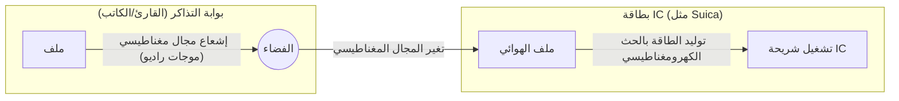

## 1. لماذا تعمل بدون بطارية؟

بطاقات العبور الذكية (IC) التي نستخدمها يوميًا كأمر مسلم به (مثل Suica و PASMO) وبطاقات الموظفين. بمجرد تمريرها بصوت رنين فوق بوابات التذاكر أو أجهزة القراءة، يتم تبادل البيانات في لحظة.

ولكن، ألم تتساءل يومًا:
**"كيف يمكن لبطاقة IC تشغيل الكمبيوتر الداخلي (شريحة IC) والتواصل لاسلكيًا على الرغم من عدم احتوائها على بطارية؟"**

السر وراء هذه الظاهرة السحرية يكمن في تقنية تسمى **"RFID (تحديد الهوية بموجات الراديو)"** ، وقانون فيزيائي تم اكتشافه في القرن التاسع عشر يسمى **"الحث الكهرومغناطيسي"** .

## 2. الحث الكهرومغناطيسي: تغير المجال المغناطيسي يولد الكهرباء

لفهم سبب عمل بطاقة IC بدون بطارية، نحتاج إلى معرفة "قانون فاراداي للحث الكهرومغناطيسي" الذي اكتشفه الفيزيائي البريطاني مايكل فاراداي في عام 1831.

الحث الكهرومغناطيسي هو ظاهرة حيث **"عندما يتغير المجال المغناطيسي (خطوط القوة المغناطيسية) الذي يمر عبر ملف (سلك ملفوف بحلقات)، يتدفق تيار في الملف لمحاولة إلغاء هذا التغيير"** . المولد الكهربائي (الدينامو) الذي يضيء المصباح عند تدوير إطار الدراجة يعتمد أيضًا على هذا المبدأ.

إذا نظرنا عبر الجزء الداخلي لبطاقة IC، يمكننا رؤية "ملف هوائي" مصنوع من سلك ملفوف عدة مرات على طول الحواف، ومتصل بـ "شريحة IC" صغيرة جدًا.

يتم باستمرار إشعاع موجات الراديو (المجال المغناطيسي) بتردد معين من بوابة التذاكر (القارئ).
عندما تقترب بطاقة IC من بوابة التذاكر، يتغير المجال المغناطيسي الذي يخترق ملف الهوائي في البطاقة بسرعة. ونتيجة لذلك، وحسب قانون الحث الكهرومغناطيسي، يتولد "تيار مستحث" في ملف البطاقة.
**بعبارة أخرى، تقوم بطاقة IC بتحويل موجات الراديو المنبعثة من بوابة التذاكر إلى "طاقة كهربائية" لتشغيل شريحة IC الخاصة بها للحظة واحدة فقط.**

## 3. إرسال واستقبال البيانات: الآلية الذكية لتعديل الحمل

بمجرد الحصول على الطاقة واستيقاظ شريحة IC، تأتي خطوة تبادل البيانات.
ومع ذلك، لا تمتلك بطاقة IC طاقة كافية لإطلاق موجات راديو قوية بمفردها. لذلك، يتم استخدام طريقة ذكية للغاية تسمى **"تعديل الحمل (Load Modulation)"** .

عندما تقوم بطاقة IC بتغيير مقاومة (حمل) دائرتها عن طريق تشغيلها وإيقافها بدقة، يحدث "اضطراب موجي" طفيف في موجات الراديو المنبعثة من القارئ.
على سبيل المثال، يشبه الأمر إرسال إشارات مورس عن طريق عكس مرآة كبيرة بوميض أو إخفائها باتجاه شخص آخر في مهب الريح. يستقبل القارئ البيانات (مثل الرصيد ومعلومات الهوية) من بطاقة IC عن طريق قراءة "الاضطراب الطفيف" الذي يحدث عندما تنعكس موجات الراديو التي أطلقها وتعود إليه.

## 4. الفرق بين RFID و NFC

يُطلق على تقنية الاتصال اللاسلكي بشكل عام اسم **"RFID"** . الأنظمة المستخدمة في صناديق الدفع في متاجر الملابس، والتي تقرأ علامات الملابس الموجودة في السلة كلها دفعة واحدة في لحظة، هي أيضًا نوع من أنواع RFID (تستخدم نطاق ترددات UHF ويمكنها الاتصال عبر مسافات طويلة تصل إلى عدة أمتار).

من ناحية أخرى، تعتمد بطاقات Suica والمحافظ المحمولة على الهواتف الذكية التي نستخدمها على معيار يسمى **"NFC (اتصال المدى القريب)"** ضمن تقنية RFID.

معيار NFC يستخدم تردد "13.56 ميجاهرتز" ويقيد عمدًا مسافة الاتصال لتكون حوالي "10 سنتيمترات (Near Field)".
لماذا تقتصر المسافة على مدى قصير؟ الجواب هو من أجل "الأمان" و "الموثوقية".
عند المرور عبر بوابة التذاكر، سيكون من السيئ قراءة رصيد بطاقة شخص آخر على بعد متر واحد. من خلال مواءمة نطاق الاتصال مع الحركة البديهية للإنسان المتمثلة في "اللمس الفعلي (التقريب)"، يتم تحقيق اتصال موثوق من واحد إلى واحد.

## 5. FeliCa: التكنولوجيا اليابانية التي تدعم أسرع بوابات التذاكر في العالم

يوجد عدة أنواع ضمن معيار NFC (مثل Type-A و Type-B)، ولكن ما يدعم شبكات النقل والأموال الإلكترونية في اليابان هو معيار **"FeliCa (Type-F)"** الذي طورته شركة سوني.

أكبر ميزة لتقنية FeliCa هي **"سرعة المعالجة الفائقة"** .

بوابات التذاكر في قطارات اليابان المزدحمة هي بيئة قاسية لا مثيل لها في العالم. من أجل السماح لعشرات الأشخاص بالمرور في دقيقة واحدة دون توقف، كان من الضروري إكمال كل شيء من تمرير البطاقة إلى "معالجة التشفير، والتحقق من الرصيد، والخصم، وتحديد فتح بوابة التذاكر" في غضون **"حوالي 0.1 ثانية (100 مللي ثانية)"** .

بينما تستغرق معايير Type-A و Type-B حوالي 0.5 ثانية للمعالجة، فقد كسر FeliCa "حاجز الـ 0.1 ثانية" من خلال تبسيط بنية البيانات إلى أقصى حد واعتماد بنية فريدة تقوم بمعالجة التشفير وقراءة/كتابة الملفات بشكل متوازٍ. إن قدرتنا على المشي عبر بوابات التذاكر دون توقف ترجع إلى هذا الضبط الفني المتقدم الذي تم ابتكاره في اليابان.

## 6. الخلاصة: الطاقة والمعلومات تنتقل عبر الفضاء

اتصال يستغرق 0.1 ثانية فقط مع صوت "رنين".
في تلك اللحظة، يخترق مجال مغناطيسي غير مرئي ينبعث من بوابة التذاكر ملف البطاقة، ويولد طاقة كهربائية وفقًا لقانون فاراداي للفيزياء. تستيقظ شريحة IC وتقوم بحسابات تشفير متقدمة، وتهز موجات الفضاء مرة أخرى لإرجاع البيانات.

يمكن القول إن تقنيات NFC و FeliCa هي تحفة المجتمع الحديث، حيث تندمج الفيزياء (الكهرومغناطيسية) مع هندسة المعلومات (التشفير والاتصالات) بأجمل صورة.
