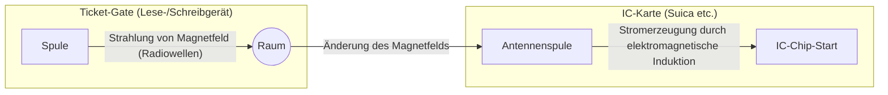

## 1. Wie funktioniert es ohne Batterie?

Verkehrs-IC-Karten (Suica, PASMO usw.) und Mitarbeiterausweise, die wir jeden Tag als selbstverständlich nutzen. Indem Sie diese einfach mit einem „Piep“ an ein Ticket-Gate oder ein Lesegerät halten, werden Daten sofort ausgetauscht.

Aber haben Sie sich nie gewundert?
**„Obwohl keine Batterie in der IC-Karte ist, wie wird der interne Computer (IC-Chip) gestartet und wie findet die drahtlose Kommunikation statt?“**

Die wahre Natur dieses magischen Phänomens liegt in einer Technologie namens **„RFID (Radio Frequency Identification)“** und einem physikalischen Gesetz namens **„Elektromagnetische Induktion“**, das im 19. Jahrhundert entdeckt wurde.

## 2. Elektromagnetische Induktion: Veränderungen im Magnetfeld erzeugen Elektrizität

Um zu verstehen, warum IC-Karten ohne Batterie funktionieren, müssen wir das „Faradaysche Gesetz der elektromagnetischen Induktion“ kennen, das 1831 vom britischen Physiker Michael Faraday entdeckt wurde.

Die elektromagnetische Induktion ist ein Phänomen, bei dem **„wenn sich das durch eine Spule (ein gewickelter Draht) verlaufende Magnetfeld (magnetische Kraftlinien) ändert, ein Strom durch die Spule fließt, um diese Änderung aufzuheben“**. Generatoren (Dynamos), die beim Drehen der Fahrradreifen das Licht einschalten, wenden dieses Prinzip ebenfalls an.

Wenn Sie durch das Innere einer IC-Karte schauen, können Sie sehen, dass eine „Antennenspule“, die viele Male um den Rand gewickelt ist, mit einem sehr kleinen „IC-Chip“ verbunden ist.

Das Ticket-Gate (Lesegerät) strahlt ständig Radiowellen (Magnetfelder) einer bestimmten Frequenz aus.
Wenn sich die IC-Karte dem Ticket-Gate nähert, ändert sich das Magnetfeld, das die Antennenspule in der Karte durchdringt, abrupt. Aufgrund des Gesetzes der elektromagnetischen Induktion wird dann in der Spule der Karte ein „induzierter Strom“ erzeugt.
**Das bedeutet, dass die IC-Karte die vom Ticket-Gate einfliegenden Radiowellen in „elektrische Energie“ umwandelt und ihren eigenen IC-Chip für einen Moment aktiviert.**

## 3. Daten senden und empfangen: Der clevere Mechanismus der Lastmodulation

Sobald Strom gewonnen wurde und der IC-Chip aufgewacht ist, folgt der Datenaustausch.
Die IC-Karte selbst hat jedoch nicht genug Energie, um von sich aus starke Radiowellen auszusenden. Deshalb verwendet sie eine sehr clevere Methode namens **„Lastmodulation (Load Modulation)“**.

Wenn die IC-Karte den Widerstand (die Last) ihrer eigenen Schaltung durch feines Ein- und Ausschalten ändert, erzeugt sie eine subtile „Störung der Wellen“ in den vom Lesegerät ausgestrahlten Radiowellen.
Es ist vergleichbar mit dem Senden eines Morsezeichens, indem man einen großen Spiegel gegen den Wind blinken lässt und ihn dann wieder verbirgt, um auf die andere Seite zu reflektieren. Das Lesegerät empfängt die Daten (Guthaben und ID-Informationen) von der IC-Karte, indem es diese „leichte Störung“ liest, wenn die von ihm gesendeten Radiowellen reflektiert werden.

## 4. Der Unterschied zwischen RFID und NFC

Die Technologien der kontaktlosen Kommunikation werden zusammenfassend als **„RFID“** bezeichnet. Systeme, die an der Kasse eines Bekleidungsgeschäfts sofort alle Etiketten auf Kleidungsstücken in einem Korb lesen, sind ebenfalls eine Form von RFID (unter Verwendung des UHF-Bands, was eine weitreichende Kommunikation von mehreren Metern ermöglicht).

Auf der anderen Seite basieren die Suica und das Mobile Payment auf unseren Smartphones auf einem Standard namens **„NFC (Near Field Communication)“** innerhalb von RFID.

NFC ist ein Standard, der die Frequenz „13,56 MHz“ nutzt und die Kommunikationsentfernung absichtlich auf „etwa 10 Zentimeter (Near Field)“ beschränkt.
Warum wurde sie auf eine kurze Distanz beschränkt? Der Grund liegt in „Sicherheit“ und „Zuverlässigkeit“.
Es wäre problematisch, wenn beim Passieren des Ticket-Gates das Guthaben der Karte einer anderen Person in einem Meter Entfernung gelesen würde. Durch die Übereinstimmung der intuitiven menschlichen Aktion des „physischen Berührens (Annäherns)“ mit der Kommunikationsreichweite wird eine sichere Eins-zu-Eins-Kommunikation realisiert.

## 5. FeliCa: Japanische Technologie, die die schnellsten Ticket-Gates der Welt unterstützt

Es gibt mehrere Arten innerhalb des NFC-Standards (Type-A, Type-B usw.), aber das japanische Transportnetz und das elektronische Geld werden durch einen von Sony entwickelten Standard namens **„FeliCa (Type-F)“** unterstützt.

Das größte Merkmal von FeliCa ist seine **„überwältigende Verarbeitungsgeschwindigkeit“**.
Die Ticket-Gates in Japans überfüllten Zügen sind eine der strengsten Umgebungen der Welt. Damit dutzende Menschen in einer Minute passieren können, ohne anzuhalten, musste der gesamte Prozess vom Vorhalten der Karte über „kryptografische Verarbeitung, Bestätigung des Guthabens, Abbuchung und Entscheidung, das Tor zu öffnen“ in **„etwa 0,1 Sekunden (100 Millisekunden)“** abgeschlossen sein.

Während die Standards Type-A und B etwa 0,5 Sekunden für die Verarbeitung benötigen, durchbrach FeliCa diese „0,1-Sekunden-Mauer“, indem es die Datenstruktur extrem vereinfachte und eine einzigartige Architektur annahm, die kryptografische Verarbeitung und das Lesen/Schreiben von Dateien parallel durchführt. Dass wir ohne anzuhalten durch die Ticket-Gates laufen können, verdanken wir diesem hochentwickelten technischen Tuning aus Japan.

## 6. Zusammenfassung: Energie und Informationen übertragen sich durch den Raum

Ein „Piep“, ein Kontakt von nur 0,1 Sekunden.
In diesem Moment durchdringt ein unsichtbares Magnetfeld, das vom Ticket-Gate ausgeht, die Spule der Karte, erzeugt nach Faradays physikalischem Gesetz Energie, weckt den IC-Chip, der fortschrittliche kryptografische Berechnungen durchführt, und bringt die Wellen im Raum wieder zum Schwingen, um Daten zurückzugeben.

Die NFC- und FeliCa-Technologien können als ein Meisterwerk der modernen Gesellschaft bezeichnet werden, bei dem Physik (Elektromagnetismus) und Informationstechnik (Kryptografie und Kommunikation) auf die schönste Weise miteinander verschmelzen.
