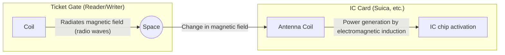

## 1. Why Does It Work Without a Battery?

Transportation IC cards (such as Suica and PASMO) and employee ID cards are things we use every day as a matter of course. Just by holding them up to a ticket gate or reader with a "beep," data is exchanged instantly.

However, haven't you ever wondered?
**"Even though there is no battery inside the IC card, how does it start up the internal computer (IC chip) and communicate wirelessly?"**

The true identity of this magical phenomenon lies in the technology called "**RFID (Radio Frequency Identification)**" and the physical law of "**electromagnetic induction**" discovered in the 19th century.

## 2. Electromagnetic Induction: Changes in the Magnetic Field Generate Electricity

To understand why an IC card works without a battery, we need to know "Faraday's law of induction," discovered by British physicist Michael Faraday in 1831.

Electromagnetic induction is a phenomenon where **"when the magnetic field (lines of magnetic force) passing through a coil (a wire wound in spirals) changes, an electric current flows through the coil to cancel out the change."** The generator (dynamo) that turns on a light when a bicycle tire spins also applies this principle.

If you look through the inside of an IC card, you can see that an "antenna coil," which is a wire wound many times around the edge, is connected to a tiny "IC chip."

A ticket gate (reader) constantly radiates radio waves (a magnetic field) of a specific frequency.
When an IC card approaches the ticket gate, the magnetic field piercing the antenna coil inside the card changes rapidly. Then, according to the law of electromagnetic induction, an "induced current" is generated in the coil of the card.
**In other words, the IC card converts the radio waves flying from the ticket gate into "electric power," and activates its own IC chip for just a moment.**

## 3. Data Transmission and Reception: The Clever Mechanism of Load Modulation

Once power is obtained and the IC chip wakes up, the next step is data exchange.
However, the IC card does not have enough power to emit strong radio waves on its own. Therefore, it uses a very clever method called "**load modulation**".

When the IC card finely changes the resistance (load) of its own circuit by turning it ON/OFF, it creates subtle "wave disturbances" in the radio waves radiated from the reader.
By way of comparison, it is like sending a Morse code signal by flashing and hiding a large mirror against a headwind to reflect light toward the other party. The reader receives the data (balance and ID information) from the IC card by reading the "slight disturbance" when the radio waves it emitted are reflected back.

## 4. The Difference Between RFID and NFC

Contactless communication technologies are collectively called "**RFID**". Systems such as those used at the cash registers of apparel shops, where tags on clothes put in a basket are read all at once in an instant, are also a type of RFID (utilizing the UHF band and capable of long-distance communication over several meters).

On the other hand, the Suica and smartphone Osaifu-Keitai we use are based on a standard called "**NFC (Near Field Communication)**" within RFID.

NFC is a standard that uses the "13.56 MHz" frequency and intentionally limits the communication distance to "about 10 centimeters (Near Field)".
Why limit it to a short distance? That is for "security" and "certainty."
When passing through a ticket gate, it would be troublesome if it read the balance of another person's card a meter away. By matching the communication range with the intuitive human action of "physically touching (bringing close)," it realizes reliable one-to-one communication.

## 5. FeliCa: The Japanese Technology Behind the World's Fastest Ticket Gates

There are several types of NFC standards (Type-A, Type-B, etc.), but the one supporting Japan's transportation networks and electronic money is the "**FeliCa (Type-F)**" standard developed by Sony.

The greatest feature of FeliCa is its "**overwhelming processing speed**".
Ticket gates for crowded trains in Japan are in a severe environment unparalleled in the world. In order for dozens of people to pass through without stopping in one minute, it was necessary to complete everything from holding up the card to "cryptographic processing, checking the balance, deducting the amount, and determining to open the gate of the ticket gate" within **"about 0.1 seconds (100 milliseconds)"**.

While Type-A and B standards take about 0.5 seconds to process, FeliCa broke through this "0.1-second barrier" by lightening the data structure to the utmost limit and adopting a unique architecture that performs cryptographic processing and file reading/writing in parallel. The fact that we can walk through ticket gates non-stop is thanks to this highly advanced technology tuning originating in Japan.

## 6. Conclusion: Energy and Information Transmitted Through Space

A contact of a mere 0.1 seconds with a "beep."
At that moment, an invisible magnetic field released from the ticket gate pierces the coil of the card, generating power according to Faraday's physical law, and the awakened IC chip performs advanced cryptographic calculations, swaying the waves in space again to return data.

The technologies of NFC and FeliCa can be said to be a masterpiece of modern society, where physics (electromagnetism) and information engineering (cryptography and communications) are most beautifully fused.
