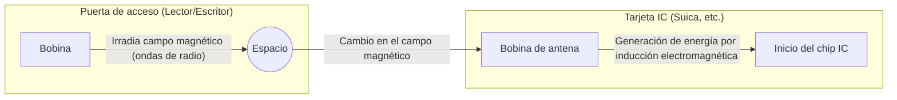

## 1. ¿Por qué funciona sin batería?

Las tarjetas IC de transporte (Suica, PASMO, etc.) y las tarjetas de identificación de empleados que usamos a diario sin pensar mucho en ellas, intercambian datos de forma instantánea con solo "tocarlas" brevemente contra una puerta de acceso o un lector.

Sin embargo, ¿alguna vez te has preguntado algo como esto?
**"Aunque no hay ninguna batería dentro de la tarjeta IC, ¿cómo arranca la computadora interna (chip IC) y se comunica de forma inalámbrica?"**

La verdadera identidad de este fenómeno mágico reside en la tecnología llamada "**RFID (Radio Frequency Identification)**" y en una ley de la física descubierta en el siglo XIX llamada "**inducción electromagnética**".

## 2. Inducción electromagnética: los cambios en los campos magnéticos generan electricidad

Para entender la razón por la que las tarjetas IC funcionan sin batería, necesitamos conocer la "ley de inducción electromagnética de Faraday", descubierta por el físico británico Michael Faraday en 1831.

La inducción electromagnética es el fenómeno en el cual, **"cuando el campo magnético (líneas de fuerza magnética) que pasa a través de una bobina (un cable conductor enrollado en bucles) cambia, fluye una corriente en la bobina para intentar cancelar ese cambio"**. Los generadores (dinamos) que encienden una luz cuando giras la llanta de una bicicleta también aplican este principio.

Si miras a través del interior de una tarjeta IC, puedes ver que una "bobina de antena" hecha de alambre conductor enrollado en múltiples bucles a lo largo del borde está conectada a un diminuto "chip IC".

Las puertas de acceso (lectores) siempre están irradiando ondas de radio (campos magnéticos) de una frecuencia específica.
Cuando la tarjeta IC se acerca a la puerta de acceso, el campo magnético que atraviesa la bobina de la antena dentro de la tarjeta cambia rápidamente. Entonces, de acuerdo con la ley de la inducción electromagnética, se genera una "corriente inducida" en la bobina de la tarjeta.
**Es decir, la tarjeta IC convierte las ondas de radio enviadas por la puerta de acceso en "energía eléctrica", utilizando esto para encender momentáneamente su propio chip IC.**

## 3. Transmisión y recepción de datos: Un ingenioso mecanismo llamado modulación de carga

Una vez que el chip IC se despierta tras obtener energía eléctrica, el siguiente paso es el intercambio de datos.
Sin embargo, la tarjeta IC no tiene suficiente energía por sí misma para emitir señales de radio fuertes. Para solucionar esto, utiliza un método muy ingenioso llamado "**modulación de carga (load modulation)**".

Cuando la tarjeta IC enciende y apaga rápidamente la resistencia (carga) de su propio circuito para crear variaciones, se produce una sutil "perturbación en las ondas" en las ondas de radio irradiadas por el lector.
Para poner un ejemplo, es como enviar señales en código Morse hacia alguien parpadeando el reflejo de un espejo grande o escondiéndolo contra el viento. El lector recibe los datos de la tarjeta IC (saldo, información de identificación, etc.) al leer las "diminutas perturbaciones" cuando las ondas de radio que él mismo emitió rebotan de vuelta.

## 4. Diferencias entre RFID y NFC

Las tecnologías de comunicación sin contacto se denominan colectivamente "**RFID**". Un sistema en la caja registradora de una tienda de ropa que escanea todas las etiquetas de las prendas de una cesta en un instante es también un tipo de RFID (utiliza la banda UHF y puede comunicarse a largas distancias de varios metros).

Por otro lado, la tarjeta Suica o los teléfonos inteligentes Osaifu-Keitai que utilizamos, se basan en un estándar llamado "**NFC (Near Field Communication)**" que es parte de la tecnología RFID.

NFC es un estándar que utiliza la frecuencia de "13.56MHz" y limita intencionadamente la distancia de comunicación a "unos 10 centímetros (Near Field)".
¿Por qué se restringió a distancias cortas? Fue por "seguridad" y "fiabilidad".
Sería un gran problema si, al cruzar la puerta de acceso, se leyera el saldo de la tarjeta de otra persona que está a un metro de distancia. Al hacer coincidir el movimiento físico e intuitivo humano de "tocar (acercar)" con el rango de comunicación, se consigue una comunicación de uno a uno segura y fiable.

## 5. FeliCa: La tecnología japonesa que sustenta las puertas de pago más rápidas del mundo

Existen varios tipos (Type-A, Type-B, etc.) dentro del estándar NFC, pero el que sostiene la red de transporte de Japón y el dinero electrónico es un estándar llamado "**FeliCa (Type-F)**", desarrollado por Sony.

La principal característica de FeliCa es su "**abrumadora velocidad de procesamiento**".
Las puertas de pago en los abarrotados trenes japoneses suponen un entorno riguroso que no tiene igual en el mundo. Para que decenas de personas pasen por minuto sin detenerse, era necesario que todo el proceso, desde acercar la tarjeta hasta "el procesamiento criptográfico, la confirmación del saldo, la deducción y la decisión de abrir la puerta de acceso", se completara en **"aproximadamente 0.1 segundos (100 milisegundos)"** o menos.

Mientras que los estándares Type-A y B toman alrededor de 0.5 segundos para el procesamiento, FeliCa rompió esta "barrera de 0.1 segundos" al optimizar al máximo la estructura de datos y adoptar una arquitectura única que realiza el procesamiento criptográfico y la lectura/escritura de archivos en paralelo. El hecho de que podamos caminar a través de la puerta de pago sin detenernos es gracias a esta avanzada optimización de tecnología de origen japonés.

## 6. Conclusión: Energía e información transmitidas a través del espacio

El contacto de solo 0.1 segundos acompañado de un "bip".
En ese instante, el campo magnético invisible emitido por la puerta de pago atraviesa la bobina de la tarjeta, genera electricidad según la ley de la física de Faraday, y el chip IC despertado realiza complejos cálculos criptográficos y devuelve datos alterando de nuevo las ondas en el espacio.

Se podría decir que las tecnologías de NFC y FeliCa son una obra maestra de la sociedad moderna, donde la física (electromagnetismo) y la ingeniería de la información (criptografía y comunicación) se fusionan de la manera más hermosa.
