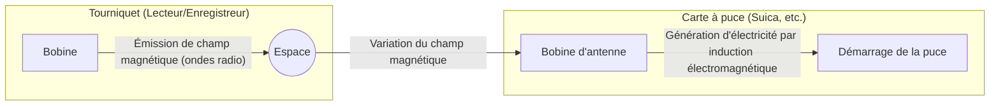

## 1. Comment cela fonctionne-t-il sans batterie ?

Les cartes à puce de transport (Suica, PASMO, etc.) et les badges d'entreprise que nous utilisons quotidiennement. Il suffit de les effleurer avec un lecteur ou à un tourniquet en faisant « bip » pour que l'échange de données soit instantané.

Cependant, ne vous êtes-vous jamais posé la question suivante :
**« Puisqu'il n'y a pas de batterie dans la carte à puce, comment l'ordinateur interne (la puce électronique) s'allume-t-il et communique-t-il sans fil ? »**

Le véritable secret de ce phénomène magique réside dans la technologie de la **« RFID (Radio Frequency Identification) »** et dans la loi de la physique de l'**« induction électromagnétique »** découverte au XIXe siècle.

## 2. Induction électromagnétique : la variation du champ magnétique génère de l'électricité

Pour comprendre pourquoi une carte à puce fonctionne sans batterie, il faut connaître la « loi de l'induction électromagnétique de Faraday », découverte en 1831 par le physicien britannique Michael Faraday.

L'induction électromagnétique est le phénomène selon lequel **« lorsque le champ magnétique (les lignes de force magnétique) traversant une bobine (un fil conducteur enroulé) varie, un courant électrique circule dans la bobine pour contrer cette variation »**. Le générateur (dynamo) qui allume la lumière d'un vélo lorsque la roue tourne applique également ce principe.

Si l'on regarde à l'intérieur d'une carte à puce, on peut voir qu'une « bobine d'antenne », dont le fil conducteur est enroulé plusieurs fois le long du bord, est connectée à une toute petite « puce électronique ».

Le tourniquet (lecteur) émet en permanence des ondes radio (champ magnétique) d'une fréquence spécifique.
Lorsque la carte à puce s'approche du tourniquet, le champ magnétique traversant la bobine d'antenne à l'intérieur de la carte change brusquement. La loi de l'induction électromagnétique génère alors un « courant induit » dans la bobine de la carte.
**En d'autres termes, la carte à puce convertit les ondes radio du tourniquet en « électricité » et active sa propre puce électronique pendant un bref instant.**

## 3. Transmission et réception de données : le mécanisme ingénieux de la modulation de charge

Une fois l'électricité obtenue et la puce réveillée, l'étape suivante est l'échange de données.
Cependant, la carte à puce n'a pas assez d'énergie pour émettre elle-même de fortes ondes radio. C'est là qu'intervient une méthode très astucieuse appelée la **« modulation de charge (load modulation) »**.

Lorsque la carte à puce modifie finement la résistance (charge) de son propre circuit en l'allumant et l'éteignant (ON/OFF), de subtiles « perturbations ondulatoires » se produisent dans les ondes radio émises par le lecteur.
Pour utiliser une analogie, c'est comme envoyer un signal morse en réfléchissant la lumière avec un grand miroir, puis en le cachant face à quelqu'un dans un fort vent de face. En lisant les « légères perturbations » lorsque les ondes radio qu'il a émises reviennent, le lecteur reçoit les données (informations de solde ou d'identification) de la carte à puce.

## 4. Différence entre RFID et NFC

La **« RFID »** est le terme général pour les technologies de communication sans contact. Le système des caisses des magasins de vêtements, qui lit instantanément et en une seule fois les étiquettes des vêtements mis dans le panier, est également un type de RFID (qui utilise la bande UHF et permet une communication longue distance de plusieurs mètres).

En revanche, le Suica ou le système de paiement mobile (Osaifu-Keitai) de notre smartphone que nous utilisons repose sur la norme **« NFC (Near Field Communication) »** au sein de la RFID.

Le NFC est une norme qui utilise la fréquence de « 13,56 MHz » et limite délibérément la distance de communication à « environ 10 centimètres (Near Field) ».
Pourquoi restreindre la distance ? C'est pour des raisons de « sécurité » et de « fiabilité ».
Au moment de passer un tourniquet, il serait problématique de lire le solde de la carte d'une autre personne située à un mètre de distance. En faisant correspondre l'action intuitive humaine du « toucher physique (rapprochement) » avec la portée de communication, une communication en tête-à-tête fiable est rendue possible.

## 5. FeliCa : la technologie japonaise derrière les tourniquets les plus rapides du monde

Il existe plusieurs types de normes NFC (Type-A, Type-B, etc.), mais ce qui soutient le réseau de transport et la monnaie électronique au Japon, c'est la norme **« FeliCa (Type-F) »**, développée par Sony.

La principale caractéristique du FeliCa est sa **« vitesse de traitement écrasante »**.
Les tourniquets des trains bondés japonais représentent l'un des environnements les plus stricts au monde. Pour permettre à des dizaines de personnes de passer à la minute sans s'arrêter, tout, depuis la présentation de la carte jusqu'au « traitement cryptographique, la vérification du solde, le débit et la décision d'ouvrir la porte du tourniquet », doit être accompli en **« environ 0,1 seconde (100 millisecondes) »**.

Alors que les normes Type-A et B nécessitent environ 0,5 seconde pour le traitement, le FeliCa a franchi cette « barrière des 0,1 seconde » en allégeant au maximum la structure des données et en adoptant une architecture unique qui effectue le traitement cryptographique et la lecture/écriture de fichiers en parallèle. Si nous pouvons franchir les tourniquets sans nous arrêter, c'est grâce à ce réglage technologique sophistiqué originaire du Japon.

## 6. Conclusion : l'énergie et l'information transmises dans l'espace

Un contact d'à peine 0,1 seconde accompagné d'un « bip ».
À cet instant, le champ magnétique invisible émis par le tourniquet traverse la bobine de la carte, génère de l'électricité selon la loi physique de Faraday, réveille la puce électronique qui effectue des calculs cryptographiques complexes, puis renvoie les données en faisant à nouveau vibrer les ondes dans l'espace.

On peut dire que les technologies NFC et FeliCa sont des chefs-d'œuvre de la société moderne, où la physique (l'électromagnétisme) et l'informatique (la cryptographie et les communications) se rejoignent de la plus belle des manières.
