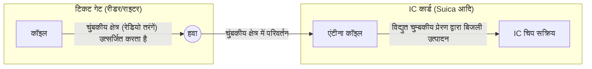

## 1. बैटरी के बिना यह कैसे काम करता है?

यातायात IC कार्ड (जैसे Suica, PASMO) और कर्मचारी पहचान पत्र जिनका हम हर दिन स्वाभाविक रूप से उपयोग करते हैं। इन्हें टिकट गेट या रीडर पर "बीप" के साथ रखने मात्र से ही डेटा का आदान-प्रदान तुरंत हो जाता है।

लेकिन क्या आपने कभी आश्चर्य नहीं किया है?
**"जब IC कार्ड के अंदर कोई बैटरी नहीं है, तो यह आंतरिक कंप्यूटर (IC चिप) को कैसे चालू करता है और वायरलेस तरीके से संचार कैसे करता है?"**

इस जादुई घटना का रहस्य **"RFID (Radio Frequency Identification)"** नामक तकनीक और 19वीं सदी में खोजे गए **"विद्युत चुम्बकीय प्रेरण"** के भौतिकी नियम में छिपा है।

## 2. विद्युत चुम्बकीय प्रेरण: चुंबकीय क्षेत्र में परिवर्तन से बिजली उत्पन्न होती है

यह समझने के लिए कि IC कार्ड बिना बैटरी के कैसे काम करता है, हमें "फैराडे के विद्युत चुम्बकीय प्रेरण के नियम" को जानना होगा, जिसे ब्रिटिश भौतिक विज्ञानी माइकल फैराडे ने 1831 में खोजा था।

विद्युत चुम्बकीय प्रेरण वह घटना है जहां, **"जब किसी कॉइल (घुमावदार तार) से गुजरने वाला चुंबकीय क्षेत्र (चुंबकीय बल रेखाएं) बदलता है, तो कॉइल में उस परिवर्तन का विरोध करने के लिए एक विद्युत धारा प्रवाहित होने लगती है।"** साइकिल के टायर को घुमाने पर लाइट जलाने वाला जनरेटर (डायनमो) भी इसी सिद्धांत का उपयोग करता है।

यदि आप एक IC कार्ड के अंदर देखते हैं, तो आप पाएंगे कि किनारे पर कई बार लपेटा गया एक "एंटीना कॉइल" एक बहुत छोटी "IC चिप" से जुड़ा हुआ है।

टिकट गेट (रीडर) से लगातार एक विशिष्ट आवृत्ति की रेडियो तरंगें (चुंबकीय क्षेत्र) उत्सर्जित होती हैं।
जब IC कार्ड टिकट गेट के करीब पहुंचता है, तो कार्ड के भीतर एंटीना कॉइल से गुजरने वाला चुंबकीय क्षेत्र तेजी से बदलता है। तब, विद्युत चुम्बकीय प्रेरण के नियम के अनुसार, कार्ड के कॉइल में एक "प्रेरित धारा" उत्पन्न होती है।
**अर्थात, IC कार्ड टिकट गेट से आने वाली रेडियो तरंगों को 'बिजली' में परिवर्तित करता है और एक पल के लिए अपनी IC चिप को चालू करता है।**

## 3. डेटा ट्रांसमिशन और रिसेप्शन: लोड मॉड्यूलेशन की स्मार्ट प्रणाली

एक बार जब बिजली प्राप्त हो जाती है और IC चिप सक्रिय हो जाती है, तो अगला कदम डेटा का आदान-प्रदान करना है।
हालाँकि, IC कार्ड में इतनी शक्ति नहीं होती कि वह अपने आप शक्तिशाली रेडियो तरंगें उत्सर्जित कर सके। इसलिए, यह **"लोड मॉड्यूलेशन (Load Modulation)"** नामक एक बहुत ही स्मार्ट विधि का उपयोग करता है।

जब IC कार्ड अपने सर्किट के प्रतिरोध (लोड) को बारीक रूप से चालू/बंद (ON/OFF) करके बदलता है, तो रीडर द्वारा उत्सर्जित रेडियो तरंगों में सूक्ष्म "तरंग विक्षोभ" उत्पन्न होते हैं।
उदाहरण के लिए, यह विपरीत हवा में किसी की ओर एक बड़े दर्पण को चमकाकर या छिपाकर मोर्स कोड भेजने जैसा है। रीडर IC कार्ड से डेटा (बैलेंस या ID जानकारी) प्राप्त करता है, जब वह अपनी उत्सर्जित रेडियो तरंगों के परावर्तित होने पर होने वाले "मामूली विक्षोभ" को पढ़ता है।

## 4. RFID और NFC के बीच का अंतर

संपर्क रहित संचार तकनीकों को सामूहिक रूप से **"RFID"** कहा जाता है। परिधान की दुकानों के रजिस्टर में एक बार में टोकरी में रखे कपड़ों के टैग को तुरंत पढ़ने की प्रणाली भी RFID का एक प्रकार है (UHF बैंड का उपयोग करके कई मीटर की लंबी दूरी के संचार को संभव बनाता है)।

दूसरी ओर, हमारे द्वारा उपयोग किए जाने वाले Suica और स्मार्टफोन के ओसाइफू-केताई RFID के भीतर **"NFC (Near Field Communication)"** मानक पर आधारित हैं।

NFC एक ऐसा मानक है जो "13.56MHz" आवृत्ति का उपयोग करता है और जानबूझकर संचार दूरी को "लगभग 10 सेंटीमीटर (Near Field)" तक सीमित करता है।
दूरी को इतना कम क्यों रखा गया है? यह "सुरक्षा" और "विश्वसनीयता" के लिए है।
यदि आप टिकट गेट से गुजरते समय एक मीटर दूर किसी अन्य व्यक्ति के कार्ड का बैलेंस पढ़ लें, तो यह एक समस्या होगी। संचार सीमा को "शारीरिक रूप से छूने (करीब लाने)" की सहज मानवीय क्रिया के साथ मिला कर, विश्वसनीय 1-से-1 संचार प्राप्त किया जाता है।

## 5. FeliCa (फेलिका): दुनिया के सबसे तेज़ टिकट गेट का समर्थन करने वाली जापानी तकनीक

हालाँकि NFC मानकों के कई प्रकार हैं (Type-A, Type-B आदि), जापान के परिवहन नेटवर्क और इलेक्ट्रॉनिक धन का समर्थन करने वाला मानक **"FeliCa (Type-F)"** है, जिसे Sony द्वारा विकसित किया गया है।

FeliCa की सबसे बड़ी विशेषता इसकी **"अत्यधिक प्रसंस्करण गति"** है।
जापान की खचाखच भरी ट्रेनों के टिकट गेट दुनिया के सबसे कठिन वातावरणों में से एक हैं। बिना रुके प्रति मिनट दर्जनों लोगों के गुजरने के लिए, कार्ड को छूने से लेकर "एन्क्रिप्शन प्रोसेसिंग, बैलेंस की पुष्टि, कटौती और टिकट गेट खोलने के निर्णय" तक की पूरी प्रक्रिया को **"लगभग 0.1 सेकंड (100 मिलीसेकंड)"** के भीतर पूरा करना आवश्यक था।

जबकि Type-A और B मानकों को प्रोसेस करने में लगभग 0.5 सेकंड लगते हैं, FeliCa ने डेटा संरचना को अत्यधिक हल्का बनाकर और एक अद्वितीय वास्तुकला को अपनाकर इस "0.1 सेकंड की बाधा" को पार कर लिया जो एन्क्रिप्शन प्रोसेसिंग और फ़ाइल को पढ़ने/लिखने का कार्य एक साथ करती है। यह जापान से उत्पन्न इसी उन्नत तकनीकी ट्यूनिंग का कमाल है कि हम बिना रुके टिकट गेट से गुजर सकते हैं।

## 6. निष्कर्ष: अंतरिक्ष के माध्यम से प्रेषित ऊर्जा और जानकारी

"बीप" का मात्र 0.1 सेकंड का स्पर्श।
उस क्षण, टिकट गेट से उत्सर्जित अदृश्य चुंबकीय क्षेत्र कार्ड के कॉइल से होकर गुजरता है, फैराडे के भौतिकी के नियम के अनुसार बिजली उत्पन्न करता है, और सक्रिय IC चिप उन्नत एन्क्रिप्टेड गणनाएँ करती है, अंतरिक्ष की तरंगों को फिर से हिलाकर डेटा वापस भेजती है।

NFC और FeliCa प्रौद्योगिकियों को भौतिकी (विद्युत चुम्बकीय) और सूचना इंजीनियरिंग (क्रिप्टोग्राफी और संचार) के सबसे सुंदर संलयन के रूप में आधुनिक समाज की उत्कृष्ट कृति कहा जा सकता है।
