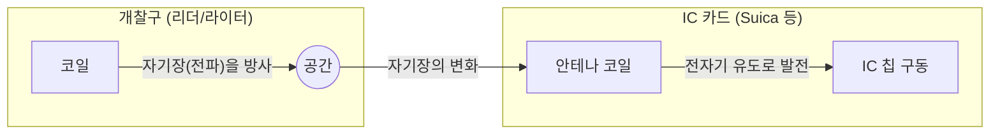

## 1. 배터리가 없는데 왜 작동할까?

우리가 매일 당연하게 사용하는 교통계 IC 카드(Suica, PASMO 등)나 사원증. 이것들을 개찰구나 리더기에 '삑' 하고 대기만 하면 순식간에 데이터의 주고받기가 이루어집니다.

하지만 이상하게 생각한 적은 없으신가요?
**"IC 카드 안에는 배터리가 들어있지 않은데, 어떻게 내부의 컴퓨터(IC 칩)를 구동하고 무선 통신을 하고 있는 걸까?"**

이 마법 같은 현상의 정체는 '**RFID(Radio Frequency Identification)**'라는 기술과 19세기에 발견된 '**전자기 유도**'라는 물리 법칙에 있습니다.

## 2. 전자기 유도: 자기장의 변화가 전기를 만들어 낸다

IC 카드가 배터리 없이 작동하는 이유를 이해하기 위해서는 영국의 물리학자 마이클 패러데이가 1831년에 발견한 '패러데이의 전자기 유도 법칙'을 알 필요가 있습니다.

전자기 유도란 **"코일(빙글빙글 감은 도선) 속을 통과하는 자기장(자기력선)이 변화하면, 그 변화를 상쇄하기 위해 코일에 전류가 흐른다"** 는 현상입니다. 자전거의 타이어를 돌리면 불이 켜지는 발전기(다이나모)도 이 원리를 응용하고 있습니다.

IC 카드의 내부를 투시해 보면, 가장자리를 따라 몇 번이고 빙글빙글 도선이 감긴 '안테나 코일'과 아주 작은 'IC 칩'이 연결되어 있는 것을 알 수 있습니다.

개찰구(리더)에서는 항상 특정 주파수의 전파(자기장)가 방사되고 있습니다.
IC 카드가 개찰구에 가까워지면 카드 내의 안테나 코일을 꿰뚫는 자기장이 급격하게 변화합니다. 그러면 전자기 유도 법칙에 의해 카드의 코일에 '유도 전류'가 발생합니다.
**즉, IC 카드는 개찰구에서 날아오는 전파를 '전력'으로 변환하여, 순식간에 자신의 IC 칩을 구동시키고 있는 것입니다.**

## 3. 데이터의 송수신: 부하 변조라는 똑똑한 구조

전력을 얻어 IC 칩이 깨어나면, 다음은 데이터를 주고받을 차례입니다.
하지만 IC 카드 쪽에서는 강한 전파를 자력으로 발사할 만큼의 전력은 없습니다. 그래서 '**부하 변조(로드 모듈레이션)**'라는 매우 똑똑한 방법을 사용합니다.

IC 카드가 자신의 회로 저항(부하)을 세밀하게 ON/OFF하여 변화시키면, 리더 쪽에서 방사하는 전파에 미묘한 '파동의 교란'이 발생합니다.
비유하자면, 맞바람 속에서 상대방을 향해 큰 거울을 반짝반짝 반사시키거나 숨기거나 해서 모스 부호를 보내는 것과 같습니다. 리더 쪽은 자신이 발산한 전파가 반사되어 돌아올 때의 '약간의 교란'을 읽어냄으로써, IC 카드로부터의 데이터(잔액이나 ID 정보)를 수신하고 있는 것입니다.

## 4. RFID와 NFC의 차이

비접촉 통신 기술을 총칭하여 '**RFID**'라고 부릅니다. 의류 매장의 계산대에서 바구니에 담은 옷의 태그를 순식간에 일괄 판독하는 시스템 등도 RFID의 일종입니다(UHF 대역을 이용해 수 미터의 장거리 통신이 가능).

반면, 우리가 사용하고 있는 Suica나 스마트폰의 모바일 결제 기능은 RFID 중의 '**NFC(Near Field Communication)**'라는 규격에 기반하고 있습니다.

NFC는 주파수 '13.56MHz'를 이용하며, 통신 거리를 굳이 '10센티미터 정도(Near Field)'로 제한한 규격입니다.
왜 단거리로 제한했을까요? 그것은 '보안'과 '확실성' 때문입니다.
개찰구를 통과할 때, 1미터 앞의 다른 사람 카드의 잔액을 읽어버리면 곤란합니다. '물리적으로 터치한다(가까이 댄다)'라는 인간의 직관적인 동작과 통신 범위를 일치시킴으로써 확실한 1대1 통신을 실현하고 있는 것입니다.

## 5. FeliCa(펠리카): 세계에서 가장 빠른 개찰구를 지탱하는 일본의 기술

NFC 규격 안에는 몇 가지 종류(Type-A, Type-B 등)가 있습니다만, 일본의 교통망이나 전자 화폐를 지탱하고 있는 것은 소니가 개발한 '**FeliCa(Type-F)**'라는 규격입니다.

FeliCa의 가장 큰 특징은 '**압도적인 처리 속도**'입니다.
일본 만원 전철의 개찰구는 세계에서도 유례를 찾아볼 수 없을 정도로 가혹한 환경입니다. 1분에 수십 명이 멈춰 서지 않고 통과하기 위해서는 카드를 대고 나서 "암호 처리, 잔액 확인, 인출, 개찰구 게이트를 여는 판정"까지의 모든 과정을 **"약 0.1초(100밀리초)"** 이내에 완료할 필요가 있었습니다.

Type-A나 B의 규격이 처리에 0.5초 정도 걸리는 데 반해, FeliCa는 데이터의 구조를 극한까지 경량화하고 암호 처리와 파일 읽고 쓰기를 병행해서 수행하는 독자적인 아키텍처를 채택함으로써 이 '0.1초의 벽'을 돌파했습니다. 우리가 개찰구를 멈추지 않고 걸어갈 수 있는 것은 이 고도의 일본발 기술 튜닝 덕분인 것입니다.

## 6. 요약: 공간을 전달하는 에너지와 정보

'삑' 하는 불과 0.1초의 접촉.
그 순간 개찰구에서 방출된 눈에 보이지 않는 자기장이 카드의 코일을 꿰뚫고, 패러데이의 물리 법칙에 따라 전력을 만들어내어 깨어난 IC 칩이 고도의 암호 계산을 수행하며, 다시 공간의 파동을 흔들어 데이터를 반환하고 있습니다.

NFC와 FeliCa 기술은 물리학(전자기학)과 정보공학(암호와 통신)이 가장 아름답게 융합된 현대 사회의 걸작이라고 할 수 있을 것입니다.
