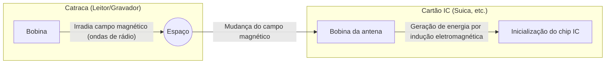

## 1. Como funciona sem bateria?

Cartões de transporte público (como Suica e PASMO) e crachás de empresas que usamos naturalmente todos os dias. Apenas encostando-os com um "bip" no leitor ou catraca, a troca de dados acontece instantaneamente.

Mas você já se perguntou?
**"Como o computador interno (chip IC) do cartão liga e se comunica sem fio, se ele não tem bateria?"**

A verdadeira identidade desse fenômeno mágico está na tecnologia chamada "**RFID (Radio Frequency Identification)**" e na lei da física descoberta no século XIX, a "**indução eletromagnética**".

## 2. Indução Eletromagnética: A mudança no campo magnético gera eletricidade

Para entender por que um cartão IC funciona sem bateria, é preciso conhecer a "Lei da Indução Eletromagnética de Faraday", descoberta pelo físico britânico Michael Faraday em 1831.

A indução eletromagnética é o fenômeno onde **"quando o campo magnético (linhas de força magnética) que passa por uma bobina (fio enrolado várias vezes) sofre uma mudança, uma corrente flui pela bobina para tentar anular essa mudança"**. Os dínamos (geradores) que acendem a luz quando a roda da bicicleta gira também aplicam esse princípio.

Se olharmos através do interior do cartão IC, podemos ver uma "bobina de antena" (fio enrolado várias vezes ao longo das bordas) conectada a um minúsculo "chip IC".

A catraca (leitor) irradia constantemente ondas de rádio (campos magnéticos) de uma frequência específica.
Quando o cartão IC se aproxima da catraca, o campo magnético que atravessa a bobina da antena dentro do cartão muda drasticamente. Então, de acordo com a lei da indução eletromagnética, uma "corrente induzida" é gerada na bobina do cartão.
**Ou seja, o cartão IC converte as ondas de rádio emitidas pela catraca em "energia elétrica", inicializando seu próprio chip IC por apenas um instante.**

## 3. Transmissão e Recebimento de Dados: O mecanismo inteligente da modulação de carga

Uma vez que o chip IC acorda ao obter energia, o próximo passo é a troca de dados.
No entanto, o cartão IC não possui energia suficiente para emitir ondas de rádio fortes por conta própria. É aí que um método muito inteligente chamado "**modulação de carga (load modulation)**" é usado.

Quando o cartão IC altera minuciosamente a resistência (carga) do seu próprio circuito, ligando e desligando (ON/OFF), isso cria uma sutil "perturbação nas ondas" de rádio emitidas pelo leitor.
Para usar uma analogia, é como enviar um sinal Morse piscando um grande espelho em direção a outra pessoa contra o vento. O leitor lê essa "pequena perturbação" quando as ondas de rádio que ele mesmo emitiu retornam refletidas, recebendo assim os dados (saldo ou informações de ID) do cartão IC.

## 4. A Diferença entre RFID e NFC

As tecnologias de comunicação sem contato são chamadas coletivamente de "**RFID**". O sistema de leitura instantânea e simultânea das etiquetas das roupas no caixa de uma loja de vestuário também é um tipo de RFID (utiliza a banda UHF, permitindo comunicação de longo alcance de vários metros).

Por outro lado, o Suica ou a carteira digital (Osaifu-Keitai) dos smartphones que usamos são baseados no padrão "**NFC (Near Field Communication)**", que faz parte do RFID.

O NFC utiliza a frequência "13.56MHz" e é um padrão com distância de comunicação intencionalmente limitada a "cerca de 10 centímetros (Near Field)".
Por que restringir a uma curta distância? Por "segurança" e "confiabilidade".
Seria problemático se, ao passar pela catraca, o saldo do cartão de outra pessoa a 1 metro de distância fosse lido. Ao alinhar a ação intuitiva humana de "tocar fisicamente (aproximar)" com o alcance da comunicação, garante-se uma comunicação 1-para-1 confiável.

## 5. FeliCa: A tecnologia japonesa que sustenta as catracas mais rápidas do mundo

Existem vários tipos no padrão NFC (Type-A, Type-B, etc.), mas o que sustenta a rede de transportes e o dinheiro eletrônico no Japão é o padrão "**FeliCa (Type-F)**", desenvolvido pela Sony.

A maior característica do FeliCa é a sua "**esmagadora velocidade de processamento**".
As catracas dos trens lotados no Japão são um ambiente severo, inigualável no mundo. Para que dezenas de pessoas passem por minuto sem parar, é necessário que, a partir do momento em que o cartão é encostado, tudo - "processamento criptográfico, verificação de saldo, débito e a decisão de abrir a porta da catraca" - seja concluído em **"cerca de 0,1 segundo (100 milissegundos)"**.

Enquanto os padrões Type-A e B levam cerca de 0,5 segundos para processar, o FeliCa rompeu essa "barreira de 0,1 segundo" simplificando ao máximo a estrutura de dados e adotando uma arquitetura única que realiza o processamento criptográfico e a leitura/gravação de arquivos em paralelo. O fato de podermos caminhar pela catraca sem parar se deve a esse ajuste técnico altamente avançado originário do Japão.

## 6. Conclusão: Energia e informação transmitidas através do espaço

O contato "bip" de apenas 0,1 segundo.
Nesse momento, o campo magnético invisível emitido pela catraca atravessa a bobina do cartão, gera energia de acordo com a lei da física de Faraday, e o chip IC despertado realiza cálculos criptográficos avançados, alterando novamente as ondas do espaço para devolver os dados.

Pode-se dizer que a tecnologia NFC e FeliCa é uma das obras-primas da sociedade moderna, onde a física (eletromagnetismo) e a engenharia da informação (criptografia e comunicação) se fundem da maneira mais bela.
