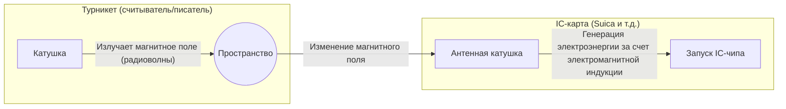

## 1. Как это работает без батарейки?

Транспортные IC-карты (например, Suica, PASMO) и пропуска сотрудников, которыми мы привыкли пользоваться каждый день. Просто приложив их к турникету или считывателю со звуком «пип», происходит мгновенный обмен данными.

Однако, не задумывались ли вы:
**«Внутри IC-карты нет батарейки, так как же запускается внутренний компьютер (IC-чип) и осуществляется беспроводная связь?»**

Секрет этого волшебного явления кроется в технологии **RFID (Radio Frequency Identification)** и физическом законе **электромагнитной индукции**, открытом в 19 веке.

## 2. Электромагнитная индукция: изменение магнитного поля создает электричество

Чтобы понять, почему IC-карта работает без батарейки, необходимо знать «закон электромагнитной индукции Фарадея», открытый английским физиком Майклом Фарадеем в 1831 году.

Электромагнитная индукция — это явление, при котором **«когда магнитное поле (силовые линии магнитного поля), проходящее через катушку (намотанный проводник), изменяется, в катушке начинает течь ток в попытке компенсировать это изменение»**. Генератор (динамо), который включает свет при вращении колеса велосипеда, также использует этот принцип.

Если заглянуть внутрь IC-карты, можно увидеть «антенную катушку», представляющую собой проводник, намотанный во много витков вдоль края, соединенный с крошечным «IC-чипом».

Турникет (считыватель) постоянно излучает радиоволны (магнитное поле) определенной частоты.
Когда IC-карта приближается к турникету, магнитное поле, пронизывающее антенную катушку внутри карты, резко изменяется. В результате по закону электромагнитной индукции в катушке карты возникает «индукционный ток».
**Иными словами, IC-карта преобразует радиоволны, исходящие от турникета, в «электроэнергию» и на мгновение запускает свой собственный IC-чип.**

## 3. Передача и прием данных: умный механизм нагрузочной модуляции

Как только IC-чип просыпается, получив питание, следующим шагом является обмен данными.
Однако IC-карте не хватает энергии для самостоятельного излучения сильных радиоволн. Поэтому используется очень умный метод, называемый **нагрузочной модуляцией (load modulation)**.

Когда IC-карта плавно включает и выключает сопротивление (нагрузку) своей собственной цепи, она создает тонкие «возмущения волны» в радиоволнах, излучаемых считывателем.
Для сравнения, это похоже на отправку сигнала азбукой Морзе, когда вы направляете большое зеркало на кого-то против встречного ветра, сверкая им или пряча его. Считыватель принимает данные (баланс и идентификационную информацию) от IC-карты, считывая «небольшие возмущения» при отражении собственных радиоволн.

## 4. Разница между RFID и NFC

Технологии бесконтактной связи в совокупности называются **RFID**. Системы на кассах в магазинах одежды, которые мгновенно считывают все бирки на одежде в корзине, также являются типом RFID (используют УВЧ-диапазон и позволяют осуществлять связь на больших расстояниях в несколько метров).

С другой стороны, Suica и мобильные кошельки в наших смартфонах основаны на стандарте **NFC (Near Field Communication)**, который является частью RFID.

NFC — это стандарт, который использует частоту «13,56 МГц» и намеренно ограничивает расстояние связи примерно до «10 сантиметров (Ближнее поле — Near Field)».
Почему ограничено коротким расстоянием? Это сделано ради «безопасности» и «надежности».
Было бы проблематично, если бы при проходе через турникет считывался баланс чужой карты, находящейся в метре от вас. Сопоставив интуитивно понятное действие человека — «физическое прикосновение (приближение)» — с диапазоном связи, достигается надежная связь один на один.

## 5. FeliCa: японская технология, стоящая за самыми быстрыми в мире турникетами

Существует несколько типов стандартов NFC (Type-A, Type-B и т.д.), но японские транспортные сети и электронные деньги поддерживаются стандартом **FeliCa (Type-F)**, разработанным компанией Sony.

Самой главной особенностью FeliCa является ее **потрясающая скорость обработки данных**.
Турникеты переполненных японских поездов работают в суровых условиях, не имеющих аналогов в мире. Для того чтобы десятки людей могли пройти в минуту без остановки, все от прикладывания карты до «криптографической обработки, проверки баланса, списания средств и принятия решения об открытии ворот турникета» должно быть завершено в пределах **«около 0,1 секунды (100 миллисекунд)»**.

В то время как на обработку стандартов Type-A или B уходит около 0,5 секунд, FeliCa преодолела этот «барьер в 0,1 секунды», максимально облегчив структуру данных и внедрив уникальную архитектуру, в которой криптографическая обработка и чтение/запись файлов выполняются параллельно. Именно благодаря этой передовой японской технологической настройке мы можем проходить через турникеты без остановок.

## 6. Заключение: энергия и информация, передаваемые через пространство

Мимолетный контакт со звуком «пип», длящийся всего 0,1 секунды.
В этот момент невидимое магнитное поле, излучаемое турникетом, пронизывает катушку карты, генерируя электричество в соответствии с законами физики Фарадея, а проснувшийся IC-чип выполняет сложные криптографические вычисления и снова возмущает волны в пространстве для возврата данных.

Технологии NFC и FeliCa можно назвать шедевром современного общества, в котором физика (электромагнетизм) и информатика (криптография и связь) наиболее красиво слились воедино.
