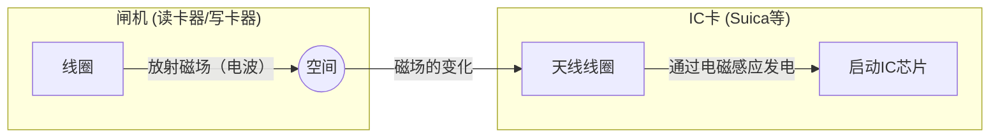

## 1. 没有电池，为什么能运行？

我们每天理所当然地使用的交通IC卡（如Suica、PASMO等）或员工卡。只需将这些卡片在闸机或读卡器上“嘀”地刷一下，瞬间就能完成数据的交换。

但是，您有没有觉得不可思议呢？
**“IC卡里面明明没有电池，它是如何启动内部的计算机（IC芯片）并进行无线通信的呢？”**

这种如魔法般的现象，其真面目在于 **RFID（Radio Frequency Identification）** 这种技术，以及19世纪发现的 **电磁感应** 这一物理法则。

## 2. 电磁感应：磁场的变化产生电力

为了理解IC卡在没有电池的情况下也能运行的原因，我们需要了解英国物理学家迈克尔·法拉第在1831年发现的“法拉第电磁感应定律”。

电磁感应是指， **“当穿过线圈（缠绕数圈的导线）内部的磁场（磁力线）发生变化时，为了抵消这种变化，线圈中会产生电流”** 的现象。转动自行车轮胎就会亮灯的发电机（Dynamo），也是应用了这一原理。

如果透视IC卡的内部，您会发现沿着边缘缠绕了许多圈导线的“天线线圈”与极小的“IC芯片”连接在一起。

闸机（读卡器）会不断放射特定频率的电波（磁场）。
当IC卡靠近闸机时，穿过卡内天线线圈的磁场会发生急剧变化。于是根据电磁感应定律，卡片的线圈中会产生“感应电流”。
**也就是说，IC卡将从闸机飞来的电波转换为了“电力”，并在瞬间启动了自己的IC芯片。**

## 3. 数据的收发：负载调制这种聪明的机制

获得电力唤醒IC芯片后，接下来就是数据的交换了。
但是，IC卡端没有足够的电力来依靠自身发射强电波。因此，它使用了一种非常聪明的方法，叫做 **负载调制（Load Modulation）** 。

当IC卡细微地开启/关闭自身电路的电阻（负载）使其发生变化时，读卡器端放射出的电波就会产生微妙的“波动紊乱”。
打个比方，这就好比在迎风的环境中，用一面大镜子对着对方一闪一闪地反射或遮挡光线来发送摩尔斯电码。读卡器端通过读取自己发出的电波反射回来时的“微小紊乱”，就能接收到来自IC卡的数据（余额和ID信息）。

## 4. RFID与NFC的区别

非接触式通信技术统称为 **RFID** 。在服装店的收银台，瞬间一次性读取篮子里衣服标签的系统等，也是RFID的一种（利用UHF频段，可进行数米远的长距离通信）。

另一方面，我们使用的Suica和智能手机的手机钱包，是基于RFID中的 **NFC（Near Field Communication）** 标准。

NFC利用“13.56MHz”的频率，并刻意将通信距离限制在“10厘米左右（Near Field）”的标准。
为什么要限制在短距离内呢？那是为了“安全性”和“可靠性”。
在通过闸机时，如果读取到了1米外别人卡里的余额可就麻烦了。通过将“物理接触（靠近）”这种人类直觉性的动作与通信范围保持一致，从而实现了可靠的一对一通信。

## 5. FeliCa：支撑世界最快闸机的日本技术

NFC标准中有几种类型（Type-A、Type-B等），而支撑着日本交通网络和电子货币的，是索尼开发的 **FeliCa（Type-F）** 标准。

FeliCa最大的特点是 **压倒性的处理速度** 。
日本满载乘客的电车闸机，是世界上绝无仅有的严苛环境。为了让一分钟内数十人能够不停步地通过，从刷卡到“加密处理、确认余额、扣款、判定打开闸机门”的所有过程，都必须在 **约0.1秒（100毫秒）** 内完成。

Type-A或B的标准处理大约需要0.5秒，而FeliCa将数据结构轻量化到了极致，并采用了并行进行加密处理和文件读写的独特架构，从而突破了这“0.1秒的壁垒”。我们能够在闸机前不停步地走过，正是多亏了这项源自日本的高级技术调优。

## 6. 总结：在空间中传递的能量与信息

“嘀”的一声，仅0.1秒的接触。
在那一瞬间，从闸机放射出的肉眼看不见的磁场穿透卡片的线圈，遵循法拉第的物理法则产生电力，苏醒的IC芯片进行高级的加密计算，再次摇动空间的波浪将数据返回。

NFC和FeliCa的技术，可以说是物理学（电磁学）与信息工程（加密和通信）最完美融合的现代社会的杰作。
