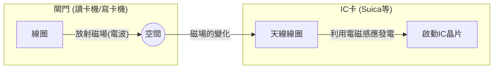

## 1. 裡面沒有電池，為什麼還能運作？

我們每天習以為常使用的交通IC卡（如Suica、PASMO等）或員工識別證。只要將這些卡片在閘門或讀卡機前「嗶」一聲感應，就能在瞬間完成資料的交換。

但是，您是否曾感到好奇？
**「明明IC卡裡面沒有裝電池，究竟是如何啟動內部的電腦（IC晶片），並進行無線通訊的呢？」**

這個宛如魔法般現象的真面目，在於名為「 **RFID（Radio Frequency Identification）** 」的技術，以及19世紀所發現的「 **電磁感應** 」物理定律。

## 2. 電磁感應：磁場的變化會產生電

為了理解IC卡為何在沒有電池的情況下也能運作，我們需要先認識英國物理學家麥可・法拉第（Michael Faraday）於1831年發現的「法拉第電磁感應定律」。

所謂電磁感應，是指 **「當穿過線圈（一圈圈纏繞的導線）內部的磁場（磁力線）發生變化時，為了抵銷該變化，線圈上會產生電流」** 的現象。轉動自行車輪胎就能讓車燈亮起的發電機（Dynamo），也是應用了這個原理。

透視IC卡的內部，可以看到沿著邊緣繞了許多圈導線的「天線線圈」，以及一個極小的「IC晶片」相連在一起。

閘門（讀卡機）會持續放射出特定頻率的電波（磁場）。
當IC卡靠近閘門時，穿過卡片內天線線圈的磁場會發生急遽變化。接著根據電磁感應定律，卡片的線圈就會產生「感應電流」。
**也就是說，IC卡將閘門發出的電波轉換成「電力」，在瞬間啟動了自己的IC晶片。**

## 3. 資料的收發：稱為負載調變的聰明機制

獲得電力並喚醒IC晶片後，接下來就是交換資料了。
然而，IC卡端並沒有足夠的電力能自行發射出強烈的電波。因此，它使用了一種稱為「 **負載調變（Load Modulation）** 」的絕妙方法。

當IC卡細微地開啟（ON）和關閉（OFF）自身電路的電阻（負載）來產生變化時，會使讀卡機端放射出來的電波產生微妙的「波形擾動」。
打個比方，這就像是在逆風中面向對方，透過不斷閃爍反射或隱藏大鏡子來發送摩斯密碼一樣。讀卡機端藉由讀取自己發出的電波反射回來時的「微小擾動」，來接收來自IC卡的資料（餘額或ID資訊）。

## 4. RFID與NFC的差異

非接觸式通訊技術總稱為「 **RFID** 」。服飾店收銀台能在一瞬間將購物籃內衣服標籤一次全部讀取的系統，也是RFID的一種（利用UHF頻段，可進行數公尺的長距離通訊）。

另一方面，我們所使用的Suica或智慧型手機的行動支付，則是基於RFID之中的「 **NFC（Near Field Communication）** 」規格。

NFC是利用「13.56MHz」頻率，並刻意將通訊距離限制在「約10公分（Near Field）」的規格。
為什麼要限制在短距離呢？那是為了「安全性」與「確實性」。
在通過閘門時，如果讀取到1公尺外其他人的卡片餘額就麻煩了。藉由將「物理上的碰觸（靠近）」這個人類直覺式的動作，與通訊範圍保持一致，便能實現確實的1對1通訊。

## 5. FeliCa：支撐世界最快閘門的日本技術

NFC規格中包含了幾種類型（Type-A、Type-B等），而支撐日本交通網與電子錢包的，是Sony所開發的名為「 **FeliCa（Type-F）** 」的規格。

FeliCa最大的特徵在於「 **壓倒性的處理速度** 」。
日本滿載電車的閘門，是世界上絕無僅有的嚴苛環境。為了讓每分鐘數十人能夠不停下腳步順利通過，從感應卡片開始到「加密處理、餘額確認、扣款、判斷是否開啟閘門」的所有步驟，都必須在 **「約0.1秒（100毫秒）」** 以內完成。

相對於Type-A或B的規格需要花費約0.5秒的處理時間，FeliCa將資料結構輕量化至極限，並採用同時進行加密處理與檔案讀寫的獨特架構，成功突破了這道「0.1秒之壁」。我們能夠毫不停留地走過閘門，全都歸功於這項源自日本的高度技術調校。

## 6. 總結：在空間中傳遞的能量與資訊

「嗶」一聲僅僅0.1秒的接觸。
在那一瞬間，閘門發出的無形磁場穿過了卡片的線圈，遵循著法拉第的物理定律產生電力，喚醒後的IC晶片便進行高度的加密計算，再次擾動空間中的波來回傳資料。

NFC與FeliCa的技術，可以說是物理學（電磁學）與資訊工程學（加密與通訊）最完美融合的現代社會傑作吧。
