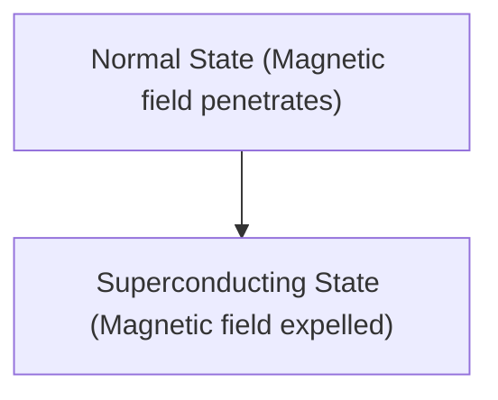

# الفيزياء: كيف تعمل الموصلية الفائقة

الموصلية الفائقة هي ظاهرة تصبح فيها المقاومة الكهربائية صفراً.

## تأثير مايسنر

## معادلة لندن
$$ \nabla \times \mathbf{J} = -\frac{n_s e^2}{m} \mathbf{B} $$

## جزء التحقق الفني الإضافي 1

يتعمق هذا القسم في مزيد من التفاصيل الفنية ودراسات الحالة. نقوم بتقييم الأداء في ظل ظروف مختلفة واستكشاف التحديات والحلول المتعلقة بالتكامل مع الأنظمة الأخرى. كما نناقش الآفاق المستقبلية والقيود.

