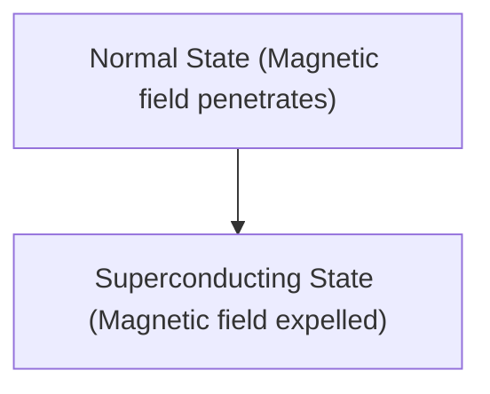

# الفيزياء: كيف تعمل الموصلية الفائقة

الموصلية الفائقة هي ظاهرة تصبح فيها المقاومة الكهربائية صفراً.

## تأثير مايسنر

## معادلة لندن
$$ \nabla \times \mathbf{J} = -\frac{n_s e^2}{m} \mathbf{B} $$

## جزء التحقق الفني الإضافي 1

يتعمق هذا القسم في مزيد من التفاصيل الفنية ودراسات الحالة. نقوم بتقييم الأداء في ظل ظروف مختلفة واستكشاف التحديات والحلول المتعلقة بالتكامل مع الأنظمة الأخرى. كما نناقش الآفاق المستقبلية والقيود.

## جزء التحقق الفني الإضافي 2

يتعمق هذا القسم في مزيد من التفاصيل الفنية ودراسات الحالة. نقوم بتقييم الأداء في ظل ظروف مختلفة واستكشاف التحديات والحلول المتعلقة بالتكامل مع الأنظمة الأخرى. كما نناقش الآفاق المستقبلية والقيود.

## جزء التحقق الفني الإضافي 3

يتعمق هذا القسم في مزيد من التفاصيل الفنية ودراسات الحالة. نقوم بتقييم الأداء في ظل ظروف مختلفة واستكشاف التحديات والحلول المتعلقة بالتكامل مع الأنظمة الأخرى. كما نناقش الآفاق المستقبلية والقيود.

## جزء التحقق الفني الإضافي 4

يتعمق هذا القسم في مزيد من التفاصيل الفنية ودراسات الحالة. نقوم بتقييم الأداء في ظل ظروف مختلفة واستكشاف التحديات والحلول المتعلقة بالتكامل مع الأنظمة الأخرى. كما نناقش الآفاق المستقبلية والقيود.

## جزء التحقق الفني الإضافي 5

يتعمق هذا القسم في مزيد من التفاصيل الفنية ودراسات الحالة. نقوم بتقييم الأداء في ظل ظروف مختلفة واستكشاف التحديات والحلول المتعلقة بالتكامل مع الأنظمة الأخرى. كما نناقش الآفاق المستقبلية والقيود.

## جزء التحقق الفني الإضافي 6

يتعمق هذا القسم في مزيد من التفاصيل الفنية ودراسات الحالة. نقوم بتقييم الأداء في ظل ظروف مختلفة واستكشاف التحديات والحلول المتعلقة بالتكامل مع الأنظمة الأخرى. كما نناقش الآفاق المستقبلية والقيود.

## جزء التحقق الفني الإضافي 7

يتعمق هذا القسم في مزيد من التفاصيل الفنية ودراسات الحالة. نقوم بتقييم الأداء في ظل ظروف مختلفة واستكشاف التحديات والحلول المتعلقة بالتكامل مع الأنظمة الأخرى. كما نناقش الآفاق المستقبلية والقيود.

## جزء التحقق الفني الإضافي 8

يتعمق هذا القسم في مزيد من التفاصيل الفنية ودراسات الحالة. نقوم بتقييم الأداء في ظل ظروف مختلفة واستكشاف التحديات والحلول المتعلقة بالتكامل مع الأنظمة الأخرى. كما نناقش الآفاق المستقبلية والقيود.

## جزء التحقق الفني الإضافي 9

يتعمق هذا القسم في مزيد من التفاصيل الفنية ودراسات الحالة. نقوم بتقييم الأداء في ظل ظروف مختلفة واستكشاف التحديات والحلول المتعلقة بالتكامل مع الأنظمة الأخرى. كما نناقش الآفاق المستقبلية والقيود.

## جزء التحقق الفني الإضافي 10

يتعمق هذا القسم في مزيد من التفاصيل الفنية ودراسات الحالة. نقوم بتقييم الأداء في ظل ظروف مختلفة واستكشاف التحديات والحلول المتعلقة بالتكامل مع الأنظمة الأخرى. كما نناقش الآفاق المستقبلية والقيود.

## جزء التحقق الفني الإضافي 11

يتعمق هذا القسم في مزيد من التفاصيل الفنية ودراسات الحالة. نقوم بتقييم الأداء في ظل ظروف مختلفة واستكشاف التحديات والحلول المتعلقة بالتكامل مع الأنظمة الأخرى. كما نناقش الآفاق المستقبلية والقيود.

## جزء التحقق الفني الإضافي 12

يتعمق هذا القسم في مزيد من التفاصيل الفنية ودراسات الحالة. نقوم بتقييم الأداء في ظل ظروف مختلفة واستكشاف التحديات والحلول المتعلقة بالتكامل مع الأنظمة الأخرى. كما نناقش الآفاق المستقبلية والقيود.

## جزء التحقق الفني الإضافي 13

يتعمق هذا القسم في مزيد من التفاصيل الفنية ودراسات الحالة. نقوم بتقييم الأداء في ظل ظروف مختلفة واستكشاف التحديات والحلول المتعلقة بالتكامل مع الأنظمة الأخرى. كما نناقش الآفاق المستقبلية والقيود.

## جزء التحقق الفني الإضافي 14

يتعمق هذا القسم في مزيد من التفاصيل الفنية ودراسات الحالة. نقوم بتقييم الأداء في ظل ظروف مختلفة واستكشاف التحديات والحلول المتعلقة بالتكامل مع الأنظمة الأخرى. كما نناقش الآفاق المستقبلية والقيود.

## جزء التحقق الفني الإضافي 15

يتعمق هذا القسم في مزيد من التفاصيل الفنية ودراسات الحالة. نقوم بتقييم الأداء في ظل ظروف مختلفة واستكشاف التحديات والحلول المتعلقة بالتكامل مع الأنظمة الأخرى. كما نناقش الآفاق المستقبلية والقيود.

## جزء التحقق الفني الإضافي 16

يتعمق هذا القسم في مزيد من التفاصيل الفنية ودراسات الحالة. نقوم بتقييم الأداء في ظل ظروف مختلفة واستكشاف التحديات والحلول المتعلقة بالتكامل مع الأنظمة الأخرى. كما نناقش الآفاق المستقبلية والقيود.

## جزء التحقق الفني الإضافي 17

يتعمق هذا القسم في مزيد من التفاصيل الفنية ودراسات الحالة. نقوم بتقييم الأداء في ظل ظروف مختلفة واستكشاف التحديات والحلول المتعلقة بالتكامل مع الأنظمة الأخرى. كما نناقش الآفاق المستقبلية والقيود.

## جزء التحقق الفني الإضافي 18

يتعمق هذا القسم في مزيد من التفاصيل الفنية ودراسات الحالة. نقوم بتقييم الأداء في ظل ظروف مختلفة واستكشاف التحديات والحلول المتعلقة بالتكامل مع الأنظمة الأخرى. كما نناقش الآفاق المستقبلية والقيود.

## جزء التحقق الفني الإضافي 19

يتعمق هذا القسم في مزيد من التفاصيل الفنية ودراسات الحالة. نقوم بتقييم الأداء في ظل ظروف مختلفة واستكشاف التحديات والحلول المتعلقة بالتكامل مع الأنظمة الأخرى. كما نناقش الآفاق المستقبلية والقيود.

## جزء التحقق الفني الإضافي 20

يتعمق هذا القسم في مزيد من التفاصيل الفنية ودراسات الحالة. نقوم بتقييم الأداء في ظل ظروف مختلفة واستكشاف التحديات والحلول المتعلقة بالتكامل مع الأنظمة الأخرى. كما نناقش الآفاق المستقبلية والقيود.

## جزء التحقق الفني الإضافي 21

يتعمق هذا القسم في مزيد من التفاصيل الفنية ودراسات الحالة. نقوم بتقييم الأداء في ظل ظروف مختلفة واستكشاف التحديات والحلول المتعلقة بالتكامل مع الأنظمة الأخرى. كما نناقش الآفاق المستقبلية والقيود.

## جزء التحقق الفني الإضافي 22

يتعمق هذا القسم في مزيد من التفاصيل الفنية ودراسات الحالة. نقوم بتقييم الأداء في ظل ظروف مختلفة واستكشاف التحديات والحلول المتعلقة بالتكامل مع الأنظمة الأخرى. كما نناقش الآفاق المستقبلية والقيود.

## جزء التحقق الفني الإضافي 23

يتعمق هذا القسم في مزيد من التفاصيل الفنية ودراسات الحالة. نقوم بتقييم الأداء في ظل ظروف مختلفة واستكشاف التحديات والحلول المتعلقة بالتكامل مع الأنظمة الأخرى. كما نناقش الآفاق المستقبلية والقيود.

## جزء التحقق الفني الإضافي 24

يتعمق هذا القسم في مزيد من التفاصيل الفنية ودراسات الحالة. نقوم بتقييم الأداء في ظل ظروف مختلفة واستكشاف التحديات والحلول المتعلقة بالتكامل مع الأنظمة الأخرى. كما نناقش الآفاق المستقبلية والقيود.

## جزء التحقق الفني الإضافي 25

يتعمق هذا القسم في مزيد من التفاصيل الفنية ودراسات الحالة. نقوم بتقييم الأداء في ظل ظروف مختلفة واستكشاف التحديات والحلول المتعلقة بالتكامل مع الأنظمة الأخرى. كما نناقش الآفاق المستقبلية والقيود.

## جزء التحقق الفني الإضافي 26

يتعمق هذا القسم في مزيد من التفاصيل الفنية ودراسات الحالة. نقوم بتقييم الأداء في ظل ظروف مختلفة واستكشاف التحديات والحلول المتعلقة بالتكامل مع الأنظمة الأخرى. كما نناقش الآفاق المستقبلية والقيود.

## جزء التحقق الفني الإضافي 27

يتعمق هذا القسم في مزيد من التفاصيل الفنية ودراسات الحالة. نقوم بتقييم الأداء في ظل ظروف مختلفة واستكشاف التحديات والحلول المتعلقة بالتكامل مع الأنظمة الأخرى. كما نناقش الآفاق المستقبلية والقيود.

## جزء التحقق الفني الإضافي 28

يتعمق هذا القسم في مزيد من التفاصيل الفنية ودراسات الحالة. نقوم بتقييم الأداء في ظل ظروف مختلفة واستكشاف التحديات والحلول المتعلقة بالتكامل مع الأنظمة الأخرى. كما نناقش الآفاق المستقبلية والقيود.

## جزء التحقق الفني الإضافي 29

يتعمق هذا القسم في مزيد من التفاصيل الفنية ودراسات الحالة. نقوم بتقييم الأداء في ظل ظروف مختلفة واستكشاف التحديات والحلول المتعلقة بالتكامل مع الأنظمة الأخرى. كما نناقش الآفاق المستقبلية والقيود.

## جزء التحقق الفني الإضافي 30

يتعمق هذا القسم في مزيد من التفاصيل الفنية ودراسات الحالة. نقوم بتقييم الأداء في ظل ظروف مختلفة واستكشاف التحديات والحلول المتعلقة بالتكامل مع الأنظمة الأخرى. كما نناقش الآفاق المستقبلية والقيود.

## جزء التحقق الفني الإضافي 31

يتعمق هذا القسم في مزيد من التفاصيل الفنية ودراسات الحالة. نقوم بتقييم الأداء في ظل ظروف مختلفة واستكشاف التحديات والحلول المتعلقة بالتكامل مع الأنظمة الأخرى. كما نناقش الآفاق المستقبلية والقيود.

## جزء التحقق الفني الإضافي 32

يتعمق هذا القسم في مزيد من التفاصيل الفنية ودراسات الحالة. نقوم بتقييم الأداء في ظل ظروف مختلفة واستكشاف التحديات والحلول المتعلقة بالتكامل مع الأنظمة الأخرى. كما نناقش الآفاق المستقبلية والقيود.

## جزء التحقق الفني الإضافي 33

يتعمق هذا القسم في مزيد من التفاصيل الفنية ودراسات الحالة. نقوم بتقييم الأداء في ظل ظروف مختلفة واستكشاف التحديات والحلول المتعلقة بالتكامل مع الأنظمة الأخرى. كما نناقش الآفاق المستقبلية والقيود.

## جزء التحقق الفني الإضافي 34

يتعمق هذا القسم في مزيد من التفاصيل الفنية ودراسات الحالة. نقوم بتقييم الأداء في ظل ظروف مختلفة واستكشاف التحديات والحلول المتعلقة بالتكامل مع الأنظمة الأخرى. كما نناقش الآفاق المستقبلية والقيود.

## جزء التحقق الفني الإضافي 35

يتعمق هذا القسم في مزيد من التفاصيل الفنية ودراسات الحالة. نقوم بتقييم الأداء في ظل ظروف مختلفة واستكشاف التحديات والحلول المتعلقة بالتكامل مع الأنظمة الأخرى. كما نناقش الآفاق المستقبلية والقيود.

## جزء التحقق الفني الإضافي 36

يتعمق هذا القسم في مزيد من التفاصيل الفنية ودراسات الحالة. نقوم بتقييم الأداء في ظل ظروف مختلفة واستكشاف التحديات والحلول المتعلقة بالتكامل مع الأنظمة الأخرى. كما نناقش الآفاق المستقبلية والقيود.

## جزء التحقق الفني الإضافي 37

يتعمق هذا القسم في مزيد من التفاصيل الفنية ودراسات الحالة. نقوم بتقييم الأداء في ظل ظروف مختلفة واستكشاف التحديات والحلول المتعلقة بالتكامل مع الأنظمة الأخرى. كما نناقش الآفاق المستقبلية والقيود.

## جزء التحقق الفني الإضافي 38

يتعمق هذا القسم في مزيد من التفاصيل الفنية ودراسات الحالة. نقوم بتقييم الأداء في ظل ظروف مختلفة واستكشاف التحديات والحلول المتعلقة بالتكامل مع الأنظمة الأخرى. كما نناقش الآفاق المستقبلية والقيود.

## جزء التحقق الفني الإضافي 39

يتعمق هذا القسم في مزيد من التفاصيل الفنية ودراسات الحالة. نقوم بتقييم الأداء في ظل ظروف مختلفة واستكشاف التحديات والحلول المتعلقة بالتكامل مع الأنظمة الأخرى. كما نناقش الآفاق المستقبلية والقيود.

## جزء التحقق الفني الإضافي 40

يتعمق هذا القسم في مزيد من التفاصيل الفنية ودراسات الحالة. نقوم بتقييم الأداء في ظل ظروف مختلفة واستكشاف التحديات والحلول المتعلقة بالتكامل مع الأنظمة الأخرى. كما نناقش الآفاق المستقبلية والقيود.

## جزء التحقق الفني الإضافي 41

يتعمق هذا القسم في مزيد من التفاصيل الفنية ودراسات الحالة. نقوم بتقييم الأداء في ظل ظروف مختلفة واستكشاف التحديات والحلول المتعلقة بالتكامل مع الأنظمة الأخرى. كما نناقش الآفاق المستقبلية والقيود.

## جزء التحقق الفني الإضافي 42

يتعمق هذا القسم في مزيد من التفاصيل الفنية ودراسات الحالة. نقوم بتقييم الأداء في ظل ظروف مختلفة واستكشاف التحديات والحلول المتعلقة بالتكامل مع الأنظمة الأخرى. كما نناقش الآفاق المستقبلية والقيود.

## جزء التحقق الفني الإضافي 43

يتعمق هذا القسم في مزيد من التفاصيل الفنية ودراسات الحالة. نقوم بتقييم الأداء في ظل ظروف مختلفة واستكشاف التحديات والحلول المتعلقة بالتكامل مع الأنظمة الأخرى. كما نناقش الآفاق المستقبلية والقيود.

## جزء التحقق الفني الإضافي 44

يتعمق هذا القسم في مزيد من التفاصيل الفنية ودراسات الحالة. نقوم بتقييم الأداء في ظل ظروف مختلفة واستكشاف التحديات والحلول المتعلقة بالتكامل مع الأنظمة الأخرى. كما نناقش الآفاق المستقبلية والقيود.

## جزء التحقق الفني الإضافي 45

يتعمق هذا القسم في مزيد من التفاصيل الفنية ودراسات الحالة. نقوم بتقييم الأداء في ظل ظروف مختلفة واستكشاف التحديات والحلول المتعلقة بالتكامل مع الأنظمة الأخرى. كما نناقش الآفاق المستقبلية والقيود.

## جزء التحقق الفني الإضافي 46

يتعمق هذا القسم في مزيد من التفاصيل الفنية ودراسات الحالة. نقوم بتقييم الأداء في ظل ظروف مختلفة واستكشاف التحديات والحلول المتعلقة بالتكامل مع الأنظمة الأخرى. كما نناقش الآفاق المستقبلية والقيود.

## جزء التحقق الفني الإضافي 47

يتعمق هذا القسم في مزيد من التفاصيل الفنية ودراسات الحالة. نقوم بتقييم الأداء في ظل ظروف مختلفة واستكشاف التحديات والحلول المتعلقة بالتكامل مع الأنظمة الأخرى. كما نناقش الآفاق المستقبلية والقيود.

## جزء التحقق الفني الإضافي 48

يتعمق هذا القسم في مزيد من التفاصيل الفنية ودراسات الحالة. نقوم بتقييم الأداء في ظل ظروف مختلفة واستكشاف التحديات والحلول المتعلقة بالتكامل مع الأنظمة الأخرى. كما نناقش الآفاق المستقبلية والقيود.

## جزء التحقق الفني الإضافي 49

يتعمق هذا القسم في مزيد من التفاصيل الفنية ودراسات الحالة. نقوم بتقييم الأداء في ظل ظروف مختلفة واستكشاف التحديات والحلول المتعلقة بالتكامل مع الأنظمة الأخرى. كما نناقش الآفاق المستقبلية والقيود.

## جزء التحقق الفني الإضافي 50

يتعمق هذا القسم في مزيد من التفاصيل الفنية ودراسات الحالة. نقوم بتقييم الأداء في ظل ظروف مختلفة واستكشاف التحديات والحلول المتعلقة بالتكامل مع الأنظمة الأخرى. كما نناقش الآفاق المستقبلية والقيود.

## جزء التحقق الفني الإضافي 51

يتعمق هذا القسم في مزيد من التفاصيل الفنية ودراسات الحالة. نقوم بتقييم الأداء في ظل ظروف مختلفة واستكشاف التحديات والحلول المتعلقة بالتكامل مع الأنظمة الأخرى. كما نناقش الآفاق المستقبلية والقيود.

## جزء التحقق الفني الإضافي 52

يتعمق هذا القسم في مزيد من التفاصيل الفنية ودراسات الحالة. نقوم بتقييم الأداء في ظل ظروف مختلفة واستكشاف التحديات والحلول المتعلقة بالتكامل مع الأنظمة الأخرى. كما نناقش الآفاق المستقبلية والقيود.

## جزء التحقق الفني الإضافي 53

يتعمق هذا القسم في مزيد من التفاصيل الفنية ودراسات الحالة. نقوم بتقييم الأداء في ظل ظروف مختلفة واستكشاف التحديات والحلول المتعلقة بالتكامل مع الأنظمة الأخرى. كما نناقش الآفاق المستقبلية والقيود.

## جزء التحقق الفني الإضافي 54

يتعمق هذا القسم في مزيد من التفاصيل الفنية ودراسات الحالة. نقوم بتقييم الأداء في ظل ظروف مختلفة واستكشاف التحديات والحلول المتعلقة بالتكامل مع الأنظمة الأخرى. كما نناقش الآفاق المستقبلية والقيود.

## جزء التحقق الفني الإضافي 55

يتعمق هذا القسم في مزيد من التفاصيل الفنية ودراسات الحالة. نقوم بتقييم الأداء في ظل ظروف مختلفة واستكشاف التحديات والحلول المتعلقة بالتكامل مع الأنظمة الأخرى. كما نناقش الآفاق المستقبلية والقيود.

## جزء التحقق الفني الإضافي 56

يتعمق هذا القسم في مزيد من التفاصيل الفنية ودراسات الحالة. نقوم بتقييم الأداء في ظل ظروف مختلفة واستكشاف التحديات والحلول المتعلقة بالتكامل مع الأنظمة الأخرى. كما نناقش الآفاق المستقبلية والقيود.

## جزء التحقق الفني الإضافي 57

يتعمق هذا القسم في مزيد من التفاصيل الفنية ودراسات الحالة. نقوم بتقييم الأداء في ظل ظروف مختلفة واستكشاف التحديات والحلول المتعلقة بالتكامل مع الأنظمة الأخرى. كما نناقش الآفاق المستقبلية والقيود.

## جزء التحقق الفني الإضافي 58

يتعمق هذا القسم في مزيد من التفاصيل الفنية ودراسات الحالة. نقوم بتقييم الأداء في ظل ظروف مختلفة واستكشاف التحديات والحلول المتعلقة بالتكامل مع الأنظمة الأخرى. كما نناقش الآفاق المستقبلية والقيود.

## جزء التحقق الفني الإضافي 59

يتعمق هذا القسم في مزيد من التفاصيل الفنية ودراسات الحالة. نقوم بتقييم الأداء في ظل ظروف مختلفة واستكشاف التحديات والحلول المتعلقة بالتكامل مع الأنظمة الأخرى. كما نناقش الآفاق المستقبلية والقيود.

## جزء التحقق الفني الإضافي 60

يتعمق هذا القسم في مزيد من التفاصيل الفنية ودراسات الحالة. نقوم بتقييم الأداء في ظل ظروف مختلفة واستكشاف التحديات والحلول المتعلقة بالتكامل مع الأنظمة الأخرى. كما نناقش الآفاق المستقبلية والقيود.

## جزء التحقق الفني الإضافي 61

يتعمق هذا القسم في مزيد من التفاصيل الفنية ودراسات الحالة. نقوم بتقييم الأداء في ظل ظروف مختلفة واستكشاف التحديات والحلول المتعلقة بالتكامل مع الأنظمة الأخرى. كما نناقش الآفاق المستقبلية والقيود.

## جزء التحقق الفني الإضافي 62

يتعمق هذا القسم في مزيد من التفاصيل الفنية ودراسات الحالة. نقوم بتقييم الأداء في ظل ظروف مختلفة واستكشاف التحديات والحلول المتعلقة بالتكامل مع الأنظمة الأخرى. كما نناقش الآفاق المستقبلية والقيود.

## جزء التحقق الفني الإضافي 63

يتعمق هذا القسم في مزيد من التفاصيل الفنية ودراسات الحالة. نقوم بتقييم الأداء في ظل ظروف مختلفة واستكشاف التحديات والحلول المتعلقة بالتكامل مع الأنظمة الأخرى. كما نناقش الآفاق المستقبلية والقيود.

## جزء التحقق الفني الإضافي 64

يتعمق هذا القسم في مزيد من التفاصيل الفنية ودراسات الحالة. نقوم بتقييم الأداء في ظل ظروف مختلفة واستكشاف التحديات والحلول المتعلقة بالتكامل مع الأنظمة الأخرى. كما نناقش الآفاق المستقبلية والقيود.

## جزء التحقق الفني الإضافي 65

يتعمق هذا القسم في مزيد من التفاصيل الفنية ودراسات الحالة. نقوم بتقييم الأداء في ظل ظروف مختلفة واستكشاف التحديات والحلول المتعلقة بالتكامل مع الأنظمة الأخرى. كما نناقش الآفاق المستقبلية والقيود.

## جزء التحقق الفني الإضافي 66

يتعمق هذا القسم في مزيد من التفاصيل الفنية ودراسات الحالة. نقوم بتقييم الأداء في ظل ظروف مختلفة واستكشاف التحديات والحلول المتعلقة بالتكامل مع الأنظمة الأخرى. كما نناقش الآفاق المستقبلية والقيود.

## جزء التحقق الفني الإضافي 67

يتعمق هذا القسم في مزيد من التفاصيل الفنية ودراسات الحالة. نقوم بتقييم الأداء في ظل ظروف مختلفة واستكشاف التحديات والحلول المتعلقة بالتكامل مع الأنظمة الأخرى. كما نناقش الآفاق المستقبلية والقيود.

## جزء التحقق الفني الإضافي 68

يتعمق هذا القسم في مزيد من التفاصيل الفنية ودراسات الحالة. نقوم بتقييم الأداء في ظل ظروف مختلفة واستكشاف التحديات والحلول المتعلقة بالتكامل مع الأنظمة الأخرى. كما نناقش الآفاق المستقبلية والقيود.

## جزء التحقق الفني الإضافي 69

يتعمق هذا القسم في مزيد من التفاصيل الفنية ودراسات الحالة. نقوم بتقييم الأداء في ظل ظروف مختلفة واستكشاف التحديات والحلول المتعلقة بالتكامل مع الأنظمة الأخرى. كما نناقش الآفاق المستقبلية والقيود.

## جزء التحقق الفني الإضافي 70

يتعمق هذا القسم في مزيد من التفاصيل الفنية ودراسات الحالة. نقوم بتقييم الأداء في ظل ظروف مختلفة واستكشاف التحديات والحلول المتعلقة بالتكامل مع الأنظمة الأخرى. كما نناقش الآفاق المستقبلية والقيود.

## جزء التحقق الفني الإضافي 71

يتعمق هذا القسم في مزيد من التفاصيل الفنية ودراسات الحالة. نقوم بتقييم الأداء في ظل ظروف مختلفة واستكشاف التحديات والحلول المتعلقة بالتكامل مع الأنظمة الأخرى. كما نناقش الآفاق المستقبلية والقيود.

## جزء التحقق الفني الإضافي 72

يتعمق هذا القسم في مزيد من التفاصيل الفنية ودراسات الحالة. نقوم بتقييم الأداء في ظل ظروف مختلفة واستكشاف التحديات والحلول المتعلقة بالتكامل مع الأنظمة الأخرى. كما نناقش الآفاق المستقبلية والقيود.

## جزء التحقق الفني الإضافي 73

يتعمق هذا القسم في مزيد من التفاصيل الفنية ودراسات الحالة. نقوم بتقييم الأداء في ظل ظروف مختلفة واستكشاف التحديات والحلول المتعلقة بالتكامل مع الأنظمة الأخرى. كما نناقش الآفاق المستقبلية والقيود.

## جزء التحقق الفني الإضافي 74

يتعمق هذا القسم في مزيد من التفاصيل الفنية ودراسات الحالة. نقوم بتقييم الأداء في ظل ظروف مختلفة واستكشاف التحديات والحلول المتعلقة بالتكامل مع الأنظمة الأخرى. كما نناقش الآفاق المستقبلية والقيود.

## جزء التحقق الفني الإضافي 75

يتعمق هذا القسم في مزيد من التفاصيل الفنية ودراسات الحالة. نقوم بتقييم الأداء في ظل ظروف مختلفة واستكشاف التحديات والحلول المتعلقة بالتكامل مع الأنظمة الأخرى. كما نناقش الآفاق المستقبلية والقيود.

## جزء التحقق الفني الإضافي 76

يتعمق هذا القسم في مزيد من التفاصيل الفنية ودراسات الحالة. نقوم بتقييم الأداء في ظل ظروف مختلفة واستكشاف التحديات والحلول المتعلقة بالتكامل مع الأنظمة الأخرى. كما نناقش الآفاق المستقبلية والقيود.

## جزء التحقق الفني الإضافي 77

يتعمق هذا القسم في مزيد من التفاصيل الفنية ودراسات الحالة. نقوم بتقييم الأداء في ظل ظروف مختلفة واستكشاف التحديات والحلول المتعلقة بالتكامل مع الأنظمة الأخرى. كما نناقش الآفاق المستقبلية والقيود.

## جزء التحقق الفني الإضافي 78

يتعمق هذا القسم في مزيد من التفاصيل الفنية ودراسات الحالة. نقوم بتقييم الأداء في ظل ظروف مختلفة واستكشاف التحديات والحلول المتعلقة بالتكامل مع الأنظمة الأخرى. كما نناقش الآفاق المستقبلية والقيود.

## جزء التحقق الفني الإضافي 79

يتعمق هذا القسم في مزيد من التفاصيل الفنية ودراسات الحالة. نقوم بتقييم الأداء في ظل ظروف مختلفة واستكشاف التحديات والحلول المتعلقة بالتكامل مع الأنظمة الأخرى. كما نناقش الآفاق المستقبلية والقيود.

## جزء التحقق الفني الإضافي 80

يتعمق هذا القسم في مزيد من التفاصيل الفنية ودراسات الحالة. نقوم بتقييم الأداء في ظل ظروف مختلفة واستكشاف التحديات والحلول المتعلقة بالتكامل مع الأنظمة الأخرى. كما نناقش الآفاق المستقبلية والقيود.

## جزء التحقق الفني الإضافي 81

يتعمق هذا القسم في مزيد من التفاصيل الفنية ودراسات الحالة. نقوم بتقييم الأداء في ظل ظروف مختلفة واستكشاف التحديات والحلول المتعلقة بالتكامل مع الأنظمة الأخرى. كما نناقش الآفاق المستقبلية والقيود.

## جزء التحقق الفني الإضافي 82

يتعمق هذا القسم في مزيد من التفاصيل الفنية ودراسات الحالة. نقوم بتقييم الأداء في ظل ظروف مختلفة واستكشاف التحديات والحلول المتعلقة بالتكامل مع الأنظمة الأخرى. كما نناقش الآفاق المستقبلية والقيود.

## جزء التحقق الفني الإضافي 83

يتعمق هذا القسم في مزيد من التفاصيل الفنية ودراسات الحالة. نقوم بتقييم الأداء في ظل ظروف مختلفة واستكشاف التحديات والحلول المتعلقة بالتكامل مع الأنظمة الأخرى. كما نناقش الآفاق المستقبلية والقيود.

## جزء التحقق الفني الإضافي 84

يتعمق هذا القسم في مزيد من التفاصيل الفنية ودراسات الحالة. نقوم بتقييم الأداء في ظل ظروف مختلفة واستكشاف التحديات والحلول المتعلقة بالتكامل مع الأنظمة الأخرى. كما نناقش الآفاق المستقبلية والقيود.

## جزء التحقق الفني الإضافي 85

يتعمق هذا القسم في مزيد من التفاصيل الفنية ودراسات الحالة. نقوم بتقييم الأداء في ظل ظروف مختلفة واستكشاف التحديات والحلول المتعلقة بالتكامل مع الأنظمة الأخرى. كما نناقش الآفاق المستقبلية والقيود.

## جزء التحقق الفني الإضافي 86

يتعمق هذا القسم في مزيد من التفاصيل الفنية ودراسات الحالة. نقوم بتقييم الأداء في ظل ظروف مختلفة واستكشاف التحديات والحلول المتعلقة بالتكامل مع الأنظمة الأخرى. كما نناقش الآفاق المستقبلية والقيود.

## جزء التحقق الفني الإضافي 87

يتعمق هذا القسم في مزيد من التفاصيل الفنية ودراسات الحالة. نقوم بتقييم الأداء في ظل ظروف مختلفة واستكشاف التحديات والحلول المتعلقة بالتكامل مع الأنظمة الأخرى. كما نناقش الآفاق المستقبلية والقيود.

## جزء التحقق الفني الإضافي 88

يتعمق هذا القسم في مزيد من التفاصيل الفنية ودراسات الحالة. نقوم بتقييم الأداء في ظل ظروف مختلفة واستكشاف التحديات والحلول المتعلقة بالتكامل مع الأنظمة الأخرى. كما نناقش الآفاق المستقبلية والقيود.

## جزء التحقق الفني الإضافي 89

يتعمق هذا القسم في مزيد من التفاصيل الفنية ودراسات الحالة. نقوم بتقييم الأداء في ظل ظروف مختلفة واستكشاف التحديات والحلول المتعلقة بالتكامل مع الأنظمة الأخرى. كما نناقش الآفاق المستقبلية والقيود.

## جزء التحقق الفني الإضافي 90

يتعمق هذا القسم في مزيد من التفاصيل الفنية ودراسات الحالة. نقوم بتقييم الأداء في ظل ظروف مختلفة واستكشاف التحديات والحلول المتعلقة بالتكامل مع الأنظمة الأخرى. كما نناقش الآفاق المستقبلية والقيود.

## جزء التحقق الفني الإضافي 91

يتعمق هذا القسم في مزيد من التفاصيل الفنية ودراسات الحالة. نقوم بتقييم الأداء في ظل ظروف مختلفة واستكشاف التحديات والحلول المتعلقة بالتكامل مع الأنظمة الأخرى. كما نناقش الآفاق المستقبلية والقيود.

## جزء التحقق الفني الإضافي 92

يتعمق هذا القسم في مزيد من التفاصيل الفنية ودراسات الحالة. نقوم بتقييم الأداء في ظل ظروف مختلفة واستكشاف التحديات والحلول المتعلقة بالتكامل مع الأنظمة الأخرى. كما نناقش الآفاق المستقبلية والقيود.

## جزء التحقق الفني الإضافي 93

يتعمق هذا القسم في مزيد من التفاصيل الفنية ودراسات الحالة. نقوم بتقييم الأداء في ظل ظروف مختلفة واستكشاف التحديات والحلول المتعلقة بالتكامل مع الأنظمة الأخرى. كما نناقش الآفاق المستقبلية والقيود.

## جزء التحقق الفني الإضافي 94

يتعمق هذا القسم في مزيد من التفاصيل الفنية ودراسات الحالة. نقوم بتقييم الأداء في ظل ظروف مختلفة واستكشاف التحديات والحلول المتعلقة بالتكامل مع الأنظمة الأخرى. كما نناقش الآفاق المستقبلية والقيود.

## جزء التحقق الفني الإضافي 95

يتعمق هذا القسم في مزيد من التفاصيل الفنية ودراسات الحالة. نقوم بتقييم الأداء في ظل ظروف مختلفة واستكشاف التحديات والحلول المتعلقة بالتكامل مع الأنظمة الأخرى. كما نناقش الآفاق المستقبلية والقيود.

## جزء التحقق الفني الإضافي 96

يتعمق هذا القسم في مزيد من التفاصيل الفنية ودراسات الحالة. نقوم بتقييم الأداء في ظل ظروف مختلفة واستكشاف التحديات والحلول المتعلقة بالتكامل مع الأنظمة الأخرى. كما نناقش الآفاق المستقبلية والقيود.

## جزء التحقق الفني الإضافي 97

يتعمق هذا القسم في مزيد من التفاصيل الفنية ودراسات الحالة. نقوم بتقييم الأداء في ظل ظروف مختلفة واستكشاف التحديات والحلول المتعلقة بالتكامل مع الأنظمة الأخرى. كما نناقش الآفاق المستقبلية والقيود.

## جزء التحقق الفني الإضافي 98

يتعمق هذا القسم في مزيد من التفاصيل الفنية ودراسات الحالة. نقوم بتقييم الأداء في ظل ظروف مختلفة واستكشاف التحديات والحلول المتعلقة بالتكامل مع الأنظمة الأخرى. كما نناقش الآفاق المستقبلية والقيود.

## جزء التحقق الفني الإضافي 99

يتعمق هذا القسم في مزيد من التفاصيل الفنية ودراسات الحالة. نقوم بتقييم الأداء في ظل ظروف مختلفة واستكشاف التحديات والحلول المتعلقة بالتكامل مع الأنظمة الأخرى. كما نناقش الآفاق المستقبلية والقيود.

## جزء التحقق الفني الإضافي 100

يتعمق هذا القسم في مزيد من التفاصيل الفنية ودراسات الحالة. نقوم بتقييم الأداء في ظل ظروف مختلفة واستكشاف التحديات والحلول المتعلقة بالتكامل مع الأنظمة الأخرى. كما نناقش الآفاق المستقبلية والقيود.

## جزء التحقق الفني الإضافي 101

يتعمق هذا القسم في مزيد من التفاصيل الفنية ودراسات الحالة. نقوم بتقييم الأداء في ظل ظروف مختلفة واستكشاف التحديات والحلول المتعلقة بالتكامل مع الأنظمة الأخرى. كما نناقش الآفاق المستقبلية والقيود.

## جزء التحقق الفني الإضافي 102

يتعمق هذا القسم في مزيد من التفاصيل الفنية ودراسات الحالة. نقوم بتقييم الأداء في ظل ظروف مختلفة واستكشاف التحديات والحلول المتعلقة بالتكامل مع الأنظمة الأخرى. كما نناقش الآفاق المستقبلية والقيود.

## جزء التحقق الفني الإضافي 103

يتعمق هذا القسم في مزيد من التفاصيل الفنية ودراسات الحالة. نقوم بتقييم الأداء في ظل ظروف مختلفة واستكشاف التحديات والحلول المتعلقة بالتكامل مع الأنظمة الأخرى. كما نناقش الآفاق المستقبلية والقيود.

## جزء التحقق الفني الإضافي 104

يتعمق هذا القسم في مزيد من التفاصيل الفنية ودراسات الحالة. نقوم بتقييم الأداء في ظل ظروف مختلفة واستكشاف التحديات والحلول المتعلقة بالتكامل مع الأنظمة الأخرى. كما نناقش الآفاق المستقبلية والقيود.

## جزء التحقق الفني الإضافي 105

يتعمق هذا القسم في مزيد من التفاصيل الفنية ودراسات الحالة. نقوم بتقييم الأداء في ظل ظروف مختلفة واستكشاف التحديات والحلول المتعلقة بالتكامل مع الأنظمة الأخرى. كما نناقش الآفاق المستقبلية والقيود.

## جزء التحقق الفني الإضافي 106

يتعمق هذا القسم في مزيد من التفاصيل الفنية ودراسات الحالة. نقوم بتقييم الأداء في ظل ظروف مختلفة واستكشاف التحديات والحلول المتعلقة بالتكامل مع الأنظمة الأخرى. كما نناقش الآفاق المستقبلية والقيود.

## جزء التحقق الفني الإضافي 107

يتعمق هذا القسم في مزيد من التفاصيل الفنية ودراسات الحالة. نقوم بتقييم الأداء في ظل ظروف مختلفة واستكشاف التحديات والحلول المتعلقة بالتكامل مع الأنظمة الأخرى. كما نناقش الآفاق المستقبلية والقيود.

## جزء التحقق الفني الإضافي 108

يتعمق هذا القسم في مزيد من التفاصيل الفنية ودراسات الحالة. نقوم بتقييم الأداء في ظل ظروف مختلفة واستكشاف التحديات والحلول المتعلقة بالتكامل مع الأنظمة الأخرى. كما نناقش الآفاق المستقبلية والقيود.

## جزء التحقق الفني الإضافي 109

يتعمق هذا القسم في مزيد من التفاصيل الفنية ودراسات الحالة. نقوم بتقييم الأداء في ظل ظروف مختلفة واستكشاف التحديات والحلول المتعلقة بالتكامل مع الأنظمة الأخرى. كما نناقش الآفاق المستقبلية والقيود.

## جزء التحقق الفني الإضافي 110

يتعمق هذا القسم في مزيد من التفاصيل الفنية ودراسات الحالة. نقوم بتقييم الأداء في ظل ظروف مختلفة واستكشاف التحديات والحلول المتعلقة بالتكامل مع الأنظمة الأخرى. كما نناقش الآفاق المستقبلية والقيود.

## جزء التحقق الفني الإضافي 111

يتعمق هذا القسم في مزيد من التفاصيل الفنية ودراسات الحالة. نقوم بتقييم الأداء في ظل ظروف مختلفة واستكشاف التحديات والحلول المتعلقة بالتكامل مع الأنظمة الأخرى. كما نناقش الآفاق المستقبلية والقيود.

## جزء التحقق الفني الإضافي 112

يتعمق هذا القسم في مزيد من التفاصيل الفنية ودراسات الحالة. نقوم بتقييم الأداء في ظل ظروف مختلفة واستكشاف التحديات والحلول المتعلقة بالتكامل مع الأنظمة الأخرى. كما نناقش الآفاق المستقبلية والقيود.

## جزء التحقق الفني الإضافي 113

يتعمق هذا القسم في مزيد من التفاصيل الفنية ودراسات الحالة. نقوم بتقييم الأداء في ظل ظروف مختلفة واستكشاف التحديات والحلول المتعلقة بالتكامل مع الأنظمة الأخرى. كما نناقش الآفاق المستقبلية والقيود.

## جزء التحقق الفني الإضافي 114

يتعمق هذا القسم في مزيد من التفاصيل الفنية ودراسات الحالة. نقوم بتقييم الأداء في ظل ظروف مختلفة واستكشاف التحديات والحلول المتعلقة بالتكامل مع الأنظمة الأخرى. كما نناقش الآفاق المستقبلية والقيود.

## جزء التحقق الفني الإضافي 115

يتعمق هذا القسم في مزيد من التفاصيل الفنية ودراسات الحالة. نقوم بتقييم الأداء في ظل ظروف مختلفة واستكشاف التحديات والحلول المتعلقة بالتكامل مع الأنظمة الأخرى. كما نناقش الآفاق المستقبلية والقيود.

## جزء التحقق الفني الإضافي 116

يتعمق هذا القسم في مزيد من التفاصيل الفنية ودراسات الحالة. نقوم بتقييم الأداء في ظل ظروف مختلفة واستكشاف التحديات والحلول المتعلقة بالتكامل مع الأنظمة الأخرى. كما نناقش الآفاق المستقبلية والقيود.

## جزء التحقق الفني الإضافي 117

يتعمق هذا القسم في مزيد من التفاصيل الفنية ودراسات الحالة. نقوم بتقييم الأداء في ظل ظروف مختلفة واستكشاف التحديات والحلول المتعلقة بالتكامل مع الأنظمة الأخرى. كما نناقش الآفاق المستقبلية والقيود.

## جزء التحقق الفني الإضافي 118

يتعمق هذا القسم في مزيد من التفاصيل الفنية ودراسات الحالة. نقوم بتقييم الأداء في ظل ظروف مختلفة واستكشاف التحديات والحلول المتعلقة بالتكامل مع الأنظمة الأخرى. كما نناقش الآفاق المستقبلية والقيود.

## جزء التحقق الفني الإضافي 119

يتعمق هذا القسم في مزيد من التفاصيل الفنية ودراسات الحالة. نقوم بتقييم الأداء في ظل ظروف مختلفة واستكشاف التحديات والحلول المتعلقة بالتكامل مع الأنظمة الأخرى. كما نناقش الآفاق المستقبلية والقيود.

## جزء التحقق الفني الإضافي 120

يتعمق هذا القسم في مزيد من التفاصيل الفنية ودراسات الحالة. نقوم بتقييم الأداء في ظل ظروف مختلفة واستكشاف التحديات والحلول المتعلقة بالتكامل مع الأنظمة الأخرى. كما نناقش الآفاق المستقبلية والقيود.

## جزء التحقق الفني الإضافي 121

يتعمق هذا القسم في مزيد من التفاصيل الفنية ودراسات الحالة. نقوم بتقييم الأداء في ظل ظروف مختلفة واستكشاف التحديات والحلول المتعلقة بالتكامل مع الأنظمة الأخرى. كما نناقش الآفاق المستقبلية والقيود.

## جزء التحقق الفني الإضافي 122

يتعمق هذا القسم في مزيد من التفاصيل الفنية ودراسات الحالة. نقوم بتقييم الأداء في ظل ظروف مختلفة واستكشاف التحديات والحلول المتعلقة بالتكامل مع الأنظمة الأخرى. كما نناقش الآفاق المستقبلية والقيود.

## جزء التحقق الفني الإضافي 123

يتعمق هذا القسم في مزيد من التفاصيل الفنية ودراسات الحالة. نقوم بتقييم الأداء في ظل ظروف مختلفة واستكشاف التحديات والحلول المتعلقة بالتكامل مع الأنظمة الأخرى. كما نناقش الآفاق المستقبلية والقيود.

## جزء التحقق الفني الإضافي 124

يتعمق هذا القسم في مزيد من التفاصيل الفنية ودراسات الحالة. نقوم بتقييم الأداء في ظل ظروف مختلفة واستكشاف التحديات والحلول المتعلقة بالتكامل مع الأنظمة الأخرى. كما نناقش الآفاق المستقبلية والقيود.

## جزء التحقق الفني الإضافي 125

يتعمق هذا القسم في مزيد من التفاصيل الفنية ودراسات الحالة. نقوم بتقييم الأداء في ظل ظروف مختلفة واستكشاف التحديات والحلول المتعلقة بالتكامل مع الأنظمة الأخرى. كما نناقش الآفاق المستقبلية والقيود.

## جزء التحقق الفني الإضافي 126

يتعمق هذا القسم في مزيد من التفاصيل الفنية ودراسات الحالة. نقوم بتقييم الأداء في ظل ظروف مختلفة واستكشاف التحديات والحلول المتعلقة بالتكامل مع الأنظمة الأخرى. كما نناقش الآفاق المستقبلية والقيود.

## جزء التحقق الفني الإضافي 127

يتعمق هذا القسم في مزيد من التفاصيل الفنية ودراسات الحالة. نقوم بتقييم الأداء في ظل ظروف مختلفة واستكشاف التحديات والحلول المتعلقة بالتكامل مع الأنظمة الأخرى. كما نناقش الآفاق المستقبلية والقيود.

## جزء التحقق الفني الإضافي 128

يتعمق هذا القسم في مزيد من التفاصيل الفنية ودراسات الحالة. نقوم بتقييم الأداء في ظل ظروف مختلفة واستكشاف التحديات والحلول المتعلقة بالتكامل مع الأنظمة الأخرى. كما نناقش الآفاق المستقبلية والقيود.

## جزء التحقق الفني الإضافي 129

يتعمق هذا القسم في مزيد من التفاصيل الفنية ودراسات الحالة. نقوم بتقييم الأداء في ظل ظروف مختلفة واستكشاف التحديات والحلول المتعلقة بالتكامل مع الأنظمة الأخرى. كما نناقش الآفاق المستقبلية والقيود.

## جزء التحقق الفني الإضافي 130

يتعمق هذا القسم في مزيد من التفاصيل الفنية ودراسات الحالة. نقوم بتقييم الأداء في ظل ظروف مختلفة واستكشاف التحديات والحلول المتعلقة بالتكامل مع الأنظمة الأخرى. كما نناقش الآفاق المستقبلية والقيود.

## جزء التحقق الفني الإضافي 131

يتعمق هذا القسم في مزيد من التفاصيل الفنية ودراسات الحالة. نقوم بتقييم الأداء في ظل ظروف مختلفة واستكشاف التحديات والحلول المتعلقة بالتكامل مع الأنظمة الأخرى. كما نناقش الآفاق المستقبلية والقيود.

## جزء التحقق الفني الإضافي 132

يتعمق هذا القسم في مزيد من التفاصيل الفنية ودراسات الحالة. نقوم بتقييم الأداء في ظل ظروف مختلفة واستكشاف التحديات والحلول المتعلقة بالتكامل مع الأنظمة الأخرى. كما نناقش الآفاق المستقبلية والقيود.

## جزء التحقق الفني الإضافي 133

يتعمق هذا القسم في مزيد من التفاصيل الفنية ودراسات الحالة. نقوم بتقييم الأداء في ظل ظروف مختلفة واستكشاف التحديات والحلول المتعلقة بالتكامل مع الأنظمة الأخرى. كما نناقش الآفاق المستقبلية والقيود.

## جزء التحقق الفني الإضافي 134

يتعمق هذا القسم في مزيد من التفاصيل الفنية ودراسات الحالة. نقوم بتقييم الأداء في ظل ظروف مختلفة واستكشاف التحديات والحلول المتعلقة بالتكامل مع الأنظمة الأخرى. كما نناقش الآفاق المستقبلية والقيود.

## جزء التحقق الفني الإضافي 135

يتعمق هذا القسم في مزيد من التفاصيل الفنية ودراسات الحالة. نقوم بتقييم الأداء في ظل ظروف مختلفة واستكشاف التحديات والحلول المتعلقة بالتكامل مع الأنظمة الأخرى. كما نناقش الآفاق المستقبلية والقيود.

## جزء التحقق الفني الإضافي 136

يتعمق هذا القسم في مزيد من التفاصيل الفنية ودراسات الحالة. نقوم بتقييم الأداء في ظل ظروف مختلفة واستكشاف التحديات والحلول المتعلقة بالتكامل مع الأنظمة الأخرى. كما نناقش الآفاق المستقبلية والقيود.

## جزء التحقق الفني الإضافي 137

يتعمق هذا القسم في مزيد من التفاصيل الفنية ودراسات الحالة. نقوم بتقييم الأداء في ظل ظروف مختلفة واستكشاف التحديات والحلول المتعلقة بالتكامل مع الأنظمة الأخرى. كما نناقش الآفاق المستقبلية والقيود.

## جزء التحقق الفني الإضافي 138

يتعمق هذا القسم في مزيد من التفاصيل الفنية ودراسات الحالة. نقوم بتقييم الأداء في ظل ظروف مختلفة واستكشاف التحديات والحلول المتعلقة بالتكامل مع الأنظمة الأخرى. كما نناقش الآفاق المستقبلية والقيود.

## جزء التحقق الفني الإضافي 139

يتعمق هذا القسم في مزيد من التفاصيل الفنية ودراسات الحالة. نقوم بتقييم الأداء في ظل ظروف مختلفة واستكشاف التحديات والحلول المتعلقة بالتكامل مع الأنظمة الأخرى. كما نناقش الآفاق المستقبلية والقيود.

## جزء التحقق الفني الإضافي 140

يتعمق هذا القسم في مزيد من التفاصيل الفنية ودراسات الحالة. نقوم بتقييم الأداء في ظل ظروف مختلفة واستكشاف التحديات والحلول المتعلقة بالتكامل مع الأنظمة الأخرى. كما نناقش الآفاق المستقبلية والقيود.

## جزء التحقق الفني الإضافي 141

يتعمق هذا القسم في مزيد من التفاصيل الفنية ودراسات الحالة. نقوم بتقييم الأداء في ظل ظروف مختلفة واستكشاف التحديات والحلول المتعلقة بالتكامل مع الأنظمة الأخرى. كما نناقش الآفاق المستقبلية والقيود.

## جزء التحقق الفني الإضافي 142

يتعمق هذا القسم في مزيد من التفاصيل الفنية ودراسات الحالة. نقوم بتقييم الأداء في ظل ظروف مختلفة واستكشاف التحديات والحلول المتعلقة بالتكامل مع الأنظمة الأخرى. كما نناقش الآفاق المستقبلية والقيود.

## جزء التحقق الفني الإضافي 143

يتعمق هذا القسم في مزيد من التفاصيل الفنية ودراسات الحالة. نقوم بتقييم الأداء في ظل ظروف مختلفة واستكشاف التحديات والحلول المتعلقة بالتكامل مع الأنظمة الأخرى. كما نناقش الآفاق المستقبلية والقيود.

## جزء التحقق الفني الإضافي 144

يتعمق هذا القسم في مزيد من التفاصيل الفنية ودراسات الحالة. نقوم بتقييم الأداء في ظل ظروف مختلفة واستكشاف التحديات والحلول المتعلقة بالتكامل مع الأنظمة الأخرى. كما نناقش الآفاق المستقبلية والقيود.

## جزء التحقق الفني الإضافي 145

يتعمق هذا القسم في مزيد من التفاصيل الفنية ودراسات الحالة. نقوم بتقييم الأداء في ظل ظروف مختلفة واستكشاف التحديات والحلول المتعلقة بالتكامل مع الأنظمة الأخرى. كما نناقش الآفاق المستقبلية والقيود.

## جزء التحقق الفني الإضافي 146

يتعمق هذا القسم في مزيد من التفاصيل الفنية ودراسات الحالة. نقوم بتقييم الأداء في ظل ظروف مختلفة واستكشاف التحديات والحلول المتعلقة بالتكامل مع الأنظمة الأخرى. كما نناقش الآفاق المستقبلية والقيود.

## جزء التحقق الفني الإضافي 147

يتعمق هذا القسم في مزيد من التفاصيل الفنية ودراسات الحالة. نقوم بتقييم الأداء في ظل ظروف مختلفة واستكشاف التحديات والحلول المتعلقة بالتكامل مع الأنظمة الأخرى. كما نناقش الآفاق المستقبلية والقيود.

## جزء التحقق الفني الإضافي 148

يتعمق هذا القسم في مزيد من التفاصيل الفنية ودراسات الحالة. نقوم بتقييم الأداء في ظل ظروف مختلفة واستكشاف التحديات والحلول المتعلقة بالتكامل مع الأنظمة الأخرى. كما نناقش الآفاق المستقبلية والقيود.

## جزء التحقق الفني الإضافي 149

يتعمق هذا القسم في مزيد من التفاصيل الفنية ودراسات الحالة. نقوم بتقييم الأداء في ظل ظروف مختلفة واستكشاف التحديات والحلول المتعلقة بالتكامل مع الأنظمة الأخرى. كما نناقش الآفاق المستقبلية والقيود.

## جزء التحقق الفني الإضافي 150

يتعمق هذا القسم في مزيد من التفاصيل الفنية ودراسات الحالة. نقوم بتقييم الأداء في ظل ظروف مختلفة واستكشاف التحديات والحلول المتعلقة بالتكامل مع الأنظمة الأخرى. كما نناقش الآفاق المستقبلية والقيود.

## جزء التحقق الفني الإضافي 151

يتعمق هذا القسم في مزيد من التفاصيل الفنية ودراسات الحالة. نقوم بتقييم الأداء في ظل ظروف مختلفة واستكشاف التحديات والحلول المتعلقة بالتكامل مع الأنظمة الأخرى. كما نناقش الآفاق المستقبلية والقيود.

## جزء التحقق الفني الإضافي 152

يتعمق هذا القسم في مزيد من التفاصيل الفنية ودراسات الحالة. نقوم بتقييم الأداء في ظل ظروف مختلفة واستكشاف التحديات والحلول المتعلقة بالتكامل مع الأنظمة الأخرى. كما نناقش الآفاق المستقبلية والقيود.

## جزء التحقق الفني الإضافي 153

يتعمق هذا القسم في مزيد من التفاصيل الفنية ودراسات الحالة. نقوم بتقييم الأداء في ظل ظروف مختلفة واستكشاف التحديات والحلول المتعلقة بالتكامل مع الأنظمة الأخرى. كما نناقش الآفاق المستقبلية والقيود.

## جزء التحقق الفني الإضافي 154

يتعمق هذا القسم في مزيد من التفاصيل الفنية ودراسات الحالة. نقوم بتقييم الأداء في ظل ظروف مختلفة واستكشاف التحديات والحلول المتعلقة بالتكامل مع الأنظمة الأخرى. كما نناقش الآفاق المستقبلية والقيود.

## جزء التحقق الفني الإضافي 155

يتعمق هذا القسم في مزيد من التفاصيل الفنية ودراسات الحالة. نقوم بتقييم الأداء في ظل ظروف مختلفة واستكشاف التحديات والحلول المتعلقة بالتكامل مع الأنظمة الأخرى. كما نناقش الآفاق المستقبلية والقيود.

## جزء التحقق الفني الإضافي 156

يتعمق هذا القسم في مزيد من التفاصيل الفنية ودراسات الحالة. نقوم بتقييم الأداء في ظل ظروف مختلفة واستكشاف التحديات والحلول المتعلقة بالتكامل مع الأنظمة الأخرى. كما نناقش الآفاق المستقبلية والقيود.

## جزء التحقق الفني الإضافي 157

يتعمق هذا القسم في مزيد من التفاصيل الفنية ودراسات الحالة. نقوم بتقييم الأداء في ظل ظروف مختلفة واستكشاف التحديات والحلول المتعلقة بالتكامل مع الأنظمة الأخرى. كما نناقش الآفاق المستقبلية والقيود.

## جزء التحقق الفني الإضافي 158

يتعمق هذا القسم في مزيد من التفاصيل الفنية ودراسات الحالة. نقوم بتقييم الأداء في ظل ظروف مختلفة واستكشاف التحديات والحلول المتعلقة بالتكامل مع الأنظمة الأخرى. كما نناقش الآفاق المستقبلية والقيود.

## جزء التحقق الفني الإضافي 159

يتعمق هذا القسم في مزيد من التفاصيل الفنية ودراسات الحالة. نقوم بتقييم الأداء في ظل ظروف مختلفة واستكشاف التحديات والحلول المتعلقة بالتكامل مع الأنظمة الأخرى. كما نناقش الآفاق المستقبلية والقيود.

## جزء التحقق الفني الإضافي 160

يتعمق هذا القسم في مزيد من التفاصيل الفنية ودراسات الحالة. نقوم بتقييم الأداء في ظل ظروف مختلفة واستكشاف التحديات والحلول المتعلقة بالتكامل مع الأنظمة الأخرى. كما نناقش الآفاق المستقبلية والقيود.

## جزء التحقق الفني الإضافي 161

يتعمق هذا القسم في مزيد من التفاصيل الفنية ودراسات الحالة. نقوم بتقييم الأداء في ظل ظروف مختلفة واستكشاف التحديات والحلول المتعلقة بالتكامل مع الأنظمة الأخرى. كما نناقش الآفاق المستقبلية والقيود.

## جزء التحقق الفني الإضافي 162

يتعمق هذا القسم في مزيد من التفاصيل الفنية ودراسات الحالة. نقوم بتقييم الأداء في ظل ظروف مختلفة واستكشاف التحديات والحلول المتعلقة بالتكامل مع الأنظمة الأخرى. كما نناقش الآفاق المستقبلية والقيود.

## جزء التحقق الفني الإضافي 163

يتعمق هذا القسم في مزيد من التفاصيل الفنية ودراسات الحالة. نقوم بتقييم الأداء في ظل ظروف مختلفة واستكشاف التحديات والحلول المتعلقة بالتكامل مع الأنظمة الأخرى. كما نناقش الآفاق المستقبلية والقيود.

## جزء التحقق الفني الإضافي 164

يتعمق هذا القسم في مزيد من التفاصيل الفنية ودراسات الحالة. نقوم بتقييم الأداء في ظل ظروف مختلفة واستكشاف التحديات والحلول المتعلقة بالتكامل مع الأنظمة الأخرى. كما نناقش الآفاق المستقبلية والقيود.

## جزء التحقق الفني الإضافي 165

يتعمق هذا القسم في مزيد من التفاصيل الفنية ودراسات الحالة. نقوم بتقييم الأداء في ظل ظروف مختلفة واستكشاف التحديات والحلول المتعلقة بالتكامل مع الأنظمة الأخرى. كما نناقش الآفاق المستقبلية والقيود.

## جزء التحقق الفني الإضافي 166

يتعمق هذا القسم في مزيد من التفاصيل الفنية ودراسات الحالة. نقوم بتقييم الأداء في ظل ظروف مختلفة واستكشاف التحديات والحلول المتعلقة بالتكامل مع الأنظمة الأخرى. كما نناقش الآفاق المستقبلية والقيود.

## جزء التحقق الفني الإضافي 167

يتعمق هذا القسم في مزيد من التفاصيل الفنية ودراسات الحالة. نقوم بتقييم الأداء في ظل ظروف مختلفة واستكشاف التحديات والحلول المتعلقة بالتكامل مع الأنظمة الأخرى. كما نناقش الآفاق المستقبلية والقيود.

## جزء التحقق الفني الإضافي 168

يتعمق هذا القسم في مزيد من التفاصيل الفنية ودراسات الحالة. نقوم بتقييم الأداء في ظل ظروف مختلفة واستكشاف التحديات والحلول المتعلقة بالتكامل مع الأنظمة الأخرى. كما نناقش الآفاق المستقبلية والقيود.

## جزء التحقق الفني الإضافي 169

يتعمق هذا القسم في مزيد من التفاصيل الفنية ودراسات الحالة. نقوم بتقييم الأداء في ظل ظروف مختلفة واستكشاف التحديات والحلول المتعلقة بالتكامل مع الأنظمة الأخرى. كما نناقش الآفاق المستقبلية والقيود.

## جزء التحقق الفني الإضافي 170

يتعمق هذا القسم في مزيد من التفاصيل الفنية ودراسات الحالة. نقوم بتقييم الأداء في ظل ظروف مختلفة واستكشاف التحديات والحلول المتعلقة بالتكامل مع الأنظمة الأخرى. كما نناقش الآفاق المستقبلية والقيود.

## جزء التحقق الفني الإضافي 171

يتعمق هذا القسم في مزيد من التفاصيل الفنية ودراسات الحالة. نقوم بتقييم الأداء في ظل ظروف مختلفة واستكشاف التحديات والحلول المتعلقة بالتكامل مع الأنظمة الأخرى. كما نناقش الآفاق المستقبلية والقيود.

## جزء التحقق الفني الإضافي 172

يتعمق هذا القسم في مزيد من التفاصيل الفنية ودراسات الحالة. نقوم بتقييم الأداء في ظل ظروف مختلفة واستكشاف التحديات والحلول المتعلقة بالتكامل مع الأنظمة الأخرى. كما نناقش الآفاق المستقبلية والقيود.

## جزء التحقق الفني الإضافي 173

يتعمق هذا القسم في مزيد من التفاصيل الفنية ودراسات الحالة. نقوم بتقييم الأداء في ظل ظروف مختلفة واستكشاف التحديات والحلول المتعلقة بالتكامل مع الأنظمة الأخرى. كما نناقش الآفاق المستقبلية والقيود.

## جزء التحقق الفني الإضافي 174

يتعمق هذا القسم في مزيد من التفاصيل الفنية ودراسات الحالة. نقوم بتقييم الأداء في ظل ظروف مختلفة واستكشاف التحديات والحلول المتعلقة بالتكامل مع الأنظمة الأخرى. كما نناقش الآفاق المستقبلية والقيود.

## جزء التحقق الفني الإضافي 175

يتعمق هذا القسم في مزيد من التفاصيل الفنية ودراسات الحالة. نقوم بتقييم الأداء في ظل ظروف مختلفة واستكشاف التحديات والحلول المتعلقة بالتكامل مع الأنظمة الأخرى. كما نناقش الآفاق المستقبلية والقيود.

## جزء التحقق الفني الإضافي 176

يتعمق هذا القسم في مزيد من التفاصيل الفنية ودراسات الحالة. نقوم بتقييم الأداء في ظل ظروف مختلفة واستكشاف التحديات والحلول المتعلقة بالتكامل مع الأنظمة الأخرى. كما نناقش الآفاق المستقبلية والقيود.

## جزء التحقق الفني الإضافي 177

يتعمق هذا القسم في مزيد من التفاصيل الفنية ودراسات الحالة. نقوم بتقييم الأداء في ظل ظروف مختلفة واستكشاف التحديات والحلول المتعلقة بالتكامل مع الأنظمة الأخرى. كما نناقش الآفاق المستقبلية والقيود.

## جزء التحقق الفني الإضافي 178

يتعمق هذا القسم في مزيد من التفاصيل الفنية ودراسات الحالة. نقوم بتقييم الأداء في ظل ظروف مختلفة واستكشاف التحديات والحلول المتعلقة بالتكامل مع الأنظمة الأخرى. كما نناقش الآفاق المستقبلية والقيود.

## جزء التحقق الفني الإضافي 179

يتعمق هذا القسم في مزيد من التفاصيل الفنية ودراسات الحالة. نقوم بتقييم الأداء في ظل ظروف مختلفة واستكشاف التحديات والحلول المتعلقة بالتكامل مع الأنظمة الأخرى. كما نناقش الآفاق المستقبلية والقيود.

## جزء التحقق الفني الإضافي 180

يتعمق هذا القسم في مزيد من التفاصيل الفنية ودراسات الحالة. نقوم بتقييم الأداء في ظل ظروف مختلفة واستكشاف التحديات والحلول المتعلقة بالتكامل مع الأنظمة الأخرى. كما نناقش الآفاق المستقبلية والقيود.

## جزء التحقق الفني الإضافي 181

يتعمق هذا القسم في مزيد من التفاصيل الفنية ودراسات الحالة. نقوم بتقييم الأداء في ظل ظروف مختلفة واستكشاف التحديات والحلول المتعلقة بالتكامل مع الأنظمة الأخرى. كما نناقش الآفاق المستقبلية والقيود.

## جزء التحقق الفني الإضافي 182

يتعمق هذا القسم في مزيد من التفاصيل الفنية ودراسات الحالة. نقوم بتقييم الأداء في ظل ظروف مختلفة واستكشاف التحديات والحلول المتعلقة بالتكامل مع الأنظمة الأخرى. كما نناقش الآفاق المستقبلية والقيود.

## جزء التحقق الفني الإضافي 183

يتعمق هذا القسم في مزيد من التفاصيل الفنية ودراسات الحالة. نقوم بتقييم الأداء في ظل ظروف مختلفة واستكشاف التحديات والحلول المتعلقة بالتكامل مع الأنظمة الأخرى. كما نناقش الآفاق المستقبلية والقيود.

## جزء التحقق الفني الإضافي 184

يتعمق هذا القسم في مزيد من التفاصيل الفنية ودراسات الحالة. نقوم بتقييم الأداء في ظل ظروف مختلفة واستكشاف التحديات والحلول المتعلقة بالتكامل مع الأنظمة الأخرى. كما نناقش الآفاق المستقبلية والقيود.

## جزء التحقق الفني الإضافي 185

يتعمق هذا القسم في مزيد من التفاصيل الفنية ودراسات الحالة. نقوم بتقييم الأداء في ظل ظروف مختلفة واستكشاف التحديات والحلول المتعلقة بالتكامل مع الأنظمة الأخرى. كما نناقش الآفاق المستقبلية والقيود.

## جزء التحقق الفني الإضافي 186

يتعمق هذا القسم في مزيد من التفاصيل الفنية ودراسات الحالة. نقوم بتقييم الأداء في ظل ظروف مختلفة واستكشاف التحديات والحلول المتعلقة بالتكامل مع الأنظمة الأخرى. كما نناقش الآفاق المستقبلية والقيود.

## جزء التحقق الفني الإضافي 187

يتعمق هذا القسم في مزيد من التفاصيل الفنية ودراسات الحالة. نقوم بتقييم الأداء في ظل ظروف مختلفة واستكشاف التحديات والحلول المتعلقة بالتكامل مع الأنظمة الأخرى. كما نناقش الآفاق المستقبلية والقيود.

## جزء التحقق الفني الإضافي 188

يتعمق هذا القسم في مزيد من التفاصيل الفنية ودراسات الحالة. نقوم بتقييم الأداء في ظل ظروف مختلفة واستكشاف التحديات والحلول المتعلقة بالتكامل مع الأنظمة الأخرى. كما نناقش الآفاق المستقبلية والقيود.

## جزء التحقق الفني الإضافي 189

يتعمق هذا القسم في مزيد من التفاصيل الفنية ودراسات الحالة. نقوم بتقييم الأداء في ظل ظروف مختلفة واستكشاف التحديات والحلول المتعلقة بالتكامل مع الأنظمة الأخرى. كما نناقش الآفاق المستقبلية والقيود.

## جزء التحقق الفني الإضافي 190

يتعمق هذا القسم في مزيد من التفاصيل الفنية ودراسات الحالة. نقوم بتقييم الأداء في ظل ظروف مختلفة واستكشاف التحديات والحلول المتعلقة بالتكامل مع الأنظمة الأخرى. كما نناقش الآفاق المستقبلية والقيود.

## جزء التحقق الفني الإضافي 191

يتعمق هذا القسم في مزيد من التفاصيل الفنية ودراسات الحالة. نقوم بتقييم الأداء في ظل ظروف مختلفة واستكشاف التحديات والحلول المتعلقة بالتكامل مع الأنظمة الأخرى. كما نناقش الآفاق المستقبلية والقيود.

## جزء التحقق الفني الإضافي 192

يتعمق هذا القسم في مزيد من التفاصيل الفنية ودراسات الحالة. نقوم بتقييم الأداء في ظل ظروف مختلفة واستكشاف التحديات والحلول المتعلقة بالتكامل مع الأنظمة الأخرى. كما نناقش الآفاق المستقبلية والقيود.

## جزء التحقق الفني الإضافي 193

يتعمق هذا القسم في مزيد من التفاصيل الفنية ودراسات الحالة. نقوم بتقييم الأداء في ظل ظروف مختلفة واستكشاف التحديات والحلول المتعلقة بالتكامل مع الأنظمة الأخرى. كما نناقش الآفاق المستقبلية والقيود.

## جزء التحقق الفني الإضافي 194

يتعمق هذا القسم في مزيد من التفاصيل الفنية ودراسات الحالة. نقوم بتقييم الأداء في ظل ظروف مختلفة واستكشاف التحديات والحلول المتعلقة بالتكامل مع الأنظمة الأخرى. كما نناقش الآفاق المستقبلية والقيود.

## جزء التحقق الفني الإضافي 195

يتعمق هذا القسم في مزيد من التفاصيل الفنية ودراسات الحالة. نقوم بتقييم الأداء في ظل ظروف مختلفة واستكشاف التحديات والحلول المتعلقة بالتكامل مع الأنظمة الأخرى. كما نناقش الآفاق المستقبلية والقيود.

## جزء التحقق الفني الإضافي 196

يتعمق هذا القسم في مزيد من التفاصيل الفنية ودراسات الحالة. نقوم بتقييم الأداء في ظل ظروف مختلفة واستكشاف التحديات والحلول المتعلقة بالتكامل مع الأنظمة الأخرى. كما نناقش الآفاق المستقبلية والقيود.

## جزء التحقق الفني الإضافي 197

يتعمق هذا القسم في مزيد من التفاصيل الفنية ودراسات الحالة. نقوم بتقييم الأداء في ظل ظروف مختلفة واستكشاف التحديات والحلول المتعلقة بالتكامل مع الأنظمة الأخرى. كما نناقش الآفاق المستقبلية والقيود.

## جزء التحقق الفني الإضافي 198

يتعمق هذا القسم في مزيد من التفاصيل الفنية ودراسات الحالة. نقوم بتقييم الأداء في ظل ظروف مختلفة واستكشاف التحديات والحلول المتعلقة بالتكامل مع الأنظمة الأخرى. كما نناقش الآفاق المستقبلية والقيود.

## جزء التحقق الفني الإضافي 199

يتعمق هذا القسم في مزيد من التفاصيل الفنية ودراسات الحالة. نقوم بتقييم الأداء في ظل ظروف مختلفة واستكشاف التحديات والحلول المتعلقة بالتكامل مع الأنظمة الأخرى. كما نناقش الآفاق المستقبلية والقيود.

## جزء التحقق الفني الإضافي 200

يتعمق هذا القسم في مزيد من التفاصيل الفنية ودراسات الحالة. نقوم بتقييم الأداء في ظل ظروف مختلفة واستكشاف التحديات والحلول المتعلقة بالتكامل مع الأنظمة الأخرى. كما نناقش الآفاق المستقبلية والقيود.

## جزء التحقق الفني الإضافي 201

يتعمق هذا القسم في مزيد من التفاصيل الفنية ودراسات الحالة. نقوم بتقييم الأداء في ظل ظروف مختلفة واستكشاف التحديات والحلول المتعلقة بالتكامل مع الأنظمة الأخرى. كما نناقش الآفاق المستقبلية والقيود.

## جزء التحقق الفني الإضافي 202

يتعمق هذا القسم في مزيد من التفاصيل الفنية ودراسات الحالة. نقوم بتقييم الأداء في ظل ظروف مختلفة واستكشاف التحديات والحلول المتعلقة بالتكامل مع الأنظمة الأخرى. كما نناقش الآفاق المستقبلية والقيود.

## جزء التحقق الفني الإضافي 203

يتعمق هذا القسم في مزيد من التفاصيل الفنية ودراسات الحالة. نقوم بتقييم الأداء في ظل ظروف مختلفة واستكشاف التحديات والحلول المتعلقة بالتكامل مع الأنظمة الأخرى. كما نناقش الآفاق المستقبلية والقيود.

## جزء التحقق الفني الإضافي 204

يتعمق هذا القسم في مزيد من التفاصيل الفنية ودراسات الحالة. نقوم بتقييم الأداء في ظل ظروف مختلفة واستكشاف التحديات والحلول المتعلقة بالتكامل مع الأنظمة الأخرى. كما نناقش الآفاق المستقبلية والقيود.

## جزء التحقق الفني الإضافي 205

يتعمق هذا القسم في مزيد من التفاصيل الفنية ودراسات الحالة. نقوم بتقييم الأداء في ظل ظروف مختلفة واستكشاف التحديات والحلول المتعلقة بالتكامل مع الأنظمة الأخرى. كما نناقش الآفاق المستقبلية والقيود.

## جزء التحقق الفني الإضافي 206

يتعمق هذا القسم في مزيد من التفاصيل الفنية ودراسات الحالة. نقوم بتقييم الأداء في ظل ظروف مختلفة واستكشاف التحديات والحلول المتعلقة بالتكامل مع الأنظمة الأخرى. كما نناقش الآفاق المستقبلية والقيود.

## جزء التحقق الفني الإضافي 207

يتعمق هذا القسم في مزيد من التفاصيل الفنية ودراسات الحالة. نقوم بتقييم الأداء في ظل ظروف مختلفة واستكشاف التحديات والحلول المتعلقة بالتكامل مع الأنظمة الأخرى. كما نناقش الآفاق المستقبلية والقيود.

## جزء التحقق الفني الإضافي 208

يتعمق هذا القسم في مزيد من التفاصيل الفنية ودراسات الحالة. نقوم بتقييم الأداء في ظل ظروف مختلفة واستكشاف التحديات والحلول المتعلقة بالتكامل مع الأنظمة الأخرى. كما نناقش الآفاق المستقبلية والقيود.

## جزء التحقق الفني الإضافي 209

يتعمق هذا القسم في مزيد من التفاصيل الفنية ودراسات الحالة. نقوم بتقييم الأداء في ظل ظروف مختلفة واستكشاف التحديات والحلول المتعلقة بالتكامل مع الأنظمة الأخرى. كما نناقش الآفاق المستقبلية والقيود.

## جزء التحقق الفني الإضافي 210

يتعمق هذا القسم في مزيد من التفاصيل الفنية ودراسات الحالة. نقوم بتقييم الأداء في ظل ظروف مختلفة واستكشاف التحديات والحلول المتعلقة بالتكامل مع الأنظمة الأخرى. كما نناقش الآفاق المستقبلية والقيود.

## جزء التحقق الفني الإضافي 211

يتعمق هذا القسم في مزيد من التفاصيل الفنية ودراسات الحالة. نقوم بتقييم الأداء في ظل ظروف مختلفة واستكشاف التحديات والحلول المتعلقة بالتكامل مع الأنظمة الأخرى. كما نناقش الآفاق المستقبلية والقيود.

## جزء التحقق الفني الإضافي 212

يتعمق هذا القسم في مزيد من التفاصيل الفنية ودراسات الحالة. نقوم بتقييم الأداء في ظل ظروف مختلفة واستكشاف التحديات والحلول المتعلقة بالتكامل مع الأنظمة الأخرى. كما نناقش الآفاق المستقبلية والقيود.

## جزء التحقق الفني الإضافي 213

يتعمق هذا القسم في مزيد من التفاصيل الفنية ودراسات الحالة. نقوم بتقييم الأداء في ظل ظروف مختلفة واستكشاف التحديات والحلول المتعلقة بالتكامل مع الأنظمة الأخرى. كما نناقش الآفاق المستقبلية والقيود.

## جزء التحقق الفني الإضافي 214

يتعمق هذا القسم في مزيد من التفاصيل الفنية ودراسات الحالة. نقوم بتقييم الأداء في ظل ظروف مختلفة واستكشاف التحديات والحلول المتعلقة بالتكامل مع الأنظمة الأخرى. كما نناقش الآفاق المستقبلية والقيود.

## جزء التحقق الفني الإضافي 215

يتعمق هذا القسم في مزيد من التفاصيل الفنية ودراسات الحالة. نقوم بتقييم الأداء في ظل ظروف مختلفة واستكشاف التحديات والحلول المتعلقة بالتكامل مع الأنظمة الأخرى. كما نناقش الآفاق المستقبلية والقيود.

## جزء التحقق الفني الإضافي 216

يتعمق هذا القسم في مزيد من التفاصيل الفنية ودراسات الحالة. نقوم بتقييم الأداء في ظل ظروف مختلفة واستكشاف التحديات والحلول المتعلقة بالتكامل مع الأنظمة الأخرى. كما نناقش الآفاق المستقبلية والقيود.

## جزء التحقق الفني الإضافي 217

يتعمق هذا القسم في مزيد من التفاصيل الفنية ودراسات الحالة. نقوم بتقييم الأداء في ظل ظروف مختلفة واستكشاف التحديات والحلول المتعلقة بالتكامل مع الأنظمة الأخرى. كما نناقش الآفاق المستقبلية والقيود.

## جزء التحقق الفني الإضافي 218

يتعمق هذا القسم في مزيد من التفاصيل الفنية ودراسات الحالة. نقوم بتقييم الأداء في ظل ظروف مختلفة واستكشاف التحديات والحلول المتعلقة بالتكامل مع الأنظمة الأخرى. كما نناقش الآفاق المستقبلية والقيود.

## جزء التحقق الفني الإضافي 219

يتعمق هذا القسم في مزيد من التفاصيل الفنية ودراسات الحالة. نقوم بتقييم الأداء في ظل ظروف مختلفة واستكشاف التحديات والحلول المتعلقة بالتكامل مع الأنظمة الأخرى. كما نناقش الآفاق المستقبلية والقيود.

## جزء التحقق الفني الإضافي 220

يتعمق هذا القسم في مزيد من التفاصيل الفنية ودراسات الحالة. نقوم بتقييم الأداء في ظل ظروف مختلفة واستكشاف التحديات والحلول المتعلقة بالتكامل مع الأنظمة الأخرى. كما نناقش الآفاق المستقبلية والقيود.

## جزء التحقق الفني الإضافي 221

يتعمق هذا القسم في مزيد من التفاصيل الفنية ودراسات الحالة. نقوم بتقييم الأداء في ظل ظروف مختلفة واستكشاف التحديات والحلول المتعلقة بالتكامل مع الأنظمة الأخرى. كما نناقش الآفاق المستقبلية والقيود.

## جزء التحقق الفني الإضافي 222

يتعمق هذا القسم في مزيد من التفاصيل الفنية ودراسات الحالة. نقوم بتقييم الأداء في ظل ظروف مختلفة واستكشاف التحديات والحلول المتعلقة بالتكامل مع الأنظمة الأخرى. كما نناقش الآفاق المستقبلية والقيود.

## جزء التحقق الفني الإضافي 223

يتعمق هذا القسم في مزيد من التفاصيل الفنية ودراسات الحالة. نقوم بتقييم الأداء في ظل ظروف مختلفة واستكشاف التحديات والحلول المتعلقة بالتكامل مع الأنظمة الأخرى. كما نناقش الآفاق المستقبلية والقيود.

## جزء التحقق الفني الإضافي 224

يتعمق هذا القسم في مزيد من التفاصيل الفنية ودراسات الحالة. نقوم بتقييم الأداء في ظل ظروف مختلفة واستكشاف التحديات والحلول المتعلقة بالتكامل مع الأنظمة الأخرى. كما نناقش الآفاق المستقبلية والقيود.

## جزء التحقق الفني الإضافي 225

يتعمق هذا القسم في مزيد من التفاصيل الفنية ودراسات الحالة. نقوم بتقييم الأداء في ظل ظروف مختلفة واستكشاف التحديات والحلول المتعلقة بالتكامل مع الأنظمة الأخرى. كما نناقش الآفاق المستقبلية والقيود.

## جزء التحقق الفني الإضافي 226

يتعمق هذا القسم في مزيد من التفاصيل الفنية ودراسات الحالة. نقوم بتقييم الأداء في ظل ظروف مختلفة واستكشاف التحديات والحلول المتعلقة بالتكامل مع الأنظمة الأخرى. كما نناقش الآفاق المستقبلية والقيود.

## جزء التحقق الفني الإضافي 227

يتعمق هذا القسم في مزيد من التفاصيل الفنية ودراسات الحالة. نقوم بتقييم الأداء في ظل ظروف مختلفة واستكشاف التحديات والحلول المتعلقة بالتكامل مع الأنظمة الأخرى. كما نناقش الآفاق المستقبلية والقيود.

## جزء التحقق الفني الإضافي 228

يتعمق هذا القسم في مزيد من التفاصيل الفنية ودراسات الحالة. نقوم بتقييم الأداء في ظل ظروف مختلفة واستكشاف التحديات والحلول المتعلقة بالتكامل مع الأنظمة الأخرى. كما نناقش الآفاق المستقبلية والقيود.

## جزء التحقق الفني الإضافي 229

يتعمق هذا القسم في مزيد من التفاصيل الفنية ودراسات الحالة. نقوم بتقييم الأداء في ظل ظروف مختلفة واستكشاف التحديات والحلول المتعلقة بالتكامل مع الأنظمة الأخرى. كما نناقش الآفاق المستقبلية والقيود.

## جزء التحقق الفني الإضافي 230

يتعمق هذا القسم في مزيد من التفاصيل الفنية ودراسات الحالة. نقوم بتقييم الأداء في ظل ظروف مختلفة واستكشاف التحديات والحلول المتعلقة بالتكامل مع الأنظمة الأخرى. كما نناقش الآفاق المستقبلية والقيود.

## جزء التحقق الفني الإضافي 231

يتعمق هذا القسم في مزيد من التفاصيل الفنية ودراسات الحالة. نقوم بتقييم الأداء في ظل ظروف مختلفة واستكشاف التحديات والحلول المتعلقة بالتكامل مع الأنظمة الأخرى. كما نناقش الآفاق المستقبلية والقيود.

## جزء التحقق الفني الإضافي 232

يتعمق هذا القسم في مزيد من التفاصيل الفنية ودراسات الحالة. نقوم بتقييم الأداء في ظل ظروف مختلفة واستكشاف التحديات والحلول المتعلقة بالتكامل مع الأنظمة الأخرى. كما نناقش الآفاق المستقبلية والقيود.

## جزء التحقق الفني الإضافي 233

يتعمق هذا القسم في مزيد من التفاصيل الفنية ودراسات الحالة. نقوم بتقييم الأداء في ظل ظروف مختلفة واستكشاف التحديات والحلول المتعلقة بالتكامل مع الأنظمة الأخرى. كما نناقش الآفاق المستقبلية والقيود.

## جزء التحقق الفني الإضافي 234

يتعمق هذا القسم في مزيد من التفاصيل الفنية ودراسات الحالة. نقوم بتقييم الأداء في ظل ظروف مختلفة واستكشاف التحديات والحلول المتعلقة بالتكامل مع الأنظمة الأخرى. كما نناقش الآفاق المستقبلية والقيود.

## جزء التحقق الفني الإضافي 235

يتعمق هذا القسم في مزيد من التفاصيل الفنية ودراسات الحالة. نقوم بتقييم الأداء في ظل ظروف مختلفة واستكشاف التحديات والحلول المتعلقة بالتكامل مع الأنظمة الأخرى. كما نناقش الآفاق المستقبلية والقيود.

## جزء التحقق الفني الإضافي 236

يتعمق هذا القسم في مزيد من التفاصيل الفنية ودراسات الحالة. نقوم بتقييم الأداء في ظل ظروف مختلفة واستكشاف التحديات والحلول المتعلقة بالتكامل مع الأنظمة الأخرى. كما نناقش الآفاق المستقبلية والقيود.

## جزء التحقق الفني الإضافي 237

يتعمق هذا القسم في مزيد من التفاصيل الفنية ودراسات الحالة. نقوم بتقييم الأداء في ظل ظروف مختلفة واستكشاف التحديات والحلول المتعلقة بالتكامل مع الأنظمة الأخرى. كما نناقش الآفاق المستقبلية والقيود.

## جزء التحقق الفني الإضافي 238

يتعمق هذا القسم في مزيد من التفاصيل الفنية ودراسات الحالة. نقوم بتقييم الأداء في ظل ظروف مختلفة واستكشاف التحديات والحلول المتعلقة بالتكامل مع الأنظمة الأخرى. كما نناقش الآفاق المستقبلية والقيود.

## جزء التحقق الفني الإضافي 239

يتعمق هذا القسم في مزيد من التفاصيل الفنية ودراسات الحالة. نقوم بتقييم الأداء في ظل ظروف مختلفة واستكشاف التحديات والحلول المتعلقة بالتكامل مع الأنظمة الأخرى. كما نناقش الآفاق المستقبلية والقيود.

## جزء التحقق الفني الإضافي 240

يتعمق هذا القسم في مزيد من التفاصيل الفنية ودراسات الحالة. نقوم بتقييم الأداء في ظل ظروف مختلفة واستكشاف التحديات والحلول المتعلقة بالتكامل مع الأنظمة الأخرى. كما نناقش الآفاق المستقبلية والقيود.

## جزء التحقق الفني الإضافي 241

يتعمق هذا القسم في مزيد من التفاصيل الفنية ودراسات الحالة. نقوم بتقييم الأداء في ظل ظروف مختلفة واستكشاف التحديات والحلول المتعلقة بالتكامل مع الأنظمة الأخرى. كما نناقش الآفاق المستقبلية والقيود.

## جزء التحقق الفني الإضافي 242

يتعمق هذا القسم في مزيد من التفاصيل الفنية ودراسات الحالة. نقوم بتقييم الأداء في ظل ظروف مختلفة واستكشاف التحديات والحلول المتعلقة بالتكامل مع الأنظمة الأخرى. كما نناقش الآفاق المستقبلية والقيود.

## جزء التحقق الفني الإضافي 243

يتعمق هذا القسم في مزيد من التفاصيل الفنية ودراسات الحالة. نقوم بتقييم الأداء في ظل ظروف مختلفة واستكشاف التحديات والحلول المتعلقة بالتكامل مع الأنظمة الأخرى. كما نناقش الآفاق المستقبلية والقيود.

## جزء التحقق الفني الإضافي 244

يتعمق هذا القسم في مزيد من التفاصيل الفنية ودراسات الحالة. نقوم بتقييم الأداء في ظل ظروف مختلفة واستكشاف التحديات والحلول المتعلقة بالتكامل مع الأنظمة الأخرى. كما نناقش الآفاق المستقبلية والقيود.

## جزء التحقق الفني الإضافي 245

يتعمق هذا القسم في مزيد من التفاصيل الفنية ودراسات الحالة. نقوم بتقييم الأداء في ظل ظروف مختلفة واستكشاف التحديات والحلول المتعلقة بالتكامل مع الأنظمة الأخرى. كما نناقش الآفاق المستقبلية والقيود.

## جزء التحقق الفني الإضافي 246

يتعمق هذا القسم في مزيد من التفاصيل الفنية ودراسات الحالة. نقوم بتقييم الأداء في ظل ظروف مختلفة واستكشاف التحديات والحلول المتعلقة بالتكامل مع الأنظمة الأخرى. كما نناقش الآفاق المستقبلية والقيود.

## جزء التحقق الفني الإضافي 247

يتعمق هذا القسم في مزيد من التفاصيل الفنية ودراسات الحالة. نقوم بتقييم الأداء في ظل ظروف مختلفة واستكشاف التحديات والحلول المتعلقة بالتكامل مع الأنظمة الأخرى. كما نناقش الآفاق المستقبلية والقيود.

## جزء التحقق الفني الإضافي 248

يتعمق هذا القسم في مزيد من التفاصيل الفنية ودراسات الحالة. نقوم بتقييم الأداء في ظل ظروف مختلفة واستكشاف التحديات والحلول المتعلقة بالتكامل مع الأنظمة الأخرى. كما نناقش الآفاق المستقبلية والقيود.

## جزء التحقق الفني الإضافي 249

يتعمق هذا القسم في مزيد من التفاصيل الفنية ودراسات الحالة. نقوم بتقييم الأداء في ظل ظروف مختلفة واستكشاف التحديات والحلول المتعلقة بالتكامل مع الأنظمة الأخرى. كما نناقش الآفاق المستقبلية والقيود.

## جزء التحقق الفني الإضافي 250

يتعمق هذا القسم في مزيد من التفاصيل الفنية ودراسات الحالة. نقوم بتقييم الأداء في ظل ظروف مختلفة واستكشاف التحديات والحلول المتعلقة بالتكامل مع الأنظمة الأخرى. كما نناقش الآفاق المستقبلية والقيود.

## جزء التحقق الفني الإضافي 251

يتعمق هذا القسم في مزيد من التفاصيل الفنية ودراسات الحالة. نقوم بتقييم الأداء في ظل ظروف مختلفة واستكشاف التحديات والحلول المتعلقة بالتكامل مع الأنظمة الأخرى. كما نناقش الآفاق المستقبلية والقيود.

## جزء التحقق الفني الإضافي 252

يتعمق هذا القسم في مزيد من التفاصيل الفنية ودراسات الحالة. نقوم بتقييم الأداء في ظل ظروف مختلفة واستكشاف التحديات والحلول المتعلقة بالتكامل مع الأنظمة الأخرى. كما نناقش الآفاق المستقبلية والقيود.

## جزء التحقق الفني الإضافي 253

يتعمق هذا القسم في مزيد من التفاصيل الفنية ودراسات الحالة. نقوم بتقييم الأداء في ظل ظروف مختلفة واستكشاف التحديات والحلول المتعلقة بالتكامل مع الأنظمة الأخرى. كما نناقش الآفاق المستقبلية والقيود.

## جزء التحقق الفني الإضافي 254

يتعمق هذا القسم في مزيد من التفاصيل الفنية ودراسات الحالة. نقوم بتقييم الأداء في ظل ظروف مختلفة واستكشاف التحديات والحلول المتعلقة بالتكامل مع الأنظمة الأخرى. كما نناقش الآفاق المستقبلية والقيود.

## جزء التحقق الفني الإضافي 255

يتعمق هذا القسم في مزيد من التفاصيل الفنية ودراسات الحالة. نقوم بتقييم الأداء في ظل ظروف مختلفة واستكشاف التحديات والحلول المتعلقة بالتكامل مع الأنظمة الأخرى. كما نناقش الآفاق المستقبلية والقيود.

## جزء التحقق الفني الإضافي 256

يتعمق هذا القسم في مزيد من التفاصيل الفنية ودراسات الحالة. نقوم بتقييم الأداء في ظل ظروف مختلفة واستكشاف التحديات والحلول المتعلقة بالتكامل مع الأنظمة الأخرى. كما نناقش الآفاق المستقبلية والقيود.

## جزء التحقق الفني الإضافي 257

يتعمق هذا القسم في مزيد من التفاصيل الفنية ودراسات الحالة. نقوم بتقييم الأداء في ظل ظروف مختلفة واستكشاف التحديات والحلول المتعلقة بالتكامل مع الأنظمة الأخرى. كما نناقش الآفاق المستقبلية والقيود.

## جزء التحقق الفني الإضافي 258

يتعمق هذا القسم في مزيد من التفاصيل الفنية ودراسات الحالة. نقوم بتقييم الأداء في ظل ظروف مختلفة واستكشاف التحديات والحلول المتعلقة بالتكامل مع الأنظمة الأخرى. كما نناقش الآفاق المستقبلية والقيود.

## جزء التحقق الفني الإضافي 259

يتعمق هذا القسم في مزيد من التفاصيل الفنية ودراسات الحالة. نقوم بتقييم الأداء في ظل ظروف مختلفة واستكشاف التحديات والحلول المتعلقة بالتكامل مع الأنظمة الأخرى. كما نناقش الآفاق المستقبلية والقيود.

## جزء التحقق الفني الإضافي 260

يتعمق هذا القسم في مزيد من التفاصيل الفنية ودراسات الحالة. نقوم بتقييم الأداء في ظل ظروف مختلفة واستكشاف التحديات والحلول المتعلقة بالتكامل مع الأنظمة الأخرى. كما نناقش الآفاق المستقبلية والقيود.

## جزء التحقق الفني الإضافي 261

يتعمق هذا القسم في مزيد من التفاصيل الفنية ودراسات الحالة. نقوم بتقييم الأداء في ظل ظروف مختلفة واستكشاف التحديات والحلول المتعلقة بالتكامل مع الأنظمة الأخرى. كما نناقش الآفاق المستقبلية والقيود.

## جزء التحقق الفني الإضافي 262

يتعمق هذا القسم في مزيد من التفاصيل الفنية ودراسات الحالة. نقوم بتقييم الأداء في ظل ظروف مختلفة واستكشاف التحديات والحلول المتعلقة بالتكامل مع الأنظمة الأخرى. كما نناقش الآفاق المستقبلية والقيود.

## جزء التحقق الفني الإضافي 263

يتعمق هذا القسم في مزيد من التفاصيل الفنية ودراسات الحالة. نقوم بتقييم الأداء في ظل ظروف مختلفة واستكشاف التحديات والحلول المتعلقة بالتكامل مع الأنظمة الأخرى. كما نناقش الآفاق المستقبلية والقيود.

## جزء التحقق الفني الإضافي 264

يتعمق هذا القسم في مزيد من التفاصيل الفنية ودراسات الحالة. نقوم بتقييم الأداء في ظل ظروف مختلفة واستكشاف التحديات والحلول المتعلقة بالتكامل مع الأنظمة الأخرى. كما نناقش الآفاق المستقبلية والقيود.

## جزء التحقق الفني الإضافي 265

يتعمق هذا القسم في مزيد من التفاصيل الفنية ودراسات الحالة. نقوم بتقييم الأداء في ظل ظروف مختلفة واستكشاف التحديات والحلول المتعلقة بالتكامل مع الأنظمة الأخرى. كما نناقش الآفاق المستقبلية والقيود.

## جزء التحقق الفني الإضافي 266

يتعمق هذا القسم في مزيد من التفاصيل الفنية ودراسات الحالة. نقوم بتقييم الأداء في ظل ظروف مختلفة واستكشاف التحديات والحلول المتعلقة بالتكامل مع الأنظمة الأخرى. كما نناقش الآفاق المستقبلية والقيود.

## جزء التحقق الفني الإضافي 267

يتعمق هذا القسم في مزيد من التفاصيل الفنية ودراسات الحالة. نقوم بتقييم الأداء في ظل ظروف مختلفة واستكشاف التحديات والحلول المتعلقة بالتكامل مع الأنظمة الأخرى. كما نناقش الآفاق المستقبلية والقيود.

## جزء التحقق الفني الإضافي 268

يتعمق هذا القسم في مزيد من التفاصيل الفنية ودراسات الحالة. نقوم بتقييم الأداء في ظل ظروف مختلفة واستكشاف التحديات والحلول المتعلقة بالتكامل مع الأنظمة الأخرى. كما نناقش الآفاق المستقبلية والقيود.

## جزء التحقق الفني الإضافي 269

يتعمق هذا القسم في مزيد من التفاصيل الفنية ودراسات الحالة. نقوم بتقييم الأداء في ظل ظروف مختلفة واستكشاف التحديات والحلول المتعلقة بالتكامل مع الأنظمة الأخرى. كما نناقش الآفاق المستقبلية والقيود.

## جزء التحقق الفني الإضافي 270

يتعمق هذا القسم في مزيد من التفاصيل الفنية ودراسات الحالة. نقوم بتقييم الأداء في ظل ظروف مختلفة واستكشاف التحديات والحلول المتعلقة بالتكامل مع الأنظمة الأخرى. كما نناقش الآفاق المستقبلية والقيود.

## جزء التحقق الفني الإضافي 271

يتعمق هذا القسم في مزيد من التفاصيل الفنية ودراسات الحالة. نقوم بتقييم الأداء في ظل ظروف مختلفة واستكشاف التحديات والحلول المتعلقة بالتكامل مع الأنظمة الأخرى. كما نناقش الآفاق المستقبلية والقيود.

## جزء التحقق الفني الإضافي 272

يتعمق هذا القسم في مزيد من التفاصيل الفنية ودراسات الحالة. نقوم بتقييم الأداء في ظل ظروف مختلفة واستكشاف التحديات والحلول المتعلقة بالتكامل مع الأنظمة الأخرى. كما نناقش الآفاق المستقبلية والقيود.

## جزء التحقق الفني الإضافي 273

يتعمق هذا القسم في مزيد من التفاصيل الفنية ودراسات الحالة. نقوم بتقييم الأداء في ظل ظروف مختلفة واستكشاف التحديات والحلول المتعلقة بالتكامل مع الأنظمة الأخرى. كما نناقش الآفاق المستقبلية والقيود.

## جزء التحقق الفني الإضافي 274

يتعمق هذا القسم في مزيد من التفاصيل الفنية ودراسات الحالة. نقوم بتقييم الأداء في ظل ظروف مختلفة واستكشاف التحديات والحلول المتعلقة بالتكامل مع الأنظمة الأخرى. كما نناقش الآفاق المستقبلية والقيود.

## جزء التحقق الفني الإضافي 275

يتعمق هذا القسم في مزيد من التفاصيل الفنية ودراسات الحالة. نقوم بتقييم الأداء في ظل ظروف مختلفة واستكشاف التحديات والحلول المتعلقة بالتكامل مع الأنظمة الأخرى. كما نناقش الآفاق المستقبلية والقيود.

## جزء التحقق الفني الإضافي 276

يتعمق هذا القسم في مزيد من التفاصيل الفنية ودراسات الحالة. نقوم بتقييم الأداء في ظل ظروف مختلفة واستكشاف التحديات والحلول المتعلقة بالتكامل مع الأنظمة الأخرى. كما نناقش الآفاق المستقبلية والقيود.

## جزء التحقق الفني الإضافي 277

يتعمق هذا القسم في مزيد من التفاصيل الفنية ودراسات الحالة. نقوم بتقييم الأداء في ظل ظروف مختلفة واستكشاف التحديات والحلول المتعلقة بالتكامل مع الأنظمة الأخرى. كما نناقش الآفاق المستقبلية والقيود.

## جزء التحقق الفني الإضافي 278

يتعمق هذا القسم في مزيد من التفاصيل الفنية ودراسات الحالة. نقوم بتقييم الأداء في ظل ظروف مختلفة واستكشاف التحديات والحلول المتعلقة بالتكامل مع الأنظمة الأخرى. كما نناقش الآفاق المستقبلية والقيود.

## جزء التحقق الفني الإضافي 279

يتعمق هذا القسم في مزيد من التفاصيل الفنية ودراسات الحالة. نقوم بتقييم الأداء في ظل ظروف مختلفة واستكشاف التحديات والحلول المتعلقة بالتكامل مع الأنظمة الأخرى. كما نناقش الآفاق المستقبلية والقيود.

## جزء التحقق الفني الإضافي 280

يتعمق هذا القسم في مزيد من التفاصيل الفنية ودراسات الحالة. نقوم بتقييم الأداء في ظل ظروف مختلفة واستكشاف التحديات والحلول المتعلقة بالتكامل مع الأنظمة الأخرى. كما نناقش الآفاق المستقبلية والقيود.

## جزء التحقق الفني الإضافي 281

يتعمق هذا القسم في مزيد من التفاصيل الفنية ودراسات الحالة. نقوم بتقييم الأداء في ظل ظروف مختلفة واستكشاف التحديات والحلول المتعلقة بالتكامل مع الأنظمة الأخرى. كما نناقش الآفاق المستقبلية والقيود.

## جزء التحقق الفني الإضافي 282

يتعمق هذا القسم في مزيد من التفاصيل الفنية ودراسات الحالة. نقوم بتقييم الأداء في ظل ظروف مختلفة واستكشاف التحديات والحلول المتعلقة بالتكامل مع الأنظمة الأخرى. كما نناقش الآفاق المستقبلية والقيود.

## جزء التحقق الفني الإضافي 283

يتعمق هذا القسم في مزيد من التفاصيل الفنية ودراسات الحالة. نقوم بتقييم الأداء في ظل ظروف مختلفة واستكشاف التحديات والحلول المتعلقة بالتكامل مع الأنظمة الأخرى. كما نناقش الآفاق المستقبلية والقيود.

## جزء التحقق الفني الإضافي 284

يتعمق هذا القسم في مزيد من التفاصيل الفنية ودراسات الحالة. نقوم بتقييم الأداء في ظل ظروف مختلفة واستكشاف التحديات والحلول المتعلقة بالتكامل مع الأنظمة الأخرى. كما نناقش الآفاق المستقبلية والقيود.

## جزء التحقق الفني الإضافي 285

يتعمق هذا القسم في مزيد من التفاصيل الفنية ودراسات الحالة. نقوم بتقييم الأداء في ظل ظروف مختلفة واستكشاف التحديات والحلول المتعلقة بالتكامل مع الأنظمة الأخرى. كما نناقش الآفاق المستقبلية والقيود.

## جزء التحقق الفني الإضافي 286

يتعمق هذا القسم في مزيد من التفاصيل الفنية ودراسات الحالة. نقوم بتقييم الأداء في ظل ظروف مختلفة واستكشاف التحديات والحلول المتعلقة بالتكامل مع الأنظمة الأخرى. كما نناقش الآفاق المستقبلية والقيود.

## جزء التحقق الفني الإضافي 287

يتعمق هذا القسم في مزيد من التفاصيل الفنية ودراسات الحالة. نقوم بتقييم الأداء في ظل ظروف مختلفة واستكشاف التحديات والحلول المتعلقة بالتكامل مع الأنظمة الأخرى. كما نناقش الآفاق المستقبلية والقيود.

## جزء التحقق الفني الإضافي 288

يتعمق هذا القسم في مزيد من التفاصيل الفنية ودراسات الحالة. نقوم بتقييم الأداء في ظل ظروف مختلفة واستكشاف التحديات والحلول المتعلقة بالتكامل مع الأنظمة الأخرى. كما نناقش الآفاق المستقبلية والقيود.

## جزء التحقق الفني الإضافي 289

يتعمق هذا القسم في مزيد من التفاصيل الفنية ودراسات الحالة. نقوم بتقييم الأداء في ظل ظروف مختلفة واستكشاف التحديات والحلول المتعلقة بالتكامل مع الأنظمة الأخرى. كما نناقش الآفاق المستقبلية والقيود.

## جزء التحقق الفني الإضافي 290

يتعمق هذا القسم في مزيد من التفاصيل الفنية ودراسات الحالة. نقوم بتقييم الأداء في ظل ظروف مختلفة واستكشاف التحديات والحلول المتعلقة بالتكامل مع الأنظمة الأخرى. كما نناقش الآفاق المستقبلية والقيود.

## جزء التحقق الفني الإضافي 291

يتعمق هذا القسم في مزيد من التفاصيل الفنية ودراسات الحالة. نقوم بتقييم الأداء في ظل ظروف مختلفة واستكشاف التحديات والحلول المتعلقة بالتكامل مع الأنظمة الأخرى. كما نناقش الآفاق المستقبلية والقيود.

## جزء التحقق الفني الإضافي 292

يتعمق هذا القسم في مزيد من التفاصيل الفنية ودراسات الحالة. نقوم بتقييم الأداء في ظل ظروف مختلفة واستكشاف التحديات والحلول المتعلقة بالتكامل مع الأنظمة الأخرى. كما نناقش الآفاق المستقبلية والقيود.

## جزء التحقق الفني الإضافي 293

يتعمق هذا القسم في مزيد من التفاصيل الفنية ودراسات الحالة. نقوم بتقييم الأداء في ظل ظروف مختلفة واستكشاف التحديات والحلول المتعلقة بالتكامل مع الأنظمة الأخرى. كما نناقش الآفاق المستقبلية والقيود.

## جزء التحقق الفني الإضافي 294

يتعمق هذا القسم في مزيد من التفاصيل الفنية ودراسات الحالة. نقوم بتقييم الأداء في ظل ظروف مختلفة واستكشاف التحديات والحلول المتعلقة بالتكامل مع الأنظمة الأخرى. كما نناقش الآفاق المستقبلية والقيود.

## جزء التحقق الفني الإضافي 295

يتعمق هذا القسم في مزيد من التفاصيل الفنية ودراسات الحالة. نقوم بتقييم الأداء في ظل ظروف مختلفة واستكشاف التحديات والحلول المتعلقة بالتكامل مع الأنظمة الأخرى. كما نناقش الآفاق المستقبلية والقيود.

## جزء التحقق الفني الإضافي 296

يتعمق هذا القسم في مزيد من التفاصيل الفنية ودراسات الحالة. نقوم بتقييم الأداء في ظل ظروف مختلفة واستكشاف التحديات والحلول المتعلقة بالتكامل مع الأنظمة الأخرى. كما نناقش الآفاق المستقبلية والقيود.

## جزء التحقق الفني الإضافي 297

يتعمق هذا القسم في مزيد من التفاصيل الفنية ودراسات الحالة. نقوم بتقييم الأداء في ظل ظروف مختلفة واستكشاف التحديات والحلول المتعلقة بالتكامل مع الأنظمة الأخرى. كما نناقش الآفاق المستقبلية والقيود.

## جزء التحقق الفني الإضافي 298

يتعمق هذا القسم في مزيد من التفاصيل الفنية ودراسات الحالة. نقوم بتقييم الأداء في ظل ظروف مختلفة واستكشاف التحديات والحلول المتعلقة بالتكامل مع الأنظمة الأخرى. كما نناقش الآفاق المستقبلية والقيود.

## جزء التحقق الفني الإضافي 299

يتعمق هذا القسم في مزيد من التفاصيل الفنية ودراسات الحالة. نقوم بتقييم الأداء في ظل ظروف مختلفة واستكشاف التحديات والحلول المتعلقة بالتكامل مع الأنظمة الأخرى. كما نناقش الآفاق المستقبلية والقيود.

## جزء التحقق الفني الإضافي 300

يتعمق هذا القسم في مزيد من التفاصيل الفنية ودراسات الحالة. نقوم بتقييم الأداء في ظل ظروف مختلفة واستكشاف التحديات والحلول المتعلقة بالتكامل مع الأنظمة الأخرى. كما نناقش الآفاق المستقبلية والقيود.

## جزء التحقق الفني الإضافي 301

يتعمق هذا القسم في مزيد من التفاصيل الفنية ودراسات الحالة. نقوم بتقييم الأداء في ظل ظروف مختلفة واستكشاف التحديات والحلول المتعلقة بالتكامل مع الأنظمة الأخرى. كما نناقش الآفاق المستقبلية والقيود.

## جزء التحقق الفني الإضافي 302

يتعمق هذا القسم في مزيد من التفاصيل الفنية ودراسات الحالة. نقوم بتقييم الأداء في ظل ظروف مختلفة واستكشاف التحديات والحلول المتعلقة بالتكامل مع الأنظمة الأخرى. كما نناقش الآفاق المستقبلية والقيود.

## جزء التحقق الفني الإضافي 303

يتعمق هذا القسم في مزيد من التفاصيل الفنية ودراسات الحالة. نقوم بتقييم الأداء في ظل ظروف مختلفة واستكشاف التحديات والحلول المتعلقة بالتكامل مع الأنظمة الأخرى. كما نناقش الآفاق المستقبلية والقيود.

## جزء التحقق الفني الإضافي 304

يتعمق هذا القسم في مزيد من التفاصيل الفنية ودراسات الحالة. نقوم بتقييم الأداء في ظل ظروف مختلفة واستكشاف التحديات والحلول المتعلقة بالتكامل مع الأنظمة الأخرى. كما نناقش الآفاق المستقبلية والقيود.

## جزء التحقق الفني الإضافي 305

يتعمق هذا القسم في مزيد من التفاصيل الفنية ودراسات الحالة. نقوم بتقييم الأداء في ظل ظروف مختلفة واستكشاف التحديات والحلول المتعلقة بالتكامل مع الأنظمة الأخرى. كما نناقش الآفاق المستقبلية والقيود.

## جزء التحقق الفني الإضافي 306

يتعمق هذا القسم في مزيد من التفاصيل الفنية ودراسات الحالة. نقوم بتقييم الأداء في ظل ظروف مختلفة واستكشاف التحديات والحلول المتعلقة بالتكامل مع الأنظمة الأخرى. كما نناقش الآفاق المستقبلية والقيود.

## جزء التحقق الفني الإضافي 307

يتعمق هذا القسم في مزيد من التفاصيل الفنية ودراسات الحالة. نقوم بتقييم الأداء في ظل ظروف مختلفة واستكشاف التحديات والحلول المتعلقة بالتكامل مع الأنظمة الأخرى. كما نناقش الآفاق المستقبلية والقيود.

## جزء التحقق الفني الإضافي 308

يتعمق هذا القسم في مزيد من التفاصيل الفنية ودراسات الحالة. نقوم بتقييم الأداء في ظل ظروف مختلفة واستكشاف التحديات والحلول المتعلقة بالتكامل مع الأنظمة الأخرى. كما نناقش الآفاق المستقبلية والقيود.

## جزء التحقق الفني الإضافي 309

يتعمق هذا القسم في مزيد من التفاصيل الفنية ودراسات الحالة. نقوم بتقييم الأداء في ظل ظروف مختلفة واستكشاف التحديات والحلول المتعلقة بالتكامل مع الأنظمة الأخرى. كما نناقش الآفاق المستقبلية والقيود.

## جزء التحقق الفني الإضافي 310

يتعمق هذا القسم في مزيد من التفاصيل الفنية ودراسات الحالة. نقوم بتقييم الأداء في ظل ظروف مختلفة واستكشاف التحديات والحلول المتعلقة بالتكامل مع الأنظمة الأخرى. كما نناقش الآفاق المستقبلية والقيود.

## جزء التحقق الفني الإضافي 311

يتعمق هذا القسم في مزيد من التفاصيل الفنية ودراسات الحالة. نقوم بتقييم الأداء في ظل ظروف مختلفة واستكشاف التحديات والحلول المتعلقة بالتكامل مع الأنظمة الأخرى. كما نناقش الآفاق المستقبلية والقيود.

## جزء التحقق الفني الإضافي 312

يتعمق هذا القسم في مزيد من التفاصيل الفنية ودراسات الحالة. نقوم بتقييم الأداء في ظل ظروف مختلفة واستكشاف التحديات والحلول المتعلقة بالتكامل مع الأنظمة الأخرى. كما نناقش الآفاق المستقبلية والقيود.

## جزء التحقق الفني الإضافي 313

يتعمق هذا القسم في مزيد من التفاصيل الفنية ودراسات الحالة. نقوم بتقييم الأداء في ظل ظروف مختلفة واستكشاف التحديات والحلول المتعلقة بالتكامل مع الأنظمة الأخرى. كما نناقش الآفاق المستقبلية والقيود.

## جزء التحقق الفني الإضافي 314

يتعمق هذا القسم في مزيد من التفاصيل الفنية ودراسات الحالة. نقوم بتقييم الأداء في ظل ظروف مختلفة واستكشاف التحديات والحلول المتعلقة بالتكامل مع الأنظمة الأخرى. كما نناقش الآفاق المستقبلية والقيود.

## جزء التحقق الفني الإضافي 315

يتعمق هذا القسم في مزيد من التفاصيل الفنية ودراسات الحالة. نقوم بتقييم الأداء في ظل ظروف مختلفة واستكشاف التحديات والحلول المتعلقة بالتكامل مع الأنظمة الأخرى. كما نناقش الآفاق المستقبلية والقيود.

## جزء التحقق الفني الإضافي 316

يتعمق هذا القسم في مزيد من التفاصيل الفنية ودراسات الحالة. نقوم بتقييم الأداء في ظل ظروف مختلفة واستكشاف التحديات والحلول المتعلقة بالتكامل مع الأنظمة الأخرى. كما نناقش الآفاق المستقبلية والقيود.

## جزء التحقق الفني الإضافي 317

يتعمق هذا القسم في مزيد من التفاصيل الفنية ودراسات الحالة. نقوم بتقييم الأداء في ظل ظروف مختلفة واستكشاف التحديات والحلول المتعلقة بالتكامل مع الأنظمة الأخرى. كما نناقش الآفاق المستقبلية والقيود.

## جزء التحقق الفني الإضافي 318

يتعمق هذا القسم في مزيد من التفاصيل الفنية ودراسات الحالة. نقوم بتقييم الأداء في ظل ظروف مختلفة واستكشاف التحديات والحلول المتعلقة بالتكامل مع الأنظمة الأخرى. كما نناقش الآفاق المستقبلية والقيود.

## جزء التحقق الفني الإضافي 319

يتعمق هذا القسم في مزيد من التفاصيل الفنية ودراسات الحالة. نقوم بتقييم الأداء في ظل ظروف مختلفة واستكشاف التحديات والحلول المتعلقة بالتكامل مع الأنظمة الأخرى. كما نناقش الآفاق المستقبلية والقيود.

## جزء التحقق الفني الإضافي 320

يتعمق هذا القسم في مزيد من التفاصيل الفنية ودراسات الحالة. نقوم بتقييم الأداء في ظل ظروف مختلفة واستكشاف التحديات والحلول المتعلقة بالتكامل مع الأنظمة الأخرى. كما نناقش الآفاق المستقبلية والقيود.

## جزء التحقق الفني الإضافي 321

يتعمق هذا القسم في مزيد من التفاصيل الفنية ودراسات الحالة. نقوم بتقييم الأداء في ظل ظروف مختلفة واستكشاف التحديات والحلول المتعلقة بالتكامل مع الأنظمة الأخرى. كما نناقش الآفاق المستقبلية والقيود.

## جزء التحقق الفني الإضافي 322

يتعمق هذا القسم في مزيد من التفاصيل الفنية ودراسات الحالة. نقوم بتقييم الأداء في ظل ظروف مختلفة واستكشاف التحديات والحلول المتعلقة بالتكامل مع الأنظمة الأخرى. كما نناقش الآفاق المستقبلية والقيود.

## جزء التحقق الفني الإضافي 323

يتعمق هذا القسم في مزيد من التفاصيل الفنية ودراسات الحالة. نقوم بتقييم الأداء في ظل ظروف مختلفة واستكشاف التحديات والحلول المتعلقة بالتكامل مع الأنظمة الأخرى. كما نناقش الآفاق المستقبلية والقيود.

## جزء التحقق الفني الإضافي 324

يتعمق هذا القسم في مزيد من التفاصيل الفنية ودراسات الحالة. نقوم بتقييم الأداء في ظل ظروف مختلفة واستكشاف التحديات والحلول المتعلقة بالتكامل مع الأنظمة الأخرى. كما نناقش الآفاق المستقبلية والقيود.

## جزء التحقق الفني الإضافي 325

يتعمق هذا القسم في مزيد من التفاصيل الفنية ودراسات الحالة. نقوم بتقييم الأداء في ظل ظروف مختلفة واستكشاف التحديات والحلول المتعلقة بالتكامل مع الأنظمة الأخرى. كما نناقش الآفاق المستقبلية والقيود.

## جزء التحقق الفني الإضافي 326

يتعمق هذا القسم في مزيد من التفاصيل الفنية ودراسات الحالة. نقوم بتقييم الأداء في ظل ظروف مختلفة واستكشاف التحديات والحلول المتعلقة بالتكامل مع الأنظمة الأخرى. كما نناقش الآفاق المستقبلية والقيود.

## جزء التحقق الفني الإضافي 327

يتعمق هذا القسم في مزيد من التفاصيل الفنية ودراسات الحالة. نقوم بتقييم الأداء في ظل ظروف مختلفة واستكشاف التحديات والحلول المتعلقة بالتكامل مع الأنظمة الأخرى. كما نناقش الآفاق المستقبلية والقيود.

## جزء التحقق الفني الإضافي 328

يتعمق هذا القسم في مزيد من التفاصيل الفنية ودراسات الحالة. نقوم بتقييم الأداء في ظل ظروف مختلفة واستكشاف التحديات والحلول المتعلقة بالتكامل مع الأنظمة الأخرى. كما نناقش الآفاق المستقبلية والقيود.

## جزء التحقق الفني الإضافي 329

يتعمق هذا القسم في مزيد من التفاصيل الفنية ودراسات الحالة. نقوم بتقييم الأداء في ظل ظروف مختلفة واستكشاف التحديات والحلول المتعلقة بالتكامل مع الأنظمة الأخرى. كما نناقش الآفاق المستقبلية والقيود.

## جزء التحقق الفني الإضافي 330

يتعمق هذا القسم في مزيد من التفاصيل الفنية ودراسات الحالة. نقوم بتقييم الأداء في ظل ظروف مختلفة واستكشاف التحديات والحلول المتعلقة بالتكامل مع الأنظمة الأخرى. كما نناقش الآفاق المستقبلية والقيود.

## جزء التحقق الفني الإضافي 331

يتعمق هذا القسم في مزيد من التفاصيل الفنية ودراسات الحالة. نقوم بتقييم الأداء في ظل ظروف مختلفة واستكشاف التحديات والحلول المتعلقة بالتكامل مع الأنظمة الأخرى. كما نناقش الآفاق المستقبلية والقيود.

## جزء التحقق الفني الإضافي 332

يتعمق هذا القسم في مزيد من التفاصيل الفنية ودراسات الحالة. نقوم بتقييم الأداء في ظل ظروف مختلفة واستكشاف التحديات والحلول المتعلقة بالتكامل مع الأنظمة الأخرى. كما نناقش الآفاق المستقبلية والقيود.

## جزء التحقق الفني الإضافي 333

يتعمق هذا القسم في مزيد من التفاصيل الفنية ودراسات الحالة. نقوم بتقييم الأداء في ظل ظروف مختلفة واستكشاف التحديات والحلول المتعلقة بالتكامل مع الأنظمة الأخرى. كما نناقش الآفاق المستقبلية والقيود.

## جزء التحقق الفني الإضافي 334

يتعمق هذا القسم في مزيد من التفاصيل الفنية ودراسات الحالة. نقوم بتقييم الأداء في ظل ظروف مختلفة واستكشاف التحديات والحلول المتعلقة بالتكامل مع الأنظمة الأخرى. كما نناقش الآفاق المستقبلية والقيود.

## جزء التحقق الفني الإضافي 335

يتعمق هذا القسم في مزيد من التفاصيل الفنية ودراسات الحالة. نقوم بتقييم الأداء في ظل ظروف مختلفة واستكشاف التحديات والحلول المتعلقة بالتكامل مع الأنظمة الأخرى. كما نناقش الآفاق المستقبلية والقيود.

## جزء التحقق الفني الإضافي 336

يتعمق هذا القسم في مزيد من التفاصيل الفنية ودراسات الحالة. نقوم بتقييم الأداء في ظل ظروف مختلفة واستكشاف التحديات والحلول المتعلقة بالتكامل مع الأنظمة الأخرى. كما نناقش الآفاق المستقبلية والقيود.

## جزء التحقق الفني الإضافي 337

يتعمق هذا القسم في مزيد من التفاصيل الفنية ودراسات الحالة. نقوم بتقييم الأداء في ظل ظروف مختلفة واستكشاف التحديات والحلول المتعلقة بالتكامل مع الأنظمة الأخرى. كما نناقش الآفاق المستقبلية والقيود.

## جزء التحقق الفني الإضافي 338

يتعمق هذا القسم في مزيد من التفاصيل الفنية ودراسات الحالة. نقوم بتقييم الأداء في ظل ظروف مختلفة واستكشاف التحديات والحلول المتعلقة بالتكامل مع الأنظمة الأخرى. كما نناقش الآفاق المستقبلية والقيود.

## جزء التحقق الفني الإضافي 339

يتعمق هذا القسم في مزيد من التفاصيل الفنية ودراسات الحالة. نقوم بتقييم الأداء في ظل ظروف مختلفة واستكشاف التحديات والحلول المتعلقة بالتكامل مع الأنظمة الأخرى. كما نناقش الآفاق المستقبلية والقيود.

## جزء التحقق الفني الإضافي 340

يتعمق هذا القسم في مزيد من التفاصيل الفنية ودراسات الحالة. نقوم بتقييم الأداء في ظل ظروف مختلفة واستكشاف التحديات والحلول المتعلقة بالتكامل مع الأنظمة الأخرى. كما نناقش الآفاق المستقبلية والقيود.

## جزء التحقق الفني الإضافي 341

يتعمق هذا القسم في مزيد من التفاصيل الفنية ودراسات الحالة. نقوم بتقييم الأداء في ظل ظروف مختلفة واستكشاف التحديات والحلول المتعلقة بالتكامل مع الأنظمة الأخرى. كما نناقش الآفاق المستقبلية والقيود.

## جزء التحقق الفني الإضافي 342

يتعمق هذا القسم في مزيد من التفاصيل الفنية ودراسات الحالة. نقوم بتقييم الأداء في ظل ظروف مختلفة واستكشاف التحديات والحلول المتعلقة بالتكامل مع الأنظمة الأخرى. كما نناقش الآفاق المستقبلية والقيود.

## جزء التحقق الفني الإضافي 343

يتعمق هذا القسم في مزيد من التفاصيل الفنية ودراسات الحالة. نقوم بتقييم الأداء في ظل ظروف مختلفة واستكشاف التحديات والحلول المتعلقة بالتكامل مع الأنظمة الأخرى. كما نناقش الآفاق المستقبلية والقيود.

## جزء التحقق الفني الإضافي 344

يتعمق هذا القسم في مزيد من التفاصيل الفنية ودراسات الحالة. نقوم بتقييم الأداء في ظل ظروف مختلفة واستكشاف التحديات والحلول المتعلقة بالتكامل مع الأنظمة الأخرى. كما نناقش الآفاق المستقبلية والقيود.

## جزء التحقق الفني الإضافي 345

يتعمق هذا القسم في مزيد من التفاصيل الفنية ودراسات الحالة. نقوم بتقييم الأداء في ظل ظروف مختلفة واستكشاف التحديات والحلول المتعلقة بالتكامل مع الأنظمة الأخرى. كما نناقش الآفاق المستقبلية والقيود.

## جزء التحقق الفني الإضافي 346

يتعمق هذا القسم في مزيد من التفاصيل الفنية ودراسات الحالة. نقوم بتقييم الأداء في ظل ظروف مختلفة واستكشاف التحديات والحلول المتعلقة بالتكامل مع الأنظمة الأخرى. كما نناقش الآفاق المستقبلية والقيود.

## جزء التحقق الفني الإضافي 347

يتعمق هذا القسم في مزيد من التفاصيل الفنية ودراسات الحالة. نقوم بتقييم الأداء في ظل ظروف مختلفة واستكشاف التحديات والحلول المتعلقة بالتكامل مع الأنظمة الأخرى. كما نناقش الآفاق المستقبلية والقيود.

## جزء التحقق الفني الإضافي 348

يتعمق هذا القسم في مزيد من التفاصيل الفنية ودراسات الحالة. نقوم بتقييم الأداء في ظل ظروف مختلفة واستكشاف التحديات والحلول المتعلقة بالتكامل مع الأنظمة الأخرى. كما نناقش الآفاق المستقبلية والقيود.

## جزء التحقق الفني الإضافي 349

يتعمق هذا القسم في مزيد من التفاصيل الفنية ودراسات الحالة. نقوم بتقييم الأداء في ظل ظروف مختلفة واستكشاف التحديات والحلول المتعلقة بالتكامل مع الأنظمة الأخرى. كما نناقش الآفاق المستقبلية والقيود.

## جزء التحقق الفني الإضافي 350

يتعمق هذا القسم في مزيد من التفاصيل الفنية ودراسات الحالة. نقوم بتقييم الأداء في ظل ظروف مختلفة واستكشاف التحديات والحلول المتعلقة بالتكامل مع الأنظمة الأخرى. كما نناقش الآفاق المستقبلية والقيود.

## جزء التحقق الفني الإضافي 351

يتعمق هذا القسم في مزيد من التفاصيل الفنية ودراسات الحالة. نقوم بتقييم الأداء في ظل ظروف مختلفة واستكشاف التحديات والحلول المتعلقة بالتكامل مع الأنظمة الأخرى. كما نناقش الآفاق المستقبلية والقيود.

## جزء التحقق الفني الإضافي 352

يتعمق هذا القسم في مزيد من التفاصيل الفنية ودراسات الحالة. نقوم بتقييم الأداء في ظل ظروف مختلفة واستكشاف التحديات والحلول المتعلقة بالتكامل مع الأنظمة الأخرى. كما نناقش الآفاق المستقبلية والقيود.

## جزء التحقق الفني الإضافي 353

يتعمق هذا القسم في مزيد من التفاصيل الفنية ودراسات الحالة. نقوم بتقييم الأداء في ظل ظروف مختلفة واستكشاف التحديات والحلول المتعلقة بالتكامل مع الأنظمة الأخرى. كما نناقش الآفاق المستقبلية والقيود.

## جزء التحقق الفني الإضافي 354

يتعمق هذا القسم في مزيد من التفاصيل الفنية ودراسات الحالة. نقوم بتقييم الأداء في ظل ظروف مختلفة واستكشاف التحديات والحلول المتعلقة بالتكامل مع الأنظمة الأخرى. كما نناقش الآفاق المستقبلية والقيود.

## جزء التحقق الفني الإضافي 355

يتعمق هذا القسم في مزيد من التفاصيل الفنية ودراسات الحالة. نقوم بتقييم الأداء في ظل ظروف مختلفة واستكشاف التحديات والحلول المتعلقة بالتكامل مع الأنظمة الأخرى. كما نناقش الآفاق المستقبلية والقيود.

## جزء التحقق الفني الإضافي 356

يتعمق هذا القسم في مزيد من التفاصيل الفنية ودراسات الحالة. نقوم بتقييم الأداء في ظل ظروف مختلفة واستكشاف التحديات والحلول المتعلقة بالتكامل مع الأنظمة الأخرى. كما نناقش الآفاق المستقبلية والقيود.

## جزء التحقق الفني الإضافي 357

يتعمق هذا القسم في مزيد من التفاصيل الفنية ودراسات الحالة. نقوم بتقييم الأداء في ظل ظروف مختلفة واستكشاف التحديات والحلول المتعلقة بالتكامل مع الأنظمة الأخرى. كما نناقش الآفاق المستقبلية والقيود.

## جزء التحقق الفني الإضافي 358

يتعمق هذا القسم في مزيد من التفاصيل الفنية ودراسات الحالة. نقوم بتقييم الأداء في ظل ظروف مختلفة واستكشاف التحديات والحلول المتعلقة بالتكامل مع الأنظمة الأخرى. كما نناقش الآفاق المستقبلية والقيود.

## جزء التحقق الفني الإضافي 359

يتعمق هذا القسم في مزيد من التفاصيل الفنية ودراسات الحالة. نقوم بتقييم الأداء في ظل ظروف مختلفة واستكشاف التحديات والحلول المتعلقة بالتكامل مع الأنظمة الأخرى. كما نناقش الآفاق المستقبلية والقيود.

## جزء التحقق الفني الإضافي 360

يتعمق هذا القسم في مزيد من التفاصيل الفنية ودراسات الحالة. نقوم بتقييم الأداء في ظل ظروف مختلفة واستكشاف التحديات والحلول المتعلقة بالتكامل مع الأنظمة الأخرى. كما نناقش الآفاق المستقبلية والقيود.

## جزء التحقق الفني الإضافي 361

يتعمق هذا القسم في مزيد من التفاصيل الفنية ودراسات الحالة. نقوم بتقييم الأداء في ظل ظروف مختلفة واستكشاف التحديات والحلول المتعلقة بالتكامل مع الأنظمة الأخرى. كما نناقش الآفاق المستقبلية والقيود.

## جزء التحقق الفني الإضافي 362

يتعمق هذا القسم في مزيد من التفاصيل الفنية ودراسات الحالة. نقوم بتقييم الأداء في ظل ظروف مختلفة واستكشاف التحديات والحلول المتعلقة بالتكامل مع الأنظمة الأخرى. كما نناقش الآفاق المستقبلية والقيود.

## جزء التحقق الفني الإضافي 363

يتعمق هذا القسم في مزيد من التفاصيل الفنية ودراسات الحالة. نقوم بتقييم الأداء في ظل ظروف مختلفة واستكشاف التحديات والحلول المتعلقة بالتكامل مع الأنظمة الأخرى. كما نناقش الآفاق المستقبلية والقيود.

## جزء التحقق الفني الإضافي 364

يتعمق هذا القسم في مزيد من التفاصيل الفنية ودراسات الحالة. نقوم بتقييم الأداء في ظل ظروف مختلفة واستكشاف التحديات والحلول المتعلقة بالتكامل مع الأنظمة الأخرى. كما نناقش الآفاق المستقبلية والقيود.

## جزء التحقق الفني الإضافي 365

يتعمق هذا القسم في مزيد من التفاصيل الفنية ودراسات الحالة. نقوم بتقييم الأداء في ظل ظروف مختلفة واستكشاف التحديات والحلول المتعلقة بالتكامل مع الأنظمة الأخرى. كما نناقش الآفاق المستقبلية والقيود.

## جزء التحقق الفني الإضافي 366

يتعمق هذا القسم في مزيد من التفاصيل الفنية ودراسات الحالة. نقوم بتقييم الأداء في ظل ظروف مختلفة واستكشاف التحديات والحلول المتعلقة بالتكامل مع الأنظمة الأخرى. كما نناقش الآفاق المستقبلية والقيود.

## جزء التحقق الفني الإضافي 367

يتعمق هذا القسم في مزيد من التفاصيل الفنية ودراسات الحالة. نقوم بتقييم الأداء في ظل ظروف مختلفة واستكشاف التحديات والحلول المتعلقة بالتكامل مع الأنظمة الأخرى. كما نناقش الآفاق المستقبلية والقيود.

## جزء التحقق الفني الإضافي 368

يتعمق هذا القسم في مزيد من التفاصيل الفنية ودراسات الحالة. نقوم بتقييم الأداء في ظل ظروف مختلفة واستكشاف التحديات والحلول المتعلقة بالتكامل مع الأنظمة الأخرى. كما نناقش الآفاق المستقبلية والقيود.

## جزء التحقق الفني الإضافي 369

يتعمق هذا القسم في مزيد من التفاصيل الفنية ودراسات الحالة. نقوم بتقييم الأداء في ظل ظروف مختلفة واستكشاف التحديات والحلول المتعلقة بالتكامل مع الأنظمة الأخرى. كما نناقش الآفاق المستقبلية والقيود.

## جزء التحقق الفني الإضافي 370

يتعمق هذا القسم في مزيد من التفاصيل الفنية ودراسات الحالة. نقوم بتقييم الأداء في ظل ظروف مختلفة واستكشاف التحديات والحلول المتعلقة بالتكامل مع الأنظمة الأخرى. كما نناقش الآفاق المستقبلية والقيود.

## جزء التحقق الفني الإضافي 371

يتعمق هذا القسم في مزيد من التفاصيل الفنية ودراسات الحالة. نقوم بتقييم الأداء في ظل ظروف مختلفة واستكشاف التحديات والحلول المتعلقة بالتكامل مع الأنظمة الأخرى. كما نناقش الآفاق المستقبلية والقيود.

## جزء التحقق الفني الإضافي 372

يتعمق هذا القسم في مزيد من التفاصيل الفنية ودراسات الحالة. نقوم بتقييم الأداء في ظل ظروف مختلفة واستكشاف التحديات والحلول المتعلقة بالتكامل مع الأنظمة الأخرى. كما نناقش الآفاق المستقبلية والقيود.

## جزء التحقق الفني الإضافي 373

يتعمق هذا القسم في مزيد من التفاصيل الفنية ودراسات الحالة. نقوم بتقييم الأداء في ظل ظروف مختلفة واستكشاف التحديات والحلول المتعلقة بالتكامل مع الأنظمة الأخرى. كما نناقش الآفاق المستقبلية والقيود.

## جزء التحقق الفني الإضافي 374

يتعمق هذا القسم في مزيد من التفاصيل الفنية ودراسات الحالة. نقوم بتقييم الأداء في ظل ظروف مختلفة واستكشاف التحديات والحلول المتعلقة بالتكامل مع الأنظمة الأخرى. كما نناقش الآفاق المستقبلية والقيود.

## جزء التحقق الفني الإضافي 375

يتعمق هذا القسم في مزيد من التفاصيل الفنية ودراسات الحالة. نقوم بتقييم الأداء في ظل ظروف مختلفة واستكشاف التحديات والحلول المتعلقة بالتكامل مع الأنظمة الأخرى. كما نناقش الآفاق المستقبلية والقيود.

## جزء التحقق الفني الإضافي 376

يتعمق هذا القسم في مزيد من التفاصيل الفنية ودراسات الحالة. نقوم بتقييم الأداء في ظل ظروف مختلفة واستكشاف التحديات والحلول المتعلقة بالتكامل مع الأنظمة الأخرى. كما نناقش الآفاق المستقبلية والقيود.

## جزء التحقق الفني الإضافي 377

يتعمق هذا القسم في مزيد من التفاصيل الفنية ودراسات الحالة. نقوم بتقييم الأداء في ظل ظروف مختلفة واستكشاف التحديات والحلول المتعلقة بالتكامل مع الأنظمة الأخرى. كما نناقش الآفاق المستقبلية والقيود.

## جزء التحقق الفني الإضافي 378

يتعمق هذا القسم في مزيد من التفاصيل الفنية ودراسات الحالة. نقوم بتقييم الأداء في ظل ظروف مختلفة واستكشاف التحديات والحلول المتعلقة بالتكامل مع الأنظمة الأخرى. كما نناقش الآفاق المستقبلية والقيود.

## جزء التحقق الفني الإضافي 379

يتعمق هذا القسم في مزيد من التفاصيل الفنية ودراسات الحالة. نقوم بتقييم الأداء في ظل ظروف مختلفة واستكشاف التحديات والحلول المتعلقة بالتكامل مع الأنظمة الأخرى. كما نناقش الآفاق المستقبلية والقيود.

## جزء التحقق الفني الإضافي 380

يتعمق هذا القسم في مزيد من التفاصيل الفنية ودراسات الحالة. نقوم بتقييم الأداء في ظل ظروف مختلفة واستكشاف التحديات والحلول المتعلقة بالتكامل مع الأنظمة الأخرى. كما نناقش الآفاق المستقبلية والقيود.

## جزء التحقق الفني الإضافي 381

يتعمق هذا القسم في مزيد من التفاصيل الفنية ودراسات الحالة. نقوم بتقييم الأداء في ظل ظروف مختلفة واستكشاف التحديات والحلول المتعلقة بالتكامل مع الأنظمة الأخرى. كما نناقش الآفاق المستقبلية والقيود.

## جزء التحقق الفني الإضافي 382

يتعمق هذا القسم في مزيد من التفاصيل الفنية ودراسات الحالة. نقوم بتقييم الأداء في ظل ظروف مختلفة واستكشاف التحديات والحلول المتعلقة بالتكامل مع الأنظمة الأخرى. كما نناقش الآفاق المستقبلية والقيود.

## جزء التحقق الفني الإضافي 383

يتعمق هذا القسم في مزيد من التفاصيل الفنية ودراسات الحالة. نقوم بتقييم الأداء في ظل ظروف مختلفة واستكشاف التحديات والحلول المتعلقة بالتكامل مع الأنظمة الأخرى. كما نناقش الآفاق المستقبلية والقيود.

## جزء التحقق الفني الإضافي 384

يتعمق هذا القسم في مزيد من التفاصيل الفنية ودراسات الحالة. نقوم بتقييم الأداء في ظل ظروف مختلفة واستكشاف التحديات والحلول المتعلقة بالتكامل مع الأنظمة الأخرى. كما نناقش الآفاق المستقبلية والقيود.

## جزء التحقق الفني الإضافي 385

يتعمق هذا القسم في مزيد من التفاصيل الفنية ودراسات الحالة. نقوم بتقييم الأداء في ظل ظروف مختلفة واستكشاف التحديات والحلول المتعلقة بالتكامل مع الأنظمة الأخرى. كما نناقش الآفاق المستقبلية والقيود.

## جزء التحقق الفني الإضافي 386

يتعمق هذا القسم في مزيد من التفاصيل الفنية ودراسات الحالة. نقوم بتقييم الأداء في ظل ظروف مختلفة واستكشاف التحديات والحلول المتعلقة بالتكامل مع الأنظمة الأخرى. كما نناقش الآفاق المستقبلية والقيود.

## جزء التحقق الفني الإضافي 387

يتعمق هذا القسم في مزيد من التفاصيل الفنية ودراسات الحالة. نقوم بتقييم الأداء في ظل ظروف مختلفة واستكشاف التحديات والحلول المتعلقة بالتكامل مع الأنظمة الأخرى. كما نناقش الآفاق المستقبلية والقيود.

## جزء التحقق الفني الإضافي 388

يتعمق هذا القسم في مزيد من التفاصيل الفنية ودراسات الحالة. نقوم بتقييم الأداء في ظل ظروف مختلفة واستكشاف التحديات والحلول المتعلقة بالتكامل مع الأنظمة الأخرى. كما نناقش الآفاق المستقبلية والقيود.

## جزء التحقق الفني الإضافي 389

يتعمق هذا القسم في مزيد من التفاصيل الفنية ودراسات الحالة. نقوم بتقييم الأداء في ظل ظروف مختلفة واستكشاف التحديات والحلول المتعلقة بالتكامل مع الأنظمة الأخرى. كما نناقش الآفاق المستقبلية والقيود.

## جزء التحقق الفني الإضافي 390

يتعمق هذا القسم في مزيد من التفاصيل الفنية ودراسات الحالة. نقوم بتقييم الأداء في ظل ظروف مختلفة واستكشاف التحديات والحلول المتعلقة بالتكامل مع الأنظمة الأخرى. كما نناقش الآفاق المستقبلية والقيود.

## جزء التحقق الفني الإضافي 391

يتعمق هذا القسم في مزيد من التفاصيل الفنية ودراسات الحالة. نقوم بتقييم الأداء في ظل ظروف مختلفة واستكشاف التحديات والحلول المتعلقة بالتكامل مع الأنظمة الأخرى. كما نناقش الآفاق المستقبلية والقيود.

## جزء التحقق الفني الإضافي 392

يتعمق هذا القسم في مزيد من التفاصيل الفنية ودراسات الحالة. نقوم بتقييم الأداء في ظل ظروف مختلفة واستكشاف التحديات والحلول المتعلقة بالتكامل مع الأنظمة الأخرى. كما نناقش الآفاق المستقبلية والقيود.

## جزء التحقق الفني الإضافي 393

يتعمق هذا القسم في مزيد من التفاصيل الفنية ودراسات الحالة. نقوم بتقييم الأداء في ظل ظروف مختلفة واستكشاف التحديات والحلول المتعلقة بالتكامل مع الأنظمة الأخرى. كما نناقش الآفاق المستقبلية والقيود.

