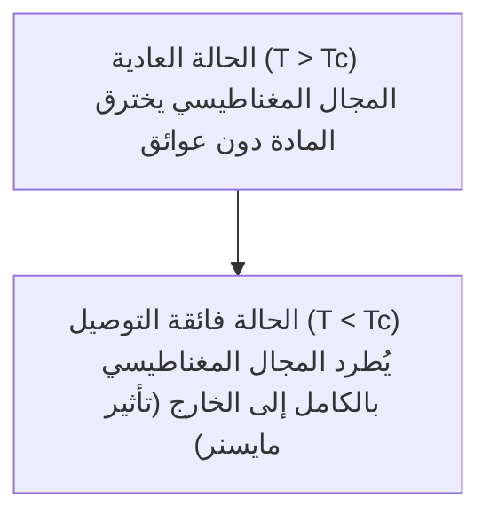

# الفيزياء: آليات الموصلية الفائقة - من تأثير مايسنر إلى قطارات ماجليف وتقنيات المستقبل

من بين الظواهر الفيزيائية القادرة على كسر القيود التكنولوجية المعاصرة، تحظى ظاهرة **الموصلية الفائقة (Superconductivity)** بمكانة فريدة. فالخصائص المدهشة المتمثلة في انعدام المقاومة الكهربائية تماماً والطرد التام للمجالات المغناطيسية تقود ثورة عارمة في شبكات نقل الطاقة، وقطارات الرفع المغناطيسي فائقة السرعة، والتشخيص الطبي المتقدم، و[الحواسيب الكمومية من الجيل القادم](/p/technology-quantum-computer/).

يقدم هذا المقال دراسة فيزيائية وتقنية شاملة للموصلية الفائقة: من الاكتشاف التاريخي في الهيليوم السائل، والديناميكا الكهرومغناطيسية لتأثير مايسنر، إلى التفسير الكمومي المجهري عبر نظرية BCS وأزواج كوبر، ومركبات الكوبرات عالية الحرارة، والتطبيقات الصناعية العملاقة (ماجليف، والرنين المغناطيسي، ومفاعل ITER)، وصولاً إلى السعي نحو الموصلية الفائقة في درجة حرارة الغرفة.

## 1. ما هي الموصلية الفائقة؟ قصة اكتشاف تاريخي

الموصلية الفائقة هي حالة كمومية عيانية (ماكروسكوبية) تبديها بعض المعادن والسبائك والمركبات الخزفية عند تبريدها إلى ما دون **درجة الحرارة الحرجة ($T_c$)**، وتتميز بالهبوط الفجائي والتام للمقاومة الكهربائية للتيار المستمر إلى الصفر المطلق.

في الموصلات العادية مثل النحاس أو الذهب، تصطدم الإلكترونات أثناء تدفقها بالاهتزازات الحرارية للشبكة البلورية (الفونونات) والشوائب، مما يبدد الطاقة على شكل حرارة جول. أما في حالة الموصلية الفائقة دون $T_c$، فتختفي هذه المقاومة كلياً ($R = 0$). وهذا يعني أن تياراً كهربائياً يُحث في حلقة فائقة التوصيل مغلقة سيستمر في التدفق إلى ما لا نهاية دون الحاجة لأي مصدر طاقة خارجي—وهي ظاهرة تُعرف باسم **التيار المستمر الدائم (Persistent Current)**.

اكتشف هذه الظاهرة الفيزيائي الهولندي **هايك كامرلنغ أونس** عام 1911 في جامعة لايدن. فبعد نجاحه في تسييل الهيليوم عند درجة 4.2 كلفن ($-269^\circ\text{C}$)، قام بقياس المقاومة الكهربائية للزئبق الصلب ولاحظ بدهشة بالغة أنها تهبط فجأة إلى الصفر التام عند 4.19 كلفن. ونال أونس جائزة نوبل في الفيزياء عام 1913 تقديراً لهذا الاكتشاف.

## 2. تأثير مايسنر والمغناطيسية المعاكسة المثالية

لا تقتصر الموصلية الفائقة على التوصيل الكهربائي المثالي فحسب. ففي عام 1933، اكتشف الفيزيائيان الألمانيان **فالتر مايسنر** و**روبرت أوكسنفيلد** خاصية كهرومغناطيسية أكثر جوهرية: **المغناطيسية المعاكسة التامة (Perfect Diamagnetism)**، والتي عُرفت باسم **تأثير مايسنر (Meissner effect)**.

فعندما تنتقل المادة إلى الحالة فائقة التوصيل في وجود مجال مغناطيسي خارجي، تقوم بطرد خطوط التدفق المغناطيسي بالكامل من داخلها. وتجبر خطوط المجال على الالتفاف حول السطح الخارجي للموصل الفائق.

```mermaid
flowchart TD
    A["الحالة العادية (T > Tc) \n المجال المغناطيسي يخترق المادة دون عوائق"] --> B["الحالة فائقة التوصيل (T < Tc) \n يُطرد المجال المغناطيسي بالكامل إلى الخارج (تأثير مايسنر)"]
```

ولصياغة هذا السلوك رياضياً، وضع الأخوان فريتز وهاينز لندن عام 1935 **معادلتي لندن**. تربط معادلة لندن الثانية كثافة التيار الفائق $\mathbf{J}$ مباشرة بكثافة التدفق المغناطيسي $\mathbf{B}$:

$$ \nabla \times \mathbf{J} = -\frac{n_s e^2}{m} \mathbf{B} $$

حيث:
- $\mathbf{J}$ تمثل كثافة التيار الفائق.
- $n_s$ هي الكثافة العددية لحاملات الشحنة الفائقة.
- $e$ الشحنة الأولية للإلكترون.
- $m$ كتلة الإلكترون.
- $\mathbf{B}$ متجهة الحث المغناطيسي.

وبدمج هذه المعادلة مع معادلات ماكسويل، يتضح أن المجال المغناطيسي الخارجي يتلاشى أسياً من السطح نحو الداخل حتى عمق دقيق يسمى **عمق اختراق لندن ($\lambda_L$)**:

$$ B(x) = B_0 e^{-x / \lambda_L} $$

وداخل الموصل الفائق، يكون المجال صفراً تماماً ($\mathbf{B} = 0$). وعند وضع مغناطيس دائم فوق موصل فائق، تتولد على السطح تيارات حجب تولد مجالاً مغناطيسياً معاكساً ومساوياً له في القوة، مما يجعل المغناطيس يطفو بثبات في الهواء في مشهد مذهل يُعرف باسم **الرفع الكمومي (Quantum Levitation)**.

## 3. الآلية المجهرية: نظرية BCS وأزواج كوبر

ظل الأصل المجهري للموصلية الفائقة لغزاً محيراً لنصف قرن بعد تجربة أونس. وفي عام 1957، وضع **جون باردين وليون كوبر وجون روبرت شريفر** **نظرية BCS** التي نالت جائزة نوبل في الفيزياء عام 1972.

ترتكز النظرية على تشكل **أزواج كوبر (Cooper pairs)**. في الظروف العادية، تتنافر الإلكترونات بسبب الشحنة السالبة المتماثلة. لكن عند درجات الحرارة شديدة الانخفاض، عندما يتحرك إلكترون عبر الشبكة البلورية، يجذب الأيونات الموجبة المحيطة مسبباً تشوهاً مرناً دقيقاً (فونون افتراضي). وقبل أن تعود الشبكة لوضعها، تجذب هذه الشحنة الموجبة المتجمعة إلكتروناً ثانياً ذا عزم ودوران مغزلي (سبين) معاكسين.

تولد هذه الوساطة الفونونية قوة تجاذب صافية بين الإلكترونين:

$$ (\mathbf{k} \uparrow, -\mathbf{k} \downarrow) $$

الإلكترونات المنفردة هي فرميونات (سبين $1/2$) وتخضع لمبدأ باولي للاستبعاد. ولكن عندما ترتبط في زوج كوبر، يصبح إجمالي السبين صفراً وتسلك سلوك البوزونات. وتحت درجة الحرارة الحرجة، تتكثف مليارات الأزواج في حالة قاعية كمومية عيانية موحدة (شبيهة بتكثف بوز-أينشتاين). وتتحرك جميع الأزواج بتزامن تام كدالة موجية واحدة. ويتطلب كسر هذا التزامن طاقة تفوق الفجوة الطاقية ($\Delta$)، مما يمنع الشوائب والاهتزازات الحرارية من تشتيت الإلكترونات، فتتدفق الكهرباء دون مقاومة.

## 4. الموصلات الفائقة ذات درجات الحرارة العالية (HTS)

توقعت نظرية BCS الكلاسيكية أن التوصيل الفائق المعتمد على الفونونات لا يمكن أن يتجاوز حداً أقصى يتراوح بين 30 إلى 40 كلفن (حد ماكميلان).

ولكن في عام 1986، اكتشف **يوهانس غيورغ بيدنورتز** و**كارل ألكسندر مولر** في مختبرات IBM في زيورخ موصلية فائقة عند 35 كلفن في أكاسيد النحاس واللانثانوم والخزف (الكوبرات)، محطمين هذا الحاجز ونالوا جائزة نوبل عام 1987.

وفي عام 1987، تم تصنيع مركب **YBCO (أكسيد الإيتريوم والباريوم والنحاس)** بدرجة حرارة حرجة بلغت 93 كلفن، متجاوزاً بذلك **نقطة غليان النيتروجين السائل (77 كلفن / $-196^\circ\text{C}$)**. وبما أن النيتروجين السائل رخيص وآمن ومتوفر بوفرة مقارنة بالهيليوم السائل النادر، فتح هذا الاكتشاف الأبواب واسعة أمام التطبيقات الصناعية.

ولا تزال الموصلية الفائقة في الكوبرات لغزاً نظرياً كبيراً، حيث تلعب التفاعلات الإلكترونية القوية والتقلبات المغناطيسية دوراً حاسماً يعجز نموذج الفونونات البسيط عن تفسيره منفرداً.

## 5. تطبيقات صناعية تغير مسار الحضارة

إن القدرة على حمل تيارات كهربائية عملاقة وتوليد مجالات مغناطيسية هائلة بلا حرارة جعلت الموصلية الفائقة ركيزة للتقنيات الكبرى:

### 5.1 قطارات الرفع المغناطيسي (SCMaglev)
يستخدم قطار **SCMaglev** الياباني مغانط فائقة التوصيل من النيوبيوم والتيتانيوم (NbTi) مبردة بالهيليوم السائل. تولد التيارات الدائمة مجالات بقوة عدة تسلا تتفاعل مع ملفات المسار، لترفع القطار بمقدار 10 سم وتدفعه بسرعات تتجاوز **500 كم/ساعة (الرقم القياسي 603 كم/ساعة)** دون أي احتكاك مع القضبان.

### 5.2 التصوير بالرنين المغناطيسي (MRI)
تتطلب أجهزة الرنين المغناطيسي الطبية مجالاً مغناطيسياً قوياً وثابتاً ومتجانساً يتراوح بين 1.5 و 3.0 تسلا (وحتى 7 تسلا في أبحاث الدماغ). وتحافظ الملفات فائقة التوصيل على هذا المجال الهائل لسنوات دون استهلاك مستمر للكهرباء ودون انبعاث حراري، مما يضمن تصويراً فائق الدقة لأنسجة الجسم.

### 5.3 مسرعات الجسيمات ومفاعلات الاندماج النووي
في سيرن (CERN)، يعتمد **مصادم الهادرونات الكبير (LHC)** على أكثر من 1200 مغناطيس فائق التوصيل على طول نفق دائري يبلغ 27 كم لتوجيه البروتونات عند 99.999999% من سرعة الضوء. وفي مفاعل **ITER** للأبحاث الاندماجية، تُستخدم ملفات نيوبيوم-قصدير ($Nb_3Sn$) ضخمة لتوليد قفص مغناطيسي بقوة 13 تسلا لحبس بلازما حرارية تتجاوز 100 مليون درجة مئوية.

### 5.4 الحواسيب الكمومية فائقة التوصيل
تعتمد أبرز المعالجات الكمومية العالمية (مثل Google Sycamore و IBM Quantum) على الدوائر فائقة التوصيل. ومن خلال **وصلات جوزيفسون (Josephson Junctions)**، يبني العلماء كيو بتات اصطناعية يمكن التحكم في حالات تراكبها وتشابكها الكمومي بنبضات ميكروية عند درجات حرارة بالغة التدني (مللي كلفن).

## 6. السعي نحو الكأس المقدسة: الموصلية الفائقة في حرارة الغرفة

العائق الأكبر أمام انتشار الموصلية الفائقة في كل مكان هو تكاليف ومعدات التبريد العميق (الكريوجيني).

إن اكتشاف **موصل فائق يعمل في درجة حرارة الغرفة والضغط الجوي العادي ($T_c > 300\text{ K}$, $P = 1\text{ atm}$)** سيفجر ثورة صناعية عالمية:
- **شبكات كهربائية بلا هدر**: القضاء التام على خسائر نقل الكهرباء لمسافات طويلة (التي تبتلع 5-10% من كهرباء العالم حالياً).
- **إلكترونيات فائقة السرعة بلا سخونة**: معالجات تعمل بترددات التيراهيرتز دون اختناق حراري.
- **تخزين الطاقة المغناطيسي الفائق (SMES)**: بطاريات مغناطيسية لتخزين الجيجاوات/ساعة بكفاءة شحن وتفريغ تقارب 100%.

وفي السنوات الأخيرة، أظهرت تجارب خلايا السندان الماسي تحت ضغوط تفوق ملايين الأجواء موصلية فائقة تقارب 250 كلفن ($-23^\circ\text{C}$) في هيدريدات غنية بالهيدروجين ($H_3S$, $LaH_{10}$). ويبقى التحدي الهندسي الأكبر هو استقرار هذه المواد في الضغط الجوي العادي.

## الخاتمة: معجزة الكم في عالمنا المرئي

تعد الموصلية الفائقة أحد أروع الشواهد على تجسد قوانين ميكانيكا الكم الغامضة على نطاقنا العياني البشري. فمن قطرة الزئبق التي راقبها أونس عام 1911 إلى قطارات ماجليف ومفاعلات الاندماج وحواسيب الكم، ستظل الموصلية الفائقة حافزاً جوهرياً يعيد صياغة آفاق التقنية والحضارة البشرية.
