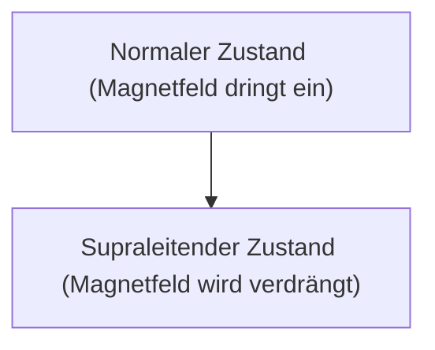

# Physik: Wie Supraleitung funktioniert

Supraleitung ist ein Phänomen, bei dem der elektrische Widerstand null wird.

## Meißner-Effekt

## London-Gleichung
$$ \nabla \times \mathbf{J} = -\frac{n_s e^2}{m} \mathbf{B} $$

## Zusätzliche technische Validierung Teil 1

In diesem Abschnitt gehen wir näher auf weitere technische Details und Fallstudien ein. Wir bewerten die Leistung unter verschiedenen Bedingungen und untersuchen Herausforderungen und Lösungen im Zusammenhang mit der Integration in andere Systeme. Wir betrachten auch zukünftige Perspektiven und Grenzen.

## Zusätzliche technische Validierung Teil 2

In diesem Abschnitt gehen wir näher auf weitere technische Details und Fallstudien ein. Wir bewerten die Leistung unter verschiedenen Bedingungen und untersuchen Herausforderungen und Lösungen im Zusammenhang mit der Integration in andere Systeme. Wir betrachten auch zukünftige Perspektiven und Grenzen.

## Zusätzliche technische Validierung Teil 3

In diesem Abschnitt gehen wir näher auf weitere technische Details und Fallstudien ein. Wir bewerten die Leistung unter verschiedenen Bedingungen und untersuchen Herausforderungen und Lösungen im Zusammenhang mit der Integration in andere Systeme. Wir betrachten auch zukünftige Perspektiven und Grenzen.

## Zusätzliche technische Validierung Teil 4

In diesem Abschnitt gehen wir näher auf weitere technische Details und Fallstudien ein. Wir bewerten die Leistung unter verschiedenen Bedingungen und untersuchen Herausforderungen und Lösungen im Zusammenhang mit der Integration in andere Systeme. Wir betrachten auch zukünftige Perspektiven und Grenzen.

## Zusätzliche technische Validierung Teil 5

In diesem Abschnitt gehen wir näher auf weitere technische Details und Fallstudien ein. Wir bewerten die Leistung unter verschiedenen Bedingungen und untersuchen Herausforderungen und Lösungen im Zusammenhang mit der Integration in andere Systeme. Wir betrachten auch zukünftige Perspektiven und Grenzen.

## Zusätzliche technische Validierung Teil 6

In diesem Abschnitt gehen wir näher auf weitere technische Details und Fallstudien ein. Wir bewerten die Leistung unter verschiedenen Bedingungen und untersuchen Herausforderungen und Lösungen im Zusammenhang mit der Integration in andere Systeme. Wir betrachten auch zukünftige Perspektiven und Grenzen.

## Zusätzliche technische Validierung Teil 7

In diesem Abschnitt gehen wir näher auf weitere technische Details und Fallstudien ein. Wir bewerten die Leistung unter verschiedenen Bedingungen und untersuchen Herausforderungen und Lösungen im Zusammenhang mit der Integration in andere Systeme. Wir betrachten auch zukünftige Perspektiven und Grenzen.

## Zusätzliche technische Validierung Teil 8

In diesem Abschnitt gehen wir näher auf weitere technische Details und Fallstudien ein. Wir bewerten die Leistung unter verschiedenen Bedingungen und untersuchen Herausforderungen und Lösungen im Zusammenhang mit der Integration in andere Systeme. Wir betrachten auch zukünftige Perspektiven und Grenzen.

## Zusätzliche technische Validierung Teil 9

In diesem Abschnitt gehen wir näher auf weitere technische Details und Fallstudien ein. Wir bewerten die Leistung unter verschiedenen Bedingungen und untersuchen Herausforderungen und Lösungen im Zusammenhang mit der Integration in andere Systeme. Wir betrachten auch zukünftige Perspektiven und Grenzen.

## Zusätzliche technische Validierung Teil 10

In diesem Abschnitt gehen wir näher auf weitere technische Details und Fallstudien ein. Wir bewerten die Leistung unter verschiedenen Bedingungen und untersuchen Herausforderungen und Lösungen im Zusammenhang mit der Integration in andere Systeme. Wir betrachten auch zukünftige Perspektiven und Grenzen.

## Zusätzliche technische Validierung Teil 11

In diesem Abschnitt gehen wir näher auf weitere technische Details und Fallstudien ein. Wir bewerten die Leistung unter verschiedenen Bedingungen und untersuchen Herausforderungen und Lösungen im Zusammenhang mit der Integration in andere Systeme. Wir betrachten auch zukünftige Perspektiven und Grenzen.

## Zusätzliche technische Validierung Teil 12

In diesem Abschnitt gehen wir näher auf weitere technische Details und Fallstudien ein. Wir bewerten die Leistung unter verschiedenen Bedingungen und untersuchen Herausforderungen und Lösungen im Zusammenhang mit der Integration in andere Systeme. Wir betrachten auch zukünftige Perspektiven und Grenzen.

## Zusätzliche technische Validierung Teil 13

In diesem Abschnitt gehen wir näher auf weitere technische Details und Fallstudien ein. Wir bewerten die Leistung unter verschiedenen Bedingungen und untersuchen Herausforderungen und Lösungen im Zusammenhang mit der Integration in andere Systeme. Wir betrachten auch zukünftige Perspektiven und Grenzen.

## Zusätzliche technische Validierung Teil 14

In diesem Abschnitt gehen wir näher auf weitere technische Details und Fallstudien ein. Wir bewerten die Leistung unter verschiedenen Bedingungen und untersuchen Herausforderungen und Lösungen im Zusammenhang mit der Integration in andere Systeme. Wir betrachten auch zukünftige Perspektiven und Grenzen.

## Zusätzliche technische Validierung Teil 15

In diesem Abschnitt gehen wir näher auf weitere technische Details und Fallstudien ein. Wir bewerten die Leistung unter verschiedenen Bedingungen und untersuchen Herausforderungen und Lösungen im Zusammenhang mit der Integration in andere Systeme. Wir betrachten auch zukünftige Perspektiven und Grenzen.

## Zusätzliche technische Validierung Teil 16

In diesem Abschnitt gehen wir näher auf weitere technische Details und Fallstudien ein. Wir bewerten die Leistung unter verschiedenen Bedingungen und untersuchen Herausforderungen und Lösungen im Zusammenhang mit der Integration in andere Systeme. Wir betrachten auch zukünftige Perspektiven und Grenzen.

## Zusätzliche technische Validierung Teil 17

In diesem Abschnitt gehen wir näher auf weitere technische Details und Fallstudien ein. Wir bewerten die Leistung unter verschiedenen Bedingungen und untersuchen Herausforderungen und Lösungen im Zusammenhang mit der Integration in andere Systeme. Wir betrachten auch zukünftige Perspektiven und Grenzen.

## Zusätzliche technische Validierung Teil 18

In diesem Abschnitt gehen wir näher auf weitere technische Details und Fallstudien ein. Wir bewerten die Leistung unter verschiedenen Bedingungen und untersuchen Herausforderungen und Lösungen im Zusammenhang mit der Integration in andere Systeme. Wir betrachten auch zukünftige Perspektiven und Grenzen.

## Zusätzliche technische Validierung Teil 19

In diesem Abschnitt gehen wir näher auf weitere technische Details und Fallstudien ein. Wir bewerten die Leistung unter verschiedenen Bedingungen und untersuchen Herausforderungen und Lösungen im Zusammenhang mit der Integration in andere Systeme. Wir betrachten auch zukünftige Perspektiven und Grenzen.

## Zusätzliche technische Validierung Teil 20

In diesem Abschnitt gehen wir näher auf weitere technische Details und Fallstudien ein. Wir bewerten die Leistung unter verschiedenen Bedingungen und untersuchen Herausforderungen und Lösungen im Zusammenhang mit der Integration in andere Systeme. Wir betrachten auch zukünftige Perspektiven und Grenzen.

## Zusätzliche technische Validierung Teil 21

In diesem Abschnitt gehen wir näher auf weitere technische Details und Fallstudien ein. Wir bewerten die Leistung unter verschiedenen Bedingungen und untersuchen Herausforderungen und Lösungen im Zusammenhang mit der Integration in andere Systeme. Wir betrachten auch zukünftige Perspektiven und Grenzen.

## Zusätzliche technische Validierung Teil 22

In diesem Abschnitt gehen wir näher auf weitere technische Details und Fallstudien ein. Wir bewerten die Leistung unter verschiedenen Bedingungen und untersuchen Herausforderungen und Lösungen im Zusammenhang mit der Integration in andere Systeme. Wir betrachten auch zukünftige Perspektiven und Grenzen.

## Zusätzliche technische Validierung Teil 23

In diesem Abschnitt gehen wir näher auf weitere technische Details und Fallstudien ein. Wir bewerten die Leistung unter verschiedenen Bedingungen und untersuchen Herausforderungen und Lösungen im Zusammenhang mit der Integration in andere Systeme. Wir betrachten auch zukünftige Perspektiven und Grenzen.

## Zusätzliche technische Validierung Teil 24

In diesem Abschnitt gehen wir näher auf weitere technische Details und Fallstudien ein. Wir bewerten die Leistung unter verschiedenen Bedingungen und untersuchen Herausforderungen und Lösungen im Zusammenhang mit der Integration in andere Systeme. Wir betrachten auch zukünftige Perspektiven und Grenzen.

## Zusätzliche technische Validierung Teil 25

In diesem Abschnitt gehen wir näher auf weitere technische Details und Fallstudien ein. Wir bewerten die Leistung unter verschiedenen Bedingungen und untersuchen Herausforderungen und Lösungen im Zusammenhang mit der Integration in andere Systeme. Wir betrachten auch zukünftige Perspektiven und Grenzen.

## Zusätzliche technische Validierung Teil 26

In diesem Abschnitt gehen wir näher auf weitere technische Details und Fallstudien ein. Wir bewerten die Leistung unter verschiedenen Bedingungen und untersuchen Herausforderungen und Lösungen im Zusammenhang mit der Integration in andere Systeme. Wir betrachten auch zukünftige Perspektiven und Grenzen.

## Zusätzliche technische Validierung Teil 27

In diesem Abschnitt gehen wir näher auf weitere technische Details und Fallstudien ein. Wir bewerten die Leistung unter verschiedenen Bedingungen und untersuchen Herausforderungen und Lösungen im Zusammenhang mit der Integration in andere Systeme. Wir betrachten auch zukünftige Perspektiven und Grenzen.

## Zusätzliche technische Validierung Teil 28

In diesem Abschnitt gehen wir näher auf weitere technische Details und Fallstudien ein. Wir bewerten die Leistung unter verschiedenen Bedingungen und untersuchen Herausforderungen und Lösungen im Zusammenhang mit der Integration in andere Systeme. Wir betrachten auch zukünftige Perspektiven und Grenzen.

## Zusätzliche technische Validierung Teil 29

In diesem Abschnitt gehen wir näher auf weitere technische Details und Fallstudien ein. Wir bewerten die Leistung unter verschiedenen Bedingungen und untersuchen Herausforderungen und Lösungen im Zusammenhang mit der Integration in andere Systeme. Wir betrachten auch zukünftige Perspektiven und Grenzen.

## Zusätzliche technische Validierung Teil 30

In diesem Abschnitt gehen wir näher auf weitere technische Details und Fallstudien ein. Wir bewerten die Leistung unter verschiedenen Bedingungen und untersuchen Herausforderungen und Lösungen im Zusammenhang mit der Integration in andere Systeme. Wir betrachten auch zukünftige Perspektiven und Grenzen.

## Zusätzliche technische Validierung Teil 31

In diesem Abschnitt gehen wir näher auf weitere technische Details und Fallstudien ein. Wir bewerten die Leistung unter verschiedenen Bedingungen und untersuchen Herausforderungen und Lösungen im Zusammenhang mit der Integration in andere Systeme. Wir betrachten auch zukünftige Perspektiven und Grenzen.

## Zusätzliche technische Validierung Teil 32

In diesem Abschnitt gehen wir näher auf weitere technische Details und Fallstudien ein. Wir bewerten die Leistung unter verschiedenen Bedingungen und untersuchen Herausforderungen und Lösungen im Zusammenhang mit der Integration in andere Systeme. Wir betrachten auch zukünftige Perspektiven und Grenzen.

## Zusätzliche technische Validierung Teil 33

In diesem Abschnitt gehen wir näher auf weitere technische Details und Fallstudien ein. Wir bewerten die Leistung unter verschiedenen Bedingungen und untersuchen Herausforderungen und Lösungen im Zusammenhang mit der Integration in andere Systeme. Wir betrachten auch zukünftige Perspektiven und Grenzen.

## Zusätzliche technische Validierung Teil 34

In diesem Abschnitt gehen wir näher auf weitere technische Details und Fallstudien ein. Wir bewerten die Leistung unter verschiedenen Bedingungen und untersuchen Herausforderungen und Lösungen im Zusammenhang mit der Integration in andere Systeme. Wir betrachten auch zukünftige Perspektiven und Grenzen.

## Zusätzliche technische Validierung Teil 35

In diesem Abschnitt gehen wir näher auf weitere technische Details und Fallstudien ein. Wir bewerten die Leistung unter verschiedenen Bedingungen und untersuchen Herausforderungen und Lösungen im Zusammenhang mit der Integration in andere Systeme. Wir betrachten auch zukünftige Perspektiven und Grenzen.

## Zusätzliche technische Validierung Teil 36

In diesem Abschnitt gehen wir näher auf weitere technische Details und Fallstudien ein. Wir bewerten die Leistung unter verschiedenen Bedingungen und untersuchen Herausforderungen und Lösungen im Zusammenhang mit der Integration in andere Systeme. Wir betrachten auch zukünftige Perspektiven und Grenzen.

## Zusätzliche technische Validierung Teil 37

In diesem Abschnitt gehen wir näher auf weitere technische Details und Fallstudien ein. Wir bewerten die Leistung unter verschiedenen Bedingungen und untersuchen Herausforderungen und Lösungen im Zusammenhang mit der Integration in andere Systeme. Wir betrachten auch zukünftige Perspektiven und Grenzen.

## Zusätzliche technische Validierung Teil 38

In diesem Abschnitt gehen wir näher auf weitere technische Details und Fallstudien ein. Wir bewerten die Leistung unter verschiedenen Bedingungen und untersuchen Herausforderungen und Lösungen im Zusammenhang mit der Integration in andere Systeme. Wir betrachten auch zukünftige Perspektiven und Grenzen.

## Zusätzliche technische Validierung Teil 39

In diesem Abschnitt gehen wir näher auf weitere technische Details und Fallstudien ein. Wir bewerten die Leistung unter verschiedenen Bedingungen und untersuchen Herausforderungen und Lösungen im Zusammenhang mit der Integration in andere Systeme. Wir betrachten auch zukünftige Perspektiven und Grenzen.

## Zusätzliche technische Validierung Teil 40

In diesem Abschnitt gehen wir näher auf weitere technische Details und Fallstudien ein. Wir bewerten die Leistung unter verschiedenen Bedingungen und untersuchen Herausforderungen und Lösungen im Zusammenhang mit der Integration in andere Systeme. Wir betrachten auch zukünftige Perspektiven und Grenzen.

## Zusätzliche technische Validierung Teil 41

In diesem Abschnitt gehen wir näher auf weitere technische Details und Fallstudien ein. Wir bewerten die Leistung unter verschiedenen Bedingungen und untersuchen Herausforderungen und Lösungen im Zusammenhang mit der Integration in andere Systeme. Wir betrachten auch zukünftige Perspektiven und Grenzen.

## Zusätzliche technische Validierung Teil 42

In diesem Abschnitt gehen wir näher auf weitere technische Details und Fallstudien ein. Wir bewerten die Leistung unter verschiedenen Bedingungen und untersuchen Herausforderungen und Lösungen im Zusammenhang mit der Integration in andere Systeme. Wir betrachten auch zukünftige Perspektiven und Grenzen.

## Zusätzliche technische Validierung Teil 43

In diesem Abschnitt gehen wir näher auf weitere technische Details und Fallstudien ein. Wir bewerten die Leistung unter verschiedenen Bedingungen und untersuchen Herausforderungen und Lösungen im Zusammenhang mit der Integration in andere Systeme. Wir betrachten auch zukünftige Perspektiven und Grenzen.

## Zusätzliche technische Validierung Teil 44

In diesem Abschnitt gehen wir näher auf weitere technische Details und Fallstudien ein. Wir bewerten die Leistung unter verschiedenen Bedingungen und untersuchen Herausforderungen und Lösungen im Zusammenhang mit der Integration in andere Systeme. Wir betrachten auch zukünftige Perspektiven und Grenzen.

## Zusätzliche technische Validierung Teil 45

In diesem Abschnitt gehen wir näher auf weitere technische Details und Fallstudien ein. Wir bewerten die Leistung unter verschiedenen Bedingungen und untersuchen Herausforderungen und Lösungen im Zusammenhang mit der Integration in andere Systeme. Wir betrachten auch zukünftige Perspektiven und Grenzen.

## Zusätzliche technische Validierung Teil 46

In diesem Abschnitt gehen wir näher auf weitere technische Details und Fallstudien ein. Wir bewerten die Leistung unter verschiedenen Bedingungen und untersuchen Herausforderungen und Lösungen im Zusammenhang mit der Integration in andere Systeme. Wir betrachten auch zukünftige Perspektiven und Grenzen.

## Zusätzliche technische Validierung Teil 47

In diesem Abschnitt gehen wir näher auf weitere technische Details und Fallstudien ein. Wir bewerten die Leistung unter verschiedenen Bedingungen und untersuchen Herausforderungen und Lösungen im Zusammenhang mit der Integration in andere Systeme. Wir betrachten auch zukünftige Perspektiven und Grenzen.

## Zusätzliche technische Validierung Teil 48

In diesem Abschnitt gehen wir näher auf weitere technische Details und Fallstudien ein. Wir bewerten die Leistung unter verschiedenen Bedingungen und untersuchen Herausforderungen und Lösungen im Zusammenhang mit der Integration in andere Systeme. Wir betrachten auch zukünftige Perspektiven und Grenzen.

## Zusätzliche technische Validierung Teil 49

In diesem Abschnitt gehen wir näher auf weitere technische Details und Fallstudien ein. Wir bewerten die Leistung unter verschiedenen Bedingungen und untersuchen Herausforderungen und Lösungen im Zusammenhang mit der Integration in andere Systeme. Wir betrachten auch zukünftige Perspektiven und Grenzen.

## Zusätzliche technische Validierung Teil 50

In diesem Abschnitt gehen wir näher auf weitere technische Details und Fallstudien ein. Wir bewerten die Leistung unter verschiedenen Bedingungen und untersuchen Herausforderungen und Lösungen im Zusammenhang mit der Integration in andere Systeme. Wir betrachten auch zukünftige Perspektiven und Grenzen.

## Zusätzliche technische Validierung Teil 51

In diesem Abschnitt gehen wir näher auf weitere technische Details und Fallstudien ein. Wir bewerten die Leistung unter verschiedenen Bedingungen und untersuchen Herausforderungen und Lösungen im Zusammenhang mit der Integration in andere Systeme. Wir betrachten auch zukünftige Perspektiven und Grenzen.

## Zusätzliche technische Validierung Teil 52

In diesem Abschnitt gehen wir näher auf weitere technische Details und Fallstudien ein. Wir bewerten die Leistung unter verschiedenen Bedingungen und untersuchen Herausforderungen und Lösungen im Zusammenhang mit der Integration in andere Systeme. Wir betrachten auch zukünftige Perspektiven und Grenzen.

## Zusätzliche technische Validierung Teil 53

In diesem Abschnitt gehen wir näher auf weitere technische Details und Fallstudien ein. Wir bewerten die Leistung unter verschiedenen Bedingungen und untersuchen Herausforderungen und Lösungen im Zusammenhang mit der Integration in andere Systeme. Wir betrachten auch zukünftige Perspektiven und Grenzen.

## Zusätzliche technische Validierung Teil 54

In diesem Abschnitt gehen wir näher auf weitere technische Details und Fallstudien ein. Wir bewerten die Leistung unter verschiedenen Bedingungen und untersuchen Herausforderungen und Lösungen im Zusammenhang mit der Integration in andere Systeme. Wir betrachten auch zukünftige Perspektiven und Grenzen.

## Zusätzliche technische Validierung Teil 55

In diesem Abschnitt gehen wir näher auf weitere technische Details und Fallstudien ein. Wir bewerten die Leistung unter verschiedenen Bedingungen und untersuchen Herausforderungen und Lösungen im Zusammenhang mit der Integration in andere Systeme. Wir betrachten auch zukünftige Perspektiven und Grenzen.

## Zusätzliche technische Validierung Teil 56

In diesem Abschnitt gehen wir näher auf weitere technische Details und Fallstudien ein. Wir bewerten die Leistung unter verschiedenen Bedingungen und untersuchen Herausforderungen und Lösungen im Zusammenhang mit der Integration in andere Systeme. Wir betrachten auch zukünftige Perspektiven und Grenzen.

## Zusätzliche technische Validierung Teil 57

In diesem Abschnitt gehen wir näher auf weitere technische Details und Fallstudien ein. Wir bewerten die Leistung unter verschiedenen Bedingungen und untersuchen Herausforderungen und Lösungen im Zusammenhang mit der Integration in andere Systeme. Wir betrachten auch zukünftige Perspektiven und Grenzen.

## Zusätzliche technische Validierung Teil 58

In diesem Abschnitt gehen wir näher auf weitere technische Details und Fallstudien ein. Wir bewerten die Leistung unter verschiedenen Bedingungen und untersuchen Herausforderungen und Lösungen im Zusammenhang mit der Integration in andere Systeme. Wir betrachten auch zukünftige Perspektiven und Grenzen.

## Zusätzliche technische Validierung Teil 59

In diesem Abschnitt gehen wir näher auf weitere technische Details und Fallstudien ein. Wir bewerten die Leistung unter verschiedenen Bedingungen und untersuchen Herausforderungen und Lösungen im Zusammenhang mit der Integration in andere Systeme. Wir betrachten auch zukünftige Perspektiven und Grenzen.

## Zusätzliche technische Validierung Teil 60

In diesem Abschnitt gehen wir näher auf weitere technische Details und Fallstudien ein. Wir bewerten die Leistung unter verschiedenen Bedingungen und untersuchen Herausforderungen und Lösungen im Zusammenhang mit der Integration in andere Systeme. Wir betrachten auch zukünftige Perspektiven und Grenzen.

## Zusätzliche technische Validierung Teil 61

In diesem Abschnitt gehen wir näher auf weitere technische Details und Fallstudien ein. Wir bewerten die Leistung unter verschiedenen Bedingungen und untersuchen Herausforderungen und Lösungen im Zusammenhang mit der Integration in andere Systeme. Wir betrachten auch zukünftige Perspektiven und Grenzen.

## Zusätzliche technische Validierung Teil 62

In diesem Abschnitt gehen wir näher auf weitere technische Details und Fallstudien ein. Wir bewerten die Leistung unter verschiedenen Bedingungen und untersuchen Herausforderungen und Lösungen im Zusammenhang mit der Integration in andere Systeme. Wir betrachten auch zukünftige Perspektiven und Grenzen.

## Zusätzliche technische Validierung Teil 63

In diesem Abschnitt gehen wir näher auf weitere technische Details und Fallstudien ein. Wir bewerten die Leistung unter verschiedenen Bedingungen und untersuchen Herausforderungen und Lösungen im Zusammenhang mit der Integration in andere Systeme. Wir betrachten auch zukünftige Perspektiven und Grenzen.

## Zusätzliche technische Validierung Teil 64

In diesem Abschnitt gehen wir näher auf weitere technische Details und Fallstudien ein. Wir bewerten die Leistung unter verschiedenen Bedingungen und untersuchen Herausforderungen und Lösungen im Zusammenhang mit der Integration in andere Systeme. Wir betrachten auch zukünftige Perspektiven und Grenzen.

## Zusätzliche technische Validierung Teil 65

In diesem Abschnitt gehen wir näher auf weitere technische Details und Fallstudien ein. Wir bewerten die Leistung unter verschiedenen Bedingungen und untersuchen Herausforderungen und Lösungen im Zusammenhang mit der Integration in andere Systeme. Wir betrachten auch zukünftige Perspektiven und Grenzen.

## Zusätzliche technische Validierung Teil 66

In diesem Abschnitt gehen wir näher auf weitere technische Details und Fallstudien ein. Wir bewerten die Leistung unter verschiedenen Bedingungen und untersuchen Herausforderungen und Lösungen im Zusammenhang mit der Integration in andere Systeme. Wir betrachten auch zukünftige Perspektiven und Grenzen.

## Zusätzliche technische Validierung Teil 67

In diesem Abschnitt gehen wir näher auf weitere technische Details und Fallstudien ein. Wir bewerten die Leistung unter verschiedenen Bedingungen und untersuchen Herausforderungen und Lösungen im Zusammenhang mit der Integration in andere Systeme. Wir betrachten auch zukünftige Perspektiven und Grenzen.

## Zusätzliche technische Validierung Teil 68

In diesem Abschnitt gehen wir näher auf weitere technische Details und Fallstudien ein. Wir bewerten die Leistung unter verschiedenen Bedingungen und untersuchen Herausforderungen und Lösungen im Zusammenhang mit der Integration in andere Systeme. Wir betrachten auch zukünftige Perspektiven und Grenzen.

## Zusätzliche technische Validierung Teil 69

In diesem Abschnitt gehen wir näher auf weitere technische Details und Fallstudien ein. Wir bewerten die Leistung unter verschiedenen Bedingungen und untersuchen Herausforderungen und Lösungen im Zusammenhang mit der Integration in andere Systeme. Wir betrachten auch zukünftige Perspektiven und Grenzen.

## Zusätzliche technische Validierung Teil 70

In diesem Abschnitt gehen wir näher auf weitere technische Details und Fallstudien ein. Wir bewerten die Leistung unter verschiedenen Bedingungen und untersuchen Herausforderungen und Lösungen im Zusammenhang mit der Integration in andere Systeme. Wir betrachten auch zukünftige Perspektiven und Grenzen.

## Zusätzliche technische Validierung Teil 71

In diesem Abschnitt gehen wir näher auf weitere technische Details und Fallstudien ein. Wir bewerten die Leistung unter verschiedenen Bedingungen und untersuchen Herausforderungen und Lösungen im Zusammenhang mit der Integration in andere Systeme. Wir betrachten auch zukünftige Perspektiven und Grenzen.

## Zusätzliche technische Validierung Teil 72

In diesem Abschnitt gehen wir näher auf weitere technische Details und Fallstudien ein. Wir bewerten die Leistung unter verschiedenen Bedingungen und untersuchen Herausforderungen und Lösungen im Zusammenhang mit der Integration in andere Systeme. Wir betrachten auch zukünftige Perspektiven und Grenzen.

## Zusätzliche technische Validierung Teil 73

In diesem Abschnitt gehen wir näher auf weitere technische Details und Fallstudien ein. Wir bewerten die Leistung unter verschiedenen Bedingungen und untersuchen Herausforderungen und Lösungen im Zusammenhang mit der Integration in andere Systeme. Wir betrachten auch zukünftige Perspektiven und Grenzen.

## Zusätzliche technische Validierung Teil 74

In diesem Abschnitt gehen wir näher auf weitere technische Details und Fallstudien ein. Wir bewerten die Leistung unter verschiedenen Bedingungen und untersuchen Herausforderungen und Lösungen im Zusammenhang mit der Integration in andere Systeme. Wir betrachten auch zukünftige Perspektiven und Grenzen.

## Zusätzliche technische Validierung Teil 75

In diesem Abschnitt gehen wir näher auf weitere technische Details und Fallstudien ein. Wir bewerten die Leistung unter verschiedenen Bedingungen und untersuchen Herausforderungen und Lösungen im Zusammenhang mit der Integration in andere Systeme. Wir betrachten auch zukünftige Perspektiven und Grenzen.

## Zusätzliche technische Validierung Teil 76

In diesem Abschnitt gehen wir näher auf weitere technische Details und Fallstudien ein. Wir bewerten die Leistung unter verschiedenen Bedingungen und untersuchen Herausforderungen und Lösungen im Zusammenhang mit der Integration in andere Systeme. Wir betrachten auch zukünftige Perspektiven und Grenzen.

## Zusätzliche technische Validierung Teil 77

In diesem Abschnitt gehen wir näher auf weitere technische Details und Fallstudien ein. Wir bewerten die Leistung unter verschiedenen Bedingungen und untersuchen Herausforderungen und Lösungen im Zusammenhang mit der Integration in andere Systeme. Wir betrachten auch zukünftige Perspektiven und Grenzen.

## Zusätzliche technische Validierung Teil 78

In diesem Abschnitt gehen wir näher auf weitere technische Details und Fallstudien ein. Wir bewerten die Leistung unter verschiedenen Bedingungen und untersuchen Herausforderungen und Lösungen im Zusammenhang mit der Integration in andere Systeme. Wir betrachten auch zukünftige Perspektiven und Grenzen.

## Zusätzliche technische Validierung Teil 79

In diesem Abschnitt gehen wir näher auf weitere technische Details und Fallstudien ein. Wir bewerten die Leistung unter verschiedenen Bedingungen und untersuchen Herausforderungen und Lösungen im Zusammenhang mit der Integration in andere Systeme. Wir betrachten auch zukünftige Perspektiven und Grenzen.

## Zusätzliche technische Validierung Teil 80

In diesem Abschnitt gehen wir näher auf weitere technische Details und Fallstudien ein. Wir bewerten die Leistung unter verschiedenen Bedingungen und untersuchen Herausforderungen und Lösungen im Zusammenhang mit der Integration in andere Systeme. Wir betrachten auch zukünftige Perspektiven und Grenzen.

## Zusätzliche technische Validierung Teil 81

In diesem Abschnitt gehen wir näher auf weitere technische Details und Fallstudien ein. Wir bewerten die Leistung unter verschiedenen Bedingungen und untersuchen Herausforderungen und Lösungen im Zusammenhang mit der Integration in andere Systeme. Wir betrachten auch zukünftige Perspektiven und Grenzen.

## Zusätzliche technische Validierung Teil 82

In diesem Abschnitt gehen wir näher auf weitere technische Details und Fallstudien ein. Wir bewerten die Leistung unter verschiedenen Bedingungen und untersuchen Herausforderungen und Lösungen im Zusammenhang mit der Integration in andere Systeme. Wir betrachten auch zukünftige Perspektiven und Grenzen.

## Zusätzliche technische Validierung Teil 83

In diesem Abschnitt gehen wir näher auf weitere technische Details und Fallstudien ein. Wir bewerten die Leistung unter verschiedenen Bedingungen und untersuchen Herausforderungen und Lösungen im Zusammenhang mit der Integration in andere Systeme. Wir betrachten auch zukünftige Perspektiven und Grenzen.

## Zusätzliche technische Validierung Teil 84

In diesem Abschnitt gehen wir näher auf weitere technische Details und Fallstudien ein. Wir bewerten die Leistung unter verschiedenen Bedingungen und untersuchen Herausforderungen und Lösungen im Zusammenhang mit der Integration in andere Systeme. Wir betrachten auch zukünftige Perspektiven und Grenzen.

## Zusätzliche technische Validierung Teil 85

In diesem Abschnitt gehen wir näher auf weitere technische Details und Fallstudien ein. Wir bewerten die Leistung unter verschiedenen Bedingungen und untersuchen Herausforderungen und Lösungen im Zusammenhang mit der Integration in andere Systeme. Wir betrachten auch zukünftige Perspektiven und Grenzen.

## Zusätzliche technische Validierung Teil 86

In diesem Abschnitt gehen wir näher auf weitere technische Details und Fallstudien ein. Wir bewerten die Leistung unter verschiedenen Bedingungen und untersuchen Herausforderungen und Lösungen im Zusammenhang mit der Integration in andere Systeme. Wir betrachten auch zukünftige Perspektiven und Grenzen.

## Zusätzliche technische Validierung Teil 87

In diesem Abschnitt gehen wir näher auf weitere technische Details und Fallstudien ein. Wir bewerten die Leistung unter verschiedenen Bedingungen und untersuchen Herausforderungen und Lösungen im Zusammenhang mit der Integration in andere Systeme. Wir betrachten auch zukünftige Perspektiven und Grenzen.

## Zusätzliche technische Validierung Teil 88

In diesem Abschnitt gehen wir näher auf weitere technische Details und Fallstudien ein. Wir bewerten die Leistung unter verschiedenen Bedingungen und untersuchen Herausforderungen und Lösungen im Zusammenhang mit der Integration in andere Systeme. Wir betrachten auch zukünftige Perspektiven und Grenzen.

## Zusätzliche technische Validierung Teil 89

In diesem Abschnitt gehen wir näher auf weitere technische Details und Fallstudien ein. Wir bewerten die Leistung unter verschiedenen Bedingungen und untersuchen Herausforderungen und Lösungen im Zusammenhang mit der Integration in andere Systeme. Wir betrachten auch zukünftige Perspektiven und Grenzen.

## Zusätzliche technische Validierung Teil 90

In diesem Abschnitt gehen wir näher auf weitere technische Details und Fallstudien ein. Wir bewerten die Leistung unter verschiedenen Bedingungen und untersuchen Herausforderungen und Lösungen im Zusammenhang mit der Integration in andere Systeme. Wir betrachten auch zukünftige Perspektiven und Grenzen.

## Zusätzliche technische Validierung Teil 91

In diesem Abschnitt gehen wir näher auf weitere technische Details und Fallstudien ein. Wir bewerten die Leistung unter verschiedenen Bedingungen und untersuchen Herausforderungen und Lösungen im Zusammenhang mit der Integration in andere Systeme. Wir betrachten auch zukünftige Perspektiven und Grenzen.

## Zusätzliche technische Validierung Teil 92

In diesem Abschnitt gehen wir näher auf weitere technische Details und Fallstudien ein. Wir bewerten die Leistung unter verschiedenen Bedingungen und untersuchen Herausforderungen und Lösungen im Zusammenhang mit der Integration in andere Systeme. Wir betrachten auch zukünftige Perspektiven und Grenzen.

## Zusätzliche technische Validierung Teil 93

In diesem Abschnitt gehen wir näher auf weitere technische Details und Fallstudien ein. Wir bewerten die Leistung unter verschiedenen Bedingungen und untersuchen Herausforderungen und Lösungen im Zusammenhang mit der Integration in andere Systeme. Wir betrachten auch zukünftige Perspektiven und Grenzen.

## Zusätzliche technische Validierung Teil 94

In diesem Abschnitt gehen wir näher auf weitere technische Details und Fallstudien ein. Wir bewerten die Leistung unter verschiedenen Bedingungen und untersuchen Herausforderungen und Lösungen im Zusammenhang mit der Integration in andere Systeme. Wir betrachten auch zukünftige Perspektiven und Grenzen.

## Zusätzliche technische Validierung Teil 95

In diesem Abschnitt gehen wir näher auf weitere technische Details und Fallstudien ein. Wir bewerten die Leistung unter verschiedenen Bedingungen und untersuchen Herausforderungen und Lösungen im Zusammenhang mit der Integration in andere Systeme. Wir betrachten auch zukünftige Perspektiven und Grenzen.

## Zusätzliche technische Validierung Teil 96

In diesem Abschnitt gehen wir näher auf weitere technische Details und Fallstudien ein. Wir bewerten die Leistung unter verschiedenen Bedingungen und untersuchen Herausforderungen und Lösungen im Zusammenhang mit der Integration in andere Systeme. Wir betrachten auch zukünftige Perspektiven und Grenzen.

## Zusätzliche technische Validierung Teil 97

In diesem Abschnitt gehen wir näher auf weitere technische Details und Fallstudien ein. Wir bewerten die Leistung unter verschiedenen Bedingungen und untersuchen Herausforderungen und Lösungen im Zusammenhang mit der Integration in andere Systeme. Wir betrachten auch zukünftige Perspektiven und Grenzen.

## Zusätzliche technische Validierung Teil 98

In diesem Abschnitt gehen wir näher auf weitere technische Details und Fallstudien ein. Wir bewerten die Leistung unter verschiedenen Bedingungen und untersuchen Herausforderungen und Lösungen im Zusammenhang mit der Integration in andere Systeme. Wir betrachten auch zukünftige Perspektiven und Grenzen.

## Zusätzliche technische Validierung Teil 99

In diesem Abschnitt gehen wir näher auf weitere technische Details und Fallstudien ein. Wir bewerten die Leistung unter verschiedenen Bedingungen und untersuchen Herausforderungen und Lösungen im Zusammenhang mit der Integration in andere Systeme. Wir betrachten auch zukünftige Perspektiven und Grenzen.

## Zusätzliche technische Validierung Teil 100

In diesem Abschnitt gehen wir näher auf weitere technische Details und Fallstudien ein. Wir bewerten die Leistung unter verschiedenen Bedingungen und untersuchen Herausforderungen und Lösungen im Zusammenhang mit der Integration in andere Systeme. Wir betrachten auch zukünftige Perspektiven und Grenzen.

## Zusätzliche technische Validierung Teil 101

In diesem Abschnitt gehen wir näher auf weitere technische Details und Fallstudien ein. Wir bewerten die Leistung unter verschiedenen Bedingungen und untersuchen Herausforderungen und Lösungen im Zusammenhang mit der Integration in andere Systeme. Wir betrachten auch zukünftige Perspektiven und Grenzen.

## Zusätzliche technische Validierung Teil 102

In diesem Abschnitt gehen wir näher auf weitere technische Details und Fallstudien ein. Wir bewerten die Leistung unter verschiedenen Bedingungen und untersuchen Herausforderungen und Lösungen im Zusammenhang mit der Integration in andere Systeme. Wir betrachten auch zukünftige Perspektiven und Grenzen.

## Zusätzliche technische Validierung Teil 103

In diesem Abschnitt gehen wir näher auf weitere technische Details und Fallstudien ein. Wir bewerten die Leistung unter verschiedenen Bedingungen und untersuchen Herausforderungen und Lösungen im Zusammenhang mit der Integration in andere Systeme. Wir betrachten auch zukünftige Perspektiven und Grenzen.

## Zusätzliche technische Validierung Teil 104

In diesem Abschnitt gehen wir näher auf weitere technische Details und Fallstudien ein. Wir bewerten die Leistung unter verschiedenen Bedingungen und untersuchen Herausforderungen und Lösungen im Zusammenhang mit der Integration in andere Systeme. Wir betrachten auch zukünftige Perspektiven und Grenzen.

## Zusätzliche technische Validierung Teil 105

In diesem Abschnitt gehen wir näher auf weitere technische Details und Fallstudien ein. Wir bewerten die Leistung unter verschiedenen Bedingungen und untersuchen Herausforderungen und Lösungen im Zusammenhang mit der Integration in andere Systeme. Wir betrachten auch zukünftige Perspektiven und Grenzen.

## Zusätzliche technische Validierung Teil 106

In diesem Abschnitt gehen wir näher auf weitere technische Details und Fallstudien ein. Wir bewerten die Leistung unter verschiedenen Bedingungen und untersuchen Herausforderungen und Lösungen im Zusammenhang mit der Integration in andere Systeme. Wir betrachten auch zukünftige Perspektiven und Grenzen.

## Zusätzliche technische Validierung Teil 107

In diesem Abschnitt gehen wir näher auf weitere technische Details und Fallstudien ein. Wir bewerten die Leistung unter verschiedenen Bedingungen und untersuchen Herausforderungen und Lösungen im Zusammenhang mit der Integration in andere Systeme. Wir betrachten auch zukünftige Perspektiven und Grenzen.

## Zusätzliche technische Validierung Teil 108

In diesem Abschnitt gehen wir näher auf weitere technische Details und Fallstudien ein. Wir bewerten die Leistung unter verschiedenen Bedingungen und untersuchen Herausforderungen und Lösungen im Zusammenhang mit der Integration in andere Systeme. Wir betrachten auch zukünftige Perspektiven und Grenzen.

## Zusätzliche technische Validierung Teil 109

In diesem Abschnitt gehen wir näher auf weitere technische Details und Fallstudien ein. Wir bewerten die Leistung unter verschiedenen Bedingungen und untersuchen Herausforderungen und Lösungen im Zusammenhang mit der Integration in andere Systeme. Wir betrachten auch zukünftige Perspektiven und Grenzen.

## Zusätzliche technische Validierung Teil 110

In diesem Abschnitt gehen wir näher auf weitere technische Details und Fallstudien ein. Wir bewerten die Leistung unter verschiedenen Bedingungen und untersuchen Herausforderungen und Lösungen im Zusammenhang mit der Integration in andere Systeme. Wir betrachten auch zukünftige Perspektiven und Grenzen.

## Zusätzliche technische Validierung Teil 111

In diesem Abschnitt gehen wir näher auf weitere technische Details und Fallstudien ein. Wir bewerten die Leistung unter verschiedenen Bedingungen und untersuchen Herausforderungen und Lösungen im Zusammenhang mit der Integration in andere Systeme. Wir betrachten auch zukünftige Perspektiven und Grenzen.

## Zusätzliche technische Validierung Teil 112

In diesem Abschnitt gehen wir näher auf weitere technische Details und Fallstudien ein. Wir bewerten die Leistung unter verschiedenen Bedingungen und untersuchen Herausforderungen und Lösungen im Zusammenhang mit der Integration in andere Systeme. Wir betrachten auch zukünftige Perspektiven und Grenzen.

## Zusätzliche technische Validierung Teil 113

In diesem Abschnitt gehen wir näher auf weitere technische Details und Fallstudien ein. Wir bewerten die Leistung unter verschiedenen Bedingungen und untersuchen Herausforderungen und Lösungen im Zusammenhang mit der Integration in andere Systeme. Wir betrachten auch zukünftige Perspektiven und Grenzen.

## Zusätzliche technische Validierung Teil 114

In diesem Abschnitt gehen wir näher auf weitere technische Details und Fallstudien ein. Wir bewerten die Leistung unter verschiedenen Bedingungen und untersuchen Herausforderungen und Lösungen im Zusammenhang mit der Integration in andere Systeme. Wir betrachten auch zukünftige Perspektiven und Grenzen.

## Zusätzliche technische Validierung Teil 115

In diesem Abschnitt gehen wir näher auf weitere technische Details und Fallstudien ein. Wir bewerten die Leistung unter verschiedenen Bedingungen und untersuchen Herausforderungen und Lösungen im Zusammenhang mit der Integration in andere Systeme. Wir betrachten auch zukünftige Perspektiven und Grenzen.

## Zusätzliche technische Validierung Teil 116

In diesem Abschnitt gehen wir näher auf weitere technische Details und Fallstudien ein. Wir bewerten die Leistung unter verschiedenen Bedingungen und untersuchen Herausforderungen und Lösungen im Zusammenhang mit der Integration in andere Systeme. Wir betrachten auch zukünftige Perspektiven und Grenzen.

## Zusätzliche technische Validierung Teil 117

In diesem Abschnitt gehen wir näher auf weitere technische Details und Fallstudien ein. Wir bewerten die Leistung unter verschiedenen Bedingungen und untersuchen Herausforderungen und Lösungen im Zusammenhang mit der Integration in andere Systeme. Wir betrachten auch zukünftige Perspektiven und Grenzen.

## Zusätzliche technische Validierung Teil 118

In diesem Abschnitt gehen wir näher auf weitere technische Details und Fallstudien ein. Wir bewerten die Leistung unter verschiedenen Bedingungen und untersuchen Herausforderungen und Lösungen im Zusammenhang mit der Integration in andere Systeme. Wir betrachten auch zukünftige Perspektiven und Grenzen.

## Zusätzliche technische Validierung Teil 119

In diesem Abschnitt gehen wir näher auf weitere technische Details und Fallstudien ein. Wir bewerten die Leistung unter verschiedenen Bedingungen und untersuchen Herausforderungen und Lösungen im Zusammenhang mit der Integration in andere Systeme. Wir betrachten auch zukünftige Perspektiven und Grenzen.

## Zusätzliche technische Validierung Teil 120

In diesem Abschnitt gehen wir näher auf weitere technische Details und Fallstudien ein. Wir bewerten die Leistung unter verschiedenen Bedingungen und untersuchen Herausforderungen und Lösungen im Zusammenhang mit der Integration in andere Systeme. Wir betrachten auch zukünftige Perspektiven und Grenzen.

## Zusätzliche technische Validierung Teil 121

In diesem Abschnitt gehen wir näher auf weitere technische Details und Fallstudien ein. Wir bewerten die Leistung unter verschiedenen Bedingungen und untersuchen Herausforderungen und Lösungen im Zusammenhang mit der Integration in andere Systeme. Wir betrachten auch zukünftige Perspektiven und Grenzen.

## Zusätzliche technische Validierung Teil 122

In diesem Abschnitt gehen wir näher auf weitere technische Details und Fallstudien ein. Wir bewerten die Leistung unter verschiedenen Bedingungen und untersuchen Herausforderungen und Lösungen im Zusammenhang mit der Integration in andere Systeme. Wir betrachten auch zukünftige Perspektiven und Grenzen.

## Zusätzliche technische Validierung Teil 123

In diesem Abschnitt gehen wir näher auf weitere technische Details und Fallstudien ein. Wir bewerten die Leistung unter verschiedenen Bedingungen und untersuchen Herausforderungen und Lösungen im Zusammenhang mit der Integration in andere Systeme. Wir betrachten auch zukünftige Perspektiven und Grenzen.

## Zusätzliche technische Validierung Teil 124

In diesem Abschnitt gehen wir näher auf weitere technische Details und Fallstudien ein. Wir bewerten die Leistung unter verschiedenen Bedingungen und untersuchen Herausforderungen und Lösungen im Zusammenhang mit der Integration in andere Systeme. Wir betrachten auch zukünftige Perspektiven und Grenzen.

## Zusätzliche technische Validierung Teil 125

In diesem Abschnitt gehen wir näher auf weitere technische Details und Fallstudien ein. Wir bewerten die Leistung unter verschiedenen Bedingungen und untersuchen Herausforderungen und Lösungen im Zusammenhang mit der Integration in andere Systeme. Wir betrachten auch zukünftige Perspektiven und Grenzen.

## Zusätzliche technische Validierung Teil 126

In diesem Abschnitt gehen wir näher auf weitere technische Details und Fallstudien ein. Wir bewerten die Leistung unter verschiedenen Bedingungen und untersuchen Herausforderungen und Lösungen im Zusammenhang mit der Integration in andere Systeme. Wir betrachten auch zukünftige Perspektiven und Grenzen.

## Zusätzliche technische Validierung Teil 127

In diesem Abschnitt gehen wir näher auf weitere technische Details und Fallstudien ein. Wir bewerten die Leistung unter verschiedenen Bedingungen und untersuchen Herausforderungen und Lösungen im Zusammenhang mit der Integration in andere Systeme. Wir betrachten auch zukünftige Perspektiven und Grenzen.

## Zusätzliche technische Validierung Teil 128

In diesem Abschnitt gehen wir näher auf weitere technische Details und Fallstudien ein. Wir bewerten die Leistung unter verschiedenen Bedingungen und untersuchen Herausforderungen und Lösungen im Zusammenhang mit der Integration in andere Systeme. Wir betrachten auch zukünftige Perspektiven und Grenzen.

## Zusätzliche technische Validierung Teil 129

In diesem Abschnitt gehen wir näher auf weitere technische Details und Fallstudien ein. Wir bewerten die Leistung unter verschiedenen Bedingungen und untersuchen Herausforderungen und Lösungen im Zusammenhang mit der Integration in andere Systeme. Wir betrachten auch zukünftige Perspektiven und Grenzen.

## Zusätzliche technische Validierung Teil 130

In diesem Abschnitt gehen wir näher auf weitere technische Details und Fallstudien ein. Wir bewerten die Leistung unter verschiedenen Bedingungen und untersuchen Herausforderungen und Lösungen im Zusammenhang mit der Integration in andere Systeme. Wir betrachten auch zukünftige Perspektiven und Grenzen.

## Zusätzliche technische Validierung Teil 131

In diesem Abschnitt gehen wir näher auf weitere technische Details und Fallstudien ein. Wir bewerten die Leistung unter verschiedenen Bedingungen und untersuchen Herausforderungen und Lösungen im Zusammenhang mit der Integration in andere Systeme. Wir betrachten auch zukünftige Perspektiven und Grenzen.

## Zusätzliche technische Validierung Teil 132

In diesem Abschnitt gehen wir näher auf weitere technische Details und Fallstudien ein. Wir bewerten die Leistung unter verschiedenen Bedingungen und untersuchen Herausforderungen und Lösungen im Zusammenhang mit der Integration in andere Systeme. Wir betrachten auch zukünftige Perspektiven und Grenzen.

## Zusätzliche technische Validierung Teil 133

In diesem Abschnitt gehen wir näher auf weitere technische Details und Fallstudien ein. Wir bewerten die Leistung unter verschiedenen Bedingungen und untersuchen Herausforderungen und Lösungen im Zusammenhang mit der Integration in andere Systeme. Wir betrachten auch zukünftige Perspektiven und Grenzen.

## Zusätzliche technische Validierung Teil 134

In diesem Abschnitt gehen wir näher auf weitere technische Details und Fallstudien ein. Wir bewerten die Leistung unter verschiedenen Bedingungen und untersuchen Herausforderungen und Lösungen im Zusammenhang mit der Integration in andere Systeme. Wir betrachten auch zukünftige Perspektiven und Grenzen.

## Zusätzliche technische Validierung Teil 135

In diesem Abschnitt gehen wir näher auf weitere technische Details und Fallstudien ein. Wir bewerten die Leistung unter verschiedenen Bedingungen und untersuchen Herausforderungen und Lösungen im Zusammenhang mit der Integration in andere Systeme. Wir betrachten auch zukünftige Perspektiven und Grenzen.

## Zusätzliche technische Validierung Teil 136

In diesem Abschnitt gehen wir näher auf weitere technische Details und Fallstudien ein. Wir bewerten die Leistung unter verschiedenen Bedingungen und untersuchen Herausforderungen und Lösungen im Zusammenhang mit der Integration in andere Systeme. Wir betrachten auch zukünftige Perspektiven und Grenzen.

## Zusätzliche technische Validierung Teil 137

In diesem Abschnitt gehen wir näher auf weitere technische Details und Fallstudien ein. Wir bewerten die Leistung unter verschiedenen Bedingungen und untersuchen Herausforderungen und Lösungen im Zusammenhang mit der Integration in andere Systeme. Wir betrachten auch zukünftige Perspektiven und Grenzen.

## Zusätzliche technische Validierung Teil 138

In diesem Abschnitt gehen wir näher auf weitere technische Details und Fallstudien ein. Wir bewerten die Leistung unter verschiedenen Bedingungen und untersuchen Herausforderungen und Lösungen im Zusammenhang mit der Integration in andere Systeme. Wir betrachten auch zukünftige Perspektiven und Grenzen.

## Zusätzliche technische Validierung Teil 139

In diesem Abschnitt gehen wir näher auf weitere technische Details und Fallstudien ein. Wir bewerten die Leistung unter verschiedenen Bedingungen und untersuchen Herausforderungen und Lösungen im Zusammenhang mit der Integration in andere Systeme. Wir betrachten auch zukünftige Perspektiven und Grenzen.

## Zusätzliche technische Validierung Teil 140

In diesem Abschnitt gehen wir näher auf weitere technische Details und Fallstudien ein. Wir bewerten die Leistung unter verschiedenen Bedingungen und untersuchen Herausforderungen und Lösungen im Zusammenhang mit der Integration in andere Systeme. Wir betrachten auch zukünftige Perspektiven und Grenzen.

## Zusätzliche technische Validierung Teil 141

In diesem Abschnitt gehen wir näher auf weitere technische Details und Fallstudien ein. Wir bewerten die Leistung unter verschiedenen Bedingungen und untersuchen Herausforderungen und Lösungen im Zusammenhang mit der Integration in andere Systeme. Wir betrachten auch zukünftige Perspektiven und Grenzen.

## Zusätzliche technische Validierung Teil 142

In diesem Abschnitt gehen wir näher auf weitere technische Details und Fallstudien ein. Wir bewerten die Leistung unter verschiedenen Bedingungen und untersuchen Herausforderungen und Lösungen im Zusammenhang mit der Integration in andere Systeme. Wir betrachten auch zukünftige Perspektiven und Grenzen.

## Zusätzliche technische Validierung Teil 143

In diesem Abschnitt gehen wir näher auf weitere technische Details und Fallstudien ein. Wir bewerten die Leistung unter verschiedenen Bedingungen und untersuchen Herausforderungen und Lösungen im Zusammenhang mit der Integration in andere Systeme. Wir betrachten auch zukünftige Perspektiven und Grenzen.

## Zusätzliche technische Validierung Teil 144

In diesem Abschnitt gehen wir näher auf weitere technische Details und Fallstudien ein. Wir bewerten die Leistung unter verschiedenen Bedingungen und untersuchen Herausforderungen und Lösungen im Zusammenhang mit der Integration in andere Systeme. Wir betrachten auch zukünftige Perspektiven und Grenzen.

## Zusätzliche technische Validierung Teil 145

In diesem Abschnitt gehen wir näher auf weitere technische Details und Fallstudien ein. Wir bewerten die Leistung unter verschiedenen Bedingungen und untersuchen Herausforderungen und Lösungen im Zusammenhang mit der Integration in andere Systeme. Wir betrachten auch zukünftige Perspektiven und Grenzen.

## Zusätzliche technische Validierung Teil 146

In diesem Abschnitt gehen wir näher auf weitere technische Details und Fallstudien ein. Wir bewerten die Leistung unter verschiedenen Bedingungen und untersuchen Herausforderungen und Lösungen im Zusammenhang mit der Integration in andere Systeme. Wir betrachten auch zukünftige Perspektiven und Grenzen.

## Zusätzliche technische Validierung Teil 147

In diesem Abschnitt gehen wir näher auf weitere technische Details und Fallstudien ein. Wir bewerten die Leistung unter verschiedenen Bedingungen und untersuchen Herausforderungen und Lösungen im Zusammenhang mit der Integration in andere Systeme. Wir betrachten auch zukünftige Perspektiven und Grenzen.

## Zusätzliche technische Validierung Teil 148

In diesem Abschnitt gehen wir näher auf weitere technische Details und Fallstudien ein. Wir bewerten die Leistung unter verschiedenen Bedingungen und untersuchen Herausforderungen und Lösungen im Zusammenhang mit der Integration in andere Systeme. Wir betrachten auch zukünftige Perspektiven und Grenzen.

## Zusätzliche technische Validierung Teil 149

In diesem Abschnitt gehen wir näher auf weitere technische Details und Fallstudien ein. Wir bewerten die Leistung unter verschiedenen Bedingungen und untersuchen Herausforderungen und Lösungen im Zusammenhang mit der Integration in andere Systeme. Wir betrachten auch zukünftige Perspektiven und Grenzen.

## Zusätzliche technische Validierung Teil 150

In diesem Abschnitt gehen wir näher auf weitere technische Details und Fallstudien ein. Wir bewerten die Leistung unter verschiedenen Bedingungen und untersuchen Herausforderungen und Lösungen im Zusammenhang mit der Integration in andere Systeme. Wir betrachten auch zukünftige Perspektiven und Grenzen.

## Zusätzliche technische Validierung Teil 151

In diesem Abschnitt gehen wir näher auf weitere technische Details und Fallstudien ein. Wir bewerten die Leistung unter verschiedenen Bedingungen und untersuchen Herausforderungen und Lösungen im Zusammenhang mit der Integration in andere Systeme. Wir betrachten auch zukünftige Perspektiven und Grenzen.

## Zusätzliche technische Validierung Teil 152

In diesem Abschnitt gehen wir näher auf weitere technische Details und Fallstudien ein. Wir bewerten die Leistung unter verschiedenen Bedingungen und untersuchen Herausforderungen und Lösungen im Zusammenhang mit der Integration in andere Systeme. Wir betrachten auch zukünftige Perspektiven und Grenzen.

## Zusätzliche technische Validierung Teil 153

In diesem Abschnitt gehen wir näher auf weitere technische Details und Fallstudien ein. Wir bewerten die Leistung unter verschiedenen Bedingungen und untersuchen Herausforderungen und Lösungen im Zusammenhang mit der Integration in andere Systeme. Wir betrachten auch zukünftige Perspektiven und Grenzen.

## Zusätzliche technische Validierung Teil 154

In diesem Abschnitt gehen wir näher auf weitere technische Details und Fallstudien ein. Wir bewerten die Leistung unter verschiedenen Bedingungen und untersuchen Herausforderungen und Lösungen im Zusammenhang mit der Integration in andere Systeme. Wir betrachten auch zukünftige Perspektiven und Grenzen.

## Zusätzliche technische Validierung Teil 155

In diesem Abschnitt gehen wir näher auf weitere technische Details und Fallstudien ein. Wir bewerten die Leistung unter verschiedenen Bedingungen und untersuchen Herausforderungen und Lösungen im Zusammenhang mit der Integration in andere Systeme. Wir betrachten auch zukünftige Perspektiven und Grenzen.

## Zusätzliche technische Validierung Teil 156

In diesem Abschnitt gehen wir näher auf weitere technische Details und Fallstudien ein. Wir bewerten die Leistung unter verschiedenen Bedingungen und untersuchen Herausforderungen und Lösungen im Zusammenhang mit der Integration in andere Systeme. Wir betrachten auch zukünftige Perspektiven und Grenzen.

## Zusätzliche technische Validierung Teil 157

In diesem Abschnitt gehen wir näher auf weitere technische Details und Fallstudien ein. Wir bewerten die Leistung unter verschiedenen Bedingungen und untersuchen Herausforderungen und Lösungen im Zusammenhang mit der Integration in andere Systeme. Wir betrachten auch zukünftige Perspektiven und Grenzen.

## Zusätzliche technische Validierung Teil 158

In diesem Abschnitt gehen wir näher auf weitere technische Details und Fallstudien ein. Wir bewerten die Leistung unter verschiedenen Bedingungen und untersuchen Herausforderungen und Lösungen im Zusammenhang mit der Integration in andere Systeme. Wir betrachten auch zukünftige Perspektiven und Grenzen.

## Zusätzliche technische Validierung Teil 159

In diesem Abschnitt gehen wir näher auf weitere technische Details und Fallstudien ein. Wir bewerten die Leistung unter verschiedenen Bedingungen und untersuchen Herausforderungen und Lösungen im Zusammenhang mit der Integration in andere Systeme. Wir betrachten auch zukünftige Perspektiven und Grenzen.

## Zusätzliche technische Validierung Teil 160

In diesem Abschnitt gehen wir näher auf weitere technische Details und Fallstudien ein. Wir bewerten die Leistung unter verschiedenen Bedingungen und untersuchen Herausforderungen und Lösungen im Zusammenhang mit der Integration in andere Systeme. Wir betrachten auch zukünftige Perspektiven und Grenzen.

## Zusätzliche technische Validierung Teil 161

In diesem Abschnitt gehen wir näher auf weitere technische Details und Fallstudien ein. Wir bewerten die Leistung unter verschiedenen Bedingungen und untersuchen Herausforderungen und Lösungen im Zusammenhang mit der Integration in andere Systeme. Wir betrachten auch zukünftige Perspektiven und Grenzen.

## Zusätzliche technische Validierung Teil 162

In diesem Abschnitt gehen wir näher auf weitere technische Details und Fallstudien ein. Wir bewerten die Leistung unter verschiedenen Bedingungen und untersuchen Herausforderungen und Lösungen im Zusammenhang mit der Integration in andere Systeme. Wir betrachten auch zukünftige Perspektiven und Grenzen.

## Zusätzliche technische Validierung Teil 163

In diesem Abschnitt gehen wir näher auf weitere technische Details und Fallstudien ein. Wir bewerten die Leistung unter verschiedenen Bedingungen und untersuchen Herausforderungen und Lösungen im Zusammenhang mit der Integration in andere Systeme. Wir betrachten auch zukünftige Perspektiven und Grenzen.

## Zusätzliche technische Validierung Teil 164

In diesem Abschnitt gehen wir näher auf weitere technische Details und Fallstudien ein. Wir bewerten die Leistung unter verschiedenen Bedingungen und untersuchen Herausforderungen und Lösungen im Zusammenhang mit der Integration in andere Systeme. Wir betrachten auch zukünftige Perspektiven und Grenzen.

## Zusätzliche technische Validierung Teil 165

In diesem Abschnitt gehen wir näher auf weitere technische Details und Fallstudien ein. Wir bewerten die Leistung unter verschiedenen Bedingungen und untersuchen Herausforderungen und Lösungen im Zusammenhang mit der Integration in andere Systeme. Wir betrachten auch zukünftige Perspektiven und Grenzen.

## Zusätzliche technische Validierung Teil 166

In diesem Abschnitt gehen wir näher auf weitere technische Details und Fallstudien ein. Wir bewerten die Leistung unter verschiedenen Bedingungen und untersuchen Herausforderungen und Lösungen im Zusammenhang mit der Integration in andere Systeme. Wir betrachten auch zukünftige Perspektiven und Grenzen.

## Zusätzliche technische Validierung Teil 167

In diesem Abschnitt gehen wir näher auf weitere technische Details und Fallstudien ein. Wir bewerten die Leistung unter verschiedenen Bedingungen und untersuchen Herausforderungen und Lösungen im Zusammenhang mit der Integration in andere Systeme. Wir betrachten auch zukünftige Perspektiven und Grenzen.

## Zusätzliche technische Validierung Teil 168

In diesem Abschnitt gehen wir näher auf weitere technische Details und Fallstudien ein. Wir bewerten die Leistung unter verschiedenen Bedingungen und untersuchen Herausforderungen und Lösungen im Zusammenhang mit der Integration in andere Systeme. Wir betrachten auch zukünftige Perspektiven und Grenzen.

## Zusätzliche technische Validierung Teil 169

In diesem Abschnitt gehen wir näher auf weitere technische Details und Fallstudien ein. Wir bewerten die Leistung unter verschiedenen Bedingungen und untersuchen Herausforderungen und Lösungen im Zusammenhang mit der Integration in andere Systeme. Wir betrachten auch zukünftige Perspektiven und Grenzen.

## Zusätzliche technische Validierung Teil 170

In diesem Abschnitt gehen wir näher auf weitere technische Details und Fallstudien ein. Wir bewerten die Leistung unter verschiedenen Bedingungen und untersuchen Herausforderungen und Lösungen im Zusammenhang mit der Integration in andere Systeme. Wir betrachten auch zukünftige Perspektiven und Grenzen.

## Zusätzliche technische Validierung Teil 171

In diesem Abschnitt gehen wir näher auf weitere technische Details und Fallstudien ein. Wir bewerten die Leistung unter verschiedenen Bedingungen und untersuchen Herausforderungen und Lösungen im Zusammenhang mit der Integration in andere Systeme. Wir betrachten auch zukünftige Perspektiven und Grenzen.

## Zusätzliche technische Validierung Teil 172

In diesem Abschnitt gehen wir näher auf weitere technische Details und Fallstudien ein. Wir bewerten die Leistung unter verschiedenen Bedingungen und untersuchen Herausforderungen und Lösungen im Zusammenhang mit der Integration in andere Systeme. Wir betrachten auch zukünftige Perspektiven und Grenzen.

## Zusätzliche technische Validierung Teil 173

In diesem Abschnitt gehen wir näher auf weitere technische Details und Fallstudien ein. Wir bewerten die Leistung unter verschiedenen Bedingungen und untersuchen Herausforderungen und Lösungen im Zusammenhang mit der Integration in andere Systeme. Wir betrachten auch zukünftige Perspektiven und Grenzen.

## Zusätzliche technische Validierung Teil 174

In diesem Abschnitt gehen wir näher auf weitere technische Details und Fallstudien ein. Wir bewerten die Leistung unter verschiedenen Bedingungen und untersuchen Herausforderungen und Lösungen im Zusammenhang mit der Integration in andere Systeme. Wir betrachten auch zukünftige Perspektiven und Grenzen.

## Zusätzliche technische Validierung Teil 175

In diesem Abschnitt gehen wir näher auf weitere technische Details und Fallstudien ein. Wir bewerten die Leistung unter verschiedenen Bedingungen und untersuchen Herausforderungen und Lösungen im Zusammenhang mit der Integration in andere Systeme. Wir betrachten auch zukünftige Perspektiven und Grenzen.

## Zusätzliche technische Validierung Teil 176

In diesem Abschnitt gehen wir näher auf weitere technische Details und Fallstudien ein. Wir bewerten die Leistung unter verschiedenen Bedingungen und untersuchen Herausforderungen und Lösungen im Zusammenhang mit der Integration in andere Systeme. Wir betrachten auch zukünftige Perspektiven und Grenzen.

## Zusätzliche technische Validierung Teil 177

In diesem Abschnitt gehen wir näher auf weitere technische Details und Fallstudien ein. Wir bewerten die Leistung unter verschiedenen Bedingungen und untersuchen Herausforderungen und Lösungen im Zusammenhang mit der Integration in andere Systeme. Wir betrachten auch zukünftige Perspektiven und Grenzen.

## Zusätzliche technische Validierung Teil 178

In diesem Abschnitt gehen wir näher auf weitere technische Details und Fallstudien ein. Wir bewerten die Leistung unter verschiedenen Bedingungen und untersuchen Herausforderungen und Lösungen im Zusammenhang mit der Integration in andere Systeme. Wir betrachten auch zukünftige Perspektiven und Grenzen.

## Zusätzliche technische Validierung Teil 179

In diesem Abschnitt gehen wir näher auf weitere technische Details und Fallstudien ein. Wir bewerten die Leistung unter verschiedenen Bedingungen und untersuchen Herausforderungen und Lösungen im Zusammenhang mit der Integration in andere Systeme. Wir betrachten auch zukünftige Perspektiven und Grenzen.

## Zusätzliche technische Validierung Teil 180

In diesem Abschnitt gehen wir näher auf weitere technische Details und Fallstudien ein. Wir bewerten die Leistung unter verschiedenen Bedingungen und untersuchen Herausforderungen und Lösungen im Zusammenhang mit der Integration in andere Systeme. Wir betrachten auch zukünftige Perspektiven und Grenzen.

## Zusätzliche technische Validierung Teil 181

In diesem Abschnitt gehen wir näher auf weitere technische Details und Fallstudien ein. Wir bewerten die Leistung unter verschiedenen Bedingungen und untersuchen Herausforderungen und Lösungen im Zusammenhang mit der Integration in andere Systeme. Wir betrachten auch zukünftige Perspektiven und Grenzen.

## Zusätzliche technische Validierung Teil 182

In diesem Abschnitt gehen wir näher auf weitere technische Details und Fallstudien ein. Wir bewerten die Leistung unter verschiedenen Bedingungen und untersuchen Herausforderungen und Lösungen im Zusammenhang mit der Integration in andere Systeme. Wir betrachten auch zukünftige Perspektiven und Grenzen.

## Zusätzliche technische Validierung Teil 183

In diesem Abschnitt gehen wir näher auf weitere technische Details und Fallstudien ein. Wir bewerten die Leistung unter verschiedenen Bedingungen und untersuchen Herausforderungen und Lösungen im Zusammenhang mit der Integration in andere Systeme. Wir betrachten auch zukünftige Perspektiven und Grenzen.

## Zusätzliche technische Validierung Teil 184

In diesem Abschnitt gehen wir näher auf weitere technische Details und Fallstudien ein. Wir bewerten die Leistung unter verschiedenen Bedingungen und untersuchen Herausforderungen und Lösungen im Zusammenhang mit der Integration in andere Systeme. Wir betrachten auch zukünftige Perspektiven und Grenzen.

## Zusätzliche technische Validierung Teil 185

In diesem Abschnitt gehen wir näher auf weitere technische Details und Fallstudien ein. Wir bewerten die Leistung unter verschiedenen Bedingungen und untersuchen Herausforderungen und Lösungen im Zusammenhang mit der Integration in andere Systeme. Wir betrachten auch zukünftige Perspektiven und Grenzen.

## Zusätzliche technische Validierung Teil 186

In diesem Abschnitt gehen wir näher auf weitere technische Details und Fallstudien ein. Wir bewerten die Leistung unter verschiedenen Bedingungen und untersuchen Herausforderungen und Lösungen im Zusammenhang mit der Integration in andere Systeme. Wir betrachten auch zukünftige Perspektiven und Grenzen.

## Zusätzliche technische Validierung Teil 187

In diesem Abschnitt gehen wir näher auf weitere technische Details und Fallstudien ein. Wir bewerten die Leistung unter verschiedenen Bedingungen und untersuchen Herausforderungen und Lösungen im Zusammenhang mit der Integration in andere Systeme. Wir betrachten auch zukünftige Perspektiven und Grenzen.

## Zusätzliche technische Validierung Teil 188

In diesem Abschnitt gehen wir näher auf weitere technische Details und Fallstudien ein. Wir bewerten die Leistung unter verschiedenen Bedingungen und untersuchen Herausforderungen und Lösungen im Zusammenhang mit der Integration in andere Systeme. Wir betrachten auch zukünftige Perspektiven und Grenzen.

## Zusätzliche technische Validierung Teil 189

In diesem Abschnitt gehen wir näher auf weitere technische Details und Fallstudien ein. Wir bewerten die Leistung unter verschiedenen Bedingungen und untersuchen Herausforderungen und Lösungen im Zusammenhang mit der Integration in andere Systeme. Wir betrachten auch zukünftige Perspektiven und Grenzen.

## Zusätzliche technische Validierung Teil 190

In diesem Abschnitt gehen wir näher auf weitere technische Details und Fallstudien ein. Wir bewerten die Leistung unter verschiedenen Bedingungen und untersuchen Herausforderungen und Lösungen im Zusammenhang mit der Integration in andere Systeme. Wir betrachten auch zukünftige Perspektiven und Grenzen.

## Zusätzliche technische Validierung Teil 191

In diesem Abschnitt gehen wir näher auf weitere technische Details und Fallstudien ein. Wir bewerten die Leistung unter verschiedenen Bedingungen und untersuchen Herausforderungen und Lösungen im Zusammenhang mit der Integration in andere Systeme. Wir betrachten auch zukünftige Perspektiven und Grenzen.

## Zusätzliche technische Validierung Teil 192

In diesem Abschnitt gehen wir näher auf weitere technische Details und Fallstudien ein. Wir bewerten die Leistung unter verschiedenen Bedingungen und untersuchen Herausforderungen und Lösungen im Zusammenhang mit der Integration in andere Systeme. Wir betrachten auch zukünftige Perspektiven und Grenzen.

## Zusätzliche technische Validierung Teil 193

In diesem Abschnitt gehen wir näher auf weitere technische Details und Fallstudien ein. Wir bewerten die Leistung unter verschiedenen Bedingungen und untersuchen Herausforderungen und Lösungen im Zusammenhang mit der Integration in andere Systeme. Wir betrachten auch zukünftige Perspektiven und Grenzen.

## Zusätzliche technische Validierung Teil 194

In diesem Abschnitt gehen wir näher auf weitere technische Details und Fallstudien ein. Wir bewerten die Leistung unter verschiedenen Bedingungen und untersuchen Herausforderungen und Lösungen im Zusammenhang mit der Integration in andere Systeme. Wir betrachten auch zukünftige Perspektiven und Grenzen.

## Zusätzliche technische Validierung Teil 195

In diesem Abschnitt gehen wir näher auf weitere technische Details und Fallstudien ein. Wir bewerten die Leistung unter verschiedenen Bedingungen und untersuchen Herausforderungen und Lösungen im Zusammenhang mit der Integration in andere Systeme. Wir betrachten auch zukünftige Perspektiven und Grenzen.

## Zusätzliche technische Validierung Teil 196

In diesem Abschnitt gehen wir näher auf weitere technische Details und Fallstudien ein. Wir bewerten die Leistung unter verschiedenen Bedingungen und untersuchen Herausforderungen und Lösungen im Zusammenhang mit der Integration in andere Systeme. Wir betrachten auch zukünftige Perspektiven und Grenzen.

## Zusätzliche technische Validierung Teil 197

In diesem Abschnitt gehen wir näher auf weitere technische Details und Fallstudien ein. Wir bewerten die Leistung unter verschiedenen Bedingungen und untersuchen Herausforderungen und Lösungen im Zusammenhang mit der Integration in andere Systeme. Wir betrachten auch zukünftige Perspektiven und Grenzen.

## Zusätzliche technische Validierung Teil 198

In diesem Abschnitt gehen wir näher auf weitere technische Details und Fallstudien ein. Wir bewerten die Leistung unter verschiedenen Bedingungen und untersuchen Herausforderungen und Lösungen im Zusammenhang mit der Integration in andere Systeme. Wir betrachten auch zukünftige Perspektiven und Grenzen.

## Zusätzliche technische Validierung Teil 199

In diesem Abschnitt gehen wir näher auf weitere technische Details und Fallstudien ein. Wir bewerten die Leistung unter verschiedenen Bedingungen und untersuchen Herausforderungen und Lösungen im Zusammenhang mit der Integration in andere Systeme. Wir betrachten auch zukünftige Perspektiven und Grenzen.

## Zusätzliche technische Validierung Teil 200

In diesem Abschnitt gehen wir näher auf weitere technische Details und Fallstudien ein. Wir bewerten die Leistung unter verschiedenen Bedingungen und untersuchen Herausforderungen und Lösungen im Zusammenhang mit der Integration in andere Systeme. Wir betrachten auch zukünftige Perspektiven und Grenzen.

## Zusätzliche technische Validierung Teil 201

In diesem Abschnitt gehen wir näher auf weitere technische Details und Fallstudien ein. Wir bewerten die Leistung unter verschiedenen Bedingungen und untersuchen Herausforderungen und Lösungen im Zusammenhang mit der Integration in andere Systeme. Wir betrachten auch zukünftige Perspektiven und Grenzen.

## Zusätzliche technische Validierung Teil 202

In diesem Abschnitt gehen wir näher auf weitere technische Details und Fallstudien ein. Wir bewerten die Leistung unter verschiedenen Bedingungen und untersuchen Herausforderungen und Lösungen im Zusammenhang mit der Integration in andere Systeme. Wir betrachten auch zukünftige Perspektiven und Grenzen.

## Zusätzliche technische Validierung Teil 203

In diesem Abschnitt gehen wir näher auf weitere technische Details und Fallstudien ein. Wir bewerten die Leistung unter verschiedenen Bedingungen und untersuchen Herausforderungen und Lösungen im Zusammenhang mit der Integration in andere Systeme. Wir betrachten auch zukünftige Perspektiven und Grenzen.

## Zusätzliche technische Validierung Teil 204

In diesem Abschnitt gehen wir näher auf weitere technische Details und Fallstudien ein. Wir bewerten die Leistung unter verschiedenen Bedingungen und untersuchen Herausforderungen und Lösungen im Zusammenhang mit der Integration in andere Systeme. Wir betrachten auch zukünftige Perspektiven und Grenzen.

## Zusätzliche technische Validierung Teil 205

In diesem Abschnitt gehen wir näher auf weitere technische Details und Fallstudien ein. Wir bewerten die Leistung unter verschiedenen Bedingungen und untersuchen Herausforderungen und Lösungen im Zusammenhang mit der Integration in andere Systeme. Wir betrachten auch zukünftige Perspektiven und Grenzen.

## Zusätzliche technische Validierung Teil 206

In diesem Abschnitt gehen wir näher auf weitere technische Details und Fallstudien ein. Wir bewerten die Leistung unter verschiedenen Bedingungen und untersuchen Herausforderungen und Lösungen im Zusammenhang mit der Integration in andere Systeme. Wir betrachten auch zukünftige Perspektiven und Grenzen.

## Zusätzliche technische Validierung Teil 207

In diesem Abschnitt gehen wir näher auf weitere technische Details und Fallstudien ein. Wir bewerten die Leistung unter verschiedenen Bedingungen und untersuchen Herausforderungen und Lösungen im Zusammenhang mit der Integration in andere Systeme. Wir betrachten auch zukünftige Perspektiven und Grenzen.

## Zusätzliche technische Validierung Teil 208

In diesem Abschnitt gehen wir näher auf weitere technische Details und Fallstudien ein. Wir bewerten die Leistung unter verschiedenen Bedingungen und untersuchen Herausforderungen und Lösungen im Zusammenhang mit der Integration in andere Systeme. Wir betrachten auch zukünftige Perspektiven und Grenzen.

## Zusätzliche technische Validierung Teil 209

In diesem Abschnitt gehen wir näher auf weitere technische Details und Fallstudien ein. Wir bewerten die Leistung unter verschiedenen Bedingungen und untersuchen Herausforderungen und Lösungen im Zusammenhang mit der Integration in andere Systeme. Wir betrachten auch zukünftige Perspektiven und Grenzen.

## Zusätzliche technische Validierung Teil 210

In diesem Abschnitt gehen wir näher auf weitere technische Details und Fallstudien ein. Wir bewerten die Leistung unter verschiedenen Bedingungen und untersuchen Herausforderungen und Lösungen im Zusammenhang mit der Integration in andere Systeme. Wir betrachten auch zukünftige Perspektiven und Grenzen.

## Zusätzliche technische Validierung Teil 211

In diesem Abschnitt gehen wir näher auf weitere technische Details und Fallstudien ein. Wir bewerten die Leistung unter verschiedenen Bedingungen und untersuchen Herausforderungen und Lösungen im Zusammenhang mit der Integration in andere Systeme. Wir betrachten auch zukünftige Perspektiven und Grenzen.

## Zusätzliche technische Validierung Teil 212

In diesem Abschnitt gehen wir näher auf weitere technische Details und Fallstudien ein. Wir bewerten die Leistung unter verschiedenen Bedingungen und untersuchen Herausforderungen und Lösungen im Zusammenhang mit der Integration in andere Systeme. Wir betrachten auch zukünftige Perspektiven und Grenzen.

## Zusätzliche technische Validierung Teil 213

In diesem Abschnitt gehen wir näher auf weitere technische Details und Fallstudien ein. Wir bewerten die Leistung unter verschiedenen Bedingungen und untersuchen Herausforderungen und Lösungen im Zusammenhang mit der Integration in andere Systeme. Wir betrachten auch zukünftige Perspektiven und Grenzen.

## Zusätzliche technische Validierung Teil 214

In diesem Abschnitt gehen wir näher auf weitere technische Details und Fallstudien ein. Wir bewerten die Leistung unter verschiedenen Bedingungen und untersuchen Herausforderungen und Lösungen im Zusammenhang mit der Integration in andere Systeme. Wir betrachten auch zukünftige Perspektiven und Grenzen.

## Zusätzliche technische Validierung Teil 215

In diesem Abschnitt gehen wir näher auf weitere technische Details und Fallstudien ein. Wir bewerten die Leistung unter verschiedenen Bedingungen und untersuchen Herausforderungen und Lösungen im Zusammenhang mit der Integration in andere Systeme. Wir betrachten auch zukünftige Perspektiven und Grenzen.

## Zusätzliche technische Validierung Teil 216

In diesem Abschnitt gehen wir näher auf weitere technische Details und Fallstudien ein. Wir bewerten die Leistung unter verschiedenen Bedingungen und untersuchen Herausforderungen und Lösungen im Zusammenhang mit der Integration in andere Systeme. Wir betrachten auch zukünftige Perspektiven und Grenzen.

## Zusätzliche technische Validierung Teil 217

In diesem Abschnitt gehen wir näher auf weitere technische Details und Fallstudien ein. Wir bewerten die Leistung unter verschiedenen Bedingungen und untersuchen Herausforderungen und Lösungen im Zusammenhang mit der Integration in andere Systeme. Wir betrachten auch zukünftige Perspektiven und Grenzen.

## Zusätzliche technische Validierung Teil 218

In diesem Abschnitt gehen wir näher auf weitere technische Details und Fallstudien ein. Wir bewerten die Leistung unter verschiedenen Bedingungen und untersuchen Herausforderungen und Lösungen im Zusammenhang mit der Integration in andere Systeme. Wir betrachten auch zukünftige Perspektiven und Grenzen.

## Zusätzliche technische Validierung Teil 219

In diesem Abschnitt gehen wir näher auf weitere technische Details und Fallstudien ein. Wir bewerten die Leistung unter verschiedenen Bedingungen und untersuchen Herausforderungen und Lösungen im Zusammenhang mit der Integration in andere Systeme. Wir betrachten auch zukünftige Perspektiven und Grenzen.

## Zusätzliche technische Validierung Teil 220

In diesem Abschnitt gehen wir näher auf weitere technische Details und Fallstudien ein. Wir bewerten die Leistung unter verschiedenen Bedingungen und untersuchen Herausforderungen und Lösungen im Zusammenhang mit der Integration in andere Systeme. Wir betrachten auch zukünftige Perspektiven und Grenzen.

## Zusätzliche technische Validierung Teil 221

In diesem Abschnitt gehen wir näher auf weitere technische Details und Fallstudien ein. Wir bewerten die Leistung unter verschiedenen Bedingungen und untersuchen Herausforderungen und Lösungen im Zusammenhang mit der Integration in andere Systeme. Wir betrachten auch zukünftige Perspektiven und Grenzen.

## Zusätzliche technische Validierung Teil 222

In diesem Abschnitt gehen wir näher auf weitere technische Details und Fallstudien ein. Wir bewerten die Leistung unter verschiedenen Bedingungen und untersuchen Herausforderungen und Lösungen im Zusammenhang mit der Integration in andere Systeme. Wir betrachten auch zukünftige Perspektiven und Grenzen.

## Zusätzliche technische Validierung Teil 223

In diesem Abschnitt gehen wir näher auf weitere technische Details und Fallstudien ein. Wir bewerten die Leistung unter verschiedenen Bedingungen und untersuchen Herausforderungen und Lösungen im Zusammenhang mit der Integration in andere Systeme. Wir betrachten auch zukünftige Perspektiven und Grenzen.

## Zusätzliche technische Validierung Teil 224

In diesem Abschnitt gehen wir näher auf weitere technische Details und Fallstudien ein. Wir bewerten die Leistung unter verschiedenen Bedingungen und untersuchen Herausforderungen und Lösungen im Zusammenhang mit der Integration in andere Systeme. Wir betrachten auch zukünftige Perspektiven und Grenzen.

## Zusätzliche technische Validierung Teil 225

In diesem Abschnitt gehen wir näher auf weitere technische Details und Fallstudien ein. Wir bewerten die Leistung unter verschiedenen Bedingungen und untersuchen Herausforderungen und Lösungen im Zusammenhang mit der Integration in andere Systeme. Wir betrachten auch zukünftige Perspektiven und Grenzen.

## Zusätzliche technische Validierung Teil 226

In diesem Abschnitt gehen wir näher auf weitere technische Details und Fallstudien ein. Wir bewerten die Leistung unter verschiedenen Bedingungen und untersuchen Herausforderungen und Lösungen im Zusammenhang mit der Integration in andere Systeme. Wir betrachten auch zukünftige Perspektiven und Grenzen.

## Zusätzliche technische Validierung Teil 227

In diesem Abschnitt gehen wir näher auf weitere technische Details und Fallstudien ein. Wir bewerten die Leistung unter verschiedenen Bedingungen und untersuchen Herausforderungen und Lösungen im Zusammenhang mit der Integration in andere Systeme. Wir betrachten auch zukünftige Perspektiven und Grenzen.

## Zusätzliche technische Validierung Teil 228

In diesem Abschnitt gehen wir näher auf weitere technische Details und Fallstudien ein. Wir bewerten die Leistung unter verschiedenen Bedingungen und untersuchen Herausforderungen und Lösungen im Zusammenhang mit der Integration in andere Systeme. Wir betrachten auch zukünftige Perspektiven und Grenzen.

## Zusätzliche technische Validierung Teil 229

In diesem Abschnitt gehen wir näher auf weitere technische Details und Fallstudien ein. Wir bewerten die Leistung unter verschiedenen Bedingungen und untersuchen Herausforderungen und Lösungen im Zusammenhang mit der Integration in andere Systeme. Wir betrachten auch zukünftige Perspektiven und Grenzen.

## Zusätzliche technische Validierung Teil 230

In diesem Abschnitt gehen wir näher auf weitere technische Details und Fallstudien ein. Wir bewerten die Leistung unter verschiedenen Bedingungen und untersuchen Herausforderungen und Lösungen im Zusammenhang mit der Integration in andere Systeme. Wir betrachten auch zukünftige Perspektiven und Grenzen.

## Zusätzliche technische Validierung Teil 231

In diesem Abschnitt gehen wir näher auf weitere technische Details und Fallstudien ein. Wir bewerten die Leistung unter verschiedenen Bedingungen und untersuchen Herausforderungen und Lösungen im Zusammenhang mit der Integration in andere Systeme. Wir betrachten auch zukünftige Perspektiven und Grenzen.

## Zusätzliche technische Validierung Teil 232

In diesem Abschnitt gehen wir näher auf weitere technische Details und Fallstudien ein. Wir bewerten die Leistung unter verschiedenen Bedingungen und untersuchen Herausforderungen und Lösungen im Zusammenhang mit der Integration in andere Systeme. Wir betrachten auch zukünftige Perspektiven und Grenzen.

## Zusätzliche technische Validierung Teil 233

In diesem Abschnitt gehen wir näher auf weitere technische Details und Fallstudien ein. Wir bewerten die Leistung unter verschiedenen Bedingungen und untersuchen Herausforderungen und Lösungen im Zusammenhang mit der Integration in andere Systeme. Wir betrachten auch zukünftige Perspektiven und Grenzen.

## Zusätzliche technische Validierung Teil 234

In diesem Abschnitt gehen wir näher auf weitere technische Details und Fallstudien ein. Wir bewerten die Leistung unter verschiedenen Bedingungen und untersuchen Herausforderungen und Lösungen im Zusammenhang mit der Integration in andere Systeme. Wir betrachten auch zukünftige Perspektiven und Grenzen.

## Zusätzliche technische Validierung Teil 235

In diesem Abschnitt gehen wir näher auf weitere technische Details und Fallstudien ein. Wir bewerten die Leistung unter verschiedenen Bedingungen und untersuchen Herausforderungen und Lösungen im Zusammenhang mit der Integration in andere Systeme. Wir betrachten auch zukünftige Perspektiven und Grenzen.

## Zusätzliche technische Validierung Teil 236

In diesem Abschnitt gehen wir näher auf weitere technische Details und Fallstudien ein. Wir bewerten die Leistung unter verschiedenen Bedingungen und untersuchen Herausforderungen und Lösungen im Zusammenhang mit der Integration in andere Systeme. Wir betrachten auch zukünftige Perspektiven und Grenzen.

## Zusätzliche technische Validierung Teil 237

In diesem Abschnitt gehen wir näher auf weitere technische Details und Fallstudien ein. Wir bewerten die Leistung unter verschiedenen Bedingungen und untersuchen Herausforderungen und Lösungen im Zusammenhang mit der Integration in andere Systeme. Wir betrachten auch zukünftige Perspektiven und Grenzen.

## Zusätzliche technische Validierung Teil 238

In diesem Abschnitt gehen wir näher auf weitere technische Details und Fallstudien ein. Wir bewerten die Leistung unter verschiedenen Bedingungen und untersuchen Herausforderungen und Lösungen im Zusammenhang mit der Integration in andere Systeme. Wir betrachten auch zukünftige Perspektiven und Grenzen.

## Zusätzliche technische Validierung Teil 239

In diesem Abschnitt gehen wir näher auf weitere technische Details und Fallstudien ein. Wir bewerten die Leistung unter verschiedenen Bedingungen und untersuchen Herausforderungen und Lösungen im Zusammenhang mit der Integration in andere Systeme. Wir betrachten auch zukünftige Perspektiven und Grenzen.

## Zusätzliche technische Validierung Teil 240

In diesem Abschnitt gehen wir näher auf weitere technische Details und Fallstudien ein. Wir bewerten die Leistung unter verschiedenen Bedingungen und untersuchen Herausforderungen und Lösungen im Zusammenhang mit der Integration in andere Systeme. Wir betrachten auch zukünftige Perspektiven und Grenzen.

## Zusätzliche technische Validierung Teil 241

In diesem Abschnitt gehen wir näher auf weitere technische Details und Fallstudien ein. Wir bewerten die Leistung unter verschiedenen Bedingungen und untersuchen Herausforderungen und Lösungen im Zusammenhang mit der Integration in andere Systeme. Wir betrachten auch zukünftige Perspektiven und Grenzen.

## Zusätzliche technische Validierung Teil 242

In diesem Abschnitt gehen wir näher auf weitere technische Details und Fallstudien ein. Wir bewerten die Leistung unter verschiedenen Bedingungen und untersuchen Herausforderungen und Lösungen im Zusammenhang mit der Integration in andere Systeme. Wir betrachten auch zukünftige Perspektiven und Grenzen.

## Zusätzliche technische Validierung Teil 243

In diesem Abschnitt gehen wir näher auf weitere technische Details und Fallstudien ein. Wir bewerten die Leistung unter verschiedenen Bedingungen und untersuchen Herausforderungen und Lösungen im Zusammenhang mit der Integration in andere Systeme. Wir betrachten auch zukünftige Perspektiven und Grenzen.

## Zusätzliche technische Validierung Teil 244

In diesem Abschnitt gehen wir näher auf weitere technische Details und Fallstudien ein. Wir bewerten die Leistung unter verschiedenen Bedingungen und untersuchen Herausforderungen und Lösungen im Zusammenhang mit der Integration in andere Systeme. Wir betrachten auch zukünftige Perspektiven und Grenzen.

## Zusätzliche technische Validierung Teil 245

In diesem Abschnitt gehen wir näher auf weitere technische Details und Fallstudien ein. Wir bewerten die Leistung unter verschiedenen Bedingungen und untersuchen Herausforderungen und Lösungen im Zusammenhang mit der Integration in andere Systeme. Wir betrachten auch zukünftige Perspektiven und Grenzen.

## Zusätzliche technische Validierung Teil 246

In diesem Abschnitt gehen wir näher auf weitere technische Details und Fallstudien ein. Wir bewerten die Leistung unter verschiedenen Bedingungen und untersuchen Herausforderungen und Lösungen im Zusammenhang mit der Integration in andere Systeme. Wir betrachten auch zukünftige Perspektiven und Grenzen.

## Zusätzliche technische Validierung Teil 247

In diesem Abschnitt gehen wir näher auf weitere technische Details und Fallstudien ein. Wir bewerten die Leistung unter verschiedenen Bedingungen und untersuchen Herausforderungen und Lösungen im Zusammenhang mit der Integration in andere Systeme. Wir betrachten auch zukünftige Perspektiven und Grenzen.

## Zusätzliche technische Validierung Teil 248

In diesem Abschnitt gehen wir näher auf weitere technische Details und Fallstudien ein. Wir bewerten die Leistung unter verschiedenen Bedingungen und untersuchen Herausforderungen und Lösungen im Zusammenhang mit der Integration in andere Systeme. Wir betrachten auch zukünftige Perspektiven und Grenzen.

## Zusätzliche technische Validierung Teil 249

In diesem Abschnitt gehen wir näher auf weitere technische Details und Fallstudien ein. Wir bewerten die Leistung unter verschiedenen Bedingungen und untersuchen Herausforderungen und Lösungen im Zusammenhang mit der Integration in andere Systeme. Wir betrachten auch zukünftige Perspektiven und Grenzen.

## Zusätzliche technische Validierung Teil 250

In diesem Abschnitt gehen wir näher auf weitere technische Details und Fallstudien ein. Wir bewerten die Leistung unter verschiedenen Bedingungen und untersuchen Herausforderungen und Lösungen im Zusammenhang mit der Integration in andere Systeme. Wir betrachten auch zukünftige Perspektiven und Grenzen.

## Zusätzliche technische Validierung Teil 251

In diesem Abschnitt gehen wir näher auf weitere technische Details und Fallstudien ein. Wir bewerten die Leistung unter verschiedenen Bedingungen und untersuchen Herausforderungen und Lösungen im Zusammenhang mit der Integration in andere Systeme. Wir betrachten auch zukünftige Perspektiven und Grenzen.

## Zusätzliche technische Validierung Teil 252

In diesem Abschnitt gehen wir näher auf weitere technische Details und Fallstudien ein. Wir bewerten die Leistung unter verschiedenen Bedingungen und untersuchen Herausforderungen und Lösungen im Zusammenhang mit der Integration in andere Systeme. Wir betrachten auch zukünftige Perspektiven und Grenzen.

## Zusätzliche technische Validierung Teil 253

In diesem Abschnitt gehen wir näher auf weitere technische Details und Fallstudien ein. Wir bewerten die Leistung unter verschiedenen Bedingungen und untersuchen Herausforderungen und Lösungen im Zusammenhang mit der Integration in andere Systeme. Wir betrachten auch zukünftige Perspektiven und Grenzen.

## Zusätzliche technische Validierung Teil 254

In diesem Abschnitt gehen wir näher auf weitere technische Details und Fallstudien ein. Wir bewerten die Leistung unter verschiedenen Bedingungen und untersuchen Herausforderungen und Lösungen im Zusammenhang mit der Integration in andere Systeme. Wir betrachten auch zukünftige Perspektiven und Grenzen.

## Zusätzliche technische Validierung Teil 255

In diesem Abschnitt gehen wir näher auf weitere technische Details und Fallstudien ein. Wir bewerten die Leistung unter verschiedenen Bedingungen und untersuchen Herausforderungen und Lösungen im Zusammenhang mit der Integration in andere Systeme. Wir betrachten auch zukünftige Perspektiven und Grenzen.

## Zusätzliche technische Validierung Teil 256

In diesem Abschnitt gehen wir näher auf weitere technische Details und Fallstudien ein. Wir bewerten die Leistung unter verschiedenen Bedingungen und untersuchen Herausforderungen und Lösungen im Zusammenhang mit der Integration in andere Systeme. Wir betrachten auch zukünftige Perspektiven und Grenzen.

## Zusätzliche technische Validierung Teil 257

In diesem Abschnitt gehen wir näher auf weitere technische Details und Fallstudien ein. Wir bewerten die Leistung unter verschiedenen Bedingungen und untersuchen Herausforderungen und Lösungen im Zusammenhang mit der Integration in andere Systeme. Wir betrachten auch zukünftige Perspektiven und Grenzen.

## Zusätzliche technische Validierung Teil 258

In diesem Abschnitt gehen wir näher auf weitere technische Details und Fallstudien ein. Wir bewerten die Leistung unter verschiedenen Bedingungen und untersuchen Herausforderungen und Lösungen im Zusammenhang mit der Integration in andere Systeme. Wir betrachten auch zukünftige Perspektiven und Grenzen.

## Zusätzliche technische Validierung Teil 259

In diesem Abschnitt gehen wir näher auf weitere technische Details und Fallstudien ein. Wir bewerten die Leistung unter verschiedenen Bedingungen und untersuchen Herausforderungen und Lösungen im Zusammenhang mit der Integration in andere Systeme. Wir betrachten auch zukünftige Perspektiven und Grenzen.

## Zusätzliche technische Validierung Teil 260

In diesem Abschnitt gehen wir näher auf weitere technische Details und Fallstudien ein. Wir bewerten die Leistung unter verschiedenen Bedingungen und untersuchen Herausforderungen und Lösungen im Zusammenhang mit der Integration in andere Systeme. Wir betrachten auch zukünftige Perspektiven und Grenzen.

## Zusätzliche technische Validierung Teil 261

In diesem Abschnitt gehen wir näher auf weitere technische Details und Fallstudien ein. Wir bewerten die Leistung unter verschiedenen Bedingungen und untersuchen Herausforderungen und Lösungen im Zusammenhang mit der Integration in andere Systeme. Wir betrachten auch zukünftige Perspektiven und Grenzen.

## Zusätzliche technische Validierung Teil 262

In diesem Abschnitt gehen wir näher auf weitere technische Details und Fallstudien ein. Wir bewerten die Leistung unter verschiedenen Bedingungen und untersuchen Herausforderungen und Lösungen im Zusammenhang mit der Integration in andere Systeme. Wir betrachten auch zukünftige Perspektiven und Grenzen.

## Zusätzliche technische Validierung Teil 263

In diesem Abschnitt gehen wir näher auf weitere technische Details und Fallstudien ein. Wir bewerten die Leistung unter verschiedenen Bedingungen und untersuchen Herausforderungen und Lösungen im Zusammenhang mit der Integration in andere Systeme. Wir betrachten auch zukünftige Perspektiven und Grenzen.

## Zusätzliche technische Validierung Teil 264

In diesem Abschnitt gehen wir näher auf weitere technische Details und Fallstudien ein. Wir bewerten die Leistung unter verschiedenen Bedingungen und untersuchen Herausforderungen und Lösungen im Zusammenhang mit der Integration in andere Systeme. Wir betrachten auch zukünftige Perspektiven und Grenzen.

## Zusätzliche technische Validierung Teil 265

In diesem Abschnitt gehen wir näher auf weitere technische Details und Fallstudien ein. Wir bewerten die Leistung unter verschiedenen Bedingungen und untersuchen Herausforderungen und Lösungen im Zusammenhang mit der Integration in andere Systeme. Wir betrachten auch zukünftige Perspektiven und Grenzen.

## Zusätzliche technische Validierung Teil 266

In diesem Abschnitt gehen wir näher auf weitere technische Details und Fallstudien ein. Wir bewerten die Leistung unter verschiedenen Bedingungen und untersuchen Herausforderungen und Lösungen im Zusammenhang mit der Integration in andere Systeme. Wir betrachten auch zukünftige Perspektiven und Grenzen.

## Zusätzliche technische Validierung Teil 267

In diesem Abschnitt gehen wir näher auf weitere technische Details und Fallstudien ein. Wir bewerten die Leistung unter verschiedenen Bedingungen und untersuchen Herausforderungen und Lösungen im Zusammenhang mit der Integration in andere Systeme. Wir betrachten auch zukünftige Perspektiven und Grenzen.

## Zusätzliche technische Validierung Teil 268

In diesem Abschnitt gehen wir näher auf weitere technische Details und Fallstudien ein. Wir bewerten die Leistung unter verschiedenen Bedingungen und untersuchen Herausforderungen und Lösungen im Zusammenhang mit der Integration in andere Systeme. Wir betrachten auch zukünftige Perspektiven und Grenzen.

## Zusätzliche technische Validierung Teil 269

In diesem Abschnitt gehen wir näher auf weitere technische Details und Fallstudien ein. Wir bewerten die Leistung unter verschiedenen Bedingungen und untersuchen Herausforderungen und Lösungen im Zusammenhang mit der Integration in andere Systeme. Wir betrachten auch zukünftige Perspektiven und Grenzen.

## Zusätzliche technische Validierung Teil 270

In diesem Abschnitt gehen wir näher auf weitere technische Details und Fallstudien ein. Wir bewerten die Leistung unter verschiedenen Bedingungen und untersuchen Herausforderungen und Lösungen im Zusammenhang mit der Integration in andere Systeme. Wir betrachten auch zukünftige Perspektiven und Grenzen.

## Zusätzliche technische Validierung Teil 271

In diesem Abschnitt gehen wir näher auf weitere technische Details und Fallstudien ein. Wir bewerten die Leistung unter verschiedenen Bedingungen und untersuchen Herausforderungen und Lösungen im Zusammenhang mit der Integration in andere Systeme. Wir betrachten auch zukünftige Perspektiven und Grenzen.

## Zusätzliche technische Validierung Teil 272

In diesem Abschnitt gehen wir näher auf weitere technische Details und Fallstudien ein. Wir bewerten die Leistung unter verschiedenen Bedingungen und untersuchen Herausforderungen und Lösungen im Zusammenhang mit der Integration in andere Systeme. Wir betrachten auch zukünftige Perspektiven und Grenzen.

## Zusätzliche technische Validierung Teil 273

In diesem Abschnitt gehen wir näher auf weitere technische Details und Fallstudien ein. Wir bewerten die Leistung unter verschiedenen Bedingungen und untersuchen Herausforderungen und Lösungen im Zusammenhang mit der Integration in andere Systeme. Wir betrachten auch zukünftige Perspektiven und Grenzen.

## Zusätzliche technische Validierung Teil 274

In diesem Abschnitt gehen wir näher auf weitere technische Details und Fallstudien ein. Wir bewerten die Leistung unter verschiedenen Bedingungen und untersuchen Herausforderungen und Lösungen im Zusammenhang mit der Integration in andere Systeme. Wir betrachten auch zukünftige Perspektiven und Grenzen.

## Zusätzliche technische Validierung Teil 275

In diesem Abschnitt gehen wir näher auf weitere technische Details und Fallstudien ein. Wir bewerten die Leistung unter verschiedenen Bedingungen und untersuchen Herausforderungen und Lösungen im Zusammenhang mit der Integration in andere Systeme. Wir betrachten auch zukünftige Perspektiven und Grenzen.

## Zusätzliche technische Validierung Teil 276

In diesem Abschnitt gehen wir näher auf weitere technische Details und Fallstudien ein. Wir bewerten die Leistung unter verschiedenen Bedingungen und untersuchen Herausforderungen und Lösungen im Zusammenhang mit der Integration in andere Systeme. Wir betrachten auch zukünftige Perspektiven und Grenzen.

## Zusätzliche technische Validierung Teil 277

In diesem Abschnitt gehen wir näher auf weitere technische Details und Fallstudien ein. Wir bewerten die Leistung unter verschiedenen Bedingungen und untersuchen Herausforderungen und Lösungen im Zusammenhang mit der Integration in andere Systeme. Wir betrachten auch zukünftige Perspektiven und Grenzen.

## Zusätzliche technische Validierung Teil 278

In diesem Abschnitt gehen wir näher auf weitere technische Details und Fallstudien ein. Wir bewerten die Leistung unter verschiedenen Bedingungen und untersuchen Herausforderungen und Lösungen im Zusammenhang mit der Integration in andere Systeme. Wir betrachten auch zukünftige Perspektiven und Grenzen.

## Zusätzliche technische Validierung Teil 279

In diesem Abschnitt gehen wir näher auf weitere technische Details und Fallstudien ein. Wir bewerten die Leistung unter verschiedenen Bedingungen und untersuchen Herausforderungen und Lösungen im Zusammenhang mit der Integration in andere Systeme. Wir betrachten auch zukünftige Perspektiven und Grenzen.

## Zusätzliche technische Validierung Teil 280

In diesem Abschnitt gehen wir näher auf weitere technische Details und Fallstudien ein. Wir bewerten die Leistung unter verschiedenen Bedingungen und untersuchen Herausforderungen und Lösungen im Zusammenhang mit der Integration in andere Systeme. Wir betrachten auch zukünftige Perspektiven und Grenzen.

## Zusätzliche technische Validierung Teil 281

In diesem Abschnitt gehen wir näher auf weitere technische Details und Fallstudien ein. Wir bewerten die Leistung unter verschiedenen Bedingungen und untersuchen Herausforderungen und Lösungen im Zusammenhang mit der Integration in andere Systeme. Wir betrachten auch zukünftige Perspektiven und Grenzen.

## Zusätzliche technische Validierung Teil 282

In diesem Abschnitt gehen wir näher auf weitere technische Details und Fallstudien ein. Wir bewerten die Leistung unter verschiedenen Bedingungen und untersuchen Herausforderungen und Lösungen im Zusammenhang mit der Integration in andere Systeme. Wir betrachten auch zukünftige Perspektiven und Grenzen.

## Zusätzliche technische Validierung Teil 283

In diesem Abschnitt gehen wir näher auf weitere technische Details und Fallstudien ein. Wir bewerten die Leistung unter verschiedenen Bedingungen und untersuchen Herausforderungen und Lösungen im Zusammenhang mit der Integration in andere Systeme. Wir betrachten auch zukünftige Perspektiven und Grenzen.

## Zusätzliche technische Validierung Teil 284

In diesem Abschnitt gehen wir näher auf weitere technische Details und Fallstudien ein. Wir bewerten die Leistung unter verschiedenen Bedingungen und untersuchen Herausforderungen und Lösungen im Zusammenhang mit der Integration in andere Systeme. Wir betrachten auch zukünftige Perspektiven und Grenzen.

## Zusätzliche technische Validierung Teil 285

In diesem Abschnitt gehen wir näher auf weitere technische Details und Fallstudien ein. Wir bewerten die Leistung unter verschiedenen Bedingungen und untersuchen Herausforderungen und Lösungen im Zusammenhang mit der Integration in andere Systeme. Wir betrachten auch zukünftige Perspektiven und Grenzen.

## Zusätzliche technische Validierung Teil 286

In diesem Abschnitt gehen wir näher auf weitere technische Details und Fallstudien ein. Wir bewerten die Leistung unter verschiedenen Bedingungen und untersuchen Herausforderungen und Lösungen im Zusammenhang mit der Integration in andere Systeme. Wir betrachten auch zukünftige Perspektiven und Grenzen.

## Zusätzliche technische Validierung Teil 287

In diesem Abschnitt gehen wir näher auf weitere technische Details und Fallstudien ein. Wir bewerten die Leistung unter verschiedenen Bedingungen und untersuchen Herausforderungen und Lösungen im Zusammenhang mit der Integration in andere Systeme. Wir betrachten auch zukünftige Perspektiven und Grenzen.

## Zusätzliche technische Validierung Teil 288

In diesem Abschnitt gehen wir näher auf weitere technische Details und Fallstudien ein. Wir bewerten die Leistung unter verschiedenen Bedingungen und untersuchen Herausforderungen und Lösungen im Zusammenhang mit der Integration in andere Systeme. Wir betrachten auch zukünftige Perspektiven und Grenzen.

## Zusätzliche technische Validierung Teil 289

In diesem Abschnitt gehen wir näher auf weitere technische Details und Fallstudien ein. Wir bewerten die Leistung unter verschiedenen Bedingungen und untersuchen Herausforderungen und Lösungen im Zusammenhang mit der Integration in andere Systeme. Wir betrachten auch zukünftige Perspektiven und Grenzen.

## Zusätzliche technische Validierung Teil 290

In diesem Abschnitt gehen wir näher auf weitere technische Details und Fallstudien ein. Wir bewerten die Leistung unter verschiedenen Bedingungen und untersuchen Herausforderungen und Lösungen im Zusammenhang mit der Integration in andere Systeme. Wir betrachten auch zukünftige Perspektiven und Grenzen.

## Zusätzliche technische Validierung Teil 291

In diesem Abschnitt gehen wir näher auf weitere technische Details und Fallstudien ein. Wir bewerten die Leistung unter verschiedenen Bedingungen und untersuchen Herausforderungen und Lösungen im Zusammenhang mit der Integration in andere Systeme. Wir betrachten auch zukünftige Perspektiven und Grenzen.

## Zusätzliche technische Validierung Teil 292

In diesem Abschnitt gehen wir näher auf weitere technische Details und Fallstudien ein. Wir bewerten die Leistung unter verschiedenen Bedingungen und untersuchen Herausforderungen und Lösungen im Zusammenhang mit der Integration in andere Systeme. Wir betrachten auch zukünftige Perspektiven und Grenzen.

## Zusätzliche technische Validierung Teil 293

In diesem Abschnitt gehen wir näher auf weitere technische Details und Fallstudien ein. Wir bewerten die Leistung unter verschiedenen Bedingungen und untersuchen Herausforderungen und Lösungen im Zusammenhang mit der Integration in andere Systeme. Wir betrachten auch zukünftige Perspektiven und Grenzen.

## Zusätzliche technische Validierung Teil 294

In diesem Abschnitt gehen wir näher auf weitere technische Details und Fallstudien ein. Wir bewerten die Leistung unter verschiedenen Bedingungen und untersuchen Herausforderungen und Lösungen im Zusammenhang mit der Integration in andere Systeme. Wir betrachten auch zukünftige Perspektiven und Grenzen.

## Zusätzliche technische Validierung Teil 295

In diesem Abschnitt gehen wir näher auf weitere technische Details und Fallstudien ein. Wir bewerten die Leistung unter verschiedenen Bedingungen und untersuchen Herausforderungen und Lösungen im Zusammenhang mit der Integration in andere Systeme. Wir betrachten auch zukünftige Perspektiven und Grenzen.

## Zusätzliche technische Validierung Teil 296

In diesem Abschnitt gehen wir näher auf weitere technische Details und Fallstudien ein. Wir bewerten die Leistung unter verschiedenen Bedingungen und untersuchen Herausforderungen und Lösungen im Zusammenhang mit der Integration in andere Systeme. Wir betrachten auch zukünftige Perspektiven und Grenzen.

## Zusätzliche technische Validierung Teil 297

In diesem Abschnitt gehen wir näher auf weitere technische Details und Fallstudien ein. Wir bewerten die Leistung unter verschiedenen Bedingungen und untersuchen Herausforderungen und Lösungen im Zusammenhang mit der Integration in andere Systeme. Wir betrachten auch zukünftige Perspektiven und Grenzen.

## Zusätzliche technische Validierung Teil 298

In diesem Abschnitt gehen wir näher auf weitere technische Details und Fallstudien ein. Wir bewerten die Leistung unter verschiedenen Bedingungen und untersuchen Herausforderungen und Lösungen im Zusammenhang mit der Integration in andere Systeme. Wir betrachten auch zukünftige Perspektiven und Grenzen.

## Zusätzliche technische Validierung Teil 299

In diesem Abschnitt gehen wir näher auf weitere technische Details und Fallstudien ein. Wir bewerten die Leistung unter verschiedenen Bedingungen und untersuchen Herausforderungen und Lösungen im Zusammenhang mit der Integration in andere Systeme. Wir betrachten auch zukünftige Perspektiven und Grenzen.

## Zusätzliche technische Validierung Teil 300

In diesem Abschnitt gehen wir näher auf weitere technische Details und Fallstudien ein. Wir bewerten die Leistung unter verschiedenen Bedingungen und untersuchen Herausforderungen und Lösungen im Zusammenhang mit der Integration in andere Systeme. Wir betrachten auch zukünftige Perspektiven und Grenzen.

## Zusätzliche technische Validierung Teil 301

In diesem Abschnitt gehen wir näher auf weitere technische Details und Fallstudien ein. Wir bewerten die Leistung unter verschiedenen Bedingungen und untersuchen Herausforderungen und Lösungen im Zusammenhang mit der Integration in andere Systeme. Wir betrachten auch zukünftige Perspektiven und Grenzen.

## Zusätzliche technische Validierung Teil 302

In diesem Abschnitt gehen wir näher auf weitere technische Details und Fallstudien ein. Wir bewerten die Leistung unter verschiedenen Bedingungen und untersuchen Herausforderungen und Lösungen im Zusammenhang mit der Integration in andere Systeme. Wir betrachten auch zukünftige Perspektiven und Grenzen.

## Zusätzliche technische Validierung Teil 303

In diesem Abschnitt gehen wir näher auf weitere technische Details und Fallstudien ein. Wir bewerten die Leistung unter verschiedenen Bedingungen und untersuchen Herausforderungen und Lösungen im Zusammenhang mit der Integration in andere Systeme. Wir betrachten auch zukünftige Perspektiven und Grenzen.

## Zusätzliche technische Validierung Teil 304

In diesem Abschnitt gehen wir näher auf weitere technische Details und Fallstudien ein. Wir bewerten die Leistung unter verschiedenen Bedingungen und untersuchen Herausforderungen und Lösungen im Zusammenhang mit der Integration in andere Systeme. Wir betrachten auch zukünftige Perspektiven und Grenzen.

## Zusätzliche technische Validierung Teil 305

In diesem Abschnitt gehen wir näher auf weitere technische Details und Fallstudien ein. Wir bewerten die Leistung unter verschiedenen Bedingungen und untersuchen Herausforderungen und Lösungen im Zusammenhang mit der Integration in andere Systeme. Wir betrachten auch zukünftige Perspektiven und Grenzen.

## Zusätzliche technische Validierung Teil 306

In diesem Abschnitt gehen wir näher auf weitere technische Details und Fallstudien ein. Wir bewerten die Leistung unter verschiedenen Bedingungen und untersuchen Herausforderungen und Lösungen im Zusammenhang mit der Integration in andere Systeme. Wir betrachten auch zukünftige Perspektiven und Grenzen.

## Zusätzliche technische Validierung Teil 307

In diesem Abschnitt gehen wir näher auf weitere technische Details und Fallstudien ein. Wir bewerten die Leistung unter verschiedenen Bedingungen und untersuchen Herausforderungen und Lösungen im Zusammenhang mit der Integration in andere Systeme. Wir betrachten auch zukünftige Perspektiven und Grenzen.

## Zusätzliche technische Validierung Teil 308

In diesem Abschnitt gehen wir näher auf weitere technische Details und Fallstudien ein. Wir bewerten die Leistung unter verschiedenen Bedingungen und untersuchen Herausforderungen und Lösungen im Zusammenhang mit der Integration in andere Systeme. Wir betrachten auch zukünftige Perspektiven und Grenzen.

## Zusätzliche technische Validierung Teil 309

In diesem Abschnitt gehen wir näher auf weitere technische Details und Fallstudien ein. Wir bewerten die Leistung unter verschiedenen Bedingungen und untersuchen Herausforderungen und Lösungen im Zusammenhang mit der Integration in andere Systeme. Wir betrachten auch zukünftige Perspektiven und Grenzen.

## Zusätzliche technische Validierung Teil 310

In diesem Abschnitt gehen wir näher auf weitere technische Details und Fallstudien ein. Wir bewerten die Leistung unter verschiedenen Bedingungen und untersuchen Herausforderungen und Lösungen im Zusammenhang mit der Integration in andere Systeme. Wir betrachten auch zukünftige Perspektiven und Grenzen.

## Zusätzliche technische Validierung Teil 311

In diesem Abschnitt gehen wir näher auf weitere technische Details und Fallstudien ein. Wir bewerten die Leistung unter verschiedenen Bedingungen und untersuchen Herausforderungen und Lösungen im Zusammenhang mit der Integration in andere Systeme. Wir betrachten auch zukünftige Perspektiven und Grenzen.

## Zusätzliche technische Validierung Teil 312

In diesem Abschnitt gehen wir näher auf weitere technische Details und Fallstudien ein. Wir bewerten die Leistung unter verschiedenen Bedingungen und untersuchen Herausforderungen und Lösungen im Zusammenhang mit der Integration in andere Systeme. Wir betrachten auch zukünftige Perspektiven und Grenzen.

## Zusätzliche technische Validierung Teil 313

In diesem Abschnitt gehen wir näher auf weitere technische Details und Fallstudien ein. Wir bewerten die Leistung unter verschiedenen Bedingungen und untersuchen Herausforderungen und Lösungen im Zusammenhang mit der Integration in andere Systeme. Wir betrachten auch zukünftige Perspektiven und Grenzen.

## Zusätzliche technische Validierung Teil 314

In diesem Abschnitt gehen wir näher auf weitere technische Details und Fallstudien ein. Wir bewerten die Leistung unter verschiedenen Bedingungen und untersuchen Herausforderungen und Lösungen im Zusammenhang mit der Integration in andere Systeme. Wir betrachten auch zukünftige Perspektiven und Grenzen.

## Zusätzliche technische Validierung Teil 315

In diesem Abschnitt gehen wir näher auf weitere technische Details und Fallstudien ein. Wir bewerten die Leistung unter verschiedenen Bedingungen und untersuchen Herausforderungen und Lösungen im Zusammenhang mit der Integration in andere Systeme. Wir betrachten auch zukünftige Perspektiven und Grenzen.

## Zusätzliche technische Validierung Teil 316

In diesem Abschnitt gehen wir näher auf weitere technische Details und Fallstudien ein. Wir bewerten die Leistung unter verschiedenen Bedingungen und untersuchen Herausforderungen und Lösungen im Zusammenhang mit der Integration in andere Systeme. Wir betrachten auch zukünftige Perspektiven und Grenzen.

## Zusätzliche technische Validierung Teil 317

In diesem Abschnitt gehen wir näher auf weitere technische Details und Fallstudien ein. Wir bewerten die Leistung unter verschiedenen Bedingungen und untersuchen Herausforderungen und Lösungen im Zusammenhang mit der Integration in andere Systeme. Wir betrachten auch zukünftige Perspektiven und Grenzen.

## Zusätzliche technische Validierung Teil 318

In diesem Abschnitt gehen wir näher auf weitere technische Details und Fallstudien ein. Wir bewerten die Leistung unter verschiedenen Bedingungen und untersuchen Herausforderungen und Lösungen im Zusammenhang mit der Integration in andere Systeme. Wir betrachten auch zukünftige Perspektiven und Grenzen.

## Zusätzliche technische Validierung Teil 319

In diesem Abschnitt gehen wir näher auf weitere technische Details und Fallstudien ein. Wir bewerten die Leistung unter verschiedenen Bedingungen und untersuchen Herausforderungen und Lösungen im Zusammenhang mit der Integration in andere Systeme. Wir betrachten auch zukünftige Perspektiven und Grenzen.

## Zusätzliche technische Validierung Teil 320

In diesem Abschnitt gehen wir näher auf weitere technische Details und Fallstudien ein. Wir bewerten die Leistung unter verschiedenen Bedingungen und untersuchen Herausforderungen und Lösungen im Zusammenhang mit der Integration in andere Systeme. Wir betrachten auch zukünftige Perspektiven und Grenzen.

## Zusätzliche technische Validierung Teil 321

In diesem Abschnitt gehen wir näher auf weitere technische Details und Fallstudien ein. Wir bewerten die Leistung unter verschiedenen Bedingungen und untersuchen Herausforderungen und Lösungen im Zusammenhang mit der Integration in andere Systeme. Wir betrachten auch zukünftige Perspektiven und Grenzen.

## Zusätzliche technische Validierung Teil 322

In diesem Abschnitt gehen wir näher auf weitere technische Details und Fallstudien ein. Wir bewerten die Leistung unter verschiedenen Bedingungen und untersuchen Herausforderungen und Lösungen im Zusammenhang mit der Integration in andere Systeme. Wir betrachten auch zukünftige Perspektiven und Grenzen.

## Zusätzliche technische Validierung Teil 323

In diesem Abschnitt gehen wir näher auf weitere technische Details und Fallstudien ein. Wir bewerten die Leistung unter verschiedenen Bedingungen und untersuchen Herausforderungen und Lösungen im Zusammenhang mit der Integration in andere Systeme. Wir betrachten auch zukünftige Perspektiven und Grenzen.

## Zusätzliche technische Validierung Teil 324

In diesem Abschnitt gehen wir näher auf weitere technische Details und Fallstudien ein. Wir bewerten die Leistung unter verschiedenen Bedingungen und untersuchen Herausforderungen und Lösungen im Zusammenhang mit der Integration in andere Systeme. Wir betrachten auch zukünftige Perspektiven und Grenzen.

## Zusätzliche technische Validierung Teil 325

In diesem Abschnitt gehen wir näher auf weitere technische Details und Fallstudien ein. Wir bewerten die Leistung unter verschiedenen Bedingungen und untersuchen Herausforderungen und Lösungen im Zusammenhang mit der Integration in andere Systeme. Wir betrachten auch zukünftige Perspektiven und Grenzen.

## Zusätzliche technische Validierung Teil 326

In diesem Abschnitt gehen wir näher auf weitere technische Details und Fallstudien ein. Wir bewerten die Leistung unter verschiedenen Bedingungen und untersuchen Herausforderungen und Lösungen im Zusammenhang mit der Integration in andere Systeme. Wir betrachten auch zukünftige Perspektiven und Grenzen.

## Zusätzliche technische Validierung Teil 327

In diesem Abschnitt gehen wir näher auf weitere technische Details und Fallstudien ein. Wir bewerten die Leistung unter verschiedenen Bedingungen und untersuchen Herausforderungen und Lösungen im Zusammenhang mit der Integration in andere Systeme. Wir betrachten auch zukünftige Perspektiven und Grenzen.

## Zusätzliche technische Validierung Teil 328

In diesem Abschnitt gehen wir näher auf weitere technische Details und Fallstudien ein. Wir bewerten die Leistung unter verschiedenen Bedingungen und untersuchen Herausforderungen und Lösungen im Zusammenhang mit der Integration in andere Systeme. Wir betrachten auch zukünftige Perspektiven und Grenzen.

## Zusätzliche technische Validierung Teil 329

In diesem Abschnitt gehen wir näher auf weitere technische Details und Fallstudien ein. Wir bewerten die Leistung unter verschiedenen Bedingungen und untersuchen Herausforderungen und Lösungen im Zusammenhang mit der Integration in andere Systeme. Wir betrachten auch zukünftige Perspektiven und Grenzen.

## Zusätzliche technische Validierung Teil 330

In diesem Abschnitt gehen wir näher auf weitere technische Details und Fallstudien ein. Wir bewerten die Leistung unter verschiedenen Bedingungen und untersuchen Herausforderungen und Lösungen im Zusammenhang mit der Integration in andere Systeme. Wir betrachten auch zukünftige Perspektiven und Grenzen.

## Zusätzliche technische Validierung Teil 331

In diesem Abschnitt gehen wir näher auf weitere technische Details und Fallstudien ein. Wir bewerten die Leistung unter verschiedenen Bedingungen und untersuchen Herausforderungen und Lösungen im Zusammenhang mit der Integration in andere Systeme. Wir betrachten auch zukünftige Perspektiven und Grenzen.

## Zusätzliche technische Validierung Teil 332

In diesem Abschnitt gehen wir näher auf weitere technische Details und Fallstudien ein. Wir bewerten die Leistung unter verschiedenen Bedingungen und untersuchen Herausforderungen und Lösungen im Zusammenhang mit der Integration in andere Systeme. Wir betrachten auch zukünftige Perspektiven und Grenzen.

## Zusätzliche technische Validierung Teil 333

In diesem Abschnitt gehen wir näher auf weitere technische Details und Fallstudien ein. Wir bewerten die Leistung unter verschiedenen Bedingungen und untersuchen Herausforderungen und Lösungen im Zusammenhang mit der Integration in andere Systeme. Wir betrachten auch zukünftige Perspektiven und Grenzen.

## Zusätzliche technische Validierung Teil 334

In diesem Abschnitt gehen wir näher auf weitere technische Details und Fallstudien ein. Wir bewerten die Leistung unter verschiedenen Bedingungen und untersuchen Herausforderungen und Lösungen im Zusammenhang mit der Integration in andere Systeme. Wir betrachten auch zukünftige Perspektiven und Grenzen.

## Zusätzliche technische Validierung Teil 335

In diesem Abschnitt gehen wir näher auf weitere technische Details und Fallstudien ein. Wir bewerten die Leistung unter verschiedenen Bedingungen und untersuchen Herausforderungen und Lösungen im Zusammenhang mit der Integration in andere Systeme. Wir betrachten auch zukünftige Perspektiven und Grenzen.

## Zusätzliche technische Validierung Teil 336

In diesem Abschnitt gehen wir näher auf weitere technische Details und Fallstudien ein. Wir bewerten die Leistung unter verschiedenen Bedingungen und untersuchen Herausforderungen und Lösungen im Zusammenhang mit der Integration in andere Systeme. Wir betrachten auch zukünftige Perspektiven und Grenzen.

## Zusätzliche technische Validierung Teil 337

In diesem Abschnitt gehen wir näher auf weitere technische Details und Fallstudien ein. Wir bewerten die Leistung unter verschiedenen Bedingungen und untersuchen Herausforderungen und Lösungen im Zusammenhang mit der Integration in andere Systeme. Wir betrachten auch zukünftige Perspektiven und Grenzen.

## Zusätzliche technische Validierung Teil 338

In diesem Abschnitt gehen wir näher auf weitere technische Details und Fallstudien ein. Wir bewerten die Leistung unter verschiedenen Bedingungen und untersuchen Herausforderungen und Lösungen im Zusammenhang mit der Integration in andere Systeme. Wir betrachten auch zukünftige Perspektiven und Grenzen.

## Zusätzliche technische Validierung Teil 339

In diesem Abschnitt gehen wir näher auf weitere technische Details und Fallstudien ein. Wir bewerten die Leistung unter verschiedenen Bedingungen und untersuchen Herausforderungen und Lösungen im Zusammenhang mit der Integration in andere Systeme. Wir betrachten auch zukünftige Perspektiven und Grenzen.

## Zusätzliche technische Validierung Teil 340

In diesem Abschnitt gehen wir näher auf weitere technische Details und Fallstudien ein. Wir bewerten die Leistung unter verschiedenen Bedingungen und untersuchen Herausforderungen und Lösungen im Zusammenhang mit der Integration in andere Systeme. Wir betrachten auch zukünftige Perspektiven und Grenzen.

## Zusätzliche technische Validierung Teil 341

In diesem Abschnitt gehen wir näher auf weitere technische Details und Fallstudien ein. Wir bewerten die Leistung unter verschiedenen Bedingungen und untersuchen Herausforderungen und Lösungen im Zusammenhang mit der Integration in andere Systeme. Wir betrachten auch zukünftige Perspektiven und Grenzen.

## Zusätzliche technische Validierung Teil 342

In diesem Abschnitt gehen wir näher auf weitere technische Details und Fallstudien ein. Wir bewerten die Leistung unter verschiedenen Bedingungen und untersuchen Herausforderungen und Lösungen im Zusammenhang mit der Integration in andere Systeme. Wir betrachten auch zukünftige Perspektiven und Grenzen.

## Zusätzliche technische Validierung Teil 343

In diesem Abschnitt gehen wir näher auf weitere technische Details und Fallstudien ein. Wir bewerten die Leistung unter verschiedenen Bedingungen und untersuchen Herausforderungen und Lösungen im Zusammenhang mit der Integration in andere Systeme. Wir betrachten auch zukünftige Perspektiven und Grenzen.

## Zusätzliche technische Validierung Teil 344

In diesem Abschnitt gehen wir näher auf weitere technische Details und Fallstudien ein. Wir bewerten die Leistung unter verschiedenen Bedingungen und untersuchen Herausforderungen und Lösungen im Zusammenhang mit der Integration in andere Systeme. Wir betrachten auch zukünftige Perspektiven und Grenzen.

## Zusätzliche technische Validierung Teil 345

In diesem Abschnitt gehen wir näher auf weitere technische Details und Fallstudien ein. Wir bewerten die Leistung unter verschiedenen Bedingungen und untersuchen Herausforderungen und Lösungen im Zusammenhang mit der Integration in andere Systeme. Wir betrachten auch zukünftige Perspektiven und Grenzen.

## Zusätzliche technische Validierung Teil 346

In diesem Abschnitt gehen wir näher auf weitere technische Details und Fallstudien ein. Wir bewerten die Leistung unter verschiedenen Bedingungen und untersuchen Herausforderungen und Lösungen im Zusammenhang mit der Integration in andere Systeme. Wir betrachten auch zukünftige Perspektiven und Grenzen.

## Zusätzliche technische Validierung Teil 347

In diesem Abschnitt gehen wir näher auf weitere technische Details und Fallstudien ein. Wir bewerten die Leistung unter verschiedenen Bedingungen und untersuchen Herausforderungen und Lösungen im Zusammenhang mit der Integration in andere Systeme. Wir betrachten auch zukünftige Perspektiven und Grenzen.

## Zusätzliche technische Validierung Teil 348

In diesem Abschnitt gehen wir näher auf weitere technische Details und Fallstudien ein. Wir bewerten die Leistung unter verschiedenen Bedingungen und untersuchen Herausforderungen und Lösungen im Zusammenhang mit der Integration in andere Systeme. Wir betrachten auch zukünftige Perspektiven und Grenzen.

## Zusätzliche technische Validierung Teil 349

In diesem Abschnitt gehen wir näher auf weitere technische Details und Fallstudien ein. Wir bewerten die Leistung unter verschiedenen Bedingungen und untersuchen Herausforderungen und Lösungen im Zusammenhang mit der Integration in andere Systeme. Wir betrachten auch zukünftige Perspektiven und Grenzen.

## Zusätzliche technische Validierung Teil 350

In diesem Abschnitt gehen wir näher auf weitere technische Details und Fallstudien ein. Wir bewerten die Leistung unter verschiedenen Bedingungen und untersuchen Herausforderungen und Lösungen im Zusammenhang mit der Integration in andere Systeme. Wir betrachten auch zukünftige Perspektiven und Grenzen.

## Zusätzliche technische Validierung Teil 351

In diesem Abschnitt gehen wir näher auf weitere technische Details und Fallstudien ein. Wir bewerten die Leistung unter verschiedenen Bedingungen und untersuchen Herausforderungen und Lösungen im Zusammenhang mit der Integration in andere Systeme. Wir betrachten auch zukünftige Perspektiven und Grenzen.

## Zusätzliche technische Validierung Teil 352

In diesem Abschnitt gehen wir näher auf weitere technische Details und Fallstudien ein. Wir bewerten die Leistung unter verschiedenen Bedingungen und untersuchen Herausforderungen und Lösungen im Zusammenhang mit der Integration in andere Systeme. Wir betrachten auch zukünftige Perspektiven und Grenzen.

## Zusätzliche technische Validierung Teil 353

In diesem Abschnitt gehen wir näher auf weitere technische Details und Fallstudien ein. Wir bewerten die Leistung unter verschiedenen Bedingungen und untersuchen Herausforderungen und Lösungen im Zusammenhang mit der Integration in andere Systeme. Wir betrachten auch zukünftige Perspektiven und Grenzen.

## Zusätzliche technische Validierung Teil 354

In diesem Abschnitt gehen wir näher auf weitere technische Details und Fallstudien ein. Wir bewerten die Leistung unter verschiedenen Bedingungen und untersuchen Herausforderungen und Lösungen im Zusammenhang mit der Integration in andere Systeme. Wir betrachten auch zukünftige Perspektiven und Grenzen.

## Zusätzliche technische Validierung Teil 355

In diesem Abschnitt gehen wir näher auf weitere technische Details und Fallstudien ein. Wir bewerten die Leistung unter verschiedenen Bedingungen und untersuchen Herausforderungen und Lösungen im Zusammenhang mit der Integration in andere Systeme. Wir betrachten auch zukünftige Perspektiven und Grenzen.

## Zusätzliche technische Validierung Teil 356

In diesem Abschnitt gehen wir näher auf weitere technische Details und Fallstudien ein. Wir bewerten die Leistung unter verschiedenen Bedingungen und untersuchen Herausforderungen und Lösungen im Zusammenhang mit der Integration in andere Systeme. Wir betrachten auch zukünftige Perspektiven und Grenzen.

## Zusätzliche technische Validierung Teil 357

In diesem Abschnitt gehen wir näher auf weitere technische Details und Fallstudien ein. Wir bewerten die Leistung unter verschiedenen Bedingungen und untersuchen Herausforderungen und Lösungen im Zusammenhang mit der Integration in andere Systeme. Wir betrachten auch zukünftige Perspektiven und Grenzen.

## Zusätzliche technische Validierung Teil 358

In diesem Abschnitt gehen wir näher auf weitere technische Details und Fallstudien ein. Wir bewerten die Leistung unter verschiedenen Bedingungen und untersuchen Herausforderungen und Lösungen im Zusammenhang mit der Integration in andere Systeme. Wir betrachten auch zukünftige Perspektiven und Grenzen.

## Zusätzliche technische Validierung Teil 359

In diesem Abschnitt gehen wir näher auf weitere technische Details und Fallstudien ein. Wir bewerten die Leistung unter verschiedenen Bedingungen und untersuchen Herausforderungen und Lösungen im Zusammenhang mit der Integration in andere Systeme. Wir betrachten auch zukünftige Perspektiven und Grenzen.

## Zusätzliche technische Validierung Teil 360

In diesem Abschnitt gehen wir näher auf weitere technische Details und Fallstudien ein. Wir bewerten die Leistung unter verschiedenen Bedingungen und untersuchen Herausforderungen und Lösungen im Zusammenhang mit der Integration in andere Systeme. Wir betrachten auch zukünftige Perspektiven und Grenzen.

## Zusätzliche technische Validierung Teil 361

In diesem Abschnitt gehen wir näher auf weitere technische Details und Fallstudien ein. Wir bewerten die Leistung unter verschiedenen Bedingungen und untersuchen Herausforderungen und Lösungen im Zusammenhang mit der Integration in andere Systeme. Wir betrachten auch zukünftige Perspektiven und Grenzen.

## Zusätzliche technische Validierung Teil 362

In diesem Abschnitt gehen wir näher auf weitere technische Details und Fallstudien ein. Wir bewerten die Leistung unter verschiedenen Bedingungen und untersuchen Herausforderungen und Lösungen im Zusammenhang mit der Integration in andere Systeme. Wir betrachten auch zukünftige Perspektiven und Grenzen.

## Zusätzliche technische Validierung Teil 363

In diesem Abschnitt gehen wir näher auf weitere technische Details und Fallstudien ein. Wir bewerten die Leistung unter verschiedenen Bedingungen und untersuchen Herausforderungen und Lösungen im Zusammenhang mit der Integration in andere Systeme. Wir betrachten auch zukünftige Perspektiven und Grenzen.

## Zusätzliche technische Validierung Teil 364

In diesem Abschnitt gehen wir näher auf weitere technische Details und Fallstudien ein. Wir bewerten die Leistung unter verschiedenen Bedingungen und untersuchen Herausforderungen und Lösungen im Zusammenhang mit der Integration in andere Systeme. Wir betrachten auch zukünftige Perspektiven und Grenzen.

## Zusätzliche technische Validierung Teil 365

In diesem Abschnitt gehen wir näher auf weitere technische Details und Fallstudien ein. Wir bewerten die Leistung unter verschiedenen Bedingungen und untersuchen Herausforderungen und Lösungen im Zusammenhang mit der Integration in andere Systeme. Wir betrachten auch zukünftige Perspektiven und Grenzen.

## Zusätzliche technische Validierung Teil 366

In diesem Abschnitt gehen wir näher auf weitere technische Details und Fallstudien ein. Wir bewerten die Leistung unter verschiedenen Bedingungen und untersuchen Herausforderungen und Lösungen im Zusammenhang mit der Integration in andere Systeme. Wir betrachten auch zukünftige Perspektiven und Grenzen.

## Zusätzliche technische Validierung Teil 367

In diesem Abschnitt gehen wir näher auf weitere technische Details und Fallstudien ein. Wir bewerten die Leistung unter verschiedenen Bedingungen und untersuchen Herausforderungen und Lösungen im Zusammenhang mit der Integration in andere Systeme. Wir betrachten auch zukünftige Perspektiven und Grenzen.

## Zusätzliche technische Validierung Teil 368

In diesem Abschnitt gehen wir näher auf weitere technische Details und Fallstudien ein. Wir bewerten die Leistung unter verschiedenen Bedingungen und untersuchen Herausforderungen und Lösungen im Zusammenhang mit der Integration in andere Systeme. Wir betrachten auch zukünftige Perspektiven und Grenzen.

## Zusätzliche technische Validierung Teil 369

In diesem Abschnitt gehen wir näher auf weitere technische Details und Fallstudien ein. Wir bewerten die Leistung unter verschiedenen Bedingungen und untersuchen Herausforderungen und Lösungen im Zusammenhang mit der Integration in andere Systeme. Wir betrachten auch zukünftige Perspektiven und Grenzen.

## Zusätzliche technische Validierung Teil 370

In diesem Abschnitt gehen wir näher auf weitere technische Details und Fallstudien ein. Wir bewerten die Leistung unter verschiedenen Bedingungen und untersuchen Herausforderungen und Lösungen im Zusammenhang mit der Integration in andere Systeme. Wir betrachten auch zukünftige Perspektiven und Grenzen.

## Zusätzliche technische Validierung Teil 371

In diesem Abschnitt gehen wir näher auf weitere technische Details und Fallstudien ein. Wir bewerten die Leistung unter verschiedenen Bedingungen und untersuchen Herausforderungen und Lösungen im Zusammenhang mit der Integration in andere Systeme. Wir betrachten auch zukünftige Perspektiven und Grenzen.

## Zusätzliche technische Validierung Teil 372

In diesem Abschnitt gehen wir näher auf weitere technische Details und Fallstudien ein. Wir bewerten die Leistung unter verschiedenen Bedingungen und untersuchen Herausforderungen und Lösungen im Zusammenhang mit der Integration in andere Systeme. Wir betrachten auch zukünftige Perspektiven und Grenzen.

## Zusätzliche technische Validierung Teil 373

In diesem Abschnitt gehen wir näher auf weitere technische Details und Fallstudien ein. Wir bewerten die Leistung unter verschiedenen Bedingungen und untersuchen Herausforderungen und Lösungen im Zusammenhang mit der Integration in andere Systeme. Wir betrachten auch zukünftige Perspektiven und Grenzen.

## Zusätzliche technische Validierung Teil 374

In diesem Abschnitt gehen wir näher auf weitere technische Details und Fallstudien ein. Wir bewerten die Leistung unter verschiedenen Bedingungen und untersuchen Herausforderungen und Lösungen im Zusammenhang mit der Integration in andere Systeme. Wir betrachten auch zukünftige Perspektiven und Grenzen.

## Zusätzliche technische Validierung Teil 375

In diesem Abschnitt gehen wir näher auf weitere technische Details und Fallstudien ein. Wir bewerten die Leistung unter verschiedenen Bedingungen und untersuchen Herausforderungen und Lösungen im Zusammenhang mit der Integration in andere Systeme. Wir betrachten auch zukünftige Perspektiven und Grenzen.

## Zusätzliche technische Validierung Teil 376

In diesem Abschnitt gehen wir näher auf weitere technische Details und Fallstudien ein. Wir bewerten die Leistung unter verschiedenen Bedingungen und untersuchen Herausforderungen und Lösungen im Zusammenhang mit der Integration in andere Systeme. Wir betrachten auch zukünftige Perspektiven und Grenzen.

## Zusätzliche technische Validierung Teil 377

In diesem Abschnitt gehen wir näher auf weitere technische Details und Fallstudien ein. Wir bewerten die Leistung unter verschiedenen Bedingungen und untersuchen Herausforderungen und Lösungen im Zusammenhang mit der Integration in andere Systeme. Wir betrachten auch zukünftige Perspektiven und Grenzen.

## Zusätzliche technische Validierung Teil 378

In diesem Abschnitt gehen wir näher auf weitere technische Details und Fallstudien ein. Wir bewerten die Leistung unter verschiedenen Bedingungen und untersuchen Herausforderungen und Lösungen im Zusammenhang mit der Integration in andere Systeme. Wir betrachten auch zukünftige Perspektiven und Grenzen.

## Zusätzliche technische Validierung Teil 379

In diesem Abschnitt gehen wir näher auf weitere technische Details und Fallstudien ein. Wir bewerten die Leistung unter verschiedenen Bedingungen und untersuchen Herausforderungen und Lösungen im Zusammenhang mit der Integration in andere Systeme. Wir betrachten auch zukünftige Perspektiven und Grenzen.

## Zusätzliche technische Validierung Teil 380

In diesem Abschnitt gehen wir näher auf weitere technische Details und Fallstudien ein. Wir bewerten die Leistung unter verschiedenen Bedingungen und untersuchen Herausforderungen und Lösungen im Zusammenhang mit der Integration in andere Systeme. Wir betrachten auch zukünftige Perspektiven und Grenzen.

## Zusätzliche technische Validierung Teil 381

In diesem Abschnitt gehen wir näher auf weitere technische Details und Fallstudien ein. Wir bewerten die Leistung unter verschiedenen Bedingungen und untersuchen Herausforderungen und Lösungen im Zusammenhang mit der Integration in andere Systeme. Wir betrachten auch zukünftige Perspektiven und Grenzen.

## Zusätzliche technische Validierung Teil 382

In diesem Abschnitt gehen wir näher auf weitere technische Details und Fallstudien ein. Wir bewerten die Leistung unter verschiedenen Bedingungen und untersuchen Herausforderungen und Lösungen im Zusammenhang mit der Integration in andere Systeme. Wir betrachten auch zukünftige Perspektiven und Grenzen.

## Zusätzliche technische Validierung Teil 383

In diesem Abschnitt gehen wir näher auf weitere technische Details und Fallstudien ein. Wir bewerten die Leistung unter verschiedenen Bedingungen und untersuchen Herausforderungen und Lösungen im Zusammenhang mit der Integration in andere Systeme. Wir betrachten auch zukünftige Perspektiven und Grenzen.

## Zusätzliche technische Validierung Teil 384

In diesem Abschnitt gehen wir näher auf weitere technische Details und Fallstudien ein. Wir bewerten die Leistung unter verschiedenen Bedingungen und untersuchen Herausforderungen und Lösungen im Zusammenhang mit der Integration in andere Systeme. Wir betrachten auch zukünftige Perspektiven und Grenzen.

## Zusätzliche technische Validierung Teil 385

In diesem Abschnitt gehen wir näher auf weitere technische Details und Fallstudien ein. Wir bewerten die Leistung unter verschiedenen Bedingungen und untersuchen Herausforderungen und Lösungen im Zusammenhang mit der Integration in andere Systeme. Wir betrachten auch zukünftige Perspektiven und Grenzen.

## Zusätzliche technische Validierung Teil 386

In diesem Abschnitt gehen wir näher auf weitere technische Details und Fallstudien ein. Wir bewerten die Leistung unter verschiedenen Bedingungen und untersuchen Herausforderungen und Lösungen im Zusammenhang mit der Integration in andere Systeme. Wir betrachten auch zukünftige Perspektiven und Grenzen.

## Zusätzliche technische Validierung Teil 387

In diesem Abschnitt gehen wir näher auf weitere technische Details und Fallstudien ein. Wir bewerten die Leistung unter verschiedenen Bedingungen und untersuchen Herausforderungen und Lösungen im Zusammenhang mit der Integration in andere Systeme. Wir betrachten auch zukünftige Perspektiven und Grenzen.

## Zusätzliche technische Validierung Teil 388

In diesem Abschnitt gehen wir näher auf weitere technische Details und Fallstudien ein. Wir bewerten die Leistung unter verschiedenen Bedingungen und untersuchen Herausforderungen und Lösungen im Zusammenhang mit der Integration in andere Systeme. Wir betrachten auch zukünftige Perspektiven und Grenzen.

## Zusätzliche technische Validierung Teil 389

In diesem Abschnitt gehen wir näher auf weitere technische Details und Fallstudien ein. Wir bewerten die Leistung unter verschiedenen Bedingungen und untersuchen Herausforderungen und Lösungen im Zusammenhang mit der Integration in andere Systeme. Wir betrachten auch zukünftige Perspektiven und Grenzen.

## Zusätzliche technische Validierung Teil 390

In diesem Abschnitt gehen wir näher auf weitere technische Details und Fallstudien ein. Wir bewerten die Leistung unter verschiedenen Bedingungen und untersuchen Herausforderungen und Lösungen im Zusammenhang mit der Integration in andere Systeme. Wir betrachten auch zukünftige Perspektiven und Grenzen.

## Zusätzliche technische Validierung Teil 391

In diesem Abschnitt gehen wir näher auf weitere technische Details und Fallstudien ein. Wir bewerten die Leistung unter verschiedenen Bedingungen und untersuchen Herausforderungen und Lösungen im Zusammenhang mit der Integration in andere Systeme. Wir betrachten auch zukünftige Perspektiven und Grenzen.

## Zusätzliche technische Validierung Teil 392

In diesem Abschnitt gehen wir näher auf weitere technische Details und Fallstudien ein. Wir bewerten die Leistung unter verschiedenen Bedingungen und untersuchen Herausforderungen und Lösungen im Zusammenhang mit der Integration in andere Systeme. Wir betrachten auch zukünftige Perspektiven und Grenzen.

## Zusätzliche technische Validierung Teil 393

In diesem Abschnitt gehen wir näher auf weitere technische Details und Fallstudien ein. Wir bewerten die Leistung unter verschiedenen Bedingungen und untersuchen Herausforderungen und Lösungen im Zusammenhang mit der Integration in andere Systeme. Wir betrachten auch zukünftige Perspektiven und Grenzen.
