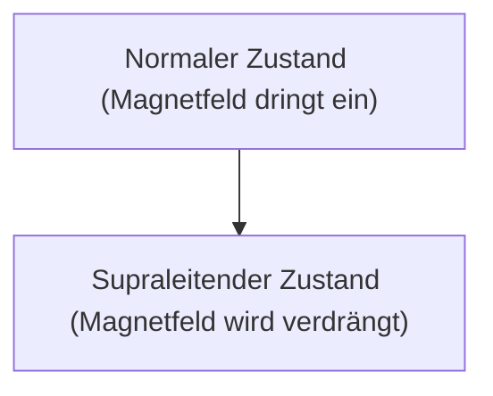

# Physik: Wie Supraleitung funktioniert

Supraleitung ist ein Phänomen, bei dem der elektrische Widerstand null wird.

## Meißner-Effekt

## London-Gleichung
$$ \nabla \times \mathbf{J} = -\frac{n_s e^2}{m} \mathbf{B} $$

## Zusätzliche technische Validierung Teil 1

In diesem Abschnitt gehen wir näher auf weitere technische Details und Fallstudien ein. Wir bewerten die Leistung unter verschiedenen Bedingungen und untersuchen Herausforderungen und Lösungen im Zusammenhang mit der Integration in andere Systeme. Wir betrachten auch zukünftige Perspektiven und Grenzen.

