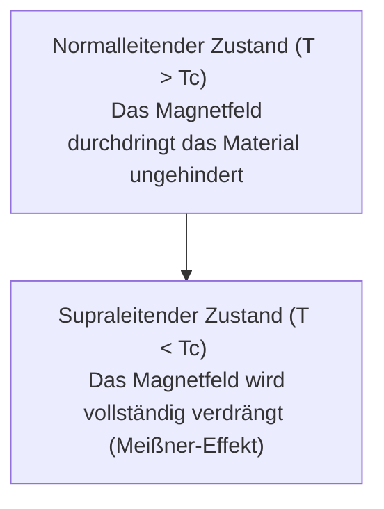

# Physik: Mechanismen der Supraleitung - Vom Meißner-Effekt zur Magnetschwebebahn und Zukunftstechnologien

Unter den physikalischen Phänomenen, welche die Grenzen moderner Hochtechnologie verschieben können, nimmt die **Supraleitung (Superconductivity)** eine Ausnahmestellung ein. Der vollkommene Wegfall des elektrischen Widerstands und die vollständige Verdrängung magnetischer Felder revolutionieren Stromnetze, schienenfreien Hochgeschwindigkeitsverkehr, medizinische Diagnoseverfahren und [Quantencomputer der nächsten Generation](/p/technology-quantum-computer/).

Dieser Artikel bietet eine fundierte physikalische und ingenieurtechnische Abhandlung: Von der Entdeckung im flüssigen Helium und der Elektrodynamik des Meißner-Effekts über die quantenmechanischen Grundlagen der BCS-Theorie und Cooper-Paare bis hin zu Hochtemperatursupraleitern, industriellen Großanwendungen (Maglev, MRT, ITER) und der Suche nach Raumtemperatursupraleitern.

## 1. Was ist Supraleitung? Die historische Entdeckung

Als Supraleitung bezeichnet man den makroskopischen Quantenzustand bestimmter Metalle, Legierungen und keramischer Verbindungen, bei dem der elektrische Gleichstromwiderstand unterhalb einer stoffspezifischen **Sprungtemperatur ($T_c$)** schlagartig auf exakt null absinkt.

In normalen metallischen Leitern wie Kupfer oder Gold kollidieren die Leitungselektronen mit den thermischen Gitterschwingungen (Phononen) und Fremdatomen des Kristallgitters, wodurch elektrische Energie als Joule'sche Wärme dissipiert wird. In einem Supraleiter unterhalb von $T_c$ verschwindet dieser Streuwiderstand vollständig ($R = 0$). Wird in einem geschlossenen supraleitenden Ring ein Strom induziert, fließt dieser ohne externe Energiequelle zeitlich unbegrenzt weiter – ein sogenannter **Dauerstrom (Persistent Current)**.

Dieses Phänomen wurde 1911 von dem niederländischen Physiker **Heike Kamerlingh Onnes** an der Universität Leiden entdeckt. Nachdem es ihm gelungen war, Helium bei 4,2 Kelvin ($-269^\circ\text{C}$) zu verflüssigen, maß er den elektrischen Widerstand von festem Quecksilber und stellte fest, dass dieser bei 4,19 K schlagartig auf einen nicht mehr messbaren Wert absank. Für diesen Meilenstein erhielt Onnes 1913 den Nobelpreis für Physik.

## 2. Der Meißner-Ochsenfeld-Effekt und idealer Diamagnetismus

Supraleitung ist weit mehr als idealisierte Leitfähigkeit. Im Jahr 1933 entdeckten die deutschen Physiker **Walther Meißner** und **Robert Ochsenfeld**, dass Supraleiter eine noch grundlegendere Eigenschaft besitzen: den **idealen Diamagnetismus**, bekannt als **Meißner-Ochsenfeld-Effekt**.

Kühlt man ein Material in einem äußeren Magnetfeld unter seine Sprungtemperatur ab, verdrängt es beim Phasenübergang sämtliche magnetische Flusslinien aktiv aus seinem Inneren. Das äußere Magnetfeld wird gezwungen, das Material außen zu umgehen.

```mermaid
flowchart TD
    A["Normalleitender Zustand (T > Tc) \n Das Magnetfeld durchdringt das Material ungehindert"] --> B["Supraleitender Zustand (T < Tc) \n Das Magnetfeld wird vollständig verdrängt (Meißner-Effekt)"]
```

Zur theoretischen Beschreibung formulierten die Brüder Fritz und Heinz London 1935 die **London-Gleichungen**. Die zweite London-Gleichung verknüpft die supraleitende Stromdichte $\mathbf{J}$ direkt mit der magnetischen Flussdichte $\mathbf{B}$:

$$ \nabla \times \mathbf{J} = -\frac{n_s e^2}{m} \mathbf{B} $$

Hierbei ist:
- $\mathbf{J}$ die supraleitende Stromdichte.
- $n_s$ die Teilchendichte der supraleitenden Ladungsträger.
- $e$ die Elementarladung.
- $m$ die Elektronenmasse.
- $\mathbf{B}$ die magnetische Flussdichte.

Zusammen mit den Maxwell-Gleichungen zeigt sich, dass ein äußeres Magnetfeld nur bis zu einer mikroskopischen Schichttiefe in den Supraleiter eindringen kann – der sogenannten **Londonschen Eindringtiefe ($\lambda_L$)**:

$$ B(x) = B_0 e^{-x / \lambda_L} $$

Im Inneren des Supraleiters herrscht exakt $\mathbf{B} = 0$. Wird ein Permanentmagnet über einen Supraleiter gesetzt, induzieren die Abschirmströme an der Oberfläche ein exakt gleich großes, entgegengerichtetes Gegenfeld, wodurch der Magnet stabil in der Luft schwebt (**Quantenlevitation**).

## 3. Der mikroskopische Mechanismus: BCS-Theorie und Cooper-Paare

Nahezu ein halbes Jahrhundert lang blieb die mikroskopische Ursache der Supraleitung ungeklärt. Erst 1957 gelang **John Bardeen, Leon Cooper und John Robert Schrieffer** mit der **BCS-Theorie** der Durchbruch (Nobelpreis für Physik 1972).

Das Fundament der BCS-Theorie ist die Bildung von **Cooper-Paaren**. Eigentlich stoßen sich Elektronen aufgrund ihrer gleichen negativen elektrischen Ladung ab. Bewegt sich jedoch ein Elektron durch das Kristallgitter bei tiefen Temperaturen, zieht es die positiv geladenen Atomrümpfe an und erzeugt eine winzige elastische Gitterverzerrung (ein Phonon). Bevor das Gitter relaxiert, zieht diese lokale positive Ladungskonzentration ein zweites Elektron mit entgegengesetztem Spin und Impuls an.

Über dieses virtuelle Phonon entsteht eine schwache Netto-Anziehungskraft zwischen den beiden Elektronen:

$$ (\mathbf{k} \uparrow, -\mathbf{k} \downarrow) $$

Da Elektronen Fermionen mit halbzahligem Spin $1/2$ sind, unterliegen sie dem Pauli-Prinzip. Ein Cooper-Paar besitzt jedoch den ganzzahligen Spin 0 und verhält sich wie ein Boson. Unterhalb der Sprungtemperatur kondensieren Milliarden von Cooper-Paaren in einen einzigen makroskopischen Grundzustand (analog zu einem Bose-Einstein-Kondensat). Alle Paare bewegen sich im Gleichtakt einer makroskopischen quantenmechanischen Wellenfunktion. Um diesen kollektiven Zustand zu stören, müsste eine endliche Energielücke ($\Delta$) überwunden werden. Bei tiefen Temperaturen reicht die thermische Energie dafür nicht aus – der Strom fließt ohne jeden Widerstand.

## 4. Hochtemperatursupraleiter (HTS)

Gemäß der klassischen BCS-Theorie galt eine Obergrenze für phononvermittelte Supraleitung von etwa 30 bis 40 K (das sogenannte McMillan-Limit).

Im Jahr 1986 entdeckten **Johannes Georg Bednorz** und **Karl Alexander Müller** im IBM-Forschungslabor Zürich Supraleitung bei 35 K in einer Lanthan-Barium-Kupferoxid-Keramik (Cuprat). Dieser Durchbruch brachte ihnen bereits 1987 den Nobelpreis ein.

Noch im selben Jahr gelang die Synthese von **YBCO (Yttrium-Barium-Kupferoxid)** mit einer Sprungtemperatur von 93 K. Damit wurde erstmals der **Siedepunkt von flüssigem Stickstoff (77 K / $-196^\circ\text{C}$)** überschritten. Da flüssiger Stickstoff unkritisch in der Handhabung und um ein Vielfaches günstiger als flüssiges Helium ist, eröffnete dies den Weg für die industrielle Nutzung der Supraleitung.

Die genaue mikroskopische Ursache der Hochtemperatursupraleitung in Cupraten ist bis heute nicht abschließend verstanden. Starke Elektronenkorrelationen und antiferromagnetische Spinfluktuationen spielen eine Schlüsselrolle – eines der faszinierendsten ungelösten Rätsel der modernen Festkörperphysik.

## 5. Technische Anwendungen in Wissenschaft und Industrie

Die Eigenschaft, gigantische Stromstärken verlustfrei zu transportieren und extrem starke Magnetfelder zu erzeugen, macht Supraleiter unersetzlich:

### 5.1 Supraleitende Magnetschwebebahnen (SCMaglev)
Die japanische **SCMaglev** nutzt fahrzeugseitige Niob-Titan-Spulen (NbTi), die mit flüssigem Helium gekühlt werden. Durch Dauerströme erzeugen sie Magnetfelder von mehreren Tesla, die mit den Spulen der Trasse interagieren. Der Zug schwebt 10 cm über der Fahrbahn und erreicht im Regelbetrieb Geschwindigkeiten von über **500 km/h (Weltrekord: 603 km/h)** völlig kontakt- und reibungsfrei.

### 5.2 Magnetresonanztomographie (MRT)
Klinische MRT-Scanner benötigen homogene, ultrastabile Magnetfelder von 1,5 bis 3,0 Tesla (in der Spitzenforschung bis zu 7T). Supraleitende Spulen halten diese gewaltigen Felder über Jahre hinweg ohne Stromzufuhr und Wärmeverluste aufrecht und ermöglichen millimetergenaue Aufnahmen weicher Gewebe.

### 5.3 Teilchenbeschleuniger und Fusionsreaktoren
Am CERN führt der **Large Hadron Collider (LHC)** Protonen über einen 27 Kilometer langen Ring aus mehr als 1.200 supraleitenden Dipolmagneten bei 99,999999% der Lichtgeschwindigkeit. Bei der Kernfusion setzt der Versuchsreaktor **ITER** gigantische Spulen aus Niob-Zinn ($Nb_3Sn$) ein, um ein über 100 Millionen Grad heißes Fusionsplasma in einem 13-Tesla-Magnetkäfig berührungslos einzuschließen.

### 5.4 Supraleitende Quantencomputer
Die führenden Quantenprozessoren von Google und IBM basieren auf supraleitenden Schaltkreisen. Mittels **Josephson-Kontakten** (dünnen Isolatorschichten zwischen Supraleitern) werden künstliche Qubits realisiert, deren Überlagerungs- und Verschränkungszustände in Millikelvin-Kühlsystemen gesteuert werden.

## 6. Das Fernziel: Raumtemperatursupraleitung

Das größte Hindernis für den breiten Einsatz der Supraleitung sind die Kosten und der Aufwand für kryogene Kühlsysteme.

Die Entdeckung eines echten **Raumtemperatursupraleiters bei Normaldruck ($T_c > 300\text{ K}$, $P = 1\text{ atm}$)** würde eine neue industrielle Revolution auslösen:
- **Verlustfreie Stromnetze**: Die weltweiten Leitungsverluste von 5–10% bei der Hochspannungsübertragung entfielen komplett.
- **Wärmefreie Mikrochips**: Prozessoren ohne Überhitzungsprobleme mit Taktraten im Terahertzbereich.
- **Supraleitende magnetische Energiespeicher (SMES)**: Verlustfreie Speicherung von Gigawattstunden Ökostrom mit nahezu 100% Wirkungsgrad.

In den letzten Jahren erzielten Forscher mit Diamantstempelzellen bei extremen Drücken von über 1,5 Millionen Atmosphären in wasserstoffreichen Hydriden ($H_3S$, $LaH_{10}$) Sprungtemperaturen von bis zu 250 K ($-23^\circ\text{C}$). Die Herausforderung besteht nun darin, diese metastabilen Zustände unter Umgebungsdruck zu reproduzieren.

## Fazit: Makroskopische Quantenphysik im Alltag

Die Supraleitung beweist, dass die faszinierenden Gesetze der Quantenmechanik direkt in unserer makroskopischen Alltagswelt erfahrbar sein können. Von Onnes' Quecksilbertropfen im Jahr 1911 bis zu Fusionsreaktoren und Quantenchips bleibt die Supraleitung einer der kraftvollsten Treiber technologischer Innovation.
