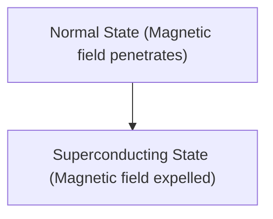

# Physics: How Superconductivity Works

Superconductivity is a phenomenon where electrical resistance becomes zero.

## Meissner Effect

## London Equation
$$ \nabla \times \mathbf{J} = -\frac{n_s e^2}{m} \mathbf{B} $$

