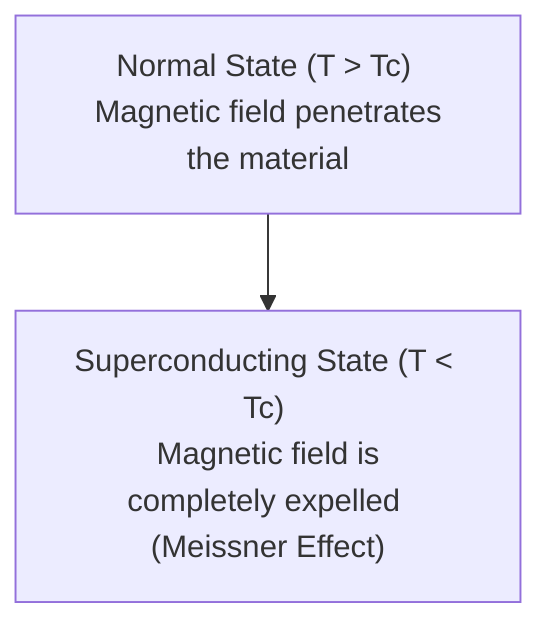

# Physics: Mechanisms of Superconductivity - From the Meissner Effect to Maglev and Future Technologies

Among the physical phenomena capable of shattering the limits of modern technology, few hold the transformative potential of **Superconductivity**. The seemingly magical properties of zero electrical resistance and the complete expulsion of magnetic fields are revolutionizing social infrastructure, cutting-edge medical diagnostics, particle physics, and [next-generation quantum computers](/p/technology-quantum-computer/).

This article presents a comprehensive exploration of superconductivity from a professional physics and technology perspective: its dramatic historical discovery, macroscopic electrodynamics and the Meissner effect, microscopic mechanisms governed by the BCS theory and Cooper pairs, high-temperature cuprates, practical applications (Maglev, MRI, CERN, ITER), and the quest for room-temperature superconductivity.

## 1. What is Superconductivity? A Dramatic Discovery

Superconductivity is a macroscopic quantum state exhibited by certain metals, alloys, and ceramic compounds when cooled below a characteristic **critical temperature ($T_c$)**, characterized by the sudden and complete vanishing of DC electrical resistance.

In ordinary metallic conductors (such as copper or gold), valence electrons scattering against vibrating lattice ions (phonons) and structural impurities dissipate energy as Joule heating. In a superconductor below $T_c$, this resistance vanishes entirely ($R = 0$). Electric currents induced in a closed superconducting ring circulate indefinitely without any external power source—a state known as a **persistent current**.

This phenomenon was discovered in 1911 by Dutch physicist **Heike Kamerlingh Onnes** at Leiden University. Having succeeded in liquefying helium at 4.2 Kelvin ($-269^\circ\text{C}$), Onnes measured the electrical resistance of solid mercury and observed that its resistance dropped abruptly to unmeasurable levels at 4.19 K. For this breakthrough, Onnes was awarded the Nobel Prize in Physics in 1913.

## 2. The Meissner Effect and Perfect Diamagnetism

Superconductivity is not merely ideal electrical conductivity. In 1933, German physicists **Walther Meissner** and **Robert Ochsenfeld** discovered that superconductors exhibit an even more fundamental property: **perfect diamagnetism**, known as the **Meissner Effect**.

When a material transitions into the superconducting state in the presence of an applied magnetic field, it actively expels all magnetic flux lines from its interior. Instead of penetrating the body, external magnetic field lines bend around the superconductor's exterior.

```mermaid
flowchart TD
    A["Normal State (T > Tc) \n Magnetic field penetrates the material"] --> B["Superconducting State (T < Tc) \n Magnetic field is completely expelled (Meissner Effect)"]
```

To mathematically describe this behavior, brothers Fritz and Heinz London formulated the **London Equations** in 1935. The second London equation relates the superconducting current density $\mathbf{J}$ directly to the magnetic flux density $\mathbf{B}$:

$$ \nabla \times \mathbf{J} = -\frac{n_s e^2}{m} \mathbf{B} $$

Where:
- $\mathbf{J}$ represents the superconducting current density.
- $n_s$ is the number density of superconducting charge carriers.
- $e$ is the elementary electric charge.
- $m$ is the mass of the electron.
- $\mathbf{B}$ is the magnetic flux density.

Combined with Maxwell's equations, this demonstrates that external magnetic fields decay exponentially inside a superconductor over a characteristic depth known as the **London penetration depth ($\lambda_L$)**:

$$ B(x) = B_0 e^{-x / \lambda_L} $$

Because the interior magnetic field is strictly zero ($\mathbf{B} = 0$), placing a permanent magnet above a superconductor induces screening supercurrents that generate an equal and opposing magnetic field, resulting in stable **magnetic levitation**.

## 3. The Microscopic Mechanism: The BCS Theory and Cooper Pairs

For nearly half a century following Onnes's discovery, the microscopic origin of superconductivity remained an enigma. In 1957, **John Bardeen, Leon Cooper, and John Robert Schrieffer** formulated the microscopic **BCS Theory**, earning the 1972 Nobel Prize in Physics.

The cornerstone of the BCS theory is the formation of **Cooper pairs**. Normally, two electrons repel each other due to Coulomb repulsion. However, in a crystalline lattice at cryogenic temperatures, an electron traveling through the lattice attracts positively charged atomic nuclei, creating a slight, localized distortion (a virtual phonon). Before the lattice relaxes, this concentration of positive charge attracts a second electron with opposite spin and momentum.

This phonon-mediated interaction generates a net attractive potential between two electrons:

$$ (\mathbf{k} \uparrow, -\mathbf{k} \downarrow) $$

While individual electrons are fermions (possessing half-integer spin $1/2$), a Cooper pair behaves as a composite boson (possessing integer spin $0$). Below $T_c$, millions of Cooper pairs condense into a single, macroscopic quantum ground state analogous to a **Bose-Einstein condensate**. The paired electrons move in phase as a single macroscopic wave function. Because breaking this coherent state requires overcoming a finite energy gap ($\Delta$), the pairs pass through the lattice without scattering against thermal phonons or defects, yielding zero electrical resistance.

## 4. High-Temperature Superconductors (HTS)

The conventional BCS theory predicted that phonon-mediated superconductivity could not survive above approximately 30–40 K (the so-called McMillan / BCS limit).

In 1986, **Johannes Georg Bednorz** and **Karl Alexander Müller** at IBM Zurich shattered this limit by discovering superconductivity at 35 K in a ceramic barium-lanthanum-copper oxide (cuprate), winning the Nobel Prize in 1987.

In 1987, researchers discovered **YBCO (Yttrium Barium Copper Oxide)**, with a critical temperature of 93 K. This surpassed the boiling point of liquid nitrogen (77 K / $-196^\circ\text{C}$). Liquid nitrogen is abundant, non-toxic, and orders of magnitude cheaper than liquid helium, opening the door to widespread industrial applications.

High-temperature cuprate superconductivity cannot be fully explained by conventional phonon-mediated BCS theory alone. Strongly correlated d-electron interactions and antiferromagnetic spin fluctuations play a pivotal role, representing one of the greatest unsolved frontiers in condensed matter physics.

## 5. Practical Applications: From Maglev to Quantum Processors

The ability to carry massive electric currents without resistive heat generation and generate intense magnetic fields has unlocked revolutionary engineering applications:

### 5.1 Superconducting Maglev Trains
Japan's **SCMaglev (Superconducting Maglev)** uses onboard niobium-titanium (NbTi) superconducting coils cooled to liquid helium temperatures. Persistent currents generate multi-Tesla magnetic fields that interact with figure-eight ground coils in the guideway, levitating the train 10 cm above the track and propelling it to commercial speeds exceeding **500 km/h (record 603 km/h)** with zero track friction and minimal acoustic footprint.

### 5.2 Medical Magnetic Resonance Imaging (MRI)
Hospital MRI scanners require highly stable, homogeneous magnetic fields of 1.5 to 3.0 Tesla (and up to 7T for neurological research). Superconducting solenoids maintained in liquid helium cryostats maintain these colossal fields continuously with zero power dissipation, enabling sub-millimeter non-invasive imaging of soft human tissues.

### 5.3 Particle Accelerators and Fusion Energy
At CERN's **Large Hadron Collider (LHC)**, more than 1,200 superconducting dipole magnets steer relativistic protons along a 27-kilometer ring at 99.999999% of the speed of light. In nuclear fusion research, experimental reactors such as **ITER** rely on enormous niobium-tin ($Nb_3Sn$) superconducting magnetic coils to generate 13-Tesla magnetic cages capable of confining burning fusion plasmas exceeding 100 million degrees Celsius.

### 5.4 Superconducting Quantum Computing
Leading quantum computing architectures—including Google's Sycamore and IBM's Quantum Eagle and Condor—are built upon superconducting circuits. By utilizing **Josephson junctions** (thin insulating barriers between two superconductors), engineers engineer artificial two-level quantum states (qubits). Superconducting circuits operate in dilution refrigerators at millikelvin temperatures, exploiting quantum superposition and entanglement to execute complex algorithms exponentially faster than classical supercomputers.

## 6. The Quest for Room-Temperature Superconductivity

The holy grail of modern condensed matter physics is a **Room-Temperature Superconductor (RTS)** that operates under ambient pressure ($T_c > 300\text{ K}$, $P = 1\text{ atm}$).

Achieving room-temperature superconductivity would transform human civilization:
- **Zero Loss Power Grids**: Eliminates transmission losses (which currently consume 5–10% of generated electricity worldwide).
- **Ultrafast Electronics**: Microchips free from Joule heating, operating at terahertz frequencies.
- **Revolutionary Energy Storage**: Compact Superconducting Magnetic Energy Storage (SMES) storing gigawatt-hours with near 100% round-trip efficiency.

Recent experimental breakthroughs have focused on hydrogen-rich polyhydrides ($H_3S$, $LaH_{10}$) compressed in diamond anvil cells, observing superconductivity near $250\text{ K}$ ($-23^\circ\text{C}$) under extreme pressures exceeding 1.5 million atmospheres. The ultimate technological challenge remains finding a stable material that retains this property at ambient atmospheric pressure.

## Conclusion: A Macroscopic Window into the Quantum World

Superconductivity stands as one of physics' most awe-inspiring manifestations: quantum coherence visible not through a microscope, but suspended in thin air as a magnet floats effortlessly in space.

From Kamerlingh Onnes's mercury drops in 1911 to the levitating Maglev trains and superconducting quantum processors of the 21st century, the journey of superconductivity illustrates the profound power of foundational science to reshape human society. As condensed matter physicists push toward ambient-condition superconductors, we stand on the threshold of a new energetic and technological epoch.
