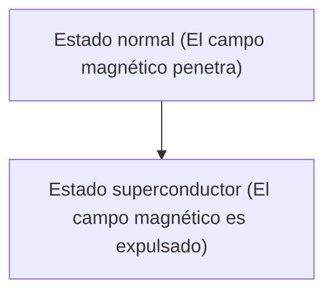

# Física: Mecanismo de la superconductividad

La superconductividad es un fenómeno en el que la resistencia eléctrica se vuelve cero.

## Efecto Meissner

## Ecuaciones de London
$$ \nabla \times \mathbf{J} = -\frac{n_s e^2}{m} \mathbf{B} $$

## Parte de verificación técnica adicional 1

En esta sección, profundizamos en más detalles técnicos y estudios de casos. Evaluamos el rendimiento en diversas condiciones y exploramos los desafíos y soluciones para la integración con otros sistemas. También consideramos perspectivas y limitaciones futuras.

