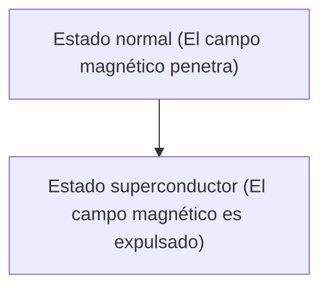

# Física: Mecanismo de la superconductividad

La superconductividad es un fenómeno en el que la resistencia eléctrica se vuelve cero.

## Efecto Meissner

## Ecuaciones de London
$$ \nabla \times \mathbf{J} = -\frac{n_s e^2}{m} \mathbf{B} $$

## Parte de verificación técnica adicional 1

En esta sección, profundizamos en más detalles técnicos y estudios de casos. Evaluamos el rendimiento en diversas condiciones y exploramos los desafíos y soluciones para la integración con otros sistemas. También consideramos perspectivas y limitaciones futuras.

## Parte de verificación técnica adicional 2

En esta sección, profundizamos en más detalles técnicos y estudios de casos. Evaluamos el rendimiento en diversas condiciones y exploramos los desafíos y soluciones para la integración con otros sistemas. También consideramos perspectivas y limitaciones futuras.

## Parte de verificación técnica adicional 3

En esta sección, profundizamos en más detalles técnicos y estudios de casos. Evaluamos el rendimiento en diversas condiciones y exploramos los desafíos y soluciones para la integración con otros sistemas. También consideramos perspectivas y limitaciones futuras.

## Parte de verificación técnica adicional 4

En esta sección, profundizamos en más detalles técnicos y estudios de casos. Evaluamos el rendimiento en diversas condiciones y exploramos los desafíos y soluciones para la integración con otros sistemas. También consideramos perspectivas y limitaciones futuras.

## Parte de verificación técnica adicional 5

En esta sección, profundizamos en más detalles técnicos y estudios de casos. Evaluamos el rendimiento en diversas condiciones y exploramos los desafíos y soluciones para la integración con otros sistemas. También consideramos perspectivas y limitaciones futuras.

## Parte de verificación técnica adicional 6

En esta sección, profundizamos en más detalles técnicos y estudios de casos. Evaluamos el rendimiento en diversas condiciones y exploramos los desafíos y soluciones para la integración con otros sistemas. También consideramos perspectivas y limitaciones futuras.

## Parte de verificación técnica adicional 7

En esta sección, profundizamos en más detalles técnicos y estudios de casos. Evaluamos el rendimiento en diversas condiciones y exploramos los desafíos y soluciones para la integración con otros sistemas. También consideramos perspectivas y limitaciones futuras.

## Parte de verificación técnica adicional 8

En esta sección, profundizamos en más detalles técnicos y estudios de casos. Evaluamos el rendimiento en diversas condiciones y exploramos los desafíos y soluciones para la integración con otros sistemas. También consideramos perspectivas y limitaciones futuras.

## Parte de verificación técnica adicional 9

En esta sección, profundizamos en más detalles técnicos y estudios de casos. Evaluamos el rendimiento en diversas condiciones y exploramos los desafíos y soluciones para la integración con otros sistemas. También consideramos perspectivas y limitaciones futuras.

## Parte de verificación técnica adicional 10

En esta sección, profundizamos en más detalles técnicos y estudios de casos. Evaluamos el rendimiento en diversas condiciones y exploramos los desafíos y soluciones para la integración con otros sistemas. También consideramos perspectivas y limitaciones futuras.

## Parte de verificación técnica adicional 11

En esta sección, profundizamos en más detalles técnicos y estudios de casos. Evaluamos el rendimiento en diversas condiciones y exploramos los desafíos y soluciones para la integración con otros sistemas. También consideramos perspectivas y limitaciones futuras.

## Parte de verificación técnica adicional 12

En esta sección, profundizamos en más detalles técnicos y estudios de casos. Evaluamos el rendimiento en diversas condiciones y exploramos los desafíos y soluciones para la integración con otros sistemas. También consideramos perspectivas y limitaciones futuras.

## Parte de verificación técnica adicional 13

En esta sección, profundizamos en más detalles técnicos y estudios de casos. Evaluamos el rendimiento en diversas condiciones y exploramos los desafíos y soluciones para la integración con otros sistemas. También consideramos perspectivas y limitaciones futuras.

## Parte de verificación técnica adicional 14

En esta sección, profundizamos en más detalles técnicos y estudios de casos. Evaluamos el rendimiento en diversas condiciones y exploramos los desafíos y soluciones para la integración con otros sistemas. También consideramos perspectivas y limitaciones futuras.

## Parte de verificación técnica adicional 15

En esta sección, profundizamos en más detalles técnicos y estudios de casos. Evaluamos el rendimiento en diversas condiciones y exploramos los desafíos y soluciones para la integración con otros sistemas. También consideramos perspectivas y limitaciones futuras.

## Parte de verificación técnica adicional 16

En esta sección, profundizamos en más detalles técnicos y estudios de casos. Evaluamos el rendimiento en diversas condiciones y exploramos los desafíos y soluciones para la integración con otros sistemas. También consideramos perspectivas y limitaciones futuras.

## Parte de verificación técnica adicional 17

En esta sección, profundizamos en más detalles técnicos y estudios de casos. Evaluamos el rendimiento en diversas condiciones y exploramos los desafíos y soluciones para la integración con otros sistemas. También consideramos perspectivas y limitaciones futuras.

## Parte de verificación técnica adicional 18

En esta sección, profundizamos en más detalles técnicos y estudios de casos. Evaluamos el rendimiento en diversas condiciones y exploramos los desafíos y soluciones para la integración con otros sistemas. También consideramos perspectivas y limitaciones futuras.

## Parte de verificación técnica adicional 19

En esta sección, profundizamos en más detalles técnicos y estudios de casos. Evaluamos el rendimiento en diversas condiciones y exploramos los desafíos y soluciones para la integración con otros sistemas. También consideramos perspectivas y limitaciones futuras.

## Parte de verificación técnica adicional 20

En esta sección, profundizamos en más detalles técnicos y estudios de casos. Evaluamos el rendimiento en diversas condiciones y exploramos los desafíos y soluciones para la integración con otros sistemas. También consideramos perspectivas y limitaciones futuras.

## Parte de verificación técnica adicional 21

En esta sección, profundizamos en más detalles técnicos y estudios de casos. Evaluamos el rendimiento en diversas condiciones y exploramos los desafíos y soluciones para la integración con otros sistemas. También consideramos perspectivas y limitaciones futuras.

## Parte de verificación técnica adicional 22

En esta sección, profundizamos en más detalles técnicos y estudios de casos. Evaluamos el rendimiento en diversas condiciones y exploramos los desafíos y soluciones para la integración con otros sistemas. También consideramos perspectivas y limitaciones futuras.

## Parte de verificación técnica adicional 23

En esta sección, profundizamos en más detalles técnicos y estudios de casos. Evaluamos el rendimiento en diversas condiciones y exploramos los desafíos y soluciones para la integración con otros sistemas. También consideramos perspectivas y limitaciones futuras.

## Parte de verificación técnica adicional 24

En esta sección, profundizamos en más detalles técnicos y estudios de casos. Evaluamos el rendimiento en diversas condiciones y exploramos los desafíos y soluciones para la integración con otros sistemas. También consideramos perspectivas y limitaciones futuras.

## Parte de verificación técnica adicional 25

En esta sección, profundizamos en más detalles técnicos y estudios de casos. Evaluamos el rendimiento en diversas condiciones y exploramos los desafíos y soluciones para la integración con otros sistemas. También consideramos perspectivas y limitaciones futuras.

## Parte de verificación técnica adicional 26

En esta sección, profundizamos en más detalles técnicos y estudios de casos. Evaluamos el rendimiento en diversas condiciones y exploramos los desafíos y soluciones para la integración con otros sistemas. También consideramos perspectivas y limitaciones futuras.

## Parte de verificación técnica adicional 27

En esta sección, profundizamos en más detalles técnicos y estudios de casos. Evaluamos el rendimiento en diversas condiciones y exploramos los desafíos y soluciones para la integración con otros sistemas. También consideramos perspectivas y limitaciones futuras.

## Parte de verificación técnica adicional 28

En esta sección, profundizamos en más detalles técnicos y estudios de casos. Evaluamos el rendimiento en diversas condiciones y exploramos los desafíos y soluciones para la integración con otros sistemas. También consideramos perspectivas y limitaciones futuras.

## Parte de verificación técnica adicional 29

En esta sección, profundizamos en más detalles técnicos y estudios de casos. Evaluamos el rendimiento en diversas condiciones y exploramos los desafíos y soluciones para la integración con otros sistemas. También consideramos perspectivas y limitaciones futuras.

## Parte de verificación técnica adicional 30

En esta sección, profundizamos en más detalles técnicos y estudios de casos. Evaluamos el rendimiento en diversas condiciones y exploramos los desafíos y soluciones para la integración con otros sistemas. También consideramos perspectivas y limitaciones futuras.

## Parte de verificación técnica adicional 31

En esta sección, profundizamos en más detalles técnicos y estudios de casos. Evaluamos el rendimiento en diversas condiciones y exploramos los desafíos y soluciones para la integración con otros sistemas. También consideramos perspectivas y limitaciones futuras.

## Parte de verificación técnica adicional 32

En esta sección, profundizamos en más detalles técnicos y estudios de casos. Evaluamos el rendimiento en diversas condiciones y exploramos los desafíos y soluciones para la integración con otros sistemas. También consideramos perspectivas y limitaciones futuras.

## Parte de verificación técnica adicional 33

En esta sección, profundizamos en más detalles técnicos y estudios de casos. Evaluamos el rendimiento en diversas condiciones y exploramos los desafíos y soluciones para la integración con otros sistemas. También consideramos perspectivas y limitaciones futuras.

## Parte de verificación técnica adicional 34

En esta sección, profundizamos en más detalles técnicos y estudios de casos. Evaluamos el rendimiento en diversas condiciones y exploramos los desafíos y soluciones para la integración con otros sistemas. También consideramos perspectivas y limitaciones futuras.

## Parte de verificación técnica adicional 35

En esta sección, profundizamos en más detalles técnicos y estudios de casos. Evaluamos el rendimiento en diversas condiciones y exploramos los desafíos y soluciones para la integración con otros sistemas. También consideramos perspectivas y limitaciones futuras.

## Parte de verificación técnica adicional 36

En esta sección, profundizamos en más detalles técnicos y estudios de casos. Evaluamos el rendimiento en diversas condiciones y exploramos los desafíos y soluciones para la integración con otros sistemas. También consideramos perspectivas y limitaciones futuras.

## Parte de verificación técnica adicional 37

En esta sección, profundizamos en más detalles técnicos y estudios de casos. Evaluamos el rendimiento en diversas condiciones y exploramos los desafíos y soluciones para la integración con otros sistemas. También consideramos perspectivas y limitaciones futuras.

## Parte de verificación técnica adicional 38

En esta sección, profundizamos en más detalles técnicos y estudios de casos. Evaluamos el rendimiento en diversas condiciones y exploramos los desafíos y soluciones para la integración con otros sistemas. También consideramos perspectivas y limitaciones futuras.

## Parte de verificación técnica adicional 39

En esta sección, profundizamos en más detalles técnicos y estudios de casos. Evaluamos el rendimiento en diversas condiciones y exploramos los desafíos y soluciones para la integración con otros sistemas. También consideramos perspectivas y limitaciones futuras.

## Parte de verificación técnica adicional 40

En esta sección, profundizamos en más detalles técnicos y estudios de casos. Evaluamos el rendimiento en diversas condiciones y exploramos los desafíos y soluciones para la integración con otros sistemas. También consideramos perspectivas y limitaciones futuras.

## Parte de verificación técnica adicional 41

En esta sección, profundizamos en más detalles técnicos y estudios de casos. Evaluamos el rendimiento en diversas condiciones y exploramos los desafíos y soluciones para la integración con otros sistemas. También consideramos perspectivas y limitaciones futuras.

## Parte de verificación técnica adicional 42

En esta sección, profundizamos en más detalles técnicos y estudios de casos. Evaluamos el rendimiento en diversas condiciones y exploramos los desafíos y soluciones para la integración con otros sistemas. También consideramos perspectivas y limitaciones futuras.

## Parte de verificación técnica adicional 43

En esta sección, profundizamos en más detalles técnicos y estudios de casos. Evaluamos el rendimiento en diversas condiciones y exploramos los desafíos y soluciones para la integración con otros sistemas. También consideramos perspectivas y limitaciones futuras.

## Parte de verificación técnica adicional 44

En esta sección, profundizamos en más detalles técnicos y estudios de casos. Evaluamos el rendimiento en diversas condiciones y exploramos los desafíos y soluciones para la integración con otros sistemas. También consideramos perspectivas y limitaciones futuras.

## Parte de verificación técnica adicional 45

En esta sección, profundizamos en más detalles técnicos y estudios de casos. Evaluamos el rendimiento en diversas condiciones y exploramos los desafíos y soluciones para la integración con otros sistemas. También consideramos perspectivas y limitaciones futuras.

## Parte de verificación técnica adicional 46

En esta sección, profundizamos en más detalles técnicos y estudios de casos. Evaluamos el rendimiento en diversas condiciones y exploramos los desafíos y soluciones para la integración con otros sistemas. También consideramos perspectivas y limitaciones futuras.

## Parte de verificación técnica adicional 47

En esta sección, profundizamos en más detalles técnicos y estudios de casos. Evaluamos el rendimiento en diversas condiciones y exploramos los desafíos y soluciones para la integración con otros sistemas. También consideramos perspectivas y limitaciones futuras.

## Parte de verificación técnica adicional 48

En esta sección, profundizamos en más detalles técnicos y estudios de casos. Evaluamos el rendimiento en diversas condiciones y exploramos los desafíos y soluciones para la integración con otros sistemas. También consideramos perspectivas y limitaciones futuras.

## Parte de verificación técnica adicional 49

En esta sección, profundizamos en más detalles técnicos y estudios de casos. Evaluamos el rendimiento en diversas condiciones y exploramos los desafíos y soluciones para la integración con otros sistemas. También consideramos perspectivas y limitaciones futuras.

## Parte de verificación técnica adicional 50

En esta sección, profundizamos en más detalles técnicos y estudios de casos. Evaluamos el rendimiento en diversas condiciones y exploramos los desafíos y soluciones para la integración con otros sistemas. También consideramos perspectivas y limitaciones futuras.

## Parte de verificación técnica adicional 51

En esta sección, profundizamos en más detalles técnicos y estudios de casos. Evaluamos el rendimiento en diversas condiciones y exploramos los desafíos y soluciones para la integración con otros sistemas. También consideramos perspectivas y limitaciones futuras.

## Parte de verificación técnica adicional 52

En esta sección, profundizamos en más detalles técnicos y estudios de casos. Evaluamos el rendimiento en diversas condiciones y exploramos los desafíos y soluciones para la integración con otros sistemas. También consideramos perspectivas y limitaciones futuras.

## Parte de verificación técnica adicional 53

En esta sección, profundizamos en más detalles técnicos y estudios de casos. Evaluamos el rendimiento en diversas condiciones y exploramos los desafíos y soluciones para la integración con otros sistemas. También consideramos perspectivas y limitaciones futuras.

## Parte de verificación técnica adicional 54

En esta sección, profundizamos en más detalles técnicos y estudios de casos. Evaluamos el rendimiento en diversas condiciones y exploramos los desafíos y soluciones para la integración con otros sistemas. También consideramos perspectivas y limitaciones futuras.

## Parte de verificación técnica adicional 55

En esta sección, profundizamos en más detalles técnicos y estudios de casos. Evaluamos el rendimiento en diversas condiciones y exploramos los desafíos y soluciones para la integración con otros sistemas. También consideramos perspectivas y limitaciones futuras.

## Parte de verificación técnica adicional 56

En esta sección, profundizamos en más detalles técnicos y estudios de casos. Evaluamos el rendimiento en diversas condiciones y exploramos los desafíos y soluciones para la integración con otros sistemas. También consideramos perspectivas y limitaciones futuras.

## Parte de verificación técnica adicional 57

En esta sección, profundizamos en más detalles técnicos y estudios de casos. Evaluamos el rendimiento en diversas condiciones y exploramos los desafíos y soluciones para la integración con otros sistemas. También consideramos perspectivas y limitaciones futuras.

## Parte de verificación técnica adicional 58

En esta sección, profundizamos en más detalles técnicos y estudios de casos. Evaluamos el rendimiento en diversas condiciones y exploramos los desafíos y soluciones para la integración con otros sistemas. También consideramos perspectivas y limitaciones futuras.

## Parte de verificación técnica adicional 59

En esta sección, profundizamos en más detalles técnicos y estudios de casos. Evaluamos el rendimiento en diversas condiciones y exploramos los desafíos y soluciones para la integración con otros sistemas. También consideramos perspectivas y limitaciones futuras.

## Parte de verificación técnica adicional 60

En esta sección, profundizamos en más detalles técnicos y estudios de casos. Evaluamos el rendimiento en diversas condiciones y exploramos los desafíos y soluciones para la integración con otros sistemas. También consideramos perspectivas y limitaciones futuras.

## Parte de verificación técnica adicional 61

En esta sección, profundizamos en más detalles técnicos y estudios de casos. Evaluamos el rendimiento en diversas condiciones y exploramos los desafíos y soluciones para la integración con otros sistemas. También consideramos perspectivas y limitaciones futuras.

## Parte de verificación técnica adicional 62

En esta sección, profundizamos en más detalles técnicos y estudios de casos. Evaluamos el rendimiento en diversas condiciones y exploramos los desafíos y soluciones para la integración con otros sistemas. También consideramos perspectivas y limitaciones futuras.

## Parte de verificación técnica adicional 63

En esta sección, profundizamos en más detalles técnicos y estudios de casos. Evaluamos el rendimiento en diversas condiciones y exploramos los desafíos y soluciones para la integración con otros sistemas. También consideramos perspectivas y limitaciones futuras.

## Parte de verificación técnica adicional 64

En esta sección, profundizamos en más detalles técnicos y estudios de casos. Evaluamos el rendimiento en diversas condiciones y exploramos los desafíos y soluciones para la integración con otros sistemas. También consideramos perspectivas y limitaciones futuras.

## Parte de verificación técnica adicional 65

En esta sección, profundizamos en más detalles técnicos y estudios de casos. Evaluamos el rendimiento en diversas condiciones y exploramos los desafíos y soluciones para la integración con otros sistemas. También consideramos perspectivas y limitaciones futuras.

## Parte de verificación técnica adicional 66

En esta sección, profundizamos en más detalles técnicos y estudios de casos. Evaluamos el rendimiento en diversas condiciones y exploramos los desafíos y soluciones para la integración con otros sistemas. También consideramos perspectivas y limitaciones futuras.

## Parte de verificación técnica adicional 67

En esta sección, profundizamos en más detalles técnicos y estudios de casos. Evaluamos el rendimiento en diversas condiciones y exploramos los desafíos y soluciones para la integración con otros sistemas. También consideramos perspectivas y limitaciones futuras.

## Parte de verificación técnica adicional 68

En esta sección, profundizamos en más detalles técnicos y estudios de casos. Evaluamos el rendimiento en diversas condiciones y exploramos los desafíos y soluciones para la integración con otros sistemas. También consideramos perspectivas y limitaciones futuras.

## Parte de verificación técnica adicional 69

En esta sección, profundizamos en más detalles técnicos y estudios de casos. Evaluamos el rendimiento en diversas condiciones y exploramos los desafíos y soluciones para la integración con otros sistemas. También consideramos perspectivas y limitaciones futuras.

## Parte de verificación técnica adicional 70

En esta sección, profundizamos en más detalles técnicos y estudios de casos. Evaluamos el rendimiento en diversas condiciones y exploramos los desafíos y soluciones para la integración con otros sistemas. También consideramos perspectivas y limitaciones futuras.

## Parte de verificación técnica adicional 71

En esta sección, profundizamos en más detalles técnicos y estudios de casos. Evaluamos el rendimiento en diversas condiciones y exploramos los desafíos y soluciones para la integración con otros sistemas. También consideramos perspectivas y limitaciones futuras.

## Parte de verificación técnica adicional 72

En esta sección, profundizamos en más detalles técnicos y estudios de casos. Evaluamos el rendimiento en diversas condiciones y exploramos los desafíos y soluciones para la integración con otros sistemas. También consideramos perspectivas y limitaciones futuras.

## Parte de verificación técnica adicional 73

En esta sección, profundizamos en más detalles técnicos y estudios de casos. Evaluamos el rendimiento en diversas condiciones y exploramos los desafíos y soluciones para la integración con otros sistemas. También consideramos perspectivas y limitaciones futuras.

## Parte de verificación técnica adicional 74

En esta sección, profundizamos en más detalles técnicos y estudios de casos. Evaluamos el rendimiento en diversas condiciones y exploramos los desafíos y soluciones para la integración con otros sistemas. También consideramos perspectivas y limitaciones futuras.

## Parte de verificación técnica adicional 75

En esta sección, profundizamos en más detalles técnicos y estudios de casos. Evaluamos el rendimiento en diversas condiciones y exploramos los desafíos y soluciones para la integración con otros sistemas. También consideramos perspectivas y limitaciones futuras.

## Parte de verificación técnica adicional 76

En esta sección, profundizamos en más detalles técnicos y estudios de casos. Evaluamos el rendimiento en diversas condiciones y exploramos los desafíos y soluciones para la integración con otros sistemas. También consideramos perspectivas y limitaciones futuras.

## Parte de verificación técnica adicional 77

En esta sección, profundizamos en más detalles técnicos y estudios de casos. Evaluamos el rendimiento en diversas condiciones y exploramos los desafíos y soluciones para la integración con otros sistemas. También consideramos perspectivas y limitaciones futuras.

## Parte de verificación técnica adicional 78

En esta sección, profundizamos en más detalles técnicos y estudios de casos. Evaluamos el rendimiento en diversas condiciones y exploramos los desafíos y soluciones para la integración con otros sistemas. También consideramos perspectivas y limitaciones futuras.

## Parte de verificación técnica adicional 79

En esta sección, profundizamos en más detalles técnicos y estudios de casos. Evaluamos el rendimiento en diversas condiciones y exploramos los desafíos y soluciones para la integración con otros sistemas. También consideramos perspectivas y limitaciones futuras.

## Parte de verificación técnica adicional 80

En esta sección, profundizamos en más detalles técnicos y estudios de casos. Evaluamos el rendimiento en diversas condiciones y exploramos los desafíos y soluciones para la integración con otros sistemas. También consideramos perspectivas y limitaciones futuras.

## Parte de verificación técnica adicional 81

En esta sección, profundizamos en más detalles técnicos y estudios de casos. Evaluamos el rendimiento en diversas condiciones y exploramos los desafíos y soluciones para la integración con otros sistemas. También consideramos perspectivas y limitaciones futuras.

## Parte de verificación técnica adicional 82

En esta sección, profundizamos en más detalles técnicos y estudios de casos. Evaluamos el rendimiento en diversas condiciones y exploramos los desafíos y soluciones para la integración con otros sistemas. También consideramos perspectivas y limitaciones futuras.

## Parte de verificación técnica adicional 83

En esta sección, profundizamos en más detalles técnicos y estudios de casos. Evaluamos el rendimiento en diversas condiciones y exploramos los desafíos y soluciones para la integración con otros sistemas. También consideramos perspectivas y limitaciones futuras.

## Parte de verificación técnica adicional 84

En esta sección, profundizamos en más detalles técnicos y estudios de casos. Evaluamos el rendimiento en diversas condiciones y exploramos los desafíos y soluciones para la integración con otros sistemas. También consideramos perspectivas y limitaciones futuras.

## Parte de verificación técnica adicional 85

En esta sección, profundizamos en más detalles técnicos y estudios de casos. Evaluamos el rendimiento en diversas condiciones y exploramos los desafíos y soluciones para la integración con otros sistemas. También consideramos perspectivas y limitaciones futuras.

## Parte de verificación técnica adicional 86

En esta sección, profundizamos en más detalles técnicos y estudios de casos. Evaluamos el rendimiento en diversas condiciones y exploramos los desafíos y soluciones para la integración con otros sistemas. También consideramos perspectivas y limitaciones futuras.

## Parte de verificación técnica adicional 87

En esta sección, profundizamos en más detalles técnicos y estudios de casos. Evaluamos el rendimiento en diversas condiciones y exploramos los desafíos y soluciones para la integración con otros sistemas. También consideramos perspectivas y limitaciones futuras.

## Parte de verificación técnica adicional 88

En esta sección, profundizamos en más detalles técnicos y estudios de casos. Evaluamos el rendimiento en diversas condiciones y exploramos los desafíos y soluciones para la integración con otros sistemas. También consideramos perspectivas y limitaciones futuras.

## Parte de verificación técnica adicional 89

En esta sección, profundizamos en más detalles técnicos y estudios de casos. Evaluamos el rendimiento en diversas condiciones y exploramos los desafíos y soluciones para la integración con otros sistemas. También consideramos perspectivas y limitaciones futuras.

## Parte de verificación técnica adicional 90

En esta sección, profundizamos en más detalles técnicos y estudios de casos. Evaluamos el rendimiento en diversas condiciones y exploramos los desafíos y soluciones para la integración con otros sistemas. También consideramos perspectivas y limitaciones futuras.

## Parte de verificación técnica adicional 91

En esta sección, profundizamos en más detalles técnicos y estudios de casos. Evaluamos el rendimiento en diversas condiciones y exploramos los desafíos y soluciones para la integración con otros sistemas. También consideramos perspectivas y limitaciones futuras.

## Parte de verificación técnica adicional 92

En esta sección, profundizamos en más detalles técnicos y estudios de casos. Evaluamos el rendimiento en diversas condiciones y exploramos los desafíos y soluciones para la integración con otros sistemas. También consideramos perspectivas y limitaciones futuras.

## Parte de verificación técnica adicional 93

En esta sección, profundizamos en más detalles técnicos y estudios de casos. Evaluamos el rendimiento en diversas condiciones y exploramos los desafíos y soluciones para la integración con otros sistemas. También consideramos perspectivas y limitaciones futuras.

## Parte de verificación técnica adicional 94

En esta sección, profundizamos en más detalles técnicos y estudios de casos. Evaluamos el rendimiento en diversas condiciones y exploramos los desafíos y soluciones para la integración con otros sistemas. También consideramos perspectivas y limitaciones futuras.

## Parte de verificación técnica adicional 95

En esta sección, profundizamos en más detalles técnicos y estudios de casos. Evaluamos el rendimiento en diversas condiciones y exploramos los desafíos y soluciones para la integración con otros sistemas. También consideramos perspectivas y limitaciones futuras.

## Parte de verificación técnica adicional 96

En esta sección, profundizamos en más detalles técnicos y estudios de casos. Evaluamos el rendimiento en diversas condiciones y exploramos los desafíos y soluciones para la integración con otros sistemas. También consideramos perspectivas y limitaciones futuras.

## Parte de verificación técnica adicional 97

En esta sección, profundizamos en más detalles técnicos y estudios de casos. Evaluamos el rendimiento en diversas condiciones y exploramos los desafíos y soluciones para la integración con otros sistemas. También consideramos perspectivas y limitaciones futuras.

## Parte de verificación técnica adicional 98

En esta sección, profundizamos en más detalles técnicos y estudios de casos. Evaluamos el rendimiento en diversas condiciones y exploramos los desafíos y soluciones para la integración con otros sistemas. También consideramos perspectivas y limitaciones futuras.

## Parte de verificación técnica adicional 99

En esta sección, profundizamos en más detalles técnicos y estudios de casos. Evaluamos el rendimiento en diversas condiciones y exploramos los desafíos y soluciones para la integración con otros sistemas. También consideramos perspectivas y limitaciones futuras.

## Parte de verificación técnica adicional 100

En esta sección, profundizamos en más detalles técnicos y estudios de casos. Evaluamos el rendimiento en diversas condiciones y exploramos los desafíos y soluciones para la integración con otros sistemas. También consideramos perspectivas y limitaciones futuras.

## Parte de verificación técnica adicional 101

En esta sección, profundizamos en más detalles técnicos y estudios de casos. Evaluamos el rendimiento en diversas condiciones y exploramos los desafíos y soluciones para la integración con otros sistemas. También consideramos perspectivas y limitaciones futuras.

## Parte de verificación técnica adicional 102

En esta sección, profundizamos en más detalles técnicos y estudios de casos. Evaluamos el rendimiento en diversas condiciones y exploramos los desafíos y soluciones para la integración con otros sistemas. También consideramos perspectivas y limitaciones futuras.

## Parte de verificación técnica adicional 103

En esta sección, profundizamos en más detalles técnicos y estudios de casos. Evaluamos el rendimiento en diversas condiciones y exploramos los desafíos y soluciones para la integración con otros sistemas. También consideramos perspectivas y limitaciones futuras.

## Parte de verificación técnica adicional 104

En esta sección, profundizamos en más detalles técnicos y estudios de casos. Evaluamos el rendimiento en diversas condiciones y exploramos los desafíos y soluciones para la integración con otros sistemas. También consideramos perspectivas y limitaciones futuras.

## Parte de verificación técnica adicional 105

En esta sección, profundizamos en más detalles técnicos y estudios de casos. Evaluamos el rendimiento en diversas condiciones y exploramos los desafíos y soluciones para la integración con otros sistemas. También consideramos perspectivas y limitaciones futuras.

## Parte de verificación técnica adicional 106

En esta sección, profundizamos en más detalles técnicos y estudios de casos. Evaluamos el rendimiento en diversas condiciones y exploramos los desafíos y soluciones para la integración con otros sistemas. También consideramos perspectivas y limitaciones futuras.

## Parte de verificación técnica adicional 107

En esta sección, profundizamos en más detalles técnicos y estudios de casos. Evaluamos el rendimiento en diversas condiciones y exploramos los desafíos y soluciones para la integración con otros sistemas. También consideramos perspectivas y limitaciones futuras.

## Parte de verificación técnica adicional 108

En esta sección, profundizamos en más detalles técnicos y estudios de casos. Evaluamos el rendimiento en diversas condiciones y exploramos los desafíos y soluciones para la integración con otros sistemas. También consideramos perspectivas y limitaciones futuras.

## Parte de verificación técnica adicional 109

En esta sección, profundizamos en más detalles técnicos y estudios de casos. Evaluamos el rendimiento en diversas condiciones y exploramos los desafíos y soluciones para la integración con otros sistemas. También consideramos perspectivas y limitaciones futuras.

## Parte de verificación técnica adicional 110

En esta sección, profundizamos en más detalles técnicos y estudios de casos. Evaluamos el rendimiento en diversas condiciones y exploramos los desafíos y soluciones para la integración con otros sistemas. También consideramos perspectivas y limitaciones futuras.

## Parte de verificación técnica adicional 111

En esta sección, profundizamos en más detalles técnicos y estudios de casos. Evaluamos el rendimiento en diversas condiciones y exploramos los desafíos y soluciones para la integración con otros sistemas. También consideramos perspectivas y limitaciones futuras.

## Parte de verificación técnica adicional 112

En esta sección, profundizamos en más detalles técnicos y estudios de casos. Evaluamos el rendimiento en diversas condiciones y exploramos los desafíos y soluciones para la integración con otros sistemas. También consideramos perspectivas y limitaciones futuras.

## Parte de verificación técnica adicional 113

En esta sección, profundizamos en más detalles técnicos y estudios de casos. Evaluamos el rendimiento en diversas condiciones y exploramos los desafíos y soluciones para la integración con otros sistemas. También consideramos perspectivas y limitaciones futuras.

## Parte de verificación técnica adicional 114

En esta sección, profundizamos en más detalles técnicos y estudios de casos. Evaluamos el rendimiento en diversas condiciones y exploramos los desafíos y soluciones para la integración con otros sistemas. También consideramos perspectivas y limitaciones futuras.

## Parte de verificación técnica adicional 115

En esta sección, profundizamos en más detalles técnicos y estudios de casos. Evaluamos el rendimiento en diversas condiciones y exploramos los desafíos y soluciones para la integración con otros sistemas. También consideramos perspectivas y limitaciones futuras.

## Parte de verificación técnica adicional 116

En esta sección, profundizamos en más detalles técnicos y estudios de casos. Evaluamos el rendimiento en diversas condiciones y exploramos los desafíos y soluciones para la integración con otros sistemas. También consideramos perspectivas y limitaciones futuras.

## Parte de verificación técnica adicional 117

En esta sección, profundizamos en más detalles técnicos y estudios de casos. Evaluamos el rendimiento en diversas condiciones y exploramos los desafíos y soluciones para la integración con otros sistemas. También consideramos perspectivas y limitaciones futuras.

## Parte de verificación técnica adicional 118

En esta sección, profundizamos en más detalles técnicos y estudios de casos. Evaluamos el rendimiento en diversas condiciones y exploramos los desafíos y soluciones para la integración con otros sistemas. También consideramos perspectivas y limitaciones futuras.

## Parte de verificación técnica adicional 119

En esta sección, profundizamos en más detalles técnicos y estudios de casos. Evaluamos el rendimiento en diversas condiciones y exploramos los desafíos y soluciones para la integración con otros sistemas. También consideramos perspectivas y limitaciones futuras.

## Parte de verificación técnica adicional 120

En esta sección, profundizamos en más detalles técnicos y estudios de casos. Evaluamos el rendimiento en diversas condiciones y exploramos los desafíos y soluciones para la integración con otros sistemas. También consideramos perspectivas y limitaciones futuras.

## Parte de verificación técnica adicional 121

En esta sección, profundizamos en más detalles técnicos y estudios de casos. Evaluamos el rendimiento en diversas condiciones y exploramos los desafíos y soluciones para la integración con otros sistemas. También consideramos perspectivas y limitaciones futuras.

## Parte de verificación técnica adicional 122

En esta sección, profundizamos en más detalles técnicos y estudios de casos. Evaluamos el rendimiento en diversas condiciones y exploramos los desafíos y soluciones para la integración con otros sistemas. También consideramos perspectivas y limitaciones futuras.

## Parte de verificación técnica adicional 123

En esta sección, profundizamos en más detalles técnicos y estudios de casos. Evaluamos el rendimiento en diversas condiciones y exploramos los desafíos y soluciones para la integración con otros sistemas. También consideramos perspectivas y limitaciones futuras.

## Parte de verificación técnica adicional 124

En esta sección, profundizamos en más detalles técnicos y estudios de casos. Evaluamos el rendimiento en diversas condiciones y exploramos los desafíos y soluciones para la integración con otros sistemas. También consideramos perspectivas y limitaciones futuras.

## Parte de verificación técnica adicional 125

En esta sección, profundizamos en más detalles técnicos y estudios de casos. Evaluamos el rendimiento en diversas condiciones y exploramos los desafíos y soluciones para la integración con otros sistemas. También consideramos perspectivas y limitaciones futuras.

## Parte de verificación técnica adicional 126

En esta sección, profundizamos en más detalles técnicos y estudios de casos. Evaluamos el rendimiento en diversas condiciones y exploramos los desafíos y soluciones para la integración con otros sistemas. También consideramos perspectivas y limitaciones futuras.

## Parte de verificación técnica adicional 127

En esta sección, profundizamos en más detalles técnicos y estudios de casos. Evaluamos el rendimiento en diversas condiciones y exploramos los desafíos y soluciones para la integración con otros sistemas. También consideramos perspectivas y limitaciones futuras.

## Parte de verificación técnica adicional 128

En esta sección, profundizamos en más detalles técnicos y estudios de casos. Evaluamos el rendimiento en diversas condiciones y exploramos los desafíos y soluciones para la integración con otros sistemas. También consideramos perspectivas y limitaciones futuras.

## Parte de verificación técnica adicional 129

En esta sección, profundizamos en más detalles técnicos y estudios de casos. Evaluamos el rendimiento en diversas condiciones y exploramos los desafíos y soluciones para la integración con otros sistemas. También consideramos perspectivas y limitaciones futuras.

## Parte de verificación técnica adicional 130

En esta sección, profundizamos en más detalles técnicos y estudios de casos. Evaluamos el rendimiento en diversas condiciones y exploramos los desafíos y soluciones para la integración con otros sistemas. También consideramos perspectivas y limitaciones futuras.

## Parte de verificación técnica adicional 131

En esta sección, profundizamos en más detalles técnicos y estudios de casos. Evaluamos el rendimiento en diversas condiciones y exploramos los desafíos y soluciones para la integración con otros sistemas. También consideramos perspectivas y limitaciones futuras.

## Parte de verificación técnica adicional 132

En esta sección, profundizamos en más detalles técnicos y estudios de casos. Evaluamos el rendimiento en diversas condiciones y exploramos los desafíos y soluciones para la integración con otros sistemas. También consideramos perspectivas y limitaciones futuras.

## Parte de verificación técnica adicional 133

En esta sección, profundizamos en más detalles técnicos y estudios de casos. Evaluamos el rendimiento en diversas condiciones y exploramos los desafíos y soluciones para la integración con otros sistemas. También consideramos perspectivas y limitaciones futuras.

## Parte de verificación técnica adicional 134

En esta sección, profundizamos en más detalles técnicos y estudios de casos. Evaluamos el rendimiento en diversas condiciones y exploramos los desafíos y soluciones para la integración con otros sistemas. También consideramos perspectivas y limitaciones futuras.

## Parte de verificación técnica adicional 135

En esta sección, profundizamos en más detalles técnicos y estudios de casos. Evaluamos el rendimiento en diversas condiciones y exploramos los desafíos y soluciones para la integración con otros sistemas. También consideramos perspectivas y limitaciones futuras.

## Parte de verificación técnica adicional 136

En esta sección, profundizamos en más detalles técnicos y estudios de casos. Evaluamos el rendimiento en diversas condiciones y exploramos los desafíos y soluciones para la integración con otros sistemas. También consideramos perspectivas y limitaciones futuras.

## Parte de verificación técnica adicional 137

En esta sección, profundizamos en más detalles técnicos y estudios de casos. Evaluamos el rendimiento en diversas condiciones y exploramos los desafíos y soluciones para la integración con otros sistemas. También consideramos perspectivas y limitaciones futuras.

## Parte de verificación técnica adicional 138

En esta sección, profundizamos en más detalles técnicos y estudios de casos. Evaluamos el rendimiento en diversas condiciones y exploramos los desafíos y soluciones para la integración con otros sistemas. También consideramos perspectivas y limitaciones futuras.

## Parte de verificación técnica adicional 139

En esta sección, profundizamos en más detalles técnicos y estudios de casos. Evaluamos el rendimiento en diversas condiciones y exploramos los desafíos y soluciones para la integración con otros sistemas. También consideramos perspectivas y limitaciones futuras.

## Parte de verificación técnica adicional 140

En esta sección, profundizamos en más detalles técnicos y estudios de casos. Evaluamos el rendimiento en diversas condiciones y exploramos los desafíos y soluciones para la integración con otros sistemas. También consideramos perspectivas y limitaciones futuras.

## Parte de verificación técnica adicional 141

En esta sección, profundizamos en más detalles técnicos y estudios de casos. Evaluamos el rendimiento en diversas condiciones y exploramos los desafíos y soluciones para la integración con otros sistemas. También consideramos perspectivas y limitaciones futuras.

## Parte de verificación técnica adicional 142

En esta sección, profundizamos en más detalles técnicos y estudios de casos. Evaluamos el rendimiento en diversas condiciones y exploramos los desafíos y soluciones para la integración con otros sistemas. También consideramos perspectivas y limitaciones futuras.

## Parte de verificación técnica adicional 143

En esta sección, profundizamos en más detalles técnicos y estudios de casos. Evaluamos el rendimiento en diversas condiciones y exploramos los desafíos y soluciones para la integración con otros sistemas. También consideramos perspectivas y limitaciones futuras.

## Parte de verificación técnica adicional 144

En esta sección, profundizamos en más detalles técnicos y estudios de casos. Evaluamos el rendimiento en diversas condiciones y exploramos los desafíos y soluciones para la integración con otros sistemas. También consideramos perspectivas y limitaciones futuras.

## Parte de verificación técnica adicional 145

En esta sección, profundizamos en más detalles técnicos y estudios de casos. Evaluamos el rendimiento en diversas condiciones y exploramos los desafíos y soluciones para la integración con otros sistemas. También consideramos perspectivas y limitaciones futuras.

## Parte de verificación técnica adicional 146

En esta sección, profundizamos en más detalles técnicos y estudios de casos. Evaluamos el rendimiento en diversas condiciones y exploramos los desafíos y soluciones para la integración con otros sistemas. También consideramos perspectivas y limitaciones futuras.

## Parte de verificación técnica adicional 147

En esta sección, profundizamos en más detalles técnicos y estudios de casos. Evaluamos el rendimiento en diversas condiciones y exploramos los desafíos y soluciones para la integración con otros sistemas. También consideramos perspectivas y limitaciones futuras.

## Parte de verificación técnica adicional 148

En esta sección, profundizamos en más detalles técnicos y estudios de casos. Evaluamos el rendimiento en diversas condiciones y exploramos los desafíos y soluciones para la integración con otros sistemas. También consideramos perspectivas y limitaciones futuras.

## Parte de verificación técnica adicional 149

En esta sección, profundizamos en más detalles técnicos y estudios de casos. Evaluamos el rendimiento en diversas condiciones y exploramos los desafíos y soluciones para la integración con otros sistemas. También consideramos perspectivas y limitaciones futuras.

## Parte de verificación técnica adicional 150

En esta sección, profundizamos en más detalles técnicos y estudios de casos. Evaluamos el rendimiento en diversas condiciones y exploramos los desafíos y soluciones para la integración con otros sistemas. También consideramos perspectivas y limitaciones futuras.

## Parte de verificación técnica adicional 151

En esta sección, profundizamos en más detalles técnicos y estudios de casos. Evaluamos el rendimiento en diversas condiciones y exploramos los desafíos y soluciones para la integración con otros sistemas. También consideramos perspectivas y limitaciones futuras.

## Parte de verificación técnica adicional 152

En esta sección, profundizamos en más detalles técnicos y estudios de casos. Evaluamos el rendimiento en diversas condiciones y exploramos los desafíos y soluciones para la integración con otros sistemas. También consideramos perspectivas y limitaciones futuras.

## Parte de verificación técnica adicional 153

En esta sección, profundizamos en más detalles técnicos y estudios de casos. Evaluamos el rendimiento en diversas condiciones y exploramos los desafíos y soluciones para la integración con otros sistemas. También consideramos perspectivas y limitaciones futuras.

## Parte de verificación técnica adicional 154

En esta sección, profundizamos en más detalles técnicos y estudios de casos. Evaluamos el rendimiento en diversas condiciones y exploramos los desafíos y soluciones para la integración con otros sistemas. También consideramos perspectivas y limitaciones futuras.

## Parte de verificación técnica adicional 155

En esta sección, profundizamos en más detalles técnicos y estudios de casos. Evaluamos el rendimiento en diversas condiciones y exploramos los desafíos y soluciones para la integración con otros sistemas. También consideramos perspectivas y limitaciones futuras.

## Parte de verificación técnica adicional 156

En esta sección, profundizamos en más detalles técnicos y estudios de casos. Evaluamos el rendimiento en diversas condiciones y exploramos los desafíos y soluciones para la integración con otros sistemas. También consideramos perspectivas y limitaciones futuras.

## Parte de verificación técnica adicional 157

En esta sección, profundizamos en más detalles técnicos y estudios de casos. Evaluamos el rendimiento en diversas condiciones y exploramos los desafíos y soluciones para la integración con otros sistemas. También consideramos perspectivas y limitaciones futuras.

## Parte de verificación técnica adicional 158

En esta sección, profundizamos en más detalles técnicos y estudios de casos. Evaluamos el rendimiento en diversas condiciones y exploramos los desafíos y soluciones para la integración con otros sistemas. También consideramos perspectivas y limitaciones futuras.

## Parte de verificación técnica adicional 159

En esta sección, profundizamos en más detalles técnicos y estudios de casos. Evaluamos el rendimiento en diversas condiciones y exploramos los desafíos y soluciones para la integración con otros sistemas. También consideramos perspectivas y limitaciones futuras.

## Parte de verificación técnica adicional 160

En esta sección, profundizamos en más detalles técnicos y estudios de casos. Evaluamos el rendimiento en diversas condiciones y exploramos los desafíos y soluciones para la integración con otros sistemas. También consideramos perspectivas y limitaciones futuras.

## Parte de verificación técnica adicional 161

En esta sección, profundizamos en más detalles técnicos y estudios de casos. Evaluamos el rendimiento en diversas condiciones y exploramos los desafíos y soluciones para la integración con otros sistemas. También consideramos perspectivas y limitaciones futuras.

## Parte de verificación técnica adicional 162

En esta sección, profundizamos en más detalles técnicos y estudios de casos. Evaluamos el rendimiento en diversas condiciones y exploramos los desafíos y soluciones para la integración con otros sistemas. También consideramos perspectivas y limitaciones futuras.

## Parte de verificación técnica adicional 163

En esta sección, profundizamos en más detalles técnicos y estudios de casos. Evaluamos el rendimiento en diversas condiciones y exploramos los desafíos y soluciones para la integración con otros sistemas. También consideramos perspectivas y limitaciones futuras.

## Parte de verificación técnica adicional 164

En esta sección, profundizamos en más detalles técnicos y estudios de casos. Evaluamos el rendimiento en diversas condiciones y exploramos los desafíos y soluciones para la integración con otros sistemas. También consideramos perspectivas y limitaciones futuras.

## Parte de verificación técnica adicional 165

En esta sección, profundizamos en más detalles técnicos y estudios de casos. Evaluamos el rendimiento en diversas condiciones y exploramos los desafíos y soluciones para la integración con otros sistemas. También consideramos perspectivas y limitaciones futuras.

## Parte de verificación técnica adicional 166

En esta sección, profundizamos en más detalles técnicos y estudios de casos. Evaluamos el rendimiento en diversas condiciones y exploramos los desafíos y soluciones para la integración con otros sistemas. También consideramos perspectivas y limitaciones futuras.

## Parte de verificación técnica adicional 167

En esta sección, profundizamos en más detalles técnicos y estudios de casos. Evaluamos el rendimiento en diversas condiciones y exploramos los desafíos y soluciones para la integración con otros sistemas. También consideramos perspectivas y limitaciones futuras.

## Parte de verificación técnica adicional 168

En esta sección, profundizamos en más detalles técnicos y estudios de casos. Evaluamos el rendimiento en diversas condiciones y exploramos los desafíos y soluciones para la integración con otros sistemas. También consideramos perspectivas y limitaciones futuras.

## Parte de verificación técnica adicional 169

En esta sección, profundizamos en más detalles técnicos y estudios de casos. Evaluamos el rendimiento en diversas condiciones y exploramos los desafíos y soluciones para la integración con otros sistemas. También consideramos perspectivas y limitaciones futuras.

## Parte de verificación técnica adicional 170

En esta sección, profundizamos en más detalles técnicos y estudios de casos. Evaluamos el rendimiento en diversas condiciones y exploramos los desafíos y soluciones para la integración con otros sistemas. También consideramos perspectivas y limitaciones futuras.

## Parte de verificación técnica adicional 171

En esta sección, profundizamos en más detalles técnicos y estudios de casos. Evaluamos el rendimiento en diversas condiciones y exploramos los desafíos y soluciones para la integración con otros sistemas. También consideramos perspectivas y limitaciones futuras.

## Parte de verificación técnica adicional 172

En esta sección, profundizamos en más detalles técnicos y estudios de casos. Evaluamos el rendimiento en diversas condiciones y exploramos los desafíos y soluciones para la integración con otros sistemas. También consideramos perspectivas y limitaciones futuras.

## Parte de verificación técnica adicional 173

En esta sección, profundizamos en más detalles técnicos y estudios de casos. Evaluamos el rendimiento en diversas condiciones y exploramos los desafíos y soluciones para la integración con otros sistemas. También consideramos perspectivas y limitaciones futuras.

## Parte de verificación técnica adicional 174

En esta sección, profundizamos en más detalles técnicos y estudios de casos. Evaluamos el rendimiento en diversas condiciones y exploramos los desafíos y soluciones para la integración con otros sistemas. También consideramos perspectivas y limitaciones futuras.

## Parte de verificación técnica adicional 175

En esta sección, profundizamos en más detalles técnicos y estudios de casos. Evaluamos el rendimiento en diversas condiciones y exploramos los desafíos y soluciones para la integración con otros sistemas. También consideramos perspectivas y limitaciones futuras.

## Parte de verificación técnica adicional 176

En esta sección, profundizamos en más detalles técnicos y estudios de casos. Evaluamos el rendimiento en diversas condiciones y exploramos los desafíos y soluciones para la integración con otros sistemas. También consideramos perspectivas y limitaciones futuras.

## Parte de verificación técnica adicional 177

En esta sección, profundizamos en más detalles técnicos y estudios de casos. Evaluamos el rendimiento en diversas condiciones y exploramos los desafíos y soluciones para la integración con otros sistemas. También consideramos perspectivas y limitaciones futuras.

## Parte de verificación técnica adicional 178

En esta sección, profundizamos en más detalles técnicos y estudios de casos. Evaluamos el rendimiento en diversas condiciones y exploramos los desafíos y soluciones para la integración con otros sistemas. También consideramos perspectivas y limitaciones futuras.

## Parte de verificación técnica adicional 179

En esta sección, profundizamos en más detalles técnicos y estudios de casos. Evaluamos el rendimiento en diversas condiciones y exploramos los desafíos y soluciones para la integración con otros sistemas. También consideramos perspectivas y limitaciones futuras.

## Parte de verificación técnica adicional 180

En esta sección, profundizamos en más detalles técnicos y estudios de casos. Evaluamos el rendimiento en diversas condiciones y exploramos los desafíos y soluciones para la integración con otros sistemas. También consideramos perspectivas y limitaciones futuras.

## Parte de verificación técnica adicional 181

En esta sección, profundizamos en más detalles técnicos y estudios de casos. Evaluamos el rendimiento en diversas condiciones y exploramos los desafíos y soluciones para la integración con otros sistemas. También consideramos perspectivas y limitaciones futuras.

## Parte de verificación técnica adicional 182

En esta sección, profundizamos en más detalles técnicos y estudios de casos. Evaluamos el rendimiento en diversas condiciones y exploramos los desafíos y soluciones para la integración con otros sistemas. También consideramos perspectivas y limitaciones futuras.

## Parte de verificación técnica adicional 183

En esta sección, profundizamos en más detalles técnicos y estudios de casos. Evaluamos el rendimiento en diversas condiciones y exploramos los desafíos y soluciones para la integración con otros sistemas. También consideramos perspectivas y limitaciones futuras.

## Parte de verificación técnica adicional 184

En esta sección, profundizamos en más detalles técnicos y estudios de casos. Evaluamos el rendimiento en diversas condiciones y exploramos los desafíos y soluciones para la integración con otros sistemas. También consideramos perspectivas y limitaciones futuras.

## Parte de verificación técnica adicional 185

En esta sección, profundizamos en más detalles técnicos y estudios de casos. Evaluamos el rendimiento en diversas condiciones y exploramos los desafíos y soluciones para la integración con otros sistemas. También consideramos perspectivas y limitaciones futuras.

## Parte de verificación técnica adicional 186

En esta sección, profundizamos en más detalles técnicos y estudios de casos. Evaluamos el rendimiento en diversas condiciones y exploramos los desafíos y soluciones para la integración con otros sistemas. También consideramos perspectivas y limitaciones futuras.

## Parte de verificación técnica adicional 187

En esta sección, profundizamos en más detalles técnicos y estudios de casos. Evaluamos el rendimiento en diversas condiciones y exploramos los desafíos y soluciones para la integración con otros sistemas. También consideramos perspectivas y limitaciones futuras.

## Parte de verificación técnica adicional 188

En esta sección, profundizamos en más detalles técnicos y estudios de casos. Evaluamos el rendimiento en diversas condiciones y exploramos los desafíos y soluciones para la integración con otros sistemas. También consideramos perspectivas y limitaciones futuras.

## Parte de verificación técnica adicional 189

En esta sección, profundizamos en más detalles técnicos y estudios de casos. Evaluamos el rendimiento en diversas condiciones y exploramos los desafíos y soluciones para la integración con otros sistemas. También consideramos perspectivas y limitaciones futuras.

## Parte de verificación técnica adicional 190

En esta sección, profundizamos en más detalles técnicos y estudios de casos. Evaluamos el rendimiento en diversas condiciones y exploramos los desafíos y soluciones para la integración con otros sistemas. También consideramos perspectivas y limitaciones futuras.

## Parte de verificación técnica adicional 191

En esta sección, profundizamos en más detalles técnicos y estudios de casos. Evaluamos el rendimiento en diversas condiciones y exploramos los desafíos y soluciones para la integración con otros sistemas. También consideramos perspectivas y limitaciones futuras.

## Parte de verificación técnica adicional 192

En esta sección, profundizamos en más detalles técnicos y estudios de casos. Evaluamos el rendimiento en diversas condiciones y exploramos los desafíos y soluciones para la integración con otros sistemas. También consideramos perspectivas y limitaciones futuras.

## Parte de verificación técnica adicional 193

En esta sección, profundizamos en más detalles técnicos y estudios de casos. Evaluamos el rendimiento en diversas condiciones y exploramos los desafíos y soluciones para la integración con otros sistemas. También consideramos perspectivas y limitaciones futuras.

## Parte de verificación técnica adicional 194

En esta sección, profundizamos en más detalles técnicos y estudios de casos. Evaluamos el rendimiento en diversas condiciones y exploramos los desafíos y soluciones para la integración con otros sistemas. También consideramos perspectivas y limitaciones futuras.

## Parte de verificación técnica adicional 195

En esta sección, profundizamos en más detalles técnicos y estudios de casos. Evaluamos el rendimiento en diversas condiciones y exploramos los desafíos y soluciones para la integración con otros sistemas. También consideramos perspectivas y limitaciones futuras.

## Parte de verificación técnica adicional 196

En esta sección, profundizamos en más detalles técnicos y estudios de casos. Evaluamos el rendimiento en diversas condiciones y exploramos los desafíos y soluciones para la integración con otros sistemas. También consideramos perspectivas y limitaciones futuras.

## Parte de verificación técnica adicional 197

En esta sección, profundizamos en más detalles técnicos y estudios de casos. Evaluamos el rendimiento en diversas condiciones y exploramos los desafíos y soluciones para la integración con otros sistemas. También consideramos perspectivas y limitaciones futuras.

## Parte de verificación técnica adicional 198

En esta sección, profundizamos en más detalles técnicos y estudios de casos. Evaluamos el rendimiento en diversas condiciones y exploramos los desafíos y soluciones para la integración con otros sistemas. También consideramos perspectivas y limitaciones futuras.

## Parte de verificación técnica adicional 199

En esta sección, profundizamos en más detalles técnicos y estudios de casos. Evaluamos el rendimiento en diversas condiciones y exploramos los desafíos y soluciones para la integración con otros sistemas. También consideramos perspectivas y limitaciones futuras.

## Parte de verificación técnica adicional 200

En esta sección, profundizamos en más detalles técnicos y estudios de casos. Evaluamos el rendimiento en diversas condiciones y exploramos los desafíos y soluciones para la integración con otros sistemas. También consideramos perspectivas y limitaciones futuras.

## Parte de verificación técnica adicional 201

En esta sección, profundizamos en más detalles técnicos y estudios de casos. Evaluamos el rendimiento en diversas condiciones y exploramos los desafíos y soluciones para la integración con otros sistemas. También consideramos perspectivas y limitaciones futuras.

## Parte de verificación técnica adicional 202

En esta sección, profundizamos en más detalles técnicos y estudios de casos. Evaluamos el rendimiento en diversas condiciones y exploramos los desafíos y soluciones para la integración con otros sistemas. También consideramos perspectivas y limitaciones futuras.

## Parte de verificación técnica adicional 203

En esta sección, profundizamos en más detalles técnicos y estudios de casos. Evaluamos el rendimiento en diversas condiciones y exploramos los desafíos y soluciones para la integración con otros sistemas. También consideramos perspectivas y limitaciones futuras.

## Parte de verificación técnica adicional 204

En esta sección, profundizamos en más detalles técnicos y estudios de casos. Evaluamos el rendimiento en diversas condiciones y exploramos los desafíos y soluciones para la integración con otros sistemas. También consideramos perspectivas y limitaciones futuras.

## Parte de verificación técnica adicional 205

En esta sección, profundizamos en más detalles técnicos y estudios de casos. Evaluamos el rendimiento en diversas condiciones y exploramos los desafíos y soluciones para la integración con otros sistemas. También consideramos perspectivas y limitaciones futuras.

## Parte de verificación técnica adicional 206

En esta sección, profundizamos en más detalles técnicos y estudios de casos. Evaluamos el rendimiento en diversas condiciones y exploramos los desafíos y soluciones para la integración con otros sistemas. También consideramos perspectivas y limitaciones futuras.

## Parte de verificación técnica adicional 207

En esta sección, profundizamos en más detalles técnicos y estudios de casos. Evaluamos el rendimiento en diversas condiciones y exploramos los desafíos y soluciones para la integración con otros sistemas. También consideramos perspectivas y limitaciones futuras.

## Parte de verificación técnica adicional 208

En esta sección, profundizamos en más detalles técnicos y estudios de casos. Evaluamos el rendimiento en diversas condiciones y exploramos los desafíos y soluciones para la integración con otros sistemas. También consideramos perspectivas y limitaciones futuras.

## Parte de verificación técnica adicional 209

En esta sección, profundizamos en más detalles técnicos y estudios de casos. Evaluamos el rendimiento en diversas condiciones y exploramos los desafíos y soluciones para la integración con otros sistemas. También consideramos perspectivas y limitaciones futuras.

## Parte de verificación técnica adicional 210

En esta sección, profundizamos en más detalles técnicos y estudios de casos. Evaluamos el rendimiento en diversas condiciones y exploramos los desafíos y soluciones para la integración con otros sistemas. También consideramos perspectivas y limitaciones futuras.

## Parte de verificación técnica adicional 211

En esta sección, profundizamos en más detalles técnicos y estudios de casos. Evaluamos el rendimiento en diversas condiciones y exploramos los desafíos y soluciones para la integración con otros sistemas. También consideramos perspectivas y limitaciones futuras.

## Parte de verificación técnica adicional 212

En esta sección, profundizamos en más detalles técnicos y estudios de casos. Evaluamos el rendimiento en diversas condiciones y exploramos los desafíos y soluciones para la integración con otros sistemas. También consideramos perspectivas y limitaciones futuras.

## Parte de verificación técnica adicional 213

En esta sección, profundizamos en más detalles técnicos y estudios de casos. Evaluamos el rendimiento en diversas condiciones y exploramos los desafíos y soluciones para la integración con otros sistemas. También consideramos perspectivas y limitaciones futuras.

## Parte de verificación técnica adicional 214

En esta sección, profundizamos en más detalles técnicos y estudios de casos. Evaluamos el rendimiento en diversas condiciones y exploramos los desafíos y soluciones para la integración con otros sistemas. También consideramos perspectivas y limitaciones futuras.

## Parte de verificación técnica adicional 215

En esta sección, profundizamos en más detalles técnicos y estudios de casos. Evaluamos el rendimiento en diversas condiciones y exploramos los desafíos y soluciones para la integración con otros sistemas. También consideramos perspectivas y limitaciones futuras.

## Parte de verificación técnica adicional 216

En esta sección, profundizamos en más detalles técnicos y estudios de casos. Evaluamos el rendimiento en diversas condiciones y exploramos los desafíos y soluciones para la integración con otros sistemas. También consideramos perspectivas y limitaciones futuras.

## Parte de verificación técnica adicional 217

En esta sección, profundizamos en más detalles técnicos y estudios de casos. Evaluamos el rendimiento en diversas condiciones y exploramos los desafíos y soluciones para la integración con otros sistemas. También consideramos perspectivas y limitaciones futuras.

## Parte de verificación técnica adicional 218

En esta sección, profundizamos en más detalles técnicos y estudios de casos. Evaluamos el rendimiento en diversas condiciones y exploramos los desafíos y soluciones para la integración con otros sistemas. También consideramos perspectivas y limitaciones futuras.

## Parte de verificación técnica adicional 219

En esta sección, profundizamos en más detalles técnicos y estudios de casos. Evaluamos el rendimiento en diversas condiciones y exploramos los desafíos y soluciones para la integración con otros sistemas. También consideramos perspectivas y limitaciones futuras.

## Parte de verificación técnica adicional 220

En esta sección, profundizamos en más detalles técnicos y estudios de casos. Evaluamos el rendimiento en diversas condiciones y exploramos los desafíos y soluciones para la integración con otros sistemas. También consideramos perspectivas y limitaciones futuras.

## Parte de verificación técnica adicional 221

En esta sección, profundizamos en más detalles técnicos y estudios de casos. Evaluamos el rendimiento en diversas condiciones y exploramos los desafíos y soluciones para la integración con otros sistemas. También consideramos perspectivas y limitaciones futuras.

## Parte de verificación técnica adicional 222

En esta sección, profundizamos en más detalles técnicos y estudios de casos. Evaluamos el rendimiento en diversas condiciones y exploramos los desafíos y soluciones para la integración con otros sistemas. También consideramos perspectivas y limitaciones futuras.

## Parte de verificación técnica adicional 223

En esta sección, profundizamos en más detalles técnicos y estudios de casos. Evaluamos el rendimiento en diversas condiciones y exploramos los desafíos y soluciones para la integración con otros sistemas. También consideramos perspectivas y limitaciones futuras.

## Parte de verificación técnica adicional 224

En esta sección, profundizamos en más detalles técnicos y estudios de casos. Evaluamos el rendimiento en diversas condiciones y exploramos los desafíos y soluciones para la integración con otros sistemas. También consideramos perspectivas y limitaciones futuras.

## Parte de verificación técnica adicional 225

En esta sección, profundizamos en más detalles técnicos y estudios de casos. Evaluamos el rendimiento en diversas condiciones y exploramos los desafíos y soluciones para la integración con otros sistemas. También consideramos perspectivas y limitaciones futuras.

## Parte de verificación técnica adicional 226

En esta sección, profundizamos en más detalles técnicos y estudios de casos. Evaluamos el rendimiento en diversas condiciones y exploramos los desafíos y soluciones para la integración con otros sistemas. También consideramos perspectivas y limitaciones futuras.

## Parte de verificación técnica adicional 227

En esta sección, profundizamos en más detalles técnicos y estudios de casos. Evaluamos el rendimiento en diversas condiciones y exploramos los desafíos y soluciones para la integración con otros sistemas. También consideramos perspectivas y limitaciones futuras.

## Parte de verificación técnica adicional 228

En esta sección, profundizamos en más detalles técnicos y estudios de casos. Evaluamos el rendimiento en diversas condiciones y exploramos los desafíos y soluciones para la integración con otros sistemas. También consideramos perspectivas y limitaciones futuras.

## Parte de verificación técnica adicional 229

En esta sección, profundizamos en más detalles técnicos y estudios de casos. Evaluamos el rendimiento en diversas condiciones y exploramos los desafíos y soluciones para la integración con otros sistemas. También consideramos perspectivas y limitaciones futuras.

## Parte de verificación técnica adicional 230

En esta sección, profundizamos en más detalles técnicos y estudios de casos. Evaluamos el rendimiento en diversas condiciones y exploramos los desafíos y soluciones para la integración con otros sistemas. También consideramos perspectivas y limitaciones futuras.

## Parte de verificación técnica adicional 231

En esta sección, profundizamos en más detalles técnicos y estudios de casos. Evaluamos el rendimiento en diversas condiciones y exploramos los desafíos y soluciones para la integración con otros sistemas. También consideramos perspectivas y limitaciones futuras.

## Parte de verificación técnica adicional 232

En esta sección, profundizamos en más detalles técnicos y estudios de casos. Evaluamos el rendimiento en diversas condiciones y exploramos los desafíos y soluciones para la integración con otros sistemas. También consideramos perspectivas y limitaciones futuras.

## Parte de verificación técnica adicional 233

En esta sección, profundizamos en más detalles técnicos y estudios de casos. Evaluamos el rendimiento en diversas condiciones y exploramos los desafíos y soluciones para la integración con otros sistemas. También consideramos perspectivas y limitaciones futuras.

## Parte de verificación técnica adicional 234

En esta sección, profundizamos en más detalles técnicos y estudios de casos. Evaluamos el rendimiento en diversas condiciones y exploramos los desafíos y soluciones para la integración con otros sistemas. También consideramos perspectivas y limitaciones futuras.

## Parte de verificación técnica adicional 235

En esta sección, profundizamos en más detalles técnicos y estudios de casos. Evaluamos el rendimiento en diversas condiciones y exploramos los desafíos y soluciones para la integración con otros sistemas. También consideramos perspectivas y limitaciones futuras.

## Parte de verificación técnica adicional 236

En esta sección, profundizamos en más detalles técnicos y estudios de casos. Evaluamos el rendimiento en diversas condiciones y exploramos los desafíos y soluciones para la integración con otros sistemas. También consideramos perspectivas y limitaciones futuras.

## Parte de verificación técnica adicional 237

En esta sección, profundizamos en más detalles técnicos y estudios de casos. Evaluamos el rendimiento en diversas condiciones y exploramos los desafíos y soluciones para la integración con otros sistemas. También consideramos perspectivas y limitaciones futuras.

## Parte de verificación técnica adicional 238

En esta sección, profundizamos en más detalles técnicos y estudios de casos. Evaluamos el rendimiento en diversas condiciones y exploramos los desafíos y soluciones para la integración con otros sistemas. También consideramos perspectivas y limitaciones futuras.

## Parte de verificación técnica adicional 239

En esta sección, profundizamos en más detalles técnicos y estudios de casos. Evaluamos el rendimiento en diversas condiciones y exploramos los desafíos y soluciones para la integración con otros sistemas. También consideramos perspectivas y limitaciones futuras.

## Parte de verificación técnica adicional 240

En esta sección, profundizamos en más detalles técnicos y estudios de casos. Evaluamos el rendimiento en diversas condiciones y exploramos los desafíos y soluciones para la integración con otros sistemas. También consideramos perspectivas y limitaciones futuras.

## Parte de verificación técnica adicional 241

En esta sección, profundizamos en más detalles técnicos y estudios de casos. Evaluamos el rendimiento en diversas condiciones y exploramos los desafíos y soluciones para la integración con otros sistemas. También consideramos perspectivas y limitaciones futuras.

## Parte de verificación técnica adicional 242

En esta sección, profundizamos en más detalles técnicos y estudios de casos. Evaluamos el rendimiento en diversas condiciones y exploramos los desafíos y soluciones para la integración con otros sistemas. También consideramos perspectivas y limitaciones futuras.

## Parte de verificación técnica adicional 243

En esta sección, profundizamos en más detalles técnicos y estudios de casos. Evaluamos el rendimiento en diversas condiciones y exploramos los desafíos y soluciones para la integración con otros sistemas. También consideramos perspectivas y limitaciones futuras.

## Parte de verificación técnica adicional 244

En esta sección, profundizamos en más detalles técnicos y estudios de casos. Evaluamos el rendimiento en diversas condiciones y exploramos los desafíos y soluciones para la integración con otros sistemas. También consideramos perspectivas y limitaciones futuras.

## Parte de verificación técnica adicional 245

En esta sección, profundizamos en más detalles técnicos y estudios de casos. Evaluamos el rendimiento en diversas condiciones y exploramos los desafíos y soluciones para la integración con otros sistemas. También consideramos perspectivas y limitaciones futuras.

## Parte de verificación técnica adicional 246

En esta sección, profundizamos en más detalles técnicos y estudios de casos. Evaluamos el rendimiento en diversas condiciones y exploramos los desafíos y soluciones para la integración con otros sistemas. También consideramos perspectivas y limitaciones futuras.

## Parte de verificación técnica adicional 247

En esta sección, profundizamos en más detalles técnicos y estudios de casos. Evaluamos el rendimiento en diversas condiciones y exploramos los desafíos y soluciones para la integración con otros sistemas. También consideramos perspectivas y limitaciones futuras.

## Parte de verificación técnica adicional 248

En esta sección, profundizamos en más detalles técnicos y estudios de casos. Evaluamos el rendimiento en diversas condiciones y exploramos los desafíos y soluciones para la integración con otros sistemas. También consideramos perspectivas y limitaciones futuras.

## Parte de verificación técnica adicional 249

En esta sección, profundizamos en más detalles técnicos y estudios de casos. Evaluamos el rendimiento en diversas condiciones y exploramos los desafíos y soluciones para la integración con otros sistemas. También consideramos perspectivas y limitaciones futuras.

## Parte de verificación técnica adicional 250

En esta sección, profundizamos en más detalles técnicos y estudios de casos. Evaluamos el rendimiento en diversas condiciones y exploramos los desafíos y soluciones para la integración con otros sistemas. También consideramos perspectivas y limitaciones futuras.

## Parte de verificación técnica adicional 251

En esta sección, profundizamos en más detalles técnicos y estudios de casos. Evaluamos el rendimiento en diversas condiciones y exploramos los desafíos y soluciones para la integración con otros sistemas. También consideramos perspectivas y limitaciones futuras.

## Parte de verificación técnica adicional 252

En esta sección, profundizamos en más detalles técnicos y estudios de casos. Evaluamos el rendimiento en diversas condiciones y exploramos los desafíos y soluciones para la integración con otros sistemas. También consideramos perspectivas y limitaciones futuras.

## Parte de verificación técnica adicional 253

En esta sección, profundizamos en más detalles técnicos y estudios de casos. Evaluamos el rendimiento en diversas condiciones y exploramos los desafíos y soluciones para la integración con otros sistemas. También consideramos perspectivas y limitaciones futuras.

## Parte de verificación técnica adicional 254

En esta sección, profundizamos en más detalles técnicos y estudios de casos. Evaluamos el rendimiento en diversas condiciones y exploramos los desafíos y soluciones para la integración con otros sistemas. También consideramos perspectivas y limitaciones futuras.

## Parte de verificación técnica adicional 255

En esta sección, profundizamos en más detalles técnicos y estudios de casos. Evaluamos el rendimiento en diversas condiciones y exploramos los desafíos y soluciones para la integración con otros sistemas. También consideramos perspectivas y limitaciones futuras.

## Parte de verificación técnica adicional 256

En esta sección, profundizamos en más detalles técnicos y estudios de casos. Evaluamos el rendimiento en diversas condiciones y exploramos los desafíos y soluciones para la integración con otros sistemas. También consideramos perspectivas y limitaciones futuras.

## Parte de verificación técnica adicional 257

En esta sección, profundizamos en más detalles técnicos y estudios de casos. Evaluamos el rendimiento en diversas condiciones y exploramos los desafíos y soluciones para la integración con otros sistemas. También consideramos perspectivas y limitaciones futuras.

## Parte de verificación técnica adicional 258

En esta sección, profundizamos en más detalles técnicos y estudios de casos. Evaluamos el rendimiento en diversas condiciones y exploramos los desafíos y soluciones para la integración con otros sistemas. También consideramos perspectivas y limitaciones futuras.

## Parte de verificación técnica adicional 259

En esta sección, profundizamos en más detalles técnicos y estudios de casos. Evaluamos el rendimiento en diversas condiciones y exploramos los desafíos y soluciones para la integración con otros sistemas. También consideramos perspectivas y limitaciones futuras.

## Parte de verificación técnica adicional 260

En esta sección, profundizamos en más detalles técnicos y estudios de casos. Evaluamos el rendimiento en diversas condiciones y exploramos los desafíos y soluciones para la integración con otros sistemas. También consideramos perspectivas y limitaciones futuras.

## Parte de verificación técnica adicional 261

En esta sección, profundizamos en más detalles técnicos y estudios de casos. Evaluamos el rendimiento en diversas condiciones y exploramos los desafíos y soluciones para la integración con otros sistemas. También consideramos perspectivas y limitaciones futuras.

## Parte de verificación técnica adicional 262

En esta sección, profundizamos en más detalles técnicos y estudios de casos. Evaluamos el rendimiento en diversas condiciones y exploramos los desafíos y soluciones para la integración con otros sistemas. También consideramos perspectivas y limitaciones futuras.

## Parte de verificación técnica adicional 263

En esta sección, profundizamos en más detalles técnicos y estudios de casos. Evaluamos el rendimiento en diversas condiciones y exploramos los desafíos y soluciones para la integración con otros sistemas. También consideramos perspectivas y limitaciones futuras.

## Parte de verificación técnica adicional 264

En esta sección, profundizamos en más detalles técnicos y estudios de casos. Evaluamos el rendimiento en diversas condiciones y exploramos los desafíos y soluciones para la integración con otros sistemas. También consideramos perspectivas y limitaciones futuras.

## Parte de verificación técnica adicional 265

En esta sección, profundizamos en más detalles técnicos y estudios de casos. Evaluamos el rendimiento en diversas condiciones y exploramos los desafíos y soluciones para la integración con otros sistemas. También consideramos perspectivas y limitaciones futuras.

## Parte de verificación técnica adicional 266

En esta sección, profundizamos en más detalles técnicos y estudios de casos. Evaluamos el rendimiento en diversas condiciones y exploramos los desafíos y soluciones para la integración con otros sistemas. También consideramos perspectivas y limitaciones futuras.

## Parte de verificación técnica adicional 267

En esta sección, profundizamos en más detalles técnicos y estudios de casos. Evaluamos el rendimiento en diversas condiciones y exploramos los desafíos y soluciones para la integración con otros sistemas. También consideramos perspectivas y limitaciones futuras.

## Parte de verificación técnica adicional 268

En esta sección, profundizamos en más detalles técnicos y estudios de casos. Evaluamos el rendimiento en diversas condiciones y exploramos los desafíos y soluciones para la integración con otros sistemas. También consideramos perspectivas y limitaciones futuras.

## Parte de verificación técnica adicional 269

En esta sección, profundizamos en más detalles técnicos y estudios de casos. Evaluamos el rendimiento en diversas condiciones y exploramos los desafíos y soluciones para la integración con otros sistemas. También consideramos perspectivas y limitaciones futuras.

## Parte de verificación técnica adicional 270

En esta sección, profundizamos en más detalles técnicos y estudios de casos. Evaluamos el rendimiento en diversas condiciones y exploramos los desafíos y soluciones para la integración con otros sistemas. También consideramos perspectivas y limitaciones futuras.

## Parte de verificación técnica adicional 271

En esta sección, profundizamos en más detalles técnicos y estudios de casos. Evaluamos el rendimiento en diversas condiciones y exploramos los desafíos y soluciones para la integración con otros sistemas. También consideramos perspectivas y limitaciones futuras.

## Parte de verificación técnica adicional 272

En esta sección, profundizamos en más detalles técnicos y estudios de casos. Evaluamos el rendimiento en diversas condiciones y exploramos los desafíos y soluciones para la integración con otros sistemas. También consideramos perspectivas y limitaciones futuras.

## Parte de verificación técnica adicional 273

En esta sección, profundizamos en más detalles técnicos y estudios de casos. Evaluamos el rendimiento en diversas condiciones y exploramos los desafíos y soluciones para la integración con otros sistemas. También consideramos perspectivas y limitaciones futuras.

## Parte de verificación técnica adicional 274

En esta sección, profundizamos en más detalles técnicos y estudios de casos. Evaluamos el rendimiento en diversas condiciones y exploramos los desafíos y soluciones para la integración con otros sistemas. También consideramos perspectivas y limitaciones futuras.

## Parte de verificación técnica adicional 275

En esta sección, profundizamos en más detalles técnicos y estudios de casos. Evaluamos el rendimiento en diversas condiciones y exploramos los desafíos y soluciones para la integración con otros sistemas. También consideramos perspectivas y limitaciones futuras.

## Parte de verificación técnica adicional 276

En esta sección, profundizamos en más detalles técnicos y estudios de casos. Evaluamos el rendimiento en diversas condiciones y exploramos los desafíos y soluciones para la integración con otros sistemas. También consideramos perspectivas y limitaciones futuras.

## Parte de verificación técnica adicional 277

En esta sección, profundizamos en más detalles técnicos y estudios de casos. Evaluamos el rendimiento en diversas condiciones y exploramos los desafíos y soluciones para la integración con otros sistemas. También consideramos perspectivas y limitaciones futuras.

## Parte de verificación técnica adicional 278

En esta sección, profundizamos en más detalles técnicos y estudios de casos. Evaluamos el rendimiento en diversas condiciones y exploramos los desafíos y soluciones para la integración con otros sistemas. También consideramos perspectivas y limitaciones futuras.

## Parte de verificación técnica adicional 279

En esta sección, profundizamos en más detalles técnicos y estudios de casos. Evaluamos el rendimiento en diversas condiciones y exploramos los desafíos y soluciones para la integración con otros sistemas. También consideramos perspectivas y limitaciones futuras.

## Parte de verificación técnica adicional 280

En esta sección, profundizamos en más detalles técnicos y estudios de casos. Evaluamos el rendimiento en diversas condiciones y exploramos los desafíos y soluciones para la integración con otros sistemas. También consideramos perspectivas y limitaciones futuras.

## Parte de verificación técnica adicional 281

En esta sección, profundizamos en más detalles técnicos y estudios de casos. Evaluamos el rendimiento en diversas condiciones y exploramos los desafíos y soluciones para la integración con otros sistemas. También consideramos perspectivas y limitaciones futuras.

## Parte de verificación técnica adicional 282

En esta sección, profundizamos en más detalles técnicos y estudios de casos. Evaluamos el rendimiento en diversas condiciones y exploramos los desafíos y soluciones para la integración con otros sistemas. También consideramos perspectivas y limitaciones futuras.

## Parte de verificación técnica adicional 283

En esta sección, profundizamos en más detalles técnicos y estudios de casos. Evaluamos el rendimiento en diversas condiciones y exploramos los desafíos y soluciones para la integración con otros sistemas. También consideramos perspectivas y limitaciones futuras.

## Parte de verificación técnica adicional 284

En esta sección, profundizamos en más detalles técnicos y estudios de casos. Evaluamos el rendimiento en diversas condiciones y exploramos los desafíos y soluciones para la integración con otros sistemas. También consideramos perspectivas y limitaciones futuras.

## Parte de verificación técnica adicional 285

En esta sección, profundizamos en más detalles técnicos y estudios de casos. Evaluamos el rendimiento en diversas condiciones y exploramos los desafíos y soluciones para la integración con otros sistemas. También consideramos perspectivas y limitaciones futuras.

## Parte de verificación técnica adicional 286

En esta sección, profundizamos en más detalles técnicos y estudios de casos. Evaluamos el rendimiento en diversas condiciones y exploramos los desafíos y soluciones para la integración con otros sistemas. También consideramos perspectivas y limitaciones futuras.

## Parte de verificación técnica adicional 287

En esta sección, profundizamos en más detalles técnicos y estudios de casos. Evaluamos el rendimiento en diversas condiciones y exploramos los desafíos y soluciones para la integración con otros sistemas. También consideramos perspectivas y limitaciones futuras.

## Parte de verificación técnica adicional 288

En esta sección, profundizamos en más detalles técnicos y estudios de casos. Evaluamos el rendimiento en diversas condiciones y exploramos los desafíos y soluciones para la integración con otros sistemas. También consideramos perspectivas y limitaciones futuras.

## Parte de verificación técnica adicional 289

En esta sección, profundizamos en más detalles técnicos y estudios de casos. Evaluamos el rendimiento en diversas condiciones y exploramos los desafíos y soluciones para la integración con otros sistemas. También consideramos perspectivas y limitaciones futuras.

## Parte de verificación técnica adicional 290

En esta sección, profundizamos en más detalles técnicos y estudios de casos. Evaluamos el rendimiento en diversas condiciones y exploramos los desafíos y soluciones para la integración con otros sistemas. También consideramos perspectivas y limitaciones futuras.

## Parte de verificación técnica adicional 291

En esta sección, profundizamos en más detalles técnicos y estudios de casos. Evaluamos el rendimiento en diversas condiciones y exploramos los desafíos y soluciones para la integración con otros sistemas. También consideramos perspectivas y limitaciones futuras.

## Parte de verificación técnica adicional 292

En esta sección, profundizamos en más detalles técnicos y estudios de casos. Evaluamos el rendimiento en diversas condiciones y exploramos los desafíos y soluciones para la integración con otros sistemas. También consideramos perspectivas y limitaciones futuras.

## Parte de verificación técnica adicional 293

En esta sección, profundizamos en más detalles técnicos y estudios de casos. Evaluamos el rendimiento en diversas condiciones y exploramos los desafíos y soluciones para la integración con otros sistemas. También consideramos perspectivas y limitaciones futuras.

## Parte de verificación técnica adicional 294

En esta sección, profundizamos en más detalles técnicos y estudios de casos. Evaluamos el rendimiento en diversas condiciones y exploramos los desafíos y soluciones para la integración con otros sistemas. También consideramos perspectivas y limitaciones futuras.

## Parte de verificación técnica adicional 295

En esta sección, profundizamos en más detalles técnicos y estudios de casos. Evaluamos el rendimiento en diversas condiciones y exploramos los desafíos y soluciones para la integración con otros sistemas. También consideramos perspectivas y limitaciones futuras.

## Parte de verificación técnica adicional 296

En esta sección, profundizamos en más detalles técnicos y estudios de casos. Evaluamos el rendimiento en diversas condiciones y exploramos los desafíos y soluciones para la integración con otros sistemas. También consideramos perspectivas y limitaciones futuras.

## Parte de verificación técnica adicional 297

En esta sección, profundizamos en más detalles técnicos y estudios de casos. Evaluamos el rendimiento en diversas condiciones y exploramos los desafíos y soluciones para la integración con otros sistemas. También consideramos perspectivas y limitaciones futuras.

## Parte de verificación técnica adicional 298

En esta sección, profundizamos en más detalles técnicos y estudios de casos. Evaluamos el rendimiento en diversas condiciones y exploramos los desafíos y soluciones para la integración con otros sistemas. También consideramos perspectivas y limitaciones futuras.

## Parte de verificación técnica adicional 299

En esta sección, profundizamos en más detalles técnicos y estudios de casos. Evaluamos el rendimiento en diversas condiciones y exploramos los desafíos y soluciones para la integración con otros sistemas. También consideramos perspectivas y limitaciones futuras.

## Parte de verificación técnica adicional 300

En esta sección, profundizamos en más detalles técnicos y estudios de casos. Evaluamos el rendimiento en diversas condiciones y exploramos los desafíos y soluciones para la integración con otros sistemas. También consideramos perspectivas y limitaciones futuras.

## Parte de verificación técnica adicional 301

En esta sección, profundizamos en más detalles técnicos y estudios de casos. Evaluamos el rendimiento en diversas condiciones y exploramos los desafíos y soluciones para la integración con otros sistemas. También consideramos perspectivas y limitaciones futuras.

## Parte de verificación técnica adicional 302

En esta sección, profundizamos en más detalles técnicos y estudios de casos. Evaluamos el rendimiento en diversas condiciones y exploramos los desafíos y soluciones para la integración con otros sistemas. También consideramos perspectivas y limitaciones futuras.

## Parte de verificación técnica adicional 303

En esta sección, profundizamos en más detalles técnicos y estudios de casos. Evaluamos el rendimiento en diversas condiciones y exploramos los desafíos y soluciones para la integración con otros sistemas. También consideramos perspectivas y limitaciones futuras.

## Parte de verificación técnica adicional 304

En esta sección, profundizamos en más detalles técnicos y estudios de casos. Evaluamos el rendimiento en diversas condiciones y exploramos los desafíos y soluciones para la integración con otros sistemas. También consideramos perspectivas y limitaciones futuras.

## Parte de verificación técnica adicional 305

En esta sección, profundizamos en más detalles técnicos y estudios de casos. Evaluamos el rendimiento en diversas condiciones y exploramos los desafíos y soluciones para la integración con otros sistemas. También consideramos perspectivas y limitaciones futuras.

## Parte de verificación técnica adicional 306

En esta sección, profundizamos en más detalles técnicos y estudios de casos. Evaluamos el rendimiento en diversas condiciones y exploramos los desafíos y soluciones para la integración con otros sistemas. También consideramos perspectivas y limitaciones futuras.

## Parte de verificación técnica adicional 307

En esta sección, profundizamos en más detalles técnicos y estudios de casos. Evaluamos el rendimiento en diversas condiciones y exploramos los desafíos y soluciones para la integración con otros sistemas. También consideramos perspectivas y limitaciones futuras.

## Parte de verificación técnica adicional 308

En esta sección, profundizamos en más detalles técnicos y estudios de casos. Evaluamos el rendimiento en diversas condiciones y exploramos los desafíos y soluciones para la integración con otros sistemas. También consideramos perspectivas y limitaciones futuras.

## Parte de verificación técnica adicional 309

En esta sección, profundizamos en más detalles técnicos y estudios de casos. Evaluamos el rendimiento en diversas condiciones y exploramos los desafíos y soluciones para la integración con otros sistemas. También consideramos perspectivas y limitaciones futuras.

## Parte de verificación técnica adicional 310

En esta sección, profundizamos en más detalles técnicos y estudios de casos. Evaluamos el rendimiento en diversas condiciones y exploramos los desafíos y soluciones para la integración con otros sistemas. También consideramos perspectivas y limitaciones futuras.

## Parte de verificación técnica adicional 311

En esta sección, profundizamos en más detalles técnicos y estudios de casos. Evaluamos el rendimiento en diversas condiciones y exploramos los desafíos y soluciones para la integración con otros sistemas. También consideramos perspectivas y limitaciones futuras.

## Parte de verificación técnica adicional 312

En esta sección, profundizamos en más detalles técnicos y estudios de casos. Evaluamos el rendimiento en diversas condiciones y exploramos los desafíos y soluciones para la integración con otros sistemas. También consideramos perspectivas y limitaciones futuras.

## Parte de verificación técnica adicional 313

En esta sección, profundizamos en más detalles técnicos y estudios de casos. Evaluamos el rendimiento en diversas condiciones y exploramos los desafíos y soluciones para la integración con otros sistemas. También consideramos perspectivas y limitaciones futuras.

## Parte de verificación técnica adicional 314

En esta sección, profundizamos en más detalles técnicos y estudios de casos. Evaluamos el rendimiento en diversas condiciones y exploramos los desafíos y soluciones para la integración con otros sistemas. También consideramos perspectivas y limitaciones futuras.

## Parte de verificación técnica adicional 315

En esta sección, profundizamos en más detalles técnicos y estudios de casos. Evaluamos el rendimiento en diversas condiciones y exploramos los desafíos y soluciones para la integración con otros sistemas. También consideramos perspectivas y limitaciones futuras.

## Parte de verificación técnica adicional 316

En esta sección, profundizamos en más detalles técnicos y estudios de casos. Evaluamos el rendimiento en diversas condiciones y exploramos los desafíos y soluciones para la integración con otros sistemas. También consideramos perspectivas y limitaciones futuras.

## Parte de verificación técnica adicional 317

En esta sección, profundizamos en más detalles técnicos y estudios de casos. Evaluamos el rendimiento en diversas condiciones y exploramos los desafíos y soluciones para la integración con otros sistemas. También consideramos perspectivas y limitaciones futuras.

## Parte de verificación técnica adicional 318

En esta sección, profundizamos en más detalles técnicos y estudios de casos. Evaluamos el rendimiento en diversas condiciones y exploramos los desafíos y soluciones para la integración con otros sistemas. También consideramos perspectivas y limitaciones futuras.

## Parte de verificación técnica adicional 319

En esta sección, profundizamos en más detalles técnicos y estudios de casos. Evaluamos el rendimiento en diversas condiciones y exploramos los desafíos y soluciones para la integración con otros sistemas. También consideramos perspectivas y limitaciones futuras.

## Parte de verificación técnica adicional 320

En esta sección, profundizamos en más detalles técnicos y estudios de casos. Evaluamos el rendimiento en diversas condiciones y exploramos los desafíos y soluciones para la integración con otros sistemas. También consideramos perspectivas y limitaciones futuras.

## Parte de verificación técnica adicional 321

En esta sección, profundizamos en más detalles técnicos y estudios de casos. Evaluamos el rendimiento en diversas condiciones y exploramos los desafíos y soluciones para la integración con otros sistemas. También consideramos perspectivas y limitaciones futuras.

## Parte de verificación técnica adicional 322

En esta sección, profundizamos en más detalles técnicos y estudios de casos. Evaluamos el rendimiento en diversas condiciones y exploramos los desafíos y soluciones para la integración con otros sistemas. También consideramos perspectivas y limitaciones futuras.

## Parte de verificación técnica adicional 323

En esta sección, profundizamos en más detalles técnicos y estudios de casos. Evaluamos el rendimiento en diversas condiciones y exploramos los desafíos y soluciones para la integración con otros sistemas. También consideramos perspectivas y limitaciones futuras.

## Parte de verificación técnica adicional 324

En esta sección, profundizamos en más detalles técnicos y estudios de casos. Evaluamos el rendimiento en diversas condiciones y exploramos los desafíos y soluciones para la integración con otros sistemas. También consideramos perspectivas y limitaciones futuras.

## Parte de verificación técnica adicional 325

En esta sección, profundizamos en más detalles técnicos y estudios de casos. Evaluamos el rendimiento en diversas condiciones y exploramos los desafíos y soluciones para la integración con otros sistemas. También consideramos perspectivas y limitaciones futuras.

## Parte de verificación técnica adicional 326

En esta sección, profundizamos en más detalles técnicos y estudios de casos. Evaluamos el rendimiento en diversas condiciones y exploramos los desafíos y soluciones para la integración con otros sistemas. También consideramos perspectivas y limitaciones futuras.

## Parte de verificación técnica adicional 327

En esta sección, profundizamos en más detalles técnicos y estudios de casos. Evaluamos el rendimiento en diversas condiciones y exploramos los desafíos y soluciones para la integración con otros sistemas. También consideramos perspectivas y limitaciones futuras.

## Parte de verificación técnica adicional 328

En esta sección, profundizamos en más detalles técnicos y estudios de casos. Evaluamos el rendimiento en diversas condiciones y exploramos los desafíos y soluciones para la integración con otros sistemas. También consideramos perspectivas y limitaciones futuras.

## Parte de verificación técnica adicional 329

En esta sección, profundizamos en más detalles técnicos y estudios de casos. Evaluamos el rendimiento en diversas condiciones y exploramos los desafíos y soluciones para la integración con otros sistemas. También consideramos perspectivas y limitaciones futuras.

## Parte de verificación técnica adicional 330

En esta sección, profundizamos en más detalles técnicos y estudios de casos. Evaluamos el rendimiento en diversas condiciones y exploramos los desafíos y soluciones para la integración con otros sistemas. También consideramos perspectivas y limitaciones futuras.

## Parte de verificación técnica adicional 331

En esta sección, profundizamos en más detalles técnicos y estudios de casos. Evaluamos el rendimiento en diversas condiciones y exploramos los desafíos y soluciones para la integración con otros sistemas. También consideramos perspectivas y limitaciones futuras.

## Parte de verificación técnica adicional 332

En esta sección, profundizamos en más detalles técnicos y estudios de casos. Evaluamos el rendimiento en diversas condiciones y exploramos los desafíos y soluciones para la integración con otros sistemas. También consideramos perspectivas y limitaciones futuras.

## Parte de verificación técnica adicional 333

En esta sección, profundizamos en más detalles técnicos y estudios de casos. Evaluamos el rendimiento en diversas condiciones y exploramos los desafíos y soluciones para la integración con otros sistemas. También consideramos perspectivas y limitaciones futuras.

## Parte de verificación técnica adicional 334

En esta sección, profundizamos en más detalles técnicos y estudios de casos. Evaluamos el rendimiento en diversas condiciones y exploramos los desafíos y soluciones para la integración con otros sistemas. También consideramos perspectivas y limitaciones futuras.

## Parte de verificación técnica adicional 335

En esta sección, profundizamos en más detalles técnicos y estudios de casos. Evaluamos el rendimiento en diversas condiciones y exploramos los desafíos y soluciones para la integración con otros sistemas. También consideramos perspectivas y limitaciones futuras.

## Parte de verificación técnica adicional 336

En esta sección, profundizamos en más detalles técnicos y estudios de casos. Evaluamos el rendimiento en diversas condiciones y exploramos los desafíos y soluciones para la integración con otros sistemas. También consideramos perspectivas y limitaciones futuras.

## Parte de verificación técnica adicional 337

En esta sección, profundizamos en más detalles técnicos y estudios de casos. Evaluamos el rendimiento en diversas condiciones y exploramos los desafíos y soluciones para la integración con otros sistemas. También consideramos perspectivas y limitaciones futuras.

## Parte de verificación técnica adicional 338

En esta sección, profundizamos en más detalles técnicos y estudios de casos. Evaluamos el rendimiento en diversas condiciones y exploramos los desafíos y soluciones para la integración con otros sistemas. También consideramos perspectivas y limitaciones futuras.

## Parte de verificación técnica adicional 339

En esta sección, profundizamos en más detalles técnicos y estudios de casos. Evaluamos el rendimiento en diversas condiciones y exploramos los desafíos y soluciones para la integración con otros sistemas. También consideramos perspectivas y limitaciones futuras.

## Parte de verificación técnica adicional 340

En esta sección, profundizamos en más detalles técnicos y estudios de casos. Evaluamos el rendimiento en diversas condiciones y exploramos los desafíos y soluciones para la integración con otros sistemas. También consideramos perspectivas y limitaciones futuras.

## Parte de verificación técnica adicional 341

En esta sección, profundizamos en más detalles técnicos y estudios de casos. Evaluamos el rendimiento en diversas condiciones y exploramos los desafíos y soluciones para la integración con otros sistemas. También consideramos perspectivas y limitaciones futuras.

## Parte de verificación técnica adicional 342

En esta sección, profundizamos en más detalles técnicos y estudios de casos. Evaluamos el rendimiento en diversas condiciones y exploramos los desafíos y soluciones para la integración con otros sistemas. También consideramos perspectivas y limitaciones futuras.

## Parte de verificación técnica adicional 343

En esta sección, profundizamos en más detalles técnicos y estudios de casos. Evaluamos el rendimiento en diversas condiciones y exploramos los desafíos y soluciones para la integración con otros sistemas. También consideramos perspectivas y limitaciones futuras.

## Parte de verificación técnica adicional 344

En esta sección, profundizamos en más detalles técnicos y estudios de casos. Evaluamos el rendimiento en diversas condiciones y exploramos los desafíos y soluciones para la integración con otros sistemas. También consideramos perspectivas y limitaciones futuras.

## Parte de verificación técnica adicional 345

En esta sección, profundizamos en más detalles técnicos y estudios de casos. Evaluamos el rendimiento en diversas condiciones y exploramos los desafíos y soluciones para la integración con otros sistemas. También consideramos perspectivas y limitaciones futuras.

## Parte de verificación técnica adicional 346

En esta sección, profundizamos en más detalles técnicos y estudios de casos. Evaluamos el rendimiento en diversas condiciones y exploramos los desafíos y soluciones para la integración con otros sistemas. También consideramos perspectivas y limitaciones futuras.

## Parte de verificación técnica adicional 347

En esta sección, profundizamos en más detalles técnicos y estudios de casos. Evaluamos el rendimiento en diversas condiciones y exploramos los desafíos y soluciones para la integración con otros sistemas. También consideramos perspectivas y limitaciones futuras.

## Parte de verificación técnica adicional 348

En esta sección, profundizamos en más detalles técnicos y estudios de casos. Evaluamos el rendimiento en diversas condiciones y exploramos los desafíos y soluciones para la integración con otros sistemas. También consideramos perspectivas y limitaciones futuras.

## Parte de verificación técnica adicional 349

En esta sección, profundizamos en más detalles técnicos y estudios de casos. Evaluamos el rendimiento en diversas condiciones y exploramos los desafíos y soluciones para la integración con otros sistemas. También consideramos perspectivas y limitaciones futuras.

## Parte de verificación técnica adicional 350

En esta sección, profundizamos en más detalles técnicos y estudios de casos. Evaluamos el rendimiento en diversas condiciones y exploramos los desafíos y soluciones para la integración con otros sistemas. También consideramos perspectivas y limitaciones futuras.

## Parte de verificación técnica adicional 351

En esta sección, profundizamos en más detalles técnicos y estudios de casos. Evaluamos el rendimiento en diversas condiciones y exploramos los desafíos y soluciones para la integración con otros sistemas. También consideramos perspectivas y limitaciones futuras.

## Parte de verificación técnica adicional 352

En esta sección, profundizamos en más detalles técnicos y estudios de casos. Evaluamos el rendimiento en diversas condiciones y exploramos los desafíos y soluciones para la integración con otros sistemas. También consideramos perspectivas y limitaciones futuras.

## Parte de verificación técnica adicional 353

En esta sección, profundizamos en más detalles técnicos y estudios de casos. Evaluamos el rendimiento en diversas condiciones y exploramos los desafíos y soluciones para la integración con otros sistemas. También consideramos perspectivas y limitaciones futuras.

## Parte de verificación técnica adicional 354

En esta sección, profundizamos en más detalles técnicos y estudios de casos. Evaluamos el rendimiento en diversas condiciones y exploramos los desafíos y soluciones para la integración con otros sistemas. También consideramos perspectivas y limitaciones futuras.

## Parte de verificación técnica adicional 355

En esta sección, profundizamos en más detalles técnicos y estudios de casos. Evaluamos el rendimiento en diversas condiciones y exploramos los desafíos y soluciones para la integración con otros sistemas. También consideramos perspectivas y limitaciones futuras.

## Parte de verificación técnica adicional 356

En esta sección, profundizamos en más detalles técnicos y estudios de casos. Evaluamos el rendimiento en diversas condiciones y exploramos los desafíos y soluciones para la integración con otros sistemas. También consideramos perspectivas y limitaciones futuras.

## Parte de verificación técnica adicional 357

En esta sección, profundizamos en más detalles técnicos y estudios de casos. Evaluamos el rendimiento en diversas condiciones y exploramos los desafíos y soluciones para la integración con otros sistemas. También consideramos perspectivas y limitaciones futuras.

## Parte de verificación técnica adicional 358

En esta sección, profundizamos en más detalles técnicos y estudios de casos. Evaluamos el rendimiento en diversas condiciones y exploramos los desafíos y soluciones para la integración con otros sistemas. También consideramos perspectivas y limitaciones futuras.

## Parte de verificación técnica adicional 359

En esta sección, profundizamos en más detalles técnicos y estudios de casos. Evaluamos el rendimiento en diversas condiciones y exploramos los desafíos y soluciones para la integración con otros sistemas. También consideramos perspectivas y limitaciones futuras.

## Parte de verificación técnica adicional 360

En esta sección, profundizamos en más detalles técnicos y estudios de casos. Evaluamos el rendimiento en diversas condiciones y exploramos los desafíos y soluciones para la integración con otros sistemas. También consideramos perspectivas y limitaciones futuras.

## Parte de verificación técnica adicional 361

En esta sección, profundizamos en más detalles técnicos y estudios de casos. Evaluamos el rendimiento en diversas condiciones y exploramos los desafíos y soluciones para la integración con otros sistemas. También consideramos perspectivas y limitaciones futuras.

## Parte de verificación técnica adicional 362

En esta sección, profundizamos en más detalles técnicos y estudios de casos. Evaluamos el rendimiento en diversas condiciones y exploramos los desafíos y soluciones para la integración con otros sistemas. También consideramos perspectivas y limitaciones futuras.

## Parte de verificación técnica adicional 363

En esta sección, profundizamos en más detalles técnicos y estudios de casos. Evaluamos el rendimiento en diversas condiciones y exploramos los desafíos y soluciones para la integración con otros sistemas. También consideramos perspectivas y limitaciones futuras.

## Parte de verificación técnica adicional 364

En esta sección, profundizamos en más detalles técnicos y estudios de casos. Evaluamos el rendimiento en diversas condiciones y exploramos los desafíos y soluciones para la integración con otros sistemas. También consideramos perspectivas y limitaciones futuras.

## Parte de verificación técnica adicional 365

En esta sección, profundizamos en más detalles técnicos y estudios de casos. Evaluamos el rendimiento en diversas condiciones y exploramos los desafíos y soluciones para la integración con otros sistemas. También consideramos perspectivas y limitaciones futuras.

## Parte de verificación técnica adicional 366

En esta sección, profundizamos en más detalles técnicos y estudios de casos. Evaluamos el rendimiento en diversas condiciones y exploramos los desafíos y soluciones para la integración con otros sistemas. También consideramos perspectivas y limitaciones futuras.

## Parte de verificación técnica adicional 367

En esta sección, profundizamos en más detalles técnicos y estudios de casos. Evaluamos el rendimiento en diversas condiciones y exploramos los desafíos y soluciones para la integración con otros sistemas. También consideramos perspectivas y limitaciones futuras.

## Parte de verificación técnica adicional 368

En esta sección, profundizamos en más detalles técnicos y estudios de casos. Evaluamos el rendimiento en diversas condiciones y exploramos los desafíos y soluciones para la integración con otros sistemas. También consideramos perspectivas y limitaciones futuras.

## Parte de verificación técnica adicional 369

En esta sección, profundizamos en más detalles técnicos y estudios de casos. Evaluamos el rendimiento en diversas condiciones y exploramos los desafíos y soluciones para la integración con otros sistemas. También consideramos perspectivas y limitaciones futuras.

## Parte de verificación técnica adicional 370

En esta sección, profundizamos en más detalles técnicos y estudios de casos. Evaluamos el rendimiento en diversas condiciones y exploramos los desafíos y soluciones para la integración con otros sistemas. También consideramos perspectivas y limitaciones futuras.

## Parte de verificación técnica adicional 371

En esta sección, profundizamos en más detalles técnicos y estudios de casos. Evaluamos el rendimiento en diversas condiciones y exploramos los desafíos y soluciones para la integración con otros sistemas. También consideramos perspectivas y limitaciones futuras.

## Parte de verificación técnica adicional 372

En esta sección, profundizamos en más detalles técnicos y estudios de casos. Evaluamos el rendimiento en diversas condiciones y exploramos los desafíos y soluciones para la integración con otros sistemas. También consideramos perspectivas y limitaciones futuras.

## Parte de verificación técnica adicional 373

En esta sección, profundizamos en más detalles técnicos y estudios de casos. Evaluamos el rendimiento en diversas condiciones y exploramos los desafíos y soluciones para la integración con otros sistemas. También consideramos perspectivas y limitaciones futuras.

## Parte de verificación técnica adicional 374

En esta sección, profundizamos en más detalles técnicos y estudios de casos. Evaluamos el rendimiento en diversas condiciones y exploramos los desafíos y soluciones para la integración con otros sistemas. También consideramos perspectivas y limitaciones futuras.

## Parte de verificación técnica adicional 375

En esta sección, profundizamos en más detalles técnicos y estudios de casos. Evaluamos el rendimiento en diversas condiciones y exploramos los desafíos y soluciones para la integración con otros sistemas. También consideramos perspectivas y limitaciones futuras.

## Parte de verificación técnica adicional 376

En esta sección, profundizamos en más detalles técnicos y estudios de casos. Evaluamos el rendimiento en diversas condiciones y exploramos los desafíos y soluciones para la integración con otros sistemas. También consideramos perspectivas y limitaciones futuras.

## Parte de verificación técnica adicional 377

En esta sección, profundizamos en más detalles técnicos y estudios de casos. Evaluamos el rendimiento en diversas condiciones y exploramos los desafíos y soluciones para la integración con otros sistemas. También consideramos perspectivas y limitaciones futuras.

## Parte de verificación técnica adicional 378

En esta sección, profundizamos en más detalles técnicos y estudios de casos. Evaluamos el rendimiento en diversas condiciones y exploramos los desafíos y soluciones para la integración con otros sistemas. También consideramos perspectivas y limitaciones futuras.

## Parte de verificación técnica adicional 379

En esta sección, profundizamos en más detalles técnicos y estudios de casos. Evaluamos el rendimiento en diversas condiciones y exploramos los desafíos y soluciones para la integración con otros sistemas. También consideramos perspectivas y limitaciones futuras.

## Parte de verificación técnica adicional 380

En esta sección, profundizamos en más detalles técnicos y estudios de casos. Evaluamos el rendimiento en diversas condiciones y exploramos los desafíos y soluciones para la integración con otros sistemas. También consideramos perspectivas y limitaciones futuras.

## Parte de verificación técnica adicional 381

En esta sección, profundizamos en más detalles técnicos y estudios de casos. Evaluamos el rendimiento en diversas condiciones y exploramos los desafíos y soluciones para la integración con otros sistemas. También consideramos perspectivas y limitaciones futuras.

## Parte de verificación técnica adicional 382

En esta sección, profundizamos en más detalles técnicos y estudios de casos. Evaluamos el rendimiento en diversas condiciones y exploramos los desafíos y soluciones para la integración con otros sistemas. También consideramos perspectivas y limitaciones futuras.

## Parte de verificación técnica adicional 383

En esta sección, profundizamos en más detalles técnicos y estudios de casos. Evaluamos el rendimiento en diversas condiciones y exploramos los desafíos y soluciones para la integración con otros sistemas. También consideramos perspectivas y limitaciones futuras.

## Parte de verificación técnica adicional 384

En esta sección, profundizamos en más detalles técnicos y estudios de casos. Evaluamos el rendimiento en diversas condiciones y exploramos los desafíos y soluciones para la integración con otros sistemas. También consideramos perspectivas y limitaciones futuras.

## Parte de verificación técnica adicional 385

En esta sección, profundizamos en más detalles técnicos y estudios de casos. Evaluamos el rendimiento en diversas condiciones y exploramos los desafíos y soluciones para la integración con otros sistemas. También consideramos perspectivas y limitaciones futuras.

## Parte de verificación técnica adicional 386

En esta sección, profundizamos en más detalles técnicos y estudios de casos. Evaluamos el rendimiento en diversas condiciones y exploramos los desafíos y soluciones para la integración con otros sistemas. También consideramos perspectivas y limitaciones futuras.

## Parte de verificación técnica adicional 387

En esta sección, profundizamos en más detalles técnicos y estudios de casos. Evaluamos el rendimiento en diversas condiciones y exploramos los desafíos y soluciones para la integración con otros sistemas. También consideramos perspectivas y limitaciones futuras.

## Parte de verificación técnica adicional 388

En esta sección, profundizamos en más detalles técnicos y estudios de casos. Evaluamos el rendimiento en diversas condiciones y exploramos los desafíos y soluciones para la integración con otros sistemas. También consideramos perspectivas y limitaciones futuras.

## Parte de verificación técnica adicional 389

En esta sección, profundizamos en más detalles técnicos y estudios de casos. Evaluamos el rendimiento en diversas condiciones y exploramos los desafíos y soluciones para la integración con otros sistemas. También consideramos perspectivas y limitaciones futuras.

## Parte de verificación técnica adicional 390

En esta sección, profundizamos en más detalles técnicos y estudios de casos. Evaluamos el rendimiento en diversas condiciones y exploramos los desafíos y soluciones para la integración con otros sistemas. También consideramos perspectivas y limitaciones futuras.

## Parte de verificación técnica adicional 391

En esta sección, profundizamos en más detalles técnicos y estudios de casos. Evaluamos el rendimiento en diversas condiciones y exploramos los desafíos y soluciones para la integración con otros sistemas. También consideramos perspectivas y limitaciones futuras.

## Parte de verificación técnica adicional 392

En esta sección, profundizamos en más detalles técnicos y estudios de casos. Evaluamos el rendimiento en diversas condiciones y exploramos los desafíos y soluciones para la integración con otros sistemas. También consideramos perspectivas y limitaciones futuras.

## Parte de verificación técnica adicional 393

En esta sección, profundizamos en más detalles técnicos y estudios de casos. Evaluamos el rendimiento en diversas condiciones y exploramos los desafíos y soluciones para la integración con otros sistemas. También consideramos perspectivas y limitaciones futuras.

