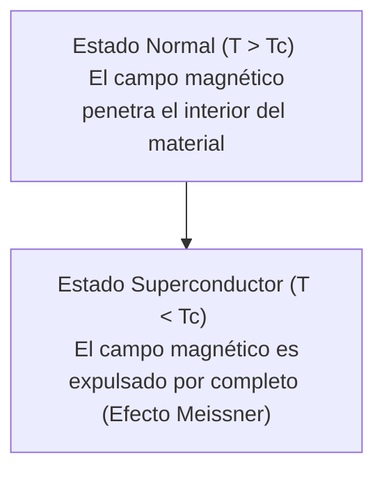

# Física: Mecanismos de la Superconductividad - Del Efecto Meissner al Tren Maglev y la Tecnología del Futuro

Entre los fenómenos físicos con el potencial de pulverizar los límites tecnológicos contemporáneos, la **superconductividad** brilla con luz propia. Las asombrosas propiedades de la resistencia eléctrica estrictamente nula y la expulsión completa de los campos magnéticos están revolucionando las redes energéticas, el transporte de levitación magnética, el diagnóstico médico avanzado y la [computación cuántica](/p/technology-quantum-computer/).

Este artículo ofrece un análisis exhaustivo y riguroso de la superconductividad: desde su histórico descubrimiento y la electrodinámica del efecto Meissner, pasando por el mecanismo microscópico de los pares de Cooper y la teoría BCS, los cupratos de alta temperatura crítica, hasta sus aplicaciones industriales (Maglev, resonancia magnética, ITER) y la búsqueda del superconductor a temperatura ambiente.

## 1. ¿Qué es la Superconductividad? Un Descubrimiento Trascendental

La superconductividad es un estado cuántico macroscópico que presentan ciertos metales, aleaciones y compuestos cerámicos cuando se enfrían por debajo de una **temperatura crítica ($T_c$)**, caracterizado por la desaparición súbita y absoluta de la resistencia eléctrica en corriente continua.

En los conductores metálicos ordinarios (como el cobre o el oro), los electrones chocan contra las vibraciones térmicas de la red cristalina (fonones) y las impurezas, disipando energía en forma de calor por efecto Joule. En un superconductor por debajo de $T_c$, esta resistencia desaparece por completo ($R = 0$). Esto permite que una corriente eléctrica inducida en un anillo superconductor cerrado circule de forma indefinida sin necesidad de una fuente externa de alimentación, fenómeno conocido como **corriente persistente**.

El fenómeno fue descubierto en 1911 por el físico holandés **Heike Kamerlingh Onnes** en la Universidad de Leiden. Habiendo conseguido licuar helio a 4,2 Kelvin ($-269^\circ\text{C}$), Onnes midió la resistencia eléctrica del mercurio sólido y observó con asombro que a 4,19 K caía abruptamente a cero. Por este hallazgo pionero, fue galardonado con el Premio Nobel de Física en 1913.

## 2. El Efecto Meissner y el Diamagnetismo Perfecto

La superconductividad no es únicamente conductividad eléctrica ideal. En 1933, los físicos alemanes **Walther Meissner** y **Robert Ochsenfeld** descubrieron una propiedad electromagnética aún más fundamental: el **diamagnetismo perfecto**, denominado **Efecto Meissner**.

Cuando un material se enfría por debajo de su temperatura crítica en presencia de un campo magnético exterior, expulsa activamente todas las líneas de flujo magnético de su interior. En lugar de atravesar el cuerpo, el campo magnético bordea el superconductor.

```mermaid
flowchart TD
    A["Estado Normal (T > Tc) \n El campo magnético penetra el interior del material"] --> B["Estado Superconductor (T < Tc) \n El campo magnético es expulsado por completo (Efecto Meissner)"]
```

Para describir matemáticamente este comportamiento, los hermanos Fritz y Heinz London formularon en 1935 las célebres **Ecuaciones de London**. La segunda ecuación vincula la densidad de corriente superconductora $\mathbf{J}$ con la densidad de flujo magnético $\mathbf{B}$:

$$ \nabla \times \mathbf{J} = -\frac{n_s e^2}{m} \mathbf{B} $$

Donde:
- $\mathbf{J}$ es la densidad de corriente superconductora.
- $n_s$ es la densidad volumétrica de portadores superconductores.
- $e$ es la carga elemental del electrón.
- $m$ es la masa del electrón.
- $\mathbf{B}$ es el vector de inducción magnética.

Combinada con las ecuaciones de Maxwell, esta ley demuestra que un campo magnético externo decae exponencialmente en el superconductor a lo largo de una profundidad característica llamada **longitud de penetración de London ($\lambda_L$)**:

$$ B(x) = B_0 e^{-x / \lambda_L} $$

En el interior del superconductor, el campo es idénticamente cero ($\mathbf{B} = 0$). Cuando se coloca un imán sobre un superconductor, este induce corrientes de apantallamiento en su superficie que generan un campo magnético opuesto y de igual magnitud, produciendo el asombroso fenómeno de la **levitación magnética cuántica**.

## 3. El Mecanismo Microscópico: Teoría BCS y Pares de Cooper

Durante casi medio siglo tras el descubrimiento de Onnes, el origen cuántico de la superconductividad fue uno de los mayores enigmas de la física. El misterio fue resuelto en 1957 por **John Bardeen, Leon Cooper y John Robert Schrieffer** al formular la **Teoría BCS** (reconocida con el Premio Nobel de Física en 1972).

El pilar de la teoría BCS es la formación de los **pares de Cooper**. En el vacío, dos electrones se repelen intensamente por repulsión electrostática de Coulomb. Sin embargo, dentro de una red cristalina a temperaturas criogénicas, un electrón que se desplaza atrae ligeramente los iones positivos de la red, creando una distorsión elástica localizada (emisión de un fonón virtual). Antes de que la red se relaje, esta acumulación local de carga positiva atrae a un segundo electrón con espín y momento lineal opuestos.

A través de esta interacción mediada por la red cristalina, los dos electrones vencen la repulsión y forman un par ligado:

$$ (\mathbf{k} \uparrow, -\mathbf{k} \downarrow) $$

Aunque los electrones aislados son fermiones (con espín semientero $1/2$), el par de Cooper tiene espín entero 0 y actúa como un bosón compuesto. Por debajo de $T_c$, millones de pares de Cooper se condensan en un único estado cuántico macroscópico semejante a una condensación de Bose-Einstein. Todos los pares avanzan sincronizados bajo una misma función de onda coherente. Para romper esta danza colectiva se requiere superar una brecha de energía finita ($\Delta$), lo que impide que las colisiones térmicas dispersen a los electrones, generando una corriente libre de resistencia eléctrica.

## 4. Superconductores de Alta Temperatura (HTS)

La teoría BCS clásica predijo que la superconductividad mediada por fonones no podía mantenerse por encima de unos 30 o 40 K (el límite de McMillan / límite BCS).

Sin embargo, en 1986, **Johannes Georg Bednorz** y **Karl Alexander Müller** en IBM Zúrich descubrieron superconductividad a 35 K en un compuesto cerámico de óxido de cobre y lantano (cuprato), derribando el límite teórico y obteniendo el Premio Nobel en 1987.

Poco después, en 1987, se sintetizó el **YBCO (óxido de itrio, bario y cobre)** con una temperatura crítica de 93 K. Esto superó por primera vez el **punto de ebullición del nitrógeno líquido (77 K / $-196^\circ\text{C}$)**. El nitrógeno líquido es abundante, seguro y mucho más económico que el helio líquido, impulsando decisivamente la viabilidad comercial de la superconductividad.

El mecanismo íntimo de los cupratos de alta temperatura sigue sin explicarse plenamente mediante la teoría BCS convencional; la fuerte correlación electrónica y las fluctuaciones antiferromagnéticas desempeñan un papel clave, constituyendo uno de los grandes problemas abiertos de la física de la materia condensada.

## 5. Aplicaciones Tecnológicas que Transforman la Sociedad

La combinación de resistencia cero y campos magnéticos titánicos impulsa infraestructuras y tecnologías de vanguardia:

### 5.1 El Tren de Levitación Magnética (SCMaglev)
El sistema japonés **SCMaglev** utiliza electroimanes superconductores de niobio-titanio (NbTi) enfriados con helio líquido. Al circular corrientes persistentes por las bobinas a bordo del tren, se generan campos de varios teslas que interactúan con las bobinas del carril guía, elevando el tren 10 cm y propulsándolo a velocidades superiores a **500 km/h (récord de 603 km/h)** sin contacto físico ni rozamiento con la vía.

### 5.2 Resonancia Magnética Médica (RM / MRI)
Las máquinas de resonancia magnética hospitalarias precisan un campo magnético ultrapotente, homogéneo y constante de 1,5 a 3,0 Teslas (y hasta 7T en investigación neurocientífica). Las bobinas superconductoras mantienen este campo gigantesco durante años sin disipación térmica de energía, permitiendo diagnósticos por imagen de altísima resolución.

### 5.3 Aceleradores de Partículas y Reactores de Fusión
En el **Gran Colisionador de Hadrones (LHC)** del CERN, más de 1.200 dipolos superconductores desvían protones a lo largo de un anillo de 27 kilómetros a un 99,999999% de la velocidad de la luz. En la búsqueda de energía limpia mediante fusión nuclear, reactores como **ITER** utilizan descomunales electroimanes superconductores de niobio-estaño ($Nb_3Sn$) para confinar plasmas ardientes a más de 100 millones de grados dentro de una jaula magnética de 13 Teslas.

### 5.4 Computación Cuántica Superconductora
Los procesadores cuánticos de vanguardia (Google Sycamore, IBM Quantum) se basan en circuitos superconductores. Mediante **uniones Josephson** (finas barreras aislantes entre dos superconductores), se generan cúbits artificiales cuyos estados cuánticos de superposición y entrelazamiento se controlan con microondas en refrigeradores de dilución a milikelvins.

## 6. La Búsqueda del Santo Grial: Superconductividad a Temperatura Ambiente

El mayor obstáculo para la adopción masiva de la superconductividad es el coste del enfriamiento criogénico.

El descubrimiento de un **superconductor a temperatura ambiente y presión atmosférica ($T_c > 300\text{ K}$, $P = 1\text{ atm}$)** desataría una revolución tecnológica sin precedentes:
- **Redes eléctricas con cero pérdidas**: Se erradicaría la pérdida del 5% al 10% de toda la electricidad mundial disipada en el transporte.
- **Electrónica sin sobrecalentamiento**: Microchips inmunes al calor por efecto Joule que operarían a frecuencias de terahercios.
- **Almacenamiento energético ultracompacto (SMES)**: Baterías magnéticas capaces de almacenar gigavatios-hora con un rendimiento cercano al 100%.

En los últimos años, experimentos con celdas de yunque de diamante han logrado superconductividad a casi 250 K ($-23^\circ\text{C}$) en hidruros ricos en hidrógeno ($H_3S$, $LaH_{10}$) sometidos a presiones de millones de atmósferas. El desafío actual es hallar un material que mantenga estas propiedades a presión ambiente.

## Conclusión: Una Ventana Macroscópica al Cosmos Cuántico

La superconductividad es la prueba fehaciente de que las reglas de la mecánica cuántica pueden manifestarse a escala humana con una elegancia deslumbrante. Desde la gota de mercurio enfriada por Onnes en 1911 hasta los procesadores cuánticos y los reactores de fusión del siglo XXI, este fenómeno continúa ensanchando los horizontes de la civilización humana.
