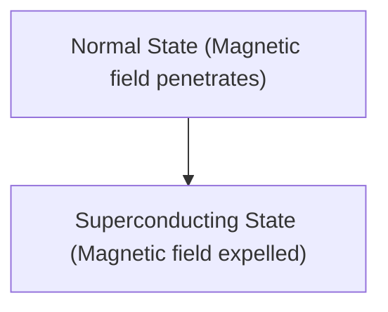

# Physique : Le mécanisme de la supraconductivité

La supraconductivité est un phénomène où la résistance électrique devient nulle.

## Effet Meissner

## Équation de London
$$ \nabla \times \mathbf{J} = -\frac{n_s e^2}{m} \mathbf{B} $$

## Partie de vérification technique supplémentaire 1

Dans cette section, nous approfondirons les détails techniques supplémentaires et les études de cas. Nous évaluerons les performances dans diverses conditions et examinerons les défis et les solutions concernant l'intégration avec d'autres systèmes. Nous discuterons également des perspectives futures et des limites.

## Partie de vérification technique supplémentaire 2

Dans cette section, nous approfondirons les détails techniques supplémentaires et les études de cas. Nous évaluerons les performances dans diverses conditions et examinerons les défis et les solutions concernant l'intégration avec d'autres systèmes. Nous discuterons également des perspectives futures et des limites.

## Partie de vérification technique supplémentaire 3

Dans cette section, nous approfondirons les détails techniques supplémentaires et les études de cas. Nous évaluerons les performances dans diverses conditions et examinerons les défis et les solutions concernant l'intégration avec d'autres systèmes. Nous discuterons également des perspectives futures et des limites.

## Partie de vérification technique supplémentaire 4

Dans cette section, nous approfondirons les détails techniques supplémentaires et les études de cas. Nous évaluerons les performances dans diverses conditions et examinerons les défis et les solutions concernant l'intégration avec d'autres systèmes. Nous discuterons également des perspectives futures et des limites.

## Partie de vérification technique supplémentaire 5

Dans cette section, nous approfondirons les détails techniques supplémentaires et les études de cas. Nous évaluerons les performances dans diverses conditions et examinerons les défis et les solutions concernant l'intégration avec d'autres systèmes. Nous discuterons également des perspectives futures et des limites.

## Partie de vérification technique supplémentaire 6

Dans cette section, nous approfondirons les détails techniques supplémentaires et les études de cas. Nous évaluerons les performances dans diverses conditions et examinerons les défis et les solutions concernant l'intégration avec d'autres systèmes. Nous discuterons également des perspectives futures et des limites.

## Partie de vérification technique supplémentaire 7

Dans cette section, nous approfondirons les détails techniques supplémentaires et les études de cas. Nous évaluerons les performances dans diverses conditions et examinerons les défis et les solutions concernant l'intégration avec d'autres systèmes. Nous discuterons également des perspectives futures et des limites.

## Partie de vérification technique supplémentaire 8

Dans cette section, nous approfondirons les détails techniques supplémentaires et les études de cas. Nous évaluerons les performances dans diverses conditions et examinerons les défis et les solutions concernant l'intégration avec d'autres systèmes. Nous discuterons également des perspectives futures et des limites.

## Partie de vérification technique supplémentaire 9

Dans cette section, nous approfondirons les détails techniques supplémentaires et les études de cas. Nous évaluerons les performances dans diverses conditions et examinerons les défis et les solutions concernant l'intégration avec d'autres systèmes. Nous discuterons également des perspectives futures et des limites.

## Partie de vérification technique supplémentaire 10

Dans cette section, nous approfondirons les détails techniques supplémentaires et les études de cas. Nous évaluerons les performances dans diverses conditions et examinerons les défis et les solutions concernant l'intégration avec d'autres systèmes. Nous discuterons également des perspectives futures et des limites.

## Partie de vérification technique supplémentaire 11

Dans cette section, nous approfondirons les détails techniques supplémentaires et les études de cas. Nous évaluerons les performances dans diverses conditions et examinerons les défis et les solutions concernant l'intégration avec d'autres systèmes. Nous discuterons également des perspectives futures et des limites.

## Partie de vérification technique supplémentaire 12

Dans cette section, nous approfondirons les détails techniques supplémentaires et les études de cas. Nous évaluerons les performances dans diverses conditions et examinerons les défis et les solutions concernant l'intégration avec d'autres systèmes. Nous discuterons également des perspectives futures et des limites.

## Partie de vérification technique supplémentaire 13

Dans cette section, nous approfondirons les détails techniques supplémentaires et les études de cas. Nous évaluerons les performances dans diverses conditions et examinerons les défis et les solutions concernant l'intégration avec d'autres systèmes. Nous discuterons également des perspectives futures et des limites.

## Partie de vérification technique supplémentaire 14

Dans cette section, nous approfondirons les détails techniques supplémentaires et les études de cas. Nous évaluerons les performances dans diverses conditions et examinerons les défis et les solutions concernant l'intégration avec d'autres systèmes. Nous discuterons également des perspectives futures et des limites.

## Partie de vérification technique supplémentaire 15

Dans cette section, nous approfondirons les détails techniques supplémentaires et les études de cas. Nous évaluerons les performances dans diverses conditions et examinerons les défis et les solutions concernant l'intégration avec d'autres systèmes. Nous discuterons également des perspectives futures et des limites.

## Partie de vérification technique supplémentaire 16

Dans cette section, nous approfondirons les détails techniques supplémentaires et les études de cas. Nous évaluerons les performances dans diverses conditions et examinerons les défis et les solutions concernant l'intégration avec d'autres systèmes. Nous discuterons également des perspectives futures et des limites.

## Partie de vérification technique supplémentaire 17

Dans cette section, nous approfondirons les détails techniques supplémentaires et les études de cas. Nous évaluerons les performances dans diverses conditions et examinerons les défis et les solutions concernant l'intégration avec d'autres systèmes. Nous discuterons également des perspectives futures et des limites.

## Partie de vérification technique supplémentaire 18

Dans cette section, nous approfondirons les détails techniques supplémentaires et les études de cas. Nous évaluerons les performances dans diverses conditions et examinerons les défis et les solutions concernant l'intégration avec d'autres systèmes. Nous discuterons également des perspectives futures et des limites.

## Partie de vérification technique supplémentaire 19

Dans cette section, nous approfondirons les détails techniques supplémentaires et les études de cas. Nous évaluerons les performances dans diverses conditions et examinerons les défis et les solutions concernant l'intégration avec d'autres systèmes. Nous discuterons également des perspectives futures et des limites.

## Partie de vérification technique supplémentaire 20

Dans cette section, nous approfondirons les détails techniques supplémentaires et les études de cas. Nous évaluerons les performances dans diverses conditions et examinerons les défis et les solutions concernant l'intégration avec d'autres systèmes. Nous discuterons également des perspectives futures et des limites.

## Partie de vérification technique supplémentaire 21

Dans cette section, nous approfondirons les détails techniques supplémentaires et les études de cas. Nous évaluerons les performances dans diverses conditions et examinerons les défis et les solutions concernant l'intégration avec d'autres systèmes. Nous discuterons également des perspectives futures et des limites.

## Partie de vérification technique supplémentaire 22

Dans cette section, nous approfondirons les détails techniques supplémentaires et les études de cas. Nous évaluerons les performances dans diverses conditions et examinerons les défis et les solutions concernant l'intégration avec d'autres systèmes. Nous discuterons également des perspectives futures et des limites.

## Partie de vérification technique supplémentaire 23

Dans cette section, nous approfondirons les détails techniques supplémentaires et les études de cas. Nous évaluerons les performances dans diverses conditions et examinerons les défis et les solutions concernant l'intégration avec d'autres systèmes. Nous discuterons également des perspectives futures et des limites.

## Partie de vérification technique supplémentaire 24

Dans cette section, nous approfondirons les détails techniques supplémentaires et les études de cas. Nous évaluerons les performances dans diverses conditions et examinerons les défis et les solutions concernant l'intégration avec d'autres systèmes. Nous discuterons également des perspectives futures et des limites.

## Partie de vérification technique supplémentaire 25

Dans cette section, nous approfondirons les détails techniques supplémentaires et les études de cas. Nous évaluerons les performances dans diverses conditions et examinerons les défis et les solutions concernant l'intégration avec d'autres systèmes. Nous discuterons également des perspectives futures et des limites.

## Partie de vérification technique supplémentaire 26

Dans cette section, nous approfondirons les détails techniques supplémentaires et les études de cas. Nous évaluerons les performances dans diverses conditions et examinerons les défis et les solutions concernant l'intégration avec d'autres systèmes. Nous discuterons également des perspectives futures et des limites.

## Partie de vérification technique supplémentaire 27

Dans cette section, nous approfondirons les détails techniques supplémentaires et les études de cas. Nous évaluerons les performances dans diverses conditions et examinerons les défis et les solutions concernant l'intégration avec d'autres systèmes. Nous discuterons également des perspectives futures et des limites.

## Partie de vérification technique supplémentaire 28

Dans cette section, nous approfondirons les détails techniques supplémentaires et les études de cas. Nous évaluerons les performances dans diverses conditions et examinerons les défis et les solutions concernant l'intégration avec d'autres systèmes. Nous discuterons également des perspectives futures et des limites.

## Partie de vérification technique supplémentaire 29

Dans cette section, nous approfondirons les détails techniques supplémentaires et les études de cas. Nous évaluerons les performances dans diverses conditions et examinerons les défis et les solutions concernant l'intégration avec d'autres systèmes. Nous discuterons également des perspectives futures et des limites.

## Partie de vérification technique supplémentaire 30

Dans cette section, nous approfondirons les détails techniques supplémentaires et les études de cas. Nous évaluerons les performances dans diverses conditions et examinerons les défis et les solutions concernant l'intégration avec d'autres systèmes. Nous discuterons également des perspectives futures et des limites.

## Partie de vérification technique supplémentaire 31

Dans cette section, nous approfondirons les détails techniques supplémentaires et les études de cas. Nous évaluerons les performances dans diverses conditions et examinerons les défis et les solutions concernant l'intégration avec d'autres systèmes. Nous discuterons également des perspectives futures et des limites.

## Partie de vérification technique supplémentaire 32

Dans cette section, nous approfondirons les détails techniques supplémentaires et les études de cas. Nous évaluerons les performances dans diverses conditions et examinerons les défis et les solutions concernant l'intégration avec d'autres systèmes. Nous discuterons également des perspectives futures et des limites.

## Partie de vérification technique supplémentaire 33

Dans cette section, nous approfondirons les détails techniques supplémentaires et les études de cas. Nous évaluerons les performances dans diverses conditions et examinerons les défis et les solutions concernant l'intégration avec d'autres systèmes. Nous discuterons également des perspectives futures et des limites.

## Partie de vérification technique supplémentaire 34

Dans cette section, nous approfondirons les détails techniques supplémentaires et les études de cas. Nous évaluerons les performances dans diverses conditions et examinerons les défis et les solutions concernant l'intégration avec d'autres systèmes. Nous discuterons également des perspectives futures et des limites.

## Partie de vérification technique supplémentaire 35

Dans cette section, nous approfondirons les détails techniques supplémentaires et les études de cas. Nous évaluerons les performances dans diverses conditions et examinerons les défis et les solutions concernant l'intégration avec d'autres systèmes. Nous discuterons également des perspectives futures et des limites.

## Partie de vérification technique supplémentaire 36

Dans cette section, nous approfondirons les détails techniques supplémentaires et les études de cas. Nous évaluerons les performances dans diverses conditions et examinerons les défis et les solutions concernant l'intégration avec d'autres systèmes. Nous discuterons également des perspectives futures et des limites.

## Partie de vérification technique supplémentaire 37

Dans cette section, nous approfondirons les détails techniques supplémentaires et les études de cas. Nous évaluerons les performances dans diverses conditions et examinerons les défis et les solutions concernant l'intégration avec d'autres systèmes. Nous discuterons également des perspectives futures et des limites.

## Partie de vérification technique supplémentaire 38

Dans cette section, nous approfondirons les détails techniques supplémentaires et les études de cas. Nous évaluerons les performances dans diverses conditions et examinerons les défis et les solutions concernant l'intégration avec d'autres systèmes. Nous discuterons également des perspectives futures et des limites.

## Partie de vérification technique supplémentaire 39

Dans cette section, nous approfondirons les détails techniques supplémentaires et les études de cas. Nous évaluerons les performances dans diverses conditions et examinerons les défis et les solutions concernant l'intégration avec d'autres systèmes. Nous discuterons également des perspectives futures et des limites.

## Partie de vérification technique supplémentaire 40

Dans cette section, nous approfondirons les détails techniques supplémentaires et les études de cas. Nous évaluerons les performances dans diverses conditions et examinerons les défis et les solutions concernant l'intégration avec d'autres systèmes. Nous discuterons également des perspectives futures et des limites.

## Partie de vérification technique supplémentaire 41

Dans cette section, nous approfondirons les détails techniques supplémentaires et les études de cas. Nous évaluerons les performances dans diverses conditions et examinerons les défis et les solutions concernant l'intégration avec d'autres systèmes. Nous discuterons également des perspectives futures et des limites.

## Partie de vérification technique supplémentaire 42

Dans cette section, nous approfondirons les détails techniques supplémentaires et les études de cas. Nous évaluerons les performances dans diverses conditions et examinerons les défis et les solutions concernant l'intégration avec d'autres systèmes. Nous discuterons également des perspectives futures et des limites.

## Partie de vérification technique supplémentaire 43

Dans cette section, nous approfondirons les détails techniques supplémentaires et les études de cas. Nous évaluerons les performances dans diverses conditions et examinerons les défis et les solutions concernant l'intégration avec d'autres systèmes. Nous discuterons également des perspectives futures et des limites.

## Partie de vérification technique supplémentaire 44

Dans cette section, nous approfondirons les détails techniques supplémentaires et les études de cas. Nous évaluerons les performances dans diverses conditions et examinerons les défis et les solutions concernant l'intégration avec d'autres systèmes. Nous discuterons également des perspectives futures et des limites.

## Partie de vérification technique supplémentaire 45

Dans cette section, nous approfondirons les détails techniques supplémentaires et les études de cas. Nous évaluerons les performances dans diverses conditions et examinerons les défis et les solutions concernant l'intégration avec d'autres systèmes. Nous discuterons également des perspectives futures et des limites.

## Partie de vérification technique supplémentaire 46

Dans cette section, nous approfondirons les détails techniques supplémentaires et les études de cas. Nous évaluerons les performances dans diverses conditions et examinerons les défis et les solutions concernant l'intégration avec d'autres systèmes. Nous discuterons également des perspectives futures et des limites.

## Partie de vérification technique supplémentaire 47

Dans cette section, nous approfondirons les détails techniques supplémentaires et les études de cas. Nous évaluerons les performances dans diverses conditions et examinerons les défis et les solutions concernant l'intégration avec d'autres systèmes. Nous discuterons également des perspectives futures et des limites.

## Partie de vérification technique supplémentaire 48

Dans cette section, nous approfondirons les détails techniques supplémentaires et les études de cas. Nous évaluerons les performances dans diverses conditions et examinerons les défis et les solutions concernant l'intégration avec d'autres systèmes. Nous discuterons également des perspectives futures et des limites.

## Partie de vérification technique supplémentaire 49

Dans cette section, nous approfondirons les détails techniques supplémentaires et les études de cas. Nous évaluerons les performances dans diverses conditions et examinerons les défis et les solutions concernant l'intégration avec d'autres systèmes. Nous discuterons également des perspectives futures et des limites.

## Partie de vérification technique supplémentaire 50

Dans cette section, nous approfondirons les détails techniques supplémentaires et les études de cas. Nous évaluerons les performances dans diverses conditions et examinerons les défis et les solutions concernant l'intégration avec d'autres systèmes. Nous discuterons également des perspectives futures et des limites.

## Partie de vérification technique supplémentaire 51

Dans cette section, nous approfondirons les détails techniques supplémentaires et les études de cas. Nous évaluerons les performances dans diverses conditions et examinerons les défis et les solutions concernant l'intégration avec d'autres systèmes. Nous discuterons également des perspectives futures et des limites.

## Partie de vérification technique supplémentaire 52

Dans cette section, nous approfondirons les détails techniques supplémentaires et les études de cas. Nous évaluerons les performances dans diverses conditions et examinerons les défis et les solutions concernant l'intégration avec d'autres systèmes. Nous discuterons également des perspectives futures et des limites.

## Partie de vérification technique supplémentaire 53

Dans cette section, nous approfondirons les détails techniques supplémentaires et les études de cas. Nous évaluerons les performances dans diverses conditions et examinerons les défis et les solutions concernant l'intégration avec d'autres systèmes. Nous discuterons également des perspectives futures et des limites.

## Partie de vérification technique supplémentaire 54

Dans cette section, nous approfondirons les détails techniques supplémentaires et les études de cas. Nous évaluerons les performances dans diverses conditions et examinerons les défis et les solutions concernant l'intégration avec d'autres systèmes. Nous discuterons également des perspectives futures et des limites.

## Partie de vérification technique supplémentaire 55

Dans cette section, nous approfondirons les détails techniques supplémentaires et les études de cas. Nous évaluerons les performances dans diverses conditions et examinerons les défis et les solutions concernant l'intégration avec d'autres systèmes. Nous discuterons également des perspectives futures et des limites.

## Partie de vérification technique supplémentaire 56

Dans cette section, nous approfondirons les détails techniques supplémentaires et les études de cas. Nous évaluerons les performances dans diverses conditions et examinerons les défis et les solutions concernant l'intégration avec d'autres systèmes. Nous discuterons également des perspectives futures et des limites.

## Partie de vérification technique supplémentaire 57

Dans cette section, nous approfondirons les détails techniques supplémentaires et les études de cas. Nous évaluerons les performances dans diverses conditions et examinerons les défis et les solutions concernant l'intégration avec d'autres systèmes. Nous discuterons également des perspectives futures et des limites.

## Partie de vérification technique supplémentaire 58

Dans cette section, nous approfondirons les détails techniques supplémentaires et les études de cas. Nous évaluerons les performances dans diverses conditions et examinerons les défis et les solutions concernant l'intégration avec d'autres systèmes. Nous discuterons également des perspectives futures et des limites.

## Partie de vérification technique supplémentaire 59

Dans cette section, nous approfondirons les détails techniques supplémentaires et les études de cas. Nous évaluerons les performances dans diverses conditions et examinerons les défis et les solutions concernant l'intégration avec d'autres systèmes. Nous discuterons également des perspectives futures et des limites.

## Partie de vérification technique supplémentaire 60

Dans cette section, nous approfondirons les détails techniques supplémentaires et les études de cas. Nous évaluerons les performances dans diverses conditions et examinerons les défis et les solutions concernant l'intégration avec d'autres systèmes. Nous discuterons également des perspectives futures et des limites.

## Partie de vérification technique supplémentaire 61

Dans cette section, nous approfondirons les détails techniques supplémentaires et les études de cas. Nous évaluerons les performances dans diverses conditions et examinerons les défis et les solutions concernant l'intégration avec d'autres systèmes. Nous discuterons également des perspectives futures et des limites.

## Partie de vérification technique supplémentaire 62

Dans cette section, nous approfondirons les détails techniques supplémentaires et les études de cas. Nous évaluerons les performances dans diverses conditions et examinerons les défis et les solutions concernant l'intégration avec d'autres systèmes. Nous discuterons également des perspectives futures et des limites.

## Partie de vérification technique supplémentaire 63

Dans cette section, nous approfondirons les détails techniques supplémentaires et les études de cas. Nous évaluerons les performances dans diverses conditions et examinerons les défis et les solutions concernant l'intégration avec d'autres systèmes. Nous discuterons également des perspectives futures et des limites.

## Partie de vérification technique supplémentaire 64

Dans cette section, nous approfondirons les détails techniques supplémentaires et les études de cas. Nous évaluerons les performances dans diverses conditions et examinerons les défis et les solutions concernant l'intégration avec d'autres systèmes. Nous discuterons également des perspectives futures et des limites.

## Partie de vérification technique supplémentaire 65

Dans cette section, nous approfondirons les détails techniques supplémentaires et les études de cas. Nous évaluerons les performances dans diverses conditions et examinerons les défis et les solutions concernant l'intégration avec d'autres systèmes. Nous discuterons également des perspectives futures et des limites.

## Partie de vérification technique supplémentaire 66

Dans cette section, nous approfondirons les détails techniques supplémentaires et les études de cas. Nous évaluerons les performances dans diverses conditions et examinerons les défis et les solutions concernant l'intégration avec d'autres systèmes. Nous discuterons également des perspectives futures et des limites.

## Partie de vérification technique supplémentaire 67

Dans cette section, nous approfondirons les détails techniques supplémentaires et les études de cas. Nous évaluerons les performances dans diverses conditions et examinerons les défis et les solutions concernant l'intégration avec d'autres systèmes. Nous discuterons également des perspectives futures et des limites.

## Partie de vérification technique supplémentaire 68

Dans cette section, nous approfondirons les détails techniques supplémentaires et les études de cas. Nous évaluerons les performances dans diverses conditions et examinerons les défis et les solutions concernant l'intégration avec d'autres systèmes. Nous discuterons également des perspectives futures et des limites.

## Partie de vérification technique supplémentaire 69

Dans cette section, nous approfondirons les détails techniques supplémentaires et les études de cas. Nous évaluerons les performances dans diverses conditions et examinerons les défis et les solutions concernant l'intégration avec d'autres systèmes. Nous discuterons également des perspectives futures et des limites.

## Partie de vérification technique supplémentaire 70

Dans cette section, nous approfondirons les détails techniques supplémentaires et les études de cas. Nous évaluerons les performances dans diverses conditions et examinerons les défis et les solutions concernant l'intégration avec d'autres systèmes. Nous discuterons également des perspectives futures et des limites.

## Partie de vérification technique supplémentaire 71

Dans cette section, nous approfondirons les détails techniques supplémentaires et les études de cas. Nous évaluerons les performances dans diverses conditions et examinerons les défis et les solutions concernant l'intégration avec d'autres systèmes. Nous discuterons également des perspectives futures et des limites.

## Partie de vérification technique supplémentaire 72

Dans cette section, nous approfondirons les détails techniques supplémentaires et les études de cas. Nous évaluerons les performances dans diverses conditions et examinerons les défis et les solutions concernant l'intégration avec d'autres systèmes. Nous discuterons également des perspectives futures et des limites.

## Partie de vérification technique supplémentaire 73

Dans cette section, nous approfondirons les détails techniques supplémentaires et les études de cas. Nous évaluerons les performances dans diverses conditions et examinerons les défis et les solutions concernant l'intégration avec d'autres systèmes. Nous discuterons également des perspectives futures et des limites.

## Partie de vérification technique supplémentaire 74

Dans cette section, nous approfondirons les détails techniques supplémentaires et les études de cas. Nous évaluerons les performances dans diverses conditions et examinerons les défis et les solutions concernant l'intégration avec d'autres systèmes. Nous discuterons également des perspectives futures et des limites.

## Partie de vérification technique supplémentaire 75

Dans cette section, nous approfondirons les détails techniques supplémentaires et les études de cas. Nous évaluerons les performances dans diverses conditions et examinerons les défis et les solutions concernant l'intégration avec d'autres systèmes. Nous discuterons également des perspectives futures et des limites.

## Partie de vérification technique supplémentaire 76

Dans cette section, nous approfondirons les détails techniques supplémentaires et les études de cas. Nous évaluerons les performances dans diverses conditions et examinerons les défis et les solutions concernant l'intégration avec d'autres systèmes. Nous discuterons également des perspectives futures et des limites.

## Partie de vérification technique supplémentaire 77

Dans cette section, nous approfondirons les détails techniques supplémentaires et les études de cas. Nous évaluerons les performances dans diverses conditions et examinerons les défis et les solutions concernant l'intégration avec d'autres systèmes. Nous discuterons également des perspectives futures et des limites.

## Partie de vérification technique supplémentaire 78

Dans cette section, nous approfondirons les détails techniques supplémentaires et les études de cas. Nous évaluerons les performances dans diverses conditions et examinerons les défis et les solutions concernant l'intégration avec d'autres systèmes. Nous discuterons également des perspectives futures et des limites.

## Partie de vérification technique supplémentaire 79

Dans cette section, nous approfondirons les détails techniques supplémentaires et les études de cas. Nous évaluerons les performances dans diverses conditions et examinerons les défis et les solutions concernant l'intégration avec d'autres systèmes. Nous discuterons également des perspectives futures et des limites.

## Partie de vérification technique supplémentaire 80

Dans cette section, nous approfondirons les détails techniques supplémentaires et les études de cas. Nous évaluerons les performances dans diverses conditions et examinerons les défis et les solutions concernant l'intégration avec d'autres systèmes. Nous discuterons également des perspectives futures et des limites.

## Partie de vérification technique supplémentaire 81

Dans cette section, nous approfondirons les détails techniques supplémentaires et les études de cas. Nous évaluerons les performances dans diverses conditions et examinerons les défis et les solutions concernant l'intégration avec d'autres systèmes. Nous discuterons également des perspectives futures et des limites.

## Partie de vérification technique supplémentaire 82

Dans cette section, nous approfondirons les détails techniques supplémentaires et les études de cas. Nous évaluerons les performances dans diverses conditions et examinerons les défis et les solutions concernant l'intégration avec d'autres systèmes. Nous discuterons également des perspectives futures et des limites.

## Partie de vérification technique supplémentaire 83

Dans cette section, nous approfondirons les détails techniques supplémentaires et les études de cas. Nous évaluerons les performances dans diverses conditions et examinerons les défis et les solutions concernant l'intégration avec d'autres systèmes. Nous discuterons également des perspectives futures et des limites.

## Partie de vérification technique supplémentaire 84

Dans cette section, nous approfondirons les détails techniques supplémentaires et les études de cas. Nous évaluerons les performances dans diverses conditions et examinerons les défis et les solutions concernant l'intégration avec d'autres systèmes. Nous discuterons également des perspectives futures et des limites.

## Partie de vérification technique supplémentaire 85

Dans cette section, nous approfondirons les détails techniques supplémentaires et les études de cas. Nous évaluerons les performances dans diverses conditions et examinerons les défis et les solutions concernant l'intégration avec d'autres systèmes. Nous discuterons également des perspectives futures et des limites.

## Partie de vérification technique supplémentaire 86

Dans cette section, nous approfondirons les détails techniques supplémentaires et les études de cas. Nous évaluerons les performances dans diverses conditions et examinerons les défis et les solutions concernant l'intégration avec d'autres systèmes. Nous discuterons également des perspectives futures et des limites.

## Partie de vérification technique supplémentaire 87

Dans cette section, nous approfondirons les détails techniques supplémentaires et les études de cas. Nous évaluerons les performances dans diverses conditions et examinerons les défis et les solutions concernant l'intégration avec d'autres systèmes. Nous discuterons également des perspectives futures et des limites.

## Partie de vérification technique supplémentaire 88

Dans cette section, nous approfondirons les détails techniques supplémentaires et les études de cas. Nous évaluerons les performances dans diverses conditions et examinerons les défis et les solutions concernant l'intégration avec d'autres systèmes. Nous discuterons également des perspectives futures et des limites.

## Partie de vérification technique supplémentaire 89

Dans cette section, nous approfondirons les détails techniques supplémentaires et les études de cas. Nous évaluerons les performances dans diverses conditions et examinerons les défis et les solutions concernant l'intégration avec d'autres systèmes. Nous discuterons également des perspectives futures et des limites.

## Partie de vérification technique supplémentaire 90

Dans cette section, nous approfondirons les détails techniques supplémentaires et les études de cas. Nous évaluerons les performances dans diverses conditions et examinerons les défis et les solutions concernant l'intégration avec d'autres systèmes. Nous discuterons également des perspectives futures et des limites.

## Partie de vérification technique supplémentaire 91

Dans cette section, nous approfondirons les détails techniques supplémentaires et les études de cas. Nous évaluerons les performances dans diverses conditions et examinerons les défis et les solutions concernant l'intégration avec d'autres systèmes. Nous discuterons également des perspectives futures et des limites.

## Partie de vérification technique supplémentaire 92

Dans cette section, nous approfondirons les détails techniques supplémentaires et les études de cas. Nous évaluerons les performances dans diverses conditions et examinerons les défis et les solutions concernant l'intégration avec d'autres systèmes. Nous discuterons également des perspectives futures et des limites.

## Partie de vérification technique supplémentaire 93

Dans cette section, nous approfondirons les détails techniques supplémentaires et les études de cas. Nous évaluerons les performances dans diverses conditions et examinerons les défis et les solutions concernant l'intégration avec d'autres systèmes. Nous discuterons également des perspectives futures et des limites.

## Partie de vérification technique supplémentaire 94

Dans cette section, nous approfondirons les détails techniques supplémentaires et les études de cas. Nous évaluerons les performances dans diverses conditions et examinerons les défis et les solutions concernant l'intégration avec d'autres systèmes. Nous discuterons également des perspectives futures et des limites.

## Partie de vérification technique supplémentaire 95

Dans cette section, nous approfondirons les détails techniques supplémentaires et les études de cas. Nous évaluerons les performances dans diverses conditions et examinerons les défis et les solutions concernant l'intégration avec d'autres systèmes. Nous discuterons également des perspectives futures et des limites.

## Partie de vérification technique supplémentaire 96

Dans cette section, nous approfondirons les détails techniques supplémentaires et les études de cas. Nous évaluerons les performances dans diverses conditions et examinerons les défis et les solutions concernant l'intégration avec d'autres systèmes. Nous discuterons également des perspectives futures et des limites.

## Partie de vérification technique supplémentaire 97

Dans cette section, nous approfondirons les détails techniques supplémentaires et les études de cas. Nous évaluerons les performances dans diverses conditions et examinerons les défis et les solutions concernant l'intégration avec d'autres systèmes. Nous discuterons également des perspectives futures et des limites.

## Partie de vérification technique supplémentaire 98

Dans cette section, nous approfondirons les détails techniques supplémentaires et les études de cas. Nous évaluerons les performances dans diverses conditions et examinerons les défis et les solutions concernant l'intégration avec d'autres systèmes. Nous discuterons également des perspectives futures et des limites.

## Partie de vérification technique supplémentaire 99

Dans cette section, nous approfondirons les détails techniques supplémentaires et les études de cas. Nous évaluerons les performances dans diverses conditions et examinerons les défis et les solutions concernant l'intégration avec d'autres systèmes. Nous discuterons également des perspectives futures et des limites.

## Partie de vérification technique supplémentaire 100

Dans cette section, nous approfondirons les détails techniques supplémentaires et les études de cas. Nous évaluerons les performances dans diverses conditions et examinerons les défis et les solutions concernant l'intégration avec d'autres systèmes. Nous discuterons également des perspectives futures et des limites.

## Partie de vérification technique supplémentaire 101

Dans cette section, nous approfondirons les détails techniques supplémentaires et les études de cas. Nous évaluerons les performances dans diverses conditions et examinerons les défis et les solutions concernant l'intégration avec d'autres systèmes. Nous discuterons également des perspectives futures et des limites.

## Partie de vérification technique supplémentaire 102

Dans cette section, nous approfondirons les détails techniques supplémentaires et les études de cas. Nous évaluerons les performances dans diverses conditions et examinerons les défis et les solutions concernant l'intégration avec d'autres systèmes. Nous discuterons également des perspectives futures et des limites.

## Partie de vérification technique supplémentaire 103

Dans cette section, nous approfondirons les détails techniques supplémentaires et les études de cas. Nous évaluerons les performances dans diverses conditions et examinerons les défis et les solutions concernant l'intégration avec d'autres systèmes. Nous discuterons également des perspectives futures et des limites.

## Partie de vérification technique supplémentaire 104

Dans cette section, nous approfondirons les détails techniques supplémentaires et les études de cas. Nous évaluerons les performances dans diverses conditions et examinerons les défis et les solutions concernant l'intégration avec d'autres systèmes. Nous discuterons également des perspectives futures et des limites.

## Partie de vérification technique supplémentaire 105

Dans cette section, nous approfondirons les détails techniques supplémentaires et les études de cas. Nous évaluerons les performances dans diverses conditions et examinerons les défis et les solutions concernant l'intégration avec d'autres systèmes. Nous discuterons également des perspectives futures et des limites.

## Partie de vérification technique supplémentaire 106

Dans cette section, nous approfondirons les détails techniques supplémentaires et les études de cas. Nous évaluerons les performances dans diverses conditions et examinerons les défis et les solutions concernant l'intégration avec d'autres systèmes. Nous discuterons également des perspectives futures et des limites.

## Partie de vérification technique supplémentaire 107

Dans cette section, nous approfondirons les détails techniques supplémentaires et les études de cas. Nous évaluerons les performances dans diverses conditions et examinerons les défis et les solutions concernant l'intégration avec d'autres systèmes. Nous discuterons également des perspectives futures et des limites.

## Partie de vérification technique supplémentaire 108

Dans cette section, nous approfondirons les détails techniques supplémentaires et les études de cas. Nous évaluerons les performances dans diverses conditions et examinerons les défis et les solutions concernant l'intégration avec d'autres systèmes. Nous discuterons également des perspectives futures et des limites.

## Partie de vérification technique supplémentaire 109

Dans cette section, nous approfondirons les détails techniques supplémentaires et les études de cas. Nous évaluerons les performances dans diverses conditions et examinerons les défis et les solutions concernant l'intégration avec d'autres systèmes. Nous discuterons également des perspectives futures et des limites.

## Partie de vérification technique supplémentaire 110

Dans cette section, nous approfondirons les détails techniques supplémentaires et les études de cas. Nous évaluerons les performances dans diverses conditions et examinerons les défis et les solutions concernant l'intégration avec d'autres systèmes. Nous discuterons également des perspectives futures et des limites.

## Partie de vérification technique supplémentaire 111

Dans cette section, nous approfondirons les détails techniques supplémentaires et les études de cas. Nous évaluerons les performances dans diverses conditions et examinerons les défis et les solutions concernant l'intégration avec d'autres systèmes. Nous discuterons également des perspectives futures et des limites.

## Partie de vérification technique supplémentaire 112

Dans cette section, nous approfondirons les détails techniques supplémentaires et les études de cas. Nous évaluerons les performances dans diverses conditions et examinerons les défis et les solutions concernant l'intégration avec d'autres systèmes. Nous discuterons également des perspectives futures et des limites.

## Partie de vérification technique supplémentaire 113

Dans cette section, nous approfondirons les détails techniques supplémentaires et les études de cas. Nous évaluerons les performances dans diverses conditions et examinerons les défis et les solutions concernant l'intégration avec d'autres systèmes. Nous discuterons également des perspectives futures et des limites.

## Partie de vérification technique supplémentaire 114

Dans cette section, nous approfondirons les détails techniques supplémentaires et les études de cas. Nous évaluerons les performances dans diverses conditions et examinerons les défis et les solutions concernant l'intégration avec d'autres systèmes. Nous discuterons également des perspectives futures et des limites.

## Partie de vérification technique supplémentaire 115

Dans cette section, nous approfondirons les détails techniques supplémentaires et les études de cas. Nous évaluerons les performances dans diverses conditions et examinerons les défis et les solutions concernant l'intégration avec d'autres systèmes. Nous discuterons également des perspectives futures et des limites.

## Partie de vérification technique supplémentaire 116

Dans cette section, nous approfondirons les détails techniques supplémentaires et les études de cas. Nous évaluerons les performances dans diverses conditions et examinerons les défis et les solutions concernant l'intégration avec d'autres systèmes. Nous discuterons également des perspectives futures et des limites.

## Partie de vérification technique supplémentaire 117

Dans cette section, nous approfondirons les détails techniques supplémentaires et les études de cas. Nous évaluerons les performances dans diverses conditions et examinerons les défis et les solutions concernant l'intégration avec d'autres systèmes. Nous discuterons également des perspectives futures et des limites.

## Partie de vérification technique supplémentaire 118

Dans cette section, nous approfondirons les détails techniques supplémentaires et les études de cas. Nous évaluerons les performances dans diverses conditions et examinerons les défis et les solutions concernant l'intégration avec d'autres systèmes. Nous discuterons également des perspectives futures et des limites.

## Partie de vérification technique supplémentaire 119

Dans cette section, nous approfondirons les détails techniques supplémentaires et les études de cas. Nous évaluerons les performances dans diverses conditions et examinerons les défis et les solutions concernant l'intégration avec d'autres systèmes. Nous discuterons également des perspectives futures et des limites.

## Partie de vérification technique supplémentaire 120

Dans cette section, nous approfondirons les détails techniques supplémentaires et les études de cas. Nous évaluerons les performances dans diverses conditions et examinerons les défis et les solutions concernant l'intégration avec d'autres systèmes. Nous discuterons également des perspectives futures et des limites.

## Partie de vérification technique supplémentaire 121

Dans cette section, nous approfondirons les détails techniques supplémentaires et les études de cas. Nous évaluerons les performances dans diverses conditions et examinerons les défis et les solutions concernant l'intégration avec d'autres systèmes. Nous discuterons également des perspectives futures et des limites.

## Partie de vérification technique supplémentaire 122

Dans cette section, nous approfondirons les détails techniques supplémentaires et les études de cas. Nous évaluerons les performances dans diverses conditions et examinerons les défis et les solutions concernant l'intégration avec d'autres systèmes. Nous discuterons également des perspectives futures et des limites.

## Partie de vérification technique supplémentaire 123

Dans cette section, nous approfondirons les détails techniques supplémentaires et les études de cas. Nous évaluerons les performances dans diverses conditions et examinerons les défis et les solutions concernant l'intégration avec d'autres systèmes. Nous discuterons également des perspectives futures et des limites.

## Partie de vérification technique supplémentaire 124

Dans cette section, nous approfondirons les détails techniques supplémentaires et les études de cas. Nous évaluerons les performances dans diverses conditions et examinerons les défis et les solutions concernant l'intégration avec d'autres systèmes. Nous discuterons également des perspectives futures et des limites.

## Partie de vérification technique supplémentaire 125

Dans cette section, nous approfondirons les détails techniques supplémentaires et les études de cas. Nous évaluerons les performances dans diverses conditions et examinerons les défis et les solutions concernant l'intégration avec d'autres systèmes. Nous discuterons également des perspectives futures et des limites.

## Partie de vérification technique supplémentaire 126

Dans cette section, nous approfondirons les détails techniques supplémentaires et les études de cas. Nous évaluerons les performances dans diverses conditions et examinerons les défis et les solutions concernant l'intégration avec d'autres systèmes. Nous discuterons également des perspectives futures et des limites.

## Partie de vérification technique supplémentaire 127

Dans cette section, nous approfondirons les détails techniques supplémentaires et les études de cas. Nous évaluerons les performances dans diverses conditions et examinerons les défis et les solutions concernant l'intégration avec d'autres systèmes. Nous discuterons également des perspectives futures et des limites.

## Partie de vérification technique supplémentaire 128

Dans cette section, nous approfondirons les détails techniques supplémentaires et les études de cas. Nous évaluerons les performances dans diverses conditions et examinerons les défis et les solutions concernant l'intégration avec d'autres systèmes. Nous discuterons également des perspectives futures et des limites.

## Partie de vérification technique supplémentaire 129

Dans cette section, nous approfondirons les détails techniques supplémentaires et les études de cas. Nous évaluerons les performances dans diverses conditions et examinerons les défis et les solutions concernant l'intégration avec d'autres systèmes. Nous discuterons également des perspectives futures et des limites.

## Partie de vérification technique supplémentaire 130

Dans cette section, nous approfondirons les détails techniques supplémentaires et les études de cas. Nous évaluerons les performances dans diverses conditions et examinerons les défis et les solutions concernant l'intégration avec d'autres systèmes. Nous discuterons également des perspectives futures et des limites.

## Partie de vérification technique supplémentaire 131

Dans cette section, nous approfondirons les détails techniques supplémentaires et les études de cas. Nous évaluerons les performances dans diverses conditions et examinerons les défis et les solutions concernant l'intégration avec d'autres systèmes. Nous discuterons également des perspectives futures et des limites.

## Partie de vérification technique supplémentaire 132

Dans cette section, nous approfondirons les détails techniques supplémentaires et les études de cas. Nous évaluerons les performances dans diverses conditions et examinerons les défis et les solutions concernant l'intégration avec d'autres systèmes. Nous discuterons également des perspectives futures et des limites.

## Partie de vérification technique supplémentaire 133

Dans cette section, nous approfondirons les détails techniques supplémentaires et les études de cas. Nous évaluerons les performances dans diverses conditions et examinerons les défis et les solutions concernant l'intégration avec d'autres systèmes. Nous discuterons également des perspectives futures et des limites.

## Partie de vérification technique supplémentaire 134

Dans cette section, nous approfondirons les détails techniques supplémentaires et les études de cas. Nous évaluerons les performances dans diverses conditions et examinerons les défis et les solutions concernant l'intégration avec d'autres systèmes. Nous discuterons également des perspectives futures et des limites.

## Partie de vérification technique supplémentaire 135

Dans cette section, nous approfondirons les détails techniques supplémentaires et les études de cas. Nous évaluerons les performances dans diverses conditions et examinerons les défis et les solutions concernant l'intégration avec d'autres systèmes. Nous discuterons également des perspectives futures et des limites.

## Partie de vérification technique supplémentaire 136

Dans cette section, nous approfondirons les détails techniques supplémentaires et les études de cas. Nous évaluerons les performances dans diverses conditions et examinerons les défis et les solutions concernant l'intégration avec d'autres systèmes. Nous discuterons également des perspectives futures et des limites.

## Partie de vérification technique supplémentaire 137

Dans cette section, nous approfondirons les détails techniques supplémentaires et les études de cas. Nous évaluerons les performances dans diverses conditions et examinerons les défis et les solutions concernant l'intégration avec d'autres systèmes. Nous discuterons également des perspectives futures et des limites.

## Partie de vérification technique supplémentaire 138

Dans cette section, nous approfondirons les détails techniques supplémentaires et les études de cas. Nous évaluerons les performances dans diverses conditions et examinerons les défis et les solutions concernant l'intégration avec d'autres systèmes. Nous discuterons également des perspectives futures et des limites.

## Partie de vérification technique supplémentaire 139

Dans cette section, nous approfondirons les détails techniques supplémentaires et les études de cas. Nous évaluerons les performances dans diverses conditions et examinerons les défis et les solutions concernant l'intégration avec d'autres systèmes. Nous discuterons également des perspectives futures et des limites.

## Partie de vérification technique supplémentaire 140

Dans cette section, nous approfondirons les détails techniques supplémentaires et les études de cas. Nous évaluerons les performances dans diverses conditions et examinerons les défis et les solutions concernant l'intégration avec d'autres systèmes. Nous discuterons également des perspectives futures et des limites.

## Partie de vérification technique supplémentaire 141

Dans cette section, nous approfondirons les détails techniques supplémentaires et les études de cas. Nous évaluerons les performances dans diverses conditions et examinerons les défis et les solutions concernant l'intégration avec d'autres systèmes. Nous discuterons également des perspectives futures et des limites.

## Partie de vérification technique supplémentaire 142

Dans cette section, nous approfondirons les détails techniques supplémentaires et les études de cas. Nous évaluerons les performances dans diverses conditions et examinerons les défis et les solutions concernant l'intégration avec d'autres systèmes. Nous discuterons également des perspectives futures et des limites.

## Partie de vérification technique supplémentaire 143

Dans cette section, nous approfondirons les détails techniques supplémentaires et les études de cas. Nous évaluerons les performances dans diverses conditions et examinerons les défis et les solutions concernant l'intégration avec d'autres systèmes. Nous discuterons également des perspectives futures et des limites.

## Partie de vérification technique supplémentaire 144

Dans cette section, nous approfondirons les détails techniques supplémentaires et les études de cas. Nous évaluerons les performances dans diverses conditions et examinerons les défis et les solutions concernant l'intégration avec d'autres systèmes. Nous discuterons également des perspectives futures et des limites.

## Partie de vérification technique supplémentaire 145

Dans cette section, nous approfondirons les détails techniques supplémentaires et les études de cas. Nous évaluerons les performances dans diverses conditions et examinerons les défis et les solutions concernant l'intégration avec d'autres systèmes. Nous discuterons également des perspectives futures et des limites.

## Partie de vérification technique supplémentaire 146

Dans cette section, nous approfondirons les détails techniques supplémentaires et les études de cas. Nous évaluerons les performances dans diverses conditions et examinerons les défis et les solutions concernant l'intégration avec d'autres systèmes. Nous discuterons également des perspectives futures et des limites.

## Partie de vérification technique supplémentaire 147

Dans cette section, nous approfondirons les détails techniques supplémentaires et les études de cas. Nous évaluerons les performances dans diverses conditions et examinerons les défis et les solutions concernant l'intégration avec d'autres systèmes. Nous discuterons également des perspectives futures et des limites.

## Partie de vérification technique supplémentaire 148

Dans cette section, nous approfondirons les détails techniques supplémentaires et les études de cas. Nous évaluerons les performances dans diverses conditions et examinerons les défis et les solutions concernant l'intégration avec d'autres systèmes. Nous discuterons également des perspectives futures et des limites.

## Partie de vérification technique supplémentaire 149

Dans cette section, nous approfondirons les détails techniques supplémentaires et les études de cas. Nous évaluerons les performances dans diverses conditions et examinerons les défis et les solutions concernant l'intégration avec d'autres systèmes. Nous discuterons également des perspectives futures et des limites.

## Partie de vérification technique supplémentaire 150

Dans cette section, nous approfondirons les détails techniques supplémentaires et les études de cas. Nous évaluerons les performances dans diverses conditions et examinerons les défis et les solutions concernant l'intégration avec d'autres systèmes. Nous discuterons également des perspectives futures et des limites.

## Partie de vérification technique supplémentaire 151

Dans cette section, nous approfondirons les détails techniques supplémentaires et les études de cas. Nous évaluerons les performances dans diverses conditions et examinerons les défis et les solutions concernant l'intégration avec d'autres systèmes. Nous discuterons également des perspectives futures et des limites.

## Partie de vérification technique supplémentaire 152

Dans cette section, nous approfondirons les détails techniques supplémentaires et les études de cas. Nous évaluerons les performances dans diverses conditions et examinerons les défis et les solutions concernant l'intégration avec d'autres systèmes. Nous discuterons également des perspectives futures et des limites.

## Partie de vérification technique supplémentaire 153

Dans cette section, nous approfondirons les détails techniques supplémentaires et les études de cas. Nous évaluerons les performances dans diverses conditions et examinerons les défis et les solutions concernant l'intégration avec d'autres systèmes. Nous discuterons également des perspectives futures et des limites.

## Partie de vérification technique supplémentaire 154

Dans cette section, nous approfondirons les détails techniques supplémentaires et les études de cas. Nous évaluerons les performances dans diverses conditions et examinerons les défis et les solutions concernant l'intégration avec d'autres systèmes. Nous discuterons également des perspectives futures et des limites.

## Partie de vérification technique supplémentaire 155

Dans cette section, nous approfondirons les détails techniques supplémentaires et les études de cas. Nous évaluerons les performances dans diverses conditions et examinerons les défis et les solutions concernant l'intégration avec d'autres systèmes. Nous discuterons également des perspectives futures et des limites.

## Partie de vérification technique supplémentaire 156

Dans cette section, nous approfondirons les détails techniques supplémentaires et les études de cas. Nous évaluerons les performances dans diverses conditions et examinerons les défis et les solutions concernant l'intégration avec d'autres systèmes. Nous discuterons également des perspectives futures et des limites.

## Partie de vérification technique supplémentaire 157

Dans cette section, nous approfondirons les détails techniques supplémentaires et les études de cas. Nous évaluerons les performances dans diverses conditions et examinerons les défis et les solutions concernant l'intégration avec d'autres systèmes. Nous discuterons également des perspectives futures et des limites.

## Partie de vérification technique supplémentaire 158

Dans cette section, nous approfondirons les détails techniques supplémentaires et les études de cas. Nous évaluerons les performances dans diverses conditions et examinerons les défis et les solutions concernant l'intégration avec d'autres systèmes. Nous discuterons également des perspectives futures et des limites.

## Partie de vérification technique supplémentaire 159

Dans cette section, nous approfondirons les détails techniques supplémentaires et les études de cas. Nous évaluerons les performances dans diverses conditions et examinerons les défis et les solutions concernant l'intégration avec d'autres systèmes. Nous discuterons également des perspectives futures et des limites.

## Partie de vérification technique supplémentaire 160

Dans cette section, nous approfondirons les détails techniques supplémentaires et les études de cas. Nous évaluerons les performances dans diverses conditions et examinerons les défis et les solutions concernant l'intégration avec d'autres systèmes. Nous discuterons également des perspectives futures et des limites.

## Partie de vérification technique supplémentaire 161

Dans cette section, nous approfondirons les détails techniques supplémentaires et les études de cas. Nous évaluerons les performances dans diverses conditions et examinerons les défis et les solutions concernant l'intégration avec d'autres systèmes. Nous discuterons également des perspectives futures et des limites.

## Partie de vérification technique supplémentaire 162

Dans cette section, nous approfondirons les détails techniques supplémentaires et les études de cas. Nous évaluerons les performances dans diverses conditions et examinerons les défis et les solutions concernant l'intégration avec d'autres systèmes. Nous discuterons également des perspectives futures et des limites.

## Partie de vérification technique supplémentaire 163

Dans cette section, nous approfondirons les détails techniques supplémentaires et les études de cas. Nous évaluerons les performances dans diverses conditions et examinerons les défis et les solutions concernant l'intégration avec d'autres systèmes. Nous discuterons également des perspectives futures et des limites.

## Partie de vérification technique supplémentaire 164

Dans cette section, nous approfondirons les détails techniques supplémentaires et les études de cas. Nous évaluerons les performances dans diverses conditions et examinerons les défis et les solutions concernant l'intégration avec d'autres systèmes. Nous discuterons également des perspectives futures et des limites.

## Partie de vérification technique supplémentaire 165

Dans cette section, nous approfondirons les détails techniques supplémentaires et les études de cas. Nous évaluerons les performances dans diverses conditions et examinerons les défis et les solutions concernant l'intégration avec d'autres systèmes. Nous discuterons également des perspectives futures et des limites.

## Partie de vérification technique supplémentaire 166

Dans cette section, nous approfondirons les détails techniques supplémentaires et les études de cas. Nous évaluerons les performances dans diverses conditions et examinerons les défis et les solutions concernant l'intégration avec d'autres systèmes. Nous discuterons également des perspectives futures et des limites.

## Partie de vérification technique supplémentaire 167

Dans cette section, nous approfondirons les détails techniques supplémentaires et les études de cas. Nous évaluerons les performances dans diverses conditions et examinerons les défis et les solutions concernant l'intégration avec d'autres systèmes. Nous discuterons également des perspectives futures et des limites.

## Partie de vérification technique supplémentaire 168

Dans cette section, nous approfondirons les détails techniques supplémentaires et les études de cas. Nous évaluerons les performances dans diverses conditions et examinerons les défis et les solutions concernant l'intégration avec d'autres systèmes. Nous discuterons également des perspectives futures et des limites.

## Partie de vérification technique supplémentaire 169

Dans cette section, nous approfondirons les détails techniques supplémentaires et les études de cas. Nous évaluerons les performances dans diverses conditions et examinerons les défis et les solutions concernant l'intégration avec d'autres systèmes. Nous discuterons également des perspectives futures et des limites.

## Partie de vérification technique supplémentaire 170

Dans cette section, nous approfondirons les détails techniques supplémentaires et les études de cas. Nous évaluerons les performances dans diverses conditions et examinerons les défis et les solutions concernant l'intégration avec d'autres systèmes. Nous discuterons également des perspectives futures et des limites.

## Partie de vérification technique supplémentaire 171

Dans cette section, nous approfondirons les détails techniques supplémentaires et les études de cas. Nous évaluerons les performances dans diverses conditions et examinerons les défis et les solutions concernant l'intégration avec d'autres systèmes. Nous discuterons également des perspectives futures et des limites.

## Partie de vérification technique supplémentaire 172

Dans cette section, nous approfondirons les détails techniques supplémentaires et les études de cas. Nous évaluerons les performances dans diverses conditions et examinerons les défis et les solutions concernant l'intégration avec d'autres systèmes. Nous discuterons également des perspectives futures et des limites.

## Partie de vérification technique supplémentaire 173

Dans cette section, nous approfondirons les détails techniques supplémentaires et les études de cas. Nous évaluerons les performances dans diverses conditions et examinerons les défis et les solutions concernant l'intégration avec d'autres systèmes. Nous discuterons également des perspectives futures et des limites.

## Partie de vérification technique supplémentaire 174

Dans cette section, nous approfondirons les détails techniques supplémentaires et les études de cas. Nous évaluerons les performances dans diverses conditions et examinerons les défis et les solutions concernant l'intégration avec d'autres systèmes. Nous discuterons également des perspectives futures et des limites.

## Partie de vérification technique supplémentaire 175

Dans cette section, nous approfondirons les détails techniques supplémentaires et les études de cas. Nous évaluerons les performances dans diverses conditions et examinerons les défis et les solutions concernant l'intégration avec d'autres systèmes. Nous discuterons également des perspectives futures et des limites.

## Partie de vérification technique supplémentaire 176

Dans cette section, nous approfondirons les détails techniques supplémentaires et les études de cas. Nous évaluerons les performances dans diverses conditions et examinerons les défis et les solutions concernant l'intégration avec d'autres systèmes. Nous discuterons également des perspectives futures et des limites.

## Partie de vérification technique supplémentaire 177

Dans cette section, nous approfondirons les détails techniques supplémentaires et les études de cas. Nous évaluerons les performances dans diverses conditions et examinerons les défis et les solutions concernant l'intégration avec d'autres systèmes. Nous discuterons également des perspectives futures et des limites.

## Partie de vérification technique supplémentaire 178

Dans cette section, nous approfondirons les détails techniques supplémentaires et les études de cas. Nous évaluerons les performances dans diverses conditions et examinerons les défis et les solutions concernant l'intégration avec d'autres systèmes. Nous discuterons également des perspectives futures et des limites.

## Partie de vérification technique supplémentaire 179

Dans cette section, nous approfondirons les détails techniques supplémentaires et les études de cas. Nous évaluerons les performances dans diverses conditions et examinerons les défis et les solutions concernant l'intégration avec d'autres systèmes. Nous discuterons également des perspectives futures et des limites.

## Partie de vérification technique supplémentaire 180

Dans cette section, nous approfondirons les détails techniques supplémentaires et les études de cas. Nous évaluerons les performances dans diverses conditions et examinerons les défis et les solutions concernant l'intégration avec d'autres systèmes. Nous discuterons également des perspectives futures et des limites.

## Partie de vérification technique supplémentaire 181

Dans cette section, nous approfondirons les détails techniques supplémentaires et les études de cas. Nous évaluerons les performances dans diverses conditions et examinerons les défis et les solutions concernant l'intégration avec d'autres systèmes. Nous discuterons également des perspectives futures et des limites.

## Partie de vérification technique supplémentaire 182

Dans cette section, nous approfondirons les détails techniques supplémentaires et les études de cas. Nous évaluerons les performances dans diverses conditions et examinerons les défis et les solutions concernant l'intégration avec d'autres systèmes. Nous discuterons également des perspectives futures et des limites.

## Partie de vérification technique supplémentaire 183

Dans cette section, nous approfondirons les détails techniques supplémentaires et les études de cas. Nous évaluerons les performances dans diverses conditions et examinerons les défis et les solutions concernant l'intégration avec d'autres systèmes. Nous discuterons également des perspectives futures et des limites.

## Partie de vérification technique supplémentaire 184

Dans cette section, nous approfondirons les détails techniques supplémentaires et les études de cas. Nous évaluerons les performances dans diverses conditions et examinerons les défis et les solutions concernant l'intégration avec d'autres systèmes. Nous discuterons également des perspectives futures et des limites.

## Partie de vérification technique supplémentaire 185

Dans cette section, nous approfondirons les détails techniques supplémentaires et les études de cas. Nous évaluerons les performances dans diverses conditions et examinerons les défis et les solutions concernant l'intégration avec d'autres systèmes. Nous discuterons également des perspectives futures et des limites.

## Partie de vérification technique supplémentaire 186

Dans cette section, nous approfondirons les détails techniques supplémentaires et les études de cas. Nous évaluerons les performances dans diverses conditions et examinerons les défis et les solutions concernant l'intégration avec d'autres systèmes. Nous discuterons également des perspectives futures et des limites.

## Partie de vérification technique supplémentaire 187

Dans cette section, nous approfondirons les détails techniques supplémentaires et les études de cas. Nous évaluerons les performances dans diverses conditions et examinerons les défis et les solutions concernant l'intégration avec d'autres systèmes. Nous discuterons également des perspectives futures et des limites.

## Partie de vérification technique supplémentaire 188

Dans cette section, nous approfondirons les détails techniques supplémentaires et les études de cas. Nous évaluerons les performances dans diverses conditions et examinerons les défis et les solutions concernant l'intégration avec d'autres systèmes. Nous discuterons également des perspectives futures et des limites.

## Partie de vérification technique supplémentaire 189

Dans cette section, nous approfondirons les détails techniques supplémentaires et les études de cas. Nous évaluerons les performances dans diverses conditions et examinerons les défis et les solutions concernant l'intégration avec d'autres systèmes. Nous discuterons également des perspectives futures et des limites.

## Partie de vérification technique supplémentaire 190

Dans cette section, nous approfondirons les détails techniques supplémentaires et les études de cas. Nous évaluerons les performances dans diverses conditions et examinerons les défis et les solutions concernant l'intégration avec d'autres systèmes. Nous discuterons également des perspectives futures et des limites.

## Partie de vérification technique supplémentaire 191

Dans cette section, nous approfondirons les détails techniques supplémentaires et les études de cas. Nous évaluerons les performances dans diverses conditions et examinerons les défis et les solutions concernant l'intégration avec d'autres systèmes. Nous discuterons également des perspectives futures et des limites.

## Partie de vérification technique supplémentaire 192

Dans cette section, nous approfondirons les détails techniques supplémentaires et les études de cas. Nous évaluerons les performances dans diverses conditions et examinerons les défis et les solutions concernant l'intégration avec d'autres systèmes. Nous discuterons également des perspectives futures et des limites.

## Partie de vérification technique supplémentaire 193

Dans cette section, nous approfondirons les détails techniques supplémentaires et les études de cas. Nous évaluerons les performances dans diverses conditions et examinerons les défis et les solutions concernant l'intégration avec d'autres systèmes. Nous discuterons également des perspectives futures et des limites.

## Partie de vérification technique supplémentaire 194

Dans cette section, nous approfondirons les détails techniques supplémentaires et les études de cas. Nous évaluerons les performances dans diverses conditions et examinerons les défis et les solutions concernant l'intégration avec d'autres systèmes. Nous discuterons également des perspectives futures et des limites.

## Partie de vérification technique supplémentaire 195

Dans cette section, nous approfondirons les détails techniques supplémentaires et les études de cas. Nous évaluerons les performances dans diverses conditions et examinerons les défis et les solutions concernant l'intégration avec d'autres systèmes. Nous discuterons également des perspectives futures et des limites.

## Partie de vérification technique supplémentaire 196

Dans cette section, nous approfondirons les détails techniques supplémentaires et les études de cas. Nous évaluerons les performances dans diverses conditions et examinerons les défis et les solutions concernant l'intégration avec d'autres systèmes. Nous discuterons également des perspectives futures et des limites.

## Partie de vérification technique supplémentaire 197

Dans cette section, nous approfondirons les détails techniques supplémentaires et les études de cas. Nous évaluerons les performances dans diverses conditions et examinerons les défis et les solutions concernant l'intégration avec d'autres systèmes. Nous discuterons également des perspectives futures et des limites.

## Partie de vérification technique supplémentaire 198

Dans cette section, nous approfondirons les détails techniques supplémentaires et les études de cas. Nous évaluerons les performances dans diverses conditions et examinerons les défis et les solutions concernant l'intégration avec d'autres systèmes. Nous discuterons également des perspectives futures et des limites.

## Partie de vérification technique supplémentaire 199

Dans cette section, nous approfondirons les détails techniques supplémentaires et les études de cas. Nous évaluerons les performances dans diverses conditions et examinerons les défis et les solutions concernant l'intégration avec d'autres systèmes. Nous discuterons également des perspectives futures et des limites.

## Partie de vérification technique supplémentaire 200

Dans cette section, nous approfondirons les détails techniques supplémentaires et les études de cas. Nous évaluerons les performances dans diverses conditions et examinerons les défis et les solutions concernant l'intégration avec d'autres systèmes. Nous discuterons également des perspectives futures et des limites.

## Partie de vérification technique supplémentaire 201

Dans cette section, nous approfondirons les détails techniques supplémentaires et les études de cas. Nous évaluerons les performances dans diverses conditions et examinerons les défis et les solutions concernant l'intégration avec d'autres systèmes. Nous discuterons également des perspectives futures et des limites.

## Partie de vérification technique supplémentaire 202

Dans cette section, nous approfondirons les détails techniques supplémentaires et les études de cas. Nous évaluerons les performances dans diverses conditions et examinerons les défis et les solutions concernant l'intégration avec d'autres systèmes. Nous discuterons également des perspectives futures et des limites.

## Partie de vérification technique supplémentaire 203

Dans cette section, nous approfondirons les détails techniques supplémentaires et les études de cas. Nous évaluerons les performances dans diverses conditions et examinerons les défis et les solutions concernant l'intégration avec d'autres systèmes. Nous discuterons également des perspectives futures et des limites.

## Partie de vérification technique supplémentaire 204

Dans cette section, nous approfondirons les détails techniques supplémentaires et les études de cas. Nous évaluerons les performances dans diverses conditions et examinerons les défis et les solutions concernant l'intégration avec d'autres systèmes. Nous discuterons également des perspectives futures et des limites.

## Partie de vérification technique supplémentaire 205

Dans cette section, nous approfondirons les détails techniques supplémentaires et les études de cas. Nous évaluerons les performances dans diverses conditions et examinerons les défis et les solutions concernant l'intégration avec d'autres systèmes. Nous discuterons également des perspectives futures et des limites.

## Partie de vérification technique supplémentaire 206

Dans cette section, nous approfondirons les détails techniques supplémentaires et les études de cas. Nous évaluerons les performances dans diverses conditions et examinerons les défis et les solutions concernant l'intégration avec d'autres systèmes. Nous discuterons également des perspectives futures et des limites.

## Partie de vérification technique supplémentaire 207

Dans cette section, nous approfondirons les détails techniques supplémentaires et les études de cas. Nous évaluerons les performances dans diverses conditions et examinerons les défis et les solutions concernant l'intégration avec d'autres systèmes. Nous discuterons également des perspectives futures et des limites.

## Partie de vérification technique supplémentaire 208

Dans cette section, nous approfondirons les détails techniques supplémentaires et les études de cas. Nous évaluerons les performances dans diverses conditions et examinerons les défis et les solutions concernant l'intégration avec d'autres systèmes. Nous discuterons également des perspectives futures et des limites.

## Partie de vérification technique supplémentaire 209

Dans cette section, nous approfondirons les détails techniques supplémentaires et les études de cas. Nous évaluerons les performances dans diverses conditions et examinerons les défis et les solutions concernant l'intégration avec d'autres systèmes. Nous discuterons également des perspectives futures et des limites.

## Partie de vérification technique supplémentaire 210

Dans cette section, nous approfondirons les détails techniques supplémentaires et les études de cas. Nous évaluerons les performances dans diverses conditions et examinerons les défis et les solutions concernant l'intégration avec d'autres systèmes. Nous discuterons également des perspectives futures et des limites.

## Partie de vérification technique supplémentaire 211

Dans cette section, nous approfondirons les détails techniques supplémentaires et les études de cas. Nous évaluerons les performances dans diverses conditions et examinerons les défis et les solutions concernant l'intégration avec d'autres systèmes. Nous discuterons également des perspectives futures et des limites.

## Partie de vérification technique supplémentaire 212

Dans cette section, nous approfondirons les détails techniques supplémentaires et les études de cas. Nous évaluerons les performances dans diverses conditions et examinerons les défis et les solutions concernant l'intégration avec d'autres systèmes. Nous discuterons également des perspectives futures et des limites.

## Partie de vérification technique supplémentaire 213

Dans cette section, nous approfondirons les détails techniques supplémentaires et les études de cas. Nous évaluerons les performances dans diverses conditions et examinerons les défis et les solutions concernant l'intégration avec d'autres systèmes. Nous discuterons également des perspectives futures et des limites.

## Partie de vérification technique supplémentaire 214

Dans cette section, nous approfondirons les détails techniques supplémentaires et les études de cas. Nous évaluerons les performances dans diverses conditions et examinerons les défis et les solutions concernant l'intégration avec d'autres systèmes. Nous discuterons également des perspectives futures et des limites.

## Partie de vérification technique supplémentaire 215

Dans cette section, nous approfondirons les détails techniques supplémentaires et les études de cas. Nous évaluerons les performances dans diverses conditions et examinerons les défis et les solutions concernant l'intégration avec d'autres systèmes. Nous discuterons également des perspectives futures et des limites.

## Partie de vérification technique supplémentaire 216

Dans cette section, nous approfondirons les détails techniques supplémentaires et les études de cas. Nous évaluerons les performances dans diverses conditions et examinerons les défis et les solutions concernant l'intégration avec d'autres systèmes. Nous discuterons également des perspectives futures et des limites.

## Partie de vérification technique supplémentaire 217

Dans cette section, nous approfondirons les détails techniques supplémentaires et les études de cas. Nous évaluerons les performances dans diverses conditions et examinerons les défis et les solutions concernant l'intégration avec d'autres systèmes. Nous discuterons également des perspectives futures et des limites.

## Partie de vérification technique supplémentaire 218

Dans cette section, nous approfondirons les détails techniques supplémentaires et les études de cas. Nous évaluerons les performances dans diverses conditions et examinerons les défis et les solutions concernant l'intégration avec d'autres systèmes. Nous discuterons également des perspectives futures et des limites.

## Partie de vérification technique supplémentaire 219

Dans cette section, nous approfondirons les détails techniques supplémentaires et les études de cas. Nous évaluerons les performances dans diverses conditions et examinerons les défis et les solutions concernant l'intégration avec d'autres systèmes. Nous discuterons également des perspectives futures et des limites.

## Partie de vérification technique supplémentaire 220

Dans cette section, nous approfondirons les détails techniques supplémentaires et les études de cas. Nous évaluerons les performances dans diverses conditions et examinerons les défis et les solutions concernant l'intégration avec d'autres systèmes. Nous discuterons également des perspectives futures et des limites.

## Partie de vérification technique supplémentaire 221

Dans cette section, nous approfondirons les détails techniques supplémentaires et les études de cas. Nous évaluerons les performances dans diverses conditions et examinerons les défis et les solutions concernant l'intégration avec d'autres systèmes. Nous discuterons également des perspectives futures et des limites.

## Partie de vérification technique supplémentaire 222

Dans cette section, nous approfondirons les détails techniques supplémentaires et les études de cas. Nous évaluerons les performances dans diverses conditions et examinerons les défis et les solutions concernant l'intégration avec d'autres systèmes. Nous discuterons également des perspectives futures et des limites.

## Partie de vérification technique supplémentaire 223

Dans cette section, nous approfondirons les détails techniques supplémentaires et les études de cas. Nous évaluerons les performances dans diverses conditions et examinerons les défis et les solutions concernant l'intégration avec d'autres systèmes. Nous discuterons également des perspectives futures et des limites.

## Partie de vérification technique supplémentaire 224

Dans cette section, nous approfondirons les détails techniques supplémentaires et les études de cas. Nous évaluerons les performances dans diverses conditions et examinerons les défis et les solutions concernant l'intégration avec d'autres systèmes. Nous discuterons également des perspectives futures et des limites.

## Partie de vérification technique supplémentaire 225

Dans cette section, nous approfondirons les détails techniques supplémentaires et les études de cas. Nous évaluerons les performances dans diverses conditions et examinerons les défis et les solutions concernant l'intégration avec d'autres systèmes. Nous discuterons également des perspectives futures et des limites.

## Partie de vérification technique supplémentaire 226

Dans cette section, nous approfondirons les détails techniques supplémentaires et les études de cas. Nous évaluerons les performances dans diverses conditions et examinerons les défis et les solutions concernant l'intégration avec d'autres systèmes. Nous discuterons également des perspectives futures et des limites.

## Partie de vérification technique supplémentaire 227

Dans cette section, nous approfondirons les détails techniques supplémentaires et les études de cas. Nous évaluerons les performances dans diverses conditions et examinerons les défis et les solutions concernant l'intégration avec d'autres systèmes. Nous discuterons également des perspectives futures et des limites.

## Partie de vérification technique supplémentaire 228

Dans cette section, nous approfondirons les détails techniques supplémentaires et les études de cas. Nous évaluerons les performances dans diverses conditions et examinerons les défis et les solutions concernant l'intégration avec d'autres systèmes. Nous discuterons également des perspectives futures et des limites.

## Partie de vérification technique supplémentaire 229

Dans cette section, nous approfondirons les détails techniques supplémentaires et les études de cas. Nous évaluerons les performances dans diverses conditions et examinerons les défis et les solutions concernant l'intégration avec d'autres systèmes. Nous discuterons également des perspectives futures et des limites.

## Partie de vérification technique supplémentaire 230

Dans cette section, nous approfondirons les détails techniques supplémentaires et les études de cas. Nous évaluerons les performances dans diverses conditions et examinerons les défis et les solutions concernant l'intégration avec d'autres systèmes. Nous discuterons également des perspectives futures et des limites.

## Partie de vérification technique supplémentaire 231

Dans cette section, nous approfondirons les détails techniques supplémentaires et les études de cas. Nous évaluerons les performances dans diverses conditions et examinerons les défis et les solutions concernant l'intégration avec d'autres systèmes. Nous discuterons également des perspectives futures et des limites.

## Partie de vérification technique supplémentaire 232

Dans cette section, nous approfondirons les détails techniques supplémentaires et les études de cas. Nous évaluerons les performances dans diverses conditions et examinerons les défis et les solutions concernant l'intégration avec d'autres systèmes. Nous discuterons également des perspectives futures et des limites.

## Partie de vérification technique supplémentaire 233

Dans cette section, nous approfondirons les détails techniques supplémentaires et les études de cas. Nous évaluerons les performances dans diverses conditions et examinerons les défis et les solutions concernant l'intégration avec d'autres systèmes. Nous discuterons également des perspectives futures et des limites.

## Partie de vérification technique supplémentaire 234

Dans cette section, nous approfondirons les détails techniques supplémentaires et les études de cas. Nous évaluerons les performances dans diverses conditions et examinerons les défis et les solutions concernant l'intégration avec d'autres systèmes. Nous discuterons également des perspectives futures et des limites.

## Partie de vérification technique supplémentaire 235

Dans cette section, nous approfondirons les détails techniques supplémentaires et les études de cas. Nous évaluerons les performances dans diverses conditions et examinerons les défis et les solutions concernant l'intégration avec d'autres systèmes. Nous discuterons également des perspectives futures et des limites.

## Partie de vérification technique supplémentaire 236

Dans cette section, nous approfondirons les détails techniques supplémentaires et les études de cas. Nous évaluerons les performances dans diverses conditions et examinerons les défis et les solutions concernant l'intégration avec d'autres systèmes. Nous discuterons également des perspectives futures et des limites.

## Partie de vérification technique supplémentaire 237

Dans cette section, nous approfondirons les détails techniques supplémentaires et les études de cas. Nous évaluerons les performances dans diverses conditions et examinerons les défis et les solutions concernant l'intégration avec d'autres systèmes. Nous discuterons également des perspectives futures et des limites.

## Partie de vérification technique supplémentaire 238

Dans cette section, nous approfondirons les détails techniques supplémentaires et les études de cas. Nous évaluerons les performances dans diverses conditions et examinerons les défis et les solutions concernant l'intégration avec d'autres systèmes. Nous discuterons également des perspectives futures et des limites.

## Partie de vérification technique supplémentaire 239

Dans cette section, nous approfondirons les détails techniques supplémentaires et les études de cas. Nous évaluerons les performances dans diverses conditions et examinerons les défis et les solutions concernant l'intégration avec d'autres systèmes. Nous discuterons également des perspectives futures et des limites.

## Partie de vérification technique supplémentaire 240

Dans cette section, nous approfondirons les détails techniques supplémentaires et les études de cas. Nous évaluerons les performances dans diverses conditions et examinerons les défis et les solutions concernant l'intégration avec d'autres systèmes. Nous discuterons également des perspectives futures et des limites.

## Partie de vérification technique supplémentaire 241

Dans cette section, nous approfondirons les détails techniques supplémentaires et les études de cas. Nous évaluerons les performances dans diverses conditions et examinerons les défis et les solutions concernant l'intégration avec d'autres systèmes. Nous discuterons également des perspectives futures et des limites.

## Partie de vérification technique supplémentaire 242

Dans cette section, nous approfondirons les détails techniques supplémentaires et les études de cas. Nous évaluerons les performances dans diverses conditions et examinerons les défis et les solutions concernant l'intégration avec d'autres systèmes. Nous discuterons également des perspectives futures et des limites.

## Partie de vérification technique supplémentaire 243

Dans cette section, nous approfondirons les détails techniques supplémentaires et les études de cas. Nous évaluerons les performances dans diverses conditions et examinerons les défis et les solutions concernant l'intégration avec d'autres systèmes. Nous discuterons également des perspectives futures et des limites.

## Partie de vérification technique supplémentaire 244

Dans cette section, nous approfondirons les détails techniques supplémentaires et les études de cas. Nous évaluerons les performances dans diverses conditions et examinerons les défis et les solutions concernant l'intégration avec d'autres systèmes. Nous discuterons également des perspectives futures et des limites.

## Partie de vérification technique supplémentaire 245

Dans cette section, nous approfondirons les détails techniques supplémentaires et les études de cas. Nous évaluerons les performances dans diverses conditions et examinerons les défis et les solutions concernant l'intégration avec d'autres systèmes. Nous discuterons également des perspectives futures et des limites.

## Partie de vérification technique supplémentaire 246

Dans cette section, nous approfondirons les détails techniques supplémentaires et les études de cas. Nous évaluerons les performances dans diverses conditions et examinerons les défis et les solutions concernant l'intégration avec d'autres systèmes. Nous discuterons également des perspectives futures et des limites.

## Partie de vérification technique supplémentaire 247

Dans cette section, nous approfondirons les détails techniques supplémentaires et les études de cas. Nous évaluerons les performances dans diverses conditions et examinerons les défis et les solutions concernant l'intégration avec d'autres systèmes. Nous discuterons également des perspectives futures et des limites.

## Partie de vérification technique supplémentaire 248

Dans cette section, nous approfondirons les détails techniques supplémentaires et les études de cas. Nous évaluerons les performances dans diverses conditions et examinerons les défis et les solutions concernant l'intégration avec d'autres systèmes. Nous discuterons également des perspectives futures et des limites.

## Partie de vérification technique supplémentaire 249

Dans cette section, nous approfondirons les détails techniques supplémentaires et les études de cas. Nous évaluerons les performances dans diverses conditions et examinerons les défis et les solutions concernant l'intégration avec d'autres systèmes. Nous discuterons également des perspectives futures et des limites.

## Partie de vérification technique supplémentaire 250

Dans cette section, nous approfondirons les détails techniques supplémentaires et les études de cas. Nous évaluerons les performances dans diverses conditions et examinerons les défis et les solutions concernant l'intégration avec d'autres systèmes. Nous discuterons également des perspectives futures et des limites.

## Partie de vérification technique supplémentaire 251

Dans cette section, nous approfondirons les détails techniques supplémentaires et les études de cas. Nous évaluerons les performances dans diverses conditions et examinerons les défis et les solutions concernant l'intégration avec d'autres systèmes. Nous discuterons également des perspectives futures et des limites.

## Partie de vérification technique supplémentaire 252

Dans cette section, nous approfondirons les détails techniques supplémentaires et les études de cas. Nous évaluerons les performances dans diverses conditions et examinerons les défis et les solutions concernant l'intégration avec d'autres systèmes. Nous discuterons également des perspectives futures et des limites.

## Partie de vérification technique supplémentaire 253

Dans cette section, nous approfondirons les détails techniques supplémentaires et les études de cas. Nous évaluerons les performances dans diverses conditions et examinerons les défis et les solutions concernant l'intégration avec d'autres systèmes. Nous discuterons également des perspectives futures et des limites.

## Partie de vérification technique supplémentaire 254

Dans cette section, nous approfondirons les détails techniques supplémentaires et les études de cas. Nous évaluerons les performances dans diverses conditions et examinerons les défis et les solutions concernant l'intégration avec d'autres systèmes. Nous discuterons également des perspectives futures et des limites.

## Partie de vérification technique supplémentaire 255

Dans cette section, nous approfondirons les détails techniques supplémentaires et les études de cas. Nous évaluerons les performances dans diverses conditions et examinerons les défis et les solutions concernant l'intégration avec d'autres systèmes. Nous discuterons également des perspectives futures et des limites.

## Partie de vérification technique supplémentaire 256

Dans cette section, nous approfondirons les détails techniques supplémentaires et les études de cas. Nous évaluerons les performances dans diverses conditions et examinerons les défis et les solutions concernant l'intégration avec d'autres systèmes. Nous discuterons également des perspectives futures et des limites.

## Partie de vérification technique supplémentaire 257

Dans cette section, nous approfondirons les détails techniques supplémentaires et les études de cas. Nous évaluerons les performances dans diverses conditions et examinerons les défis et les solutions concernant l'intégration avec d'autres systèmes. Nous discuterons également des perspectives futures et des limites.

## Partie de vérification technique supplémentaire 258

Dans cette section, nous approfondirons les détails techniques supplémentaires et les études de cas. Nous évaluerons les performances dans diverses conditions et examinerons les défis et les solutions concernant l'intégration avec d'autres systèmes. Nous discuterons également des perspectives futures et des limites.

## Partie de vérification technique supplémentaire 259

Dans cette section, nous approfondirons les détails techniques supplémentaires et les études de cas. Nous évaluerons les performances dans diverses conditions et examinerons les défis et les solutions concernant l'intégration avec d'autres systèmes. Nous discuterons également des perspectives futures et des limites.

## Partie de vérification technique supplémentaire 260

Dans cette section, nous approfondirons les détails techniques supplémentaires et les études de cas. Nous évaluerons les performances dans diverses conditions et examinerons les défis et les solutions concernant l'intégration avec d'autres systèmes. Nous discuterons également des perspectives futures et des limites.

## Partie de vérification technique supplémentaire 261

Dans cette section, nous approfondirons les détails techniques supplémentaires et les études de cas. Nous évaluerons les performances dans diverses conditions et examinerons les défis et les solutions concernant l'intégration avec d'autres systèmes. Nous discuterons également des perspectives futures et des limites.

## Partie de vérification technique supplémentaire 262

Dans cette section, nous approfondirons les détails techniques supplémentaires et les études de cas. Nous évaluerons les performances dans diverses conditions et examinerons les défis et les solutions concernant l'intégration avec d'autres systèmes. Nous discuterons également des perspectives futures et des limites.

## Partie de vérification technique supplémentaire 263

Dans cette section, nous approfondirons les détails techniques supplémentaires et les études de cas. Nous évaluerons les performances dans diverses conditions et examinerons les défis et les solutions concernant l'intégration avec d'autres systèmes. Nous discuterons également des perspectives futures et des limites.

## Partie de vérification technique supplémentaire 264

Dans cette section, nous approfondirons les détails techniques supplémentaires et les études de cas. Nous évaluerons les performances dans diverses conditions et examinerons les défis et les solutions concernant l'intégration avec d'autres systèmes. Nous discuterons également des perspectives futures et des limites.

## Partie de vérification technique supplémentaire 265

Dans cette section, nous approfondirons les détails techniques supplémentaires et les études de cas. Nous évaluerons les performances dans diverses conditions et examinerons les défis et les solutions concernant l'intégration avec d'autres systèmes. Nous discuterons également des perspectives futures et des limites.

## Partie de vérification technique supplémentaire 266

Dans cette section, nous approfondirons les détails techniques supplémentaires et les études de cas. Nous évaluerons les performances dans diverses conditions et examinerons les défis et les solutions concernant l'intégration avec d'autres systèmes. Nous discuterons également des perspectives futures et des limites.

## Partie de vérification technique supplémentaire 267

Dans cette section, nous approfondirons les détails techniques supplémentaires et les études de cas. Nous évaluerons les performances dans diverses conditions et examinerons les défis et les solutions concernant l'intégration avec d'autres systèmes. Nous discuterons également des perspectives futures et des limites.

## Partie de vérification technique supplémentaire 268

Dans cette section, nous approfondirons les détails techniques supplémentaires et les études de cas. Nous évaluerons les performances dans diverses conditions et examinerons les défis et les solutions concernant l'intégration avec d'autres systèmes. Nous discuterons également des perspectives futures et des limites.

## Partie de vérification technique supplémentaire 269

Dans cette section, nous approfondirons les détails techniques supplémentaires et les études de cas. Nous évaluerons les performances dans diverses conditions et examinerons les défis et les solutions concernant l'intégration avec d'autres systèmes. Nous discuterons également des perspectives futures et des limites.

## Partie de vérification technique supplémentaire 270

Dans cette section, nous approfondirons les détails techniques supplémentaires et les études de cas. Nous évaluerons les performances dans diverses conditions et examinerons les défis et les solutions concernant l'intégration avec d'autres systèmes. Nous discuterons également des perspectives futures et des limites.

## Partie de vérification technique supplémentaire 271

Dans cette section, nous approfondirons les détails techniques supplémentaires et les études de cas. Nous évaluerons les performances dans diverses conditions et examinerons les défis et les solutions concernant l'intégration avec d'autres systèmes. Nous discuterons également des perspectives futures et des limites.

## Partie de vérification technique supplémentaire 272

Dans cette section, nous approfondirons les détails techniques supplémentaires et les études de cas. Nous évaluerons les performances dans diverses conditions et examinerons les défis et les solutions concernant l'intégration avec d'autres systèmes. Nous discuterons également des perspectives futures et des limites.

## Partie de vérification technique supplémentaire 273

Dans cette section, nous approfondirons les détails techniques supplémentaires et les études de cas. Nous évaluerons les performances dans diverses conditions et examinerons les défis et les solutions concernant l'intégration avec d'autres systèmes. Nous discuterons également des perspectives futures et des limites.

## Partie de vérification technique supplémentaire 274

Dans cette section, nous approfondirons les détails techniques supplémentaires et les études de cas. Nous évaluerons les performances dans diverses conditions et examinerons les défis et les solutions concernant l'intégration avec d'autres systèmes. Nous discuterons également des perspectives futures et des limites.

## Partie de vérification technique supplémentaire 275

Dans cette section, nous approfondirons les détails techniques supplémentaires et les études de cas. Nous évaluerons les performances dans diverses conditions et examinerons les défis et les solutions concernant l'intégration avec d'autres systèmes. Nous discuterons également des perspectives futures et des limites.

## Partie de vérification technique supplémentaire 276

Dans cette section, nous approfondirons les détails techniques supplémentaires et les études de cas. Nous évaluerons les performances dans diverses conditions et examinerons les défis et les solutions concernant l'intégration avec d'autres systèmes. Nous discuterons également des perspectives futures et des limites.

## Partie de vérification technique supplémentaire 277

Dans cette section, nous approfondirons les détails techniques supplémentaires et les études de cas. Nous évaluerons les performances dans diverses conditions et examinerons les défis et les solutions concernant l'intégration avec d'autres systèmes. Nous discuterons également des perspectives futures et des limites.

## Partie de vérification technique supplémentaire 278

Dans cette section, nous approfondirons les détails techniques supplémentaires et les études de cas. Nous évaluerons les performances dans diverses conditions et examinerons les défis et les solutions concernant l'intégration avec d'autres systèmes. Nous discuterons également des perspectives futures et des limites.

## Partie de vérification technique supplémentaire 279

Dans cette section, nous approfondirons les détails techniques supplémentaires et les études de cas. Nous évaluerons les performances dans diverses conditions et examinerons les défis et les solutions concernant l'intégration avec d'autres systèmes. Nous discuterons également des perspectives futures et des limites.

## Partie de vérification technique supplémentaire 280

Dans cette section, nous approfondirons les détails techniques supplémentaires et les études de cas. Nous évaluerons les performances dans diverses conditions et examinerons les défis et les solutions concernant l'intégration avec d'autres systèmes. Nous discuterons également des perspectives futures et des limites.

## Partie de vérification technique supplémentaire 281

Dans cette section, nous approfondirons les détails techniques supplémentaires et les études de cas. Nous évaluerons les performances dans diverses conditions et examinerons les défis et les solutions concernant l'intégration avec d'autres systèmes. Nous discuterons également des perspectives futures et des limites.

## Partie de vérification technique supplémentaire 282

Dans cette section, nous approfondirons les détails techniques supplémentaires et les études de cas. Nous évaluerons les performances dans diverses conditions et examinerons les défis et les solutions concernant l'intégration avec d'autres systèmes. Nous discuterons également des perspectives futures et des limites.

## Partie de vérification technique supplémentaire 283

Dans cette section, nous approfondirons les détails techniques supplémentaires et les études de cas. Nous évaluerons les performances dans diverses conditions et examinerons les défis et les solutions concernant l'intégration avec d'autres systèmes. Nous discuterons également des perspectives futures et des limites.

## Partie de vérification technique supplémentaire 284

Dans cette section, nous approfondirons les détails techniques supplémentaires et les études de cas. Nous évaluerons les performances dans diverses conditions et examinerons les défis et les solutions concernant l'intégration avec d'autres systèmes. Nous discuterons également des perspectives futures et des limites.

## Partie de vérification technique supplémentaire 285

Dans cette section, nous approfondirons les détails techniques supplémentaires et les études de cas. Nous évaluerons les performances dans diverses conditions et examinerons les défis et les solutions concernant l'intégration avec d'autres systèmes. Nous discuterons également des perspectives futures et des limites.

## Partie de vérification technique supplémentaire 286

Dans cette section, nous approfondirons les détails techniques supplémentaires et les études de cas. Nous évaluerons les performances dans diverses conditions et examinerons les défis et les solutions concernant l'intégration avec d'autres systèmes. Nous discuterons également des perspectives futures et des limites.

## Partie de vérification technique supplémentaire 287

Dans cette section, nous approfondirons les détails techniques supplémentaires et les études de cas. Nous évaluerons les performances dans diverses conditions et examinerons les défis et les solutions concernant l'intégration avec d'autres systèmes. Nous discuterons également des perspectives futures et des limites.

## Partie de vérification technique supplémentaire 288

Dans cette section, nous approfondirons les détails techniques supplémentaires et les études de cas. Nous évaluerons les performances dans diverses conditions et examinerons les défis et les solutions concernant l'intégration avec d'autres systèmes. Nous discuterons également des perspectives futures et des limites.

## Partie de vérification technique supplémentaire 289

Dans cette section, nous approfondirons les détails techniques supplémentaires et les études de cas. Nous évaluerons les performances dans diverses conditions et examinerons les défis et les solutions concernant l'intégration avec d'autres systèmes. Nous discuterons également des perspectives futures et des limites.

## Partie de vérification technique supplémentaire 290

Dans cette section, nous approfondirons les détails techniques supplémentaires et les études de cas. Nous évaluerons les performances dans diverses conditions et examinerons les défis et les solutions concernant l'intégration avec d'autres systèmes. Nous discuterons également des perspectives futures et des limites.

## Partie de vérification technique supplémentaire 291

Dans cette section, nous approfondirons les détails techniques supplémentaires et les études de cas. Nous évaluerons les performances dans diverses conditions et examinerons les défis et les solutions concernant l'intégration avec d'autres systèmes. Nous discuterons également des perspectives futures et des limites.

## Partie de vérification technique supplémentaire 292

Dans cette section, nous approfondirons les détails techniques supplémentaires et les études de cas. Nous évaluerons les performances dans diverses conditions et examinerons les défis et les solutions concernant l'intégration avec d'autres systèmes. Nous discuterons également des perspectives futures et des limites.

## Partie de vérification technique supplémentaire 293

Dans cette section, nous approfondirons les détails techniques supplémentaires et les études de cas. Nous évaluerons les performances dans diverses conditions et examinerons les défis et les solutions concernant l'intégration avec d'autres systèmes. Nous discuterons également des perspectives futures et des limites.

## Partie de vérification technique supplémentaire 294

Dans cette section, nous approfondirons les détails techniques supplémentaires et les études de cas. Nous évaluerons les performances dans diverses conditions et examinerons les défis et les solutions concernant l'intégration avec d'autres systèmes. Nous discuterons également des perspectives futures et des limites.

## Partie de vérification technique supplémentaire 295

Dans cette section, nous approfondirons les détails techniques supplémentaires et les études de cas. Nous évaluerons les performances dans diverses conditions et examinerons les défis et les solutions concernant l'intégration avec d'autres systèmes. Nous discuterons également des perspectives futures et des limites.

## Partie de vérification technique supplémentaire 296

Dans cette section, nous approfondirons les détails techniques supplémentaires et les études de cas. Nous évaluerons les performances dans diverses conditions et examinerons les défis et les solutions concernant l'intégration avec d'autres systèmes. Nous discuterons également des perspectives futures et des limites.

## Partie de vérification technique supplémentaire 297

Dans cette section, nous approfondirons les détails techniques supplémentaires et les études de cas. Nous évaluerons les performances dans diverses conditions et examinerons les défis et les solutions concernant l'intégration avec d'autres systèmes. Nous discuterons également des perspectives futures et des limites.

## Partie de vérification technique supplémentaire 298

Dans cette section, nous approfondirons les détails techniques supplémentaires et les études de cas. Nous évaluerons les performances dans diverses conditions et examinerons les défis et les solutions concernant l'intégration avec d'autres systèmes. Nous discuterons également des perspectives futures et des limites.

## Partie de vérification technique supplémentaire 299

Dans cette section, nous approfondirons les détails techniques supplémentaires et les études de cas. Nous évaluerons les performances dans diverses conditions et examinerons les défis et les solutions concernant l'intégration avec d'autres systèmes. Nous discuterons également des perspectives futures et des limites.

## Partie de vérification technique supplémentaire 300

Dans cette section, nous approfondirons les détails techniques supplémentaires et les études de cas. Nous évaluerons les performances dans diverses conditions et examinerons les défis et les solutions concernant l'intégration avec d'autres systèmes. Nous discuterons également des perspectives futures et des limites.

## Partie de vérification technique supplémentaire 301

Dans cette section, nous approfondirons les détails techniques supplémentaires et les études de cas. Nous évaluerons les performances dans diverses conditions et examinerons les défis et les solutions concernant l'intégration avec d'autres systèmes. Nous discuterons également des perspectives futures et des limites.

## Partie de vérification technique supplémentaire 302

Dans cette section, nous approfondirons les détails techniques supplémentaires et les études de cas. Nous évaluerons les performances dans diverses conditions et examinerons les défis et les solutions concernant l'intégration avec d'autres systèmes. Nous discuterons également des perspectives futures et des limites.

## Partie de vérification technique supplémentaire 303

Dans cette section, nous approfondirons les détails techniques supplémentaires et les études de cas. Nous évaluerons les performances dans diverses conditions et examinerons les défis et les solutions concernant l'intégration avec d'autres systèmes. Nous discuterons également des perspectives futures et des limites.

## Partie de vérification technique supplémentaire 304

Dans cette section, nous approfondirons les détails techniques supplémentaires et les études de cas. Nous évaluerons les performances dans diverses conditions et examinerons les défis et les solutions concernant l'intégration avec d'autres systèmes. Nous discuterons également des perspectives futures et des limites.

## Partie de vérification technique supplémentaire 305

Dans cette section, nous approfondirons les détails techniques supplémentaires et les études de cas. Nous évaluerons les performances dans diverses conditions et examinerons les défis et les solutions concernant l'intégration avec d'autres systèmes. Nous discuterons également des perspectives futures et des limites.

## Partie de vérification technique supplémentaire 306

Dans cette section, nous approfondirons les détails techniques supplémentaires et les études de cas. Nous évaluerons les performances dans diverses conditions et examinerons les défis et les solutions concernant l'intégration avec d'autres systèmes. Nous discuterons également des perspectives futures et des limites.

## Partie de vérification technique supplémentaire 307

Dans cette section, nous approfondirons les détails techniques supplémentaires et les études de cas. Nous évaluerons les performances dans diverses conditions et examinerons les défis et les solutions concernant l'intégration avec d'autres systèmes. Nous discuterons également des perspectives futures et des limites.

## Partie de vérification technique supplémentaire 308

Dans cette section, nous approfondirons les détails techniques supplémentaires et les études de cas. Nous évaluerons les performances dans diverses conditions et examinerons les défis et les solutions concernant l'intégration avec d'autres systèmes. Nous discuterons également des perspectives futures et des limites.

## Partie de vérification technique supplémentaire 309

Dans cette section, nous approfondirons les détails techniques supplémentaires et les études de cas. Nous évaluerons les performances dans diverses conditions et examinerons les défis et les solutions concernant l'intégration avec d'autres systèmes. Nous discuterons également des perspectives futures et des limites.

## Partie de vérification technique supplémentaire 310

Dans cette section, nous approfondirons les détails techniques supplémentaires et les études de cas. Nous évaluerons les performances dans diverses conditions et examinerons les défis et les solutions concernant l'intégration avec d'autres systèmes. Nous discuterons également des perspectives futures et des limites.

## Partie de vérification technique supplémentaire 311

Dans cette section, nous approfondirons les détails techniques supplémentaires et les études de cas. Nous évaluerons les performances dans diverses conditions et examinerons les défis et les solutions concernant l'intégration avec d'autres systèmes. Nous discuterons également des perspectives futures et des limites.

## Partie de vérification technique supplémentaire 312

Dans cette section, nous approfondirons les détails techniques supplémentaires et les études de cas. Nous évaluerons les performances dans diverses conditions et examinerons les défis et les solutions concernant l'intégration avec d'autres systèmes. Nous discuterons également des perspectives futures et des limites.

## Partie de vérification technique supplémentaire 313

Dans cette section, nous approfondirons les détails techniques supplémentaires et les études de cas. Nous évaluerons les performances dans diverses conditions et examinerons les défis et les solutions concernant l'intégration avec d'autres systèmes. Nous discuterons également des perspectives futures et des limites.

## Partie de vérification technique supplémentaire 314

Dans cette section, nous approfondirons les détails techniques supplémentaires et les études de cas. Nous évaluerons les performances dans diverses conditions et examinerons les défis et les solutions concernant l'intégration avec d'autres systèmes. Nous discuterons également des perspectives futures et des limites.

## Partie de vérification technique supplémentaire 315

Dans cette section, nous approfondirons les détails techniques supplémentaires et les études de cas. Nous évaluerons les performances dans diverses conditions et examinerons les défis et les solutions concernant l'intégration avec d'autres systèmes. Nous discuterons également des perspectives futures et des limites.

## Partie de vérification technique supplémentaire 316

Dans cette section, nous approfondirons les détails techniques supplémentaires et les études de cas. Nous évaluerons les performances dans diverses conditions et examinerons les défis et les solutions concernant l'intégration avec d'autres systèmes. Nous discuterons également des perspectives futures et des limites.

## Partie de vérification technique supplémentaire 317

Dans cette section, nous approfondirons les détails techniques supplémentaires et les études de cas. Nous évaluerons les performances dans diverses conditions et examinerons les défis et les solutions concernant l'intégration avec d'autres systèmes. Nous discuterons également des perspectives futures et des limites.

## Partie de vérification technique supplémentaire 318

Dans cette section, nous approfondirons les détails techniques supplémentaires et les études de cas. Nous évaluerons les performances dans diverses conditions et examinerons les défis et les solutions concernant l'intégration avec d'autres systèmes. Nous discuterons également des perspectives futures et des limites.

## Partie de vérification technique supplémentaire 319

Dans cette section, nous approfondirons les détails techniques supplémentaires et les études de cas. Nous évaluerons les performances dans diverses conditions et examinerons les défis et les solutions concernant l'intégration avec d'autres systèmes. Nous discuterons également des perspectives futures et des limites.

## Partie de vérification technique supplémentaire 320

Dans cette section, nous approfondirons les détails techniques supplémentaires et les études de cas. Nous évaluerons les performances dans diverses conditions et examinerons les défis et les solutions concernant l'intégration avec d'autres systèmes. Nous discuterons également des perspectives futures et des limites.

## Partie de vérification technique supplémentaire 321

Dans cette section, nous approfondirons les détails techniques supplémentaires et les études de cas. Nous évaluerons les performances dans diverses conditions et examinerons les défis et les solutions concernant l'intégration avec d'autres systèmes. Nous discuterons également des perspectives futures et des limites.

## Partie de vérification technique supplémentaire 322

Dans cette section, nous approfondirons les détails techniques supplémentaires et les études de cas. Nous évaluerons les performances dans diverses conditions et examinerons les défis et les solutions concernant l'intégration avec d'autres systèmes. Nous discuterons également des perspectives futures et des limites.

## Partie de vérification technique supplémentaire 323

Dans cette section, nous approfondirons les détails techniques supplémentaires et les études de cas. Nous évaluerons les performances dans diverses conditions et examinerons les défis et les solutions concernant l'intégration avec d'autres systèmes. Nous discuterons également des perspectives futures et des limites.

## Partie de vérification technique supplémentaire 324

Dans cette section, nous approfondirons les détails techniques supplémentaires et les études de cas. Nous évaluerons les performances dans diverses conditions et examinerons les défis et les solutions concernant l'intégration avec d'autres systèmes. Nous discuterons également des perspectives futures et des limites.

## Partie de vérification technique supplémentaire 325

Dans cette section, nous approfondirons les détails techniques supplémentaires et les études de cas. Nous évaluerons les performances dans diverses conditions et examinerons les défis et les solutions concernant l'intégration avec d'autres systèmes. Nous discuterons également des perspectives futures et des limites.

## Partie de vérification technique supplémentaire 326

Dans cette section, nous approfondirons les détails techniques supplémentaires et les études de cas. Nous évaluerons les performances dans diverses conditions et examinerons les défis et les solutions concernant l'intégration avec d'autres systèmes. Nous discuterons également des perspectives futures et des limites.

## Partie de vérification technique supplémentaire 327

Dans cette section, nous approfondirons les détails techniques supplémentaires et les études de cas. Nous évaluerons les performances dans diverses conditions et examinerons les défis et les solutions concernant l'intégration avec d'autres systèmes. Nous discuterons également des perspectives futures et des limites.

## Partie de vérification technique supplémentaire 328

Dans cette section, nous approfondirons les détails techniques supplémentaires et les études de cas. Nous évaluerons les performances dans diverses conditions et examinerons les défis et les solutions concernant l'intégration avec d'autres systèmes. Nous discuterons également des perspectives futures et des limites.

## Partie de vérification technique supplémentaire 329

Dans cette section, nous approfondirons les détails techniques supplémentaires et les études de cas. Nous évaluerons les performances dans diverses conditions et examinerons les défis et les solutions concernant l'intégration avec d'autres systèmes. Nous discuterons également des perspectives futures et des limites.

## Partie de vérification technique supplémentaire 330

Dans cette section, nous approfondirons les détails techniques supplémentaires et les études de cas. Nous évaluerons les performances dans diverses conditions et examinerons les défis et les solutions concernant l'intégration avec d'autres systèmes. Nous discuterons également des perspectives futures et des limites.

## Partie de vérification technique supplémentaire 331

Dans cette section, nous approfondirons les détails techniques supplémentaires et les études de cas. Nous évaluerons les performances dans diverses conditions et examinerons les défis et les solutions concernant l'intégration avec d'autres systèmes. Nous discuterons également des perspectives futures et des limites.

## Partie de vérification technique supplémentaire 332

Dans cette section, nous approfondirons les détails techniques supplémentaires et les études de cas. Nous évaluerons les performances dans diverses conditions et examinerons les défis et les solutions concernant l'intégration avec d'autres systèmes. Nous discuterons également des perspectives futures et des limites.

## Partie de vérification technique supplémentaire 333

Dans cette section, nous approfondirons les détails techniques supplémentaires et les études de cas. Nous évaluerons les performances dans diverses conditions et examinerons les défis et les solutions concernant l'intégration avec d'autres systèmes. Nous discuterons également des perspectives futures et des limites.

## Partie de vérification technique supplémentaire 334

Dans cette section, nous approfondirons les détails techniques supplémentaires et les études de cas. Nous évaluerons les performances dans diverses conditions et examinerons les défis et les solutions concernant l'intégration avec d'autres systèmes. Nous discuterons également des perspectives futures et des limites.

## Partie de vérification technique supplémentaire 335

Dans cette section, nous approfondirons les détails techniques supplémentaires et les études de cas. Nous évaluerons les performances dans diverses conditions et examinerons les défis et les solutions concernant l'intégration avec d'autres systèmes. Nous discuterons également des perspectives futures et des limites.

## Partie de vérification technique supplémentaire 336

Dans cette section, nous approfondirons les détails techniques supplémentaires et les études de cas. Nous évaluerons les performances dans diverses conditions et examinerons les défis et les solutions concernant l'intégration avec d'autres systèmes. Nous discuterons également des perspectives futures et des limites.

## Partie de vérification technique supplémentaire 337

Dans cette section, nous approfondirons les détails techniques supplémentaires et les études de cas. Nous évaluerons les performances dans diverses conditions et examinerons les défis et les solutions concernant l'intégration avec d'autres systèmes. Nous discuterons également des perspectives futures et des limites.

## Partie de vérification technique supplémentaire 338

Dans cette section, nous approfondirons les détails techniques supplémentaires et les études de cas. Nous évaluerons les performances dans diverses conditions et examinerons les défis et les solutions concernant l'intégration avec d'autres systèmes. Nous discuterons également des perspectives futures et des limites.

## Partie de vérification technique supplémentaire 339

Dans cette section, nous approfondirons les détails techniques supplémentaires et les études de cas. Nous évaluerons les performances dans diverses conditions et examinerons les défis et les solutions concernant l'intégration avec d'autres systèmes. Nous discuterons également des perspectives futures et des limites.

## Partie de vérification technique supplémentaire 340

Dans cette section, nous approfondirons les détails techniques supplémentaires et les études de cas. Nous évaluerons les performances dans diverses conditions et examinerons les défis et les solutions concernant l'intégration avec d'autres systèmes. Nous discuterons également des perspectives futures et des limites.

## Partie de vérification technique supplémentaire 341

Dans cette section, nous approfondirons les détails techniques supplémentaires et les études de cas. Nous évaluerons les performances dans diverses conditions et examinerons les défis et les solutions concernant l'intégration avec d'autres systèmes. Nous discuterons également des perspectives futures et des limites.

## Partie de vérification technique supplémentaire 342

Dans cette section, nous approfondirons les détails techniques supplémentaires et les études de cas. Nous évaluerons les performances dans diverses conditions et examinerons les défis et les solutions concernant l'intégration avec d'autres systèmes. Nous discuterons également des perspectives futures et des limites.

## Partie de vérification technique supplémentaire 343

Dans cette section, nous approfondirons les détails techniques supplémentaires et les études de cas. Nous évaluerons les performances dans diverses conditions et examinerons les défis et les solutions concernant l'intégration avec d'autres systèmes. Nous discuterons également des perspectives futures et des limites.

## Partie de vérification technique supplémentaire 344

Dans cette section, nous approfondirons les détails techniques supplémentaires et les études de cas. Nous évaluerons les performances dans diverses conditions et examinerons les défis et les solutions concernant l'intégration avec d'autres systèmes. Nous discuterons également des perspectives futures et des limites.

## Partie de vérification technique supplémentaire 345

Dans cette section, nous approfondirons les détails techniques supplémentaires et les études de cas. Nous évaluerons les performances dans diverses conditions et examinerons les défis et les solutions concernant l'intégration avec d'autres systèmes. Nous discuterons également des perspectives futures et des limites.

## Partie de vérification technique supplémentaire 346

Dans cette section, nous approfondirons les détails techniques supplémentaires et les études de cas. Nous évaluerons les performances dans diverses conditions et examinerons les défis et les solutions concernant l'intégration avec d'autres systèmes. Nous discuterons également des perspectives futures et des limites.

## Partie de vérification technique supplémentaire 347

Dans cette section, nous approfondirons les détails techniques supplémentaires et les études de cas. Nous évaluerons les performances dans diverses conditions et examinerons les défis et les solutions concernant l'intégration avec d'autres systèmes. Nous discuterons également des perspectives futures et des limites.

## Partie de vérification technique supplémentaire 348

Dans cette section, nous approfondirons les détails techniques supplémentaires et les études de cas. Nous évaluerons les performances dans diverses conditions et examinerons les défis et les solutions concernant l'intégration avec d'autres systèmes. Nous discuterons également des perspectives futures et des limites.

## Partie de vérification technique supplémentaire 349

Dans cette section, nous approfondirons les détails techniques supplémentaires et les études de cas. Nous évaluerons les performances dans diverses conditions et examinerons les défis et les solutions concernant l'intégration avec d'autres systèmes. Nous discuterons également des perspectives futures et des limites.

## Partie de vérification technique supplémentaire 350

Dans cette section, nous approfondirons les détails techniques supplémentaires et les études de cas. Nous évaluerons les performances dans diverses conditions et examinerons les défis et les solutions concernant l'intégration avec d'autres systèmes. Nous discuterons également des perspectives futures et des limites.

## Partie de vérification technique supplémentaire 351

Dans cette section, nous approfondirons les détails techniques supplémentaires et les études de cas. Nous évaluerons les performances dans diverses conditions et examinerons les défis et les solutions concernant l'intégration avec d'autres systèmes. Nous discuterons également des perspectives futures et des limites.

## Partie de vérification technique supplémentaire 352

Dans cette section, nous approfondirons les détails techniques supplémentaires et les études de cas. Nous évaluerons les performances dans diverses conditions et examinerons les défis et les solutions concernant l'intégration avec d'autres systèmes. Nous discuterons également des perspectives futures et des limites.

## Partie de vérification technique supplémentaire 353

Dans cette section, nous approfondirons les détails techniques supplémentaires et les études de cas. Nous évaluerons les performances dans diverses conditions et examinerons les défis et les solutions concernant l'intégration avec d'autres systèmes. Nous discuterons également des perspectives futures et des limites.

## Partie de vérification technique supplémentaire 354

Dans cette section, nous approfondirons les détails techniques supplémentaires et les études de cas. Nous évaluerons les performances dans diverses conditions et examinerons les défis et les solutions concernant l'intégration avec d'autres systèmes. Nous discuterons également des perspectives futures et des limites.

## Partie de vérification technique supplémentaire 355

Dans cette section, nous approfondirons les détails techniques supplémentaires et les études de cas. Nous évaluerons les performances dans diverses conditions et examinerons les défis et les solutions concernant l'intégration avec d'autres systèmes. Nous discuterons également des perspectives futures et des limites.

## Partie de vérification technique supplémentaire 356

Dans cette section, nous approfondirons les détails techniques supplémentaires et les études de cas. Nous évaluerons les performances dans diverses conditions et examinerons les défis et les solutions concernant l'intégration avec d'autres systèmes. Nous discuterons également des perspectives futures et des limites.

## Partie de vérification technique supplémentaire 357

Dans cette section, nous approfondirons les détails techniques supplémentaires et les études de cas. Nous évaluerons les performances dans diverses conditions et examinerons les défis et les solutions concernant l'intégration avec d'autres systèmes. Nous discuterons également des perspectives futures et des limites.

## Partie de vérification technique supplémentaire 358

Dans cette section, nous approfondirons les détails techniques supplémentaires et les études de cas. Nous évaluerons les performances dans diverses conditions et examinerons les défis et les solutions concernant l'intégration avec d'autres systèmes. Nous discuterons également des perspectives futures et des limites.

## Partie de vérification technique supplémentaire 359

Dans cette section, nous approfondirons les détails techniques supplémentaires et les études de cas. Nous évaluerons les performances dans diverses conditions et examinerons les défis et les solutions concernant l'intégration avec d'autres systèmes. Nous discuterons également des perspectives futures et des limites.

## Partie de vérification technique supplémentaire 360

Dans cette section, nous approfondirons les détails techniques supplémentaires et les études de cas. Nous évaluerons les performances dans diverses conditions et examinerons les défis et les solutions concernant l'intégration avec d'autres systèmes. Nous discuterons également des perspectives futures et des limites.

## Partie de vérification technique supplémentaire 361

Dans cette section, nous approfondirons les détails techniques supplémentaires et les études de cas. Nous évaluerons les performances dans diverses conditions et examinerons les défis et les solutions concernant l'intégration avec d'autres systèmes. Nous discuterons également des perspectives futures et des limites.

## Partie de vérification technique supplémentaire 362

Dans cette section, nous approfondirons les détails techniques supplémentaires et les études de cas. Nous évaluerons les performances dans diverses conditions et examinerons les défis et les solutions concernant l'intégration avec d'autres systèmes. Nous discuterons également des perspectives futures et des limites.

## Partie de vérification technique supplémentaire 363

Dans cette section, nous approfondirons les détails techniques supplémentaires et les études de cas. Nous évaluerons les performances dans diverses conditions et examinerons les défis et les solutions concernant l'intégration avec d'autres systèmes. Nous discuterons également des perspectives futures et des limites.

## Partie de vérification technique supplémentaire 364

Dans cette section, nous approfondirons les détails techniques supplémentaires et les études de cas. Nous évaluerons les performances dans diverses conditions et examinerons les défis et les solutions concernant l'intégration avec d'autres systèmes. Nous discuterons également des perspectives futures et des limites.

## Partie de vérification technique supplémentaire 365

Dans cette section, nous approfondirons les détails techniques supplémentaires et les études de cas. Nous évaluerons les performances dans diverses conditions et examinerons les défis et les solutions concernant l'intégration avec d'autres systèmes. Nous discuterons également des perspectives futures et des limites.

## Partie de vérification technique supplémentaire 366

Dans cette section, nous approfondirons les détails techniques supplémentaires et les études de cas. Nous évaluerons les performances dans diverses conditions et examinerons les défis et les solutions concernant l'intégration avec d'autres systèmes. Nous discuterons également des perspectives futures et des limites.

## Partie de vérification technique supplémentaire 367

Dans cette section, nous approfondirons les détails techniques supplémentaires et les études de cas. Nous évaluerons les performances dans diverses conditions et examinerons les défis et les solutions concernant l'intégration avec d'autres systèmes. Nous discuterons également des perspectives futures et des limites.

## Partie de vérification technique supplémentaire 368

Dans cette section, nous approfondirons les détails techniques supplémentaires et les études de cas. Nous évaluerons les performances dans diverses conditions et examinerons les défis et les solutions concernant l'intégration avec d'autres systèmes. Nous discuterons également des perspectives futures et des limites.

## Partie de vérification technique supplémentaire 369

Dans cette section, nous approfondirons les détails techniques supplémentaires et les études de cas. Nous évaluerons les performances dans diverses conditions et examinerons les défis et les solutions concernant l'intégration avec d'autres systèmes. Nous discuterons également des perspectives futures et des limites.

## Partie de vérification technique supplémentaire 370

Dans cette section, nous approfondirons les détails techniques supplémentaires et les études de cas. Nous évaluerons les performances dans diverses conditions et examinerons les défis et les solutions concernant l'intégration avec d'autres systèmes. Nous discuterons également des perspectives futures et des limites.

## Partie de vérification technique supplémentaire 371

Dans cette section, nous approfondirons les détails techniques supplémentaires et les études de cas. Nous évaluerons les performances dans diverses conditions et examinerons les défis et les solutions concernant l'intégration avec d'autres systèmes. Nous discuterons également des perspectives futures et des limites.

## Partie de vérification technique supplémentaire 372

Dans cette section, nous approfondirons les détails techniques supplémentaires et les études de cas. Nous évaluerons les performances dans diverses conditions et examinerons les défis et les solutions concernant l'intégration avec d'autres systèmes. Nous discuterons également des perspectives futures et des limites.

## Partie de vérification technique supplémentaire 373

Dans cette section, nous approfondirons les détails techniques supplémentaires et les études de cas. Nous évaluerons les performances dans diverses conditions et examinerons les défis et les solutions concernant l'intégration avec d'autres systèmes. Nous discuterons également des perspectives futures et des limites.

## Partie de vérification technique supplémentaire 374

Dans cette section, nous approfondirons les détails techniques supplémentaires et les études de cas. Nous évaluerons les performances dans diverses conditions et examinerons les défis et les solutions concernant l'intégration avec d'autres systèmes. Nous discuterons également des perspectives futures et des limites.

## Partie de vérification technique supplémentaire 375

Dans cette section, nous approfondirons les détails techniques supplémentaires et les études de cas. Nous évaluerons les performances dans diverses conditions et examinerons les défis et les solutions concernant l'intégration avec d'autres systèmes. Nous discuterons également des perspectives futures et des limites.

## Partie de vérification technique supplémentaire 376

Dans cette section, nous approfondirons les détails techniques supplémentaires et les études de cas. Nous évaluerons les performances dans diverses conditions et examinerons les défis et les solutions concernant l'intégration avec d'autres systèmes. Nous discuterons également des perspectives futures et des limites.

## Partie de vérification technique supplémentaire 377

Dans cette section, nous approfondirons les détails techniques supplémentaires et les études de cas. Nous évaluerons les performances dans diverses conditions et examinerons les défis et les solutions concernant l'intégration avec d'autres systèmes. Nous discuterons également des perspectives futures et des limites.

## Partie de vérification technique supplémentaire 378

Dans cette section, nous approfondirons les détails techniques supplémentaires et les études de cas. Nous évaluerons les performances dans diverses conditions et examinerons les défis et les solutions concernant l'intégration avec d'autres systèmes. Nous discuterons également des perspectives futures et des limites.

## Partie de vérification technique supplémentaire 379

Dans cette section, nous approfondirons les détails techniques supplémentaires et les études de cas. Nous évaluerons les performances dans diverses conditions et examinerons les défis et les solutions concernant l'intégration avec d'autres systèmes. Nous discuterons également des perspectives futures et des limites.

## Partie de vérification technique supplémentaire 380

Dans cette section, nous approfondirons les détails techniques supplémentaires et les études de cas. Nous évaluerons les performances dans diverses conditions et examinerons les défis et les solutions concernant l'intégration avec d'autres systèmes. Nous discuterons également des perspectives futures et des limites.

## Partie de vérification technique supplémentaire 381

Dans cette section, nous approfondirons les détails techniques supplémentaires et les études de cas. Nous évaluerons les performances dans diverses conditions et examinerons les défis et les solutions concernant l'intégration avec d'autres systèmes. Nous discuterons également des perspectives futures et des limites.

## Partie de vérification technique supplémentaire 382

Dans cette section, nous approfondirons les détails techniques supplémentaires et les études de cas. Nous évaluerons les performances dans diverses conditions et examinerons les défis et les solutions concernant l'intégration avec d'autres systèmes. Nous discuterons également des perspectives futures et des limites.

## Partie de vérification technique supplémentaire 383

Dans cette section, nous approfondirons les détails techniques supplémentaires et les études de cas. Nous évaluerons les performances dans diverses conditions et examinerons les défis et les solutions concernant l'intégration avec d'autres systèmes. Nous discuterons également des perspectives futures et des limites.

## Partie de vérification technique supplémentaire 384

Dans cette section, nous approfondirons les détails techniques supplémentaires et les études de cas. Nous évaluerons les performances dans diverses conditions et examinerons les défis et les solutions concernant l'intégration avec d'autres systèmes. Nous discuterons également des perspectives futures et des limites.

## Partie de vérification technique supplémentaire 385

Dans cette section, nous approfondirons les détails techniques supplémentaires et les études de cas. Nous évaluerons les performances dans diverses conditions et examinerons les défis et les solutions concernant l'intégration avec d'autres systèmes. Nous discuterons également des perspectives futures et des limites.

## Partie de vérification technique supplémentaire 386

Dans cette section, nous approfondirons les détails techniques supplémentaires et les études de cas. Nous évaluerons les performances dans diverses conditions et examinerons les défis et les solutions concernant l'intégration avec d'autres systèmes. Nous discuterons également des perspectives futures et des limites.

## Partie de vérification technique supplémentaire 387

Dans cette section, nous approfondirons les détails techniques supplémentaires et les études de cas. Nous évaluerons les performances dans diverses conditions et examinerons les défis et les solutions concernant l'intégration avec d'autres systèmes. Nous discuterons également des perspectives futures et des limites.

## Partie de vérification technique supplémentaire 388

Dans cette section, nous approfondirons les détails techniques supplémentaires et les études de cas. Nous évaluerons les performances dans diverses conditions et examinerons les défis et les solutions concernant l'intégration avec d'autres systèmes. Nous discuterons également des perspectives futures et des limites.

## Partie de vérification technique supplémentaire 389

Dans cette section, nous approfondirons les détails techniques supplémentaires et les études de cas. Nous évaluerons les performances dans diverses conditions et examinerons les défis et les solutions concernant l'intégration avec d'autres systèmes. Nous discuterons également des perspectives futures et des limites.

## Partie de vérification technique supplémentaire 390

Dans cette section, nous approfondirons les détails techniques supplémentaires et les études de cas. Nous évaluerons les performances dans diverses conditions et examinerons les défis et les solutions concernant l'intégration avec d'autres systèmes. Nous discuterons également des perspectives futures et des limites.

## Partie de vérification technique supplémentaire 391

Dans cette section, nous approfondirons les détails techniques supplémentaires et les études de cas. Nous évaluerons les performances dans diverses conditions et examinerons les défis et les solutions concernant l'intégration avec d'autres systèmes. Nous discuterons également des perspectives futures et des limites.

## Partie de vérification technique supplémentaire 392

Dans cette section, nous approfondirons les détails techniques supplémentaires et les études de cas. Nous évaluerons les performances dans diverses conditions et examinerons les défis et les solutions concernant l'intégration avec d'autres systèmes. Nous discuterons également des perspectives futures et des limites.

## Partie de vérification technique supplémentaire 393

Dans cette section, nous approfondirons les détails techniques supplémentaires et les études de cas. Nous évaluerons les performances dans diverses conditions et examinerons les défis et les solutions concernant l'intégration avec d'autres systèmes. Nous discuterons également des perspectives futures et des limites.
