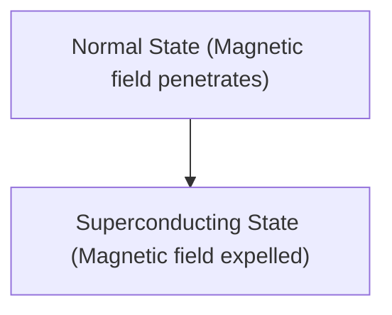

# Physique : Le mécanisme de la supraconductivité

La supraconductivité est un phénomène où la résistance électrique devient nulle.

## Effet Meissner

## Équation de London
$$ \nabla \times \mathbf{J} = -\frac{n_s e^2}{m} \mathbf{B} $$

## Partie de vérification technique supplémentaire 1

Dans cette section, nous approfondirons les détails techniques supplémentaires et les études de cas. Nous évaluerons les performances dans diverses conditions et examinerons les défis et les solutions concernant l'intégration avec d'autres systèmes. Nous discuterons également des perspectives futures et des limites.

