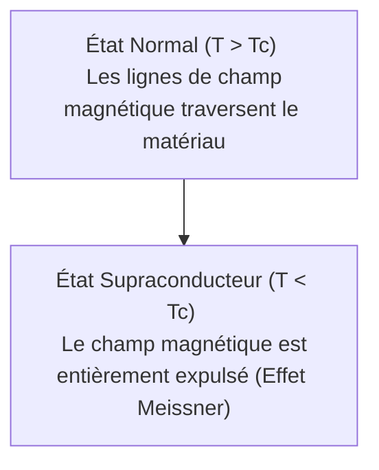

# Physique : Mécanismes de la Supraconductivité - De l'Effet Meissner au Train Maglev et aux Technologies Futures

Parmi les phénomènes physiques capables de repousser les frontières technologiques, la **supraconductivité** occupe une place d'exception. L'absence totale de résistance électrique et l'expulsion intégrale des champs magnétiques transforment en profondeur les réseaux de distribution d'énergie, les transports ferroviaires à très grande vitesse, l'imagerie médicale et [l'informatique quantique](/p/technology-quantum-computer/).

Cet article explore de manière rigoureuse les mécanismes fondamentaux de la supraconductivité : de sa découverte historique et l'électrodynamique de l'effet Meissner, aux principes quantiques microscopiques de la théorie BCS et des paires de Cooper, en passant par les cuprates à haute température critique, les applications industrielles majeures (Maglev, IRM, ITER) et la quête suprême de la supraconductivité à température ambiante.

## 1. Qu'est-ce que la Supraconductivité ? Une Découverte Fondatrice

La supraconductivité est un état quantique macroscopique caractérisé par la disparition brutale et absolue de toute résistance électrique en courant continu dans certains métaux, alliages ou céramiques refroidis en deçà d'une **température critique ($T_c$)**.

Dans les conducteurs ordinaires comme le cuivre ou l'or, les électrons de conduction se heurtent aux vibrations thermiques du réseau cristallin (les phonons) et aux impuretés, dissipant de l'énergie sous forme de chaleur par effet Joule. Dans un supraconducteur sous sa température critique, cette résistance s'annule rigoureusement ($R = 0$). Un courant électrique induit dans une boucle supraconductrice fermée y circule perpétuellement sans apport d'énergie extérieure : c'est le phénomène de **courant persistant**.

Ce phénomène spectaculaire fut découvert en 1911 par le physicien néerlandais **Heike Kamerlingh Onnes** à l'Université de Leyde. Après avoir liquéfié l'hélium à 4,2 Kelvin ($-269^\circ\text{C}$), Onnes mesura la résistance électrique du mercure solide et constata qu'à 4,19 K, elle chutait instantanément à une valeur rigoureusement nulle. Onnes reçut le prix Nobel de physique en 1913 pour cette avancée majeure.

## 2. L'Effet Meissner et le Diamagnétisme Parfait

Un supraconducteur ne se résume pas à un simple conducteur électrique parfait. En 1933, les physiciens allemands **Walther Meissner** et **Robert Ochsenfeld** mirent en évidence une propriété électromagnétique encore plus fondamentale : le **diamagnétisme parfait**, connu sous le nom d'**effet Meissner**.

Lorsqu'un matériau passe à l'état supraconducteur sous un champ magnétique externe, il expulse activement toutes les lignes de flux magnétique de son volume intérieur. Les lignes de champ sont contraintes de contourner le corps supraconducteur.

```mermaid
flowchart TD
    A["État Normal (T > Tc) \n Les lignes de champ magnétique traversent le matériau"] --> B["État Supraconducteur (T < Tc) \n Le champ magnétique est entièrement expulsé (Effet Meissner)"]
```

Pour formaliser ce comportement, les frères Fritz et Heinz London établirent en 1935 les **équations de London**. La seconde équation relie la densité de courant supraconducteur $\mathbf{J}$ à l'induction magnétique $\mathbf{B}$ :

$$ \nabla \times \mathbf{J} = -\frac{n_s e^2}{m} \mathbf{B} $$

Où :
- $\mathbf{J}$ est la densité de courant supraconducteur.
- $n_s$ représente la densité volumique de porteurs supraconducteurs.
- $e$ est la charge élémentaire.
- $m$ est la masse de l'électron.
- $\mathbf{B}$ est le vecteur d'induction magnétique.

Combinée aux équations de Maxwell, cette formulation démontre que le champ magnétique décroît de façon exponentielle depuis la surface sur une distance caractéristique appelée **longueur de pénétration de London ($\lambda_L$)** :

$$ B(x) = B_0 e^{-x / \lambda_L} $$

Au cœur du matériau, le champ magnétique s'annule rigoureusement ($\mathbf{B} = 0$). Lorsqu'on place un aimant au-dessus d'un supraconducteur, des courants d'écran de surface s'organisent pour créer un champ opposé de même intensité, provoquant une spectaculaire **lévitation magnétique quantique**.

## 3. Le Mécanisme Microscopique : La Théorie BCS et les Paires de Cooper

Pendant près d'un demi-siècle, la cause microscopique de la supraconductivité resta incomprise. En 1957, **John Bardeen, Leon Cooper et John Robert Schrieffer** formulèrent la **théorie BCS**, couronnée par le prix Nobel de physique en 1972.

Le cœur de la théorie BCS repose sur l'apparition des **paires de Cooper**. Dans le vide, deux électrons de même charge se repoussent violemment en raison de la force coulombienne. Cependant, au sein d'un réseau cristallin cryogénique, le passage d'un électron polarise positivement le réseau en attirant les ions du réseau (émission d'un phonon virtuel). Avant que la structure ne se détende, cette zone concentrée de charge positive attire un second électron de spin et de quantité de mouvement opposés.

Par l'intermédiaire de ces phonons, une force attractive virtuelle se crée entre les deux électrons :

$$ (\mathbf{k} \uparrow, -\mathbf{k} \downarrow) $$

Les électrons isolés sont des fermions (spin $1/2$), soumis au principe d'exclusion de Pauli. En s'associant en paires de Cooper, ils acquièrent un spin entier 0 et se comportent comme des bosons composites. Sous la température critique, des milliards de paires se condensent dans un état quantique macroscopique unique analogue à un condensat de Bose-Einstein. Les paires d'électrons se meuvent en phase sous une seule et même fonction d'onde. Briser cette onde collective requiert une énergie supérieure à un gap énergétique fini ($\Delta$), ce qui immunise les paires contre toute dissipation thermique ou collision avec les défauts du réseau.

## 4. Les Supraconducteurs à Haute Température Critique (HTS)

La théorie BCS prévoyait qu'une supraconductivité médiée par les phonons conventionnels ne pouvait théoriquement pas dépasser une limite d'environ 30 à 40 K (la limite de McMillan).

En 1986, **Johannes Georg Bednorz** et **Karl Alexander Müller** chez IBM Zurich mirent en évidence une transition supraconductrice à 35 K dans un oxyde céramique de lanthane-baryum-cuivre, pulvérisant cette limite et recevant le prix Nobel dès 1987.

Dès 1987, les chercheurs synthétisèrent l'**YBCO (Yttrium Baryum Cuivre Oxyde)**, dont la température critique s'élève à 93 K. Pour la première fois, la supraconductivité franchissait le **point d'ébullition de l'azote liquide (77 K / $-196^\circ\text{C}$)**. L'azote liquide étant peu coûteux, inoffensif et facile à manipuler par rapport à l'hélium liquide, cette avancée a ouvert la voie à des applications industrielles d'envergure.

La supraconductivité des cuprates à haute température demeure aujourd'hui l'une des grandes énigmes de la physique théorique, car elle implique de fortes corrélations électroniques et des fluctuations d'ondes de spin magnétique que le modèle BCS standard ne peut expliquer à lui seul.

## 5. Applications Industrielles Majeures

La capacité à conduire des densités de courant colossales sans dissipation thermique sous des champs magnétiques intenses révolutionne les technologies de pointe :

### 5.1 Les Trains à Lévitation Magnétique (SCMaglev)
Le train japonais **SCMaglev** utilise des bobines supraconductrices au niobium-titane (NbTi) refroidies à l'hélium liquide. Les courants persistants génèrent des champs de plusieurs teslas qui interagissent avec les bobines de la voie en forme de 8, maintenant la rame en suspension à 10 cm au-dessus du sol et la propulsant à plus de **500 km/h (record du monde à 603 km/h)** sans aucun frottement mécanique.

### 5.2 L'Imagerie par Résonance Magnétique (IRM)
Les appareils d'IRM hospitaliers nécessitent un champ magnétique continu extrêmement intense et homogène de 1,5 à 3,0 Teslas (et jusqu'à 7T en recherche cérébrale). Les électro-aimants supraconducteurs maintiennent ce champ colossal sans consommation d'électricité continue et sans échauffement, assurant des coupes d'une netteté millimétrique des tissus humains.

### 5.3 Accélérateurs de Particules et Fusion Nucléaire
Au CERN, le **Grand Collisionneur de Hadrons (LHC)** utilise plus de 1 200 dipôles supraconducteurs le long d'un anneau de 27 kilomètres pour guider des protons à 99,999999% de la vitesse de la lumière. Dans la quête de l'énergie de fusion, le réacteur expérimental **ITER** emploie de monumentales bobines supraconductrices au niobium-étain ($Nb_3Sn$) pour générer une cage magnétique de 13 Teslas confinant un plasma à 100 millions de degrés Celsius.

### 5.4 Processeurs Quantiques Supraconducteurs
Les plus puissants ordinateurs quantiques actuels (Google Sycamore, IBM Quantum) reposent sur des circuits supraconducteurs. En insérant des barrières isolantes nanométriques (**jonctions Josephson**), les physiciens conçoivent des qubits artificiels manipulables par micro-ondes, exploitant la superposition et l'intrication quantique à des températures de quelques millikelvins.

## 6. La Quête du Supraconducteur à Température Ambiante

Le principal obstacle au déploiement universel de la supraconductivité réside dans le coût des infrastructures cryogéniques.

La découverte d'un **supraconducteur à température ambiante et pression atmosphérique ($T_c > 300\text{ K}$, $P = 1\text{ atm}$)** constituerait une révolution industrielle majeure :
- **Réseaux électriques sans déperdition** : Élimination définitive des 5 à 10% de l'électricité mondiale perdue en ligne sous forme de chaleur.
- **Microprocesseurs sans échauffement** : Des circuits électroniques fonctionnant à des fréquences térahertz sans goulet d'étranglement thermique.
- **Stockage magnétique géant (SMES)** : Capacité de stocker des gigawattheures d'énergie renouvelable avec un rendement de restitution avoisinant 100%.

Ces dernières années, des expériences en cellules à enclumes de diamant ont révélé une supraconductivité proche de 250 K ($-23^\circ\text{C}$) dans des hydrures ($H_3S$, $LaH_{10}$) comprimés à plus de 1,5 million d'atmosphères. Le défi contemporain est désormais de stabiliser ces propriétés extraordinaires à pression ambiante.

## Conclusion : L'Émergence Macroscopique du Monde Quantique

La supraconductivité offre le rare spectacle des lois de la mécanique quantique se matérialisant à notre échelle. De la découverte du mercure par Onnes en 1911 aux calculateurs quantiques et réacteurs de fusion contemporains, cette discipline incarne la puissance de la recherche fondamentale pour transformer le destin technologique de l'humanité.
