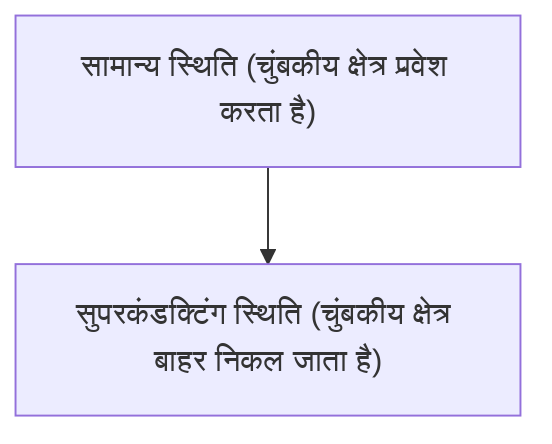

# भौतिक विज्ञान: सुपरकंडक्टिविटी कैसे काम करती है

सुपरकंडक्टिविटी वह घटना है जहां विद्युत प्रतिरोध शून्य हो जाता है।

## मीस्नर प्रभाव

## लंदन समीकरण
$$ \nabla \times \mathbf{J} = -\frac{n_s e^2}{m} \mathbf{B} $$

## अतिरिक्त तकनीकी सत्यापन भाग 1

इस अनुभाग में, हम और अधिक तकनीकी विवरणों और केस स्टडीज में गहराई से जाएंगे। हम विभिन्न परिस्थितियों में प्रदर्शन का मूल्यांकन करेंगे और अन्य प्रणालियों के साथ एकीकरण से संबंधित चुनौतियों और समाधानों की जांच करेंगे। हम भविष्य की संभावनाओं और सीमाओं पर भी विचार करेंगे।

