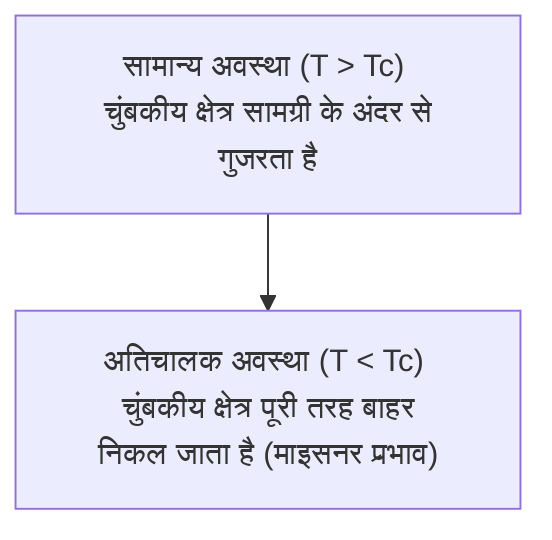

# भौतिकी: अतिचालकता की कार्यप्रणाली - माइसनर प्रभाव से मैग्लेव और भविष्य की तकनीक तक

आधुनिक तकनीक की सीमाओं को तोड़ने वाले भौतिक चमत्कारों में **अतिचालकता (Superconductivity)** का स्थान सबसे ऊपर है। विद्युत प्रतिरोध का शून्य हो जाना और चुंबकीय क्षेत्रों का पूर्ण निष्कासन ऐसी जादुई घटनाएँ हैं जो ऊर्जा संचरण, बुलेट ट्रेनों, चिकित्सा विज्ञान और [क्वांटम कंप्यूटरों](/p/technology-quantum-computer/) में क्रांति ला रही हैं।

यह लेख अतिचालकता के सिद्धांतों, इसके ऐतिहासिक विकास, माइसनर प्रभाव, BCS सिद्धांत, कूपर युग्म, उच्च-तापमान अतिचालकों, व्यावहारिक अनुप्रयोगों और कमरे के तापमान पर अतिचालकता के प्रयासों का संपूर्ण विश्लेषण प्रस्तुत करता है।

## 1. अतिचालकता क्या है? एक ऐतिहासिक खोज

अतिचालकता विशिष्ट धातुओं, मिश्र धातुओं और सिरेमिक पदार्थों की वह अवस्था है जब एक विशेष **क्रांतिक तापमान ($T_c$)** से नीचे ठंडा करने पर उनका डीसी विद्युत प्रतिरोध पूरी तरह शून्य हो जाता है।

सामान्य चालकों (जैसे तांबा या सोना) में जब विद्युत धारा बहती है, तो इलेक्ट्रॉन जालक आयनों (फोनॉन) और अशुद्धियों से टकराते हैं, जिससे ऊर्जा जूल ताप के रूप में नष्ट होती है। अतिचालक अवस्था में यह प्रतिरोध पूरी तरह गायब हो जाता है ($R = 0$)। इसका अर्थ है कि यदि किसी बंद अतिचालक वलय में धारा प्रवाहित की जाए, तो वह बिना किसी बाहरी ऊर्जा के हमेशा बहती रहेगी—इसे **स्थायी धारा (Persistent current)** कहा जाता है।

इसकी खोज 1911 में डच भौतिक विज्ञानी **हाइके कामरलिंघ ओनेस** ने लीडेन विश्वविद्यालय में की थी। तरल हीलियम का उपयोग करके पारे को 4.2 K (लगभग $-269^\circ\text{C}$) तक ठंडा करने पर उन्होंने पाया कि 4.19 K पर पारे का प्रतिरोध अचानक शून्य हो गया। इस खोज के लिए ओनेस को 1913 में भौतिकी का नोबेल पुरस्कार मिला।

## 2. माइसनर प्रभाव और पूर्ण प्रतिचुंबकत्व

अतिचालकता केवल शून्य प्रतिरोध तक सीमित नहीं है। 1933 में जर्मन वैज्ञानिकों **वाल्टर माइसनर** और **रॉबर्ट ओक्सेनफेल्ड** ने पाया कि अतिचालक पदार्थ चुंबकीय क्षेत्र को अपने भीतर से पूरी तरह बाहर धकेल देते हैं। इसे **माइसनर प्रभाव (Meissner effect)** या **पूर्ण प्रतिचुंबकत्व (Perfect diamagnetism)** कहते हैं।

जब कोई पदार्थ क्रांतिक तापमान से नीचे जाता है, तो चुंबकीय क्षेत्र की रेखाएं उसके आर-पार जाने के बजाय उसके चारों ओर मुड़ जाती हैं।

```mermaid
flowchart TD
    A["सामान्य अवस्था (T > Tc) \n चुंबकीय क्षेत्र सामग्री के अंदर से गुजरता है"] --> B["अतिचालक अवस्था (T < Tc) \n चुंबकीय क्षेत्र पूरी तरह बाहर निकल जाता है (माइसनर प्रभाव)"]
```

इस प्रभाव को गणितीय रूप से व्यक्त करने के लिए फ्रिट्ज़ और हेंज लंदन ने 1935 में **लंदन समीकरण (London equations)** दिए। दूसरा लंदन समीकरण धारा घनत्व $\mathbf{J}$ और चुंबकीय क्षेत्र $\mathbf{B}$ के संबंध को दर्शाता है:

$$ \nabla \times \mathbf{J} = -\frac{n_s e^2}{m} \mathbf{B} $$

यहाँ:
- $\mathbf{J}$ अतिचालक धारा घनत्व है।
- $n_s$ अतिचालक इलेक्ट्रॉनों का संख्या घनत्व है।
- $e$ इलेक्ट्रॉन का मूल आवेश है।
- $m$ इलेक्ट्रॉन का द्रव्यमान है।
- $\mathbf{B}$ चुंबकीय प्रवाह घनत्व है।

मैक्सवेल के नियमों के अनुसार, बाहरी चुंबकीय क्षेत्र अतिचालक की सतह पर केवल एक बहुत छोटी गहराई (**लंदन प्रवेश गहराई $\lambda_L$**) तक ही प्रवेश कर सकता है:

$$ B(x) = B_0 e^{-x / \lambda_L} $$

अतिचालक के भीतर चुंबकीय क्षेत्र शून्य होता है ($\mathbf{B} = 0$)। जब किसी अतिचालक के ऊपर चुंबक रखा जाता है, तो सतह पर उत्पन्न विद्युत धाराएं बराबर और विपरीत चुंबकीय बल उत्पन्न करती हैं, जिससे चुंबक हवा में तैरने लगता है—इसे **क्वांटम लेविटेशन (Quantum Levitation)** कहते हैं।

## 3. सूक्ष्मदर्शी तंत्र: BCS सिद्धांत और कूपर युग्म

अतिचालकता की खोज के लगभग आधी सदी बाद 1957 में **जॉन बार्डीन, लियोन कूपर और जॉन रॉबर्ट श्रिफर** ने **BCS सिद्धांत** प्रतिपादित किया (1972 का नोबेल पुरस्कार)।

BCS सिद्धांत का आधार **कूपर युग्म (Cooper pair)** है। सामान्यतः दो इलेक्ट्रॉन एक-दूसरे को प्रतिकर्षित करते हैं। लेकिन अत्यधिक कम तापमान पर जब कोई इलेक्ट्रॉन जालक (Lattice) से गुजरता है, तो वह धनात्मक आयनों को आकर्षित करके जालक में कंपन (फोनॉन) उत्पन्न करता है। इससे बने धनात्मक क्षेत्र की ओर विपरीत स्पिन वाला दूसरा इलेक्ट्रॉन आकर्षित हो जाता है।

इस फोनॉन माध्यम से दोनों इलेक्ट्रॉनों के बीच आकर्षण बल पैदा होता है:

$$ (\mathbf{k} \uparrow, -\mathbf{k} \downarrow) $$

इलेक्ट्रॉन फ़र्मिऑन होते हैं (स्पिन $1/2$), लेकिन दो इलेक्ट्रॉनों का यह जोड़ा कुल 0 स्पिन के साथ बोसॉन की तरह व्यवहार करता है। क्रांतिक तापमान से नीचे अरबों कूपर युग्म एक ही एकल क्वांटम अवस्था में संघनित हो जाते हैं (बोस-आइंस्टीन संघनन की तरह)। यह समूह एक ही तरंग की तरह चलता है। इसे तोड़ने के लिए एक निश्चित ऊर्जा अंतराल ($\Delta$) की आवश्यकता होती है, जिससे जालक की अशुद्धियाँ इलेक्ट्रॉनों को रोक नहीं पातीं और धारा शून्य प्रतिरोध के साथ बहती है।

## 4. उच्च-तापमान अतिचालकता (HTS)

पारंपरिक BCS सिद्धांत का मानना था कि अतिचालकता 30–40 K से अधिक तापमान पर संभव नहीं है (मैकमिलन सीमा)।

लेकिन 1986 में IBM ज्यूरिख के **जॉर्ज बेडनोर्ज़** और **एलेक्जेंडर म्यूलर** ने कॉपर ऑक्साइड (क्यूप्रेट्स) में 35 K पर अतिचालकता खोजी, जिसके लिए उन्हें 1987 में नोबेल पुरस्कार मिला।

इसके तुरंत बाद 1987 में **YBCO (Yttrium Barium Copper Oxide)** की खोज हुई, जिसका क्रांतिक तापमान 93 K था। इसने **तरल नाइट्रोजन के क्वथनांक (77 K / $-196^\circ\text{C}$)** को पार कर लिया। तरल नाइट्रोजन तरल हीलियम की तुलना में बहुत सस्ती और सुरक्षित है, जिससे अतिचालकता का औद्योगिक उपयोग संभव हो सका।

## 5. मानव सभ्यता को बदलने वाले व्यावहारिक अनुप्रयोग

शून्य प्रतिरोध और शक्तिशाली चुंबकीय क्षेत्र आधुनिक विज्ञान की रीढ़ बन चुके हैं:

### 5.1 सुपरकंडक्टिंग मैग्लेव ट्रेनें (SCMaglev)
जापान की **SCMaglev** ट्रेन में तरल हीलियम से ठंडे किए गए अतिचालक चुंबक लगे होते हैं। इनसे उत्पन्न कई टेस्ला का चुंबकीय क्षेत्र ट्रेन को पटरी से 10 सेमी ऊपर उठा देता है और ट्रेन **500 किमी/घंटा से अधिक (रिकॉर्ड 603 किमी/घंटा)** की गति से बिना किसी घर्षण के दौड़ती है।

### 5.2 चिकित्सा में एमआरआई (MRI)
अस्पतालों की एमआरआई मशीन में 1.5 से 3.0 टेस्ला का अत्यधिक स्थिर चुंबकीय क्षेत्र चाहिए होता है। अतिचालक कॉइल्स बिना किसी ऊर्जा हानि और बिना गर्म हुए इस क्षेत्र को वर्षों तक बनाए रखती हैं।

### 5.3 कण त्वरक और परमाणु संलयन
CERN के **लार्ज हैड्रॉन कोलाइडर (LHC)** में 27 किमी की सुरंग में प्रोटॉनों को प्रकाश की 99.999999% गति पर मोड़ने के लिए 1200 से अधिक अतिचालक चुंबक लगे हैं। वहीं **ITER** परमाणु संलयन रिएक्टर में 10 करोड़ डिग्री सेल्सियस के प्लाज्मा को थामने के लिए 13-टेस्ला के अतिचालक चुंबक काम कर रहे हैं।

### 5.4 क्वांटम कंप्यूटर
Google के Sycamore और IBM के क्वांटम प्रोसेसर अतिचालक परिपथों पर आधारित हैं। **जोसेफसन जंक्शन (Josephson Junction)** की मदद से अतिचालक चिप्स पर कृत्रिम क्यूबिट्स बनाए जाते हैं, जो मिलीकेल्विन तापमान पर गणना करते हैं।

## 6. परम लक्ष्य: कमरे के तापमान पर अतिचालकता

अतिचालकता का सबसे बड़ा अवरोध क्रायोजेनिक कूलिंग की भारी लागत है।

यदि **कमरे के सामान्य तापमान और वायुमंडलीय दबाव ($T_c > 300\text{ K}$, $P = 1\text{ atm}$)** पर अतिचालक मिल जाए, तो:
- बिजली लाइनों में होने वाला 5-10% संचरण नुकसान शून्य हो जाएगा।
- बिना गर्म होने वाले कंप्यूटर प्रोसेसर बनेंगे जो टेराहेर्ट्ज़ गति पर चलेंगे।
- विशाल मात्रा में ऊर्जा भंडारण (SMES) संभव होगा।

हाल के वर्षों में अत्यधिक दबाव (लाखों वायुमंडल) पर हाइड्राइड्स ($H_3S$, $LaH_{10}$) में 250 K ($-23^\circ\text{C}$) के करीब अतिचालकता देखी गई है। अब वैज्ञानिक सामान्य दबाव पर ऐसे पदार्थ खोजने में जुटे हैं।

## निष्कर्ष: मैक्रोस्कोपिक दुनिया में क्वांटम चमत्कार

अतिचालकता यह दर्शाती है कि सूक्ष्म क्वांटम नियम हमारी आँखों के सामने कैसे साकार हो सकते हैं। 1911 में ओनेस के पारे से शुरू हुआ सफर आज बुलेट ट्रेनों और क्वांटम कंप्यूटरों तक पहुँच चुका है। अतिचालकता आने वाले समय में भी मानव तकनीकी विकास की सबसे बड़ी प्रेरक शक्ति बनी रहेगी।
