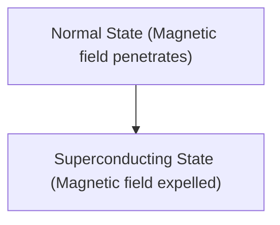

# Fisika: Cara Kerja Superkonduktivitas

Superkonduktivitas adalah fenomena di mana hambatan listrik menjadi nol.

## Efek Meissner

## Persamaan London
$$ \nabla \times \mathbf{J} = -\frac{n_s e^2}{m} \mathbf{B} $$

## Bagian Verifikasi Teknis Tambahan 1

Di bagian ini, kami akan menggali lebih dalam detail teknis dan studi kasus lebih lanjut. Kami akan mengevaluasi kinerja dalam berbagai kondisi dan memeriksa tantangan serta solusi yang berkaitan dengan integrasi dengan sistem lain. Kami juga akan membahas prospek dan batasan di masa depan.

