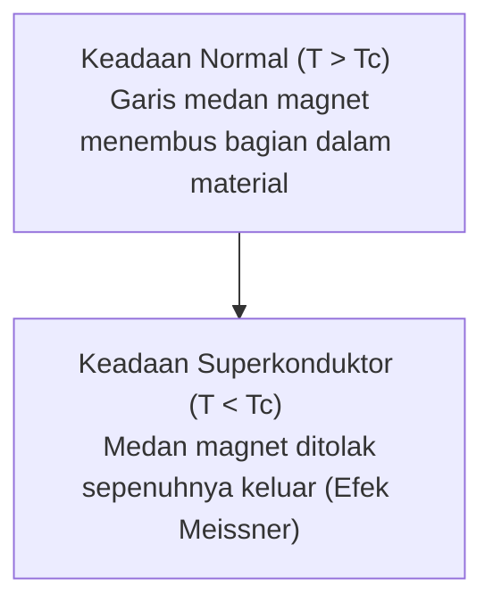

# Fisika: Mekanisme Superkonduktivitas - Dari Efek Meissner Hingga Kereta Maglev dan Teknologi Masa Depan

Di antara sekian banyak fenomena fisika yang mampu mendobrak batasan teknologi modern, **superkonduktivitas (superconductivity)** memiliki kedudukan yang sangat istimewa. Sifat ajaib berupa hilangnya resistansi listrik secara mutlak serta penolakan penuh terhadap medan magnet tengah mentransformasi jaringan transmisi listrik, kereta cepat tanpa roda, pencitraan medis presisi tinggi, hingga [komputer kuantum generasi masa depan](/p/technology-quantum-computer/).

Artikel ini menyajikan pembahasan komprehensif mengenai superkonduktivitas: dari penemuan bersejarahnya di Leiden, elektrodinamika Efek Meissner, mekanisme kuantum mikroskopis Teori BCS dan pasangan Cooper, material kuprat suhu tinggi, implementasi industri (Maglev, MRI, ITER), hingga perburuan superkonduktor suhu ruangan.

## 1. Apa itu Superkonduktivitas? Sejarah Penemuan yang Mengguncang Dunia

Superkonduktivitas adalah keadaan kuantum makroskopis yang dialami oleh logam, paduan, atau senyawa keramik tertentu ketika didinginkan di bawah **suhu kritis ($T_c$)**, ditandai dengan lenyapnya hambatan listrik arus searah (DC) menjadi tepat nol.

Pada konduktor logam biasa seperti tembaga atau emas, elektron yang mengalir akan berbenturan dengan getaran termal kisi kristal (fonon) dan ketidakmurnian atom, membuang energi listrik menjadi panas lewat Efek Joule. Pada keadaan superkonduktor di bawah $T_c$, hambatan ini hilang sepenuhnya ($R = 0$). Artinya, arus listrik yang diinduksikan ke dalam sebuah cincin superkonduktor tertutup akan terus berputar selamanya tanpa membutuhkan pasokan daya eksternal—fenomena yang disebut **arus persisten (persistent current)**.

Keajaiban fisika ini pertama kali ditemukan pada tahun 1911 oleh fisikawan Belanda, **Heike Kamerlingh Onnes**, di Universitas Leiden. Setelah berhasil mencairkan helium pada suhu 4,2 Kelvin ($-269^\circ\text{C}$), Onnes mengukur resistansi listrik merkuri padat dan terkejut saat mendapati nilai hambatan listriknya anjlok seketika ke angka nol pada suhu 4,19 K. Atas pencapaian monumental ini, Onnes dianugerahi Hadiah Nobel Fisika pada tahun 1913.

## 2. Efek Meissner dan Diamagnetisme Sempurna

Superkonduktivitas bukan sekadar konduktor listrik sempurna. Pada tahun 1933, dua fisikawan Jerman, **Walther Meissner** dan **Robert Ochsenfeld**, membuktikan bahwa superkonduktor memiliki sifat elektromagnetik yang jauh lebih mendasar: **diamagnetisme sempurna**, yang kemudian dikenal luas sebagai **Efek Meissner**.

Ketika suatu material bertransisi menjadi superkonduktor di dalam medan magnet eksternal, material tersebut secara aktif menolak dan mengusir seluruh garis gaya magnet keluar dari bagian dalamnya. Alih-alih menembus materi, garis-garis medan magnet dipaksa membelok dan menyusuri bagian luar superkonduktor.

```mermaid
flowchart TD
    A["Keadaan Normal (T > Tc) \n Garis medan magnet menembus bagian dalam material"] --> B["Keadaan Superkonduktor (T < Tc) \n Medan magnet ditolak sepenuhnya keluar (Efek Meissner)"]
```

Untuk merumuskan fenomena ini secara matematis, dua bersaudara Fritz dan Heinz London memperkenalkan **Persamaan London** pada tahun 1935. Persamaan London kedua menghubungkan kerapatan arus superkonduksi $\mathbf{J}$ dengan kerapatan fluks magnetik $\mathbf{B}$:

$$ \nabla \times \mathbf{J} = -\frac{n_s e^2}{m} \mathbf{B} $$

Di mana:
- $\mathbf{J}$ adalah kerapatan arus superkonduksi.
- $n_s$ adalah kerapatan jumlah pembawa muatan superkonduktor.
- $e$ adalah muatan elementer elektron.
- $m$ adalah massa elektron.
- $\mathbf{B}$ adalah kerapatan fluks magnetik.

Berdasarkan perumusan ini dan persamaan Maxwell, medan magnet eksternal terbukti meluruh secara eksponensial di permukaan superkonduktor hingga kedalaman tipis yang disebut **kedalaman penetrasi London ($\lambda_L$)**:

$$ B(x) = B_0 e^{-x / \lambda_L} $$

Di dalam inti superkonduktor, medan magnet bernilai tepat nol ($\mathbf{B} = 0$). Sifat penolakan medan magnet ini membuat magnet permanen yang diletakkan di atas superkonduktor dapat melayang stabil di udara tanpa sentuhan fisik, menghasilkan fenomena memukau yang disebut **levitasi kuantum magnetik**.

## 3. Mekanisme Mikroskopis: Teori BCS dan Pasangan Cooper

Hampir separuh abad setelah penemuan Onnes, mekanisme mikroskopis superkonduktivitas tetap menjadi teka-teki terbesar dalam fisika. Misteri ini terpecahkan pada tahun 1957 oleh **John Bardeen, Leon Cooper, dan John Robert Schrieffer** melalui **Teori BCS** (yang dianugerahi Hadiah Nobel Fisika pada tahun 1972).

Kunci dari Teori BCS adalah terbentuknya **pasangan Cooper (Cooper pairs)**. Pada kondisi biasa, dua elektron saling tolak-menolak karena muatan sejenis. Namun, saat sebuah elektron bergerak melewati kisi kristal pada suhu sangat rendah, muatan negatif elektron menarik inti atom positif di sekitarnya, menimbulkan sedikit distorsi kisi (fonon virtual). Sebelum kisi kembali ke posisi semula, pemusatan muatan positif lokal ini menarik elektron kedua yang memiliki momentum dan spin berlawanan.

Interaksi melalui medium getaran kisi ini menimbulkan gaya tarik efektif bersih antara kedua elektron:

$$ (\mathbf{k} \uparrow, -\mathbf{k} \downarrow) $$

Meskipun elektron tunggal adalah fermion (memiliki spin setengah $1/2$), sepasang elektron yang terikat menjadi pasangan Cooper memiliki total spin bulat 0 dan bertindak layaknya boson komposit. Di bawah suhu kritis, miliaran pasangan Cooper mengembun ke dalam satu keadaan dasar kuantum makroskopis tunggal (serupa dengan kondensat Bose-Einstein). Seluruh pasangan bergerak selaras dalam satu fungsi gelombang makroskopis. Untuk memecah keteraturan ini dibutuhkan energi yang lebih besar daripada celah energi ($\Delta$), sehingga elektron tidak dapat dihamburkan oleh fonon termal maupun cacat kisi, menghasilkan aliran listrik tanpa hambatan sama sekali.

## 4. Superkonduktor Suhu Tinggi (HTS)

Teori BCS konvensional sempat memprediksi bahwa superkonduktivitas berbasis tarikan fonon tidak akan mampu bertahan di atas suhu 30 hingga 40 K (batas McMillan / batas BCS).

Namun, pada tahun 1986, **Johannes Georg Bednorz** dan **Karl Alexander Müller** di laboratorium IBM Zurich menemukan superkonduktivitas pada suhu 35 K pada keramik oksida tembaga-lantanum (kuprat), memecahkan batas teori tersebut dan memenangkan Hadiah Nobel pada tahun 1987.

Setahun kemudian, pada 1987, ditemukan senyawa **YBCO (Yttrium Barium Copper Oxide)** dengan suhu kritis mencapai 93 K. Ini melampaui **titik didih nitrogen cair (77 K / $-196^\circ\text{C}$)**. Nitrogen cair melimpah, tidak berbahaya, dan berpuluh kali lebih murah daripada helium cair, membuka gerbang lebar bagi aplikasi komersial superkonduktivitas.

Mekanisme fisis di balik kuprat suhu tinggi tidak dapat dijelaskan secara utuh hanya dengan teori BCS standar; korelasi elektron kuat dan fluktuasi spin antiferomagnetik memegang peranan penting, menjadikannya salah satu misteri terbesar fisika materi terkondensasi hingga hari ini.

## 5. Aplikasi Teknologi yang Mengubah Dunia

Kemampuan mengalirkan arus listrik masif tanpa kehilangan energi serta kemampuan menciptakan medan magnet superkuat dimanfaatkan dalam berbagai bidang mutakhir:

### 5.1 Kereta Cepat Maglev (SCMaglev)
Teknologi **SCMaglev** di Jepang memanfaatkan magnet superkonduktor niobium-titanium (NbTi) yang didinginkan dengan helium cair. Arus persisten di dalam koil menghasilkan medan magnet beberapa tesla yang berinteraksi dengan jalur pemandu, mengangkat kereta setinggi 10 cm dari tanah dan melesatkannya hingga kecepatan lebih dari **500 km/jam (rekor dunia 603 km/jam)** tanpa gesekan rel.

### 5.2 Alat Pemindai Medis MRI
Mesin pemindai Magnetic Resonance Imaging (MRI) di rumah sakit mengandalkan medan magnet superkuat yang seragam dan stabil antara 1,5 hingga 3,0 Tesla (dan hingga 7T untuk riset otak). Koil superkonduktor mampu mempertahankan medan raksasa ini tanpa membuang daya panas, memungkinkan pencitraan resolusi tinggi untuk jaringan lunak tubuh manusia.

### 5.3 Akselerator Partikel dan Reaktor Fusi Nuklir
Di CERN, **Large Hadron Collider (LHC)** mengerahkan lebih dari 1.200 magnet dipol superkonduktor di sepanjang terowongan cincin 27 kilometer guna mempercepat proton hingga 99,999999% kecepatan cahaya. Dalam pengembangan energi fusi bersih, reaktor eksperimental **ITER** memanfaatkan kumparan superkonduktor niobium-timah ($Nb_3Sn$) untuk menghasilkan kurungan magnet 13 Tesla yang menahan plasma panas bersuhu 100 juta derajat Celsius.

### 5.4 Chip Komputer Kuantum Superkonduktor
Komputer kuantum terdepan seperti Google Sycamore dan IBM Quantum dibangun menggunakan sirkuit superkonduktor. Memanfaatkan **Sambungan Josephson (Josephson Junction)**, para insinyur menciptakan bit kuantum (qubit) buatan yang dikendalikan oleh pulsa gelombang mikro di dalam lemari pendingin bersuhu milikelvin.

## 6. Pengejaran Cawan Suci: Superkonduktor Suhu Ruangan

Satu-satunya penghalang terbesar dari adopsi massal superkonduktivitas adalah tingginya biaya sistem pendingin kriogenik.

Penemuan **superkonduktor suhu ruangan pada tekanan atmosfer ($T_c > 300\text{ K}$, $P = 1\text{ atm}$)** akan memicu revolusi industri berikutnya:
- **Jaringan listrik tanpa kehilangan daya**: Menghemat 5% hingga 10% listrik global yang terbuang sia-sia sebagai panas transmisi kabel.
- **Elektronika bebas panas**: Prosesor berkecepatan terahertz tanpa masalah panas berlebih (thermal throttling).
- **Penyimpanan energi magnetik (SMES)**: Baterai magnetik berkapasitas gigawatt-jam dengan efisiensi mendekati 100%.

Beberapa tahun terakhir, eksperimen menggunakan sel landasan intan pada tekanan ekstrem jutaan atmosfer pada senyawa hidrida ($H_3S$, $LaH_{10}$) mencatat superkonduktivitas mendekati 250 K ($-23^\circ\text{C}$). Tantangan terbesarnya saat ini adalah merekayasa material serupa yang mampu bertahan pada tekanan atmosfer biasa.

## Kesimpulan: Keajaiban Kuantum di Dunia Nyata

Superkonduktivitas adalah bukti nyata bahwa keteraturan mekanika kuantum dapat termanifestasi secara nyata di dunia makroskopis kita. Dari tetesan merkuri beku Onnes pada 1911 hingga reaktor fusi dan komputasi kuantum abad ke-21, superkonduktivitas terus menjadi motor penggerak peradaban teknologi manusia menuju masa depan yang gemilang.
