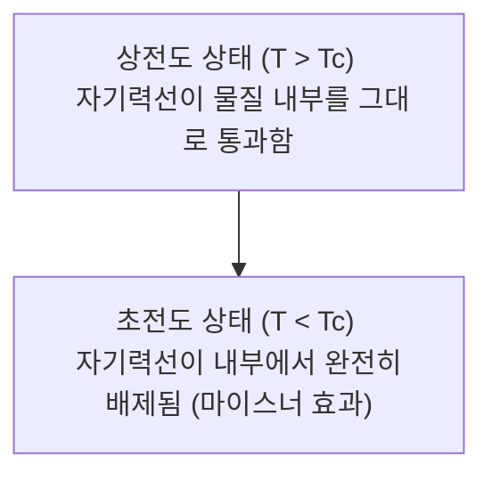

# 물리학: 초전도체의 원리 - 마이스너 효과에서 자기부상열차, 미래 기술까지

현대 과학기술의 물리적 한계를 단숨에 돌파할 수 있는 잠재력을 지닌 경이로운 현상, 바로 **초전도(Superconductivity)** 입니다. 전기저항이 완전히 0이 되고, 내부로 침투하려는 모든 자기장을 밀어내는 마법과도 같은 특성은 에너지 인프라, 초고속 운송, 첨단 의료 진단, 나아가 [차세대 양자 컴퓨터](/p/technology-quantum-computer/)에 이르기까지 문명 전반을 혁신하고 있습니다.

본 글에서는 전문적인 물리학과 첨단 기술의 관점에서 초전도의 역사적 발견부터 마이스너 효과와 런던 방정식의 현상론, 쿠퍼 쌍과 BCS 이론이 밝혀낸 미시적 메커니즘, 고온 초전도체, 자기부상열차와 MRI 및 핵융합로 응용, 그리고 상온 초전도를 향한 인류의 도전에 이르기까지 심도 있게 살펴봅니다.

## 1. 초전도란 무엇인가? 극저온에서의 극적인 발견

초전도란 특정 금속, 합금, 화합물 등의 물질을 극저온으로 냉각했을 때, 물질의 전기저항이 측정 불가능한 수준인 **'완전한 0'** 으로 떨어지는 거시적 양자 현상을 뜻합니다.

구리나 은과 같은 일반 도체에서는 전자가 흐를 때 결정 격자의 열진동(포논)이나 불순물과 충돌하여 줄열(Joule heat)의 형태로 에너지를 잃습니다. 그러나 초전도 상태에서는 이러한 충돌 저항이 완전히 소멸합니다($R = 0$). 따라서 닫힌 고리 모양의 초전도체에 한 번 전류를 유도하면, 외부에서 에너지를 계속 공급하지 않아도 전류가 영구히 회전하는 **영구 전류(Persistent current)** 가 실현됩니다.

이 놀라운 현상은 1911년 네덜란드 라이덴 대학교의 물리학자 **헤이커 카메를링 오너스(Heike Kamerlingh Onnes)** 에 의해 처음 발견되었습니다. 그는 액체 헬륨을 이용해 절대영도에 가까운 4.2 K($-269^\circ\text{C}$)까지 냉각하는 기술을 개발하고 수은의 저항을 측정하던 중, 4.19 K에서 저항이 갑자기 거짓말처럼 0으로 사라지는 현상을 목격했습니다. 오너스는 이 공로로 1913년 노벨 물리학상을 수상했습니다.

## 2. 마이스너 효과와 완전 반자성

초전도체는 단순히 '저항이 0인 이상 도체'에 머무르지 않습니다. 1933년 독일의 물리학자 **발터 마이스너(Walther Meissner)** 와 **로베르트 옥센펠트(Robert Ochsenfeld)** 는 초전도체의 더욱 본질적인 특성인 **마이스너 효과(Meissner effect)**, 즉 **완전 반자성(Perfect diamagnetism)** 을 발견했습니다.

외부 자기장 속에 놓인 물질이 임계온도 이하로 냉각되어 초전도 상태로 전이하면, 물질 내부로 침투해 있던 자기력선이 외부로 완전히 쫓겨나게 됩니다.

이 현상을 수학적으로 기술하기 위해 프리츠 런던과 하인츠 런던 형제는 1935년 **런던 방정식(London equations)** 을 발표했습니다. 제2 런던 방정식은 초전도 전류 밀도 $\mathbf{J}$와 자속 밀도 $\mathbf{B}$ 사이의 관계를 다음과 같이 나타냅니다:

$$ \nabla \times \mathbf{J} = -\frac{n_s e^2}{m} \mathbf{B} $$

여기서:
- $\mathbf{J}$ : 초전도 전류 밀도
- $n_s$ : 초전도 전자 쌍의 수밀도
- $e$ : 전자의 기본 전하량
- $m$ : 전자의 질량
- $\mathbf{B}$ : 자속 밀도

맥스웰 방정식과 결합하면, 외부 자기장이 초전도체 표면에서 **런던 침투 깊이($\lambda_L$)** 라는 극히 얇은 두께(수십〜수백 나노미터)까지만 침투할 수 있고, 내부 깊은 곳에서는 자기장이 지수함수적으로 감쇠하여 완전히 0이 됨을 수학적으로 증명할 수 있습니다:

$$ B(x) = B_0 e^{-x / \lambda_L} $$

완전 반자성 덕분에 초전도체 위에 자석을 올려놓으면, 초전도체 표면에 차폐 초전도 전류가 유도되어 정확히 반대 방향의 자기 반발력을 형성합니다. 이로 인해 자석이 공중에 흔들림 없이 둥둥 떠 있는 극적인 **양자 자기부상** 이 일어납니다.

## 3. 미시적 메커니즘: BCS 이론과 쿠퍼 쌍

발견 이후 반세기 동안 초전도의 미시적 원리는 물리학계의 최대 미스터리였습니다. 이 비밀을 밝혀낸 것이 1957년 **존 바딘(John Bardeen)**, **레온 쿠퍼(Leon Cooper)**, **존 로버트 슈리퍼(John Robert Schrieffer)** 가 정립한 **BCS 이론** 입니다 (이들은 1972년 노벨 물리학상을 수상했습니다).

BCS 이론의 핵심은 **쿠퍼 쌍(Cooper pair)** 의 형성입니다. 원래 전자는 음(-)전하를 띠고 있어 쿨롱 척력에 의해 서로 강하게 밀어냅니다. 그러나 극저온의 결정 격자 속을 전자가 지나갈 때, 음전하가 주변의 양(+)이온 핵들을 끌어당겨 결정 격자에 미세한 변형(포논 진동)을 유발합니다. 이온들이 뭉치면서 국소적인 양전하 밀집 영역이 형성되고, 격자가 복원되기 전에 반대편에서 다가오던 다른 전자가 이 영역으로 이끌립니다.

격자의 포논 매개를 통해 두 전자는 척력을 이겨내고 스핀과 운동량이 반대인 하나의 쌍을 형성합니다:

$$ (\mathbf{k} \uparrow, -\mathbf{k} \downarrow) $$

원래 페르미온(스핀 1/2)인 전자들이 짝을 이루면 총 스핀이 0인 보손(Boson)처럼 행동하게 됩니다. 임계온도 이하에서 수많은 쿠퍼 쌍들은 단 하나의 거시적 양자 바닥상태로 응축(보스-아인슈타인 응축과 유사)되어, 거대한 하나의 단일 파동함수처럼 완벽하게 동기화되어 움직입니다. 이러한 결맞은 상태를 깨뜨리기 위해서는 유한한 에너지 간극($\Delta$) 이상의 에너지가 필요하므로, 열진동이나 불순물에 의해 산란되지 않고 저항 0으로 전기가 흐르게 됩니다.

## 4. 고온 초전도체(HTS)의 발견과 새로운 수수께끼

전통적인 BCS 이론은 포논 매개 초전도 현상이 약 30–40 K 이상에서는 일어날 수 없다고 예측했습니다(맥밀런 한계 / BCS 한계).

그러나 1986년 IBM 취리히 연구소의 **요하네스 게오르크 베드노르츠(Johannes Georg Bednorz)** 와 **카를 알렉산더 뮐러(Karl Alexander Müller)** 가 란타넘-바륨-구리 산화물(cuprate)에서 35 K의 초전도 현상을 발견하며 이 한계를 단숨에 깨뜨렸습니다(1987년 노벨상 수상).

이어 1987년에는 임계온도가 93 K에 달하는 **YBCO(이트륨-바륨-구리 산화물)** 가 합성되었습니다. 이는 **액체 질소의 비등점(77 K / $-196^\circ\text{C}$)** 을 훌쩍 넘는 온도였습니다. 액체 헬륨에 비해 수십 배 저렴하고 다루기 쉬운 액체 질소로 초전도 상태를 유지할 수 있게 되면서, 초전도 기술의 산업적 응용 가능성이 비약적으로 열렸습니다.

그러나 구리 산화물 고온 초전도체의 미시 메커니즘은 단순한 격자 포논 모델로는 완전히 설명되지 않으며, 강상관 전자계 및 반강자성 스핀 요동이 깊게 관여하는 것으로 추정되어 현대 응집물질물리학의 최대 난제 중 하나로 활발히 연구되고 있습니다.

## 5. 인류 문명을 바꾸는 초전도의 응용 기술

저항 0과 초고전류 밀도가 만들어내는 초강력 자기장은 다양한 산업 현장에서 없어서는 안 될 핵심 동력입니다:

### 5.1 초전도 자기부상열차 (SCMaglev)
일본의 '초전도 리니어(SCMaglev)'는 초전도 기술의 정점입니다. 차량에 탑재된 초전도 코일에 영구 전류를 흘려 수 테슬라의 강력한 전자석을 만듭니다. 이를 궤도의 지상 코일과 상호작용시켜 열차를 약 10cm 공중에 부상시킨 뒤, 마찰이 전혀 없는 상태에서 **시속 500km 이상(최고 기록 603km/h)** 의 속도로 질주합니다.

### 5.2 의료 진단의 혁신: MRI (자기공명영상)
병원의 정밀 검진 장비인 MRI 역시 초전도 자석이 핵심입니다. 인체 내부의 미세 조직을 선명하게 촬영하려면 1.5–3.0 테슬라(연구용은 7T 이상)의 강력하고 극도로 균일한 정자장이 필요합니다. 초전도 코일은 열 발생 없이 거대한 자기장을 반영구적으로 안정되게 유지해 줍니다.

### 5.3 입자 가속기와 핵융합 토카막
유럽입자물리연구소(CERN)의 **대형 강입자 충돌기(LHC)** 는 27km에 달하는 지하 원형 터널에 수천 대의 초전도 자석을 배치하여 양성자를 빛의 99.999999%까지 가속합니다. 인류의 궁극적 청정에너지원으로 기대되는 국제열핵융합실험로(**ITER**) 역시 1억 도가 넘는 초고온 플라즈마를 공중에 가두기 위해 13 테슬라급 초대형 초전도 자기장 코일을 사용합니다.

### 5.4 초전도 양자 컴퓨터 칩
구글의 시카모어(Sycamore), IBM의 퀀텀 프로세서 등 세계 최고 수준의 양자 컴퓨터는 초전도 회로를 기반으로 합니다. 초전도 박막 사이에 얇은 절연막을 끼운 **조셉슨 접합(Josephson Junction)** 을 통해 인공적인 양자비트(Qubit)를 형성하고, 양자 중첩과 얽힘을 제어하여 슈퍼컴퓨터로 수천 년 걸릴 계산을 몇 분 만에 해결하는 연산 혁명을 이끌고 있습니다.

## 6. 미래를 향한 궁극의 성배: 상온 초전도의 꿈

초전도 기술의 대중화를 가로막는 유일한 장벽은 '냉각 시스템의 유지 비용'입니다.

만약 **상온·상압(Room-Temperature Superconductor: RTS)** 에서 초전도를 나타내는 물질이 발견된다면, 그것은 산업 전반을 근본적으로 뒤흔드는 제4차 에너지 혁명이 될 것입니다:
- **전력망 송전 손실 제로**: 발전소에서 도심까지 전기를 보낼 때 손실되는 전력(전 세계 발전량의 약 5–10%)이 완전히 사라집니다.
- **초고속 저발열 전자 소자**: 발열이 없어 클록 주파수 한계를 깬 테라헤르츠급 반도체가 실현됩니다.
- **초소형 고효율 에너지 저장(SMES)**: 거의 100%에 달하는 충방전 효율로 기가와트시급 청정에너지를 저장할 수 있습니다.

최근 다이아몬드 앤빌 셀을 이용해 수백만 기압의 초고압 환경에서 수소화물($H_3S$, $LaH_{10}$)을 합성하여 영하 23도(250 K) 안팎의 상온 근접 초전도성을 관측하는 등 연구가 진전을 보이고 있습니다. 상압에서 안정된 상온 초전도체를 찾는 것은 현재 재료과학과 물리학이 도전하는 궁극의 꿈입니다.

## 결론: 거시 세계에 구현된 양자역학의 기적

초전도는 미시적인 양자역학의 결맞음이 우리 눈앞의 거시 세계에 그대로 드러난 가장 아름답고 신비로운 물리 현상입니다. 1911년 오너스가 액체 헬륨 속에서 수은의 저항 0을 목격한 이래, 초전도는 자기부상열차, MRI, 핵융합, 양자 컴퓨터라는 인류 기술의 최전선을 개척해 왔습니다.

상온 초전도를 향한 물리학자들의 지치지 않는 탐구가 이어지는 한, 초전도는 앞으로도 우리가 상상하는 그 이상의 기술적 도약을 선사하며 인류 문명의 미래를 환하게 밝혀줄 것입니다.
