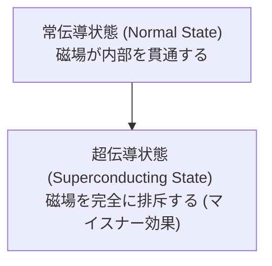

# 物理学: 超伝導の仕組み - マイスナー効果からリニアモーターカー、そして未来のテクノロジーへ

現代のテクノロジーの限界を突破する可能性を秘めた物理現象、「超伝導（Superconductivity）」。電気抵抗が完全にゼロになり、強力な磁場を排斥するという魔法のような性質は、私たちの社会インフラから最先端の医療、さらには[次世代の計算機](/p/technology-quantum-computer/)である量子コンピューターにまで革命をもたらしつつあります。

この記事では、プロのテックブロガーの視点から、超伝導の基本的なメカニズム、その発見の歴史、背後にある物理学的理論から、マイスナー効果、リニアモーターカーなどの具体的な応用例、そして常温超伝導に向けた最新の課題までを徹底的に解説します。

## 1. 超伝導とは何か？ その劇的な発見の歴史

超伝導とは、特定の金属や合金、化合物などの物質を非常に低い温度まで冷却した際に、電気抵抗が「完全にゼロ」になる現象のことです。通常の導体（銅やアルミニウムなど）では、電流が流れる際に電子が原子の振動（フォノン）や不純物と衝突し、ジュール熱としてエネルギーが失われます。しかし、超伝導状態ではこのエネルギー損失が一切発生しません。つまり、一度リング状の超伝導体に電流を流すと、外部からエネルギーを供給しなくても永久に電流が流れ続ける「永久電流」が実現します。

この驚くべき現象は、1911年にオランダの物理学者ヘイケ・カメルリング・オネスによって発見されました。彼は液体ヘリウムを用いた極低温の冷却技術を開発し、水銀を絶対零度に近い4.2 K（約マイナス269度）まで冷却したところ、電気抵抗が突如として消失することを発見しました。この功績により、オネスは1913年にノーベル物理学賞を受賞しています。

## 2. マイスナー効果と完全反磁性

電気抵抗がゼロになることと並んで、超伝導体を特徴づけるもう一つの重要な性質が「マイスナー効果（Meissner effect）」です。1933年にヴァルター・マイスナーとロベルト・オクセンフェルトによって発見されました。

マイスナー効果とは、超伝導体が外部からの磁場を内部から完全に排除しようとする「完全反磁性」の性質を指します。物質が超伝導状態に転移すると、内部に磁力線が侵入できなくなり、磁場が物質の表面を迂回するようになります。

この現象を数式で表すための初期の現象論的モデルとして「ロンドン方程式（London equations）」があります。1935年にフリッツ・ロンドンとハインツ・ロンドン兄弟によって提唱されました。

$$ \nabla \times \mathbf{J} = -\frac{n_s e^2}{m} \mathbf{B} $$

ここで、$\mathbf{J}$は超伝導電流密度、$n_s$は超伝導電子の数密度、$e$は素電荷、$m$は電子の質量、$\mathbf{B}$は磁束密度です。この方程式により、磁場が超伝導体の表面からわずかな深さ（ロンドン侵入長）までしか入り込めず、内部では磁場がゼロになることが数学的に示されます。この性質により、超伝導体の上に磁石を置くと、磁石が空中に浮遊するという視覚的にも非常に興味深い現象（磁気浮上）が引き起こされます。

## 3. なぜ超伝導は起こるのか？ - BCS理論とクーパー対

発見から約半世紀にわたり、超伝導の微視的なメカニズムは物理学における最大の謎の一つでした。この謎を解明したのが、1957年にジョン・バーディーン、レオン・クーパー、ジョン・ロバート・シュリーファーの3人によって提唱された「BCS理論」です（彼らも1972年にノーベル物理学賞を受賞しました）。

BCS理論の核心は、「クーパー対（Cooper pair）」と呼ばれる電子のペアの形成にあります。通常、電子同士はマイナスの電荷を持っているため反発し合います。しかし、極低温の結晶格子の中を電子が移動するとき、電子のマイナス電荷が周囲のプラスの電荷を持った原子核を引き寄せ、格子にわずかな「歪み」を生じさせます。この歪み（フォノン、結晶格子の振動）が局所的なプラスの電荷の集中を作り出し、そこへ別の電子が引き寄せられます。結果として、結晶格子を媒介とする仮想的な引力が発生し、スピンと運動量が反対の2つの電子がペア（クーパー対）を形成します。

クーパー対を形成した電子は、フェルミ粒子（スピンが半整数の粒子）からボース粒子（スピンが整数の粒子）のように振る舞うようになります。ボース粒子は同じ量子状態を多数の粒子が共有できる（ボース＝アインシュタイン凝縮に似た状態）ため、無数のクーパー対が一つの巨大な波のように同期して動くようになります。これにより、結晶格子の不純物や熱振動に散乱されることなく、抵抗ゼロで電流が流れる巨視的な量子現象が生じるのです。

## 4. 高温超伝導体の発見と新たな謎

BCS理論は長らく、超伝導は30 K程度の極低温でしか発生しない（BCS限界）と予測していました。しかし、1986年にヨハネス・ゲオルク・ベドノルツとカール・アレクサンダー・ミュラーが、銅酸化物（ cuprates ）において30 Kを超える高い臨界温度を持つ「高温超伝導体」を発見し、物理学界に衝撃を与えました。

翌年の1987年には、液体窒素の沸点（77 K、約マイナス196度）を超える93 Kで超伝導を示すイットリウム系銅酸化物（YBCO）が発見されました。液体ヘリウムに比べて安価で扱いやすい液体窒素で超伝導状態を維持できるようになったことは、実用化への大きなブレイクスルーとなりました。

しかし、これらの高温超伝導体がなぜ高い温度で超伝導を示すのかは、従来のBCS理論（フォノン媒介による引力）だけでは完全に説明できず、現在でも物性物理学における最大の未解決問題の一つとされています。電子の強い相関や磁気的な相互作用がクーパー対の形成に関与していると考えられており、世界中で活発な研究が続けられています。

## 5. 超伝導の応用技術：リニアモーターカーからMRI、量子計算機まで

電気抵抗ゼロと強力な磁場を生み出す超伝導技術は、すでに様々な分野で私たちの社会に恩恵をもたらしており、さらに革新的な未来のテクノロジーを支える基盤となっています。

### 5.1 リニアモーターカー（磁気浮上式鉄道）
超伝導技術の最も有名な応用例の一つが、日本の「超電導リニア（Maglev）」です。車両に搭載された超伝導コイルに永久電流を流し、極めて強力な電磁石を作り出します。これと軌道（ガイドウェイ）側に設置されたコイルとの間の磁力による反発と吸引を利用して、車体を約10cm浮上させ、時速500km以上の超高速で非接触走行します。摩擦がないため、エネルギー効率が高く、騒音や振動も少なく、次世代の高速交通システムとして期待されています。

### 5.2 医療分野におけるMRI（磁気共鳴画像装置）
病院の検査で使われるMRIも、超伝導電磁石が不可欠な装置です。人体内部の詳細な断面画像を得るためには、強力で均一、かつ極めて安定した磁場が必要です。超伝導コイルを用いることで、発熱を伴わずに数テスラという強力な磁場を長時間維持することができ、高解像度の診断画像を撮影することが可能になります。

### 5.3 粒子加速器と核融合炉
欧州原子核研究機構（CERN）の大型ハドロン衝突型加速器（LHC）では、陽子などの素粒子を光速の99.9999%以上にまで加速し、衝突させて宇宙の謎を探求しています。この素粒子を円形軌道に曲げ、ビームを収束させるためには、数千台の巨大な超伝導電磁石が使用されています。また、究極のクリーンエネルギーとして期待される核融合炉（ITERなど）でも、1億度を超えるプラズマを空中に閉じ込めるために強力な超伝導コイルが使用されています。

### 5.4 量子コンピューターへの応用
近年注目を集めているのが、超伝導量子回路を用いた量子コンピューターです。Googleの「Sycamore」やIBMの量子プロセッサなどは、極小の超伝導回路（ジョセフソン接合）を用いて人工的な量子ビット（qubit）を構築しています。超伝導状態を利用することで、量子特有の「重ね合わせ」や「もつれ」といった繊細な状態を制御し、従来のスーパーコンピューターでは数千年かかる計算を数分で解くような計算革命を起こしつつあります。

## 6. 未来への挑戦：室温超伝導の夢

超伝導技術の社会実装における最大のネックは、「極低温への冷却コスト」です。液体ヘリウムや液体窒素を用いた冷却システムは大規模かつ高価であり、送電線などの長距離インフラに適用するにはまだ多くのハードルがあります。

もし「室温（常温）かつ常圧」で超伝導を示す物質が発見されれば、それは人類の歴史を変えるほどの産業革命を引き起こします。発電所から家庭への送電ロス（現在は全発電量の数％を占める）が完全にゼロになり、バッテリーの充電効率は劇的に向上し、発熱のない超高性能な電子デバイスが実現します。

近年では、超高圧下（数百万気圧）における水素を多く含む化合物（水素化物）において、室温に近い臨界温度が報告されるなど、室温超伝導への道のりは少しずつ、しかし確実に前進しています。常圧での室温超伝導体の発見は、現在の材料科学と物性物理学における究極の「聖杯」と言えるでしょう。

## おわりに

超伝導は、量子力学の不思議な世界が私たちの目に見えるスケールで現れた、最も美しく神秘的な物理現象の一つです。100年以上前にオネスが発見した「抵抗ゼロ」の驚きは、リニアモーターカーとして疾走し、医療の最前線を支え、さらには量子コンピューターという新たな地平を切り拓いています。

高温超伝導のメカニズムの完全な解明や室温超伝導の実現など、まだ解き明かされるべき謎と課題は多く残されています。しかし、物理学者たちの探求と技術者たちの情熱が続く限り、超伝導は今後も私たちの想像を超えるテクノロジーの飛躍をもたらしてくれることでしょう。これからの超伝導研究の最前線から、ますます目が離せません。
